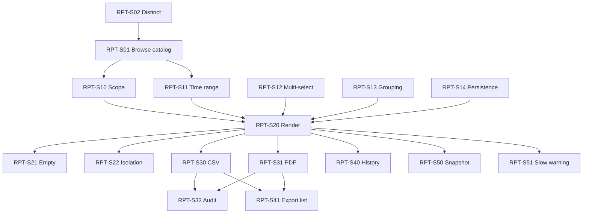

# Report Center User Stories

## Purpose

Agile user stories for the **Report Center** slice, V1. Each story is
Jira-ready with acceptance criteria in **Given / When / Then** format.
Stories trace upward to requirements in
[`report-center-requirements.md`](../01-requirements/report-center-requirements.md)
and downward to tasks in
[`report-center-tasks.md`](../06-tasks/report-center-tasks.md).

## Personas

| Persona | Description |
|---------|-------------|
| **Org Analyst (Alice)** | Reviews cross-team efficiency for leadership reporting |
| **Delivery Lead (Dan)** | Owns one or more teams; tracks team-level throughput |
| **Project Manager (Pat)** | Runs retrospectives and needs per-project efficiency history |
| **Platform Admin (Pam)** | Oversees the Report Center itself, audits exports |

---

## Epic: RPT-E1 — Report Catalog

### Story RPT-S01 — Browse report catalog

> **As** a delivery lead
> **I want** to browse a catalog of available reports grouped by category
> **So that** I can pick the right analysis for the question I'm trying to answer

**Traces to:** REQ-RPT-10, REQ-RPT-11..15

**Acceptance Criteria**

- **Given** I land on `/reports`
  **When** the page finishes loading
  **Then** I see the **Efficiency** category with 5 report cards
  (Lead Time, Cycle Time, Throughput, WIP, Flow Efficiency)
- **Given** I am on the catalog page
  **When** I view a report card
  **Then** I see its name, a one-line description, and the scopes it supports
- **Given** V2 categories (Quality, Stability, Governance, AI Contribution)
  are not yet built
  **When** the catalog renders
  **Then** those categories are shown as **disabled** placeholders with a
  "Coming soon" label — no click-through
- **Given** I click a report card for an enabled report
  **When** the navigation completes
  **Then** I am on `/reports/{reportKey}` with that report's filter form
  ready to configure

---

### Story RPT-S02 — Clear distinction from Dashboard

> **As** an org analyst
> **I want** Report Center to feel different from Dashboard
> **So that** I don't confuse realtime signals with historical analysis

**Traces to:** REQ-RPT-01, REQ-RPT-03

**Acceptance Criteria**

- **Given** I open Report Center
  **When** the page renders
  **Then** the page header identifies it as **"Report Center — historical,
  filterable, exportable"**
- **Given** I view any report
  **When** I read the metadata
  **Then** I see a `snapshotAt` timestamp and a "this is a point-in-time
  snapshot" note — distinct from Dashboard's "live" badge
- **Given** I look at the navigation
  **When** I compare Dashboard and Report Center nav entries
  **Then** they use different icons and Dashboard is labelled "Live"
  while Report Center is labelled "History"

---

## Epic: RPT-E2 — Filter and Scope

### Story RPT-S10 — Select scope hierarchy

> **As** an org analyst
> **I want** to scope any report to org / workspace / project
> **So that** I can zoom from the full organization down to one project

**Traces to:** REQ-RPT-02, REQ-RPT-20, REQ-RPT-70, REQ-RPT-71, REQ-RPT-72

**Acceptance Criteria**

- **Given** I open a report detail page
  **When** I open the scope selector
  **Then** I can pick **Org**, **Workspace**, or **Project**
- **Given** I pick **Workspace**
  **When** the scope selector updates
  **Then** I see only the workspaces I have access to
- **Given** I pick **Org** but do not hold the org-viewer role
  **When** the scope selector renders
  **Then** the **Org** option is disabled with tooltip
  "Requires org-viewer role"
- **Given** I manipulate the URL to force a scope I cannot access
  **When** the page loads
  **Then** the backend returns 403 and the UI shows
  "You don't have access to this scope"

---

### Story RPT-S11 — Time range filter

> **As** a project manager
> **I want** to filter reports by a time range
> **So that** I can run the same report for different periods (e.g. sprint-over-sprint)

**Traces to:** REQ-RPT-21

**Acceptance Criteria**

- **Given** I open any report
  **When** I open the time-range filter
  **Then** I see presets: last 7 days, last 30 days, last 90 days,
  quarter-to-date, year-to-date, custom
- **Given** I pick **custom**
  **When** the custom picker appears
  **Then** I can pick a start date and an end date, with end ≥ start
- **Given** I pick any time range and apply
  **When** the report re-renders
  **Then** all visualizations, tables, headline metrics, and exports reflect
  the new range

---

### Story RPT-S12 — Multi-select entities

> **As** a delivery lead
> **I want** to compare multiple teams or multiple projects in one report
> **So that** I can see relative performance side-by-side

**Traces to:** REQ-RPT-22

**Acceptance Criteria**

- **Given** scope = Workspace
  **When** I open the team multi-select
  **Then** I can pick any subset of the workspaces I have access to
- **Given** I pick 3 workspaces
  **When** the report renders
  **Then** the grouping dimension shows 3 series, one per workspace
- **Given** I pick more than 10 entities
  **When** I try to apply
  **Then** the UI warns "Comparing more than 10 entities may reduce chart
  readability" but still renders

---

### Story RPT-S13 — Grouping dimension

> **As** an analyst
> **I want** to pick how results are grouped
> **So that** I can pivot the same data by week, by team, or by stage

**Traces to:** REQ-RPT-23

**Acceptance Criteria**

- **Given** I'm on a report that supports multiple groupings
  **When** I open the grouping selector
  **Then** I see only the grouping options that the report definition declares
- **Given** I change grouping
  **When** the report re-renders
  **Then** both chart and drilldown table restructure around the new grouping

---

### Story RPT-S14 — Session-scoped filter persistence

> **As** a user
> **I want** my filter selections to persist while I navigate around
> **So that** I don't lose my context when I leave and return

**Traces to:** REQ-RPT-24

**Acceptance Criteria**

- **Given** I set filters on a report and navigate to the catalog
  **When** I return to the same report in the same session
  **Then** my previous filters are restored
- **Given** I close the tab and reopen later
  **When** the new session starts
  **Then** filters return to defaults (no persistence across sessions in V1)

---

## Epic: RPT-E3 — Render and View

### Story RPT-S20 — Render headline / chart / table

> **As** a user
> **I want** every report to show a headline strip, a visualization, and a table
> **So that** I have scannable, visual, and detailed views of the same data

**Traces to:** REQ-RPT-30

**Acceptance Criteria**

- **Given** a report has rendered successfully
  **When** I view the page
  **Then** I see a headline metric strip (2 to 4 KPIs), a primary chart, and
  a drilldown table — in that order
- **Given** the report defines a chart type
  **When** the chart renders
  **Then** it matches the type defined in §3 of the requirements
  (histogram / stacked bar / grouped bar / heatmap / horizontal bar)
- **Given** I want raw numbers
  **When** I scroll to the drilldown table
  **Then** the table columns match the chart's dimensions and values

---

### Story RPT-S21 — Empty state

> **As** a user
> **I want** a clear empty state when my filters match no data
> **So that** I know it's not a bug and I can recover

**Traces to:** REQ-RPT-31

**Acceptance Criteria**

- **Given** my filters return zero rows
  **When** the report would render
  **Then** I see a friendly message naming the filter combination and a
  "Reset filters" button
- **Given** I click "Reset filters"
  **When** filters reset to defaults
  **Then** the report re-queries and rerenders

---

### Story RPT-S22 — Section-level loading and error isolation

> **As** a user
> **I want** errors in one section to not break the whole report
> **So that** I can still see partial results and retry what failed

**Traces to:** REQ-RPT-32

**Acceptance Criteria**

- **Given** the chart takes > 500ms
  **When** it is loading
  **Then** a skeleton is shown in the chart area only — header and filters
  remain interactive
- **Given** the chart fails but the drilldown succeeds
  **When** the page renders
  **Then** the chart shows an inline error with "Retry"; the drilldown
  renders normally
- **Given** I click "Retry"
  **When** the retry completes
  **Then** the failed section re-renders without reloading the page

---

## Epic: RPT-E4 — Export

### Story RPT-S30 — Export to CSV

> **As** an analyst
> **I want** to export a report's drilldown as CSV
> **So that** I can share raw data or process it in Excel

**Traces to:** REQ-RPT-40, REQ-RPT-43

**Acceptance Criteria**

- **Given** a rendered report
  **When** I click **Export → CSV**
  **Then** a CSV download starts within 10 seconds for datasets ≤ 100k rows
- **Given** the CSV download completes
  **When** I open it
  **Then** columns match the drilldown table and timestamps are ISO 8601
- **Given** the drilldown exceeds 100k rows
  **When** I click Export → CSV
  **Then** I see "Dataset too large (X rows). Please narrow your filters."
  and no file is produced

---

### Story RPT-S31 — Export to PDF

> **As** a delivery lead
> **I want** to export a report as a formatted PDF
> **So that** I can attach it to a retrospective deck or email to a stakeholder

**Traces to:** REQ-RPT-41

**Acceptance Criteria**

- **Given** a rendered report
  **When** I click **Export → PDF**
  **Then** the PDF downloads within 20 seconds and includes:
  the title, scope, time range, generation time, the KPI strip (as text),
  the chart (as embedded image), and the drilldown table (as a table)
- **Given** the PDF is open
  **When** I read the first page
  **Then** the header identifies the org/workspace/project scope and the
  human-readable time range

---

### Story RPT-S32 — Export audit trail

> **As** a platform admin
> **I want** every export recorded in an audit log
> **So that** I can answer "who exported what, when" for governance review

**Traces to:** REQ-RPT-42

**Acceptance Criteria**

- **Given** a user exports a CSV or PDF
  **When** the export completes
  **Then** an audit record is persisted with user ID, report key, scope,
  filter JSON, format, and timestamp
- **Given** I query the audit store
  **When** I search by user or by report key
  **Then** I can reconstruct the exact filter used

---

## Epic: RPT-E5 — History

### Story RPT-S40 — Recent report runs

> **As** a frequent user
> **I want** to see my recent report runs
> **So that** I can re-open a past filter combination quickly

**Traces to:** REQ-RPT-50

**Acceptance Criteria**

- **Given** I have run reports before
  **When** I open the "History" tab on the catalog page
  **Then** I see up to 50 recent runs with report name, scope summary, time
  range, and run timestamp
- **Given** I click a history entry
  **When** the navigation completes
  **Then** I'm on that report with its exact filters pre-applied

---

### Story RPT-S41 — Downloadable exports with 7-day retention

> **As** a user
> **I want** a separate list of my exports with download links
> **So that** I can re-download a recent PDF without re-running the report

**Traces to:** REQ-RPT-51

**Acceptance Criteria**

- **Given** I open the "Exports" tab
  **When** the page loads
  **Then** I see my exports from the last 7 days with report name, format,
  timestamp, and a **Download** link
- **Given** an export is older than 7 days
  **When** I view the list
  **Then** the record is absent (the audit log retains the fact of the
  export; the file is purged)

---

## Epic: RPT-E6 — Performance and Freshness

### Story RPT-S50 — Snapshot freshness label

> **As** a user
> **I want** to see when the data in a report was last refreshed
> **So that** I don't mistake yesterday's snapshot for realtime data

**Traces to:** REQ-RPT-60, REQ-RPT-61

**Acceptance Criteria**

- **Given** a rendered report
  **When** I view the header
  **Then** I see `Data as of: <snapshotAt>` in human-readable relative form
  (e.g. "12 minutes ago")
- **Given** the snapshot is older than 24 hours
  **When** the page renders
  **Then** the label shows a warning color

---

### Story RPT-S51 — Graceful slow-render warning

> **As** a user
> **I want** a warning when a query is slow, not a failure
> **So that** I still get results and can decide whether to narrow next time

**Traces to:** REQ-RPT-80, REQ-RPT-81

**Acceptance Criteria**

- **Given** a render exceeds 2.5 seconds
  **When** the result eventually returns
  **Then** a non-blocking banner appears: "This took longer than expected —
  consider narrowing your filter"
- **Given** a render exceeds 30 seconds
  **When** the client times out
  **Then** the section shows a timeout error with Retry and Narrow Filter
  actions

---

## Story Dependency Map

---

## Release Plan

**Milestone M1 — Catalog and Render (MVP)**
RPT-S01, RPT-S02, RPT-S10, RPT-S11, RPT-S13, RPT-S20, RPT-S21, RPT-S22, RPT-S50

**Milestone M2 — Filter richness + Export**
RPT-S12, RPT-S14, RPT-S30, RPT-S31, RPT-S32, RPT-S51

**Milestone M3 — History**
RPT-S40, RPT-S41
