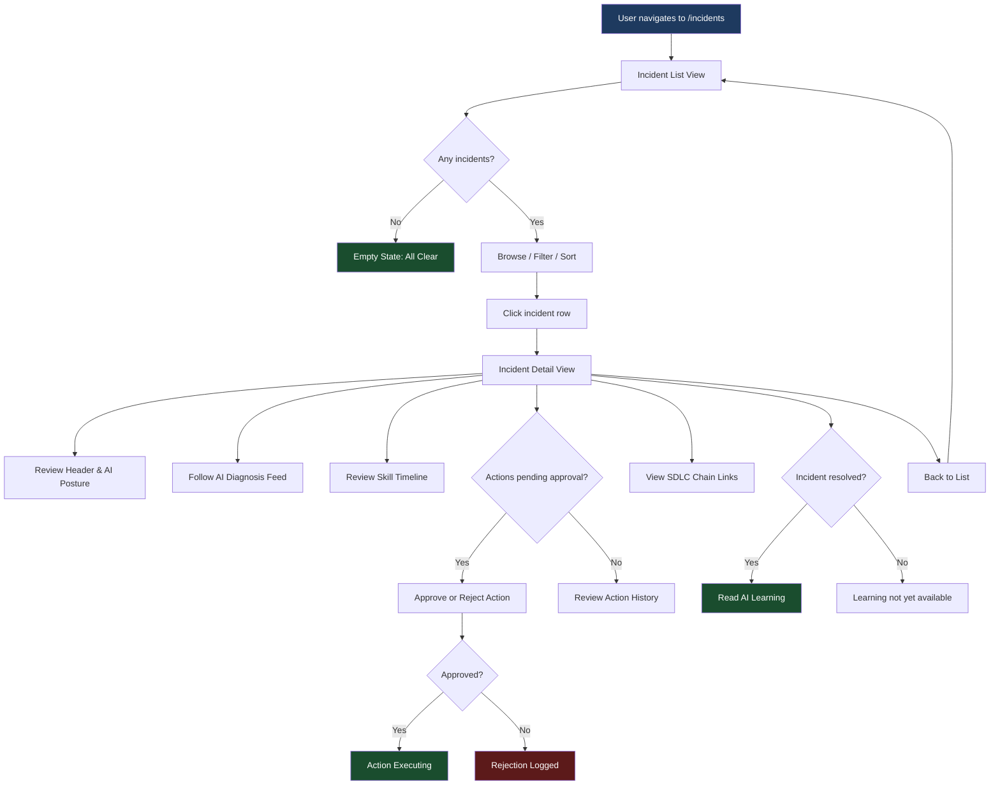
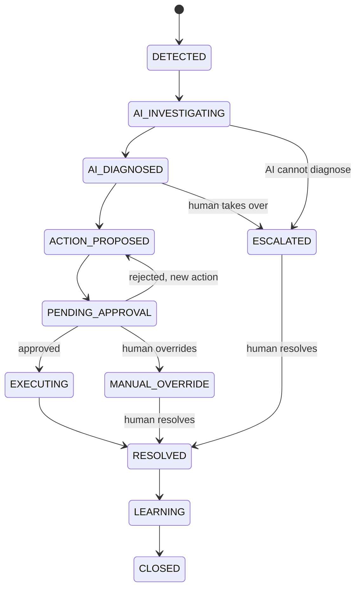

# Feature Specification: Incident Management

> **Source stories:** S1–S10 from [incident-stories.md](../02-user-stories/incident-stories.md)
> **Spec status:** Draft
> **Last updated:** 2026-04-16

---

## Overview

**Feature summary:**
The Incident Management page is an AI-native operational command center where AI is the
primary executor and humans govern. It replaces the traditional ITSM ticket view with an
inverted execution model: Signal → AI Detection → AI Diagnosis → AI Action → Human
Governance → Resolution → Learning.

**Business objective:**
Demonstrate that AI-native incident handling reduces MTTR, shifts human effort from execution
to governance, and produces actionable learning that prevents recurrence — making the product's
most differentiated value proposition tangible.

**In-scope outcome:**
A fully functional incident page (mocked data in Phase A, live API in Phase B) with an incident
list view, a detail view containing AI diagnosis feed, skill execution timeline, action
approval/rejection, governance audit trail, SDLC chain traceability, and AI learning section.

---

## Source Stories

| Story | Title / Summary | Key Capability |
|-------|----------------|----------------|
| S1 | View Active Incident List | Incident list with severity, status, handler type, filtering |
| S2 | Review Incident Header and AI Control Posture | Header with AI autonomy level and control mode |
| S3 | Follow AI Diagnosis in Real-Time Feed | Live-style diagnosis feed with findings and suggestions |
| S4 | Review AI/Skill Execution Timeline | Chronological timeline of incident-related skill executions |
| S5 | Approve or Reject AI-Proposed Actions | Action governance with approve/reject controls |
| S6 | Review Human Governance History | Audit trail of all human governance decisions |
| S7 | Trace Incident Back to SDLC Chain | Related SDLC artifact traceability |
| S8 | Read AI Learning and Prevention Recommendations | Post-resolution learning and prevention |
| S9 | Navigate Between Incident List and Detail Views | Routing and deep-linking |
| S10 | Handle Loading, Error, and Empty States | Loading, error, empty, and partial states |

---

## Actors / Users

**Primary actors** (directly interact with the system):
- **SRE / DevOps engineer**: Triages incidents, follows AI diagnosis, approves/rejects AI actions
- **Team lead / Delivery manager**: Reviews incident impact, governance posture, SDLC chain links
- **Platform admin / Auditor**: Audits governance decisions, reviews AI execution history

**Supporting actors** (indirectly involved):
- **Management / Visitor**: Reads AI value metrics from incident resolution (via Dashboard)
- **Architect**: Traces incidents back to design/spec decisions via SDLC chain

---

## Functional Scope

**Core capability domains:**
- **Incident List & Triage**: List, filter, sort incidents; severity distribution summary
- **Incident Header & AI Posture**: Incident identity, status state machine, AI control context
- **AI Diagnosis**: Real-time diagnostic feed with signals, findings, root cause hypothesis
- **Skill Execution Timeline**: Chronological audit of AI skill invocations per incident
- **AI Action Governance**: Actions taken/proposed, approve/reject controls, rollback indicators
- **Human Governance Audit**: Approval history, overrides, escalations, policy references
- **SDLC Chain Traceability**: Related artifacts from Requirement through Deployment
- **AI Learning & Prevention**: Post-resolution root cause, patterns, prevention recommendations

**Lifecycle stages:**
1. Incident detected (signal correlation)
2. AI investigation (diagnosis skills running)
3. AI diagnosis complete (root cause hypothesis)
4. Action proposed (remediation plan)
5. Pending human approval (governance gate)
6. Action executing (approved actions in flight)
7. Resolved (incident mitigated)
8. Learning (post-incident analysis)
9. Closed (learning captured, incident archived)

**Workflow boundaries:**
- Entry point: User navigates to `/incidents` from shared shell navigation
- Exit point: Incident reaches Closed state with learning captured
- Out-of-band transitions: Escalation (AI → Human), Manual Override, Rollback

---

## Functional Requirements

### Incident List & Triage

- **FR-01**: The page displays a list of incidents scoped to the current workspace context. *(Source: S1)*
- **FR-02**: Each incident row shows: ID (e.g., INC-0422), title, priority (P1–P4), current status, handler type (AI / Human / Hybrid). *(Source: S1)*
- **FR-03**: Active incidents are shown by default; resolved incidents are available via tab or filter toggle. *(Source: S1)*
- **FR-04**: Incidents are sortable by severity, recency, and duration. *(Source: S1)*
- **FR-05**: Critical incidents (P1) use the `--color-incident-crimson` design token for visual flagging. *(Source: S1; verified: `variables.css:33`)*
- **FR-06**: A severity distribution summary (e.g., "2 P1, 3 P2, 1 P3") is displayed at the top of the list. *(Source: S1)*
- **FR-07**: Filtering is supported by priority, status, handler type, and date range. *(Source: S1)*
- **FR-08**: Clicking an incident row navigates to the detail view. *(Source: S1, S9)*

### Incident Header & AI Posture

- **FR-10**: The incident detail view header displays: ID, title, priority, current status. *(Source: S2)*
- **FR-11**: Header shows the handler type (AI / Human / Hybrid) with a visual indicator. *(Source: S2)*
- **FR-12**: Header shows the current AI autonomy level (display only in V1). *(Source: S2)*
- **FR-13**: Header shows the current control mode: Auto / Approval / Manual. *(Source: S2)*
- **FR-14**: Key timestamps are displayed: detected, acknowledged, resolved (or in-progress duration). *(Source: S2)*
- **FR-15**: Status follows the state machine defined in the Data / Configuration section below. *(Source: S2)*

### AI Diagnosis Feed

- **FR-20**: The incident detail includes an "AI Diagnosis" card with a chronological feed. *(Source: S3)*
- **FR-21**: Each feed entry shows: timestamp, text description, entry type (analysis / finding / suggestion / conclusion). *(Source: S3)*
- **FR-22**: Suggestions are visually distinguished using the secondary/cyan accent. *(Source: S3; verified: existing mockData uses `type: 'suggestion'` with cyan styling)*
- **FR-23**: Feed uses JetBrains Mono (technical font) in log-style formatting. *(Source: S3; verified: `design.md §3` specifies JetBrains Mono for technical data)*
- **FR-24**: Root cause hypothesis displays a confidence indicator (High / Medium / Low). *(Source: S3)*
- **FR-25**: Affected components and blast radius are listed when available. *(Source: S3)*

### Skill Execution Timeline

- **FR-30**: The detail view includes a "Skill Execution Timeline" section. *(Source: S4)*
- **FR-31**: Each timeline entry shows: skill name, start/end timestamps, status (running / completed / failed / pending approval). *(Source: S4)*
- **FR-32**: Supported skill types: incident-detection, incident-correlation, incident-diagnosis, incident-remediation, incident-learning. *(Source: S4)*
- **FR-33**: Each entry displays a brief input summary and output/result summary. *(Source: S4)*
- **FR-34**: Evidence references are linked where available. *(Source: S4)*
- **FR-35**: Timeline is ordered chronologically (oldest first). *(Source: S4)*

### AI Action Governance

- **FR-40**: The detail view includes an "AI Actions" card listing all actions taken or proposed. *(Source: S5)*
- **FR-41**: Each action shows: description, type (automated / requires approval), execution status (pending / approved / rejected / executed / rolled back), timestamp. *(Source: S5)*
- **FR-42**: Actions pending approval display Approve and Reject buttons. *(Source: S5)*
- **FR-43**: Approving triggers a state transition to "executing"; rejecting prompts for a reason and logs the rejection. *(Source: S5)*
- **FR-44**: Impact assessment is visible for each proposed action. *(Source: S5)*
- **FR-45**: Rollback capability is indicated for reversible actions. *(Source: S5)*
- **FR-46**: Policy constraints that triggered the approval requirement are visible. *(Source: S5, S6)*

### Human Governance Audit

- **FR-50**: The detail view includes a "Governance" section showing complete governance history. *(Source: S6)*
- **FR-51**: Section displays: pending approvals, approval/rejection history, manual overrides, escalation history. *(Source: S6)*
- **FR-52**: Each governance action shows: who, when, action taken, and reason. *(Source: S6)*
- **FR-53**: Escalation path is visible when an incident was escalated from AI to human. *(Source: S6)*

### SDLC Chain Traceability

- **FR-60**: The detail view includes a "Related SDLC Chain" section. *(Source: S7)*
- **FR-61**: Chain shows related objects: Requirement, Spec, Design, Code Change, Test, Deployment. *(Source: S7)*
- **FR-62**: Spec node is always visible even when the chain is compressed. *(Source: S7; verified: PRD §13.1 requires Spec visibility in compressed views)*
- **FR-63**: Collapsed nodes are indicated with an expand control. *(Source: S7)*
- **FR-64**: Each linked object shows ID, title, and a navigation link. *(Source: S7)*
- **FR-65**: If no SDLC relationships exist, display "No linked artifacts" message. *(Source: S7)*

### AI Learning & Prevention

- **FR-70**: The detail view includes an "AI Learning" section visible when incident is in Learning or Closed state. *(Source: S8)*
- **FR-71**: Section shows: confirmed root cause, pattern identified, prevention recommendations. *(Source: S8)*
- **FR-72**: Prevention recommendations include suggested policy/configuration changes. *(Source: S8)*
- **FR-73**: A "knowledge base entry created" indicator is present when learning is captured. *(Source: S8)*
- **FR-74**: For unresolved incidents, this section displays "Learning will be available after resolution". *(Source: S8)*

### Navigation & States

- **FR-80**: Incident list is the default view at `/incidents`. *(Source: S9; verified: route at `router/index.ts:33`)*
- **FR-81**: Detail view is accessible via `/incidents/:incidentId`. *(Source: S9)*
- **FR-82**: Detail view has back-navigation to return to the list. *(Source: S9)*
- **FR-83**: Deep-linking to a specific incident via URL is supported. *(Source: S9)*
- **FR-84**: Page renders inside the shared shell with context bar and AI panel. *(Source: S9; verified: existing `IncidentManagementView.vue` uses `view-container` class)*
- **FR-90**: Loading state shows skeleton placeholders or spinner. *(Source: S10)*
- **FR-91**: Error state shows error message with retry option. *(Source: S10)*
- **FR-92**: Empty state shows "All clear — no active incidents" with positive framing. *(Source: S10)*
- **FR-93**: Partial failure shows per-card error states, not full page error. *(Source: S10)*

---

## Non-Functional Requirements

- **Security**: All incident data is scoped to the current workspace. Governance actions (approve/reject)
  require authenticated user identity. V1 does not implement per-action role-based access control.
- **Auditability**: All governance actions (approve, reject, escalate, override) must be recorded with
  actor, timestamp, and reason. This feeds into the platform audit system (PRD §16.2).
- **Performance**: Incident list view target: p95 < 2s initial load. Detail view target: p95 < 3s
  initial load (7 sections). V1 defers formal performance testing — targets are advisory for
  design decisions. V1 uses on-load fetch (no WebSocket). Polling interval for "live feel" is
  optional in V1.
- **Environment support**: Works with H2 (local dev) and Oracle (production). Frontend Phase A
  uses mocked data with no backend dependency.

---

## Workflow / System Flow

### User Flow Diagram

### Main Flow

1. User navigates to `/incidents` from the shared shell left navigation
2. System loads the incident list scoped to the current workspace
3. List displays active incidents by default with severity distribution summary
4. User filters or sorts incidents by priority, status, handler type, or date range
5. User clicks an incident to open the detail view
6. Detail view loads all cards: header, diagnosis, timeline, actions, governance, SDLC chain, learning
7. Each card loads independently — partial failure shows per-card error state
8. User reviews AI diagnosis feed to understand investigation progress
9. If actions are pending approval, user reviews impact assessment and approves or rejects
10. Approved actions transition to executing state; rejected actions are logged with reason
11. User reviews SDLC chain to understand which artifacts are related
12. Once incident is resolved, user reads AI learning and prevention recommendations
13. User navigates back to the incident list or to linked SDLC artifact pages

---

## Data / Configuration Requirements

**Key entities:**

| Entity | Description | Key Attributes |
|--------|-------------|----------------|
| Incident | An operational incident in a workspace | id, title, priority (P1–P4), status, handlerType, controlMode, autonomyLevel, timestamps (detected, acknowledged, resolved), workspaceId |
| DiagnosisEntry | A single entry in the AI diagnosis feed | timestamp, text, entryType (analysis / finding / suggestion / conclusion) |
| SkillExecution | A record of an AI skill invocation | skillName, startTime, endTime, status (running / completed / failed / pending_approval), inputSummary, outputSummary, evidenceRefs |
| IncidentAction | An action taken or proposed by AI | description, actionType (automated / requires_approval), executionStatus, timestamp, impactAssessment, isRollbackable |
| GovernanceEntry | A human governance action on an incident | actor, timestamp, actionTaken (approve / reject / escalate / override), reason, policyRef |
| SdlcChainLink | A link from an incident to an SDLC artifact | artifactType (requirement / spec / design / code / test / deploy), artifactId, artifactTitle, routePath |
| AiLearning | Post-resolution AI analysis | rootCause, patternIdentified, preventionRecommendations[], knowledgeBaseEntryCreated |

**Statuses / state machine:**

Valid states:
- `DETECTED`
- `AI_INVESTIGATING`
- `AI_DIAGNOSED`
- `ACTION_PROPOSED`
- `PENDING_APPROVAL`
- `EXECUTING`
- `RESOLVED`
- `LEARNING`
- `CLOSED`
- `ESCALATED` (override)
- `MANUAL_OVERRIDE` (override)

Valid transitions:

**Validation rules:**
- Incident ID follows the pattern `INC-NNNN`
- Priority is one of: P1, P2, P3, P4
- Handler type is one of: AI, Human, Hybrid
- Control mode is one of: Auto, Approval, Manual
- Reject action requires a non-empty reason string

---

## Integrations

**Internal platform integrations:**
- **Shared Shell**: Incident page renders inside the shared app shell (context bar, nav, AI panel)
- **Dashboard**: Dashboard stability card links to `/incidents` for drill-down
- **Audit Management**: Governance actions feed into the platform audit system
- **AI Center**: Skill executions reference skills registered in AI Center

**External systems (future, out of scope for V1):**
- ServiceNow: Bi-directional incident sync
- PagerDuty / OpsGenie: Alert routing and escalation
- Monitoring systems: Signal ingestion

**APIs / interfaces:**
- `GET /api/v1/incidents` — list incidents (inbound, new)
- `GET /api/v1/incidents/:id` — incident detail (inbound, new)
- Existing patterns: `ApiResponse<T>` envelope (verified: `shared/dto/ApiResponse.java`), `fetchJson<T>` client (verified: `shared/api/client.ts`)

---

## Dependencies

**Upstream dependencies:**
- **Shared App Shell**: Must be deployed (verified: exists and functional)
- **Vue Router config**: Incident route must exist (verified: `router/index.ts:33`)
- **Design tokens**: Incident crimson color must exist (verified: `variables.css:33`)
- **API patterns**: `ApiResponse<T>` and `SectionResult<T>` patterns must exist (verified: both exist)

**Downstream dependencies:**
- **Dashboard**: Stability card links to `/incidents` — dashboard expects incident page to exist
- **SDLC module pages**: SDLC chain links navigate to module pages (may show "Coming Soon" placeholder)

---

## Risks / Ambiguities

| # | Description | Type | Impact | Recommendation |
|---|-------------|------|--------|----------------|
| R-01 | Skill execution timeline and diagnosis feed may overlap in content | Gap | Med | Define clear separation: feed = AI reasoning narrative; timeline = discrete skill invocations with metadata |
| R-02 | Governance section and AI Actions section both show approval actions | Gap | Med | Define governance section as the audit-focused historical view; AI Actions as the operational action-focused view |
| R-03 | "Real-time feel" for diagnosis feed is undefined in V1 | Unclear | Low | V1 uses static mocked data; define a manual refresh button as minimum; auto-polling is optional |
| R-04 | SDLC chain links require cross-domain data that doesn't exist yet | Assumption | Low | V1 uses mocked chain links; actual linking requires backend integration across domains |
| R-05 | Autonomy level values and their meanings are not defined in the PRD | Gap | Med | Define a simple 3-level model for V1: Level 1 (Manual), Level 2 (Suggest + Approve), Level 3 (Auto + Post-audit) |

---

## Out of Scope

- **Real-time WebSocket push**: V1 uses on-load fetch or manual refresh
- **External system sync**: No PagerDuty, ServiceNow, or OpsGenie integration in V1
- **Automated rollback without approval**: V1 requires human approval for all remediation actions
- **AI model training from incidents**: Learning section is display-only
- **Cross-workspace incident correlation**: Incidents are strictly workspace-scoped
- **Mobile-optimized views**: Desktop-first in V1
- **Changing autonomy level from UI**: Display only in V1
- **Advanced search / full-text search**: Basic filtering only

---

## Open Questions

| # | Question | Raised from | Owner |
|---|----------|-------------|-------|
| OQ-01 | What are the concrete autonomy level definitions? (Suggest 3-level: Manual / Suggest+Approve / Auto+Post-audit) | S2, R-05 | Product |
| OQ-02 | Should the diagnosis feed and skill timeline be rendered as separate cards or combined into one chronological view? | S3, S4, R-01 | Design |
| OQ-03 | Should the governance section be a standalone card or integrated into the AI Actions card? | S5, S6, R-02 | Design |
| OQ-04 | What is the maximum number of incidents to display before requiring pagination? | S1 | Product |
| OQ-05 | Should the incident list support multi-select for bulk actions (e.g., bulk acknowledge)? | Inferred | Product |
