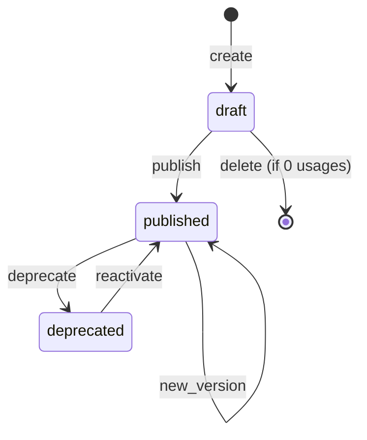
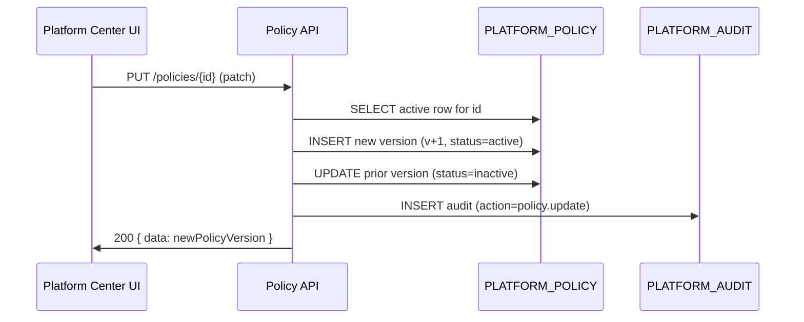

# Platform Center Spec

## Overview

The Platform Center slice delivers the platform-administration surface that houses the six platform capabilities defined in PRD §12.1–§12.6: Template Management, Configuration Management, Audit Management, Access Management, Policy & Governance, and Integration Framework. It is the source of truth for reusable, governance-critical platform objects.

This spec is the **implementation contract** for the slice. It binds the upstream requirements and user stories to concrete functional rules, NFRs, data entities, interfaces, and integration points.

## Source

- [platform-center-requirements.md](../01-requirements/platform-center-requirements.md)
- [platform-center-stories.md](../02-user-stories/platform-center-stories.md)
- [agentic_sdlc_control_tower_prd_v0.9.md](../01-requirements/agentic_sdlc_control_tower_prd_v0.9.md) — PRD §11.13, §12.1–§12.6, §16

## Actors

| Actor | Description | V1 role mapping |
|-------|-------------|-----------------|
| Platform Administrator | Single V1 persona with full Platform Center access | `PLATFORM_ADMIN` |
| Auditor | Read-only consumer of audit records (V2 — data model ready, UI deferred) | `AUDITOR` |
| System (backend) | The Platform Center backend itself when writing audit events for its own mutations | `system` actor tag |
| External integration | Adapter workers (Jira/GitLab/Jenkins/ServiceNow) invoked by a future sync worker slice | not a direct user |

## Functional Scope

### FR-01: Single-page admin shell

Platform Center is mounted at route `/platform` inside the shared app shell. It renders a two-pane layout: left-rail sub-section selector + main content area. Sub-section routes use nested paths: `/platform/templates`, `/platform/configurations`, `/platform/audit`, `/platform/access`, `/platform/policies`, `/platform/integrations`.

**Source:** S-PC-01, S-PC-03; REQ-PC-70

### FR-02: Route-level permission gate

Every Platform Center route must be guarded by a `PLATFORM_ADMIN` check. Non-admin access renders a 403 state with guidance and a "Back to Dashboard" action.

**Source:** S-PC-02; REQ-PC-03

### FR-03: Default sub-section

On initial visit, `/platform` redirects to `/platform/templates`.

**Source:** S-PC-01

---

### FR-10: Template catalog API

`GET /api/v1/platform/templates` returns a filterable list of templates. Supported query parameters: `kind`, `status`, `ownerId`, `q` (keyword search over name/key), `limit` (default 50, max 200), `cursor`.

Response payload is a `CursorPage<Template>` envelope (see FR-90).

**Source:** S-PC-10; REQ-PC-10

### FR-11: Template detail with inheritance resolution

`GET /api/v1/platform/templates/{id}?scope={workspace|application|project}:{id}` returns the template record plus a resolved-inheritance section that lists, per overridable field, the winning layer and the values at each of the four layers (Platform / Application / SNOW Group / Project).

**Source:** S-PC-11; REQ-PC-11

### FR-12: Template versions

`GET /api/v1/platform/templates/{id}/versions` returns the full version list. `GET /api/v1/platform/templates/{id}/versions/{versionId}` returns a single version's stored body.

**Source:** S-PC-12; REQ-PC-12

### FR-13: Template lifecycle transitions

`POST /api/v1/platform/templates/{id}/publish`, `.../deprecate`, `.../reactivate` trigger the corresponding status transitions. Transitions must:

- Validate current status is in the allowed source set for the target transition
- Write a `config_change` audit record atomically with the transition
- Return the updated template record

`DELETE /api/v1/platform/templates/{id}` removes a `draft` template if `usageCount = 0`; otherwise returns 409 with the list of referencing scopes.

**Source:** S-PC-13, S-PC-14; REQ-PC-13

### FR-14: Template versioning on body change

Any change to a template's body (not metadata) must produce a new version record rather than mutating the existing one. The previous version's status does not change automatically; only a successful publish of the new version triggers deprecation of the prior one.

**Source:** REQ-PC-12

---

### FR-20: Configuration catalog API

`GET /api/v1/platform/configurations` returns configurations filterable by `kind`, `scopeType`, `scopeId`, `status`, `q`. Response is a `CursorPage<Configuration>`.

**Source:** S-PC-20; REQ-PC-20

### FR-21: Override creation

`POST /api/v1/platform/configurations` with `{ parentId, scopeType, scopeId, body }` creates an override. The body must validate against the schema bundle for the configuration kind; validation failure returns 422.

**Source:** S-PC-21; REQ-PC-21, REQ-PC-22

### FR-22: Override revert

`DELETE /api/v1/platform/configurations/{id}` deletes the override only if it is not the platform-default row. Returns 409 if the target is a platform default.

**Source:** S-PC-22; REQ-PC-22

### FR-23: Drift indicator

`GET /api/v1/platform/configurations/{id}/drift` returns `{ hasDrift: boolean, driftFields: string[], platformDefault: ConfigBody }`. Drift is computed by deep-comparing the override body with the platform default body for the same `kind` and `key`.

**Source:** S-PC-23; REQ-PC-23

---

### FR-30: Audit log catalog API

`GET /api/v1/platform/audit` returns audit records filterable by `category`, `actor`, `objectType`, `objectId`, `outcome`, `scopeType`, `scopeId`, `timeRange` (24h / 7d / 30d / custom), `limit`, `cursor`. Response is a `CursorPage<AuditRecord>`.

**Source:** S-PC-30, S-PC-31; REQ-PC-30, REQ-PC-31

### FR-31: Audit detail API

`GET /api/v1/platform/audit/{id}` returns the full audit record including before/after payloads, actor context, scope, and any evidence reference ids.

**Source:** S-PC-32; REQ-PC-30

### FR-32: No audit write API surface

The Platform Center HTTP surface never exposes POST/PATCH/DELETE on `/api/v1/platform/audit`. Audit records are created in-transaction by every mutation across the slice (see FR-86) and are immutable.

**Source:** REQ-PC-33

---

### FR-40: Role assignment catalog API

`GET /api/v1/platform/access/assignments` returns assignments filterable by `userId`, `role`, `scopeType`, `scopeId`, with cursor pagination.

**Source:** S-PC-40; REQ-PC-41

### FR-41: Assign role

`POST /api/v1/platform/access/assignments` with `{ userId, role, scopeType, scopeId }` creates an assignment. Valid roles are `PLATFORM_ADMIN`, `WORKSPACE_ADMIN`, `WORKSPACE_MEMBER`, `WORKSPACE_VIEWER`, `AUDITOR`. Valid `scopeType` values are `platform`, `application`, `workspace`, `project`; `platform` scope uses sentinel id `"*"`.

**Source:** S-PC-41; REQ-PC-42, REQ-PC-43

### FR-42: Revoke role

`DELETE /api/v1/platform/access/assignments/{id}` revokes an assignment. Writes a `permission_change` audit record with action `role.revoke`.

**Source:** S-PC-42; REQ-PC-42

### FR-43: Last-admin guard

Revoking an assignment with `role = PLATFORM_ADMIN` where the mutation would leave zero active `PLATFORM_ADMIN` assignments returns 409 with code `LAST_PLATFORM_ADMIN`.

**Source:** S-PC-43; REQ-PC-86

---

### FR-50: Policy catalog API

`GET /api/v1/platform/policies` returns policies filterable by `category`, `status`, `scopeType`, `scopeId`, `boundTo`, `q`. Response is a `CursorPage<Policy>`.

**Source:** S-PC-50; REQ-PC-50

### FR-51: Create policy

`POST /api/v1/platform/policies` creates a new policy at version `v1`, status `active`. Required fields depend on `category`; see platform-center-data-model.md for per-category field sets.

**Source:** S-PC-51; REQ-PC-51

### FR-52: Edit policy (new version)

`PUT /api/v1/platform/policies/{id}` produces a new version by: inserting a new row with incremented `version`, copying fields + applying patch, setting `status = active`; the previous version row is updated to `status = inactive`. Both changes are written in a single transaction.

**Source:** S-PC-52; REQ-PC-52

### FR-53: Add policy exception

`POST /api/v1/platform/policies/{id}/exceptions` creates an exception entry with `{ reason, requesterId, approverId, expiresAt }`. The exception is effective until `expiresAt`.

`DELETE /api/v1/platform/policies/{id}/exceptions/{exceptionId}` revokes an exception early.

**Source:** S-PC-53; REQ-PC-52

### FR-54: Activate/deactivate policy

`POST /api/v1/platform/policies/{id}/activate` and `/deactivate` transition `status`. Deactivating an active policy flips `status` to `inactive` without creating a new version.

**Source:** REQ-PC-52

---

### FR-60: Adapter registry API

`GET /api/v1/platform/integrations/adapters` returns a static list of supported adapter kinds: `jira`, `confluence`, `gitlab`, `jenkins`, `servicenow`, `custom-webhook`. Each entry includes a capability descriptor (what the adapter can sync, supported modes).

**Source:** S-PC-60; REQ-PC-60

### FR-61: Connection catalog API

`GET /api/v1/platform/integrations/connections` returns connections filterable by `kind`, `scopeWorkspaceId`, `status`, `syncMode`. Response is a `CursorPage<Connection>`. Credential values are **never** returned; only `credentialRef` (an opaque reference).

**Source:** S-PC-60, S-PC-61; REQ-PC-61, REQ-PC-62

### FR-62: Create connection

`POST /api/v1/platform/integrations/connections` creates a connection with `{ kind, scopeWorkspaceId, credentialRef, syncMode, pullSchedule?, pushUrl? }`. Validates: `credentialRef` format, `syncMode ∈ { 'pull', 'push', 'both' }`, and that schedule / URL are provided consistently with `syncMode`.

**Source:** S-PC-61; REQ-PC-61, REQ-PC-64

### FR-63: Test connection

`POST /api/v1/platform/integrations/connections/{id}/test` performs a synthetic call (per adapter kind) and returns `{ ok: boolean, latencyMs: number, message?: string }` within 10 seconds (timeout). Writes an audit record of kind `integration.test`.

**Source:** S-PC-62; REQ-PC-63

### FR-64: Enable / disable connection

`POST /api/v1/platform/integrations/connections/{id}/enable` and `/disable` toggle `status`. No credential re-validation is performed on toggle.

**Source:** S-PC-63; REQ-PC-61

---

### FR-70: Catalog empty state

Each catalog view must render an empty state when the backing endpoint returns zero records. Empty state content differs per sub-section:

| Sub-section | Primary message | Primary action |
|-------------|-----------------|----------------|
| Templates | "No templates have been created yet" | "Create template" |
| Configurations | "No configurations yet" | "Create configuration" |
| Audit | "No audit events match your filters" | (none) |
| Access | "No role assignments yet" | "Assign role" |
| Policies | "No policies yet" | "Create policy" |
| Integrations | "No connections yet" | "Create connection" |

**Source:** S-PC-70; REQ-PC-72

### FR-71: Catalog error state

Any 5xx or network error on a catalog fetch renders an inline error panel inside the catalog area with a Retry action; the Platform Center shell remains interactive.

**Source:** S-PC-71; REQ-PC-72

### FR-72: Destructive confirmation

The following actions render a destructive confirmation dialog naming the target: template `Delete`, policy `Deactivate`, access `Revoke`, configuration `Revert to parent`, integration `Disable`. The primary action button uses destructive color (see `design.md` Critical token).

**Source:** S-PC-72; REQ-PC-73

---

### FR-80: Workspace-context binding

All Platform Center pages display the active workspace chip from the shared app shell's workspace-context store. The chip is informational only; it does not filter catalog views (since Platform Center shows cross-workspace data). Catalog rows that are workspace-scoped display an explicit workspace chip on the row.

**Source:** REQ-PC-81

### FR-81: Consistent cursor pagination

All catalog endpoints use cursor pagination with opaque `cursor` strings (base64-encoded `{lastId, lastTimestamp}`). No offset-based pagination anywhere.

**Source:** REQ-PC-85

### FR-82: Shared API response envelope

Non-list endpoints return `{ "data": <entity> }` on success. List endpoints return `{ "data": [...], "pagination": { "nextCursor": string|null, "total": number|null } }`. Errors return `{ "error": { "code": string, "message": string, "details"?: object } }` at the top level. HTTP status codes align conventionally: 200/201/204 on success, 400 for validation, 403 for forbidden, 404 for missing, 409 for conflict (e.g., last-admin, in-use delete), 422 for schema validation, 500 for unexpected.

**Source:** REQ-PC-84, consistent shared-app-shell patterns

---

### FR-86: Atomic audit on mutation

Every mutation endpoint must write its corresponding audit record in the same database transaction as the primary change. Audit write failures must roll back the primary change. This applies to: template publish/deprecate/reactivate/delete, configuration create/update/delete, role assign/revoke, policy create/update/activate/deactivate/exception-add/exception-remove, connection create/test/enable/disable/delete.

**Source:** REQ-PC-86

---

## Non-Functional Requirements

| ID | NFR | Target |
|----|-----|--------|
| NFR-01 | Catalog p95 response | ≤ 500ms for ≤ 500 records |
| NFR-02 | Audit list page size | default 50, max 200 |
| NFR-03 | Platform Center page initial render | ≤ 2s wall-clock on a warm browser cache |
| NFR-04 | Test connection timeout | hard 10s |
| NFR-05 | Audit retention | minimum 365 days |
| NFR-06 | Credential confidentiality | credential values must never leave the server; only `credentialRef` is returned |
| NFR-07 | Build health | `npm run build` and `./mvnw test` both pass |
| NFR-08 | Test coverage | ≥ 1 controller test per sub-section (6 min) + ≥ 1 repository integration test per entity |
| NFR-09 | Package structure | all entities under `com.sdlctower.platform.{template,configuration,audit,access,policy,integration}` |
| NFR-10 | Schema management | all new tables and changes via Flyway, starting at V40 |
| NFR-11 | Frontend state management | Pinia stores per sub-section; no global megastore |
| NFR-12 | API field naming | camelCase in JSON, snake_case in DB |

---

## Workflow — User Session

```mermaid
flowchart TD
    A[User clicks Platform Center nav] --> B{Has PLATFORM_ADMIN role?}
    B -- no --> C[Render 403 state]
    B -- yes --> D[Route /platform -> /platform/templates]
    D --> E[Fetch templates catalog]
    E --> F[Render catalog + sub-section rail]
    F --> G{User action}
    G -- Switch sub-section --> H[Navigate /platform/{sub}]
    G -- Open detail --> I[Fetch detail endpoint]
    G -- Apply filter --> J[Refetch catalog with filters]
    G -- Destructive action --> K[Show confirm modal]
    K -- Confirm --> L[POST/DELETE + audit in same tx]
    L --> M[Refetch affected view]
    K -- Cancel --> F
    H --> E
    I --> F
    J --> F
    M --> F
```

## Workflow — Template Status State Machine



## Workflow — Policy Edit Produces New Version



## Entities

| Entity | Primary purpose | Key fields |
|--------|-----------------|-----------|
| `Template` | Reusable template record with versions | id, key, kind, name, status, ownerId, currentVersionId |
| `TemplateVersion` | Versioned body snapshot of a template | id, templateId, version, body (JSON), createdAt, createdBy |
| `Configuration` | Configuration entry with scope and parent | id, key, kind, scopeType, scopeId, parentId, body, status |
| `AuditRecord` | Append-only audit event | id, timestamp, actor, actorType, category, action, objectType, objectId, scope, outcome, payloadJson |
| `RoleAssignment` | Binding of user → role → scope | id, userId, role, scopeType, scopeId, grantedBy, grantedAt |
| `Policy` | Governance policy (versioned, scoped, bound) | id, key, category, scopeType, scopeId, boundTo, version, status, body |
| `PolicyException` | Exception carve-out on a policy | id, policyId, reason, requesterId, approverId, expiresAt |
| `Connection` | Adapter instance (integration configuration) | id, kind, scopeWorkspaceId, credentialRef, syncMode, pullSchedule, pushUrl, status, lastSyncAt |

Full entity attribute tables live in [platform-center-data-model.md](../04-architecture/platform-center-data-model.md).

## Integrations

### Internal

| Integration | Direction | Purpose | Status |
|-------------|-----------|---------|--------|
| `shared-app-shell` workspace-context | read | Fetch active workspace for scope chips | [Verified] endpoint exists |
| `shared-app-shell` navigation | read | Consume nav entry `platform` | [Verified] seeded in backend |
| `ai-center` run detail route | deep-link | Audit `skill_execution` records link to `/ai-center/runs/{id}` | [Assumption] AI Center route pattern |
| `incident` detail route | deep-link | Audit `incident_event` records link to `/incidents/{id}` | [Verified] route exists |

### External

| Integration | Direction | Purpose | V1 status |
|-------------|-----------|---------|-----------|
| Jira | configured-only | Credential + sync config stored; actual sync deferred | [Verified] scope |
| GitLab | configured-only | same | [Verified] |
| Jenkins | configured-only | same | [Verified] |
| ServiceNow | configured-only | same | [Verified] |
| Secret store (for `credentialRef`) | read | Resolve credentials at `test` / `sync` time | [Assumption] a secret-store abstraction exists; V1 uses a stub |

## Dependencies

- `shared-app-shell` slice (nav + workspace chip) — must be complete [Verified]
- A secret-store stub (for credentials) — to be created in this slice's backend as a simple in-memory + `credential_ref` mapping table; production wiring deferred
- Flyway migrations numbered V40+ (next available) for schema changes

## Risks & Tradeoffs

| Risk | Impact | Mitigation |
|------|--------|-----------|
| Policy runtime enforcement not in this slice | Consumers may have inconsistent enforcement logic | Document policy resolver API contract explicitly; provide a resolver interface in `platform/policy/` that consumer slices call |
| Credential storage is stubbed in V1 | Secrets may leak via logs or migrations if not careful | Never return plain credentials through any API; log only `credentialRef`; add a test asserting credential strings don't appear in logs |
| Audit write in same transaction blocks hot-path mutations | Mutation latency increases | Audit writes are single-row inserts; budget remains within NFR-01 for V1 volume |
| Template inheritance resolution on every detail fetch | Slow when chain grows | V1 resolves inline (acceptable at ≤ 4 layers); V2 can add a cache |
| `AUDITOR` role is not UI-wired in V1 | Governance gap | Document clearly in REQ-PC-40 that V1 gates on `PLATFORM_ADMIN` only |
| Last-admin guard can be bypassed via direct DB access | Lockout possible | Scope is "don't lock the UI out"; full DB-level guard requires a trigger, deferred |

## Out of Scope

- Policy runtime evaluation engine
- ABAC editor UI
- Skill registry editor (lives in AI Center)
- WYSIWYG template / layout editor
- CSV / PDF export of audit records
- Automated drift remediation
- Time-bounded role elevation ("JIT admin")
- SSO / identity provider configuration
- Bulk user import / directory sync
- Multi-tenant federation

## Open Questions

| Q | Default answer (unless user changes) |
|---|---|
| How are users identified across the platform (email vs. internal UUID)? | Internal UUID; email is a display hint — matches existing patterns |
| Does the audit log include reads? | No — V1 records only mutations; reads are not audited |
| Does creating a `draft` template also create a first `TemplateVersion`? | Yes — creation initializes `v1` with an empty body |
| If a policy is deactivated, do exceptions remain? | Yes — exceptions are orphaned but preserved for audit |
| Who can test a connection? | Only `PLATFORM_ADMIN` in V1 |
| Is there a "System" user for seed data audit records? | Yes — actor `system`, actorType `system` |
