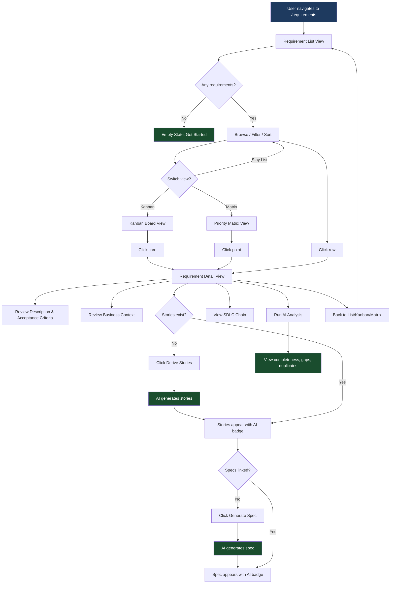
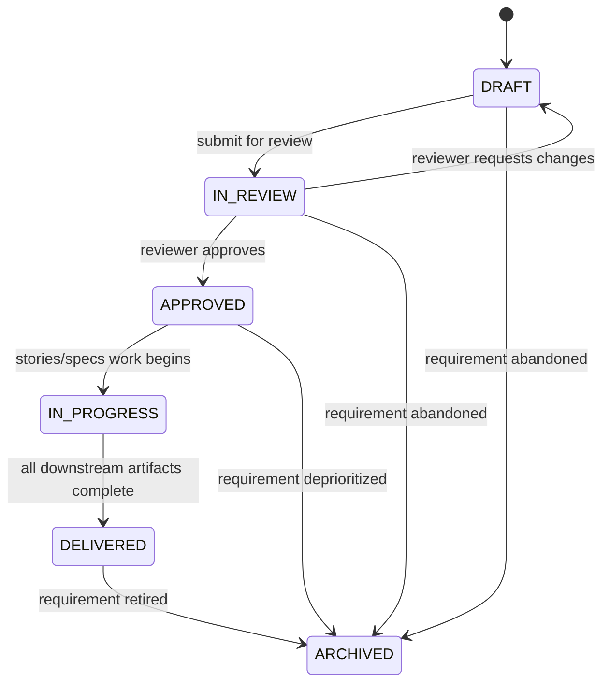

# Feature Specification: Requirement Management

> **Source stories:** S1–S18 from [requirement-stories.md](../02-user-stories/requirement-stories.md)
> **Spec status:** Draft
> **Last updated:** 2026-04-17

---

## Overview

**Feature summary:**
The Requirement Management page is the first work-layer entry point of the SDLC chain. It manages
requirements, user stories, and specs as the first three nodes of the
Requirement --> User Story --> Spec pipeline. Under the Spec Driven Development model, requirements
are not just backlog items — they are the upstream source of truth that drives every downstream
artifact through to deployment and incident resolution.

**Business objective:**
Demonstrate that an AI-native requirement pipeline — where AI assists with story derivation,
spec generation, completeness analysis, and gap detection — reduces ambiguity, accelerates
the requirements-to-spec handoff, and produces traceable, high-quality specifications that
feed directly into architecture and design.

**In-scope outcome:**
A fully functional requirement page (mocked data in Phase A, live API in Phase B) with a
requirement list view, kanban board view, priority matrix visualization, detail view with
acceptance criteria and business context, user story derivation, spec linkage, full SDLC chain
traceability, AI analysis (completeness, gaps, duplicates, impact), and AI Command Panel.

---

## Source Stories

| Story | Title / Summary | Key Capability |
|-------|----------------|----------------|
| S1 | View Requirement List with Filtering and Sorting | Requirement list with priority, status, category, filtering |
| S2 | View Requirements in Kanban Board Layout | Kanban board grouped by status with card summaries |
| S3 | Visualize Priority Matrix (Impact vs Effort) | Scatter/quadrant chart of requirements by impact and effort |
| S4 | View Requirement Detail Control Plane | Detail view with source evidence, GitHub-backed SDD documents, reviews, CLI runs, and traceability |
| S5 | Derive User Stories from a Requirement (AI-Assisted) | AI-assisted story derivation via req-to-user-story skill |
| S6 | Link and Track Specs for a Requirement | Spec linkage, tracking, and generation entry via user-story-to-spec skill |
| S7 | Trace Requirement Through the Full SDLC Chain | End-to-end traceability from Requirement to Learning |
| S8 | Review AI Analysis (Completeness, Gaps, Duplicates, Impact) | AI analysis card with completeness score, gap detection, duplicate detection, impact analysis |
| S9 | Use AI Command Panel for Requirement Context | AI Command Panel with requirement-scoped commands |
| S10 | Handle Loading, Error, and Empty States | Loading, error, empty, and partial states |
| S11 | Navigate Between List, Kanban, Matrix, and Detail Views | Routing, view switching, deep-linking |
| S12 | Filter and Sort Across All Views | Cross-view filtering by priority, status, category, search, and completed toggle |
| S13 | Select and View Active Pipeline Profile | Profile display, inheritance, default |
| S14 | View Profile-Adapted SDLC Chain and Skill Actions | Chain rendering, skill binding, entry paths |
| S15 | Use Spec Tiering for Legacy Pipeline Profiles | L1/L2/L3 orchestrator-determined tier display, conditional UI |
| S16 | Import Raw Business Input as Requirement | Multi-format import, drag-drop, paste, file upload |
| S17 | Review AI-Normalized Requirement Draft | Draft review, edit, confirm/discard, missing info flags |
| S18 | Batch Import Requirements from Excel | Reserved row-based spreadsheet intake; current delivery uses KB-backed multi-file and ZIP import |
| S19 | View SDD Knowledge Graph | Profile-aware graph of SDD document relationships with indexed/missing/stale health signals |

---

## Actors / Users

**Primary actors** (directly interact with the system):
- **Product Manager / Business Analyst**: Creates and manages requirements, defines acceptance criteria, prioritizes backlog, derives user stories, initiates spec generation
- **Architect / Tech Lead**: Reviews requirements for technical feasibility, traces requirements to design and code, validates completeness
- **Team Lead / Delivery Manager**: Monitors requirement status flow, reviews priority matrix, tracks requirement-to-delivery pipeline

**Supporting actors** (indirectly involved):
- **Management / PMO**: Views requirement health metrics via Dashboard, reviews priority distribution
- **Developer**: Consults requirement detail and linked specs during implementation, traces code back to source requirement

---

## Functional Scope

**Core capability domains:**
- **Requirement List & Filtering**: List, filter, sort requirements; status distribution summary
- **Kanban Board**: Visual board grouped by requirement status with drag-read (display-only) cards
- **Priority Matrix**: Impact vs effort scatter/quadrant visualization
- **SDD Knowledge Graph**: Profile-aware SDD document relationship graph for impact and decision support
- **Requirement Detail**: Control-plane view for source evidence, GitHub-backed SDD documents, reviews, CLI runs, linked records, traceability, and metadata
- **User Story Derivation**: AI-assisted story generation from requirements (req-to-user-story skill)
- **Spec Linkage & Tracking**: Linked specs per requirement, spec status tracking, generation entry (user-story-to-spec skill)
- **SDLC Chain Traceability**: Full 11-node chain from Requirement through Learning
- **AI Analysis**: Completeness scoring, gap detection, duplicate detection, impact analysis
- **AI Command Panel**: Requirement-context AI commands (summarize, analyze, suggest, derive)

**Lifecycle stages:**
1. Requirement created (Draft)
2. Requirement reviewed (In Review)
3. Requirement approved (Approved — ready for story derivation)
4. Stories and specs in progress (In Progress)
5. Requirement fully delivered (Delivered — all downstream artifacts complete)
6. Requirement archived (Archived)

**Workflow boundaries:**
- Entry point: User navigates to `/requirements` from shared shell navigation
- Exit point: Requirement reaches Delivered or Archived state
- Cross-domain transitions: Story derivation triggers req-to-user-story skill; spec generation triggers user-story-to-spec skill

---

## Functional Requirements

### F-REQ-LIST: Requirement List Display, Filtering, Sorting

- **FR-01**: The page displays a list of requirements scoped to the current workspace context. *(Source: S1)*
- **FR-02**: Each requirement row shows: ID (e.g., REQ-0042), title, priority, current status, category, story count, spec count, completeness, and last updated timestamp. *(Source: S1)*
- **FR-03**: Active requirements are shown by default; archived requirements are available via tab or filter toggle. *(Source: S1)*
- **FR-04**: Requirements are sortable by priority, status, title, and recency (updated timestamp). *(Source: S1, S12)*
- **FR-05**: Critical-priority requirements use the `--color-incident-crimson` design token for visual flagging. *(Source: S1)*
- **FR-06**: A status distribution summary (e.g., "3 Draft, 5 Approved, 2 In Progress") is displayed at the top of the list. *(Source: S1)*
- **FR-07**: Filtering is supported by priority, status, category, and text search; completed/archived visibility is controlled by the Active / Completed toggle. *(Source: S1, S12)*
- **FR-08**: Clicking a requirement row navigates to the detail view. *(Source: S1, S11)*

### F-REQ-KANBAN: Kanban Board View

- **FR-10**: The page provides a kanban board view as an alternative to the list view. *(Source: S2)*
- **FR-11**: Kanban columns correspond to requirement statuses: Draft, In Review, Approved, In Progress, Delivered, Archived. *(Source: S2)*
- **FR-12**: Each kanban card shows: ID, title, priority badge, category badge, story count, and spec count. *(Source: S2)*
- **FR-13**: Column headers display the count of requirements in each column. *(Source: S2)*
- **FR-14**: Clicking a kanban card navigates to the detail view. *(Source: S2, S11)*
- **FR-15**: Kanban view respects the same filters applied in the list view. *(Source: S2, S12)*

### F-REQ-MATRIX: Priority Matrix Visualization

- **FR-20**: The page provides a priority matrix view as an alternative to list and kanban views. *(Source: S3)*
- **FR-21**: The matrix plots requirements on a 2D grid: X-axis = Effort (Low to High), Y-axis = Impact (Low to High). *(Source: S3)*
- **FR-21a**: Until explicit impact and effort estimates are present in the list payload, the matrix discloses V1 proxy scoring: priority maps to impact, and completeness maps inversely to remaining effort. *(Source: S3)*
- **FR-22**: Quadrants are labeled: Quick Wins (high impact, low effort), Strategic (high impact, high effort), Fill-In (low impact, low effort), Deprioritize (low impact, high effort). *(Source: S3)*
- **FR-23**: Each plotted point shows the requirement ID and is color-coded by priority. *(Source: S3)*
- **FR-24**: Hovering a point shows a tooltip with title, priority, status, story count. *(Source: S3)*
- **FR-25**: Clicking a point navigates to the detail view. *(Source: S3, S11)*
- **FR-26**: The matrix respects the same filters applied in the list view. *(Source: S3, S12)*

### F-REQ-GRAPH: SDD Knowledge Graph View

- **FR-27**: The page provides a graph view as an alternative to list, kanban, and matrix views. *(Source: S19)*
- **FR-28**: The graph renders SDD document nodes from the active pipeline profile document stages. *(Source: S13, S19)*
- **FR-29**: The graph renders directed relationships from the active profile document dependency definitions. *(Source: S14, S19)*
- **FR-29a**: The graph overlays list-level control-plane health metrics: indexed document count, missing document count, stale review count, and aligned requirement count. *(Source: S19)*
- **FR-29b**: Selecting a graph node shows upstream dependencies, downstream consumers, traceability key, tier, artifact type, and path pattern. *(Source: S19)*

### F-REQ-DETAIL: Requirement Detail Display

- **FR-30**: The requirement detail view displays a header section with: ID, title, priority, current status, category, source, coverage/completeness score, story count, spec count, assignee, created date, and last updated date. *(Source: S4)*
- **FR-31**: The detail view includes a "Description" section with summary, business justification, assumptions, constraints, and acceptance criteria. *(Source: S4)*
- **FR-32**: The detail view includes an "Acceptance Criteria" section listing each criterion as a checkable item (display-only, not editable in V1). *(Source: S4)*
- **FR-33**: The detail view includes a "Business Context" section explaining why this requirement exists, its business driver, and expected value. *(Source: S4)*
- **FR-34**: The detail view exposes only the metadata currently delivered by the API: source, assignee, coverage, story/spec counts, and timestamps. External IDs, tags, and effort/impact estimates are not part of the current payload. *(Source: S4)*
- **FR-35**: Status follows the state machine defined in the State Machine section below. *(Source: S4)*

### F-REQ-STORY: User Story Derivation and Display

- **FR-40**: The detail view includes a "User Stories" card listing all stories derived from this requirement. *(Source: S5)*
- **FR-41**: Each story row shows: story ID, title, status, and any linked spec reference (`specId`, `specStatus`). *(Source: S5)*
- **FR-42**: A "Derive Stories" button triggers the req-to-user-story AI skill for the current requirement. *(Source: S5)*
- **FR-43**: When the skill is invoked, a loading indicator appears on the stories card with status text (e.g., "AI is deriving stories..."). *(Source: S5)*
- **FR-44**: After derivation completes, the new stories appear in the list with a "Generated by AI" badge. *(Source: S5)*
- **FR-45**: Story rows are rendered as lightweight traceability references; there is no inline expansion in the current implementation. *(Source: S5)*
- **FR-46**: Clicking a story keeps the user on the requirement detail page and deep-links to the story anchor (`#story-<id>`). *(Source: S5)*

### F-REQ-SPEC: Spec Linkage, Tracking, Generation Entry

- **FR-50**: The detail view includes a "Specs" card listing all specs linked to this requirement (via user stories). *(Source: S6)*
- **FR-51**: Each spec row shows: spec ID, title, version, and status (`Draft`, `Review`, `Approved`, or `Implemented`). *(Source: S6)*
- **FR-52**: A "Generate Spec" button triggers the user-story-to-spec AI skill for a selected user story. *(Source: S6)*
- **FR-53**: When the skill is invoked, a loading indicator appears on the spec card with status text (e.g., "AI is generating spec..."). *(Source: S6)*
- **FR-54**: After generation completes, the new spec appears in the list with a "Generated by AI" badge. *(Source: S6)*
- **FR-55**: Requirement coverage is surfaced in the header card via completeness score plus story/spec counts; the specs card itself shows total spec count and the generate entry point. *(Source: S6)*
- **FR-56**: Clicking a spec keeps the user on the requirement detail page and deep-links to the spec anchor (`#spec-<id>`). *(Source: S6)*

### F-REQ-CHAIN: SDLC Chain Traceability

- **FR-60**: The detail view includes a "SDLC Chain" section showing the full traceability chain. *(Source: S7)*
- **FR-61**: Chain displays the 11-node SDLC path: Requirement --> User Story --> Spec --> Architecture --> Design --> Tasks --> Code --> Test --> Deploy --> Incident --> Learning. *(Source: S7)*
- **FR-62**: The current requirement node is highlighted as the active/origin node. *(Source: S7)*
- **FR-63**: Spec node is always visible even when the chain is compressed. *(Source: S7; verified: PRD section 13.1 requires Spec visibility in compressed views)*
- **FR-64**: Nodes with linked artifacts show a count badge and are clickable. *(Source: S7)*
- **FR-65**: Nodes without linked artifacts are displayed as empty/grayed with no click action. *(Source: S7)*
- **FR-66**: Collapsed nodes are indicated with an expand control. *(Source: S7)*
- **FR-67**: Each linked artifact shows ID, title, and a navigation link. *(Source: S7)*
- **FR-68**: If no downstream artifacts exist, display "No downstream artifacts yet" message. *(Source: S7)*

### F-REQ-AI: AI Analysis Card, AI Command Panel

- **FR-70**: The detail view includes an "AI Analysis" card showing AI-generated insights for the current requirement. *(Source: S8)*
- **FR-71**: The analysis card displays: completeness score (percentage), identified gaps (list), potential duplicates (list with similarity score), impact analysis (affected downstream artifacts). *(Source: S8)*
- **FR-72**: A "Run Analysis" button triggers AI analysis for the current requirement. *(Source: S8)*
- **FR-73**: Analysis results are timestamped to show when the analysis was last run. *(Source: S8)*
- **FR-74**: Each identified gap includes a severity indicator (Critical / Warning / Info) and a suggestion for resolution. *(Source: S8)*
- **FR-75**: Potential duplicates link to the suspected duplicate requirement for comparison. *(Source: S8)*
- **FR-76**: The page includes an AI Command Panel (right sidebar) with requirement-scoped commands. *(Source: S9)*
- **FR-77**: AI Command Panel commands include: Summarize Requirement, Analyze Completeness, Find Duplicates, Suggest Stories, Assess Impact. *(Source: S9)*
- **FR-78**: AI Command Panel displays results inline with evidence references and confidence levels. *(Source: S9)*

### F-REQ-NAV: Navigation and Routing

- **FR-80**: Requirement list is the default view at `/requirements`. *(Source: S11)*
- **FR-81**: Kanban view is accessible at `/requirements?view=kanban`. *(Source: S11)*
- **FR-82**: Priority matrix view is accessible at `/requirements?view=matrix`. *(Source: S11)*
- **FR-82a**: SDD knowledge graph view is accessible from the same list-level view toggle. *(Source: S19)*
- **FR-83**: Detail view is accessible via `/requirements/:requirementId`. *(Source: S11)*
- **FR-84**: View switching (list / kanban / matrix / graph) uses a toggle control in the page header that preserves current filters. *(Source: S11, S19)*
- **FR-85**: Detail view has back-navigation to return to the previous view (list, kanban, or matrix). *(Source: S11)*
- **FR-86**: Deep-linking to a specific requirement via URL is supported. *(Source: S11)*
- **FR-87**: Page renders inside the shared shell with context bar and AI panel. *(Source: S11)*

### F-REQ-STATE: Loading, Error, Empty States

- **FR-90**: Loading state shows skeleton placeholders or spinner per section. *(Source: S10)*
- **FR-91**: Error state shows error message with retry option per section (SectionResult pattern). *(Source: S10)*
- **FR-92**: Empty state for the list shows "No requirements yet — create your first requirement to get started" with positive framing. *(Source: S10)*
- **FR-93**: Empty state for kanban shows empty columns with placeholder text. *(Source: S10)*
- **FR-94**: Empty state for priority matrix shows an empty grid with axis labels and a "No data to plot" message. *(Source: S10)*
- **FR-95**: Partial failure shows per-card error states in the detail view, not full page error. *(Source: S10)*
- **FR-96**: AI skill invocation failure shows inline error with retry option on the relevant card. *(Source: S10)*

### F-REQ-PROFILE: Pipeline Profile Support

#### F-REQ-PROFILE-1: Profile-aware page rendering
The Requirement Management page must detect the active pipeline profile for the current workspace/project and adapt its chain visualization, skill actions, spec tiering UI, and artifact types accordingly.
> Stories: S13, S14

#### F-REQ-PROFILE-2: Built-in Standard SDD profile
The system ships with a "Standard SDD" profile as the default. This profile defines the 11-node chain (Requirement → User Story → Spec → Architecture → Design → Tasks → Code → Test → Deploy → Incident → Learning), binds skills `req-to-user-story` and `user-story-to-spec`, uses per-layer traceability (REQ-xx), and has no spec tiering.
> Stories: S13

#### F-REQ-PROFILE-3: Built-in IBM i profile
The system ships with a single "IBM i" profile. This profile defines a 10-node IBM i chain (Requirement Normalizer → Functional Spec → Technical Design → Program Spec → File Spec → UT Plan → Test Scaffold → Spec Review → DDS Review → Code Review), binds a single skill (`ibm-i-workflow-orchestrator`) that serves as the sole entry point for all IBM i workflows, uses shared BR-xx traceability, and supports L1/L2/L3 spec tiering. The orchestrator automatically determines the workflow path (Full Chain / Enhancement / Fast-Path) and spec tier based on input analysis.
> Stories: S13, S14, S15

#### F-REQ-PROFILE-4: Profile-specific chain rendering
The SDLC chain card renders only the nodes defined by the active profile. The execution hub node (Spec for Standard SDD, Program Spec for IBM i) is always visually highlighted. Chain nodes not in the profile are omitted.
> Stories: S14

#### F-REQ-PROFILE-5: Profile-specific skill binding
Action buttons ("Generate Stories", "Generate Spec", etc.) are bound to the skills defined by the active profile. The button labels and triggered skills change based on the profile.
> Stories: S14

#### F-REQ-PROFILE-6: Orchestrator-determined entry path
For the IBM i profile, the `ibm-i-workflow-orchestrator` automatically determines the entry path (Full Chain / Enhancement / Fast-Path) based on input analysis. The UI displays the orchestrator's routing decision as a read-only indicator — users do not manually select the path.
> Stories: S14

#### F-REQ-PROFILE-7: Orchestrator-determined spec tiering
For profiles with spec tiering enabled (e.g., IBM i), the `ibm-i-workflow-orchestrator` determines the appropriate tier (L1/L2/L3) based on input analysis. The UI displays the determined tier as a read-only badge — users do not manually select the tier. Tier descriptions are available as tooltips. The tier indicator is hidden for profiles without tiering.
> Stories: S15

#### F-REQ-PROFILE-8: Profile inheritance
The canonical active profile is determined by workspace/project configuration inheritance (Platform Default → Application Default → SNOW Group Override → Project Override). Requirement pages may expose a local profile preview override for prototype and authoring workflows, but persistent default profile changes belong to Platform Center configuration.
> Stories: S13

### F-REQ-INTAKE: Requirement Intake and Import

#### F-REQ-INTAKE-1: Import action entry point
The requirement list view must display a prominent "Import Requirement" action button in the page header area. This is the primary entry point for creating new requirements.
> Stories: S16

#### F-REQ-INTAKE-2: Multi-format input support
The import panel must accept raw input in four source modes: paste text, upload file(s), email text, and meeting summary text. The current file upload control supports `.txt`, `.md`, `.pdf`, `.html`, `.htm`, `.xlsx`, `.xls`, `.docx`, `.csv`, and `.zip`, allows multiple files per submission, and enforces a 100 MB total request limit. ZIP packages are expanded during server-side normalization; unsupported or low-confidence inner files are surfaced for manual review in the import report.
> Stories: S16

#### F-REQ-INTAKE-3: AI normalization trigger
After providing raw input, the user triggers AI normalization through one of two paths. Text/email/meeting inputs call `POST /api/v1/requirements/normalize` and return a draft immediately. File inputs call `POST /api/v1/requirements/imports`, receive an async receipt (`importId`, `taskId`, dataset/file counters), and then poll `GET /api/v1/requirements/imports/{importId}` until a structured draft is ready.
> Stories: S16, S17

#### F-REQ-INTAKE-4: Profile-specific normalization output
The normalization output format adapts to the active pipeline profile. Standard SDD produces a standard Requirement. IBM i profiles produce a Requirement Package with candidate items (CF-nn, CBR-nn, CE-nn). The review UI adapts to show the profile-specific output structure.
> Stories: S17

#### F-REQ-INTAKE-5: Draft review with AI transparency
The review step displays all AI-extracted fields with visual indicators for AI-suggested values, amber warnings for missing information, and a list of open questions. All fields are editable by the user.
> Stories: S17

#### F-REQ-INTAKE-6: Confirm, edit, or discard draft
The review step provides three actions: edit draft (inline editing), confirm & create (creates requirement with status Draft), and discard (cancels import). On confirmation, the requirement persists source attachment metadata and KB/import references rather than copying raw binary file content into the requirement database.
> Stories: S17

#### F-REQ-INTAKE-7: Batch Excel import
Row-based spreadsheet preview remains a reserved future mode. In the current delivery, spreadsheet files follow the same KB-backed file import path as other supported documents, and the modal surfaces file-level import status plus the normalized draft when processing completes.
> Stories: S18

#### F-REQ-INTAKE-8: Source attachment preservation
The created requirement preserves source traceability through stored text input, file metadata, `kb_name`, import task identifiers, and provider document references. Raw file binaries remain in the KB/provider system rather than the requirement service tables.
> Stories: S16, S17

#### F-REQ-INTAKE-9: Import audit trail
All import operations are logged with source format, file name or bundle summary, KB task metadata, normalizer/import provider, user, timestamp, and outcome.
> Stories: S16

---

## Non-Functional Requirements

- **Security**: All requirement data is scoped to the current workspace. AI skill invocations
  require authenticated user identity. V1 does not implement per-requirement role-based access
  control.
- **Auditability**: All AI skill invocations (story derivation, spec generation, analysis runs)
  must be recorded with actor, timestamp, skill name, and input/output summary. This feeds into
  the platform audit system (PRD section 16.2).
- **Performance**: Requirement list view target: p95 < 2s initial load. Detail view target:
  p95 < 3s initial load (6+ cards). Kanban and matrix views target: p95 < 2.5s initial load.
  V1 defers formal performance testing — targets are advisory for design decisions.
- **Environment support**: Works with H2 (local dev) and Oracle (production). Frontend Phase A
  uses mocked data with no backend dependency.
- **Accessibility**: All views must be keyboard-navigable. Color-coding must not be the sole
  indicator (always paired with text or icon).

---

## Workflow / System Flow

### User Flow Diagram

### Main Flow

1. User navigates to `/requirements` from the shared shell left navigation
2. System loads the requirement list scoped to the current workspace
3. List displays active requirements by default with status distribution summary
4. User filters or sorts requirements by priority, status, category, search text, or the Active / Completed toggle
5. User optionally switches to kanban or priority matrix view
6. User clicks a requirement to open the detail view
7. Detail view loads all control-plane cards: header, source evidence, SDD documents, reviews, CLI runs, traceability, linked stories/specs, SDLC chain, and persisted analysis snapshot
8. Each card loads independently — partial failure shows per-card error state (SectionResult pattern)
9. User opens the relevant SDD document to read the canonical normalized requirement or downstream spec content
10. User reviews source evidence and freshness to understand whether the document set is current
11. User reviews linked stories, specs, SDLC chain, reviews, CLI runs, and analysis snapshots to trace downstream artifacts
12. User navigates back to the requirement list or to a linked SDLC artifact page

---

## Data / Configuration Requirements

**Key entities:**

| Entity | Description | Key Attributes |
|--------|-------------|----------------|
| Requirement | A business or technical requirement in a workspace | id, title, priority, status, category, source, assignee, storyCount, specCount, completenessScore, createdAt, updatedAt |
| UserStory | A user story derived from a requirement | id, title, status, optional specId, optional specStatus, requirementId |
| SpecSummary | A spec linked to a requirement | id, title, status (Draft/Review/Approved/Implemented), version, requirementId |
| RequirementDraft | AI-normalized draft shown in the import review step | title, priority, category, summary, businessJustification, acceptanceCriteria, assumptions, constraints, missingInfo, openQuestions, aiSuggestedFields, importInspection, sourceAttachment |
| RequirementImportStatus | Async file import receipt and polling payload | importId, taskId, status, knowledgeBaseName, datasetId, totalNumberOfFiles, successes/failures, supported/unsupported file types, files, optional draft |
| SdlcChainNode | A node in the 11-node SDLC traceability chain | nodeType (requirement/user-story/spec/architecture/design/tasks/code/test/deploy/incident/learning), artifactCount, artifacts (id, title, routePath) |
| AiAnalysisResult | AI-generated analysis of a requirement | completenessScore, missingElements, similarRequirements (requirementId, similarityScore), impactAssessment, suggestions |
| SkillInvocation | A record of an AI skill invocation | skillName, status (running/completed/failed), startedAt, completedAt, inputSummary, outputSummary |
| StatusDistribution | Counts of requirements per status | draft, inReview, approved, inProgress, delivered, archived |

> Full type definitions, entity mappings, and database schema are in [requirement-data-model.md](../04-architecture/requirement-data-model.md).

**Statuses / state machine:**

Valid states:
- `Draft`
- `In Review`
- `Approved`
- `In Progress`
- `Delivered`
- `Archived`

Valid transitions:

**Validation rules:**
- Requirement ID follows the pattern `REQ-NNNN`
- Priority is one of: Critical, High, Medium, Low
- Status is one of the six valid states above
- Category is a free-form string with a maximum of 100 characters
- Acceptance criteria is a non-empty array of strings when present
- Effort estimate is one of: Low, Medium, High (used for matrix X-axis)
- Impact estimate is one of: Low, Medium, High (used for matrix Y-axis)

---

## Integrations

**Internal platform integrations:**
- **Shared Shell**: Requirement page renders inside the shared app shell (context bar, nav, AI panel)
- **Dashboard**: Dashboard requirement pipeline card links to `/requirements` for drill-down
- **AI Center**: Skill invocations (req-to-user-story, user-story-to-spec) reference skills registered in AI Center
- **Audit Management**: AI skill invocations and status transitions feed into the platform audit system
- **Incident Management**: Incidents link back to requirements via SDLC chain traceability

**External systems (future, out of scope for V1):**
- Jira: Bi-directional requirement sync
- Azure DevOps: Work item import/export
- Confluence: Business context import

**APIs / interfaces:**
- `GET /api/v1/requirements` — list requirements with filtering/sorting (inbound, new)
- `GET /api/v1/requirements/:id` — requirement detail (inbound, new)
- `GET /api/v1/requirements/:id/chain` — SDLC chain for a requirement (inbound, new)
- `GET /api/v1/requirements/:id/analysis` — AI analysis (inbound, new)
- `GET /api/v1/pipeline-profiles/active` — resolved active pipeline profile (inbound, new)
- `POST /api/v1/requirements/:id/generate-stories` — trigger story derivation skill (inbound, new)
- `POST /api/v1/requirements/:id/generate-spec` — trigger spec generation skill (inbound, new)
- `POST /api/v1/requirements/stories/:storyId/generate-spec` — legacy story-scoped compatibility path (inbound, compatibility)
- `POST /api/v1/requirements/:id/analyze` — trigger async analysis run (inbound, new)
- `POST /api/v1/requirements/:id/invoke-skill` — invoke a profile-bound skill action (inbound, new)
- `POST /api/v1/requirements/normalize` — normalize pasted/email/meeting input or compatibility multipart file upload (inbound, new)
- `POST /api/v1/requirements/imports` — start async KB-backed file import (inbound, new)
- `GET /api/v1/requirements/imports/:importId` — poll KB-backed import status (inbound, new)
- `POST /api/v1/requirements` — create a requirement from a confirmed draft (inbound, new)
- Existing patterns: `ApiResponse<T>` envelope (verified: `shared/dto/ApiResponse.java`), `fetchJson<T>` client (verified: `shared/api/client.ts`)

> Full endpoint contracts with JSON examples are in [requirement-API_IMPLEMENTATION_GUIDE.md](../05-design/contracts/requirement-API_IMPLEMENTATION_GUIDE.md).

---

## Dependencies

**Upstream dependencies:**
- **Shared App Shell**: Must be deployed (verified: exists and functional)
- **Vue Router config**: Requirement route must be registered at `/requirements` and `/requirements/:requirementId`
- **Design tokens**: Priority color tokens must exist (crimson for Critical, amber for High, etc.)
- **API patterns**: `ApiResponse<T>` and `SectionResult<T>` patterns must exist (verified: both exist)
- **AI Skill registry**: `req-to-user-story` and `user-story-to-spec` skills must be registered in AI Center

**Downstream dependencies:**
- **Dashboard**: Requirement pipeline card links to `/requirements` — dashboard expects requirement page to exist
- **Design Management**: Design page traces back to specs and requirements — expects requirement data to be available
- **SDLC module pages**: Chain links navigate to module pages (may show "Coming Soon" placeholder)

---

## Risks / Ambiguities

| # | Description | Type | Impact | Recommendation |
|---|-------------|------|--------|----------------|
| R-01 | AI skill invocation latency for story derivation and spec generation is unknown | Assumption | Med | V1 uses mocked skill responses with simulated 2-3s delay; define timeout and retry strategy for Phase B |
| R-02 | Completeness scoring algorithm is not yet defined | Gap | Med | V1 uses a simple heuristic: presence of description, acceptance criteria, business context, effort/impact estimates; full ML-based scoring is V2 |
| R-03 | Duplicate detection similarity threshold is undefined | Unclear | Low | V1 uses mocked duplicates; define threshold (e.g., >80% cosine similarity) in Phase B |
| R-04 | Relationship between requirement categories and SDLC chain coverage is unclear | Gap | Low | V1 treats categories as display-only labels; category-based filtering of chain nodes is V2 |
| R-05 | Kanban drag-and-drop for status transitions is a common user expectation but out of scope for V1 | Expectation | Med | Display a tooltip or subtle indicator that drag-and-drop is coming in V2; V1 is read-only kanban |
| R-06 | Priority matrix placement depends on effort and impact estimates that may not be populated | Data | Med | Requirements without both estimates are excluded from the matrix with a "N requirements not plotted (missing estimates)" indicator |

---

## Out of Scope

- **Editing or deleting existing requirements**: V1 now supports create-from-draft, but full requirement edit/delete/version workflows are still deferred
- **Drag-and-drop kanban**: V1 kanban is display-only; status changes via drag-and-drop are V2
- **Real-time collaboration**: No multi-user live editing or conflict resolution in V1
- **Approval workflows**: No formal review/approval workflow with role-based gates in V1
- **Spec full editor**: Spec generation produces a summary; full spec editing is V2
- **Advanced search / full-text search**: Basic filtering only in V1
- **Requirement versioning / diff**: V1 shows current state only; version history is V2
- **Import from external systems**: No Jira/ADO import in V1
- **Mobile-optimized views**: Desktop-first in V1
- **Bulk operations**: No multi-select or bulk status changes in V1
- **Custom kanban columns**: V1 uses fixed status-based columns
- **Pipeline profile creation, editing, and deletion**: Platform Center responsibility
- **IBM i skill execution engine**: Handled by build-agent-skill
- **Profile A/B testing or profile migration tools**
- **Real-time email/calendar integration** (Outlook plugin, Zoom webhook)
- **Standalone image upload / OCR for scanned documents or handwritten notes**
- **Row-level spreadsheet preview and selective Excel row import**

---

## Data Contracts Summary

**Frontend TypeScript interfaces** (defined in `features/requirement/types/requirement.ts`):

| Interface | Purpose |
|-----------|---------|
| `RequirementListItem` | Row data for list view |
| `RequirementFilters` | Filter state for list/kanban/matrix |
| `StatusDistribution` | Counts per status for summary bar |
| `RequirementList` | Aggregate: distribution + items array |
| `RequirementHeader` | Header section of detail view |
| `AcceptanceCriterion` | Single acceptance criterion |
| `RequirementDetail` | Aggregate of all detail sections (SectionResult pattern) |
| `UserStorySummary` | Story row in the stories card |
| `SpecSummary` | Spec row in the specs card |
| `SdlcChainNode` | Single node in the SDLC chain |
| `AiAnalysisResult` | AI analysis output |
| `AiAnalysisGap` | Single gap finding |
| `AiDuplicate` | Single duplicate finding |
| `SkillInvocationStatus` | Status of a running AI skill |
| `KanbanColumn` | Column with status label and requirement cards |
| `MatrixPoint` | Single point in the priority matrix |
| `RequirementDraft` | Reviewable normalized draft from text or imported files |
| `ImportInspection` | ZIP / bundle inspection report attached to a draft |
| `RequirementImportStatus` | Async KB import receipt and polling payload |

> Full type definitions are in [requirement-data-model.md](../04-architecture/requirement-data-model.md).

---

## API Contracts Summary

| Endpoint | Method | Purpose | Phase |
|----------|--------|---------|-------|
| `/api/v1/requirements` | GET | List requirements with filter/sort query params | B |
| `/api/v1/requirements/:id` | GET | Full requirement detail (SectionResult envelope) | B |
| `/api/v1/requirements/:id/chain` | GET | SDLC chain nodes for a requirement | B |
| `/api/v1/requirements/:id/analysis` | GET | AI analysis | B |
| `/api/v1/pipeline-profiles/active` | GET | Resolved active pipeline profile | B |
| `/api/v1/requirements/:id/generate-stories` | POST | Trigger req-to-user-story skill | B |
| `/api/v1/requirements/:id/generate-spec` | POST | Trigger user-story-to-spec skill | B |
| `/api/v1/requirements/stories/:storyId/generate-spec` | POST | Legacy story-scoped spec generation compatibility path | B |
| `/api/v1/requirements/:id/analyze` | POST | Trigger async analysis run | B |
| `/api/v1/requirements/:id/invoke-skill` | POST | Trigger profile-bound skill action | B |
| `/api/v1/requirements/normalize` | POST | Normalize JSON input or compatibility multipart upload into a draft | B |
| `/api/v1/requirements/imports` | POST | Start async KB-backed file import | B |
| `/api/v1/requirements/imports/:importId` | GET | Poll async file import status and draft readiness | B |
| `/api/v1/requirements` | POST | Create requirement from confirmed draft | B |

> Full endpoint contracts with JSON request/response examples are in [requirement-API_IMPLEMENTATION_GUIDE.md](../05-design/contracts/requirement-API_IMPLEMENTATION_GUIDE.md).

---

## Acceptance Matrix

| Story | Functional Requirements | Phase A (Mocked) | Phase B (API) |
|-------|------------------------|:-----------------:|:-------------:|
| S1 | FR-01 to FR-08 | Yes | Yes |
| S2 | FR-10 to FR-15 | Yes | Yes |
| S3 | FR-20 to FR-26 | Yes | Yes |
| S4 | FR-30 to FR-35 | Yes | Yes |
| S5 | FR-40 to FR-46 | Yes (simulated) | Yes |
| S6 | FR-50 to FR-56 | Yes (simulated) | Yes |
| S7 | FR-60 to FR-68 | Yes | Yes |
| S8 | FR-70 to FR-75 | Yes (mocked scores) | Yes |
| S9 | FR-76 to FR-78 | Yes | Yes |
| S10 | FR-90 to FR-96 | Yes | Yes |
| S11 | FR-80 to FR-87 | Yes | Yes |
| S12 | FR-07, FR-15, FR-26 | Yes | Yes |
| S13 | F-REQ-PROFILE-1, F-REQ-PROFILE-2, F-REQ-PROFILE-3, F-REQ-PROFILE-8 | Yes | Yes |
| S14 | F-REQ-PROFILE-1, F-REQ-PROFILE-3, F-REQ-PROFILE-4, F-REQ-PROFILE-5, F-REQ-PROFILE-6 | Yes | Yes |
| S15 | F-REQ-PROFILE-3, F-REQ-PROFILE-7 | Yes | Yes |
| S16 | F-REQ-INTAKE-1, F-REQ-INTAKE-2, F-REQ-INTAKE-3, F-REQ-INTAKE-8, F-REQ-INTAKE-9 | Yes | Yes |
| S17 | F-REQ-INTAKE-3, F-REQ-INTAKE-4, F-REQ-INTAKE-5, F-REQ-INTAKE-6, F-REQ-INTAKE-8 | Yes | Yes |
| S18 | F-REQ-INTAKE-7 | Yes | Yes |

---

## Open Questions

| # | Question | Raised from | Owner |
|---|----------|-------------|-------|
| OQ-01 | What categories should requirements support? (Functional, Non-Functional, Technical Debt, Compliance, UX, etc.) | S1, FR-07 | Product |
| OQ-02 | Should the priority matrix use continuous numeric values or discrete Low/Medium/High for effort and impact? | S3, FR-21 | Design |
| OQ-03 | What is the maximum number of requirements to display before requiring pagination in list and kanban views? | S1, S2 | Product |
| OQ-04 | Should spec generation be triggered per-story or per-requirement (batch all stories)? | S6, FR-52 | Product |
| OQ-05 | How should the completeness score be calculated? (Weighted presence of fields vs AI semantic analysis) | S8, FR-71, R-02 | Architecture |
| OQ-06 | Should the AI Command Panel share context across requirement detail sections, or is each command independent? | S9, FR-76 | Design |
| OQ-07 | What duplicate similarity threshold should trigger a "potential duplicate" finding? | S8, FR-75, R-03 | Architecture |
