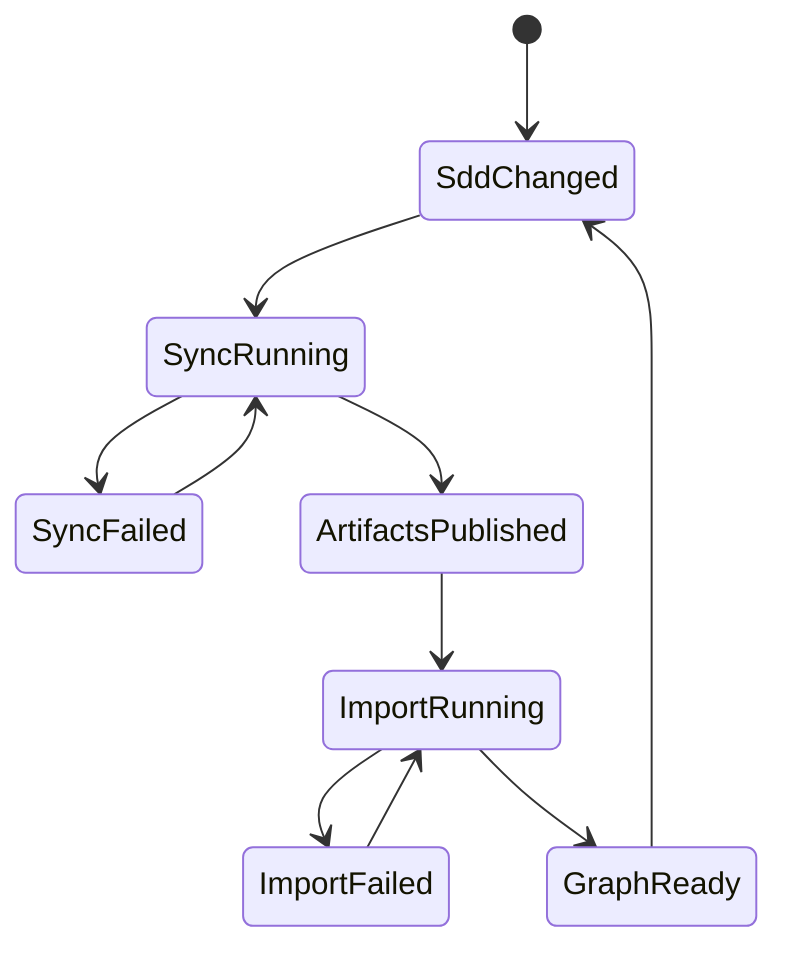

# Feature Specification: SDD Knowledge Graph

> Source stories: SKG-S1 to SKG-S12 from [sdd-knowledge-graph-stories.md](../02-user-stories/sdd-knowledge-graph-stories.md)
> Spec status: Draft
> Last updated: 2026-04-28

---

## Overview

The SDD Knowledge Graph converts GitHub-backed SDD Markdown documents into
validated graph artifacts and an optional Neo4j projection. Requirement
Management uses this graph to support decisions about completeness, impact,
traceability, stale reviews, and IBM i object coverage.

The design intentionally separates source layers:

- SDD Markdown repo: canonical human-readable document source.
- Structured sync repo: deterministic, reviewable graph artifact source.
- Neo4j: rebuildable query projection for graph traversal.
- Control Tower backend: API boundary and policy enforcement.
- Control Tower frontend: graph visualization and decision support.

---

## Functional Scope

### In scope

- Markdown front matter schema for graph metadata.
- Structured graph sync job.
- Graph artifacts in JSONL and manifest form.
- Validation and issue reporting.
- Optional Neo4j import/upsert.
- Backend Graph API.
- Requirement Management graph view.

### Out of scope

- Frontend direct Neo4j connectivity.
- Editing SDD Markdown from Control Tower.
- Auto-promoting AI-suggested edges into confirmed graph relationships.
- Neo4j cluster operations in V1.

---

## Functional Requirements

### F-SKG-METADATA: SDD Document Metadata

- **FR-01**: Graph-participating SDD Markdown documents must expose YAML front
  matter. Source: SKG-S1.
- **FR-02**: Required fields are `sdd_version`, `doc_id`, `doc_type`,
  `requirement_id`, `profile`, `application_id`, and `snow_group`. Source:
  SKG-S1.
- **FR-03**: `depends_on` declares upstream `doc_id` values only. Source:
  SKG-S1.
- **FR-04**: `source_refs` declares external source references such as Jira,
  Confluence, GitHub, KB, upload, or URL. Source: SKG-S1.
- **FR-05**: `entities` declares domain entities referenced by the document,
  including programs, files, APIs, jobs, tables, queues, or services. Source:
  SKG-S8.

Example:

```yaml
---
sdd_version: 1
doc_id: BR-FS-AUTH-123
doc_type: functional-spec
requirement_id: AUTH-123
profile: ibm-i
application_id: app-payment-gateway-pro
snow_group: FIN-TECH-OPS
source_refs:
  - type: jira
    id: AUTH-123
    uri: jira://AUTH-123
depends_on:
  - BR-REQ-AUTH-123
entities:
  programs:
    - name: AUTHR001
      library: PAYLIB
      source_type: RPGLE
  files:
    - name: AUTHPF
      type: PF
---
```

### F-SKG-SYNC: Structured Sync Job

- **FR-10**: The sync job scans a configured SDD repo, branch, and docs root.
  Source: SKG-S2.
- **FR-11**: The sync job parses front matter and selected structured sections.
  Source: SKG-S2.
- **FR-12**: The sync job emits `_graph/manifest.json`,
  `_graph/nodes.jsonl`, `_graph/edges.jsonl`, `_graph/issues.jsonl`, and
  `_graph/suggestions.jsonl`. Source: SKG-S2.
- **FR-13**: Sync artifacts include source repo, source branch, source commit,
  sync timestamp, profile, workspace, application, SNOW Group, node count, edge
  count, and issue count. Source: SKG-S2, SKG-S9.
- **FR-14**: Duplicate node IDs, invalid JSONL, and invalid required metadata
  are hard failures. Source: SKG-S2.
- **FR-15**: Missing optional entities, unknown dependencies, and profile rule
  warnings are emitted as issues. Source: SKG-S3.

### F-SKG-VALIDATION: Graph Validation

- **FR-20**: The sync job validates document type transitions against the
  active profile dependency policy. Source: SKG-S3.
- **FR-21**: The sync job validates that each `depends_on` target exists in the
  same graph scope or allowed baseline scope. Source: SKG-S3.
- **FR-22**: The sync job validates that documents carry ownership metadata.
  Source: SKG-S11.
- **FR-23**: The sync job validates IBM i entity references when entity metadata
  is declared. Source: SKG-S8.
- **FR-24**: Validation issues must contain severity, code, message, subject
  ID, source file, and optional remediation hint. Source: SKG-S3, SKG-S9.

### F-SKG-EDGE-QUALITY: Confirmed vs Suggested Edges

- **FR-30**: Confirmed edges are emitted to `_graph/edges.jsonl`. Source:
  SKG-S4.
- **FR-31**: Suggested edges are emitted to `_graph/suggestions.jsonl`. Source:
  SKG-S4.
- **FR-32**: Confirmed edges have evidence source and confidence metadata.
  Source: SKG-S4.
- **FR-33**: Suggested edges must not be imported as confirmed Neo4j
  relationships unless approved. Source: SKG-S4.

### F-SKG-NEO4J: Neo4j Projection

- **FR-40**: Neo4j import reads structured graph artifacts, not raw Markdown.
  Source: SKG-S5.
- **FR-41**: Node import uses `MERGE` on stable node IDs. Source: SKG-S5.
- **FR-42**: Relationship import uses `MERGE` on stable relationship identity.
  Source: SKG-S5.
- **FR-43**: Import records run metadata including counts, duration, source
  manifest, and errors. Source: SKG-S5, SKG-S9.
- **FR-44**: Neo4j import must be idempotent. Source: SKG-S5.
- **FR-45**: Neo4j can be disabled through graph provider configuration.
  Source: SKG-S12.

### F-SKG-API: Backend Graph API

- **FR-50**: Backend exposes graph query APIs under `/api/v1/requirements`.
  Source: SKG-S6, SKG-S7.
- **FR-51**: Backend graph APIs accept filters for workspace, application,
  SNOW Group, project, branch, profile, requirement, and node type. Source:
  SKG-S11.
- **FR-52**: Backend graph APIs return normalized DTOs independent of Neo4j.
  Source: SKG-S6, SKG-S12.
- **FR-53**: Backend uses provider fallback: mock/profile, manifest, or Neo4j.
  Source: SKG-S12.
- **FR-54**: Graph API failures must be isolated from normal Requirement
  Management APIs. Source: SKG-S12.

### F-SKG-UI: Requirement Management Graph View

- **FR-60**: Requirement Management provides Graph view next to List, Kanban,
  and Matrix. Source: SKG-S6.
- **FR-61**: Graph view renders nodes, relationships, health metrics, and
  selected-node details. Source: SKG-S6.
- **FR-62**: Selected-node detail shows upstream dependencies, downstream
  consumers, path pattern, traceability key, tier, artifact type, ownership,
  and issue status. Source: SKG-S6, SKG-S7.
- **FR-63**: Graph view can show stale review and missing document signals.
  Source: SKG-S6, SKG-S9.
- **FR-64**: Graph unavailable state shows a non-blocking error with retry and
  last successful sync metadata when available. Source: SKG-S12.

### F-SKG-IMPACT: Impact Traversal

- **FR-70**: API supports upstream traversal for a node. Source: SKG-S7.
- **FR-71**: API supports downstream traversal for a node. Source: SKG-S7.
- **FR-72**: Traversal responses include path depth, relationship type, and
  impacted node metadata. Source: SKG-S7.
- **FR-73**: Impact traversal supports Application, SNOW Group, Project, branch,
  and profile filters. Source: SKG-S7, SKG-S11.

---

## Data Contracts

### Graph Node

```json
{
  "id": "doc:BR-FS-AUTH-123",
  "kind": "DOCUMENT",
  "label": "Functional Spec",
  "properties": {
    "docId": "BR-FS-AUTH-123",
    "docType": "functional-spec",
    "requirementId": "AUTH-123",
    "profile": "ibm-i",
    "applicationId": "app-payment-gateway-pro",
    "snowGroup": "FIN-TECH-OPS",
    "repoFullName": "wwa-lab/payment-gateway-sdd",
    "branch": "project/AUTH-123",
    "path": "docs/02-functional-spec/AUTH-123.md",
    "commitSha": "abc123",
    "freshnessStatus": "FRESH"
  }
}
```

### Graph Edge

```json
{
  "id": "edge:doc:BR-FS-AUTH-123:DEPENDS_ON:doc:BR-REQ-AUTH-123",
  "type": "DEPENDS_ON",
  "from": "doc:BR-FS-AUTH-123",
  "to": "doc:BR-REQ-AUTH-123",
  "source": "frontmatter",
  "confidence": 1.0,
  "properties": {
    "profile": "ibm-i",
    "branch": "project/AUTH-123"
  }
}
```

### Graph Issue

```json
{
  "severity": "ERROR",
  "code": "MISSING_DEPENDENCY",
  "subjectId": "doc:BR-FS-AUTH-123",
  "message": "depends_on target BR-REQ-AUTH-123 was not found",
  "sourcePath": "docs/02-functional-spec/AUTH-123.md",
  "hint": "Add the Requirement Normalizer document or remove the dependency"
}
```

---

## State Model



---

## Error Handling

- Invalid front matter: sync issue and hard failure when required fields are
  missing.
- Missing dependency: sync issue; severity depends on profile rule.
- Neo4j unavailable: API returns graph unavailable result; UI shows graph
  section error only.
- Import conflict: importer logs skipped rows and returns partial result with
  issue references.
- Stale graph: API returns last sync timestamp and stale indicator.

---

## Implementation Notes

- Frontend graph rendering should consume backend DTOs only.
- Backend graph service should use a provider interface:
  `KnowledgeGraphProvider`.
- Provider implementations:
  - `ProfileKnowledgeGraphProvider`
  - `ManifestKnowledgeGraphProvider`
  - `Neo4jKnowledgeGraphProvider`
- The first production-quality provider should read structured artifacts before
  Neo4j is required.
- Neo4j should be deployed separately through Docker locally and company server
  Docker later.
