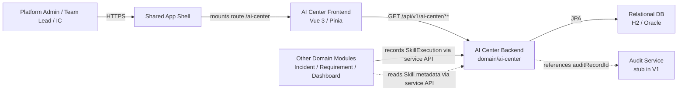
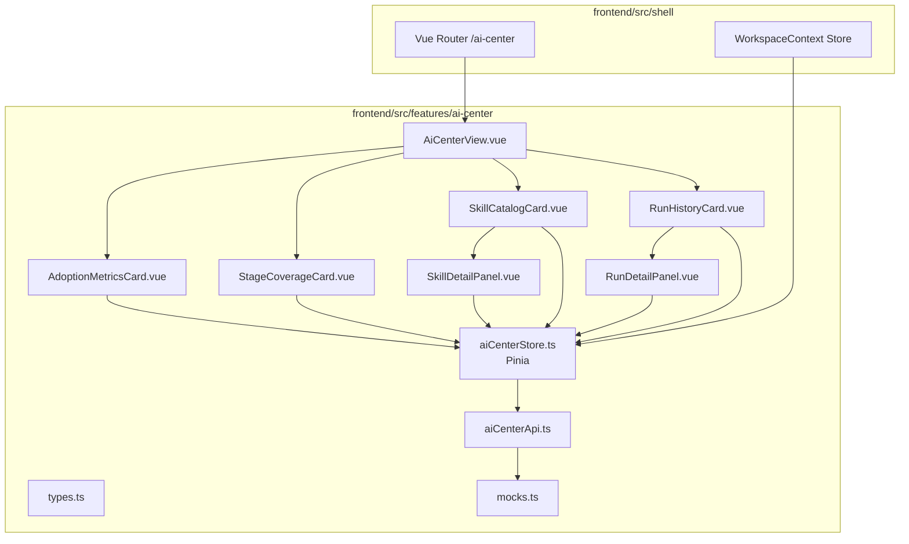
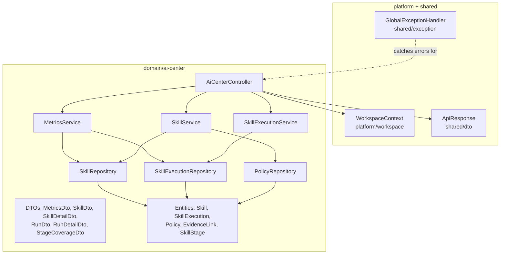
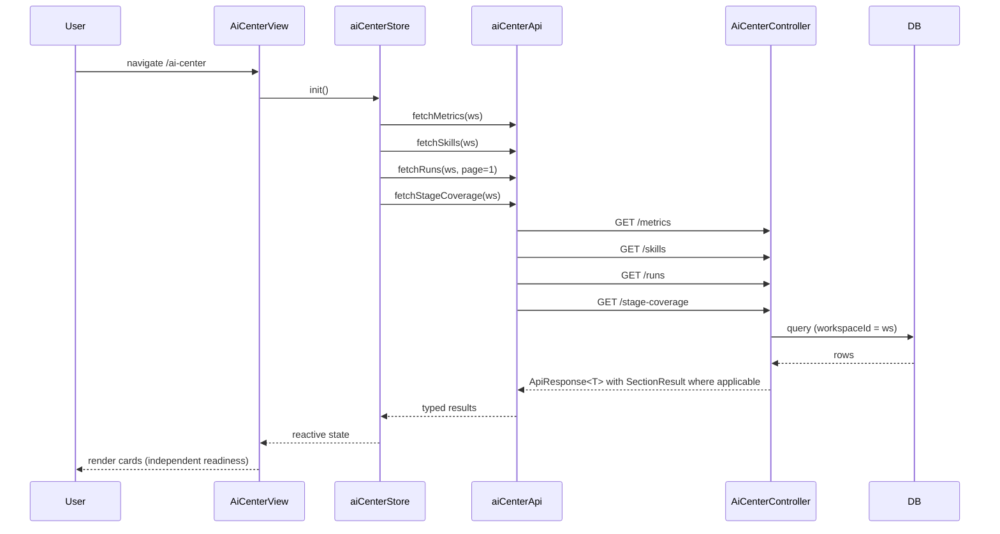
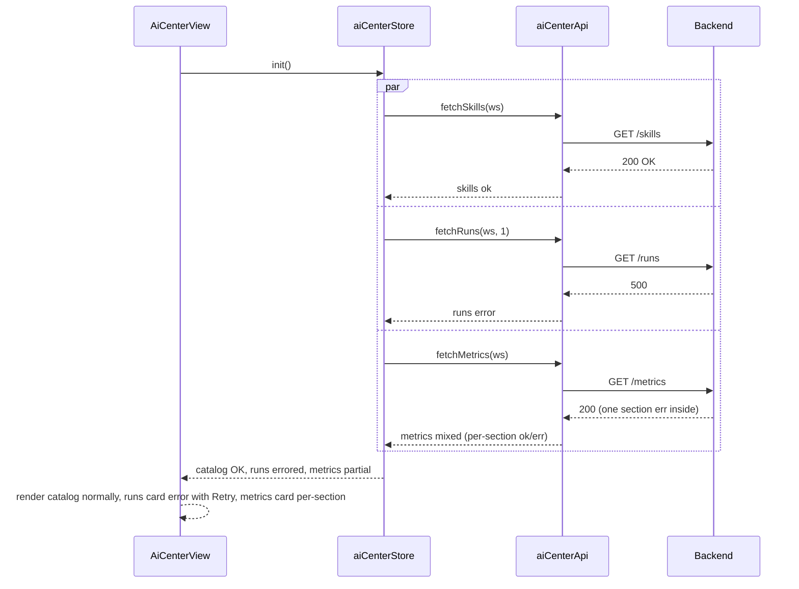
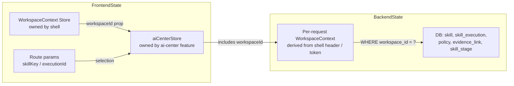
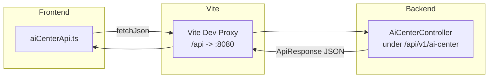
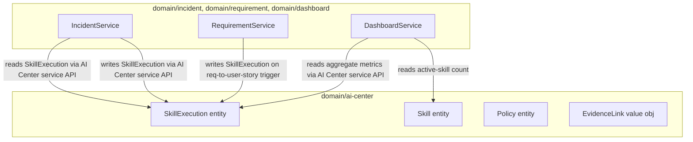

# System Architecture: AI Center

## Overview

- **Architecture Summary**: AI Center is the global AI capability surface of the platform — the read-heavy V1 UI over the platform's Skill, SkillExecution, Policy, and Evidence-link models. It plugs into the existing shared app shell and follows the same layered architecture as Dashboard and Incident: Vue 3 frontend with Pinia stores + feature-scoped API clients, Spring Boot REST API in a package-by-feature modular monolith, relational persistence via JPA + Flyway.
- **Design Objective**: Establish AI Center as the *owner* of shared AI domain models while providing a high-density, auditable control-tower view. The right-side AI Command Panel (deferred) and other slices (Incident, Requirement) will consume the same backend models without redefining them.
- **Architectural Style**: Layered service architecture within a modular monolith. Frontend: feature-sliced (`src/features/ai-center/`) with co-located components, composables, stores, types, API client. Backend: `domain/ai-center/` package owns Skill/Execution/Policy/Evidence entities.

---

## Source Specification

- **Feature / System Name**: AI Center
- **Scope Summary**: Adoption metrics strip, Skill Catalog, Run History, Policy view, Run detail with evidence & audit link-through. Phase A frontend with mocks; Phase B backend + live API. Both delivered via Codex.
- **Links**: [ai-center-spec.md](../03-spec/ai-center-spec.md), [ai-center-requirements.md](../01-requirements/ai-center-requirements.md), [ai-center-stories.md](../02-user-stories/ai-center-stories.md)

---

## Architectural Drivers

### Key Functional Drivers

- Global (workspace-scoped) view of Skills and their execution history
- Aggregate metrics on AI usage, adoption, auto-exec success, time saved, stage coverage
- Per-card error isolation (SectionResult pattern)
- Deep-link in from Dashboard's Learning stage, drill-back out to source pages
- Evidence and audit link-through per execution

### Key Non-Functional Drivers

- **Shared model authority**: AI Center's backend owns the Skill/Execution/Policy/Evidence models for the platform; other slices READ not REDEFINE.
- **Workspace isolation**: every query filters by `workspace_id`.
- **Consistency with existing slices**: reuse `ApiResponse<T>`, `SectionResult<T>`, shell workspace context, design tokens.
- **Read-mostly**: V1 exposes no write endpoints; policy editor is deferred.

### Constraints and Assumptions

- Frontend: Vue 3 / Vite / Vue Router / Pinia / TypeScript
- Backend: Spring Boot 3.x / Java 21 / JPA / Flyway
- Database: H2 (local), Oracle (prod)
- API envelope: reuse `shared/dto/ApiResponse.java`
- SectionResult pattern: reuse `dashboard/dto/SectionResultDto.java` (or promote to `shared/` if not already there — verify in implementation)
- [ASSUMPTION] V1 skill catalog per workspace ≤ 100 entries — no server-side pagination for catalog
- [ASSUMPTION] V1 run history per workspace grows but stays manageable — server pagination covers it
- [ASSUMPTION] No WebSocket; manual refresh only

---

## System Context

### Primary Actors

| Actor | Role |
|---|---|
| Platform Admin / AI Governance Owner | Curate catalog, review policy posture, audit adoption |
| Team Lead / Delivery Manager | Monitor AI effectiveness in workspace |
| IC / Auditor | Drill into specific skills or runs |

### External Systems (V1)

| System | Role in V1 |
|---|---|
| Shared App Shell | Provides authenticated workspace context, top nav, right-side AI Command Panel slot |
| Audit Service (placeholder) | Receives audit records for every skill execution; AI Center references by `auditRecordId` |
| Other Domain Modules (Incident, Requirement, Dashboard) | Trigger skill executions (write `skill_execution` rows via service API) and consume AI Center read APIs for timelines/feeds |

### System Context Diagram



---

## Component Breakdown

### Frontend Components



### Backend Components



---

## Data Flow

### Page Load (Happy Path)



### Error Isolation



---

## State Boundaries



**Ownership:**

- Workspace context: owned by shell; read-only in AI Center
- Filter/search UI state: owned by `aiCenterStore` (not persisted to URL in V1; may add in later iteration)
- Selected skill / run: owned by route (addressable deep-link)
- Cached API results: owned by `aiCenterStore` with simple TTL (5 min) + manual refresh

---

## Integration

### Frontend ↔ Backend



### AI Center as Shared Model Provider



> **Dependency rule**: consumer domains depend on `domain/ai-center/` service interfaces and DTOs, not on its JPA entities or repositories. This keeps AI Center as the single source of truth for Skill/Execution semantics.

---

## Frontend Structure

```
frontend/src/features/ai-center/
├── AiCenterView.vue                  # page-level view under router
├── components/
│   ├── AdoptionMetricsCard.vue
│   ├── StageCoverageCard.vue
│   ├── SkillCatalogCard.vue
│   ├── SkillDetailPanel.vue
│   ├── RunHistoryCard.vue
│   └── RunDetailPanel.vue
├── composables/
│   ├── useSkillFilters.ts
│   └── useRunFilters.ts
├── stores/
│   └── aiCenterStore.ts
├── api/
│   ├── aiCenterApi.ts                # uses shared fetchJson<T>
│   └── mocks.ts                      # Phase A seed
├── types.ts
└── index.ts
```

## Backend Structure

```
backend/src/main/java/com/sdlctower/domain/ai-center/
├── AiCenterController.java
├── service/
│   ├── SkillService.java
│   ├── SkillExecutionService.java
│   └── MetricsService.java
├── repository/
│   ├── SkillRepository.java
│   ├── SkillExecutionRepository.java
│   └── PolicyRepository.java
├── entity/
│   ├── Skill.java
│   ├── SkillExecution.java
│   ├── Policy.java
│   ├── SkillStage.java
│   └── EvidenceLink.java            (embeddable or entity TBD in design)
└── dto/
    ├── MetricsDto.java
    ├── StageCoverageDto.java
    ├── SkillDto.java
    ├── SkillDetailDto.java
    ├── PolicyDto.java
    ├── RunDto.java
    ├── RunDetailDto.java
    └── EvidenceLinkDto.java

backend/src/main/resources/db/migration/
├── V{n}__ai_center_schema.sql
└── V{n+1}__ai_center_seed.sql        (only for non-prod; or use profile-guarded DataLoader)
```

---

## Cross-Cutting Concerns

### Workspace Isolation

- Every entity carries `workspace_id` (VARCHAR(64) NOT NULL).
- Repository queries require `workspaceId` parameter.
- Controller extracts `workspaceId` via the shell-established `WorkspaceContext` mechanism.
- DB indexes: `(workspace_id, ...)` composite indexes on hot read paths.

### Error Handling

- Reuse `GlobalExceptionHandler` from `shared/exception/`.
- Introduce `SkillNotFoundException extends ResourceNotFoundException` and `SkillExecutionNotFoundException` for 404 mapping.
- Per-section errors inside `/metrics` wrapped in `SectionResult` (follow dashboard pattern).

### Logging

- Reuse project default logger.
- Log at INFO: request start/end with `workspaceId`, endpoint, duration.
- Log at WARN: per-section aggregation failures inside `/metrics`.
- No PII in logs (entity payloads redacted by service layer).

### Audit

- V1: read-only AI Center is not audited.
- Every `SkillExecution` write already produces an audit event (owned by the writing domain, not by AI Center's read endpoints).

---

## Deployment View

Unchanged from existing deployment — AI Center is an additional package in the same Spring Boot app and an additional feature folder in the same Vite-bundled SPA. No new services or infrastructure.

---

## Future Considerations (Out of V1)

- Policy editor (write endpoints + role-gated UI)
- Agent registry (abstraction above skills)
- Skill versioning UI (data model already supports via `skill.version` column)
- Cost / token accounting
- Real-time push via SSE for in-flight runs
- Cross-workspace aggregation for platform admins
