# AI Center — Data Flow

## Purpose

This document captures the **runtime** data flows of AI Center: how data moves through the system on page load, during navigation, under failure, and during refresh. It complements the architecture doc (structure) with sequence and state diagrams.

## Source

- [ai-center-architecture.md](ai-center-architecture.md)
- [ai-center-spec.md](../03-spec/ai-center-spec.md)

---

## 1. Flow Inventory

| # | Flow | Trigger | Phase A | Phase B |
|---|---|---|---|---|
| 1 | Page initial load | Navigate to `/ai-center` | Mocks | Live API |
| 2 | Skill detail drill-down | Click skill row / deep-link | Mocks | Live API |
| 3 | Run detail drill-down | Click run row / deep-link | Mocks | Live API |
| 4 | Filter / search (catalog) | Filter chip / search input | Client-only | Client-only |
| 5 | Filter (run history) | Run filter chip | Mock refetch | Server refetch |
| 6 | Manual refresh | Click "Refresh" on runs card | Mock refetch | Server refetch |
| 7 | Workspace switch | Shell workspace change event | Mocks re-init | API re-init |
| 8 | Error / retry (card) | Retry click on errored card | Mock refetch | Live refetch |
| 9 | Cross-page deep-link | Dashboard Learning → `/ai-center` | Route-level handoff | Route-level handoff |
| 10 | Drill-back to source | Click "Go to source" on run | Route transition | Route transition |

---

## 2. Page Load (Phase A — Mocks)

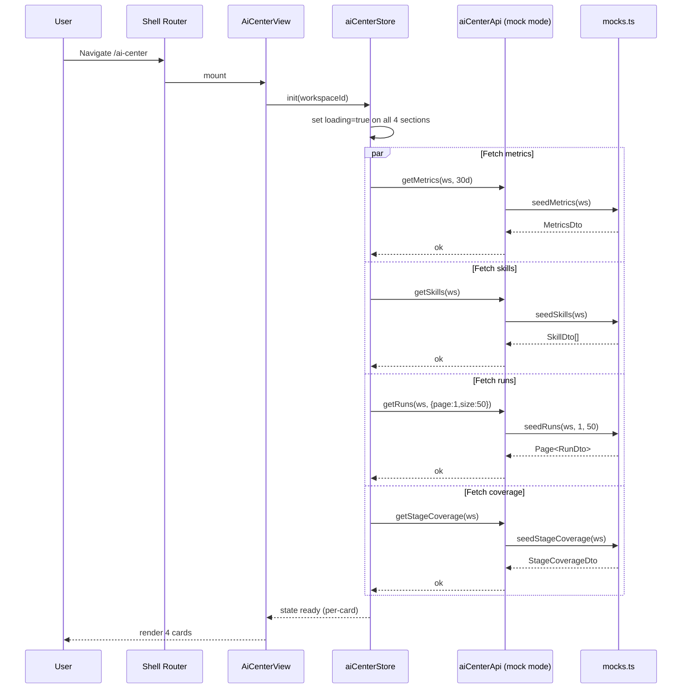

---

## 3. Page Load (Phase B — Live API)

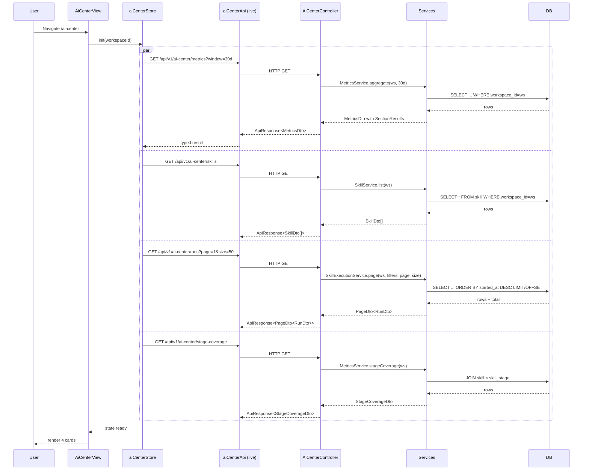

---

## 4. Skill Detail Flow

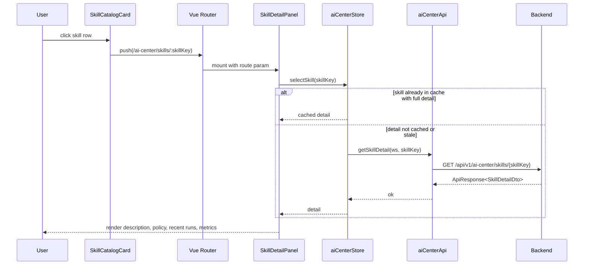

**404 sub-flow:**

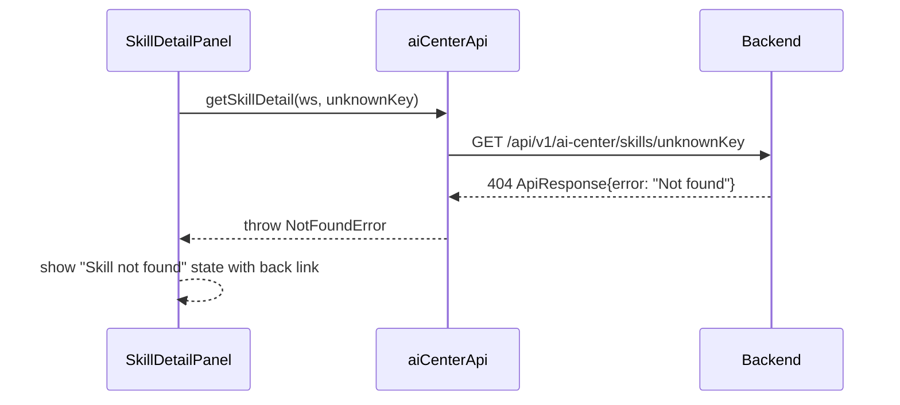

---

## 5. Run Detail Flow

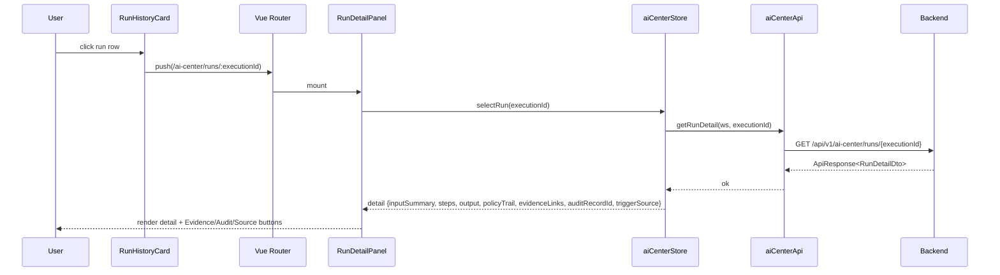

---

## 6. Filter and Refresh Behaviors

### 6.1 Catalog — Client-side Filter

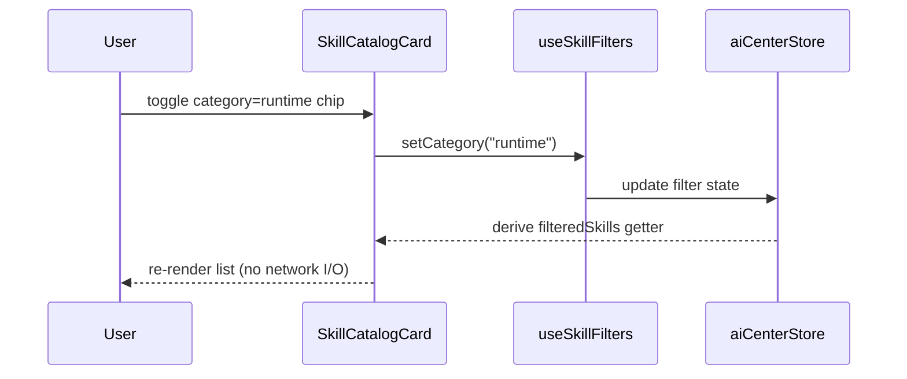

### 6.2 Run History — Server-side Filter

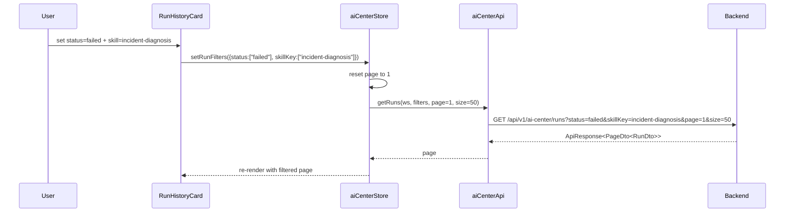

### 6.3 Manual Refresh

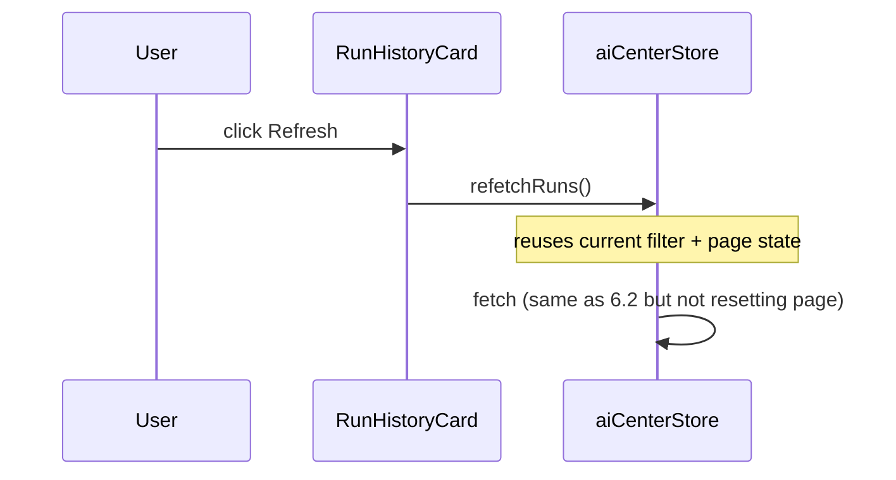

---

## 7. Error Cascade

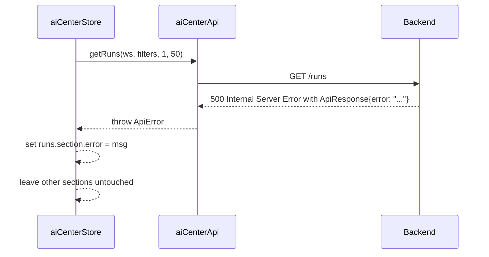

**Card rendering behavior:**

| Section error state | Other cards | Card content |
|---|---|---|
| `error` set, `data` null | untouched | error banner + "Retry" button |
| `error` set, `data` prev cached | untouched | stale data banner + "Retry" button |
| `loading` true | untouched | skeleton |
| Both null | untouched | empty state |

---

## 8. State Machine — Run Card (per card)

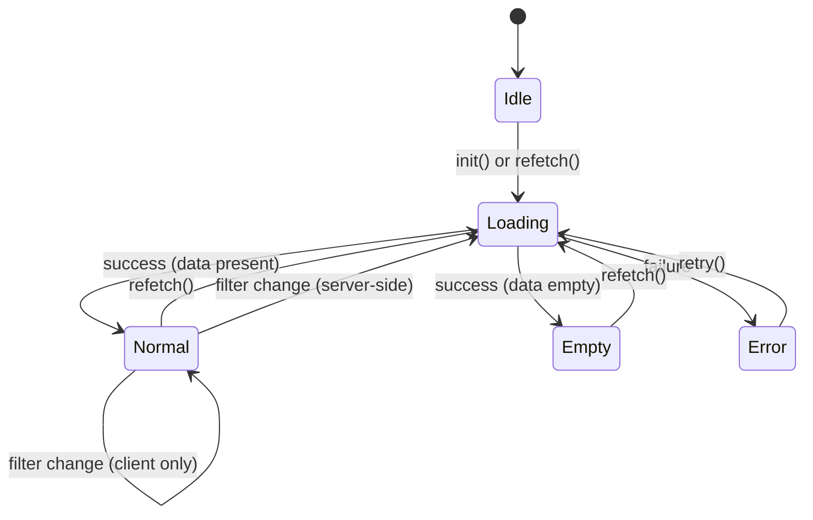

---

## 9. Workspace Switch

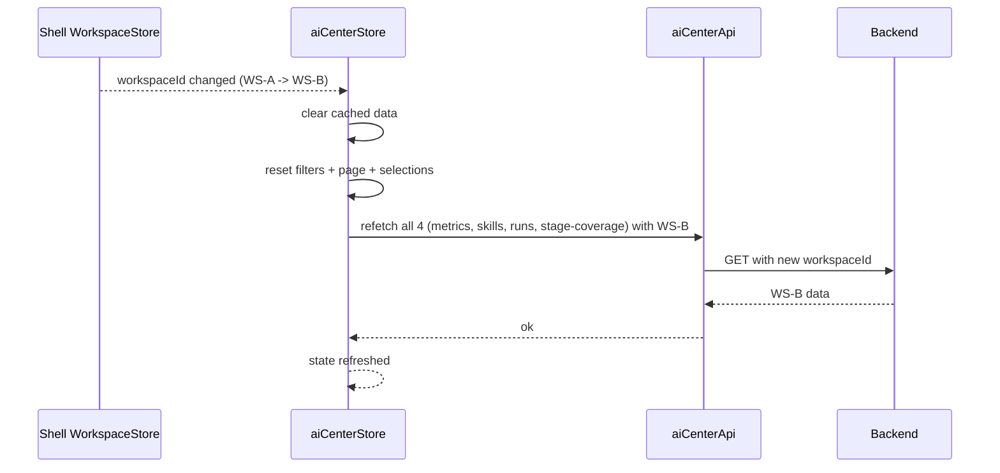

---

## 10. API Client Chain

```mermaid
graph LR
  Comp[Card component] -->|await store action| Store[aiCenterStore]
  Store -->|call typed fn| Api[aiCenterApi.ts]
  Api -->|fetchJson path, opts| Shared[shared/fetchJson]
  Shared -->|HTTP GET| Proxy[Vite dev proxy]
  Proxy --> BE[AiCenterController]
  BE -->|service call| Svc[Services]
  Svc -->|repo| Repo[JPA Repository]
  Repo --> DB[DB]
```

**Mock mode (Phase A):** `aiCenterApi` short-circuits to `mocks.ts` when `import.meta.env.VITE_USE_MOCK_API === "true"` (convention reused from dashboard slice). Phase B removes this flag or leaves it as a developer toggle.

---

## 11. Refresh Strategy

| Trigger | Refresh | Cache TTL |
|---|---|---|
| Page mount | all 4 sections | — |
| Manual refresh (runs card) | runs only | bypasses cache |
| Workspace switch | all 4 sections | invalidates all cached |
| Filter change on runs | runs only | bypasses cache |
| Navigate to skill detail | skill detail only (if not cached or >5min old) | 5 min TTL |
| Navigate to run detail | run detail only | no cache (always fresh) |

---

## 12. Telemetry Hooks (V1)

Minimal, but reserved:

- Emit `aic:view-loaded` event on first successful render
- Emit `aic:card-error` on any card-level error with `{card, workspaceId, statusCode}`
- Emit `aic:drill-into-skill` and `aic:drill-into-run` for UX analytics (no PII)
- V1 uses console.debug; future slice can wire to a real analytics sink.
