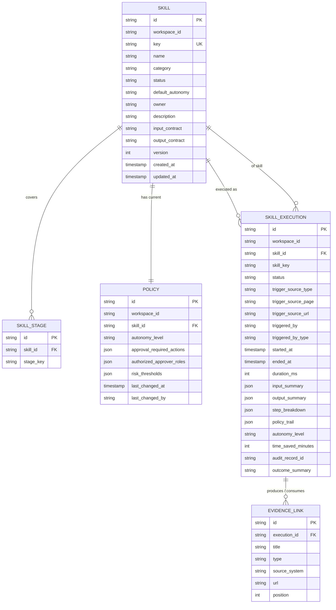

# AI Center — Data Model

## Purpose

Canonical data model for the AI Center domain: the entity relationships, the complete frontend TypeScript types, the backend DTOs and JPA entities, the Flyway DDL, and the frontend ↔ backend type mapping. Every slice that consumes Skill or SkillExecution semantics must reference this doc.

## Source

- [ai-center-spec.md](../03-spec/ai-center-spec.md)
- [ai-center-architecture.md](ai-center-architecture.md)

---

## 1. Domain Model (ER Diagram)



**Cardinality notes:**

- A `Skill` has one *current* `Policy` per workspace (V1 has no versioned policy history — last-write-wins).
- A `Skill` covers zero or more SDLC stages (`skill_stage` bridge table).
- A `SkillExecution` belongs to exactly one `Skill` but captures `skill_key` denormalized for audit / historical stability.
- `EvidenceLink` is owned by `SkillExecution` (cascade delete).

---

## 2. Frontend Types (`frontend/src/features/ai-center/types.ts`)

```ts
// ---------- Enums ----------

export type SkillStatus = "active" | "beta" | "deprecated";

export type AutonomyLevel = "L0-Manual" | "L1-Assist" | "L2-Auto-with-approval" | "L3-Auto";

export type SkillCategory = "delivery" | "runtime";

export type ExecutionStatus =
  | "running"
  | "succeeded"
  | "failed"
  | "pending_approval"
  | "rejected"
  | "rolled_back";

export type TriggeredByType = "ai" | "human" | "system";

export type SdlcStageKey =
  | "requirement"
  | "user-story"
  | "spec"
  | "architecture"
  | "design"
  | "tasks"
  | "code"
  | "test"
  | "deploy"
  | "incident"
  | "learning";

// ---------- Core entities ----------

export interface Skill {
  id: string;
  key: string;                 // e.g. "incident-diagnosis"
  name: string;
  category: SkillCategory;
  subCategory?: string;        // free-form, e.g. "Delivery / req-to-user-story"
  status: SkillStatus;
  defaultAutonomy: AutonomyLevel;
  owner: string;
  description: string;
  stages: SdlcStageKey[];
  lastExecutedAt: string | null; // ISO
  successRate30d: number | null; // 0..1
  version: number;
}

export interface Policy {
  skillKey: string;
  autonomyLevel: AutonomyLevel;
  approvalRequiredActions: string[];
  authorizedApproverRoles: string[];
  riskThresholds: Record<string, unknown>;
  lastChangedAt: string;
  lastChangedBy: string;
}

export interface SkillDetail extends Skill {
  inputContract: string;
  outputContract: string;
  policy: Policy;
  recentRuns: Run[];          // up to 10
  aggregateMetrics: {
    successRate: number;
    avgDurationMs: number;
    adoptionTrend: "up" | "down" | "flat";
    totalRuns30d: number;
  };
}

// ---------- Runs ----------

export interface Run {
  id: string;
  skillKey: string;
  skillName: string;
  status: ExecutionStatus;
  triggerSourceType: "page" | "schedule" | "webhook" | "manual";
  triggerSourcePage: string | null;  // e.g. "/incidents/INC-0422"
  triggerSourceUrl: string | null;
  triggeredBy: string;
  triggeredByType: TriggeredByType;
  startedAt: string;
  endedAt: string | null;
  durationMs: number | null;
  outcomeSummary: string;
  auditRecordId: string | null;
}

export interface EvidenceLink {
  title: string;
  type: string;
  sourceSystem: string;
  url: string;
}

export interface RunDetail extends Run {
  inputSummary: Record<string, unknown>;
  outputSummary: Record<string, unknown>;
  stepBreakdown: RunStep[];
  policyTrail: PolicyTrailEntry[];
  evidenceLinks: EvidenceLink[];
  autonomyLevel: AutonomyLevel;
  timeSavedMinutes: number;
}

export interface RunStep {
  ordinal: number;
  name: string;
  status: ExecutionStatus;
  startedAt: string;
  endedAt: string | null;
  durationMs: number | null;
  note?: string;
}

export interface PolicyTrailEntry {
  rule: string;
  decision: "allowed" | "held-for-approval" | "denied" | "bypassed";
  at: string;
  note?: string;
}

// ---------- Metrics ----------

export interface MetricValue {
  value: number;
  unit: "%" | "hours" | "count";
  delta: number;                 // absolute delta vs previous window
  trend: "up" | "down" | "flat";
  isPositive: boolean;           // whether the trend is good
}

export interface MetricsSummary {
  window: "30d" | "7d" | "24h";
  aiUsageRate: MetricValue;
  adoptionRate: MetricValue;
  autoExecSuccessRate: MetricValue;
  timeSavedHours: MetricValue;
  stageCoverageCount: MetricValue;
}

export interface StageCoverageEntry {
  stageKey: SdlcStageKey;
  stageLabel: string;
  activeSkillCount: number;
  covered: boolean;
}

export type StageCoverage = StageCoverageEntry[]; // length = 11

// ---------- Pagination envelope ----------

export interface Page<T> {
  items: T[];
  page: number;
  size: number;
  total: number;
  hasMore: boolean;
}

// ---------- Section result (reused) ----------

export interface SectionResult<T> {
  data: T | null;
  error: string | null;
}
```

---

## 3. Backend DTOs (`domain/ai-center/dto/`)

Java 21 records, camelCase JSON.

```java
public record SkillDto(
    String id,
    String key,
    String name,
    String category,
    String subCategory,
    String status,
    String defaultAutonomy,
    String owner,
    String description,
    List<String> stages,
    Instant lastExecutedAt,
    Double successRate30d,
    int version
) {}

public record PolicyDto(
    String skillKey,
    String autonomyLevel,
    List<String> approvalRequiredActions,
    List<String> authorizedApproverRoles,
    Map<String, Object> riskThresholds,
    Instant lastChangedAt,
    String lastChangedBy
) {}

public record SkillDetailDto(
    SkillDto skill,
    String inputContract,
    String outputContract,
    PolicyDto policy,
    List<RunDto> recentRuns,
    AggregateMetricsDto aggregateMetrics
) {}

public record AggregateMetricsDto(
    double successRate,
    long avgDurationMs,
    String adoptionTrend,
    long totalRuns30d
) {}

public record RunDto(
    String id,
    String skillKey,
    String skillName,
    String status,
    String triggerSourceType,
    String triggerSourcePage,
    String triggerSourceUrl,
    String triggeredBy,
    String triggeredByType,
    Instant startedAt,
    Instant endedAt,
    Long durationMs,
    String outcomeSummary,
    String auditRecordId
) {}

public record EvidenceLinkDto(
    String title,
    String type,
    String sourceSystem,
    String url
) {}

public record RunStepDto(
    int ordinal,
    String name,
    String status,
    Instant startedAt,
    Instant endedAt,
    Long durationMs,
    String note
) {}

public record PolicyTrailEntryDto(
    String rule,
    String decision,
    Instant at,
    String note
) {}

public record RunDetailDto(
    RunDto run,
    Map<String, Object> inputSummary,
    Map<String, Object> outputSummary,
    List<RunStepDto> stepBreakdown,
    List<PolicyTrailEntryDto> policyTrail,
    List<EvidenceLinkDto> evidenceLinks,
    String autonomyLevel,
    int timeSavedMinutes
) {}

public record MetricValueDto(
    double value,
    String unit,
    double delta,
    String trend,
    boolean isPositive
) {}

public record MetricsSummaryDto(
    String window,
    SectionResultDto<MetricValueDto> aiUsageRate,
    SectionResultDto<MetricValueDto> adoptionRate,
    SectionResultDto<MetricValueDto> autoExecSuccessRate,
    SectionResultDto<MetricValueDto> timeSavedHours,
    SectionResultDto<MetricValueDto> stageCoverageCount
) {}

public record StageCoverageEntryDto(
    String stageKey,
    String stageLabel,
    int activeSkillCount,
    boolean covered
) {}

public record StageCoverageDto(
    List<StageCoverageEntryDto> entries
) {}

public record PageDto<T>(
    List<T> items,
    int page,
    int size,
    long total,
    boolean hasMore
) {}
```

> `SectionResultDto<T>` is reused from `dashboard/dto/SectionResultDto.java`. If not yet promoted to `shared/`, Codex Phase B should promote it (non-breaking move + re-export) OR import from dashboard — design doc will pick.

---

## 4. JPA Entities (`domain/ai-center/entity/`)

```java
@Entity
@Table(name = "skill", indexes = {
    @Index(name = "idx_skill_ws_key", columnList = "workspace_id, key", unique = true),
    @Index(name = "idx_skill_ws_category", columnList = "workspace_id, category")
})
public class Skill {
    @Id private String id;                          // UUID
    @Column(name = "workspace_id", nullable = false) private String workspaceId;
    @Column(name = "key", nullable = false) private String key;
    @Column(nullable = false) private String name;
    @Column(nullable = false) private String category;       // delivery | runtime
    @Column(name = "sub_category") private String subCategory;
    @Column(nullable = false) private String status;         // active|beta|deprecated
    @Column(name = "default_autonomy", nullable = false) private String defaultAutonomy;
    @Column(nullable = false) private String owner;
    @Column(columnDefinition = "CLOB") private String description;
    @Column(name = "input_contract", columnDefinition = "CLOB") private String inputContract;
    @Column(name = "output_contract", columnDefinition = "CLOB") private String outputContract;
    @Column(nullable = false) private int version;
    @Column(name = "created_at", nullable = false) private Instant createdAt;
    @Column(name = "updated_at", nullable = false) private Instant updatedAt;
    // + getters/setters (or @Data alternative per project convention — no Lombok)
}

@Entity
@Table(name = "skill_stage", indexes = {
    @Index(name = "idx_skill_stage_skill", columnList = "skill_id")
})
public class SkillStage {
    @Id private String id;
    @Column(name = "skill_id", nullable = false) private String skillId;
    @Column(name = "stage_key", nullable = false) private String stageKey;
}

@Entity
@Table(name = "policy", indexes = {
    @Index(name = "idx_policy_ws_skill", columnList = "workspace_id, skill_id", unique = true)
})
public class Policy {
    @Id private String id;
    @Column(name = "workspace_id", nullable = false) private String workspaceId;
    @Column(name = "skill_id", nullable = false) private String skillId;
    @Column(name = "autonomy_level", nullable = false) private String autonomyLevel;
    @Column(name = "approval_required_actions", columnDefinition = "CLOB") private String approvalRequiredActionsJson;
    @Column(name = "authorized_approver_roles", columnDefinition = "CLOB") private String authorizedApproverRolesJson;
    @Column(name = "risk_thresholds", columnDefinition = "CLOB") private String riskThresholdsJson;
    @Column(name = "last_changed_at", nullable = false) private Instant lastChangedAt;
    @Column(name = "last_changed_by", nullable = false) private String lastChangedBy;
}

@Entity
@Table(name = "skill_execution", indexes = {
    @Index(name = "idx_exec_ws_started", columnList = "workspace_id, started_at"),
    @Index(name = "idx_exec_ws_skill", columnList = "workspace_id, skill_id, started_at"),
    @Index(name = "idx_exec_ws_status", columnList = "workspace_id, status")
})
public class SkillExecution {
    @Id private String id;
    @Column(name = "workspace_id", nullable = false) private String workspaceId;
    @Column(name = "skill_id", nullable = false) private String skillId;
    @Column(name = "skill_key", nullable = false) private String skillKey;       // denormalized
    @Column(nullable = false) private String status;
    @Column(name = "trigger_source_type", nullable = false) private String triggerSourceType;
    @Column(name = "trigger_source_page") private String triggerSourcePage;
    @Column(name = "trigger_source_url") private String triggerSourceUrl;
    @Column(name = "triggered_by", nullable = false) private String triggeredBy;
    @Column(name = "triggered_by_type", nullable = false) private String triggeredByType;
    @Column(name = "started_at", nullable = false) private Instant startedAt;
    @Column(name = "ended_at") private Instant endedAt;
    @Column(name = "duration_ms") private Long durationMs;
    @Column(name = "input_summary", columnDefinition = "CLOB") private String inputSummaryJson;
    @Column(name = "output_summary", columnDefinition = "CLOB") private String outputSummaryJson;
    @Column(name = "step_breakdown", columnDefinition = "CLOB") private String stepBreakdownJson;
    @Column(name = "policy_trail", columnDefinition = "CLOB") private String policyTrailJson;
    @Column(name = "autonomy_level") private String autonomyLevel;
    @Column(name = "time_saved_minutes") private Integer timeSavedMinutes;
    @Column(name = "audit_record_id") private String auditRecordId;
    @Column(name = "outcome_summary") private String outcomeSummary;
}

@Entity
@Table(name = "evidence_link", indexes = {
    @Index(name = "idx_ev_execution", columnList = "execution_id, position")
})
public class EvidenceLink {
    @Id private String id;
    @Column(name = "execution_id", nullable = false) private String executionId;
    @Column(nullable = false) private String title;
    @Column(nullable = false) private String type;
    @Column(name = "source_system", nullable = false) private String sourceSystem;
    @Column(nullable = false) private String url;
    @Column(nullable = false) private int position;
}
```

> JSON columns use CLOB with a String field + Jackson (de)serialization at the service boundary. No vendor-specific JSON types (portable between H2 and Oracle).

---

## 5. Flyway DDL (V{n}__ai_center_schema.sql)

```sql
-- V{n}__ai_center_schema.sql

CREATE TABLE skill (
  id               VARCHAR(64)  NOT NULL PRIMARY KEY,
  workspace_id     VARCHAR(64)  NOT NULL,
  key              VARCHAR(128) NOT NULL,
  name             VARCHAR(256) NOT NULL,
  category         VARCHAR(32)  NOT NULL,
  sub_category     VARCHAR(64),
  status           VARCHAR(16)  NOT NULL,
  default_autonomy VARCHAR(32)  NOT NULL,
  owner            VARCHAR(128) NOT NULL,
  description      CLOB,
  input_contract   CLOB,
  output_contract  CLOB,
  version          INT          NOT NULL DEFAULT 1,
  created_at       TIMESTAMP    NOT NULL,
  updated_at       TIMESTAMP    NOT NULL
);
CREATE UNIQUE INDEX idx_skill_ws_key ON skill (workspace_id, key);
CREATE INDEX idx_skill_ws_category   ON skill (workspace_id, category);

CREATE TABLE skill_stage (
  id         VARCHAR(64)  NOT NULL PRIMARY KEY,
  skill_id   VARCHAR(64)  NOT NULL,
  stage_key  VARCHAR(32)  NOT NULL,
  CONSTRAINT fk_skill_stage_skill FOREIGN KEY (skill_id) REFERENCES skill(id) ON DELETE CASCADE
);
CREATE INDEX idx_skill_stage_skill ON skill_stage (skill_id);

CREATE TABLE policy (
  id                          VARCHAR(64)  NOT NULL PRIMARY KEY,
  workspace_id                VARCHAR(64)  NOT NULL,
  skill_id                    VARCHAR(64)  NOT NULL,
  autonomy_level              VARCHAR(32)  NOT NULL,
  approval_required_actions   CLOB,
  authorized_approver_roles   CLOB,
  risk_thresholds             CLOB,
  last_changed_at             TIMESTAMP    NOT NULL,
  last_changed_by             VARCHAR(128) NOT NULL,
  CONSTRAINT fk_policy_skill FOREIGN KEY (skill_id) REFERENCES skill(id) ON DELETE CASCADE
);
CREATE UNIQUE INDEX idx_policy_ws_skill ON policy (workspace_id, skill_id);

CREATE TABLE skill_execution (
  id                    VARCHAR(64)  NOT NULL PRIMARY KEY,
  workspace_id          VARCHAR(64)  NOT NULL,
  skill_id              VARCHAR(64)  NOT NULL,
  skill_key             VARCHAR(128) NOT NULL,
  status                VARCHAR(32)  NOT NULL,
  trigger_source_type   VARCHAR(16)  NOT NULL,
  trigger_source_page   VARCHAR(256),
  trigger_source_url    VARCHAR(512),
  triggered_by          VARCHAR(128) NOT NULL,
  triggered_by_type     VARCHAR(16)  NOT NULL,
  started_at            TIMESTAMP    NOT NULL,
  ended_at              TIMESTAMP,
  duration_ms           BIGINT,
  input_summary         CLOB,
  output_summary        CLOB,
  step_breakdown        CLOB,
  policy_trail          CLOB,
  autonomy_level        VARCHAR(32),
  time_saved_minutes    INT,
  audit_record_id       VARCHAR(64),
  outcome_summary       VARCHAR(512),
  CONSTRAINT fk_exec_skill FOREIGN KEY (skill_id) REFERENCES skill(id)
);
CREATE INDEX idx_exec_ws_started ON skill_execution (workspace_id, started_at DESC);
CREATE INDEX idx_exec_ws_skill   ON skill_execution (workspace_id, skill_id, started_at DESC);
CREATE INDEX idx_exec_ws_status  ON skill_execution (workspace_id, status);

CREATE TABLE evidence_link (
  id            VARCHAR(64)  NOT NULL PRIMARY KEY,
  execution_id  VARCHAR(64)  NOT NULL,
  title         VARCHAR(256) NOT NULL,
  type          VARCHAR(32)  NOT NULL,
  source_system VARCHAR(64)  NOT NULL,
  url           VARCHAR(1024) NOT NULL,
  position      INT NOT NULL,
  CONSTRAINT fk_ev_execution FOREIGN KEY (execution_id) REFERENCES skill_execution(id) ON DELETE CASCADE
);
CREATE INDEX idx_ev_execution ON evidence_link (execution_id, position);
```

**Oracle portability notes:**

- H2 in compat mode `MODE=Oracle` is recommended for local dev to catch Oracle-isms early.
- Avoid reserved words: `key` column in H2 is fine; in Oracle it's reserved. Rename to `skill_key` at table level or quote with `"key"`. **Recommended**: rename the column to `skill_key_code` to avoid quoting. Implementation detail confirmed in design doc.
- Avoid `TEXT` type; use `CLOB`.
- Avoid `BOOLEAN` type; use `NUMBER(1)` with `0/1` or `CHAR(1)` with `'Y'/'N'` — V1 schema has no booleans yet.
- `ON DELETE CASCADE` supported by both.

---

## 6. Seed Data (V{n+1}__ai_center_seed.sql, local/dev only)

Seed must cover:

- At least 6 skills (mix of delivery + runtime categories), each with a policy
- At least 20 executions across 30 days, spanning all statuses (incl. `pending_approval`, `rejected`, `rolled_back`)
- Stage coverage spanning at least 8 of 11 SDLC stages
- Two example skills with `pending_approval` executions (for governance posture demo)
- Evidence links on at least 5 executions

> Seed must be environment-gated: either apply only under the `local` Flyway profile via `flyway.locations=classpath:db/migration,classpath:db/seed` split, OR use a `@Profile("local") CommandLineRunner` DataLoader. Design doc picks the approach.

---

## 7. Frontend ↔ Backend Type Mapping

| Frontend (TS) | Backend (Java record) | Notes |
|---|---|---|
| `Skill` | `SkillDto` | 1:1 field match. `Instant` → ISO string in JSON. |
| `Policy` | `PolicyDto` | JSON columns deserialize to `Map/List` on the BE, direct JSON on the wire. |
| `SkillDetail` | `SkillDetailDto` | BE composes; FE flattens `.skill` spread to match TS `extends Skill`. |
| `Run` | `RunDto` | 1:1. |
| `RunDetail` | `RunDetailDto` | BE composes; FE flattens `.run` spread. |
| `EvidenceLink` | `EvidenceLinkDto` | 1:1. |
| `RunStep` | `RunStepDto` | 1:1. |
| `PolicyTrailEntry` | `PolicyTrailEntryDto` | 1:1. |
| `MetricsSummary` | `MetricsSummaryDto` | Per-section `SectionResult<MetricValue>`. FE unwraps same way as dashboard. |
| `MetricValue` | `MetricValueDto` | 1:1. |
| `StageCoverage` | `StageCoverageDto` | BE returns object with `entries`; FE flattens to array. |
| `StageCoverageEntry` | `StageCoverageEntryDto` | 1:1. |
| `Page<Run>` | `PageDto<RunDto>` | 1:1. |
| `SectionResult<T>` | `SectionResultDto<T>` | Reused from dashboard slice. |

**Serialization conventions:**

- camelCase JSON
- `Instant` ↔ ISO-8601 string with `Z` suffix
- `null` serialized explicitly (no omit)
- Enums serialized as strings using the exact values listed in §2

---

## 8. Cross-Domain Type Consumption

When Incident / Requirement / Dashboard needs Skill or Execution data, they MUST:

- Import `SkillDto`, `RunDto`, or the Java service interfaces from `domain.ai_center` package
- Never duplicate these types in their own domain
- Never access `SkillRepository` / `SkillExecutionRepository` directly — go through `SkillService` / `SkillExecutionService`

This preserves AI Center as the single source of truth for these models.
