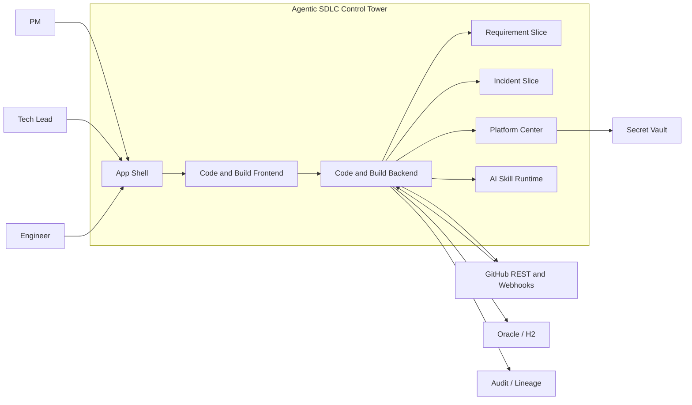
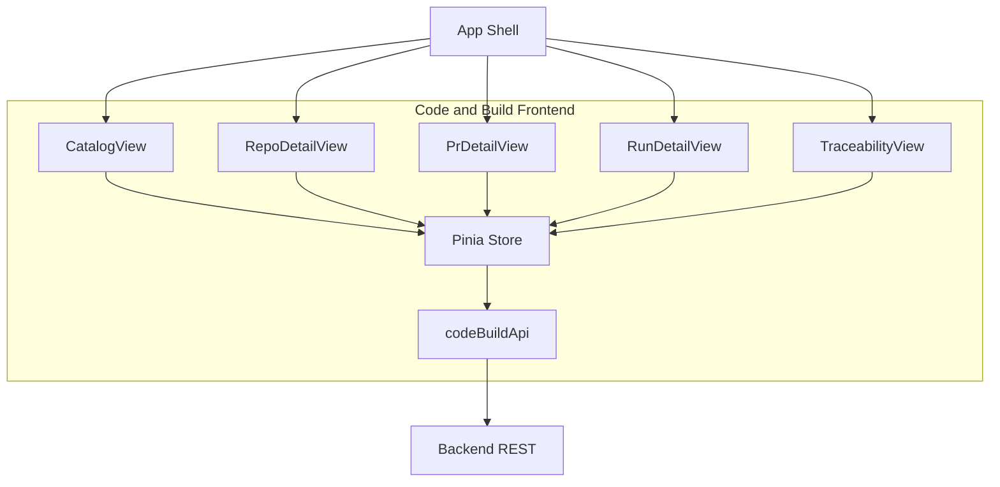
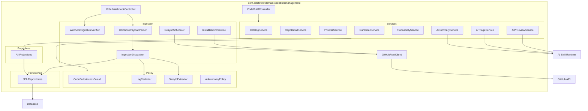
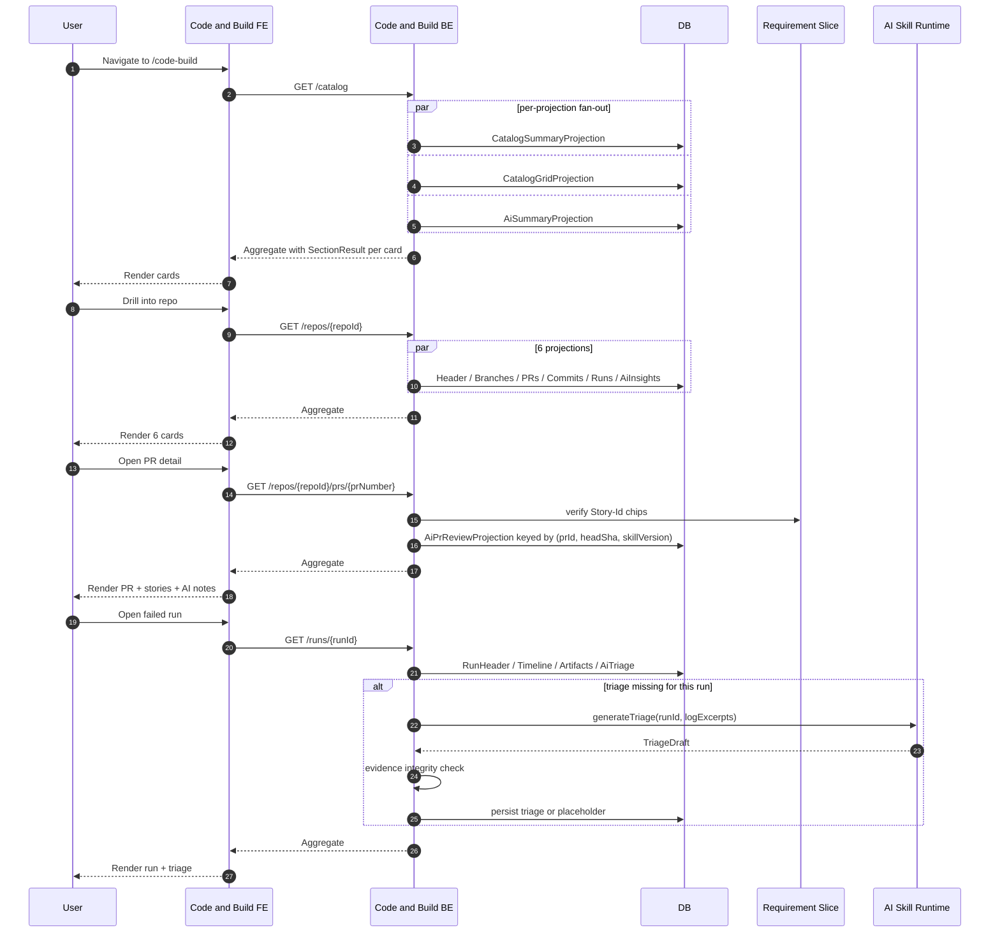
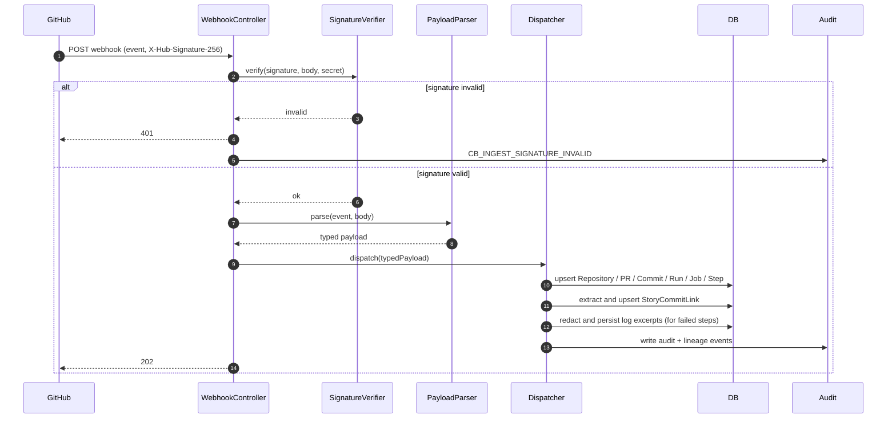
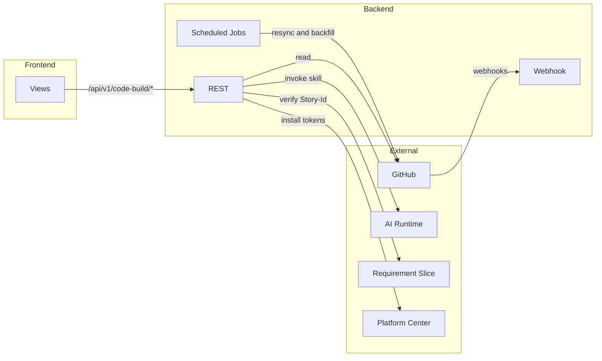

# Code & Build Management — Architecture

## 1. Purpose

This document describes the architecture of the **Code & Build Management** slice. V1 is a read-only observability viewer for GitHub + GitHub Actions with Story↔Commit↔Build traceability and three AI capabilities: workspace summary, failure triage, and PR review assist.

### Upstream references

- Requirements: [../01-requirements/code-build-management-requirements.md](../01-requirements/code-build-management-requirements.md)
- Stories: [../02-user-stories/code-build-management-stories.md](../02-user-stories/code-build-management-stories.md)
- Spec: [../03-spec/code-build-management-spec.md](../03-spec/code-build-management-spec.md)

## 2. System Context

Actors, systems, and stores relevant to the slice:

## 3. Component Breakdown — Frontend

Catalog View mounts: `CatalogSummaryBarCard`, `CatalogGridCard`, `CatalogFilterBar`, `CatalogAiSummaryCard`.

Repo Detail mounts: `RepoHeaderCard`, `RepoBranchesCard`, `RepoOpenPrsCard`, `RepoRecentCommitsCard`, `RepoRecentRunsCard`, `RepoAiInsightsCard`.

PR Detail mounts: `PrHeaderCard`, `PrLinkedStoriesCard`, `PrCiStatusCard`, `PrAiReviewCard`.

Run Detail mounts: `RunHeaderCard`, `RunTimelineCard`, `RunArtifactsCard`, `RunAiTriageCard`, `OpenIncidentAction`.

Traceability View mounts: `TraceabilityInputCard`, `TraceabilityCommitsCard`, `TraceabilityPrsCard`, `TraceabilityRunsCard`.

## 4. Component Breakdown — Backend

## 5. Data Flow (High-level)

## 6. Ingestion Flow

Resync (every 24h) and install backfill (on `installation` + `installation_repositories`) walk the GitHub REST API and reconcile against ingested rows.

## 7. State Boundaries

- **Frontend state (Pinia):** derived view aggregates per page, per-card status, active filters. No raw webhook payloads, no tokens.
- **Backend state (DB):** canonical record of repositories, branches, pull requests, commits, pipeline runs, jobs, steps, story links, AI review notes, triage rows, AI summary rows, change log, redacted log excerpts.
- **Secret Vault (Platform Center):** GitHub App private key and webhook secret. Backend holds short-lived installation access tokens in memory; never persisted.
- **GitHub (external):** source of truth for code / PR / pipeline state. Control Tower is a read-side consumer.
- **Audit / Lineage stores:** cross-slice shared, append-only.

## 8. Integration Boundary

## 9. Non-functional Constraints

- P95 aggregate latency: Catalog ≤1200ms; Repo Detail ≤1500ms; Run Detail ≤1500ms.
- Per-projection timeout: 500ms; failing projection returns `SectionResult(data=null, error=...)`.
- Webhook freshness SLO: push visible in UI within 30s at P95.
- Webhook receiver handles 50 req/s burst per installation with backpressure to an async dispatcher queue.
- GitHub rate-limit aware: primary (5000/hr/install) and secondary (abuse) both handled with retry-after and a per-installation token bucket.
- Every mutation path emits `AuditLogEntry` + `LineageEvent`.
- No direct table access from other slices; downstream consumers use facade endpoints.

## 10. Security Posture

- Webhook signature HMAC-SHA-256 verified on every request; invalid → 401 + audit.
- GitHub tokens never leave Platform Center vault; installation tokens are minted per request and held in memory, never logged.
- Log excerpts are redacted before storage (AWS keys `AKIA…`, GitHub PATs `ghp_…`, generic `Bearer …`); regex + deny-list per shared `SecretsRedactor` utility.
- AI prompts exclude environment variables and secret-shaped tokens (redactor runs on prompts too).
- BLOCKER-severity AI review note bodies are role-gated (PM/Tech Lead on the repo's project); others see counts only.
- All ingestion and AI invocation is audited with correlation ID propagation.

## 11. Risks and Mitigations

| Risk | Mitigation |
| ---- | ---------- |
| Webhook floods during CI storm | Async dispatcher queue with per-installation backpressure + bounded concurrency |
| GitHub rate limits hurt backfill / resync | Per-installation token bucket; exponential backoff; UI banner when sustained |
| AI triage hallucinates file/step references | Evidence integrity check at service time; placeholder shown if mismatch (REQ-CB-32) |
| AI review note visible to wrong audience | BLOCKER role gate + project-scoped access guard |
| Log excerpt leaks secrets | Redactor runs on ingestion AND on AI prompt construction; no raw logs stored |
| Story-Id typos pollute link rows | `UNKNOWN_STORY` status + nightly resolver + visible `UNVERIFIED` chip |
| GitHub App uninstall orphans data | `installation` webhook handler soft-archives repos; audit trail preserved |
| Oracle BLOB handling differs from H2 | Migration authored with dialect-aware column types; verified on Oracle-in-Docker |
| Re-runs create duplicate triage rows | Unique `(runId, skillVersion)` index; SUPERSEDED marker on conclusion change |
| Cross-slice Requirement lookup cascades latency | Batch verify calls; cache within a single request scope only |

## 12. Decisions

Mirrors the spec's decision list (D1–D10) plus architecture-specific choices:

- **D11** — Webhook receiver is synchronous for signature verification + parsing only; heavy work is handed off to `IngestionDispatcher` via an in-process queue (Spring `@Async` + bounded thread pool) backed by a persistent outbox table for durability across restarts.
- **D12** — Projections read from DB; they never call GitHub directly. All GitHub reads happen in ingestion and resync paths. Rationale: predictable latency for user-facing aggregates.
- **D13** — AI runs (summary, triage, PR review) are invoked asynchronously from the request path; user-facing requests read the latest persisted AI row and show PENDING if none exists. Rationale: keeps P95 latency within budget even when the AI runtime is slow.
- **D14** — Story link rows are computed at ingestion time, not at query time. Rationale: avoids re-parsing commit messages on every Catalog load.

## 13. Glossary

See the spec's glossary (§9). Architecture adds:

- **Dispatcher** — in-process component that consumes parsed webhook events and upserts DB rows.
- **Outbox** — DB-backed persistent queue used by the async dispatcher to survive restarts.
- **Projection** — a read-side query function that builds a view DTO from DB rows.
- **Installation Token** — short-lived token minted per API call via GitHub App JWT.
