# Code & Build Management — Data Flow

Runtime sequences, state machines, error cascade, and refresh strategy for the Code & Build Management slice. Operationalizes [code-build-management-architecture.md](code-build-management-architecture.md) and the contracts in [../05-design/contracts/code-build-management-API_IMPLEMENTATION_GUIDE.md](../05-design/contracts/code-build-management-API_IMPLEMENTATION_GUIDE.md).

## 1. Catalog Page Load (Phase A — mocks)

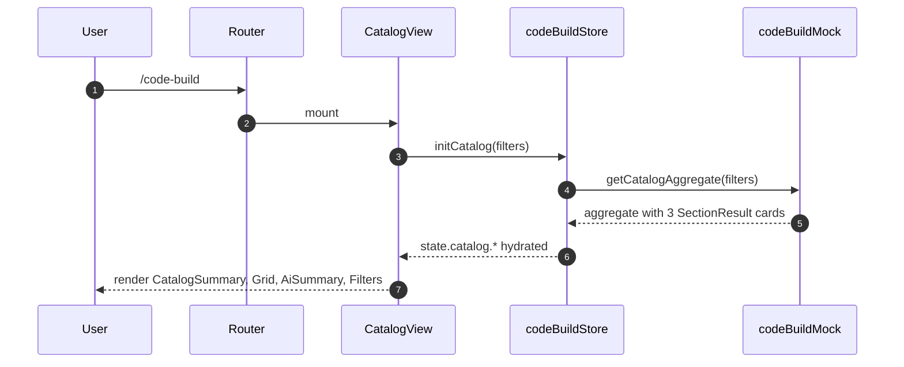

## 2. Catalog Page Load (Phase B — backend)

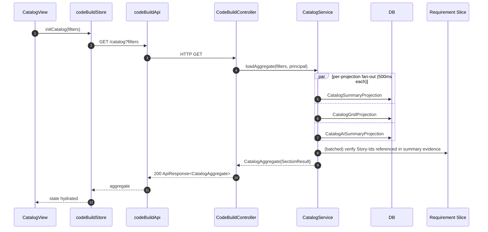

## 3. Repo Detail Page Load

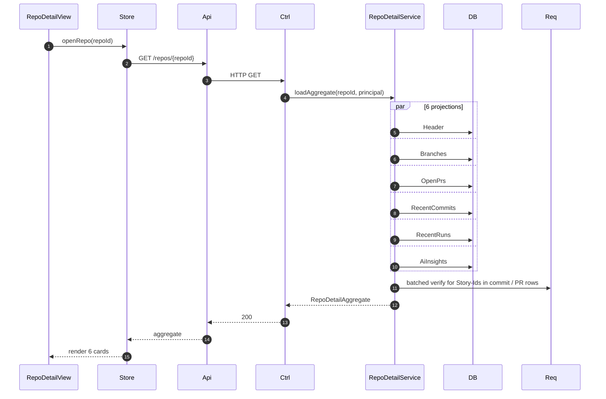

## 4. Run Detail with AI Triage

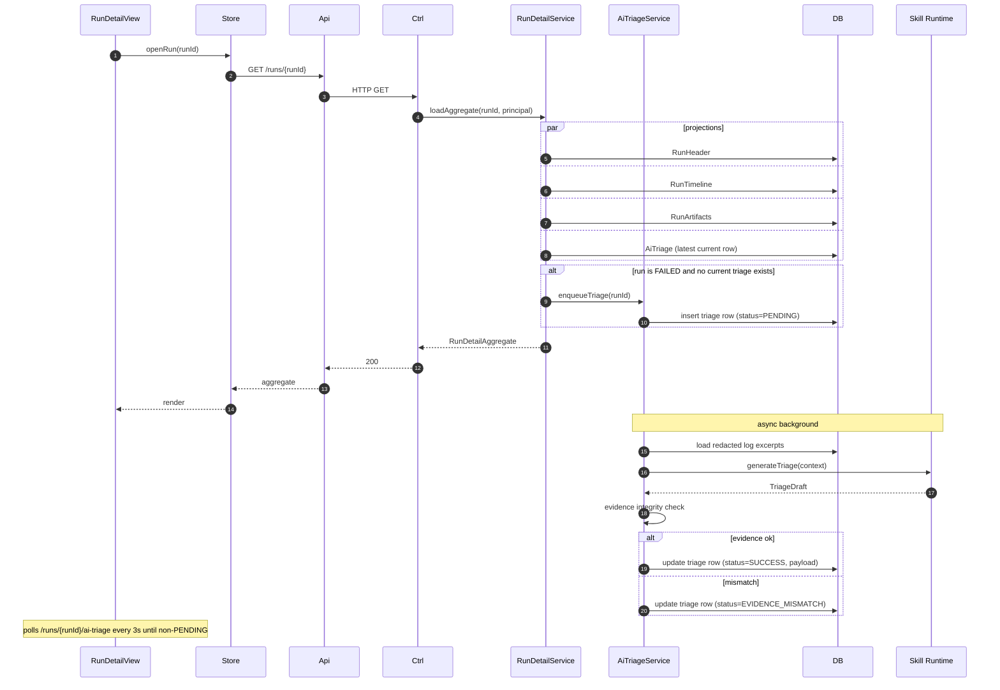

## 5. PR Review Re-run on Head Commit Advance

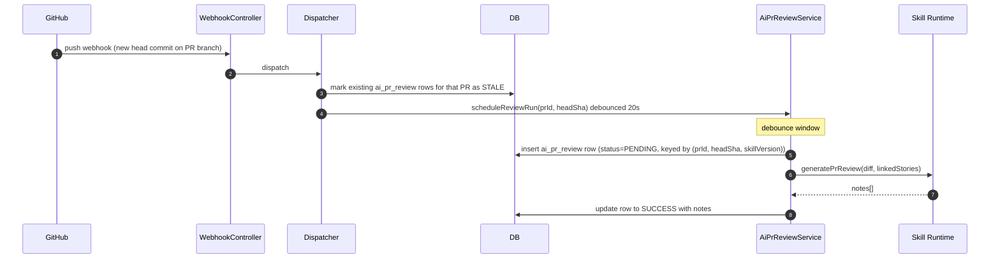

## 6. Story → Commit → Build Inverse Lookup

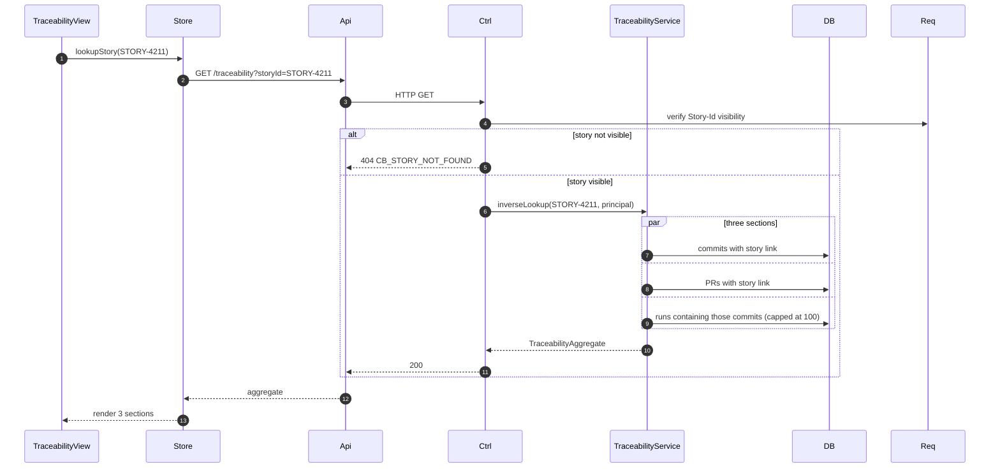

## 7. Webhook Ingestion

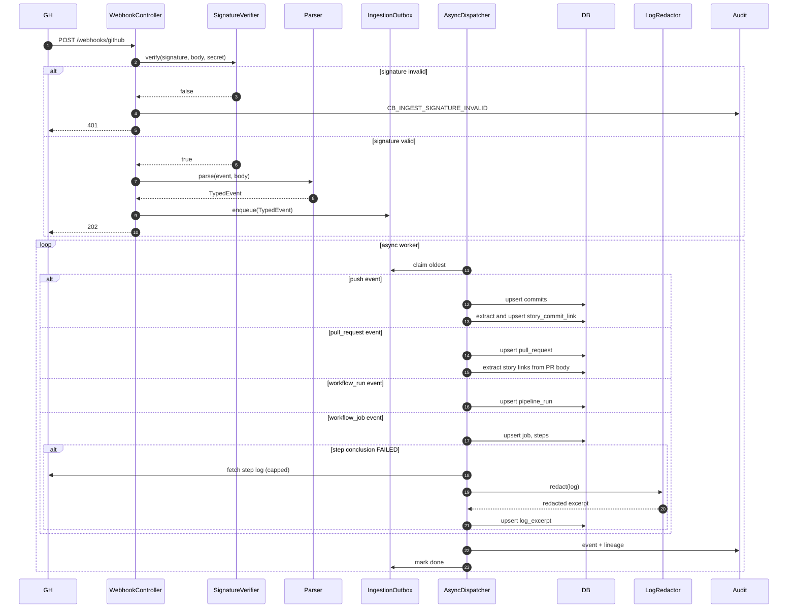

## 8. Install Backfill and Nightly Resync

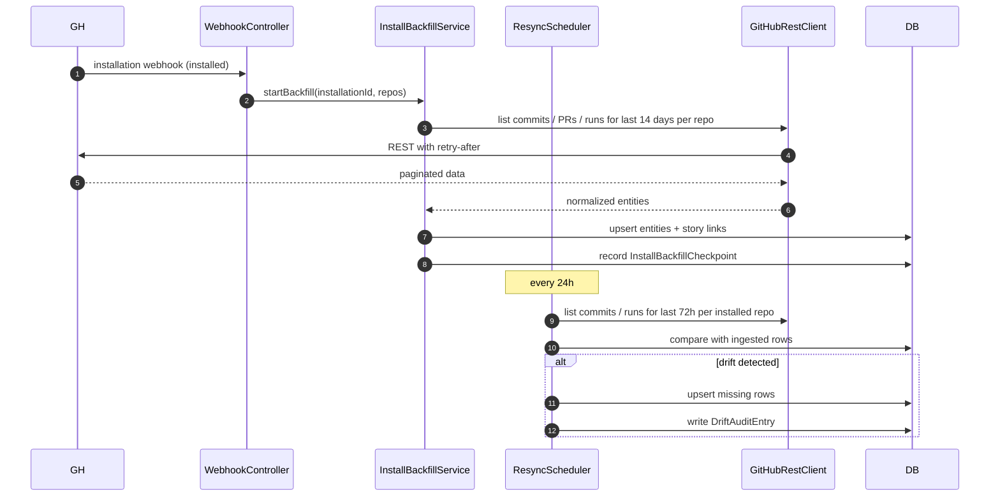

## 9. State Machines

### 9.1 PipelineRun

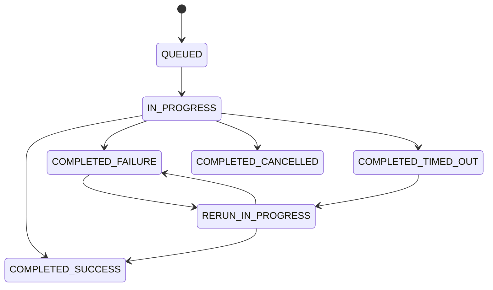

Triage rows follow the run's most-recent conclusion: when `RERUN_IN_PROGRESS → COMPLETED_*` changes, prior triage is marked SUPERSEDED and a fresh one is enqueued (only if final state is FAILURE / TIMED_OUT).

### 9.2 PullRequest

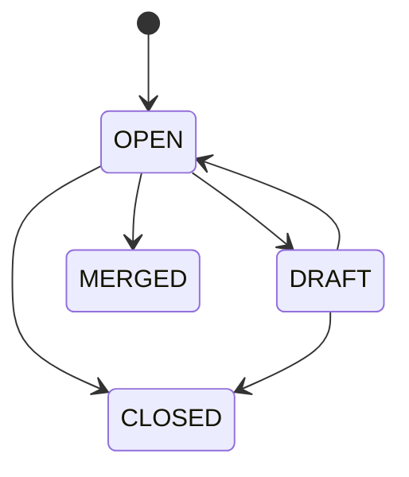

AI PR review runs on OPEN and DRAFT (if the workspace autonomy level permits). MERGED and CLOSED suppress further runs.

### 9.3 AI PR Review Note

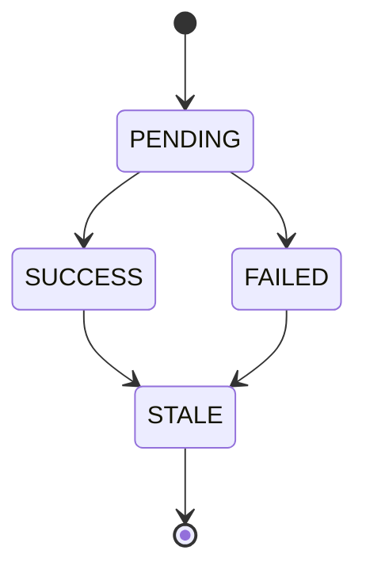

STALE = head commit advanced past this row's `headCommitSha`. Row stays in DB for audit but is hidden from default UI view.

### 9.4 AI Triage Row

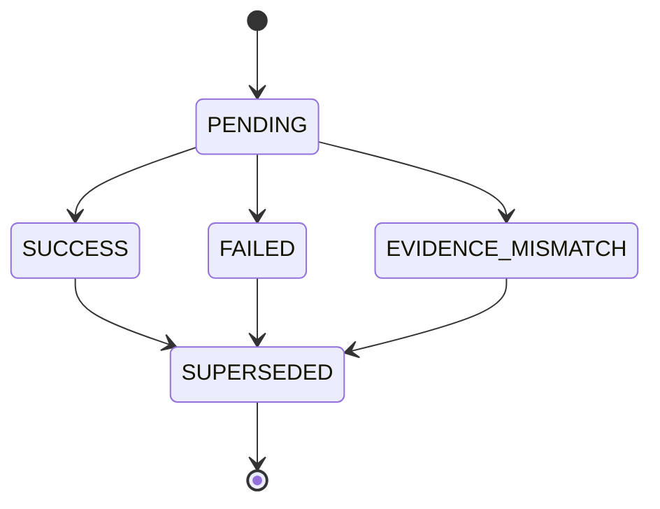

## 10. Error Cascade and Per-Card Isolation

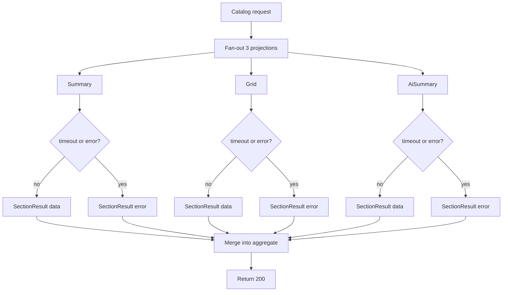

Page-level errors are reserved for `CB_WORKSPACE_FORBIDDEN` and `CB_REPO_NOT_FOUND` / `CB_RUN_NOT_FOUND` / `CB_STORY_NOT_FOUND`. Everything else degrades per card.

## 11. Refresh Strategy

- **Page focus regain** — refresh "stale" cards (AI summary, Open PRs, Recent Runs) if last load >60s ago.
- **Websocket / SSE (V1.1 candidate)** — out of scope for V1; webhook-driven updates reach the DB but the UI refreshes on navigation or manual refresh.
- **Manual refresh** — each card exposes a refresh icon that re-requests only that card.
- **AI Triage / Review polling** — when a row is PENDING, the view polls the specific endpoint every 3s with jitter; back-off to 10s after 30s; cap at 2 minutes (then surface FAILED).

## 12. Phase A / Phase B Toggle

Frontend toggles between mocks and backend via `import.meta.env.DEV && !import.meta.env.VITE_USE_BACKEND`. All mock latencies match the per-projection timeout (300–500ms) so Phase A UX reflects Phase B behavior. Mock `commandLoop` injects `CB_AI_UNAVAILABLE` at 5%, `CB_GH_RATE_LIMIT` at 2%, and an evidence-mismatch triage at 3% to exercise the UI states.

## 13. Observability

Every backend call is traced with a correlation id propagated from the frontend (`x-correlation-id`). Webhook ingestion generates its own correlation id and tags it with installation id + delivery id from the `X-GitHub-Delivery` header so webhook-to-UI latency can be measured end-to-end. Metrics (P95 latency, error rate, projection timeout rate, AI success rate, GH rate-limit hits) are exported via the shared metrics facade.
