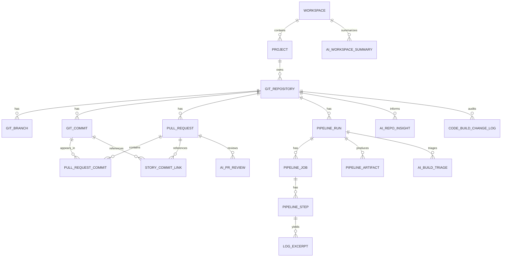

# Code & Build Management — Data Model

## 1. Scope

This document defines the canonical data model of the Code & Build Management slice: the domain-level ER diagram, frontend TypeScript types, backend Java DTOs and JPA entities, Flyway schema DDL (migrations `V40__…V47__`), and the frontend↔backend type mapping. Net-new tables only — upstream Project, Workspace, Member, and Story come from their respective slices via facades.

### Upstream references

- Requirements: [../01-requirements/code-build-management-requirements.md](../01-requirements/code-build-management-requirements.md)
- Spec: [../03-spec/code-build-management-spec.md](../03-spec/code-build-management-spec.md)
- Architecture: [code-build-management-architecture.md](code-build-management-architecture.md)
- Data flow: [code-build-management-data-flow.md](code-build-management-data-flow.md)

## 2. Domain Model

### 2.1 ER diagram



### 2.2 Enumerations

- **RepoVisibility:** `PUBLIC` | `PRIVATE` | `INTERNAL`
- **PrState:** `OPEN` | `DRAFT` | `MERGED` | `CLOSED`
- **RunStatus:** `QUEUED` | `IN_PROGRESS` | `COMPLETED_SUCCESS` | `COMPLETED_FAILURE` | `COMPLETED_CANCELLED` | `COMPLETED_TIMED_OUT` | `RERUN_IN_PROGRESS`
- **RunTrigger:** `PUSH` | `PULL_REQUEST` | `SCHEDULE` | `MANUAL` | `WEBHOOK` | `WORKFLOW_DISPATCH`
- **StepConclusion:** `SUCCESS` | `FAILURE` | `SKIPPED` | `CANCELLED` | `TIMED_OUT` | `NEUTRAL`
- **StoryLinkStatus:** `VERIFIED` | `UNVERIFIED` | `UNKNOWN_STORY`
- **AiNoteSeverity:** `BLOCKER` | `MAJOR` | `MINOR` | `NIT`
- **AiRowStatus:** `PENDING` | `SUCCESS` | `FAILED` | `STALE` | `SUPERSEDED` | `EVIDENCE_MISMATCH`
- **ChangeLogEntryType:** `REPO_INGESTED` | `PR_INGESTED` | `RUN_INGESTED` | `STORY_LINK_CREATED` | `STORY_LINK_RESOLVED` | `TRIAGE_GENERATED` | `REVIEW_GENERATED` | `SUMMARY_GENERATED` | `INSTALL_BACKFILLED` | `RESYNC_DRIFT_HEALED`

## 3. Frontend Types (TypeScript)

Organized under `frontend/src/features/code-build-management/types/`.

### `enums.ts`

```ts
export type RepoVisibility = 'PUBLIC' | 'PRIVATE' | 'INTERNAL';
export type PrState = 'OPEN' | 'DRAFT' | 'MERGED' | 'CLOSED';
export type RunStatus =
  | 'QUEUED' | 'IN_PROGRESS'
  | 'COMPLETED_SUCCESS' | 'COMPLETED_FAILURE' | 'COMPLETED_CANCELLED' | 'COMPLETED_TIMED_OUT'
  | 'RERUN_IN_PROGRESS';
export type RunTrigger = 'PUSH' | 'PULL_REQUEST' | 'SCHEDULE' | 'MANUAL' | 'WEBHOOK' | 'WORKFLOW_DISPATCH';
export type StepConclusion = 'SUCCESS' | 'FAILURE' | 'SKIPPED' | 'CANCELLED' | 'TIMED_OUT' | 'NEUTRAL';
export type StoryLinkStatus = 'VERIFIED' | 'UNVERIFIED' | 'UNKNOWN_STORY';
export type AiNoteSeverity = 'BLOCKER' | 'MAJOR' | 'MINOR' | 'NIT';
export type AiRowStatus = 'PENDING' | 'SUCCESS' | 'FAILED' | 'STALE' | 'SUPERSEDED' | 'EVIDENCE_MISMATCH';
export type HealthLed = 'GREEN' | 'AMBER' | 'RED' | 'UNKNOWN';
```

### `catalog.ts`

```ts
export interface CatalogSummary {
  visibleRepos: number;
  openPrs: number;
  runsLast7d: number;
  successRate7d: number;       // 0..1
  meanBuildDurationSec: number;
  byLed: Record<HealthLed, number>;
}

export interface CatalogRepoTile {
  repoId: string;              // "repo-…"
  fullName: string;            // "org/name"
  projectId: string;
  workspaceId: string;
  defaultBranch: string;
  lastActivityAt: string;      // ISO-8601
  openPrCount: number;
  latestBuildLed: HealthLed;
  description?: string;
}

export interface CatalogSection {
  projectId: string;
  projectName: string;
  repos: CatalogRepoTile[];
}

export interface CatalogAggregate {
  summary: SectionResult<CatalogSummary>;
  grid: SectionResult<CatalogSection[]>;
  aiSummary: SectionResult<AiWorkspaceSummary>;
  filtersEcho: CatalogFilters;
}
```

### `repo.ts`

```ts
export interface RepoHeader {
  repoId: string;
  fullName: string;
  projectId: string;
  workspaceId: string;
  defaultBranch: string;
  primaryLanguage?: string;
  lastPushAt: string;
  externalUrl: string;         // https://github.com/...
  description?: string;
}

export interface RepoBranch {
  name: string;
  aheadOfDefault: number;
  behindDefault: number;
  lastCommitSha: string;
  lastCommitMessage: string;
  lastCommitAuthor: string;
  lastCommitAt: string;
  openPrNumber?: number;
}

export interface OpenPrRow {
  prId: string;
  prNumber: number;
  title: string;
  author: string;
  sourceBranch: string;
  targetBranch: string;
  state: 'OPEN' | 'DRAFT';
  ciLed: HealthLed;
  aiReviewNoteCount: number;
  lastUpdatedAt: string;
}

export interface RecentCommitRow {
  sha: string;
  shortSha: string;
  author: string;
  message: string;
  committedAt: string;
  storyChips: StoryChip[];
}

export interface RecentRunRow {
  runId: string;
  pipelineName: string;
  trigger: RunTrigger;
  branch: string;
  status: RunStatus;
  durationSec?: number;
  headSha: string;
}

export interface RepoAiInsight {
  status: AiRowStatus;
  generatedAt?: string;
  narrative?: string;
  evidence?: Array<{ kind: 'run' | 'pr' | 'commit'; id: string; label: string }>;
  skillVersion?: string;
  error?: { code: string; message: string };
}

export interface RepoDetailAggregate {
  header: SectionResult<RepoHeader>;
  branches: SectionResult<RepoBranch[]>;
  openPrs: SectionResult<OpenPrRow[]>;
  recentCommits: SectionResult<RecentCommitRow[]>;
  recentRuns: SectionResult<RecentRunRow[]>;
  aiInsights: SectionResult<RepoAiInsight>;
}
```

### `pr.ts`

```ts
export interface PrHeader {
  prId: string;
  prNumber: number;
  repoId: string;
  title: string;
  author: string;
  sourceBranch: string;
  targetBranch: string;
  state: PrState;
  reviewersRequested: string[];
  labels: string[];
  createdAt: string;
  updatedAt: string;
  headSha: string;
  isBotAuthored: boolean;
  externalUrl: string;
}

export interface PrCiStatus {
  runs: RecentRunRow[];
  aggregateLed: HealthLed;
}

export interface AiPrReviewNote {
  id: string;
  severity: AiNoteSeverity;
  filePath: string;
  startLine?: number;
  endLine?: number;
  message: string;
  evidenceUrl?: string;
}

export interface AiPrReview {
  status: AiRowStatus;
  keyedOnSha: string;
  skillVersion?: string;
  generatedAt?: string;
  notesBySeverity: Record<AiNoteSeverity, AiPrReviewNote[] | { hiddenCount: number }>;
  error?: { code: string; message: string };
}

export interface PrDetailAggregate {
  header: SectionResult<PrHeader>;
  linkedStories: SectionResult<StoryChip[]>;
  ciStatus: SectionResult<PrCiStatus>;
  aiReview: SectionResult<AiPrReview>;
}
```

### `run.ts`

```ts
export interface RunHeader {
  runId: string;
  runNumber: number;
  pipelineName: string;
  repoId: string;
  trigger: RunTrigger;
  branch: string;
  actor: string;
  headSha: string;
  status: RunStatus;
  durationSec?: number;
  startedAt: string;
  completedAt?: string;
  externalUrl: string;
}

export interface RunStep {
  stepId: string;
  name: string;
  order: number;
  conclusion: StepConclusion;
  startedAt?: string;
  completedAt?: string;
  logExcerpt?: { redacted: true; text: string; bytes: number } | null;
}

export interface RunJob {
  jobId: string;
  name: string;
  status: RunStatus;
  conclusion?: StepConclusion;
  steps: RunStep[];
}

export interface RunArtifact {
  artifactId: string;
  name: string;
  sizeBytes: number;
  externalDownloadUrl: string;
  createdAt: string;
}

export interface AiBuildTriage {
  status: AiRowStatus;
  keyedOnRunId: string;
  skillVersion?: string;
  generatedAt?: string;
  likelyCause?: string;
  failingStepRef?: { jobId: string; stepId: string };
  candidateOwners?: Array<{ memberId: string; displayName: string; rationale: string }>;
  confidence?: 'LOW' | 'MEDIUM' | 'HIGH';
  evidence?: Array<{ kind: 'log' | 'step'; id: string; excerpt?: string; bytes?: number }>;
  error?: { code: string; message: string };
}

export interface RunDetailAggregate {
  header: SectionResult<RunHeader>;
  timeline: SectionResult<RunJob[]>;
  artifacts: SectionResult<RunArtifact[]>;
  triage: SectionResult<AiBuildTriage>;
  openIncidentContext: {
    commitSha: string;
    runUrl: string;
    pipelineName: string;
    triageSummary?: string;
  };
}
```

### `traceability.ts`

```ts
export interface StoryChip {
  storyId: string;
  status: StoryLinkStatus;
  title?: string;              // only when VERIFIED
  projectId?: string;
}

export interface TraceabilityAggregate {
  storyChip: StoryChip;
  commits: SectionResult<RecentCommitRow[]>;
  prs: SectionResult<OpenPrRow[]>;
  runs: SectionResult<RecentRunRow[]>;
  capNotice?: { kind: 'RUN_COMMIT_CAP'; appliedCommitCap: 100; runId: string };
}
```

### `aggregate.ts`

```ts
export interface CodeBuildManagementState {
  catalog: CatalogAggregate | null;
  activeRepoId: string | null;
  repoDetail: RepoDetailAggregate | null;
  activePrId: string | null;
  prDetail: PrDetailAggregate | null;
  activeRunId: string | null;
  runDetail: RunDetailAggregate | null;
  activeStoryId: string | null;
  traceability: TraceabilityAggregate | null;
  loading: Record<string, boolean>;
  errors: Record<string, { code: string; message: string } | null>;
}
```

## 4. Backend DTOs (Java records)

Package `com.sdlctower.domain.codebuildmanagement.dto`.

```java
public record CatalogSummaryDto(
    long visibleRepos, long openPrs, long runsLast7d,
    double successRate7d, long meanBuildDurationSec,
    Map<HealthLed, Long> byLed) {}

public record CatalogRepoTileDto(
    String repoId, String fullName, String projectId, String workspaceId,
    String defaultBranch, Instant lastActivityAt, long openPrCount,
    HealthLed latestBuildLed, String description) {}

public record CatalogSectionDto(String projectId, String projectName, List<CatalogRepoTileDto> repos) {}

public record CatalogAggregateDto(
    SectionResultDto<CatalogSummaryDto> summary,
    SectionResultDto<List<CatalogSectionDto>> grid,
    SectionResultDto<AiWorkspaceSummaryDto> aiSummary,
    CatalogFiltersDto filtersEcho) {}

public record RepoHeaderDto(
    String repoId, String fullName, String projectId, String workspaceId,
    String defaultBranch, String primaryLanguage, Instant lastPushAt,
    String externalUrl, String description) {}

public record RepoBranchDto(
    String name, int aheadOfDefault, int behindDefault,
    String lastCommitSha, String lastCommitMessage, String lastCommitAuthor,
    Instant lastCommitAt, Integer openPrNumber) {}

public record OpenPrRowDto(
    String prId, int prNumber, String title, String author,
    String sourceBranch, String targetBranch, String state,
    HealthLed ciLed, int aiReviewNoteCount, Instant lastUpdatedAt) {}

public record RecentCommitRowDto(
    String sha, String shortSha, String author, String message,
    Instant committedAt, List<StoryChipDto> storyChips) {}

public record RecentRunRowDto(
    String runId, String pipelineName, RunTrigger trigger,
    String branch, RunStatus status, Long durationSec, String headSha) {}

public record RepoAiInsightDto(
    AiRowStatus status, Instant generatedAt, String narrative,
    List<AiEvidenceDto> evidence, String skillVersion, ErrorDto error) {}

public record RepoDetailAggregateDto(
    SectionResultDto<RepoHeaderDto> header,
    SectionResultDto<List<RepoBranchDto>> branches,
    SectionResultDto<List<OpenPrRowDto>> openPrs,
    SectionResultDto<List<RecentCommitRowDto>> recentCommits,
    SectionResultDto<List<RecentRunRowDto>> recentRuns,
    SectionResultDto<RepoAiInsightDto> aiInsights) {}

public record PrHeaderDto(
    String prId, int prNumber, String repoId, String title, String author,
    String sourceBranch, String targetBranch, PrState state,
    List<String> reviewersRequested, List<String> labels,
    Instant createdAt, Instant updatedAt, String headSha,
    boolean isBotAuthored, String externalUrl) {}

public record AiPrReviewNoteDto(
    String id, AiNoteSeverity severity, String filePath,
    Integer startLine, Integer endLine, String message, String evidenceUrl) {}

public record AiPrReviewDto(
    AiRowStatus status, String keyedOnSha, String skillVersion, Instant generatedAt,
    Map<AiNoteSeverity, Object> notesBySeverity,     // AiPrReviewNoteDto[] or {hiddenCount:int}
    ErrorDto error) {}

public record PrDetailAggregateDto(
    SectionResultDto<PrHeaderDto> header,
    SectionResultDto<List<StoryChipDto>> linkedStories,
    SectionResultDto<PrCiStatusDto> ciStatus,
    SectionResultDto<AiPrReviewDto> aiReview) {}

public record RunHeaderDto(
    String runId, int runNumber, String pipelineName, String repoId,
    RunTrigger trigger, String branch, String actor, String headSha,
    RunStatus status, Long durationSec,
    Instant startedAt, Instant completedAt, String externalUrl) {}

public record RunStepDto(
    String stepId, String name, int order, StepConclusion conclusion,
    Instant startedAt, Instant completedAt, LogExcerptDto logExcerpt) {}

public record RunJobDto(
    String jobId, String name, RunStatus status, StepConclusion conclusion,
    List<RunStepDto> steps) {}

public record RunArtifactDto(
    String artifactId, String name, long sizeBytes,
    String externalDownloadUrl, Instant createdAt) {}

public record AiBuildTriageDto(
    AiRowStatus status, String keyedOnRunId, String skillVersion, Instant generatedAt,
    String likelyCause, StepRefDto failingStepRef,
    List<CandidateOwnerDto> candidateOwners, String confidence,
    List<AiEvidenceDto> evidence, ErrorDto error) {}

public record RunDetailAggregateDto(
    SectionResultDto<RunHeaderDto> header,
    SectionResultDto<List<RunJobDto>> timeline,
    SectionResultDto<List<RunArtifactDto>> artifacts,
    SectionResultDto<AiBuildTriageDto> triage,
    OpenIncidentContextDto openIncidentContext) {}

public record StoryChipDto(String storyId, StoryLinkStatus status, String title, String projectId) {}

public record TraceabilityAggregateDto(
    StoryChipDto storyChip,
    SectionResultDto<List<RecentCommitRowDto>> commits,
    SectionResultDto<List<OpenPrRowDto>> prs,
    SectionResultDto<List<RecentRunRowDto>> runs,
    CapNoticeDto capNotice) {}
```

## 5. JPA Entities

Package `com.sdlctower.domain.codebuildmanagement.persistence`. Representative fields only — each entity also carries `createdAt`, `updatedAt`, and appropriate `@Version` columns where optimistic locking applies (PRs, runs, triage rows, review rows).

```java
@Entity @Table(name = "git_repository", indexes = {
    @Index(name="idx_repo_project", columnList="project_id"),
    @Index(name="idx_repo_workspace", columnList="workspace_id"),
    @Index(name="idx_repo_last_activity", columnList="last_activity_at DESC")
})
public class GitRepositoryEntity { /* id, fullName, projectId, workspaceId, defaultBranch, primaryLanguage, description, visibility, externalUrl, githubRepoId, installationId, lastActivityAt, archivedAt, createdAt, updatedAt */ }

@Entity @Table(name = "git_branch", uniqueConstraints = @UniqueConstraint(columnNames = {"repo_id","name"}))
public class GitBranchEntity { /* id, repoId, name, headSha, aheadOfDefault, behindDefault, lastCommitAt */ }

@Entity @Table(name = "git_commit", indexes = {
    @Index(name="idx_commit_repo_committed", columnList="repo_id, committed_at DESC")
})
public class GitCommitEntity { /* id, repoId, sha (40), shortSha (12), author, message, committedAt */ }

@Entity @Table(name = "pull_request", indexes = {
    @Index(name="idx_pr_repo_state", columnList="repo_id,state"),
    @Index(name="idx_pr_updated", columnList="updated_at DESC")
})
public class PullRequestEntity { /* id, repoId, prNumber, title, author, sourceBranch, targetBranch, state, headSha, isBotAuthored, externalUrl, bodyText (CLOB), createdAt, updatedAt */ }

@Entity @Table(name = "pull_request_commit")
public class PullRequestCommitEntity { /* prId, commitSha, position */ }

@Entity @Table(name = "pipeline_run", indexes = {
    @Index(name="idx_run_repo_started", columnList="repo_id, started_at DESC"),
    @Index(name="idx_run_branch", columnList="repo_id,branch")
})
public class PipelineRunEntity { /* id, repoId, runNumber, pipelineName, trigger, branch, actor, headSha, status, durationSec, startedAt, completedAt, externalUrl, githubRunId */ }

@Entity @Table(name = "pipeline_job")
public class PipelineJobEntity { /* id, runId, name, status, conclusion, startedAt, completedAt */ }

@Entity @Table(name = "pipeline_step")
public class PipelineStepEntity { /* id, jobId, name, orderIndex, conclusion, startedAt, completedAt */ }

@Entity @Table(name = "pipeline_artifact")
public class PipelineArtifactEntity { /* id, runId, name, sizeBytes, externalDownloadUrl, createdAt */ }

@Entity @Table(name = "log_excerpt")
public class LogExcerptEntity { /* id, stepId, redactedText (CLOB), byteCount */ }

@Entity @Table(name = "story_commit_link", uniqueConstraints =
    @UniqueConstraint(columnNames = {"story_id","commit_sha","pr_id_nullable_zero"}))
public class StoryCommitLinkEntity { /* id, storyId, commitSha (nullable), prId (nullable), status, firstSeenAt, resolvedAt */ }

@Entity @Table(name = "ai_pr_review", uniqueConstraints =
    @UniqueConstraint(columnNames = {"pr_id","head_sha","skill_version"}))
public class AiPrReviewEntity { /* id, prId, headSha, skillVersion, status, generatedAt, notesJson (CLOB), errorJson, supersededAt */ }

@Entity @Table(name = "ai_build_triage", uniqueConstraints =
    @UniqueConstraint(columnNames = {"run_id","skill_version","attempt_number"}))
public class AiBuildTriageEntity { /* id, runId, skillVersion, attemptNumber, status, generatedAt, payloadJson (CLOB), errorJson, supersededAt */ }

@Entity @Table(name = "ai_workspace_summary", uniqueConstraints =
    @UniqueConstraint(columnNames = {"workspace_id","window_start","skill_version"}))
public class AiWorkspaceSummaryEntity { /* id, workspaceId, windowStart, windowEnd, skillVersion, status, generatedAt, narrative, evidenceJson (CLOB) */ }

@Entity @Table(name = "ai_repo_insight")
public class AiRepoInsightEntity { /* id, repoId, skillVersion, status, generatedAt, narrative, evidenceJson */ }

@Entity @Table(name = "code_build_change_log", indexes = {
    @Index(name="idx_cblog_repo_created", columnList="repo_id, created_at DESC")
})
public class CodeBuildChangeLogEntity { /* id, repoId, entryType, actorId, entityKind, entityId, beforeJson, afterJson, reason, correlationId, createdAt */ }

@Entity @Table(name = "ingestion_outbox")
public class IngestionOutboxEntity { /* id, deliveryId, installationId, eventType, payload (CLOB), status, receivedAt, claimedAt, completedAt, errorJson */ }

@Entity @Table(name = "install_backfill_checkpoint")
public class InstallBackfillCheckpointEntity { /* installationId, repoId, lastBackfilledAt, status */ }
```

## 6. Flyway DDL

Authoritative migrations for V1. Authored for H2 (local); Oracle variants under `db/migration/oracle/` where DDL diverges.

### `V40__create_git_repository.sql`

```sql
CREATE TABLE git_repository (
  id                VARCHAR(64) PRIMARY KEY,
  github_repo_id    BIGINT NOT NULL UNIQUE,
  installation_id   BIGINT NOT NULL,
  full_name         VARCHAR(255) NOT NULL,
  project_id        VARCHAR(64) NOT NULL,
  workspace_id      VARCHAR(64) NOT NULL,
  default_branch    VARCHAR(255) NOT NULL,
  primary_language  VARCHAR(64),
  description       VARCHAR(2000),
  visibility        VARCHAR(16) NOT NULL,
  external_url      VARCHAR(512) NOT NULL,
  last_activity_at  TIMESTAMP,
  archived_at       TIMESTAMP,
  created_at        TIMESTAMP NOT NULL,
  updated_at        TIMESTAMP NOT NULL
);
CREATE INDEX idx_repo_project ON git_repository(project_id);
CREATE INDEX idx_repo_workspace ON git_repository(workspace_id);
CREATE INDEX idx_repo_last_activity ON git_repository(last_activity_at);
```

### `V41__create_git_branch_and_commit.sql`

```sql
CREATE TABLE git_branch (
  id                  VARCHAR(64) PRIMARY KEY,
  repo_id             VARCHAR(64) NOT NULL REFERENCES git_repository(id),
  name                VARCHAR(255) NOT NULL,
  head_sha            CHAR(40) NOT NULL,
  ahead_of_default    INT NOT NULL DEFAULT 0,
  behind_default      INT NOT NULL DEFAULT 0,
  last_commit_at      TIMESTAMP,
  CONSTRAINT uq_branch_repo_name UNIQUE (repo_id, name)
);
CREATE INDEX idx_branch_repo ON git_branch(repo_id);

CREATE TABLE git_commit (
  id                  VARCHAR(64) PRIMARY KEY,
  repo_id             VARCHAR(64) NOT NULL REFERENCES git_repository(id),
  sha                 CHAR(40) NOT NULL,
  short_sha           VARCHAR(12) NOT NULL,
  author              VARCHAR(255) NOT NULL,
  message             CLOB NOT NULL,
  committed_at        TIMESTAMP NOT NULL,
  CONSTRAINT uq_commit_repo_sha UNIQUE (repo_id, sha)
);
CREATE INDEX idx_commit_repo_committed ON git_commit(repo_id, committed_at DESC);
```

### `V42__create_pull_request.sql`

```sql
CREATE TABLE pull_request (
  id                  VARCHAR(64) PRIMARY KEY,
  repo_id             VARCHAR(64) NOT NULL REFERENCES git_repository(id),
  pr_number           INT NOT NULL,
  title               VARCHAR(512) NOT NULL,
  author              VARCHAR(255) NOT NULL,
  source_branch       VARCHAR(255) NOT NULL,
  target_branch       VARCHAR(255) NOT NULL,
  state               VARCHAR(16) NOT NULL,
  head_sha            CHAR(40) NOT NULL,
  is_bot_authored     BOOLEAN NOT NULL DEFAULT FALSE,
  external_url        VARCHAR(512) NOT NULL,
  body_text           CLOB,
  created_at          TIMESTAMP NOT NULL,
  updated_at          TIMESTAMP NOT NULL,
  CONSTRAINT uq_pr_repo_number UNIQUE (repo_id, pr_number)
);
CREATE INDEX idx_pr_repo_state ON pull_request(repo_id, state);
CREATE INDEX idx_pr_updated ON pull_request(updated_at DESC);

CREATE TABLE pull_request_commit (
  pr_id        VARCHAR(64) NOT NULL REFERENCES pull_request(id),
  commit_sha   CHAR(40) NOT NULL,
  position     INT NOT NULL,
  PRIMARY KEY (pr_id, commit_sha)
);
```

### `V43__create_pipeline_run_and_jobs.sql`

```sql
CREATE TABLE pipeline_run (
  id              VARCHAR(64) PRIMARY KEY,
  github_run_id   BIGINT NOT NULL UNIQUE,
  repo_id         VARCHAR(64) NOT NULL REFERENCES git_repository(id),
  run_number      INT NOT NULL,
  pipeline_name   VARCHAR(255) NOT NULL,
  trigger         VARCHAR(32) NOT NULL,
  branch          VARCHAR(255) NOT NULL,
  actor           VARCHAR(255) NOT NULL,
  head_sha        CHAR(40) NOT NULL,
  status          VARCHAR(32) NOT NULL,
  duration_sec    BIGINT,
  started_at      TIMESTAMP NOT NULL,
  completed_at    TIMESTAMP,
  external_url    VARCHAR(512) NOT NULL
);
CREATE INDEX idx_run_repo_started ON pipeline_run(repo_id, started_at DESC);
CREATE INDEX idx_run_branch ON pipeline_run(repo_id, branch);

CREATE TABLE pipeline_job (
  id              VARCHAR(64) PRIMARY KEY,
  run_id          VARCHAR(64) NOT NULL REFERENCES pipeline_run(id),
  name            VARCHAR(255) NOT NULL,
  status          VARCHAR(32) NOT NULL,
  conclusion      VARCHAR(32),
  started_at      TIMESTAMP,
  completed_at    TIMESTAMP
);
CREATE INDEX idx_job_run ON pipeline_job(run_id);

CREATE TABLE pipeline_step (
  id              VARCHAR(64) PRIMARY KEY,
  job_id          VARCHAR(64) NOT NULL REFERENCES pipeline_job(id),
  name            VARCHAR(255) NOT NULL,
  order_index     INT NOT NULL,
  conclusion      VARCHAR(32) NOT NULL,
  started_at      TIMESTAMP,
  completed_at    TIMESTAMP
);
CREATE INDEX idx_step_job ON pipeline_step(job_id);

CREATE TABLE pipeline_artifact (
  id                      VARCHAR(64) PRIMARY KEY,
  run_id                  VARCHAR(64) NOT NULL REFERENCES pipeline_run(id),
  name                    VARCHAR(255) NOT NULL,
  size_bytes              BIGINT NOT NULL,
  external_download_url   VARCHAR(1024) NOT NULL,
  created_at              TIMESTAMP NOT NULL
);
CREATE INDEX idx_artifact_run ON pipeline_artifact(run_id);

CREATE TABLE log_excerpt (
  id              VARCHAR(64) PRIMARY KEY,
  step_id         VARCHAR(64) NOT NULL REFERENCES pipeline_step(id),
  redacted_text   CLOB NOT NULL,
  byte_count      BIGINT NOT NULL,
  CONSTRAINT chk_excerpt_bytes CHECK (byte_count <= 1048576)
);
```

### `V44__create_story_commit_link.sql`

```sql
CREATE TABLE story_commit_link (
  id                VARCHAR(64) PRIMARY KEY,
  story_id          VARCHAR(64) NOT NULL,
  commit_sha        CHAR(40),
  pr_id             VARCHAR(64),
  repo_id           VARCHAR(64) NOT NULL REFERENCES git_repository(id),
  status            VARCHAR(16) NOT NULL,  -- VERIFIED / UNVERIFIED / UNKNOWN_STORY
  first_seen_at     TIMESTAMP NOT NULL,
  resolved_at       TIMESTAMP,
  CONSTRAINT chk_link_target CHECK (commit_sha IS NOT NULL OR pr_id IS NOT NULL)
);
CREATE UNIQUE INDEX uq_story_link_commit
  ON story_commit_link(story_id, repo_id, commit_sha)
  WHERE commit_sha IS NOT NULL;
CREATE UNIQUE INDEX uq_story_link_pr
  ON story_commit_link(story_id, pr_id)
  WHERE pr_id IS NOT NULL;
CREATE INDEX idx_story_link_story ON story_commit_link(story_id);
CREATE INDEX idx_story_link_repo ON story_commit_link(repo_id);
```

### `V45__create_ai_outputs.sql`

```sql
CREATE TABLE ai_pr_review (
  id              VARCHAR(64) PRIMARY KEY,
  pr_id           VARCHAR(64) NOT NULL REFERENCES pull_request(id),
  head_sha        CHAR(40) NOT NULL,
  skill_version   VARCHAR(32) NOT NULL,
  status          VARCHAR(32) NOT NULL,
  generated_at    TIMESTAMP,
  notes_json      CLOB,
  error_json      CLOB,
  superseded_at   TIMESTAMP,
  CONSTRAINT uq_ai_pr_review UNIQUE (pr_id, head_sha, skill_version)
);
CREATE INDEX idx_ai_pr_review_pr ON ai_pr_review(pr_id);

CREATE TABLE ai_build_triage (
  id              VARCHAR(64) PRIMARY KEY,
  run_id          VARCHAR(64) NOT NULL REFERENCES pipeline_run(id),
  skill_version   VARCHAR(32) NOT NULL,
  attempt_number  INT NOT NULL,
  status          VARCHAR(32) NOT NULL,
  generated_at    TIMESTAMP,
  payload_json    CLOB,
  error_json      CLOB,
  superseded_at   TIMESTAMP,
  CONSTRAINT uq_ai_triage UNIQUE (run_id, skill_version, attempt_number)
);
CREATE INDEX idx_ai_triage_run ON ai_build_triage(run_id);

CREATE TABLE ai_workspace_summary (
  id              VARCHAR(64) PRIMARY KEY,
  workspace_id    VARCHAR(64) NOT NULL,
  window_start    TIMESTAMP NOT NULL,
  window_end      TIMESTAMP NOT NULL,
  skill_version   VARCHAR(32) NOT NULL,
  status          VARCHAR(32) NOT NULL,
  generated_at    TIMESTAMP,
  narrative       CLOB,
  evidence_json   CLOB,
  CONSTRAINT uq_ai_ws_summary UNIQUE (workspace_id, window_start, skill_version)
);
CREATE INDEX idx_ai_ws_summary_ws ON ai_workspace_summary(workspace_id, window_start DESC);

CREATE TABLE ai_repo_insight (
  id              VARCHAR(64) PRIMARY KEY,
  repo_id         VARCHAR(64) NOT NULL REFERENCES git_repository(id),
  skill_version   VARCHAR(32) NOT NULL,
  status          VARCHAR(32) NOT NULL,
  generated_at    TIMESTAMP,
  narrative       CLOB,
  evidence_json   CLOB,
  CONSTRAINT uq_ai_repo_insight UNIQUE (repo_id, skill_version, generated_at)
);
CREATE INDEX idx_ai_repo_insight_repo ON ai_repo_insight(repo_id);
```

### `V46__create_change_log_and_outbox.sql`

```sql
CREATE TABLE code_build_change_log (
  id              VARCHAR(64) PRIMARY KEY,
  repo_id         VARCHAR(64) REFERENCES git_repository(id),
  entry_type      VARCHAR(32) NOT NULL,
  actor_id        VARCHAR(64),
  entity_kind     VARCHAR(32) NOT NULL,
  entity_id       VARCHAR(64) NOT NULL,
  before_json     CLOB,
  after_json      CLOB,
  reason          VARCHAR(512),
  correlation_id  VARCHAR(64),
  created_at      TIMESTAMP NOT NULL
);
CREATE INDEX idx_cblog_repo_created ON code_build_change_log(repo_id, created_at DESC);
CREATE INDEX idx_cblog_actor_created ON code_build_change_log(actor_id, created_at DESC);

CREATE TABLE ingestion_outbox (
  id              VARCHAR(64) PRIMARY KEY,
  delivery_id     VARCHAR(64) NOT NULL UNIQUE,
  installation_id BIGINT NOT NULL,
  event_type      VARCHAR(64) NOT NULL,
  payload         CLOB NOT NULL,
  status          VARCHAR(16) NOT NULL,    -- RECEIVED / CLAIMED / DONE / FAILED
  received_at     TIMESTAMP NOT NULL,
  claimed_at      TIMESTAMP,
  completed_at    TIMESTAMP,
  error_json      CLOB
);
CREATE INDEX idx_outbox_status ON ingestion_outbox(status, received_at);

CREATE TABLE install_backfill_checkpoint (
  installation_id BIGINT NOT NULL,
  repo_id         VARCHAR(64) NOT NULL,
  last_backfilled_at TIMESTAMP,
  status          VARCHAR(16) NOT NULL,
  PRIMARY KEY (installation_id, repo_id)
);
```

### `V47__seed_code_build_local.sql`

Local-only seed covering: 2 workspaces × 3 repos each, ~8 PRs mixed OPEN/DRAFT/MERGED, ~20 commits including several with `Story-Id` trailers (verified + unknown), ~14 runs across all conclusions, ~3 failure triage rows (one SUCCESS, one SUPERSEDED, one EVIDENCE_MISMATCH), ~2 workspace summary rows, ~4 repo insight rows, ~10 change log entries. Seed references story IDs that exist in the requirement slice's seed.

## 7. Type Mapping (Frontend ↔ Backend)

| Frontend type | Backend DTO | Persisted entity | Notes |
| ------------- | ----------- | ---------------- | ----- |
| `CatalogRepoTile` | `CatalogRepoTileDto` | `GitRepositoryEntity` (+ derived counts) | `latestBuildLed` computed from most-recent PipelineRun status |
| `RepoBranch` | `RepoBranchDto` | `GitBranchEntity` | ahead/behind computed at ingestion time |
| `OpenPrRow` | `OpenPrRowDto` | `PullRequestEntity` + `AiPrReviewEntity` count | `aiReviewNoteCount` = sum of notes in latest non-STALE review row |
| `RecentCommitRow` | `RecentCommitRowDto` | `GitCommitEntity` + `StoryCommitLinkEntity` | `storyChips` resolved at request time against Requirement facade |
| `RecentRunRow` | `RecentRunRowDto` | `PipelineRunEntity` | `durationSec` = completed-started when COMPLETED_* |
| `AiPrReview` | `AiPrReviewDto` | `AiPrReviewEntity` | `notesBySeverity` BLOCKER branch redacts body for non-Lead |
| `AiBuildTriage` | `AiBuildTriageDto` | `AiBuildTriageEntity` | Latest non-SUPERSEDED row; EVIDENCE_MISMATCH shown as placeholder |
| `RepoAiInsight` | `RepoAiInsightDto` | `AiRepoInsightEntity` | Latest SUCCESS within 24h else PENDING/FAILED |
| `StoryChip` | `StoryChipDto` | `StoryCommitLinkEntity` + Requirement facade | `title` and `projectId` filled by facade on VERIFIED only |
| `TraceabilityAggregate` | `TraceabilityAggregateDto` | Composed of above | `capNotice` emitted when run commit range > 100 |

## 8. Indexes and Performance

Primary query paths:

- Catalog grid: `git_repository(workspace_id)` + join counts from `pull_request(state='OPEN')` and latest `pipeline_run` per repo. Backed by `idx_repo_workspace`, `idx_pr_repo_state`, `idx_run_repo_started`.
- Recent commits for a repo: `idx_commit_repo_committed`.
- Inverse story lookup: `idx_story_link_story` (story id), then join to commits/PRs/runs.
- Outbox claim: `idx_outbox_status` ordered by `received_at`.

The `log_excerpt.byte_count <= 1048576` CHECK (1 MiB) is enforced at the DB. Raw logs beyond that are truncated at ingestion with an ellipsis marker.

## 9. Privacy and Retention

- Redacted log excerpts and AI rows retained for 90 days (then pruned by scheduled job, emitting retention audit entries).
- `ingestion_outbox` retained for 7 days of `DONE` rows for debuggability, then pruned.
- Upon GitHub App uninstall (`installation` webhook with `action=deleted`), referenced repos are soft-archived (`archived_at` set); their rows remain for audit but are filtered from user-facing queries.
- AI review / triage rows keyed by `skill_version`; historical versions remain addressable for explainability.
- All cross-references to stories use the logical `story_id` — never the Requirement-slice-internal surrogate key.

## 10. Migration and Rollback

- Migrations V40–V47 are purely additive; no upstream tables mutated. Rolling back by dropping in reverse order is safe as long as the slice is behind a feature flag in production.
- Oracle deployments require a parallel set of DDL scripts under `db/migration/oracle/` for `CLOB` handling and identity columns; H2 DDL above is the reference.
- Seed (V47) is gated behind the `local` Flyway profile and never runs in shared environments.
