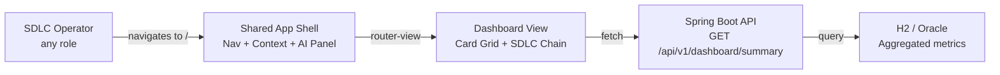
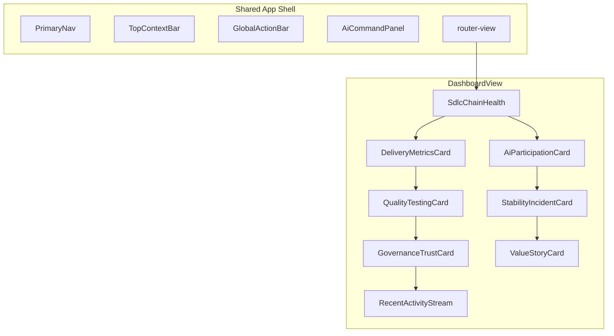
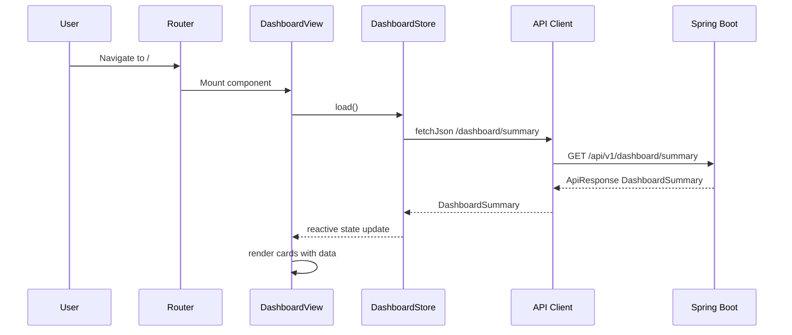
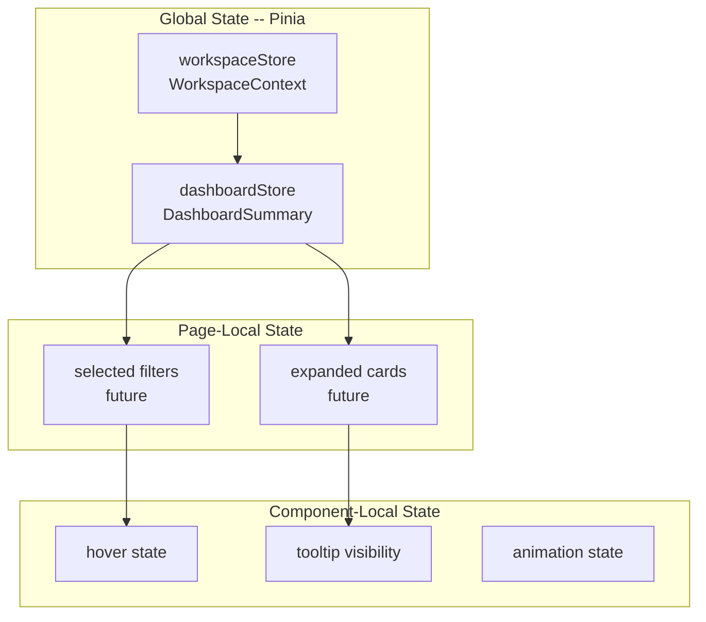
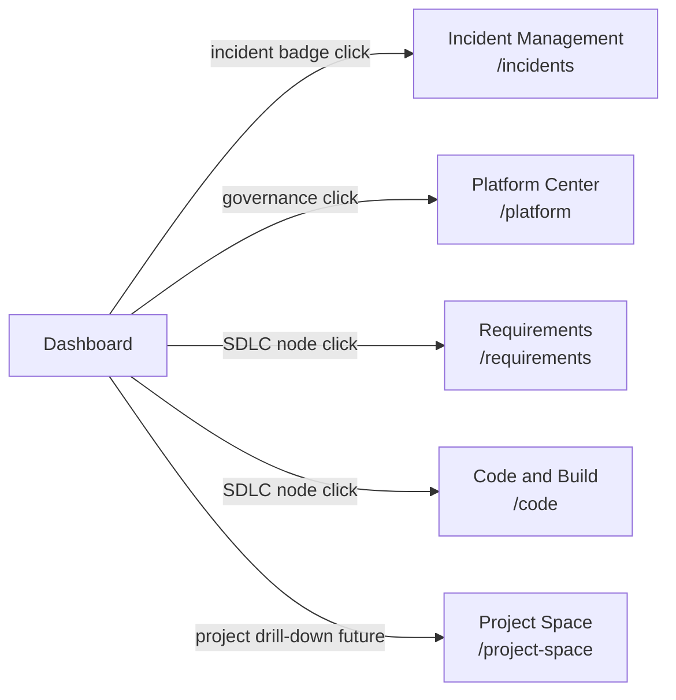

# Dashboard / Control Tower Architecture

## Purpose

This document defines the technical architecture for the Dashboard / Control Tower
page — the main landing page of the Agentic SDLC Control Tower.

## 1. Architecture Goal

Build a dashboard that aggregates cross-stage SDLC signals into a card-based
layout, tells a delivery story through the 11-node chain, and provides drill-down
navigation to downstream module pages.

## 2. System Context

The dashboard is a page view rendered within the shared app shell. It consumes
aggregate data from the backend (Phase B) or mocked data (Phase A).



## 3. Technology Stack

Inherits from the shared app shell architecture:

| Layer | Technology |
|-------|-----------|
| Frontend framework | Vue 3 (Composition API, `<script setup>`) |
| Build tool | Vite |
| Routing | Vue Router |
| Client state | Pinia |
| Backend framework | Spring Boot (Java 21) |
| ORM | JPA / Hibernate |
| Database | H2 (local) / Oracle (prod) |

Dashboard-specific additions:

| Layer | Technology | Rationale |
|-------|-----------|-----------|
| Charts (future) | TBD (e.g., ECharts, Chart.js) | V1 uses styled HTML/CSS; charting library deferred |
| API layer | `fetchJson<T>` from shared client | Reuses existing API infrastructure |

## 4. Component Breakdown



### Component Responsibilities

| Component | Responsibility | Data Source |
|-----------|---------------|-------------|
| `DashboardView` | Layout grid, data fetching orchestration | Dashboard store |
| `SdlcChainHealth` | 11-node pipeline visualization | `sdlcHealth[]` |
| `DeliveryMetricsCard` | Lead time, deploy freq, completion | `deliveryMetrics` |
| `AiParticipationCard` | AI usage, adoption, time saved | `aiParticipation` |
| `QualityTestingCard` | Build, test, defect, spec coverage | `qualityMetrics` |
| `StabilityIncidentCard` | Incidents, MTTR, change failure | `stabilityMetrics` |
| `GovernanceTrustCard` | Template reuse, drift, audit, policy | `governanceMetrics` |
| `ValueStoryCard` | AI value proof headline and metrics | `valueStory` |
| `RecentActivityStream` | Chronological activity list | `recentActivity` |

## 5. Data Flow



### Phase A (Frontend Only)

In Phase A, the `DashboardStore` returns mocked data instead of calling the API.
The mock data module provides a complete `DashboardSummary` object matching the
spec contract.

### Phase B (Full Stack)

In Phase B, the store calls the backend API. The backend aggregates data from
domain tables (or seed data in V1) and returns the dashboard summary.

## 6. State Boundaries



| State | Scope | Owner |
|-------|-------|-------|
| WorkspaceContext | Global (Pinia) | `workspaceStore` |
| DashboardSummary | Global (Pinia) | `dashboardStore` |
| Loading/error per section | Store | `dashboardStore` |
| Card hover, tooltip, animation | Component-local | Each card component |
| Future: filter selections | Page-local | `DashboardView` |

## 7. Backend Architecture (Phase B)

### 7.1 Package Structure

```
backend/src/main/java/com/sdlctower/
├── domain/
│   └── dashboard/
│       ├── DashboardController.java
│       ├── DashboardService.java
│       └── dto/
│           ├── DashboardSummaryDto.java
│           ├── SdlcStageHealthDto.java
│           ├── DeliveryMetricsDto.java
│           ├── AiParticipationDto.java
│           ├── QualityMetricsDto.java
│           ├── StabilityMetricsDto.java
│           ├── GovernanceMetricsDto.java
│           ├── RecentActivityDto.java
│           └── ValueStoryDto.java
```

### 7.2 API Design

```
GET /api/v1/dashboard/summary
  Query: workspaceId (derived from context)
  Response: ApiResponse<DashboardSummaryDto>
```

### 7.3 Data Aggregation Strategy

V1 uses seed data. The `DashboardService` returns pre-built summary objects.

Future versions will aggregate from domain tables:
- SDLC health from requirement, spec, code, test, deploy, incident counts
- Delivery metrics from project timeline data
- AI participation from skill execution history
- Quality from build and test result tables
- Stability from incident and deployment tables
- Governance from template, audit, and policy tables

## 8. Integration Points



### Navigation from Dashboard

| User Action | Target Route | Context Preserved |
|-------------|-------------|-------------------|
| Click SDLC chain node | Module page route | Yes (workspace) |
| Click incident badge | `/incidents` | Yes |
| Click governance indicator | `/platform` | Yes |
| Click "View All" activity | `/platform` | Yes |

## 9. Error and Resilience

- Dashboard fetches data on mount via a single API call
- Each section in the response has its own `SectionResult` envelope
- A section-level error renders only that card in error state; others still display
- A top-level API failure (network, auth) puts all cards into error state
- Shell (nav, context, AI panel) remains functional during dashboard errors
- Retry is manual (page refresh) in V1

## 10. Security Considerations

- Dashboard API is workspace-scoped; backend must validate workspace access
- No sensitive data exposed in dashboard summary (aggregate metrics only)
- Activity stream shows action descriptions but not full payloads
- Authentication is deferred to a later slice but API structure must not
  make it structurally difficult to add

## 11. Performance Considerations

- Single API call fetches all dashboard data (avoids waterfall)
- V1 data is small (seed data); no pagination needed for summary
- Activity stream limited to 10 entries
- Future: consider caching dashboard summary with short TTL
- Future: lazy-load below-fold cards

## 12. Risks and Mitigations

| Risk | Mitigation |
|------|-----------|
| Dashboard becomes chart-heavy and loses story | Design emphasizes narrative flow and SDLC chain |
| Too many cards create visual overload | Limit to 8 core cards; group related metrics |
| Backend aggregation becomes slow with real data | Single summary endpoint; future: materialized views |
| Mock data doesn't represent realistic scenarios | Use realistic enterprise-scale mock values |
