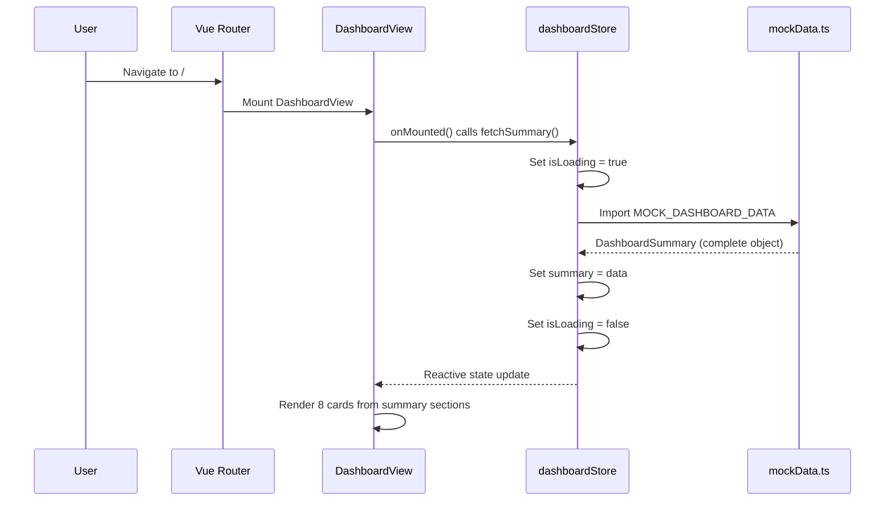
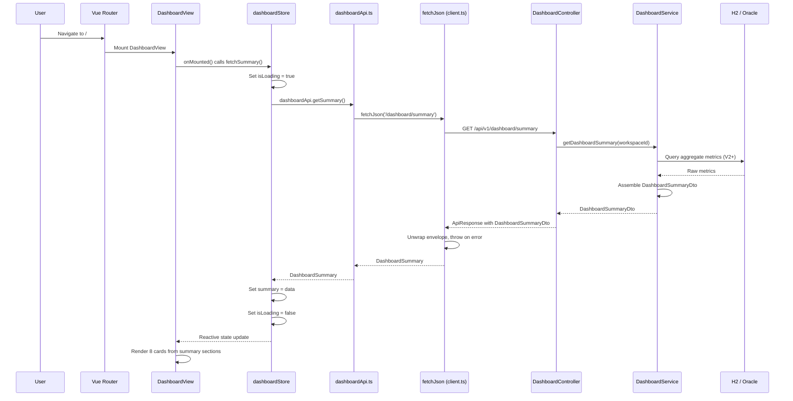
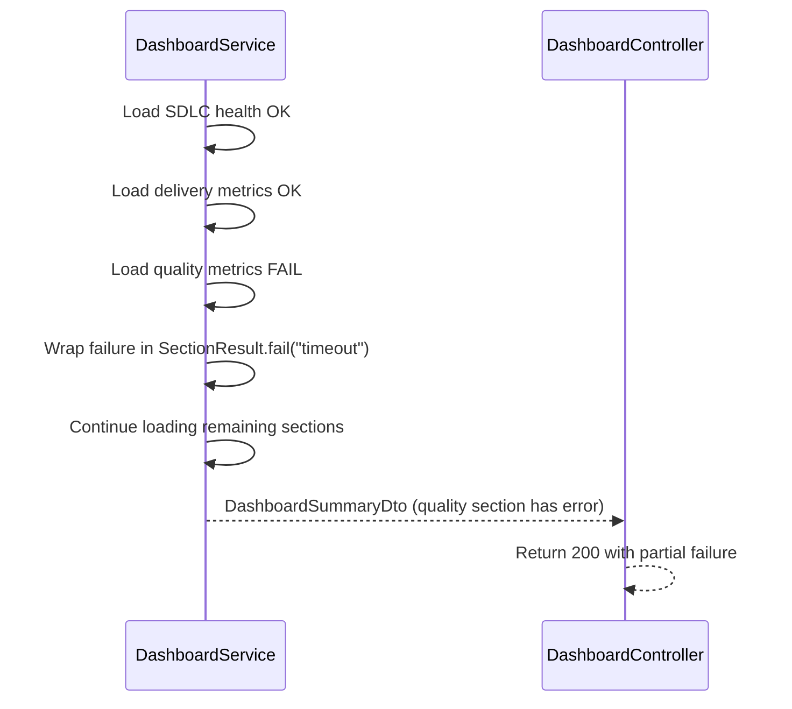
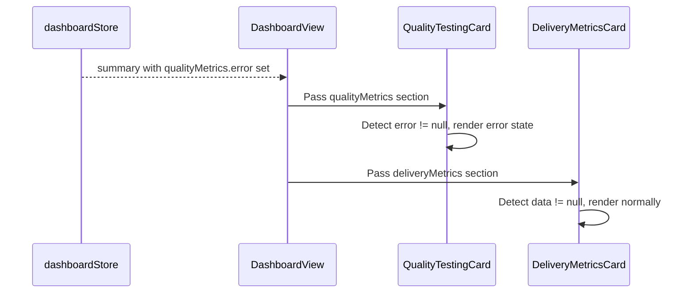
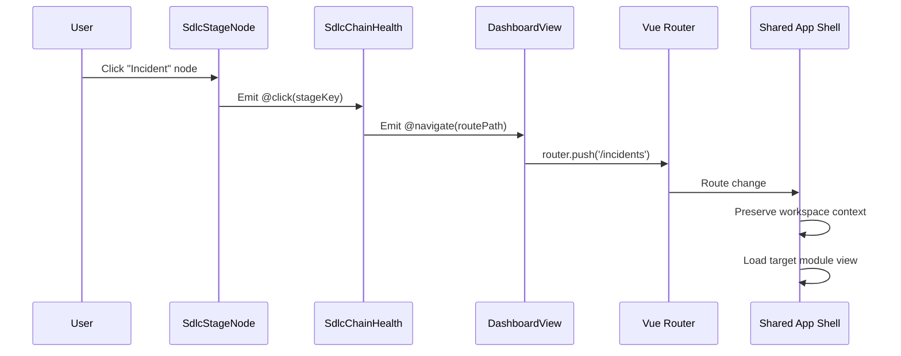
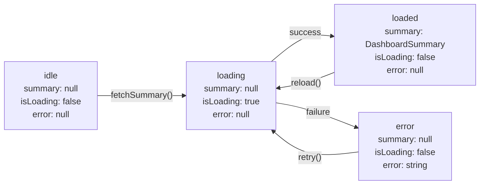
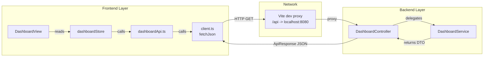

# Dashboard Data Flow

## Purpose

This document details the runtime data flows for the Dashboard / Control Tower page,
covering both Phase A (mocked) and Phase B (full-stack) execution paths.

## Traceability

- Architecture: [dashboard-architecture.md](dashboard-architecture.md)
- Design: [dashboard-design.md](../05-design/dashboard-design.md)
- Spec: [dashboard-spec.md](../03-spec/dashboard-spec.md)

---

## 1. Page Load Flow (Phase A — Mocked Data)

Phase A bypasses the API layer entirely. The store imports static data from
`mockData.ts` and returns it as if it came from the network. Each section is
wrapped in a `SectionResult<T>` envelope, so the rendering path is identical
whether the data is mocked or live.

---

## 2. Page Load Flow (Phase B — Full Stack)

---

## 3. Section-Level Error Isolation

Each card reads its own `SectionResult<T>` independently. A failure in one
section does not cascade to other cards. The top-level API returns 200 even
when individual sections fail.

---

## 4. Navigation Flow

### Navigation Routes

| Source Component | User Action | Target Route |
|------------------|-------------|-------------|
| SdlcChainHealth | Click any stage node | `stage.routePath` |
| StabilityIncidentCard | Click incident badge | `/incidents` |
| GovernanceTrustCard | Click governance indicator | `/platform` |
| RecentActivityStream | Click "View All" | `/platform` |

---

## 5. Store State Machine

---

## 6. Data Refresh Strategy

| Trigger | Behavior |
|---------|----------|
| Page mount | Full load via `store.fetchSummary()` |
| Manual refresh | Page reload (V1); future: dedicated refresh button |
| Workspace switch | `workspaceStore` watcher triggers `dashboardStore.fetchSummary()` |
| Background | Not implemented in V1; future: short-TTL polling or WebSocket |

---

## 7. API Client Chain

### Frontend API Chain

1. `DashboardView.vue` reads reactive state from `dashboardStore`
2. `dashboardStore.fetchSummary()` calls `dashboardApi.getSummary()`
3. `dashboardApi.ts` calls `fetchJson<DashboardSummary>('/dashboard/summary')`
4. `client.ts` sends `GET /api/v1/dashboard/summary`, unwraps `ApiResponse` envelope

### Backend Processing Chain

1. `DashboardController` receives GET request
2. Delegates to `DashboardService.getDashboardSummary(workspaceId)`
3. Service assembles `DashboardSummaryDto` (seed data in V1; aggregate queries in V2+)
4. Controller wraps in `ApiResponse.ok(dto)` and returns JSON
