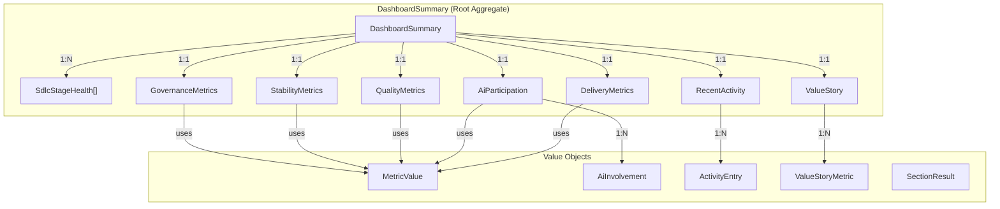
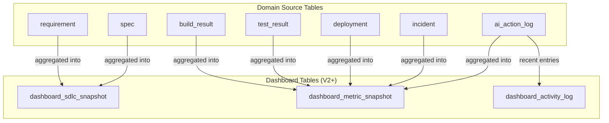

# Dashboard Data Model

## Purpose

This document defines the domain and persistent data model for the Dashboard / Control
Tower page — covering frontend types, backend DTOs, and the future database schema.

## Traceability

- Architecture: [dashboard-architecture.md](dashboard-architecture.md)
- Design: [dashboard-design.md](../05-design/dashboard-design.md)
- Spec: [dashboard-spec.md](../03-spec/dashboard-spec.md)
- Types source: `frontend/src/features/dashboard/types/dashboard.ts`

---

## 1. Domain Model Overview



---

## 2. Frontend Type Model

All types are defined in `frontend/src/features/dashboard/types/dashboard.ts`.
All interfaces use `readonly` properties for immutability.

### 2.1 Envelope Types

| Type | Purpose | Fields |
|------|---------|--------|
| `SectionResult<T>` | Per-section error isolation envelope | `data: T \| null`, `error: string \| null` |
| `DashboardSummary` | Root aggregate with 8 sections | Each section wrapped in `SectionResult<T>` |

### 2.2 SDLC Health

| Type | Purpose | Key Fields |
|------|---------|------------|
| `SdlcStageHealth` | Single pipeline node | `key`, `label`, `status`, `itemCount`, `isHub`, `routePath` |
| `SdlcStatus` | Status union type | `'healthy' \| 'warning' \| 'critical' \| 'inactive'` |

### 2.3 Metric Types

| Type | Purpose | Key Fields |
|------|---------|------------|
| `MetricValue` | Reusable metric with trend | `label`, `value`, `trend`, `trendIsPositive` |
| `TrendDirection` | Trend union type | `'up' \| 'down' \| 'stable'` |
| `DeliveryMetrics` | Delivery rhythm card | `leadTime`, `deployFrequency`, `iterationCompletion`, `bottleneckStage` |
| `AiParticipation` | AI involvement card | `usageRate`, `adoptionRate`, `autoExecSuccess`, `timeSaved`, `stageInvolvement[]` |
| `AiInvolvement` | AI per-stage involvement | `stageKey`, `involved`, `actionsCount` |
| `QualityMetrics` | Quality and testing card | `buildSuccessRate`, `testPassRate`, `defectDensity`, `specCoverage` |
| `StabilityMetrics` | Stability and incidents card | `activeIncidents`, `criticalIncidents`, `changeFailureRate`, `mttr`, `rollbackRate` |
| `GovernanceMetrics` | Governance trust card | `templateReuse`, `configDrift`, `auditCoverage`, `policyHitRate` |

### 2.4 Activity and Value Types

| Type | Purpose | Key Fields |
|------|---------|------------|
| `ActivityEntry` | Single activity event | `id`, `actor`, `actorType`, `action`, `stageKey`, `timestamp` |
| `ActorType` | Actor union type | `'ai' \| 'human'` |
| `RecentActivity` | Activity list container | `entries[]`, `total` |
| `ValueStory` | AI value narrative | `headline`, `metrics[]` |
| `ValueStoryMetric` | Single proof metric | `label`, `value`, `description` |

---

## 3. Backend DTO Model (Phase B)

All DTOs are Java records (immutable) in `com.sdlctower.domain.dashboard.dto`.
Field names match frontend TypeScript interfaces exactly for seamless JSON serialization.

### 3.1 Response Envelope

```java
// Reuses shared ApiResponse<T> from com.sdlctower.shared.dto
public record ApiResponse<T>(T data, String error) { ... }

// Dashboard-specific section envelope
public record SectionResultDto<T>(T data, String error) {
    public static <T> SectionResultDto<T> ok(T data) {
        return new SectionResultDto<>(data, null);
    }
    public static <T> SectionResultDto<T> fail(String error) {
        return new SectionResultDto<>(null, error);
    }
}
```

### 3.2 DTO Mapping

| Frontend Type | Backend DTO | Package |
|---------------|-------------|---------|
| `DashboardSummary` | `DashboardSummaryDto` | `domain.dashboard.dto` |
| `SectionResult<T>` | `SectionResultDto<T>` | `domain.dashboard.dto` |
| `SdlcStageHealth` | `SdlcStageHealthDto` | `domain.dashboard.dto` |
| `MetricValue` | `MetricValueDto` | `domain.dashboard.dto` |
| `DeliveryMetrics` | `DeliveryMetricsDto` | `domain.dashboard.dto` |
| `AiParticipation` | `AiParticipationDto` | `domain.dashboard.dto` |
| `QualityMetrics` | `QualityMetricsDto` | `domain.dashboard.dto` |
| `StabilityMetrics` | `StabilityMetricsDto` | `domain.dashboard.dto` |
| `GovernanceMetrics` | `GovernanceMetricsDto` | `domain.dashboard.dto` |
| `ActivityEntry` | `ActivityEntryDto` | `domain.dashboard.dto` |
| `RecentActivity` | `RecentActivityDto` | `domain.dashboard.dto` |
| `ValueStory` | `ValueStoryDto` | `domain.dashboard.dto` |

### 3.3 DTO Definitions

```java
public record DashboardSummaryDto(
    SectionResultDto<List<SdlcStageHealthDto>> sdlcHealth,
    SectionResultDto<DeliveryMetricsDto> deliveryMetrics,
    SectionResultDto<AiParticipationDto> aiParticipation,
    SectionResultDto<QualityMetricsDto> qualityMetrics,
    SectionResultDto<StabilityMetricsDto> stabilityMetrics,
    SectionResultDto<GovernanceMetricsDto> governanceMetrics,
    SectionResultDto<RecentActivityDto> recentActivity,
    SectionResultDto<ValueStoryDto> valueStory
) {}

public record SdlcStageHealthDto(
    String key,
    String label,
    String status,          // "healthy" | "warning" | "critical" | "inactive"
    int itemCount,
    boolean isHub,
    String routePath
) {}

public record MetricValueDto(
    String label,
    String value,
    String trend,           // "up" | "down" | "stable"
    boolean trendIsPositive
) {}

public record DeliveryMetricsDto(
    MetricValueDto leadTime,
    MetricValueDto deployFrequency,
    MetricValueDto iterationCompletion,
    String bottleneckStage   // nullable
) {}

public record AiParticipationDto(
    MetricValueDto usageRate,
    MetricValueDto adoptionRate,
    MetricValueDto autoExecSuccess,
    MetricValueDto timeSaved,
    List<AiInvolvementDto> stageInvolvement
) {}

public record AiInvolvementDto(
    String stageKey,
    boolean involved,
    int actionsCount
) {}

public record QualityMetricsDto(
    MetricValueDto buildSuccessRate,
    MetricValueDto testPassRate,
    MetricValueDto defectDensity,
    MetricValueDto specCoverage
) {}

public record StabilityMetricsDto(
    int activeIncidents,
    int criticalIncidents,
    MetricValueDto changeFailureRate,
    MetricValueDto mttr,
    MetricValueDto rollbackRate
) {}

public record GovernanceMetricsDto(
    MetricValueDto templateReuse,
    MetricValueDto configDrift,
    MetricValueDto auditCoverage,
    MetricValueDto policyHitRate
) {}

public record ActivityEntryDto(
    String id,
    String actor,
    String actorType,       // "ai" | "human"
    String action,
    String stageKey,
    String timestamp         // ISO 8601
) {}

public record RecentActivityDto(
    List<ActivityEntryDto> entries,
    int total
) {}

public record ValueStoryDto(
    String headline,
    List<ValueStoryMetricDto> metrics
) {}

public record ValueStoryMetricDto(
    String label,
    String value,
    String description
) {}
```

---

## 4. Future Database Schema (V2+)

V1 uses in-code seed data only — no dashboard-specific tables. When the system
aggregates from real domain tables, the following schema supports materialized
dashboard metrics.

### 4.1 Entity Relationship Diagram



### 4.2 Table Definitions

```sql
-- Snapshot of SDLC stage health, refreshed periodically
CREATE TABLE dashboard_sdlc_snapshot (
    id              BIGINT GENERATED ALWAYS AS IDENTITY PRIMARY KEY,
    workspace_id    BIGINT          NOT NULL,
    stage_key       VARCHAR(32)     NOT NULL,
    stage_label     VARCHAR(64)     NOT NULL,
    status          VARCHAR(16)     NOT NULL,  -- healthy/warning/critical/inactive
    item_count      INT             NOT NULL DEFAULT 0,
    is_hub          BOOLEAN         NOT NULL DEFAULT FALSE,
    route_path      VARCHAR(128)    NOT NULL,
    snapshot_time   TIMESTAMP       NOT NULL DEFAULT CURRENT_TIMESTAMP,
    CONSTRAINT uk_sdlc_snapshot UNIQUE (workspace_id, stage_key, snapshot_time)
);

CREATE INDEX idx_sdlc_snapshot_ws ON dashboard_sdlc_snapshot(workspace_id, snapshot_time);

-- Snapshot of aggregated metrics, refreshed periodically
CREATE TABLE dashboard_metric_snapshot (
    id              BIGINT GENERATED ALWAYS AS IDENTITY PRIMARY KEY,
    workspace_id    BIGINT          NOT NULL,
    category        VARCHAR(32)     NOT NULL,  -- delivery/ai/quality/stability/governance
    metric_key      VARCHAR(64)     NOT NULL,
    label           VARCHAR(128)    NOT NULL,
    value           VARCHAR(32)     NOT NULL,
    trend           VARCHAR(8)      NOT NULL,  -- up/down/stable
    trend_positive  BOOLEAN         NOT NULL,
    snapshot_time   TIMESTAMP       NOT NULL DEFAULT CURRENT_TIMESTAMP,
    CONSTRAINT uk_metric_snapshot UNIQUE (workspace_id, category, metric_key, snapshot_time)
);

CREATE INDEX idx_metric_snapshot_ws ON dashboard_metric_snapshot(workspace_id, snapshot_time);

-- Recent activity log for the dashboard activity stream
CREATE TABLE dashboard_activity_log (
    id              BIGINT GENERATED ALWAYS AS IDENTITY PRIMARY KEY,
    workspace_id    BIGINT          NOT NULL,
    actor           VARCHAR(128)    NOT NULL,
    actor_type      VARCHAR(8)      NOT NULL,  -- ai/human
    action          VARCHAR(256)    NOT NULL,
    stage_key       VARCHAR(32)     NOT NULL,
    created_at      TIMESTAMP       NOT NULL DEFAULT CURRENT_TIMESTAMP
);

CREATE INDEX idx_activity_log_ws ON dashboard_activity_log(workspace_id, created_at DESC);
```

### 4.3 V1 vs V2+ Comparison

| Aspect | V1 (Current) | V2+ (Future) |
|--------|-------------|-------------|
| Data source | In-code seed data | Domain table aggregation |
| Storage | None | Materialized snapshots |
| Refresh | Static | Periodic (cron) or event-driven |
| Workspace isolation | Parameter only | Enforced by DB constraints |
| Activity log | Static mock | Real `dashboard_activity_log` table |

---

## 5. Data Contracts — Frontend to Backend

### 5.1 JSON Field Name Alignment

All field names are camelCase in both TypeScript and Java. Jackson serializes Java
records to camelCase by default. No `@JsonProperty` annotations needed.

### 5.2 Type Mapping

| TypeScript | Java | JSON |
|------------|------|------|
| `string` | `String` | `"string"` |
| `number` (int) | `int` | `123` |
| `boolean` | `boolean` | `true/false` |
| `string \| null` | `String` (nullable) | `"string" \| null` |
| `ReadonlyArray<T>` | `List<T>` | `[...]` |
| `SectionResult<T>` | `SectionResultDto<T>` | `{ "data": T, "error": null }` |

### 5.3 Immutability Contract

- **Frontend**: All interfaces use `readonly` properties; arrays use `ReadonlyArray<T>`
- **Backend**: All DTOs are Java `record` types (inherently immutable)
- **Wire**: JSON is naturally immutable (serialization creates new objects)
