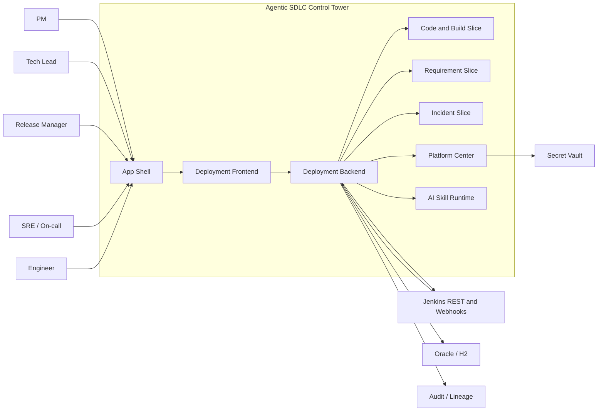
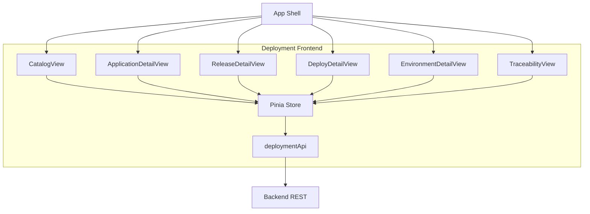
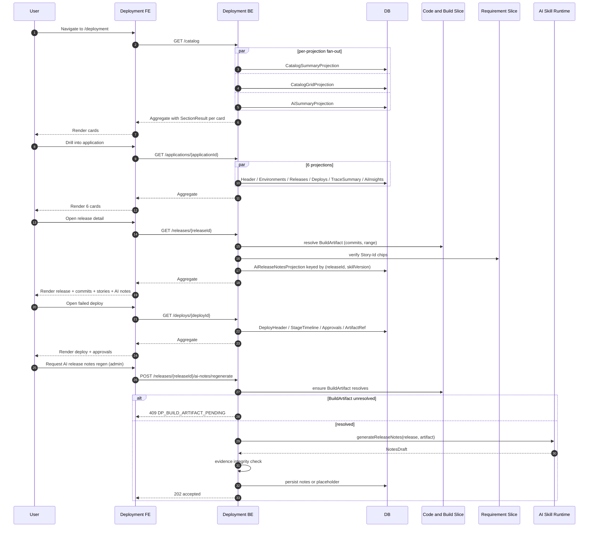
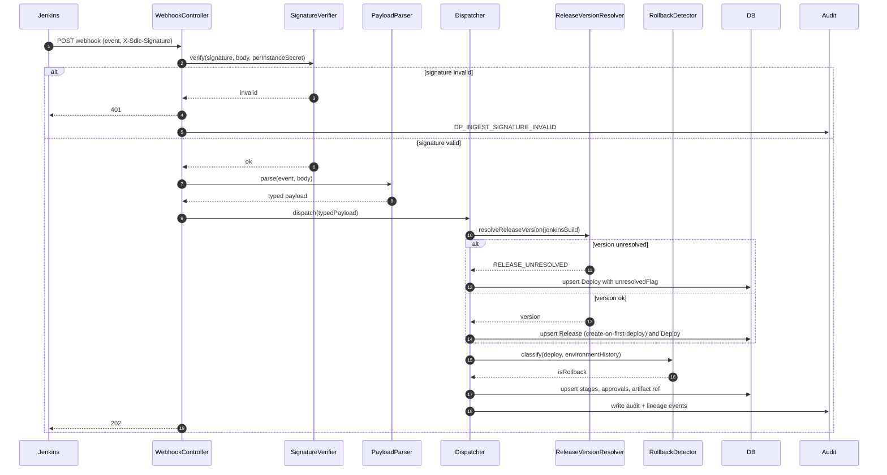
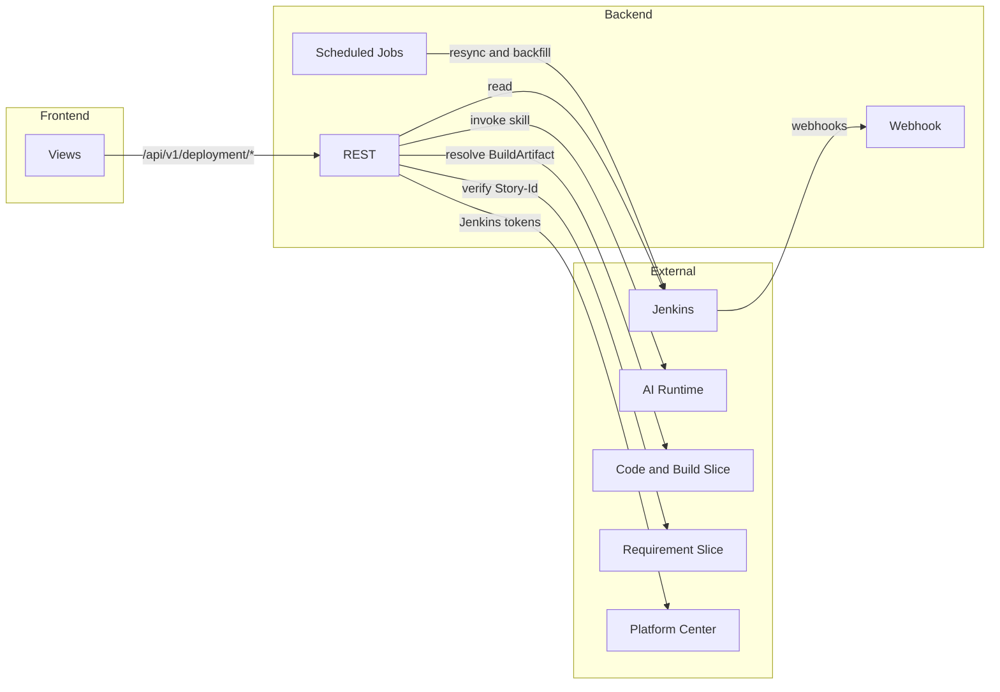

# Deployment Management — Architecture

## 1. Purpose

This document describes the architecture of the **Deployment Management** slice. V1 is a read-only observability viewer for Jenkins-orchestrated deployments with Story↔Commit↔Build↔Deploy traceability and two AI capabilities: workspace summary and per-release AI release-notes. AI output is advisory and never has approval or rollback authority.

### Upstream references

- Requirements: [../01-requirements/deployment-management-requirements.md](../01-requirements/deployment-management-requirements.md)
- Stories: [../02-user-stories/deployment-management-stories.md](../02-user-stories/deployment-management-stories.md)
- Spec: [../03-spec/deployment-management-spec.md](../03-spec/deployment-management-spec.md)
- Upstream slice: [../04-architecture/code-build-management-architecture.md](./code-build-management-architecture.md) (BuildArtifact is the join key)

## 2. System Context

Actors, systems, and stores relevant to the slice:

## 3. Component Breakdown — Frontend

Catalog View mounts: `CatalogSummaryBarCard`, `CatalogGridCard`, `CatalogFilterBar`, `CatalogAiSummaryCard`.

Application Detail mounts: `ApplicationHeaderCard`, `ApplicationEnvironmentsCard`, `ApplicationRecentReleasesCard`, `ApplicationRecentDeploysCard`, `ApplicationTraceSummaryCard`, `ApplicationAiInsightsCard`.

Release Detail mounts: `ReleaseHeaderCard`, `ReleaseCommitsCard`, `ReleaseLinkedStoriesCard`, `ReleaseDeploysCard`, `ReleaseAiNotesCard`.

Deploy Detail mounts: `DeployHeaderCard`, `DeployStageTimelineCard`, `DeployApprovalsCard`, `DeployArtifactRefCard`, `OpenIncidentAction`.

Environment Detail mounts: `EnvironmentHeaderCard`, `EnvironmentCurrentRevisionCard`, `EnvironmentTimelineCard`, `EnvironmentMetricsCard`.

Traceability View mounts: `TraceabilityInputCard`, `TraceabilityReleasesCard`, `TraceabilityDeploysCard`.

## 4. Component Breakdown — Backend

```mermaid
graph TB
  subgraph BE[com.sdlctower.domain.deploymentmanagement]
    Ctrl[DeploymentController]
    Webhook[JenkinsWebhookController]

    subgraph Services
      CatSvc[CatalogService]
      AppSvc[ApplicationDetailService]
      RelSvc[ReleaseDetailService]
      DepSvc[DeployDetailService]
      EnvSvc[EnvironmentDetailService]
      TraceSvc[TraceabilityService]
      AiSumSvc[AiSummaryService]
      AiRelSvc[AiReleaseNotesService]
    end

    subgraph Ingestion
      SigVerify[WebhookSignatureVerifier]
      Parser[JenkinsWebhookPayloadParser]
      Dispatcher[IngestionDispatcher]
      ReleaseResolver[ReleaseVersionResolver]
      Resync[ResyncScheduler]
      Backfill[JenkinsBackfillService]
    end

    subgraph Projections
      Proj[All Projections]
    end

    subgraph Policy
      AccessGuard[DeploymentAccessGuard]
      RollbackDet[RollbackDetector]
      EvidenceChk[ReleaseNotesEvidenceValidator]
      Autonomy[AiAutonomyPolicy]
    end

    subgraph Persistence
      Repos[JPA Repositories]
    end

    Integration[JenkinsRestClient]
  end

  Ctrl --> Services
  Services --> Proj
  Services --> Policy
  Proj --> Repos
  Repos --> DB[Database]

  Webhook --> SigVerify
  Webhook --> Parser
  Parser --> Dispatcher
  Dispatcher --> ReleaseResolver
  Dispatcher --> RollbackDet
  Dispatcher --> Repos
  Resync --> Integration
  Backfill --> Integration
  Integration --> Jenkins[Jenkins API]

  AiSumSvc --> SkillRuntime[AI Skill Runtime]
  AiRelSvc --> SkillRuntime
  AiRelSvc --> EvidenceChk

  RelSvc --> CBFacade[Code and Build Facade]
  TraceSvc --> CBFacade
  TraceSvc --> ReqFacade[Requirement Facade]
  RelSvc --> ReqFacade
```

## 5. Data Flow (High-level)

## 6. Ingestion Flow

Resync (every 24h) and Jenkins install backfill (on new-instance registration) walk the Jenkins REST API and reconcile against ingested rows.

## 7. State Boundaries

- **Frontend state (Pinia):** derived view aggregates per page, per-card status, active filters. No raw webhook payloads, no tokens.
- **Backend state (DB):** canonical record of applications, environments, releases, deploys, deploy stages, approval events, artifact references, AI release-notes rows, AI summary rows, change log.
- **Secret Vault (Platform Center):** Jenkins API tokens and per-instance webhook secrets. Backend holds short-lived Jenkins session tokens in memory; never persisted.
- **Jenkins (external):** source of truth for deploy pipeline, stage outcomes, approvals. Control Tower is a read-side consumer.
- **Code & Build slice:** source of truth for BuildArtifact, commits, Story↔Commit links. Deployment holds only the `buildArtifactRef`.
- **Audit / Lineage stores:** cross-slice shared, append-only.

## 8. Integration Boundary

## 9. Non-functional Constraints

- P95 aggregate latency: Catalog ≤1200ms; Application Detail ≤1500ms; Release Detail ≤1500ms; Deploy Detail ≤1500ms; Environment Detail ≤1500ms.
- Per-projection timeout: 500ms; failing projection returns `SectionResult(data=null, error=...)`.
- Jenkins webhook freshness SLO: `job.completed` visible in UI within 45s at P95.
- Webhook receiver handles 25 req/s burst per Jenkins instance with backpressure to an async dispatcher queue.
- Jenkins rate-limit aware: per-instance token bucket with exponential backoff; UI banner when sustained.
- Every mutation path emits `AuditLogEntry` + `LineageEvent`.
- No direct table access from other slices; downstream consumers use facade endpoints.

## 10. Security Posture

- Webhook signature (HMAC-SHA-256 over body with per-Jenkins-instance secret) verified on every request; invalid → 401 + audit.
- Jenkins API tokens never leave Platform Center vault; session tokens minted per request and held in memory, never logged.
- Approver rationale is role-gated (PM / Tech Lead / Release Manager). Others see decision + timestamp only.
- Email addresses are never rendered in the UI (display-name only).
- AI prompts exclude Jenkins credentials and any `// private:` annotated approval rationale.
- All ingestion and AI invocation is audited with correlation ID propagation.
- AI output is sanitized through `ReleaseNotesEvidenceValidator` before persistence.

## 11. Risks and Mitigations

| Risk | Mitigation |
| ---- | ---------- |
| Webhook burst during bulk Jenkins replay | Async dispatcher queue with per-instance backpressure + bounded concurrency |
| Jenkins throttling hurts backfill / resync | Per-instance token bucket; exponential backoff; UI banner when sustained |
| AI release notes hallucinate story IDs | Evidence integrity check at service time; placeholder on mismatch (REQ-DP-66) |
| BuildArtifact webhook race on fresh deploy | Render `BUILD_PENDING` badge; retry resolution with backoff; AI notes skipped until resolved |
| Approver rationale leaked to wrong audience | Role gate + project-scoped access guard; payload stripped at projection level |
| Email PII rendered by mistake | Projection-level mask at the DTO boundary; reject identity fields that look like RFC-5322 addresses |
| Oracle CLOB handling differs from H2 | Migration authored with dialect-aware column types; verified on Oracle-in-Docker |
| Duplicate Deploys from redelivered webhooks | Idempotency key `(jenkinsInstanceId, jenkinsJobFullName, jenkinsBuildNumber)` unique index |
| Release version missing from Jenkins build | `RELEASE_UNRESOLVED` flag; deploy surfaced in diagnostics view rather than silently dropped |
| Cross-slice Code & Build lookup cascades latency | Batch resolve calls; cache within a single request scope only |
| Rollback misclassification | Two-signal detector: `trigger=rollback` OR release-version-older-than-prior; visible both ways in UI |

## 12. Decisions

Mirrors the spec's decision list (D1–D12) plus architecture-specific choices:

- **D13** — Webhook receiver is synchronous for signature verification + parsing only; heavy work is handed off to `IngestionDispatcher` via an in-process queue (Spring `@Async` + bounded thread pool) backed by a persistent outbox table for durability across restarts.
- **D14** — Projections read from DB; they never call Jenkins directly. All Jenkins reads happen in ingestion, resync, and backfill paths. Rationale: predictable latency for user-facing aggregates.
- **D15** — Release composition (commits, stories) is resolved at query time via the Code & Build facade, not persisted locally. Rationale: Code & Build owns the Story↔Commit mapping; persisting a cached copy in Deployment would create dual-writes and drift risk.
- **D16** — AI runs (summary, release notes) are invoked asynchronously from the request path; user-facing requests read the latest persisted AI row and show PENDING if none exists. Rationale: keeps P95 latency within budget even when the AI runtime is slow.
- **D17** — Release rows are created lazily on first deploy of a new `RELEASE_VERSION`. Rationale: Jenkins is the source of truth for release existence; mirroring that in Control Tower avoids drift.
- **D18** — Environment list is seeded from the first deploy that references each environment name; operators may later rename via a Platform Center action (V1.1). Rationale: zero-config onboarding.
- **D19** — Rollback detection is dual-signal (`trigger=rollback` explicit AND version-older-than-prior heuristic). Either signal marks the deploy as rollback. Rationale: Jenkinsfile conventions vary; neither signal alone is reliable.

## 13. Glossary

See the spec's glossary (§9). Architecture adds:

- **Dispatcher** — in-process component that consumes parsed webhook events and upserts DB rows.
- **Outbox** — DB-backed persistent queue used by the async dispatcher to survive restarts.
- **Projection** — a read-side query function that builds a view DTO from DB rows.
- **ReleaseVersionResolver** — derives `releaseVersion` from Jenkins parameter `RELEASE_VERSION` or Jenkinsfile-annotated stage pattern `Release {version}`.
- **RollbackDetector** — classifies each incoming deploy as forward or rollback using trigger signal + version-ordering heuristic.
- **ReleaseNotesEvidenceValidator** — rejects AI release notes whose referenced story set exceeds the release's resolved story set.
