# Deployment Management — Data Flow

Runtime sequences, state machines, error cascade, and refresh strategy for the Deployment Management slice. Operationalizes [deployment-management-architecture.md](deployment-management-architecture.md) and the contracts in [../05-design/contracts/deployment-management-API_IMPLEMENTATION_GUIDE.md](../05-design/contracts/deployment-management-API_IMPLEMENTATION_GUIDE.md).

## 1. Catalog Page Load (Phase A — mocks)

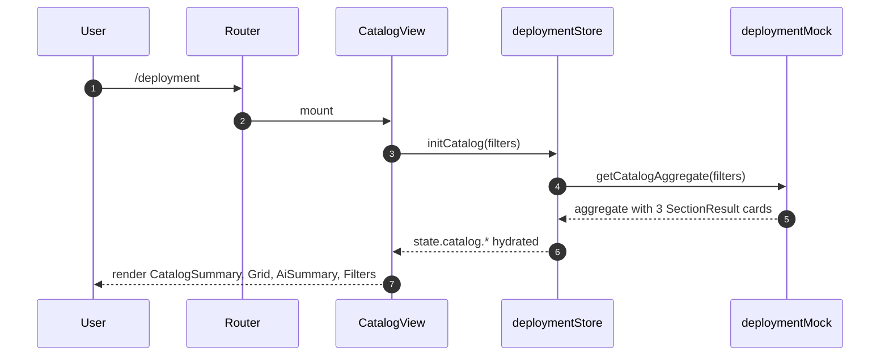

## 2. Catalog Page Load (Phase B — backend)

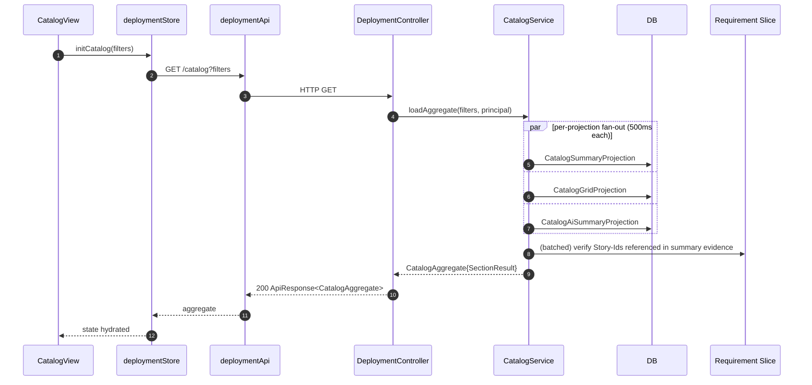

## 3. Application Detail Page Load

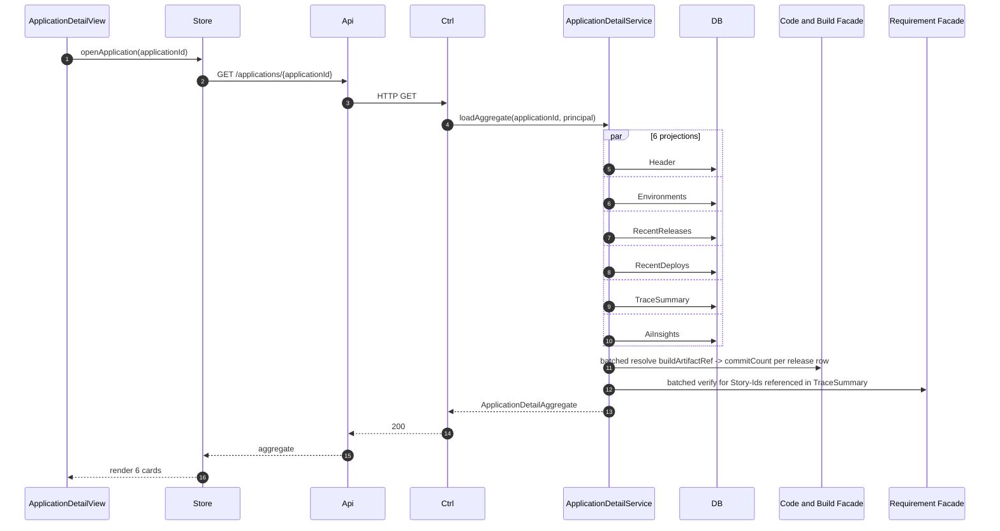

## 4. Release Detail Page Load with AI Release Notes

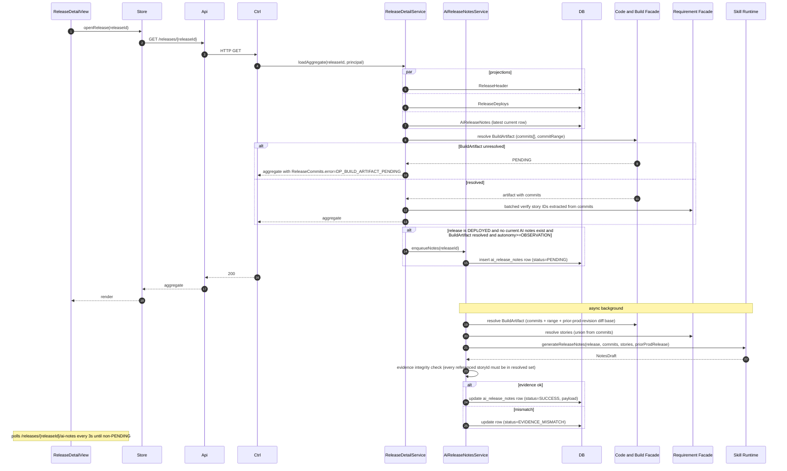

## 5. Deploy Detail Page Load

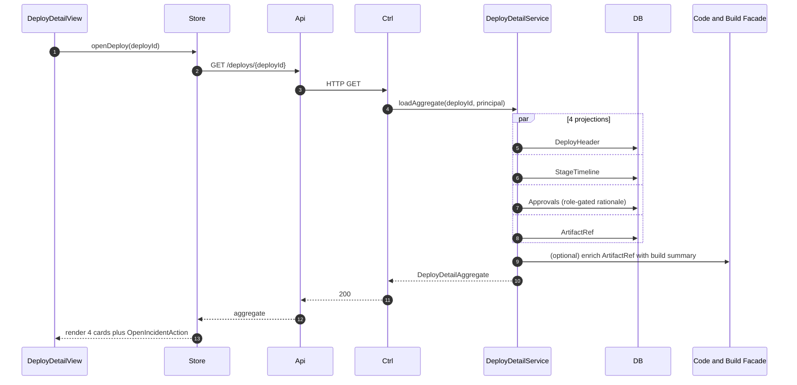

## 6. Environment Detail Page Load

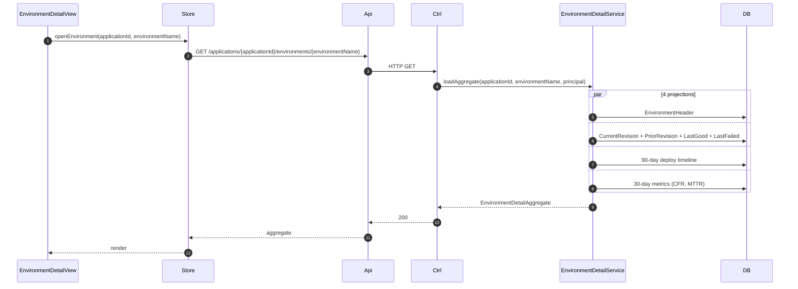

## 7. Story → Release → Deploy Inverse Lookup

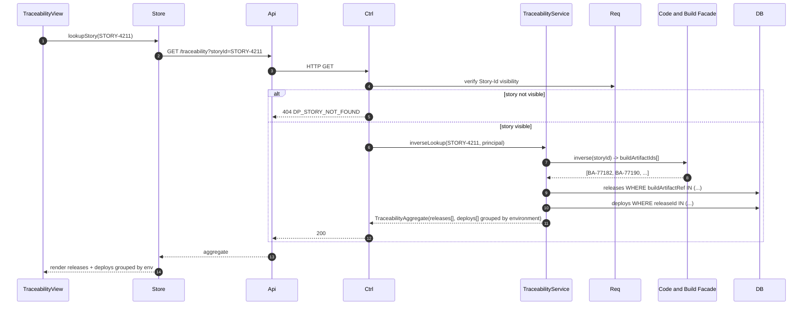

## 8. Webhook Ingestion from Jenkins

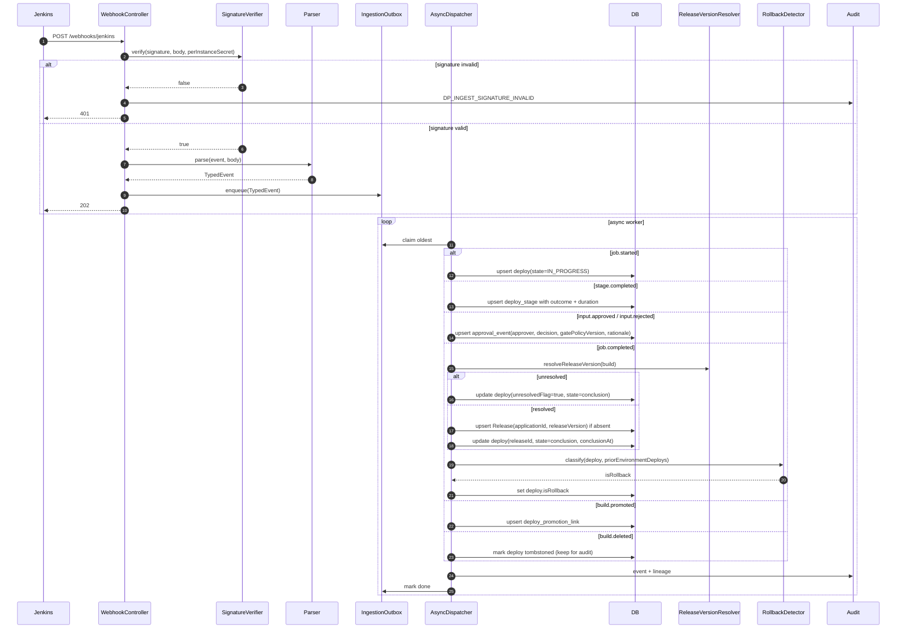

## 9. Install Backfill and Nightly Resync

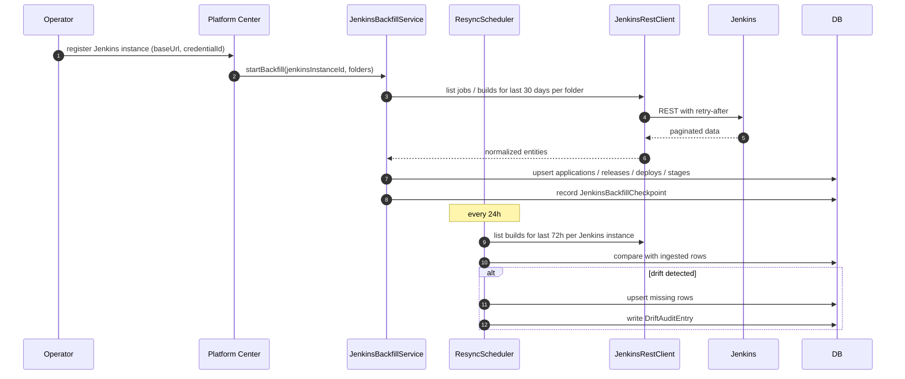

## 10. State Machines

### 10.1 Deploy

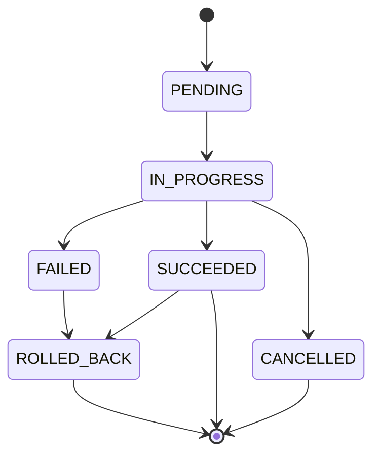

- `PENDING` ← Jenkins `job.queued`
- `IN_PROGRESS` ← Jenkins `job.started`
- `SUCCEEDED` ← Jenkins `job.completed` with conclusion `SUCCESS`
- `FAILED` ← Jenkins `job.completed` with conclusion `FAILURE`
- `CANCELLED` ← Jenkins `job.completed` with conclusion `ABORTED`
- `ROLLED_BACK` is a logical label: the Deploy row keeps its terminal state (`SUCCEEDED` or `FAILED`) and a later deploy with `isRollback=true` for the same environment flips the current-revision pointer.

### 10.2 Release

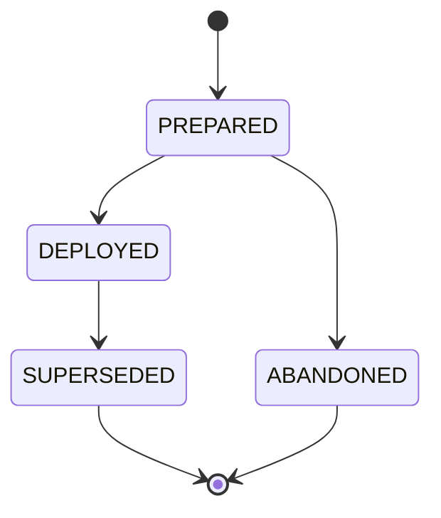

- `PREPARED` — Release row exists but no `SUCCEEDED` deploy yet.
- `DEPLOYED` — at least one `SUCCEEDED` deploy to any environment.
- `SUPERSEDED` — a later Release has replaced this one as current in every environment that had reached it.
- `ABANDONED` — operator-marked (V1.1).

### 10.3 AI Release Notes Row

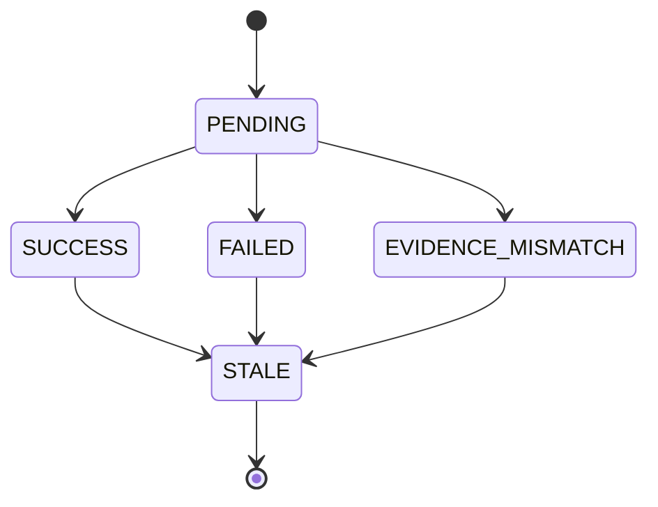

STALE = the release's source `buildArtifactSha` advanced past this row's snapshot (rebuild-with-same-version corruption case). The row stays in DB for audit but is hidden from default UI view; admin can Regenerate.

### 10.4 Approval Event

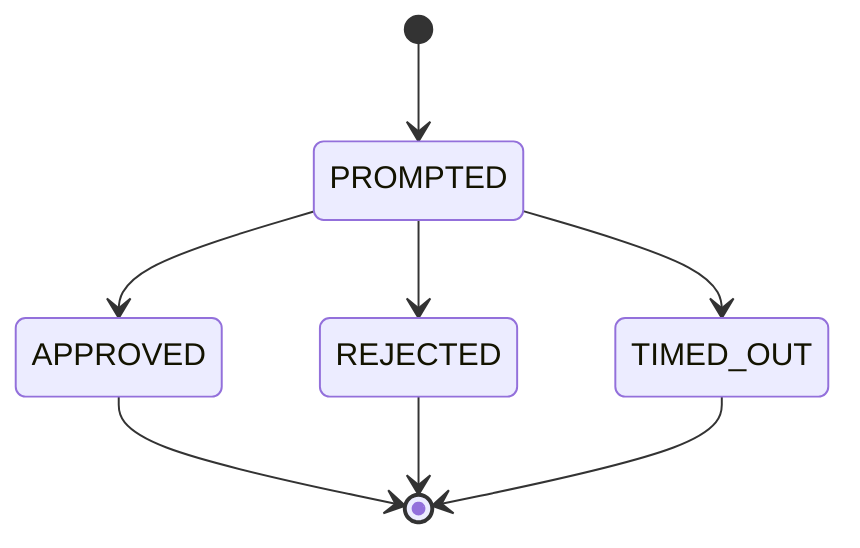

- `PROMPTED` ← Jenkins `input.prompted` (pipeline is waiting for a human decision).
- `APPROVED` ← Jenkins `input.approved`.
- `REJECTED` ← Jenkins `input.rejected` or Jenkins `input.aborted`.
- `TIMED_OUT` ← Jenkins `input.timeout` (if configured).

## 11. Error Cascade and Per-Card Isolation

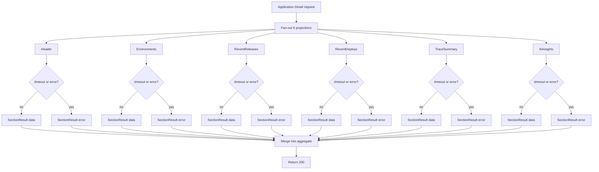

Page-level errors are reserved for `DP_WORKSPACE_FORBIDDEN`, `DP_APPLICATION_NOT_FOUND`, `DP_RELEASE_NOT_FOUND`, `DP_DEPLOY_NOT_FOUND`, `DP_ENVIRONMENT_NOT_FOUND`, and `DP_STORY_NOT_FOUND`. Everything else degrades per card.

## 12. Refresh Strategy

- **Page focus regain** — refresh "stale" cards (AI summary, Recent Deploys, Environments current revision) if last load >60s ago.
- **Websocket / SSE (V1.1 candidate)** — out of scope for V1; webhook-driven updates reach the DB but the UI refreshes on navigation or manual refresh.
- **Manual refresh** — each card exposes a refresh icon that re-requests only that card.
- **AI Release Notes polling** — when a row is PENDING, the view polls `/releases/{releaseId}/ai-notes` every 3s with jitter; back-off to 10s after 30s; cap at 2 minutes (then surface FAILED).
- **BuildArtifact pending polling** — when a Release's `buildArtifactRef` is PENDING, the Release Detail page polls the Build card every 5s with jitter for up to 5 minutes, then falls back to admin Retry.

## 13. Phase A / Phase B Toggle

Frontend toggles between mocks and backend via `import.meta.env.DEV && !import.meta.env.VITE_USE_BACKEND`. All mock latencies match the per-projection timeout (300–500ms) so Phase A UX reflects Phase B behavior. Mock `commandLoop` injects `DP_AI_UNAVAILABLE` at 5%, `DP_JENKINS_UNREACHABLE` at 2%, `DP_BUILD_ARTIFACT_PENDING` at 3%, and an evidence-mismatch release-notes row at 3% to exercise the UI states.

## 14. Observability

Every backend call is traced with a correlation id propagated from the frontend (`x-correlation-id`). Webhook ingestion generates its own correlation id and tags it with Jenkins instance id + build full-name + build number so webhook-to-UI latency can be measured end-to-end. Metrics (P95 latency, error rate, projection timeout rate, AI success rate, Jenkins unavailability hits, rollback rate per environment, change-failure-rate, MTTR) are exported via the shared metrics facade.
