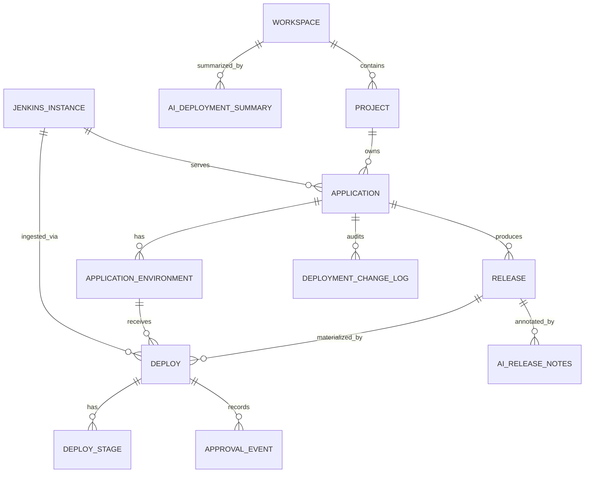

# Deployment Management — Data Model

## 1. Scope

This document defines the canonical data model of the Deployment Management slice: the domain-level ER diagram, frontend TypeScript types, backend Java DTOs and JPA entities, Flyway schema DDL (migrations `V60__…V66__`), and the frontend↔backend type mapping. Net-new tables only — upstream Project, Workspace, Member, Story, and BuildArtifact come from their respective slices via facades.

### Upstream references

- Requirements: [../01-requirements/deployment-management-requirements.md](../01-requirements/deployment-management-requirements.md)
- Spec: [../03-spec/deployment-management-spec.md](../03-spec/deployment-management-spec.md)
- Architecture: [deployment-management-architecture.md](deployment-management-architecture.md)
- Data flow: [deployment-management-data-flow.md](deployment-management-data-flow.md)
- Upstream data model: [code-build-management-data-model.md](code-build-management-data-model.md) — BuildArtifact is the join key

## 2. Domain Model

### 2.1 ER diagram



Cross-slice references (not tables):

- `RELEASE.buildArtifactRef` → Code & Build slice's `BuildArtifact`
- `RELEASE.linkedStoryIds` (derived at read time) → Requirement slice's `Story`
- `APPROVAL_EVENT.approverMemberId` → Platform / Member service

### 2.2 Enumerations

- **DeployState:** `PENDING` | `IN_PROGRESS` | `SUCCEEDED` | `FAILED` | `CANCELLED` | `ROLLED_BACK`
- **DeployTrigger:** `PUSH_TO_MAIN` | `MANUAL` | `SCHEDULED` | `PROMOTE_FROM_DEV` | `PROMOTE_FROM_TEST` | `PROMOTE_FROM_STAGING` | `ROLLBACK`
- **DeployStageState:** `SUCCESS` | `FAILURE` | `ABORTED` | `UNSTABLE` | `SKIPPED` | `IN_PROGRESS` | `NOT_STARTED`
- **ReleaseState:** `PREPARED` | `DEPLOYED` | `SUPERSEDED` | `ABANDONED`
- **EnvironmentKind:** `DEV` | `TEST` | `STAGING` | `PROD` | `CUSTOM`
- **ApprovalDecision:** `APPROVED` | `REJECTED` | `TIMED_OUT`
- **ApprovalState:** `PROMPTED` | `APPROVED` | `REJECTED` | `TIMED_OUT`
- **AiRowStatus:** `PENDING` | `SUCCESS` | `FAILED` | `STALE` | `SUPERSEDED` | `EVIDENCE_MISMATCH`
- **HealthLed:** `GREEN` | `AMBER` | `RED` | `UNKNOWN`
- **ChangeLogEntryType:** `APPLICATION_REGISTERED` | `DEPLOY_INGESTED` | `RELEASE_CREATED` | `APPROVAL_RECORDED` | `ROLLBACK_DETECTED` | `RELEASE_NOTES_GENERATED` | `SUMMARY_GENERATED` | `INSTANCE_BACKFILLED` | `RESYNC_DRIFT_HEALED`

## 3. Frontend Types (TypeScript)

Organized under `frontend/src/features/deployment-management/types/`.

### `enums.ts`

```ts
export type DeployState =
  | 'PENDING' | 'IN_PROGRESS'
  | 'SUCCEEDED' | 'FAILED' | 'CANCELLED' | 'ROLLED_BACK';
export type DeployTrigger =
  | 'PUSH_TO_MAIN' | 'MANUAL' | 'SCHEDULED'
  | 'PROMOTE_FROM_DEV' | 'PROMOTE_FROM_TEST' | 'PROMOTE_FROM_STAGING'
  | 'ROLLBACK';
export type DeployStageState =
  | 'SUCCESS' | 'FAILURE' | 'ABORTED' | 'UNSTABLE'
  | 'SKIPPED' | 'IN_PROGRESS' | 'NOT_STARTED';
export type ReleaseState = 'PREPARED' | 'DEPLOYED' | 'SUPERSEDED' | 'ABANDONED';
export type EnvironmentKind = 'DEV' | 'TEST' | 'STAGING' | 'PROD' | 'CUSTOM';
export type ApprovalDecision = 'APPROVED' | 'REJECTED' | 'TIMED_OUT';
export type ApprovalState = 'PROMPTED' | 'APPROVED' | 'REJECTED' | 'TIMED_OUT';
export type AiRowStatus = 'PENDING' | 'SUCCESS' | 'FAILED' | 'STALE' | 'SUPERSEDED' | 'EVIDENCE_MISMATCH';
export type HealthLed = 'GREEN' | 'AMBER' | 'RED' | 'UNKNOWN';
```

### `catalog.ts`

```ts
export interface CatalogSummary {
  visibleApplications: number;
  releasesLast7d: number;
  deploysLast7d: number;
  deploySuccessRate7d: number;        // 0..1
  medianDeployFrequency: number;      // deploys/day/application
  changeFailureRate30d: number;       // 0..1
  byLed: Record<HealthLed, number>;
}

export interface EnvRevisionChip {
  environmentName: string;
  revisionReleaseVersion: string | null;
  deployState: DeployState | null;
  deployedAt: string | null;
  isRolledBack: boolean;
}

export interface CatalogApplicationTile {
  applicationId: string;
  name: string;
  projectId: string;
  workspaceId: string;
  runtimeLabel: string;               // e.g. "jvm", "node"
  lastDeployAt: string | null;
  environmentRevisions: EnvRevisionChip[];
  aggregateLed: HealthLed;
  description?: string;
}

export interface CatalogSection {
  projectId: string;
  projectName: string;
  applications: CatalogApplicationTile[];
}

export interface CatalogAggregate {
  summary: SectionResult<CatalogSummary>;
  grid: SectionResult<CatalogSection[]>;
  aiSummary: SectionResult<AiWorkspaceDeploymentSummary>;
  filtersEcho: CatalogFilters;
}

export interface CatalogFilters {
  projectIds?: string[];
  environmentKind?: EnvironmentKind;
  deployStatus?: HealthLed;
  window?: '24h' | '7d' | '30d';
  search?: string;
}
```

### `application.ts`

```ts
export interface ApplicationHeader {
  applicationId: string;
  name: string;
  projectId: string;
  workspaceId: string;
  runtimeLabel: string;
  jenkinsFolderPath: string;
  jenkinsFolderUrl: string;           // deep-link
  lastDeployAt: string | null;
  description?: string;
}

export interface EnvironmentRow {
  environmentName: string;
  kind: EnvironmentKind;
  currentRevision: string | null;            // release version
  currentRevisionReleaseId: string | null;
  currentDeployState: DeployState | null;
  currentDeployedAt: string | null;
  priorRevision: string | null;
  lastGoodRevision: string | null;
  isRolledBack: boolean;
  rolledBackToReleaseVersion: string | null;
}

export interface RecentReleaseRow {
  releaseId: string;
  releaseVersion: string;
  buildArtifactRef: { sliceId: 'code-build'; buildArtifactId: string };
  createdAt: string;
  state: ReleaseState;
  storyCount: number;                 // count of linked stories (read-time derived)
}

export interface RecentDeployRow {
  deployId: string;
  releaseVersion: string;
  environmentName: string;
  state: DeployState;
  startedAt: string;
  durationSec?: number;
  approverDisplayName?: string;       // present iff an approval gate fired
  isCurrentRevision: boolean;
  isRollback: boolean;
}

export interface TraceSummaryRow {
  environmentName: string;
  storiesLast30d: number;
  deploysLast30d: number;
}

export interface ApplicationAiInsight {
  status: AiRowStatus;
  generatedAt?: string;
  narrative?: string;
  evidence?: Array<{ kind: 'release' | 'deploy' | 'environment'; id: string; label: string }>;
  skillVersion?: string;
  error?: { code: string; message: string };
}

export interface ApplicationDetailAggregate {
  header: SectionResult<ApplicationHeader>;
  environments: SectionResult<EnvironmentRow[]>;
  recentReleases: SectionResult<RecentReleaseRow[]>;
  recentDeploys: SectionResult<RecentDeployRow[]>;
  traceSummary: SectionResult<TraceSummaryRow[]>;
  aiInsights: SectionResult<ApplicationAiInsight>;
}
```

### `release.ts`

```ts
export interface ReleaseHeader {
  releaseId: string;
  releaseVersion: string;
  applicationId: string;
  workspaceId: string;
  state: ReleaseState;
  createdAt: string;
  createdBy?: string;
  buildArtifactRef: { sliceId: 'code-build'; buildArtifactId: string };
  buildArtifactResolved: boolean;
  buildArtifactSha?: string;          // for staleness detection
  jenkinsSourceUrl: string;
}

export interface ReleaseCommitRow {
  sha: string;
  shortSha: string;
  author: string;
  message: string;
  committedAt: string;
  storyIds: string[];
}

export interface ReleaseDeployRow {
  deployId: string;
  environmentName: string;
  state: DeployState;
  startedAt: string;
  durationSec?: number;
  approverDisplayName?: string;
  isCurrentRevision: boolean;
  isRollback: boolean;
}

export interface AiReleaseNotes {
  status: AiRowStatus;
  keyedOnReleaseId: string;
  skillVersion?: string;
  generatedAt?: string;
  narrative?: string;                 // what is in this release
  diffNarrative?: string;             // since previous prod revision
  riskHint?: 'LOW' | 'MEDIUM' | 'HIGH';  // advisory only
  evidence?: Array<{ kind: 'commit' | 'story'; id: string; label?: string }>;
  error?: { code: string; message: string };
}

export interface ReleaseDetailAggregate {
  header: SectionResult<ReleaseHeader>;
  commits: SectionResult<ReleaseCommitRow[]>;
  linkedStories: SectionResult<StoryChip[]>;
  deploys: SectionResult<ReleaseDeployRow[]>;
  aiNotes: SectionResult<AiReleaseNotes>;
  capNotice?: { kind: 'COMMIT_RANGE_CAP'; appliedCommitCap: 100 };
}
```

### `deploy.ts`

```ts
export interface DeployHeader {
  deployId: string;
  releaseId: string;
  releaseVersion: string;
  applicationId: string;
  environmentName: string;
  jenkinsJobFullName: string;
  jenkinsBuildNumber: number;
  jenkinsBuildUrl: string;            // deep-link
  trigger: DeployTrigger;
  actor: string;
  startedAt: string;
  completedAt?: string;
  durationSec?: number;
  state: DeployState;
  isCurrentRevision: boolean;
  isRollback: boolean;
  unresolvedFlag: boolean;            // RELEASE_UNRESOLVED
}

export interface DeployStageRow {
  stageId: string;
  name: string;
  order: number;
  state: DeployStageState;
  startedAt?: string;
  completedAt?: string;
  durationSec?: number;
  approverDisplayName?: string;       // present on approval-gate stages
  approvalDecision?: ApprovalDecision;
}

export interface ApprovalEvent {
  approvalId: string;
  stageId: string;
  stageName: string;
  approverDisplayName?: string;
  approverMemberId?: string;
  approverRole?: string;
  decision: ApprovalDecision;
  gatePolicyVersion: string;
  rationale?: string;                 // role-gated; absent for non-privileged viewers
  decidedAt: string;
}

export interface DeployArtifactRefCard {
  buildArtifactRef: { sliceId: 'code-build'; buildArtifactId: string };
  buildArtifactResolved: boolean;
  buildSummary?: {
    pipelineName: string;
    commitCount: number;
    commitRangeHeadSha: string;
    commitRangeBaseSha: string;
  };
}

export interface OpenIncidentContextDto {
  applicationId: string;
  environmentName: string;
  deployId: string;
  releaseVersion: string;
  deployUrl: string;
  summaryLine?: string;
}

export interface DeployDetailAggregate {
  header: SectionResult<DeployHeader>;
  stageTimeline: SectionResult<DeployStageRow[]>;
  approvals: SectionResult<ApprovalEvent[]>;
  artifactRef: SectionResult<DeployArtifactRefCard>;
  openIncidentContext: OpenIncidentContextDto;
  followedByRollback?: { deployId: string; deployUrl: string };
}
```

### `environment.ts`

```ts
export interface EnvironmentHeader {
  applicationId: string;
  environmentName: string;
  kind: EnvironmentKind;
}

export interface EnvironmentRevisions {
  currentRevision: string | null;
  currentDeployId: string | null;
  priorRevision: string | null;
  priorDeployId: string | null;
  lastGoodRevision: string | null;
  lastGoodDeployId: string | null;
  lastFailedRevision: string | null;
  lastFailedDeployId: string | null;
}

export interface EnvironmentTimelineEntry {
  deployId: string;
  releaseVersion: string;
  state: DeployState;
  startedAt: string;
  durationSec?: number;
  isRollback: boolean;
}

export interface EnvironmentMetrics {
  changeFailureRate30d: number;       // 0..1
  mttrSec30d: number | null;          // null when no failure pairs in window
  deployCount30d: number;
  rollbackCount30d: number;
  deploymentFrequency30d: number;     // deploys / day
}

export interface EnvironmentDetailAggregate {
  header: SectionResult<EnvironmentHeader>;
  revisions: SectionResult<EnvironmentRevisions>;
  timeline: SectionResult<EnvironmentTimelineEntry[]>;   // 90 days
  metrics: SectionResult<EnvironmentMetrics>;
}
```

### `traceability.ts`

```ts
export interface StoryChip {
  storyId: string;
  status: 'VERIFIED' | 'UNVERIFIED' | 'UNKNOWN_STORY';
  title?: string;
  projectId?: string;
}

export interface TraceabilityReleaseRow {
  releaseId: string;
  releaseVersion: string;
  applicationId: string;
  applicationName: string;
  createdAt: string;
  state: ReleaseState;
}

export interface TraceabilityDeployGroup {
  environmentName: string;
  kind: EnvironmentKind;
  deploys: Array<{
    deployId: string;
    releaseVersion: string;
    state: DeployState;
    startedAt: string;
    isCurrentRevision: boolean;
    isRollback: boolean;
  }>;
}

export interface TraceabilityAggregate {
  storyChip: StoryChip;
  releases: SectionResult<TraceabilityReleaseRow[]>;
  deploysByEnvironment: SectionResult<TraceabilityDeployGroup[]>;
  upstreamAvailable: boolean;         // false if Code & Build slice lookup failed
}
```

### `aggregate.ts`

```ts
export interface DeploymentManagementState {
  catalog: CatalogAggregate | null;
  activeApplicationId: string | null;
  applicationDetail: ApplicationDetailAggregate | null;
  activeReleaseId: string | null;
  releaseDetail: ReleaseDetailAggregate | null;
  activeDeployId: string | null;
  deployDetail: DeployDetailAggregate | null;
  activeEnvironmentKey: string | null;           // `${applicationId}:${environmentName}`
  environmentDetail: EnvironmentDetailAggregate | null;
  activeStoryId: string | null;
  traceability: TraceabilityAggregate | null;
  loading: Record<string, boolean>;
  errors: Record<string, { code: string; message: string } | null>;
}
```

## 4. Backend DTOs (Java records)

Package `com.sdlctower.domain.deploymentmanagement.dto`.

```java
public record CatalogSummaryDto(
    long visibleApplications, long releasesLast7d, long deploysLast7d,
    double deploySuccessRate7d, double medianDeployFrequency,
    double changeFailureRate30d,
    Map<HealthLed, Long> byLed) {}

public record EnvRevisionChipDto(
    String environmentName, String revisionReleaseVersion,
    DeployState deployState, Instant deployedAt, boolean isRolledBack) {}

public record CatalogApplicationTileDto(
    String applicationId, String name, String projectId, String workspaceId,
    String runtimeLabel, Instant lastDeployAt,
    List<EnvRevisionChipDto> environmentRevisions,
    HealthLed aggregateLed, String description) {}

public record CatalogSectionDto(String projectId, String projectName, List<CatalogApplicationTileDto> applications) {}

public record CatalogAggregateDto(
    SectionResultDto<CatalogSummaryDto> summary,
    SectionResultDto<List<CatalogSectionDto>> grid,
    SectionResultDto<AiWorkspaceDeploymentSummaryDto> aiSummary,
    CatalogFiltersDto filtersEcho) {}

public record ApplicationHeaderDto(
    String applicationId, String name, String projectId, String workspaceId,
    String runtimeLabel, String jenkinsFolderPath, String jenkinsFolderUrl,
    Instant lastDeployAt, String description) {}

public record EnvironmentRowDto(
    String environmentName, EnvironmentKind kind,
    String currentRevision, String currentRevisionReleaseId,
    DeployState currentDeployState, Instant currentDeployedAt,
    String priorRevision, String lastGoodRevision,
    boolean isRolledBack, String rolledBackToReleaseVersion) {}

public record RecentReleaseRowDto(
    String releaseId, String releaseVersion,
    BuildArtifactRefDto buildArtifactRef, Instant createdAt,
    ReleaseState state, int storyCount) {}

public record RecentDeployRowDto(
    String deployId, String releaseVersion, String environmentName,
    DeployState state, Instant startedAt, Long durationSec,
    String approverDisplayName,
    boolean isCurrentRevision, boolean isRollback) {}

public record TraceSummaryRowDto(
    String environmentName, int storiesLast30d, int deploysLast30d) {}

public record ApplicationAiInsightDto(
    AiRowStatus status, Instant generatedAt, String narrative,
    List<AiEvidenceDto> evidence, String skillVersion, ErrorDto error) {}

public record ApplicationDetailAggregateDto(
    SectionResultDto<ApplicationHeaderDto> header,
    SectionResultDto<List<EnvironmentRowDto>> environments,
    SectionResultDto<List<RecentReleaseRowDto>> recentReleases,
    SectionResultDto<List<RecentDeployRowDto>> recentDeploys,
    SectionResultDto<List<TraceSummaryRowDto>> traceSummary,
    SectionResultDto<ApplicationAiInsightDto> aiInsights) {}

public record ReleaseHeaderDto(
    String releaseId, String releaseVersion, String applicationId, String workspaceId,
    ReleaseState state, Instant createdAt, String createdBy,
    BuildArtifactRefDto buildArtifactRef,
    boolean buildArtifactResolved, String buildArtifactSha,
    String jenkinsSourceUrl) {}

public record ReleaseCommitRowDto(
    String sha, String shortSha, String author, String message,
    Instant committedAt, List<String> storyIds) {}

public record ReleaseDeployRowDto(
    String deployId, String environmentName, DeployState state,
    Instant startedAt, Long durationSec, String approverDisplayName,
    boolean isCurrentRevision, boolean isRollback) {}

public record AiReleaseNotesDto(
    AiRowStatus status, String keyedOnReleaseId, String skillVersion,
    Instant generatedAt, String narrative, String diffNarrative,
    String riskHint, List<AiEvidenceDto> evidence, ErrorDto error) {}

public record ReleaseDetailAggregateDto(
    SectionResultDto<ReleaseHeaderDto> header,
    SectionResultDto<List<ReleaseCommitRowDto>> commits,
    SectionResultDto<List<StoryChipDto>> linkedStories,
    SectionResultDto<List<ReleaseDeployRowDto>> deploys,
    SectionResultDto<AiReleaseNotesDto> aiNotes,
    CapNoticeDto capNotice) {}

public record DeployHeaderDto(
    String deployId, String releaseId, String releaseVersion,
    String applicationId, String environmentName,
    String jenkinsJobFullName, int jenkinsBuildNumber, String jenkinsBuildUrl,
    DeployTrigger trigger, String actor,
    Instant startedAt, Instant completedAt, Long durationSec,
    DeployState state, boolean isCurrentRevision, boolean isRollback,
    boolean unresolvedFlag) {}

public record DeployStageRowDto(
    String stageId, String name, int order, DeployStageState state,
    Instant startedAt, Instant completedAt, Long durationSec,
    String approverDisplayName, ApprovalDecision approvalDecision) {}

public record ApprovalEventDto(
    String approvalId, String stageId, String stageName,
    String approverDisplayName, String approverMemberId, String approverRole,
    ApprovalDecision decision, String gatePolicyVersion,
    String rationale, Instant decidedAt) {}

public record DeployArtifactRefCardDto(
    BuildArtifactRefDto buildArtifactRef, boolean buildArtifactResolved,
    BuildSummaryDto buildSummary) {}

public record DeployDetailAggregateDto(
    SectionResultDto<DeployHeaderDto> header,
    SectionResultDto<List<DeployStageRowDto>> stageTimeline,
    SectionResultDto<List<ApprovalEventDto>> approvals,
    SectionResultDto<DeployArtifactRefCardDto> artifactRef,
    OpenIncidentContextDto openIncidentContext,
    FollowedByRollbackDto followedByRollback) {}

public record EnvironmentHeaderDto(String applicationId, String environmentName, EnvironmentKind kind) {}

public record EnvironmentRevisionsDto(
    String currentRevision, String currentDeployId,
    String priorRevision, String priorDeployId,
    String lastGoodRevision, String lastGoodDeployId,
    String lastFailedRevision, String lastFailedDeployId) {}

public record EnvironmentTimelineEntryDto(
    String deployId, String releaseVersion, DeployState state,
    Instant startedAt, Long durationSec, boolean isRollback) {}

public record EnvironmentMetricsDto(
    double changeFailureRate30d, Long mttrSec30d,
    int deployCount30d, int rollbackCount30d,
    double deploymentFrequency30d) {}

public record EnvironmentDetailAggregateDto(
    SectionResultDto<EnvironmentHeaderDto> header,
    SectionResultDto<EnvironmentRevisionsDto> revisions,
    SectionResultDto<List<EnvironmentTimelineEntryDto>> timeline,
    SectionResultDto<EnvironmentMetricsDto> metrics) {}

public record StoryChipDto(String storyId, StoryLinkStatus status, String title, String projectId) {}

public record TraceabilityReleaseRowDto(
    String releaseId, String releaseVersion, String applicationId, String applicationName,
    Instant createdAt, ReleaseState state) {}

public record TraceabilityDeployGroupDto(
    String environmentName, EnvironmentKind kind,
    List<TraceabilityDeployRowDto> deploys) {}

public record TraceabilityDeployRowDto(
    String deployId, String releaseVersion, DeployState state,
    Instant startedAt, boolean isCurrentRevision, boolean isRollback) {}

public record TraceabilityAggregateDto(
    StoryChipDto storyChip,
    SectionResultDto<List<TraceabilityReleaseRowDto>> releases,
    SectionResultDto<List<TraceabilityDeployGroupDto>> deploysByEnvironment,
    boolean upstreamAvailable) {}

public record BuildArtifactRefDto(String sliceId, String buildArtifactId) {}
public record BuildSummaryDto(String pipelineName, int commitCount, String commitRangeHeadSha, String commitRangeBaseSha) {}
public record FollowedByRollbackDto(String deployId, String deployUrl) {}
```

## 5. JPA Entities

Package `com.sdlctower.domain.deploymentmanagement.persistence`. Representative fields only — each entity also carries `createdAt`, `updatedAt`, and appropriate `@Version` columns where optimistic locking applies (deploys, releases, approval events, AI rows).

```java
@Entity @Table(name = "jenkins_instance")
public class JenkinsInstanceEntity { /* id, baseUrl, displayName, credentialRef (platformVaultId), webhookSecretRef, ownerWorkspaceId, registeredAt, archivedAt */ }

@Entity @Table(name = "application", indexes = {
    @Index(name="idx_app_project", columnList="project_id"),
    @Index(name="idx_app_workspace", columnList="workspace_id"),
    @Index(name="idx_app_last_deploy", columnList="last_deploy_at DESC")
})
public class ApplicationEntity { /* id, name, projectId, workspaceId, runtimeLabel, description, jenkinsInstanceId, jenkinsFolderPath, archivedAt, lastDeployAt, createdAt, updatedAt */ }

@Entity @Table(name = "application_environment", uniqueConstraints =
    @UniqueConstraint(columnNames = {"application_id","environment_name"}))
public class ApplicationEnvironmentEntity { /* id, applicationId, environmentName, kind, currentDeployId, priorDeployId, lastGoodDeployId, lastFailedDeployId, isRolledBack, rolledBackToReleaseVersion, updatedAt */ }

@Entity @Table(name = "release", uniqueConstraints =
    @UniqueConstraint(columnNames = {"application_id","release_version"}),
    indexes = {
      @Index(name="idx_release_app_created", columnList="application_id, created_at DESC"),
      @Index(name="idx_release_build_artifact", columnList="build_artifact_id")
    })
public class ReleaseEntity { /* id, applicationId, releaseVersion, buildArtifactSliceId, buildArtifactId, buildArtifactSha, buildArtifactResolved, state, createdAt, createdBy, jenkinsSourceUrl, updatedAt */ }

@Entity @Table(name = "deploy", indexes = {
    @Index(name="idx_deploy_app_env_started", columnList="application_id, environment_name, started_at DESC"),
    @Index(name="idx_deploy_release", columnList="release_id"),
    @Index(name="idx_deploy_jenkins", columnList="jenkins_instance_id, jenkins_job_full_name, jenkins_build_number")
  }, uniqueConstraints =
    @UniqueConstraint(columnNames = {"jenkins_instance_id","jenkins_job_full_name","jenkins_build_number"}))
public class DeployEntity { /* id, applicationId, releaseId (nullable while unresolved), environmentName, jenkinsInstanceId, jenkinsJobFullName, jenkinsBuildNumber, jenkinsBuildUrl, trigger, actor, startedAt, completedAt, durationSec, state, isRollback, unresolvedFlag, correlationId, createdAt, updatedAt */ }

@Entity @Table(name = "deploy_stage", uniqueConstraints =
    @UniqueConstraint(columnNames = {"deploy_id","order_index"}))
public class DeployStageEntity { /* id, deployId, name, orderIndex, state, startedAt, completedAt, durationSec, approvalEventId (nullable) */ }

@Entity @Table(name = "approval_event", indexes = {
    @Index(name="idx_approval_deploy", columnList="deploy_id")
})
public class ApprovalEventEntity { /* id, deployId, stageId, stageName, approverMemberId, approverDisplayName, approverRole, decision, state, gatePolicyVersion, rationaleCipher (CLOB), decidedAt */ }

@Entity @Table(name = "ai_release_notes", uniqueConstraints =
    @UniqueConstraint(columnNames = {"release_id","skill_version","attempt_number"}))
public class AiReleaseNotesEntity { /* id, releaseId, skillVersion, attemptNumber, status, generatedAt, narrative (CLOB), diffNarrative (CLOB), riskHint, evidenceJson (CLOB), errorJson (CLOB), keyedOnBuildArtifactSha, supersededAt */ }

@Entity @Table(name = "ai_deployment_summary", uniqueConstraints =
    @UniqueConstraint(columnNames = {"workspace_id","window_start","skill_version"}))
public class AiDeploymentSummaryEntity { /* id, workspaceId, windowStart, windowEnd, skillVersion, status, generatedAt, narrative (CLOB), evidenceJson (CLOB) */ }

@Entity @Table(name = "deployment_change_log", indexes = {
    @Index(name="idx_dplog_app_created", columnList="application_id, created_at DESC")
})
public class DeploymentChangeLogEntity { /* id, applicationId, entryType, actorId, entityKind, entityId, beforeJson, afterJson, reason, correlationId, createdAt */ }

@Entity @Table(name = "deployment_ingestion_outbox")
public class DeploymentIngestionOutboxEntity { /* id, jenkinsInstanceId, jenkinsDeliveryId, eventType, payload (CLOB), status, receivedAt, claimedAt, completedAt, errorJson */ }

@Entity @Table(name = "jenkins_backfill_checkpoint")
public class JenkinsBackfillCheckpointEntity { /* jenkinsInstanceId, jenkinsFolderPath, lastBackfilledAt, status */ }
```

## 6. Flyway DDL

Authoritative migrations for V1. Authored for H2 (local); Oracle variants under `db/migration/oracle/` where DDL diverges.

### `V60__create_jenkins_instance_and_application.sql`

```sql
CREATE TABLE jenkins_instance (
  id                      VARCHAR(64) PRIMARY KEY,
  base_url                VARCHAR(512) NOT NULL,
  display_name            VARCHAR(255) NOT NULL,
  credential_ref          VARCHAR(255) NOT NULL,      -- Platform Vault reference
  webhook_secret_ref      VARCHAR(255) NOT NULL,      -- Platform Vault reference
  owner_workspace_id      VARCHAR(64) NOT NULL,
  registered_at           TIMESTAMP NOT NULL,
  archived_at             TIMESTAMP
);
CREATE INDEX idx_jenkins_workspace ON jenkins_instance(owner_workspace_id);

CREATE TABLE application (
  id                      VARCHAR(64) PRIMARY KEY,
  name                    VARCHAR(255) NOT NULL,
  project_id              VARCHAR(64) NOT NULL,
  workspace_id            VARCHAR(64) NOT NULL,
  runtime_label           VARCHAR(64),
  description             VARCHAR(2000),
  jenkins_instance_id     VARCHAR(64) NOT NULL REFERENCES jenkins_instance(id),
  jenkins_folder_path     VARCHAR(1024) NOT NULL,
  last_deploy_at          TIMESTAMP,
  archived_at             TIMESTAMP,
  created_at              TIMESTAMP NOT NULL,
  updated_at              TIMESTAMP NOT NULL,
  CONSTRAINT uq_app_jenkins_folder UNIQUE (jenkins_instance_id, jenkins_folder_path)
);
CREATE INDEX idx_app_project ON application(project_id);
CREATE INDEX idx_app_workspace ON application(workspace_id);
CREATE INDEX idx_app_last_deploy ON application(last_deploy_at DESC);
```

### `V61__create_application_environment.sql`

```sql
CREATE TABLE application_environment (
  id                               VARCHAR(64) PRIMARY KEY,
  application_id                   VARCHAR(64) NOT NULL REFERENCES application(id),
  environment_name                 VARCHAR(128) NOT NULL,
  kind                             VARCHAR(16) NOT NULL,      -- DEV / TEST / STAGING / PROD / CUSTOM
  current_deploy_id                VARCHAR(64),
  prior_deploy_id                  VARCHAR(64),
  last_good_deploy_id              VARCHAR(64),
  last_failed_deploy_id            VARCHAR(64),
  is_rolled_back                   BOOLEAN NOT NULL DEFAULT FALSE,
  rolled_back_to_release_version   VARCHAR(128),
  updated_at                       TIMESTAMP NOT NULL,
  CONSTRAINT uq_env_app_name UNIQUE (application_id, environment_name)
);
CREATE INDEX idx_env_app ON application_environment(application_id);
```

### `V62__create_release.sql`

```sql
CREATE TABLE release (
  id                            VARCHAR(64) PRIMARY KEY,
  application_id                VARCHAR(64) NOT NULL REFERENCES application(id),
  release_version               VARCHAR(128) NOT NULL,
  build_artifact_slice_id       VARCHAR(64) NOT NULL,
  build_artifact_id             VARCHAR(64) NOT NULL,
  build_artifact_sha            VARCHAR(64),                   -- for STALE detection
  build_artifact_resolved       BOOLEAN NOT NULL DEFAULT FALSE,
  state                         VARCHAR(16) NOT NULL,          -- PREPARED / DEPLOYED / SUPERSEDED / ABANDONED
  created_at                    TIMESTAMP NOT NULL,
  created_by                    VARCHAR(255),
  jenkins_source_url            VARCHAR(1024),
  updated_at                    TIMESTAMP NOT NULL,
  CONSTRAINT uq_release_app_version UNIQUE (application_id, release_version)
);
CREATE INDEX idx_release_app_created ON release(application_id, created_at DESC);
CREATE INDEX idx_release_build_artifact ON release(build_artifact_slice_id, build_artifact_id);
```

### `V63__create_deploy_and_stage.sql`

```sql
CREATE TABLE deploy (
  id                          VARCHAR(64) PRIMARY KEY,
  application_id              VARCHAR(64) NOT NULL REFERENCES application(id),
  release_id                  VARCHAR(64) REFERENCES release(id),            -- nullable while RELEASE_UNRESOLVED
  environment_name            VARCHAR(128) NOT NULL,
  jenkins_instance_id         VARCHAR(64) NOT NULL REFERENCES jenkins_instance(id),
  jenkins_job_full_name       VARCHAR(1024) NOT NULL,
  jenkins_build_number        INT NOT NULL,
  jenkins_build_url           VARCHAR(1024) NOT NULL,
  trigger                     VARCHAR(32) NOT NULL,            -- PUSH_TO_MAIN / MANUAL / SCHEDULED / PROMOTE_FROM_* / ROLLBACK
  actor                       VARCHAR(255) NOT NULL,
  started_at                  TIMESTAMP NOT NULL,
  completed_at                TIMESTAMP,
  duration_sec                BIGINT,
  state                       VARCHAR(16) NOT NULL,            -- PENDING / IN_PROGRESS / SUCCEEDED / FAILED / CANCELLED / ROLLED_BACK
  is_rollback                 BOOLEAN NOT NULL DEFAULT FALSE,
  unresolved_flag             BOOLEAN NOT NULL DEFAULT FALSE,  -- RELEASE_UNRESOLVED
  correlation_id              VARCHAR(64),
  created_at                  TIMESTAMP NOT NULL,
  updated_at                  TIMESTAMP NOT NULL,
  CONSTRAINT uq_deploy_jenkins UNIQUE (jenkins_instance_id, jenkins_job_full_name, jenkins_build_number)
);
CREATE INDEX idx_deploy_app_env_started ON deploy(application_id, environment_name, started_at DESC);
CREATE INDEX idx_deploy_release ON deploy(release_id);
CREATE INDEX idx_deploy_state ON deploy(state);

CREATE TABLE deploy_stage (
  id                          VARCHAR(64) PRIMARY KEY,
  deploy_id                   VARCHAR(64) NOT NULL REFERENCES deploy(id),
  name                        VARCHAR(255) NOT NULL,
  order_index                 INT NOT NULL,
  state                       VARCHAR(16) NOT NULL,      -- SUCCESS / FAILURE / ABORTED / UNSTABLE / SKIPPED / IN_PROGRESS / NOT_STARTED
  started_at                  TIMESTAMP,
  completed_at                TIMESTAMP,
  duration_sec                BIGINT,
  approval_event_id           VARCHAR(64),
  CONSTRAINT uq_stage_deploy_order UNIQUE (deploy_id, order_index)
);
CREATE INDEX idx_stage_deploy ON deploy_stage(deploy_id);
```

### `V64__create_approval_event.sql`

```sql
CREATE TABLE approval_event (
  id                      VARCHAR(64) PRIMARY KEY,
  deploy_id               VARCHAR(64) NOT NULL REFERENCES deploy(id),
  stage_id                VARCHAR(64) NOT NULL REFERENCES deploy_stage(id),
  stage_name              VARCHAR(255) NOT NULL,
  approver_member_id      VARCHAR(64),
  approver_display_name   VARCHAR(255),
  approver_role           VARCHAR(64),
  decision                VARCHAR(16) NOT NULL,           -- APPROVED / REJECTED / TIMED_OUT
  state                   VARCHAR(16) NOT NULL,           -- PROMPTED / APPROVED / REJECTED / TIMED_OUT
  gate_policy_version     VARCHAR(64) NOT NULL,
  rationale_cipher        CLOB,                            -- role-gated at read time
  decided_at              TIMESTAMP NOT NULL
);
CREATE INDEX idx_approval_deploy ON approval_event(deploy_id);
CREATE INDEX idx_approval_decided ON approval_event(decided_at DESC);
```

### `V65__create_ai_outputs.sql`

```sql
CREATE TABLE ai_release_notes (
  id                            VARCHAR(64) PRIMARY KEY,
  release_id                    VARCHAR(64) NOT NULL REFERENCES release(id),
  skill_version                 VARCHAR(32) NOT NULL,
  attempt_number                INT NOT NULL,
  status                        VARCHAR(32) NOT NULL,     -- PENDING / SUCCESS / FAILED / STALE / SUPERSEDED / EVIDENCE_MISMATCH
  generated_at                  TIMESTAMP,
  narrative                     CLOB,
  diff_narrative                CLOB,
  risk_hint                     VARCHAR(16),              -- LOW / MEDIUM / HIGH (advisory)
  evidence_json                 CLOB,
  error_json                    CLOB,
  keyed_on_build_artifact_sha   VARCHAR(64),              -- STALE detection
  superseded_at                 TIMESTAMP,
  CONSTRAINT uq_ai_release_notes UNIQUE (release_id, skill_version, attempt_number)
);
CREATE INDEX idx_ai_release_notes_release ON ai_release_notes(release_id);

CREATE TABLE ai_deployment_summary (
  id              VARCHAR(64) PRIMARY KEY,
  workspace_id    VARCHAR(64) NOT NULL,
  window_start    TIMESTAMP NOT NULL,
  window_end      TIMESTAMP NOT NULL,
  skill_version   VARCHAR(32) NOT NULL,
  status          VARCHAR(32) NOT NULL,
  generated_at    TIMESTAMP,
  narrative       CLOB,
  evidence_json   CLOB,
  CONSTRAINT uq_ai_dp_summary UNIQUE (workspace_id, window_start, skill_version)
);
CREATE INDEX idx_ai_dp_summary_ws ON ai_deployment_summary(workspace_id, window_start DESC);
```

### `V66__create_change_log_and_outbox.sql`

```sql
CREATE TABLE deployment_change_log (
  id                      VARCHAR(64) PRIMARY KEY,
  application_id          VARCHAR(64) REFERENCES application(id),
  entry_type              VARCHAR(32) NOT NULL,
  actor_id                VARCHAR(64),
  entity_kind             VARCHAR(32) NOT NULL,
  entity_id               VARCHAR(64) NOT NULL,
  before_json             CLOB,
  after_json              CLOB,
  reason                  VARCHAR(512),
  correlation_id          VARCHAR(64),
  created_at              TIMESTAMP NOT NULL
);
CREATE INDEX idx_dplog_app_created ON deployment_change_log(application_id, created_at DESC);
CREATE INDEX idx_dplog_actor_created ON deployment_change_log(actor_id, created_at DESC);

CREATE TABLE deployment_ingestion_outbox (
  id                      VARCHAR(64) PRIMARY KEY,
  jenkins_instance_id     VARCHAR(64) NOT NULL REFERENCES jenkins_instance(id),
  jenkins_delivery_id     VARCHAR(128) NOT NULL UNIQUE,
  event_type              VARCHAR(64) NOT NULL,
  payload                 CLOB NOT NULL,
  status                  VARCHAR(16) NOT NULL,    -- RECEIVED / CLAIMED / DONE / FAILED
  received_at             TIMESTAMP NOT NULL,
  claimed_at              TIMESTAMP,
  completed_at            TIMESTAMP,
  error_json              CLOB
);
CREATE INDEX idx_dp_outbox_status ON deployment_ingestion_outbox(status, received_at);

CREATE TABLE jenkins_backfill_checkpoint (
  jenkins_instance_id     VARCHAR(64) NOT NULL,
  jenkins_folder_path     VARCHAR(1024) NOT NULL,
  last_backfilled_at      TIMESTAMP,
  status                  VARCHAR(16) NOT NULL,
  PRIMARY KEY (jenkins_instance_id, jenkins_folder_path)
);
```

### `V67__seed_deployment_local.sql`

Local-only seed covering: 2 workspaces × 2 applications each, 4 environments per app (`dev`, `test`, `staging`, `prod`), ~12 releases (mix of PREPARED / DEPLOYED / SUPERSEDED), ~40 deploys across all states including 2 `ROLLED_BACK` and 3 `ROLLBACK`-trigger deploys, ~15 deploy stages per deploy average, ~6 approval events (mix of APPROVED / REJECTED, with rationale), ~3 AI release-notes rows (one SUCCESS, one SUPERSEDED, one EVIDENCE_MISMATCH), ~2 workspace AI summary rows, ~10 change-log entries. Seed references build-artifact IDs and story IDs that exist in the Code & Build and Requirement slice seeds (V40–V47 and requirement seeds).

## 7. Type Mapping (Frontend ↔ Backend)

| Frontend type | Backend DTO | Persisted entity | Notes |
| ------------- | ----------- | ---------------- | ----- |
| `CatalogApplicationTile` | `CatalogApplicationTileDto` | `ApplicationEntity` (+ derived env revisions) | `environmentRevisions` computed from `ApplicationEnvironmentEntity.currentDeployId` joins; `aggregateLed` derived from prod env state if present else most-severe env LED |
| `EnvironmentRow` | `EnvironmentRowDto` | `ApplicationEnvironmentEntity` + joined `DeployEntity` + joined `ReleaseEntity` | `currentRevision` resolves deploy → release → releaseVersion |
| `RecentReleaseRow` | `RecentReleaseRowDto` | `ReleaseEntity` + derived `storyCount` | `storyCount` resolved via Code & Build facade at request time (cached for the request scope) |
| `RecentDeployRow` | `RecentDeployRowDto` | `DeployEntity` + latest `ApprovalEventEntity` per deploy | `approverDisplayName` = most recent APPROVED event's approver |
| `ReleaseCommitRow` | `ReleaseCommitRowDto` | (not persisted) Code & Build BuildArtifact facade | Resolved at read time; subject to `COMMIT_RANGE_CAP=100` |
| `StoryChip` | `StoryChipDto` | (not persisted) Requirement facade | Status `VERIFIED` only when facade returns the story; `UNVERIFIED` otherwise |
| `DeployHeader` | `DeployHeaderDto` | `DeployEntity` (+ joined `ReleaseEntity`) | `isCurrentRevision` = `ApplicationEnvironmentEntity.currentDeployId == this.deployId` |
| `DeployStageRow` | `DeployStageRowDto` | `DeployStageEntity` (+ joined `ApprovalEventEntity`) | `approverDisplayName` nullable — only set for gate stages |
| `ApprovalEvent` | `ApprovalEventDto` | `ApprovalEventEntity` | `rationale` omitted for non-PM/non-Lead/non-ReleaseManager at DTO-mapping layer |
| `EnvironmentMetrics` | `EnvironmentMetricsDto` | Derived from `DeployEntity` aggregation | `mttrSec30d` computed from FAILED→SUCCEEDED transitions |
| `AiReleaseNotes` | `AiReleaseNotesDto` | `AiReleaseNotesEntity` | Latest non-STALE row; EVIDENCE_MISMATCH shown as placeholder |
| `ApplicationAiInsight` | `ApplicationAiInsightDto` | Latest `AiDeploymentSummaryEntity` scoped to this application's workspace | Reuses workspace summary row filtered/aggregated for the specific application |
| `TraceabilityAggregate` | `TraceabilityAggregateDto` | Composed | Upstream resolution: `storyId → {buildArtifactId} (CB facade) → release (by build_artifact_id) → deploy (by release_id)` |

## 8. Indexes and Performance

Primary query paths:

- Catalog grid: `application(workspace_id)` + join `application_environment` current deploy per env. Backed by `idx_app_workspace`, `idx_env_app`, `idx_deploy_app_env_started`.
- Recent deploys for an application: `idx_deploy_app_env_started`.
- Deploy by Jenkins identity (idempotency): `uq_deploy_jenkins`.
- Inverse story lookup path: `idx_release_build_artifact` on release table, then `idx_deploy_release` on deploy table.
- Outbox claim: `idx_dp_outbox_status` ordered by `received_at`.

Rationale cipher in `approval_event` is stored as CLOB (opaque — may be transparently encrypted in prod via shared at-rest encryption; retrieval gated at DTO-mapping by role).

## 9. Privacy and Retention

- AI release-notes rows retained for 365 days (then pruned by scheduled job, emitting retention audit entries) — longer than Code & Build's 90 days because release notes are human-consumed for announcements.
- `deployment_ingestion_outbox` retained for 7 days of `DONE` rows for debuggability, then pruned.
- Upon Jenkins instance archive, referenced applications are soft-archived (`archived_at` set); their rows remain for audit but are filtered from user-facing queries.
- AI rows keyed by `skill_version` + `attempt_number`; historical versions remain addressable for explainability.
- Approver rationale is role-gated at the projection layer; the raw CLOB is not exposed through any endpoint that does not run through `DeploymentAccessGuard`.
- Approver identity rendered as display name only; email addresses never returned.
- All cross-references to stories and build artifacts use logical IDs — never the upstream slice's internal surrogate keys.

## 10. Migration and Rollback

- Migrations V60–V67 are purely additive; no upstream tables mutated. Rolling back by dropping in reverse order is safe as long as the slice is behind a feature flag in production.
- Oracle deployments require a parallel set of DDL scripts under `db/migration/oracle/` for `CLOB` handling and identity columns; H2 DDL above is the reference.
- Seed (V67) is gated behind the `local` Flyway profile and never runs in shared environments.
- Hard dependency: V60–V67 must land AFTER V40–V47 (Code & Build), because Release.buildArtifactRef assumes the upstream BuildArtifact table exists (logically — the slice holds an opaque reference, so the FK is not enforced at DB level but the Code & Build seed is needed for a valid local dev experience).
