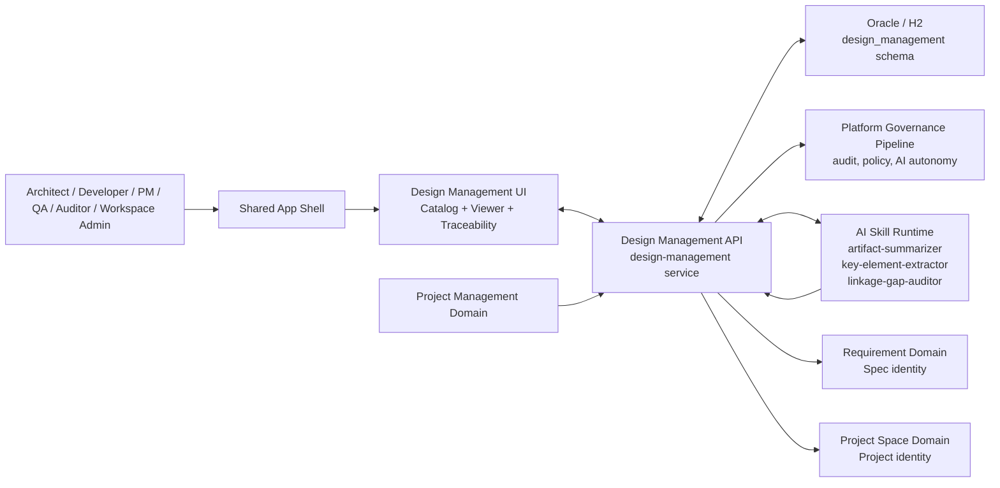
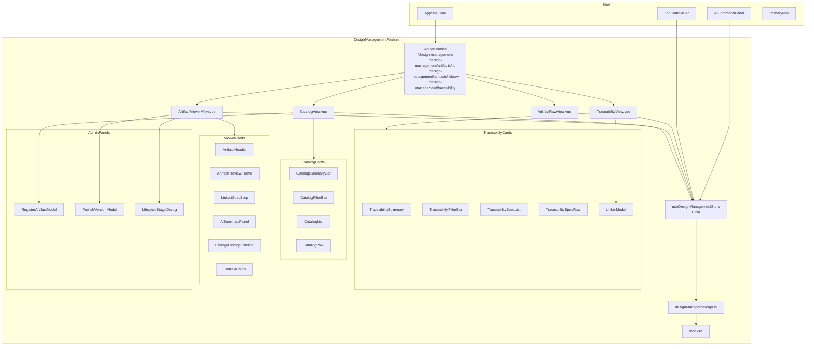
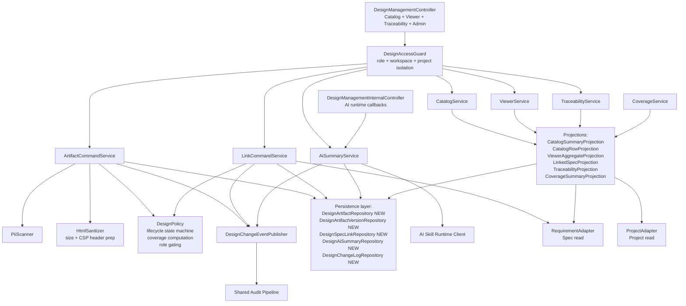
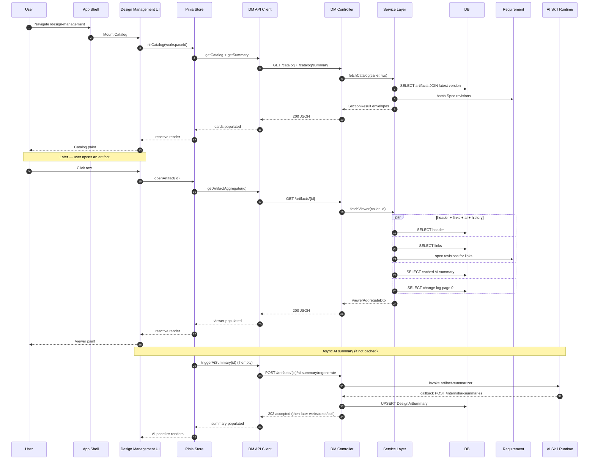

# Design Management Architecture

## Purpose

This document defines the architecture for the **Design Management** slice — the design traceability plane that spans a Catalog view (Workspace-scoped), an Artifact Viewer (artifact-scoped), and a Spec-centric Traceability view in the Agentic SDLC Control Tower.

It describes system context, component breakdown, data flow at a high level, state boundaries, integration with the shared app shell and cross-slice domains, non-functional constraints, and risks. Runtime sequences, state machines, and the ER/DTO/DDL catalog live in [design-management-data-flow.md](design-management-data-flow.md) and [design-management-data-model.md](design-management-data-model.md).

V1 is a **lightweight, read-heavy viewer** per the scope decision in [design-management-spec.md](../03-spec/design-management-spec.md) §Decisions.

## Traceability

- Requirements: [../01-requirements/design-management-requirements.md](../01-requirements/design-management-requirements.md)
- Stories: [../02-user-stories/design-management-stories.md](../02-user-stories/design-management-stories.md)
- Spec: [../03-spec/design-management-spec.md](../03-spec/design-management-spec.md)
- PRD: [../01-requirements/agentic_sdlc_control_tower_prd_v0.9.md](../01-requirements/agentic_sdlc_control_tower_prd_v0.9.md) §11.6, §13, §15, §16, §18.2

All Mermaid diagrams use Mermaid 8.x-compatible syntax per CLAUDE.md Lesson #7.

---

## 1. System Context

The Design Management page lives inside the shared app shell and interacts with the platform governance pipeline, AI skill runtime, Requirement Management (Spec identity), and Project Space (Project identity). It does not own Spec or Project identity, and it does not own Member / role / permission data. It mutates only its own entities: `DesignArtifact`, `DesignArtifactVersion`, `DesignSpecLink`, `DesignAiSummary`.



### Actors

| Actor | Interface | Notes |
|-------|-----------|-------|
| Human users | HTTPS via Shell | Role-gated; workspace isolated; audited |
| AI Skill Runtime | Async invocation + callback via internal endpoint | Writes `DesignAiSummary` records; runs captured as Skill Executions |
| Platform Governance Pipeline | Synchronous RPC from `DMAPI` | Validates autonomy level, records audit, resolves role |
| Requirement / Project Space | HTTP (intra-process Spring) | Reused for Spec and Project identity; Design Management treats their IDs as external refs |
| Project Management | HTTP (intra-process) | Consumes `GET /coverage/summary?projectId=...` for "missing design" risk chip |

---

## 2. Component Breakdown

### 2.1 Frontend — `frontend/src/features/design-management/`

Three route-level views share a common feature module, stores, API client, and a majority of primitive components. The Catalog view is Workspace-scoped; the Viewer is artifact-scoped; the Traceability view is Workspace- or Spec-scoped.



### 2.2 Backend — `backend/src/main/java/com/sdlctower/domain/designmanagement/`

Package-by-feature (CLAUDE.md Lesson #3) with sub-packages for controller / service / projection / persistence / dto / mapper / policy / event. Uses existing Requirement and Project Space services for Spec and Project identity. Introduces its own persistence for artifacts, versions, links, summaries, and the change log.



### 2.3 Responsibilities

| Component | Responsibility |
|-----------|----------------|
| `DesignManagementController` | Thin HTTP adapter; input validation; delegates to service; maps DTOs |
| `DesignManagementInternalController` | AI-runtime → backend write-back of completed summaries; service-token auth |
| `DesignAccessGuard` | Resolves caller role; enforces Workspace/Project isolation; 403 on unauthorized |
| `CatalogService` | Orchestrates catalog-row and summary projections for the Catalog view |
| `ViewerService` | Orchestrates aggregate Viewer payload (header, links, AI summary, history) |
| `TraceabilityService` | Spec-centric join between `DesignSpecLink` and Requirement's Spec index |
| `ArtifactCommandService` | Register, publish new version, change lifecycle stage — the core write path |
| `LinkCommandService` | Link / unlink Spec; idempotent per (artifactId, specId) |
| `AiSummaryService` | Orchestrates AI skill invocation, cache, regeneration, autonomy gating |
| `CoverageService` | Computes per-link coverage status at request time (REQ-DM-25) |
| `DesignPolicy` | Lifecycle state machine, coverage rules, role-gate helpers |
| `PiiScanner` | Runs regex-based PII detection on incoming payloads |
| `HtmlSanitizer` | Size enforcement; prep of response CSP headers |
| `Projections` | Read-optimized queries; return per-section DTOs wrapped in `SectionResult<T>` |
| `DesignChangeEventPublisher` | Emits domain events; audit pipeline and downstream indexes subscribe |
| `SkillClient` | Async HTTP to skill runtime; correlation-id propagation |
| `RequirementAdapter` | Reads Spec id + latest revision + state from Requirement domain |
| `ProjectAdapter` | Reads Project id + name + visibility from Project Space domain |

### 2.4 Package layout

```
com.sdlctower.domain.designmanagement
├── controller
│   ├── DesignManagementController.java
│   └── DesignManagementInternalController.java
├── service
│   ├── CatalogService.java
│   ├── ViewerService.java
│   ├── TraceabilityService.java
│   ├── ArtifactCommandService.java
│   ├── LinkCommandService.java
│   ├── AiSummaryService.java
│   └── CoverageService.java
├── projection
│   ├── CatalogSummaryProjection.java
│   ├── CatalogRowProjection.java
│   ├── ViewerAggregateProjection.java
│   ├── LinkedSpecProjection.java
│   ├── TraceabilityProjection.java
│   └── CoverageSummaryProjection.java
├── policy
│   ├── DesignAccessGuard.java
│   ├── DesignPolicy.java
│   ├── PiiScanner.java
│   └── HtmlSanitizer.java
├── persistence
│   ├── DesignArtifactEntity.java
│   ├── DesignArtifactVersionEntity.java
│   ├── DesignSpecLinkEntity.java
│   ├── DesignAiSummaryEntity.java
│   ├── DesignChangeLogEntity.java
│   └── *Repository.java
├── dto
│   └── (response/request DTOs)
├── mapper
│   └── (MapStruct mappers)
├── event
│   └── DesignChangeEventPublisher.java
└── integration
    ├── SkillClient.java
    ├── RequirementAdapter.java
    └── ProjectAdapter.java
```

---

## 3. Data Flow (High Level)

Detailed sequences live in [design-management-data-flow.md](design-management-data-flow.md). At a glance:



Detailed sequences (Phase A mocked, Phase B backend, error cascade, state machine, refresh strategy) are in the data-flow doc.

---

## 4. State Boundaries

### 4.1 Where state lives

| State | Location | Notes |
|-------|----------|-------|
| Artifact identity, versions, links, summaries, change log | Backend DB (`design_management` schema) | Source of truth |
| Coverage status (per link, per read) | Computed at request time in `CoverageService` | Not persisted |
| AI summary payload | Backend DB (`design_ai_summary` table) | Keyed by (artifact, version, skillVersion); invalidated on new version |
| Catalog row UI state (filter, sort, selection) | Pinia store (`useDesignManagementStore`) | Mirrors URL query params |
| Viewer UI state (scroll, expanded panels) | Local Vue component state | Not persisted across route changes |
| Preview iframe content | Fetched lazily from `/preview` endpoint | Never cached on the frontend |
| Current Workspace / Project context | Shell store (`useShellContextStore`) | Design Management reads only |
| Caller role and permissions | Shell auth store; re-resolved per backend call | Backend is the final authority |
| Audit trail entries | Backend audit pipeline | Design Management publishes events; platform subscribes |

### 4.2 State synchronization rules

- The URL is the source of truth for filters, sort, and route params. The Pinia store reads from and writes to the URL.
- The shell context bar's Workspace selection is authoritative; changing it resets the Catalog view.
- The Viewer's `planRevision`-equivalent is `currentVersionId`; a publish by another admin invalidates any pending admin write on the same artifact (`DM_STALE_VERSION`).
- AI summaries displayed in the UI always show the `versionId` they were generated against; if that differs from the artifact's current version, the UI shows a "Summary is for v{n}, current is v{m}" chip.

---

## 5. Integration

### 5.1 Shared app shell

- Mounts inside `AppShell.vue`; respects `context-bar → primary-nav → page-body → ai-command-panel` layout
- Registers Design Management AI actions on route activation; tears them down on deactivation (Story S13)
- Reads Workspace / Project selection from `shellContextStore`; never bypasses it
- Participates in breadcrumb pipeline per REQ-SAS-*

### 5.2 Requirement Management

- Spec identity is external; Design Management treats Spec IDs as opaque references
- Reads Spec title, latest revision, and visibility via `RequirementAdapter`
- Deep-link contract: `/requirement/specs/{specId}` (owned by Requirement) and `/design-management/traceability?specId=...` (owned by DM)

### 5.3 Project Space

- Project identity is external
- Reads Project name and visibility via `ProjectAdapter`
- Deep-link contract: artifact row Project chip → `/project-space/{projectId}`

### 5.4 Project Management

- One-way consumer relationship: Project Management may call `GET /api/v1/design-management/coverage/summary?projectId=...` for optional "missing design" enrichment
- Design Management does not call Project Management

### 5.5 AI Skill Runtime

- Async invocation: DM enqueues a skill invocation via `SkillClient.invoke(...)`; runtime calls back on `POST /internal/ai-summaries` with the completed output
- Timeouts: DM does not block the user on AI; the AI Summary panel renders skeleton → OK or skeleton → ERROR
- Governance: skill invocation checks the Workspace's AI autonomy level against the skill's declared required level

### 5.6 Platform Governance Pipeline

- Synchronous RPC from DMAPI for: role resolution, audit emission, autonomy-level checks
- DM publishes domain events (`ARTIFACT_REGISTERED`, `VERSION_PUBLISHED`, `SPEC_LINKED`, `SPEC_UNLINKED`, `LIFECYCLE_CHANGED`, `AI_SUMMARY_GENERATED`) that Platform subscribes to for the global audit index

---

## 6. Non-Functional Constraints

| Concern | Constraint | Source |
|---------|-----------|--------|
| Catalog first-paint | P95 ≤ 1,200 ms for ≤ 200 artifacts | REQ-DM-60 |
| Viewer first-paint | P95 ≤ 800 ms (excluding iframe) | REQ-DM-60 |
| Iframe render | ≤ 3 s for payloads ≤ 2 MB | REQ-DM-61 |
| Read availability | 99.5% monthly | REQ-DM-62 |
| Max artifact size | 2 MB uncompressed (hard reject on write) | REQ-DM-90 |
| Max Workspace catalog | 200 artifacts V1 design target | REQ-DM-91 |
| AI Summary cold | P95 ≤ 15 s | spec §Non-Functional |
| AI Summary cache | P95 ≤ 200 ms | spec §Non-Functional |
| CSP | Conservative; no per-artifact relaxation in V1 | REQ-DM-20 |
| PII | Hard reject on registration / version publish | REQ-DM-53 |
| Observability | CorrelationId per request; structured logs; per-surface metrics | REQ-DM-63 |

---

## 7. Security Posture

### 7.1 Sandbox

The preview endpoint serves the artifact HTML with a conservative default CSP (see spec §B7). Inline scripts are blocked by default. The only allowed external origins are `cdn.tailwindcss.com`, `fonts.googleapis.com`, `fonts.gstatic.com` — reflecting what the existing Stitch mocks under `docs/05-design/` already reference. `X-Frame-Options: SAMEORIGIN` prevents the artifact from being embedded outside the control tower origin.

The Viewer's `<iframe>` omits `allow-top-navigation` and `allow-popups-to-escape-sandbox`; it includes `allow-scripts` only (no `allow-same-origin` by default). Mocks that require same-origin behavior must be re-authored to avoid that dependency, or registered with a deprecation note.

### 7.2 PII

Registration and version publish payloads are scanned by `PiiScanner` against platform-defined regex patterns. Matches block the write with `DM_PII_DETECTED`; the response includes match offsets but no content. The payload is never logged.

### 7.3 Isolation

`DesignAccessGuard` is the only authority on access. Project-scoped readers see only artifacts whose `projectId` is in their authorized set. Cross-Workspace direct-by-id returns 403 and the artifact never appears in any list.

### 7.4 Rate limits

- `POST /links` bulk — 50 links per admin per minute (server-enforced)
- `POST /ai-summary/regenerate` — 10 regenerations per artifact per hour per admin
- `POST /artifacts` registration — 20 registrations per Workspace per hour

### 7.5 Service-to-service auth

The `/internal/ai-summaries` endpoint requires a service token provisioned to the AI Skill Runtime. The token is not interchangeable with user bearer tokens.

---

## 8. Risks and Mitigations

| Risk | Impact | Mitigation |
|------|--------|-----------|
| Embedded Stitch mock executes unexpected scripts | Medium — could break the iframe or leak data via network | Conservative default CSP; sandbox iframe; no per-artifact CSP relaxation |
| PII leaks into a registered mock | High — compliance incident | PII scanner hard-rejects on write; no sanitization, no fallback |
| Coverage status drifts silently as Specs evolve | Medium — users rely on `OK` / `STALE` signals | Coverage is computed at request time, not persisted; `STALE` surfaces automatically on next read |
| AI summary is wrong or misleading | Medium — could mislead reviewers | Summaries are always AI-attributed; "Regenerate" is one click; no apply action |
| Artifact size explosion (users register 5 MB HTML) | Medium — first-paint regression | Hard 2 MB reject on write; large artifacts get "Open in new tab" on read |
| Catalog size > 200 | Low V1 — degrades to V2 pagination | Page design budget 200; V2 introduces server-side pagination |
| External Spec (Requirement) unreachable | Medium — coverage cannot be computed | `CoverageService` returns `STALE` with a visible degraded chip; per-card ERROR envelope for the Linked-Spec strip |
| AI Skill Runtime unavailable | Low — degrades gracefully | AI panel renders ERROR envelope with retry; rest of Viewer unaffected |
| Admin writes race on the same artifact | Low | Version fencing via `prevVersionId` on `POST /versions`; link ops idempotent |

---

## 9. Decisions

- **D1:** V1 is read-heavy; narrow admin write paths only (register, publish version, link/unlink, regenerate summary, change lifecycle).
- **D2:** Stitch / internal HTML is the only artifact source in V1. No Figma, no arbitrary upload.
- **D3:** Spec → Design traceability is the primary flow.
- **D4:** AI is strictly advisory; no "apply" actions.
- **D5:** Four net-new entities (`DesignArtifact`, `DesignArtifactVersion`, `DesignSpecLink`, `DesignAiSummary`) plus a change-log entity. Everything else is reused.
- **D6:** Sandbox CSP is conservative; no per-artifact overrides.
- **D7:** Coverage is request-time computed, not persisted. This avoids a whole class of staleness bugs.
- **D8:** AI summary cache keyed by `(artifactId, versionId, skillVersion)`. New version rotates the key automatically.
- **D9:** The `/raw` route serves the artifact HTML without shell chrome but with the same auth and same CSP.

Decisions D1–D5 are locked as of 2026-04-17. D6–D9 are architecture-layer decisions that need no product sign-off.

---

## 10. Glossary

| Term | Meaning |
|------|---------|
| **Artifact** | A registered Stitch/HTML design mock (a `DesignArtifact`) |
| **Version** | An immutable snapshot of an artifact's HTML payload (a `DesignArtifactVersion`) |
| **Link** | A mapping from an artifact to a Spec with a declared coverage type (a `DesignSpecLink`) |
| **Coverage** | Computed relationship between a link's `coversRevision` and the Spec's latest revision (`OK` / `PARTIAL` / `STALE` / `MISSING`) |
| **AI Summary** | Cached AI-produced one-paragraph summary + key UI elements for an artifact version |
| **Traceability** | Spec-centric view of which designs cover which Specs |
| **Catalog** | Workspace-scoped browsable list of registered artifacts |
| **Viewer** | Per-artifact detail page with embedded sandboxed preview |
