# Design Management Data Flow

## Purpose

Runtime sequences, state machines, error cascade, and refresh strategy for the Design Management slice. This document operationalizes the architecture in [design-management-architecture.md](design-management-architecture.md) and the contracts in [../05-design/contracts/design-management-API_IMPLEMENTATION_GUIDE.md](../05-design/contracts/design-management-API_IMPLEMENTATION_GUIDE.md).

All Mermaid diagrams use Mermaid 8.x-compatible syntax.

---

## 1. Load Lifecycle

### 1.1 Catalog view — Phase A (frontend-only, mocked)

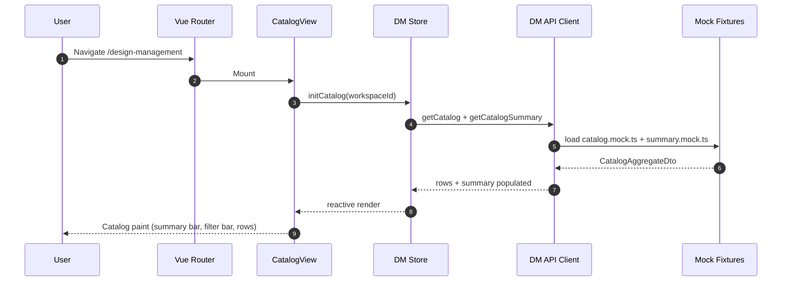

### 1.2 Catalog view — Phase B (backend integration)

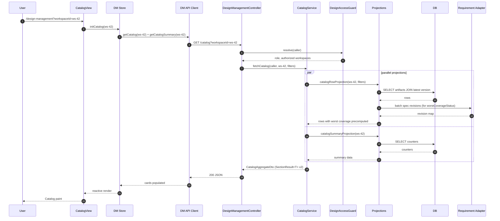

### 1.3 Viewer view — Phase B initial load

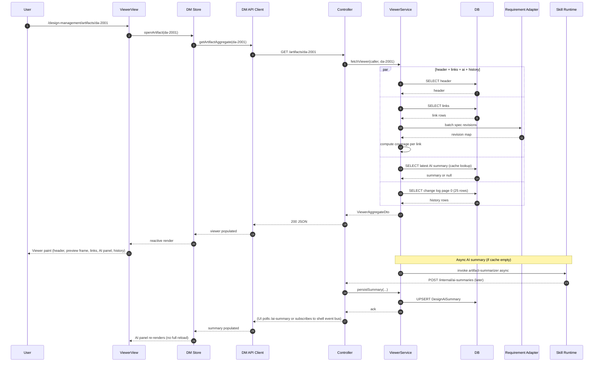

### 1.4 Preview iframe content load

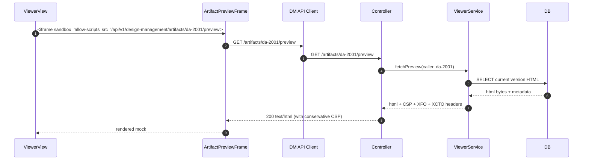

### 1.5 Traceability view — Phase B

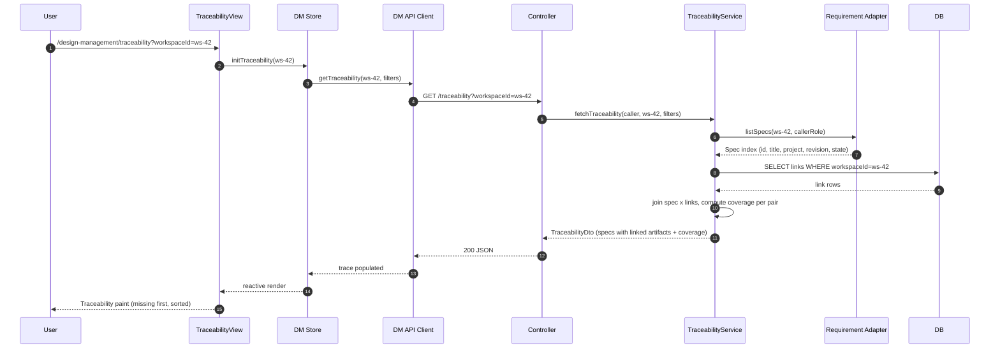

---

## 2. Admin Write Paths

### 2.1 Register a new artifact

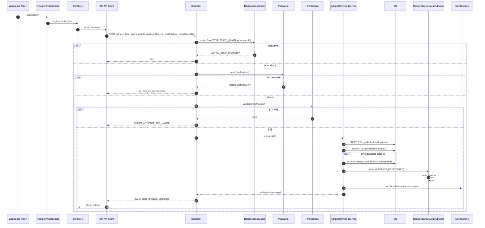

### 2.2 Publish a new version

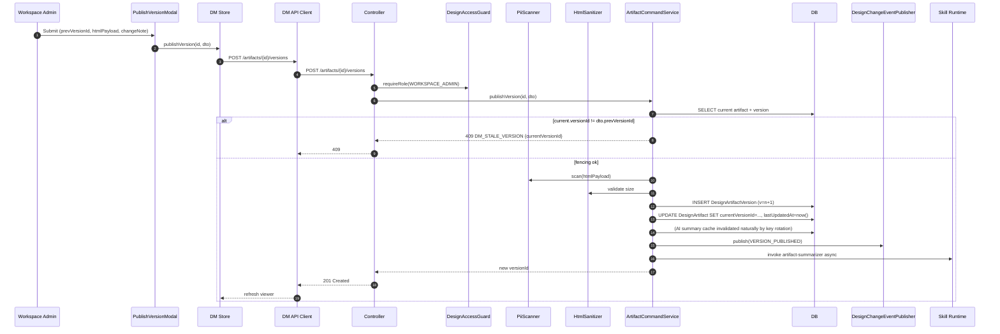

### 2.3 Link a Spec (idempotent)

```mermaid
sequenceDiagram
    autonumber
    participant Admin as Workspace Admin
    participant Modal as LinkerModal
    participant Store as DM Store
    participant Api as DM API Client
    participant BE as Controller
    participant Guard as DesignAccessGuard
    participant Cmd as LinkCommandService
    participant REQ as Requirement Adapter
    participant DB as DB
    participant Event as DesignChangeEventPublisher

    Admin->>Modal: Select specIds[]
    Modal->>Store: linkSpecs(artifactId, specIds, declaredCoverage)
    Store->>Api: POST /artifacts/{id}/links
    Api->>BE: POST /artifacts/{id}/links
    BE->>Guard: requireRole(WORKSPACE_ADMIN)
    BE->>Cmd: link(artifactId, specIds, coverage)
    Cmd->>REQ: batch specs resolve (visibility + latest revision)
    alt any spec invisible
      REQ-->>Cmd: filtered set
      Cmd-->>BE: 403 DM_SPEC_NOT_FOUND (for the forbidden subset)
    else all visible
      loop for each specId
        Cmd->>DB: SELECT existing link by (artifactId, specId)
        alt exists
          Cmd->>DB: (no-op; idempotent)
        else missing
          Cmd->>DB: INSERT DesignSpecLink {artifactId, specId, coversRevision, declaredCoverage}
          Cmd->>Event: publish(SPEC_LINKED)
        end
      end
      Cmd-->>BE: linked set
      BE-->>Api: 200 OK {links: [...]}
      Api-->>Store: refresh viewer/traceability
    end
```

### 2.4 Regenerate AI summary

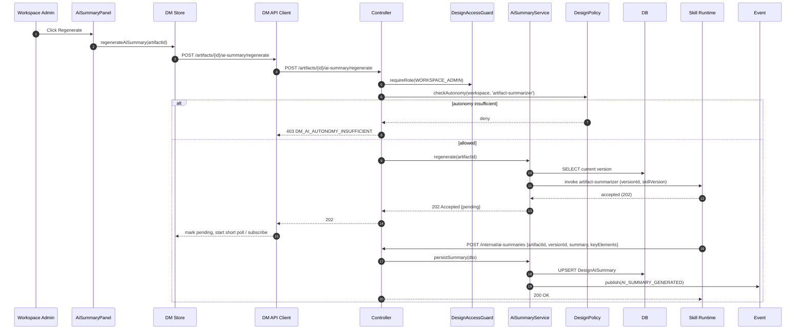

Note: In V1, the frontend uses short-interval polling (every 3s, max 5 attempts) to fetch the completed summary. A later iteration may move to a shell-owned websocket channel; Design Management does not introduce its own transport.

### 2.5 Lifecycle stage transition

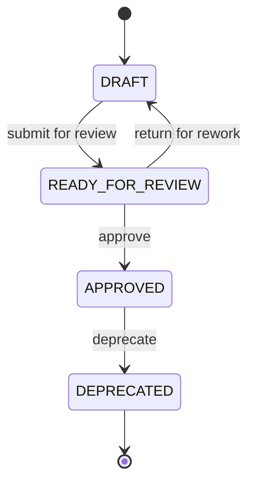

All transitions are admin-invoked, audited, and subject to `DesignPolicy.assertAllowed(from, to)`; disallowed transitions return `DM_INVALID_LIFECYCLE_TRANSITION`. V1 does not model review threads or multi-approver flows.

### 2.6 Coverage status derivation

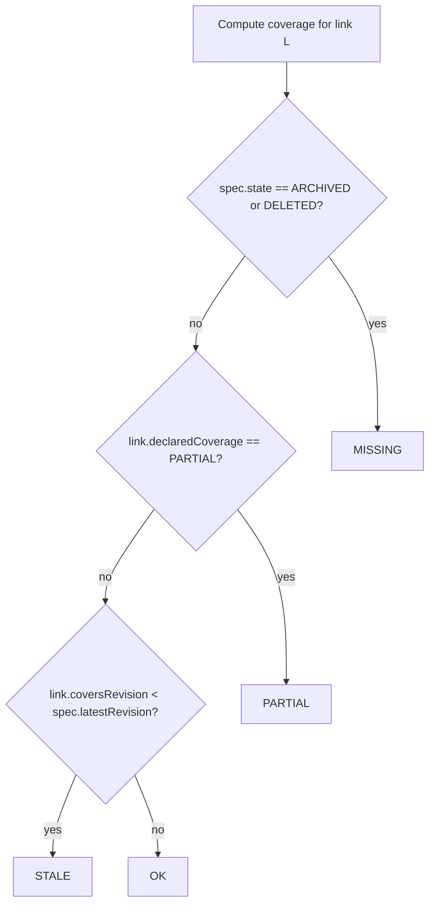

Computed at request time inside `CoverageService`; never persisted. The Requirement adapter batches Spec lookups so a page with N links costs one batch call, not N.

---

## 3. Error Cascade & Isolation

### 3.1 Per-card error isolation

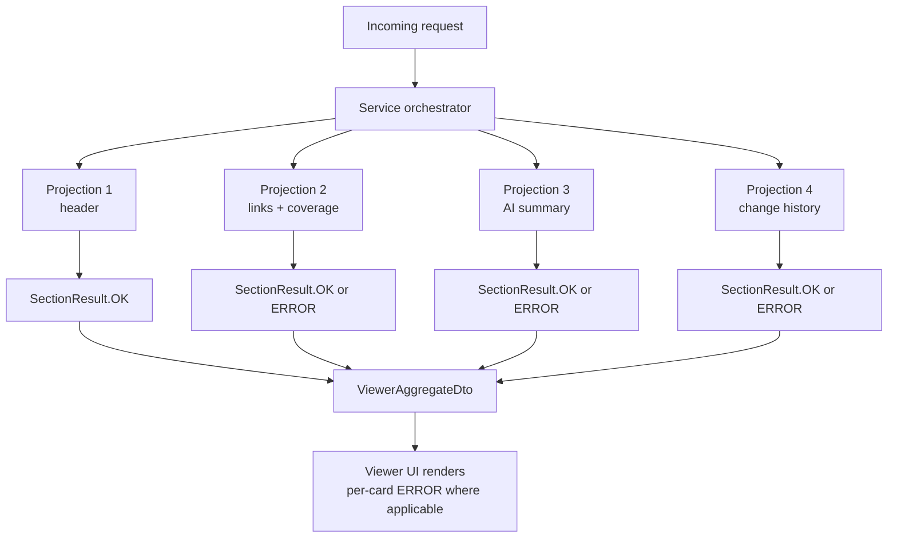

A failure in any one projection is captured as a `SectionResult.ERROR` with a `correlationId`. The HTTP response is still `200` overall unless ALL sections fail (in which case the controller returns `500` with a top-level error). The UI renders each card independently.

### 3.2 AI failure cascade

- Skill runtime timeout → `SectionResult.ERROR` on the AI Summary section only; retry button visible; rest of Viewer unaffected
- Autonomy gating denial → `SectionResult.OK` with `advisoryOnly=true` and no action buttons
- Cache hit stale (artifact published a new version but summary is still v{n-1}) → UI shows "Summary is for v{n-1}, current is v{n}" chip; background regeneration kicks off if admin opens the panel

### 3.3 Requirement unavailable

If the Requirement adapter times out:

- Catalog's `worstCoverageStatus` rendered as `UNKNOWN` with a neutral chip (not crimson); no cards fail
- Viewer's Linked-Spec strip renders each chip's coverage as `UNKNOWN`; tooltip explains "Spec revision unavailable"
- Traceability view renders `SectionResult.ERROR` for the section since the Spec index cannot be computed

### 3.4 Database unavailable

Whole-page failure mode. Controller returns `503 DM_DB_UNAVAILABLE`. The UI shows the shared shell's outage banner. No DM-specific handling.

---

## 4. Refresh Strategy

| Trigger | Affected cards | Mechanism |
|---------|----------------|-----------|
| User changes Workspace in shell context bar | Catalog (all), Traceability | Store subscribes to `shellContextStore.workspaceId`; re-inits on change |
| User changes filter | Catalog rows | URL query update → store re-fetch of rows projection only (summary unchanged) |
| User clicks retry in an ERROR card | That card only | Store exposes `refreshCard(key)` that re-issues the single projection |
| Admin registers new artifact | Catalog rows + summary | Optimistic insert; then real refresh |
| Admin publishes new version | Viewer header, preview, AI summary panel (pending), change history | Store exposes `refreshViewer(artifactId)` after the write succeeds |
| Admin links / unlinks Spec | Viewer Linked-Spec strip, Traceability row for affected Spec | Store refreshes both surfaces if user is on them |
| AI summary callback | AI Summary panel | Poll (V1) or shell event bus (future); store updates summary for that `(artifactId, versionId)` |
| User leaves Viewer | Everything viewer-specific | Store clears viewer cache for that artifact to avoid stale read on next open |

### 4.1 Polling window for AI summary

When an admin triggers regeneration, the frontend polls `GET /artifacts/{id}/ai-summary` at 3-second intervals, max 5 attempts (15s budget). If still pending after 5 attempts, the panel renders a "Summary still generating — check back soon" state with a manual refresh button. The polling is scoped to the Viewer route; navigating away cancels it.

### 4.2 Catalog refresh debouncing

Filter changes debounce at 200 ms before triggering a fetch. Text search debounces at 300 ms. The summary bar projection is NOT re-fetched on filter change — only the rows projection.

---

## 5. Phase A → Phase B Migration

### 5.1 Mock toggle

The frontend runs in Phase A (mocked) by default in development; Phase B (live backend) is enabled via `VITE_USE_BACKEND=true`. The API client switches between mock fixtures and real `fetchJson<T>` calls at module boundary; no call-site changes are needed.

### 5.2 Compatibility guarantees

- Mock fixtures must return the same DTO shape as the real backend
- `SectionResult<T>` envelope is preserved even in mocks
- Mock mutations simulate `DM_STALE_VERSION` (5% injection rate) so the UI stale-token handling is testable in Phase A
- Mock PII detection is simulated via a fixed trigger string (`__PII_TRIGGER__`) so admins can test the PII rejection flow

### 5.3 Contract validation

Integration tests in Phase B assert DTO compatibility with Phase A mocks using a shared TypeScript type declaration. Drift between mock and live is a P1 defect.

---

## 6. Observability

### 6.1 Correlation ID propagation

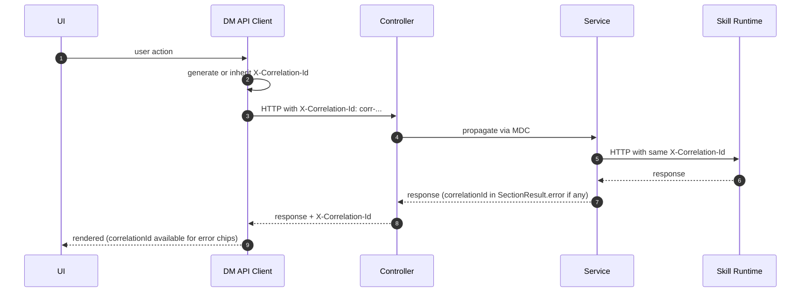

### 6.2 Metrics

| Metric | Surface | Purpose |
|--------|---------|---------|
| `design_management.catalog.first_paint_ms` | Frontend | P95 dashboard |
| `design_management.viewer.first_paint_ms` | Frontend | P95 dashboard |
| `design_management.ai_summary.cache_hit_rate` | Backend | Cache effectiveness |
| `design_management.ai_summary.cold_duration_ms` | Backend | P95 dashboard |
| `design_management.{endpoint}.error_rate` | Backend | Error tracking |
| `design_management.pii_rejections` | Backend | Compliance counter |
| `design_management.stale_version_rejections` | Backend | Concurrency signal |

### 6.3 Log redaction

HTML payloads are NEVER logged. Only size (bytes), hash (sha256), and versionTag are logged. PII match offsets are logged but match content is not.

---

## 7. Summary

- Reads: Catalog, Viewer, Traceability assemble parallel projections into per-section `SectionResult<T>`; partial failures isolate per card.
- Writes: admin-only, narrow, audited; version writes use `prevVersionId` fencing; link writes are idempotent.
- Coverage: computed at request time, never persisted; Requirement adapter batches Spec lookups.
- AI: async via Skill Runtime; cached by `(artifactId, versionId, skillVersion)`; regenerate rotates cache; polling 3s × 5.
- Sandbox: conservative CSP on preview; no per-artifact relaxation; size-cap 2 MB hard-reject on write.
- State lives in backend DB; frontend mirrors URL and shell context; local UI state never outlives the route.
