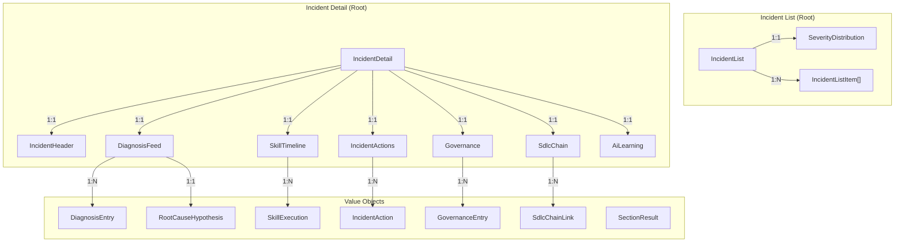

# Incident Data Model

## Purpose

This document defines the domain and persistent data model for the Incident Management
page — covering frontend types, backend DTOs, and the database schema.

## Traceability

- Architecture: [incident-architecture.md](incident-architecture.md)
- Design: [incident-design.md](../05-design/incident-design.md)
- Spec: [incident-spec.md](../03-spec/incident-spec.md)
- Types source: `frontend/src/features/incident/types/incident.ts`

---

## 1. Domain Model Overview



---

## 2. Frontend Type Model

All types are defined in `frontend/src/features/incident/types/incident.ts`.
All interfaces use `readonly` properties for immutability.

### 2.1 Envelope Types

| Type | Purpose | Fields |
|------|---------|--------|
| `SectionResult<T>` | Per-section error isolation | `data: T \| null`, `error: string \| null` |

### 2.2 Enums / Union Types

| Type | Values |
|------|--------|
| `Priority` | `'P1' \| 'P2' \| 'P3' \| 'P4'` |
| `IncidentStatus` | `'DETECTED' \| 'AI_INVESTIGATING' \| 'AI_DIAGNOSED' \| 'ACTION_PROPOSED' \| 'PENDING_APPROVAL' \| 'EXECUTING' \| 'RESOLVED' \| 'LEARNING' \| 'CLOSED' \| 'ESCALATED' \| 'MANUAL_OVERRIDE'` |
| `HandlerType` | `'AI' \| 'Human' \| 'Hybrid'` |
| `ControlMode` | `'Auto' \| 'Approval' \| 'Manual'` |
| `AutonomyLevel` | `'Level1_Manual' \| 'Level2_SuggestApprove' \| 'Level3_AutoAudit'` |
| `DiagnosisEntryType` | `'analysis' \| 'finding' \| 'suggestion' \| 'conclusion'` |
| `SkillExecutionStatus` | `'running' \| 'completed' \| 'failed' \| 'pending_approval'` |
| `ActionType` | `'automated' \| 'requires_approval'` |
| `ActionExecutionStatus` | `'pending' \| 'approved' \| 'rejected' \| 'executing' \| 'executed' \| 'rolled_back'` |
| `GovernanceActionType` | `'approve' \| 'reject' \| 'escalate' \| 'override'` |
| `ConfidenceLevel` | `'High' \| 'Medium' \| 'Low'` |
| `SdlcArtifactType` | `'requirement' \| 'spec' \| 'design' \| 'code' \| 'test' \| 'deploy'` |
| `SortField` | `'priority' \| 'status' \| 'detectedAt' \| 'duration'` |

### 2.3 Incident List Types

| Type | Purpose | Key Fields |
|------|---------|------------|
| `SeverityDistribution` | Count by priority | `p1: number`, `p2: number`, `p3: number`, `p4: number` |
| `IncidentListItem` | Single row in list | `id`, `title`, `priority`, `status`, `handlerType`, `controlMode`, `detectedAt`, `duration` |
| `IncidentFilters` | Filter state | `priority?`, `status?`, `handlerType?`, `dateFrom?`, `dateTo?`, `showResolved: boolean` |

### 2.4 Incident Detail Types

| Type | Purpose | Key Fields |
|------|---------|------------|
| `IncidentHeader` | Header data | `id`, `title`, `priority`, `status`, `handlerType`, `controlMode`, `autonomyLevel`, `detectedAt`, `acknowledgedAt?`, `resolvedAt?`, `duration` |
| `DiagnosisFeed` | AI diagnosis section | `entries: DiagnosisEntry[]`, `rootCause: RootCauseHypothesis \| null`, `affectedComponents: string[]` |
| `DiagnosisEntry` | Single feed entry | `timestamp`, `text`, `entryType` |
| `RootCauseHypothesis` | Root cause with confidence | `hypothesis`, `confidence` |
| `SkillTimeline` | Skill execution list | `executions: SkillExecution[]` |
| `SkillExecution` | Single skill record | `skillName`, `startTime`, `endTime?`, `status`, `inputSummary`, `outputSummary` |
| `IncidentActions` | Actions section | `actions: IncidentAction[]` |
| `IncidentAction` | Single action | `id`, `description`, `actionType`, `executionStatus`, `timestamp`, `impactAssessment`, `isRollbackable`, `policyRef?` |
| `Governance` | Governance section | `entries: GovernanceEntry[]` |
| `GovernanceEntry` | Single governance record | `actor`, `timestamp`, `actionTaken`, `reason`, `policyRef?` |
| `SdlcChain` | SDLC traceability | `links: SdlcChainLink[]` |
| `SdlcChainLink` | Single chain link | `artifactType`, `artifactId`, `artifactTitle`, `routePath` |
| `AiLearning` | Post-resolution learning | `rootCause`, `patternIdentified`, `preventionRecommendations: string[]`, `knowledgeBaseEntryCreated: boolean` |

### 2.5 Aggregate Types

| Type | Purpose | Key Fields |
|------|---------|------------|
| `IncidentList` | List API response payload | `severityDistribution`, `incidents: IncidentListItem[]` |
| `IncidentDetail` | Detail API response payload | `header: SectionResult<IncidentHeader>`, `diagnosis: SectionResult<DiagnosisFeed>`, `skillTimeline: SectionResult<SkillTimeline>`, `actions: SectionResult<IncidentActions>`, `governance: SectionResult<Governance>`, `sdlcChain: SectionResult<SdlcChain>`, `learning: SectionResult<AiLearning>` |

---

## 3. Backend DTO Model

All DTOs are Java records (immutable). Field names use camelCase matching frontend types exactly.

### 3.1 List DTOs

| DTO | Java Record Fields |
|-----|-------------------|
| `IncidentListDto` | `SeverityDistributionDto severityDistribution`, `List<IncidentListItemDto> incidents` |
| `IncidentListItemDto` | `String id`, `String title`, `String priority`, `String status`, `String handlerType`, `String controlMode`, `String detectedAt`, `String duration` |
| `SeverityDistributionDto` | `int p1`, `int p2`, `int p3`, `int p4` |

### 3.2 Detail DTOs

| DTO | Java Record Fields |
|-----|-------------------|
| `IncidentDetailDto` | 7 × `SectionResultDto<*>` fields (one per card) |
| `IncidentHeaderDto` | `String id`, `String title`, `String priority`, `String status`, `String handlerType`, `String controlMode`, `String autonomyLevel`, `String detectedAt`, `String acknowledgedAt`, `String resolvedAt`, `String duration` |
| `DiagnosisFeedDto` | `List<DiagnosisEntryDto> entries`, `RootCauseHypothesisDto rootCause`, `List<String> affectedComponents` |
| `DiagnosisEntryDto` | `String timestamp`, `String text`, `String entryType` |
| `RootCauseHypothesisDto` | `String hypothesis`, `String confidence` |
| `SkillTimelineDto` | `List<SkillExecutionDto> executions` |
| `SkillExecutionDto` | `String skillName`, `String startTime`, `String endTime`, `String status`, `String inputSummary`, `String outputSummary` |
| `IncidentActionsDto` | `List<IncidentActionDto> actions` |
| `IncidentActionDto` | `String id`, `String description`, `String actionType`, `String executionStatus`, `String timestamp`, `String impactAssessment`, `boolean isRollbackable`, `String policyRef` |
| `GovernanceDto` | `List<GovernanceEntryDto> entries` |
| `GovernanceEntryDto` | `String actor`, `String timestamp`, `String actionTaken`, `String reason`, `String policyRef` |
| `SdlcChainDto` | `List<SdlcChainLinkDto> links` |
| `SdlcChainLinkDto` | `String artifactType`, `String artifactId`, `String artifactTitle`, `String routePath` |
| `AiLearningDto` | `String rootCause`, `String patternIdentified`, `List<String> preventionRecommendations`, `boolean knowledgeBaseEntryCreated` |
| `ActionApprovalRequestDto` | `String reason` (used for reject only) |

---

## 4. State Models

### 4.1 Incident Status State Machine

```
                    ┌────────────────────────────────────────���──────┐
                    │                                               │
  [*] ──► DETECTED ──► AI_INVESTIGATING ──► AI_DIAGNOSED           │
                         │                    │                     │
                         │ (cannot diagnose)  │ (human takes over)  │
                         ▼                    ▼                     │
                      ESCALATED ◄─────────────┘                    │
                         ��                                          │
                         ▼                                          │
                      RESOLVED ◄──── MANUAL_OVERRIDE ◄─┐           │
                         │                              │           │
                         ▼              AI_DIAGNOSED ──►│           │
                      LEARNING          ACTION_PROPOSED │           │
                         │                   │          │           │
                         ▼            PENDING_APPROVAL ─┘           │
                       CLOSED              │                        │
                                    (approved)                      │
                                           ▼                        │
                                       EXECUTING ──► RESOLVED ──────┘
```

Valid transitions:

| From | To | Trigger |
|------|----|---------|
| DETECTED | AI_INVESTIGATING | Detection skill starts |
| AI_INVESTIGATING | AI_DIAGNOSED | Diagnosis skill completes |
| AI_INVESTIGATING | ESCALATED | AI cannot diagnose |
| AI_DIAGNOSED | ACTION_PROPOSED | Remediation skill proposes actions |
| AI_DIAGNOSED | ESCALATED | Human takes over |
| ACTION_PROPOSED | PENDING_APPROVAL | Action requires human approval |
| PENDING_APPROVAL | EXECUTING | Human approves |
| PENDING_APPROVAL | ACTION_PROPOSED | Human rejects (new action) |
| PENDING_APPROVAL | MANUAL_OVERRIDE | Human overrides |
| EXECUTING | RESOLVED | Action completes |
| ESCALATED | RESOLVED | Human resolves |
| MANUAL_OVERRIDE | RESOLVED | Human resolves |
| RESOLVED | LEARNING | Learning skill starts |
| LEARNING | CLOSED | Learning captured |

### 4.2 Action Execution Status

| From | To | Trigger |
|------|----|---------|
| PENDING | APPROVED | Human approves |
| PENDING | REJECTED | Human rejects |
| APPROVED | EXECUTING | System begins execution |
| EXECUTING | EXECUTED | Action completes |
| EXECUTING | ROLLED_BACK | Action rolled back |

---

## 5. Database Schema (Flyway Migration V4)

Phase A seeds mock data. Phase B adds real tables.

### 5.1 Conceptual Entity-Column Schema

These are logical types — vendor-specific DDL is deferred to Phase B Flyway migrations.

**incident**

| Column | Type | Nullable | Description |
|--------|------|----------|-------------|
| id | String(16) | No | PK, e.g. INC-0422 |
| title | String(255) | No | Incident summary |
| priority | String(2) | No | P1, P2, P3, P4 |
| status | String(30) | No | State machine value |
| handler_type | String(10) | No | AI, Human, Hybrid |
| control_mode | String(10) | No | Auto, Approval, Manual |
| autonomy_level | String(30) | No | Level1_Manual, etc. |
| detected_at | Timestamp | No | When first detected |
| acknowledged_at | Timestamp | Yes | When acknowledged |
| resolved_at | Timestamp | Yes | When resolved |
| workspace_id | String(36) | No | FK to workspace |

**incident_diagnosis_entry**

| Column | Type | Nullable | Description |
|--------|------|----------|-------------|
| id | Long | No | PK auto-increment |
| incident_id | String(16) | No | FK to incident |
| timestamp | String(12) | No | Display time, e.g. 09:41:02 |
| text | String(1000) | No | Feed entry text |
| entry_type | String(12) | No | analysis, finding, suggestion, conclusion |

**incident_skill_execution**

| Column | Type | Nullable | Description |
|--------|------|----------|-------------|
| id | Long | No | PK auto-increment |
| incident_id | String(16) | No | FK to incident |
| skill_name | String(50) | No | e.g. incident-diagnosis |
| start_time | Timestamp | No | Execution start |
| end_time | Timestamp | Yes | Execution end (null if running) |
| status | String(20) | No | running, completed, failed, pending_approval |
| input_summary | String(500) | Yes | Brief input description |
| output_summary | String(500) | Yes | Brief output description |

**incident_action**

| Column | Type | Nullable | Description |
|--------|------|----------|-------------|
| id | String(16) | No | PK, e.g. ACT-001 |
| incident_id | String(16) | No | FK to incident |
| description | String(500) | No | Action description |
| action_type | String(20) | No | automated, requires_approval |
| execution_status | String(20) | No | pending, approved, rejected, executing, executed, rolled_back |
| timestamp | Timestamp | No | When proposed |
| impact_assessment | String(500) | Yes | Impact description |
| is_rollbackable | Boolean | No | Can be rolled back |
| policy_ref | String(255) | Yes | Policy that triggered approval |

**incident_governance_entry**

| Column | Type | Nullable | Description |
|--------|------|----------|-------------|
| id | Long | No | PK auto-increment |
| incident_id | String(16) | No | FK to incident |
| actor | String(100) | No | Who acted |
| timestamp | Timestamp | No | When acted |
| action_taken | String(10) | No | approve, reject, escalate, override |
| reason | String(500) | Yes | Reason (required for reject) |
| policy_ref | String(255) | Yes | Related policy |

**incident_sdlc_chain_link**

| Column | Type | Nullable | Description |
|--------|------|----------|-------------|
| id | Long | No | PK auto-increment |
| incident_id | String(16) | No | FK to incident |
| artifact_type | String(20) | No | requirement, spec, design, code, test, deploy |
| artifact_id | String(36) | No | ID of linked artifact |
| artifact_title | String(255) | No | Display title |
| route_path | String(100) | No | Frontend navigation path |

**incident_ai_learning**

| Column | Type | Nullable | Description |
|--------|------|----------|-------------|
| id | Long | No | PK auto-increment |
| incident_id | String(16) | No | FK to incident (unique) |
| root_cause | String(1000) | No | Confirmed root cause |
| pattern_identified | String(500) | No | Pattern description |
| prevention_recommendations | CLOB/JSON | No | JSON array of strings |
| kb_entry_created | Boolean | No | Knowledge base entry created |

### 5.2 V4 Seed Data Structure

The V4 migration seeds realistic incident data matching the frontend mock data:

- 3–5 incidents with varying priorities, statuses, and handler types
- Diagnosis feed entries per incident (5–10 entries)
- Skill executions per incident (2–5 per incident)
- Actions per incident (1–3 per incident, mix of pending/approved/executed)
- Governance entries per incident (0–3 per incident)
- SDLC chain links per incident (2–4 per incident)
- AI learning data for resolved incidents

---

## 6. Frontend ↔ Backend Type Mapping

| Frontend Type (TypeScript) | Backend DTO (Java Record) | JSON Key |
|---|---|---|
| `IncidentList` | `IncidentListDto` | top-level data |
| `IncidentListItem` | `IncidentListItemDto` | incidents[] |
| `SeverityDistribution` | `SeverityDistributionDto` | severityDistribution |
| `IncidentDetail` | `IncidentDetailDto` | top-level data |
| `IncidentHeader` | `IncidentHeaderDto` | header.data |
| `DiagnosisFeed` | `DiagnosisFeedDto` | diagnosis.data |
| `DiagnosisEntry` | `DiagnosisEntryDto` | diagnosis.data.entries[] |
| `RootCauseHypothesis` | `RootCauseHypothesisDto` | diagnosis.data.rootCause |
| `SkillTimeline` | `SkillTimelineDto` | skillTimeline.data |
| `SkillExecution` | `SkillExecutionDto` | skillTimeline.data.executions[] |
| `IncidentActions` | `IncidentActionsDto` | actions.data |
| `IncidentAction` | `IncidentActionDto` | actions.data.actions[] |
| `Governance` | `GovernanceDto` | governance.data |
| `GovernanceEntry` | `GovernanceEntryDto` | governance.data.entries[] |
| `SdlcChain` | `SdlcChainDto` | sdlcChain.data |
| `SdlcChainLink` | `SdlcChainLinkDto` | sdlcChain.data.links[] |
| `AiLearning` | `AiLearningDto` | learning.data |
| `SectionResult<T>` | `SectionResultDto<T>` | all section wrappers |
