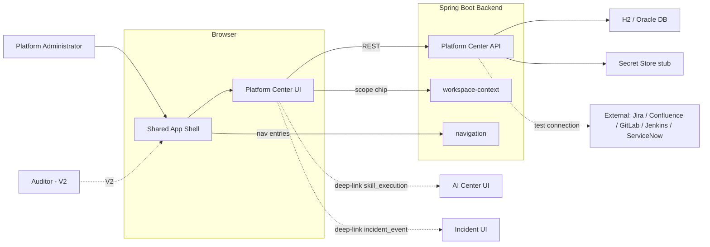
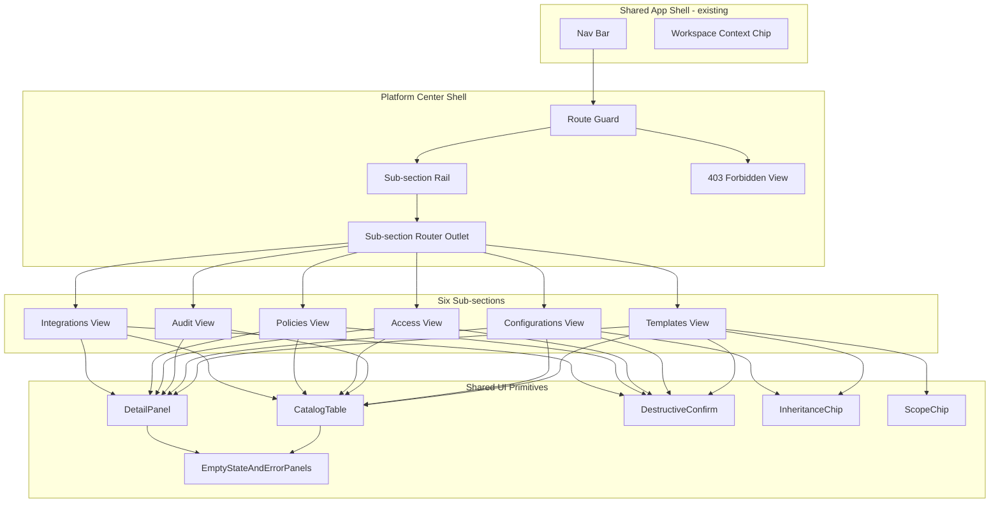
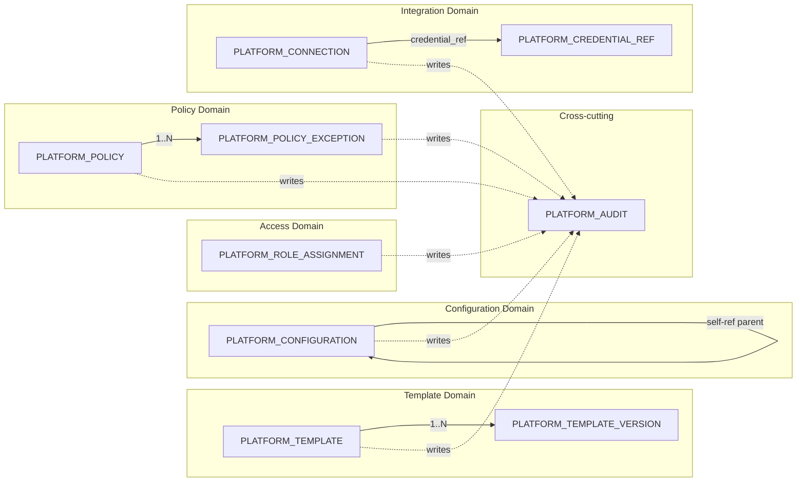
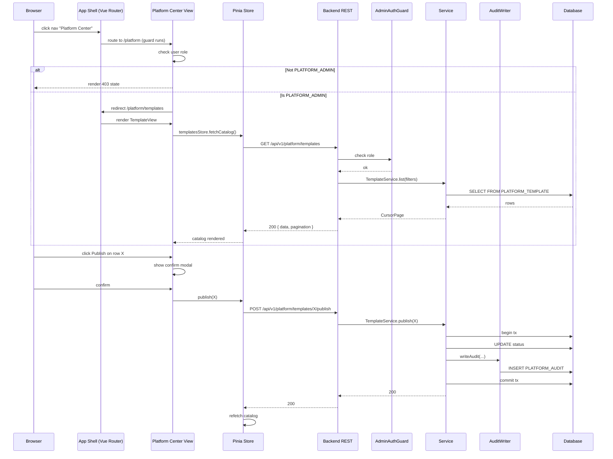

# Platform Center Architecture

## Overview

This document describes the architecture of the **Platform Center** slice — the privileged admin surface that houses the six platform capabilities defined in PRD §12.1–§12.6. It covers system context, component breakdown, data flow, state boundaries, and integration boundaries. All diagrams use Mermaid 8.x-compatible syntax.

## Source

- [platform-center-spec.md](../03-spec/platform-center-spec.md)
- [platform-center-requirements.md](../01-requirements/platform-center-requirements.md)
- [platform-center-stories.md](../02-user-stories/platform-center-stories.md)

## Architectural Drivers

| Driver | Implication |
|--------|------------|
| Platform Center must hold **six distinct but related capabilities** | Six parallel sub-modules that share the app shell, nav rail, and audit layer; each sub-module owns its own store, service, and tables |
| All mutations must be **audited atomically** (REQ-PC-86) | Audit write is synchronous and in-transaction; audit repository is a shared dependency of all six mutation services |
| Single V1 role (`PLATFORM_ADMIN`) | Permission gate is a single route-level guard + controller-level annotation; no per-capability role matrix in V1 |
| **Read-heavy + rare mutations** | Catalog list endpoints optimized for pagination and simple filters; mutations use optimistic concurrency where needed |
| **Platform-scoped + workspace-scoped** records coexist | Entities carry `scope_type` + `scope_id` pair; queries resolve scope explicitly |
| Credentials must never leak | Connection entity stores only `credential_ref`; a secret-store stub handles resolution server-side |
| Package-by-feature backend (CLAUDE.md Lesson #3) | Sub-packages under `com.sdlctower.platform.{template,configuration,audit,access,policy,integration}` |

---

## System Context

Platform Center is a client of the shared app shell (for nav and workspace context) and a peer of other domain UIs (AI Center, Incident) through deep-links. Its backend is a self-contained module that reads/writes its own tables plus optionally performs outbound calls to external systems during connection tests.

---

## Layer Summary

| Layer | Responsibility | Primary artifacts |
|-------|----------------|-------------------|
| UI — Page shell | Sub-section rail, route-guard, 403 screen | `frontend/src/features/platform/shell/` |
| UI — Sub-sections | Per-capability views (catalog + detail + forms) | `frontend/src/features/platform/{templates,configurations,audit,access,policies,integrations}/` |
| UI — Shared primitives | Catalog table, detail side-panel, destructive-confirm modal, inheritance chip | `frontend/src/features/platform/shared/` |
| UI — State | Pinia stores (one per sub-section) + API clients | `frontend/src/features/platform/{sub}/store.ts` and `...api.ts` |
| API — Controller | Spring `@RestController` per capability | `backend/.../platform/{template,configuration,audit,access,policy,integration}/` |
| API — Service | Business rules, permission checks, audit writes | same packages |
| API — Repository | Spring Data JPA repositories | same packages |
| API — Shared | Audit writer, scope resolver, permission guard | `backend/.../platform/shared/` (NEW for this slice) |
| Data | Per-capability tables + shared `PLATFORM_AUDIT` | Flyway migrations V40+ |
| Integration | Outbound adapter test calls, secret-store resolution | `backend/.../platform/integration/adapter/` |

---

## Component Breakdown

### Frontend components

### Backend components

```mermaid
graph TB
    subgraph HTTPLayer[HTTP Controllers]
        TC[TemplateController]
        CC[ConfigurationController]
        AC[AuditController]
        XC[AccessController]
        PC[PolicyController]
        IC[IntegrationController]
    end

    subgraph ServiceLayer[Services]
        TS[TemplateService]
        CS[ConfigurationService]
        ACS[AuditQueryService]
        XS[AccessService]
        PS[PolicyService]
        ISV[IntegrationService]
        ADT[AdapterTester]
    end

    subgraph SharedPlatform[Platform Shared]
        AW[AuditWriter]
        AG[AdminAuthGuard]
        SR[ScopeResolver]
        IR[InheritanceResolver]
        SS[SecretStoreStub]
    end

    subgraph Repos[JPA Repositories]
        TR[TemplateRepo]
        TVR[TemplateVersionRepo]
        CR[ConfigurationRepo]
        AR[AuditRepo]
        XR[RoleAssignmentRepo]
        PR[PolicyRepo]
        PER[PolicyExceptionRepo]
        IR2[ConnectionRepo]
    end

    DB[Database]

    TC --> TS
    CC --> CS
    AC --> ACS
    XC --> XS
    PC --> PS
    IC --> ISV

    TS --> TR
    TS --> TVR
    TS --> IR
    TS --> AW
    CS --> CR
    CS --> AW
    ACS --> AR
    XS --> XR
    XS --> AW
    PS --> PR
    PS --> PER
    PS --> AW
    ISV --> IR2
    ISV --> SS
    ISV --> ADT
    ISV --> AW

    TC --> AG
    CC --> AG
    AC --> AG
    XC --> AG
    PC --> AG
    IC --> AG

    IR --> SR

    TR --> DB
    TVR --> DB
    CR --> DB
    AR --> DB
    XR --> DB
    PR --> DB
    PER --> DB
    IR2 --> DB
```

Key design points:

- **`AuditWriter` is a shared bean** injected into every mutation service. It writes a single `PLATFORM_AUDIT` row inside the caller's transaction. It never starts its own transaction.
- **`AdminAuthGuard`** is a single Spring `HandlerInterceptor` (or method-level annotation `@RequireRole(PLATFORM_ADMIN)`) registered for every Platform Center controller path.
- **`InheritanceResolver`** walks the four-layer chain (platform → application → snow-group → project) for a given template or configuration and emits the resolved record with per-field provenance.
- **`ScopeResolver`** parses and validates scope query params (`scopeType:scopeId`).
- **`AdapterTester`** is a strategy pattern with implementations per adapter (`JiraAdapterTester`, `ConfluenceAdapterTester`, `GitlabAdapterTester`, etc.); V1 implementations can return canned success/failure for non-prod adapter kinds to keep the slice self-contained.
- **`SecretStoreStub`** is an in-memory map of `credentialRef → credentialValue` backed by a `PLATFORM_CREDENTIAL_REF` lookup table; production wiring to an external secret store is a future concern.

---

## Data Architecture

Platform Center introduces nine new tables in the `platform_center` schema space (actual tables created in the default schema, prefixed `PLATFORM_`):

- `PLATFORM_TEMPLATE`
- `PLATFORM_TEMPLATE_VERSION`
- `PLATFORM_CONFIGURATION`
- `PLATFORM_AUDIT`
- `PLATFORM_ROLE_ASSIGNMENT`
- `PLATFORM_POLICY`
- `PLATFORM_POLICY_EXCEPTION`
- `PLATFORM_CONNECTION`
- `PLATFORM_CREDENTIAL_REF`

Concrete DDL lives in [platform-center-data-model.md](platform-center-data-model.md).

### Data-architecture diagram

### State boundaries

| State location | Owner | Lifetime |
|----------------|-------|----------|
| Active workspace context chip | Shared app shell Pinia store | Session |
| Sub-section catalog filters (URL query) | Vue Router URL | Page |
| Catalog list data | Per-sub-section Pinia store | Page (invalidate on mutation) |
| Detail panel selection | Per-sub-section Pinia store | Page |
| Destructive-confirm dialog visibility | Local component ref | Component |
| Audit log (server-side) | `PLATFORM_AUDIT` table | Persistent (365+ days) |
| Secret values | Secret store (never client) | Persistent, server-only |

Platform Center does **not** introduce a global megastore. Each sub-section has its own Pinia store. The shared app shell's `useWorkspaceContextStore()` is consumed read-only.

---

## Integration Architecture

### Inbound integration (consumers of Platform Center)

| Consumer | How it consumes | Coupling |
|----------|-----------------|----------|
| `shared-app-shell` | Reads `permission_change` audit events passively; enforces role-based nav filtering via `RoleAssignment` records (future) | Loose — shared DB |
| `dashboard` | Reads metric templates for rendering via `GET /api/v1/platform/templates?kind=metric` | Loose — REST |
| `ai-center` | Reads `Policy` records of category `autonomy`; writes `skill_execution` audit events via `AuditWriter` (shared bean) | Tight on audit write, loose on policy read |
| Domain slices (`requirement`, `project-management`, etc.) | Read `Configuration` for their page / field kinds; read `Template` for flows | Loose — REST |

### Outbound integration (Platform Center → external)

| External | Trigger | Mode | V1 behavior |
|----------|---------|------|-------------|
| Jira / Confluence / GitLab / Jenkins / ServiceNow | Test-connection button | Synchronous HTTP | V1 returns canned `ok: true` for non-prod; real calls wired in sync-worker slice |
| Secret store | Every time an adapter needs credentials | In-process lookup | V1 uses the in-memory `SecretStoreStub`; production wiring deferred |

### Nav entry and routing

Platform Center's nav entry is already seeded in the backend navigation service with `{ key: "platform", label: "Platform Center", path: "/platform", comingSoon: false }`. The frontend feature directory is already reserved as `frontend/src/features/platform/` (empty placeholder). This slice populates it.

---

## Workflow — Runtime Flow

---

## API Boundaries

All endpoints live under `/api/v1/platform/*`. Full request/response contracts are in [platform-center-API_IMPLEMENTATION_GUIDE.md](../05-design/contracts/platform-center-API_IMPLEMENTATION_GUIDE.md).

| Area | Endpoint pattern | Consumer |
|------|------------------|----------|
| Templates | `/api/v1/platform/templates/**` | Platform Center UI; future: dashboard, domain slices |
| Configurations | `/api/v1/platform/configurations/**` | Platform Center UI; future: every domain slice at runtime |
| Audit | `/api/v1/platform/audit/**` (GET only) | Platform Center UI; future: Report Center |
| Access | `/api/v1/platform/access/**` | Platform Center UI; future: shared-app-shell nav filter |
| Policy | `/api/v1/platform/policies/**` | Platform Center UI; future: ai-center, domain slices |
| Integration | `/api/v1/platform/integrations/**` | Platform Center UI; future: sync-worker slice |

---

## Deployment

No additional services, queues, or external workers are introduced in this slice. Platform Center backend runs inside the single Spring Boot process (same JVM, same DB connection pool). Local profile uses H2; production uses Oracle.

Secret values for `PLATFORM_CREDENTIAL_REF` are seeded in local profile only; production expects the reference to point to an external secret store (not wired in V1).

---

## Security, Reliability, Observability

### Security

- Every Platform Center endpoint requires `PLATFORM_ADMIN`; unauthenticated requests return 401 (delegated to a future auth slice); authenticated non-admin returns 403
- No endpoint returns credential plain-text; credentials live in `PLATFORM_CREDENTIAL_REF` and only `credentialRef` is ever serialized
- The `PLATFORM_AUDIT` table is append-only at the application layer (no update/delete paths)
- Last-admin guard (FR-43) prevents UI lockout

### Reliability

- Every mutation writes audit in the same transaction; audit failure rolls back the mutation
- Cursor pagination prevents skip/limit divergence on concurrent inserts
- Connection test has hard 10s timeout to avoid blocking threads on external hangs

### Observability

- Spring Boot Actuator `/actuator/health` stays green as long as DB is reachable
- Every mutation produces an audit row; the audit log itself is the primary observability surface for this module
- Controller paths are tagged for future micrometer metrics (latency, error rate per endpoint) — metric wiring is non-blocking for V1

---

## Risks & Tradeoffs

| Decision | Alternative considered | Why this one |
|----------|------------------------|-------------|
| Single V1 role (`PLATFORM_ADMIN`) gating whole page | Per-capability role matrix | Simplest V1 with lowest surface area; matches user decision and PRD §12.4 RBAC-first guidance |
| Audit write inline (same transaction) | Async audit queue | Correctness over throughput; V1 volumes are low; async introduces governance risk |
| Per-sub-section Pinia store | Single `platformCenterStore` | Isolation — bug in one sub-section can't corrupt others; fits 6 parallel catalogs pattern |
| JSON-typed bodies for template / config / policy | Strongly typed per-kind tables | Flexibility; schemas evolve per kind without migrations; UI renders a schema-driven editor |
| `PLATFORM_CREDENTIAL_REF` as a stub | Full secret-store integration | Out of scope for this slice; adds a clean abstraction for future wiring |
| `AdapterTester` returns canned results for non-prod kinds | Actually call the systems | Makes the slice self-contained and testable; real adapters belong in a later sync-worker slice |

---

## Open Questions

| Q | Default |
|---|---|
| Should Platform Center audit reads (e.g., "admin viewed role assignment X")? | No — V1 audits mutations only |
| Does the drift indicator update on every catalog fetch, or cached? | Computed inline; cache is a V2 optimization |
| Is there a `PLATFORM_ADMIN` user seeded in H2 for local dev? | Yes — a default admin `admin@sdlctower.local` is seeded via Flyway |
| Are credentials scoped per workspace (data isolation enforced in query), or per-user-visibility? | Per-workspace at the data layer (query filters by workspace scope), per-role at the controller layer |
| Can a policy exception outlive its parent policy? | Yes — exceptions survive policy deactivation for audit purposes |
