# Platform Center Data Flow

## Overview

This document describes the runtime data flows for the Platform Center slice: page load, per-sub-section catalog fetch, detail view, mutation + audit, error isolation, navigation, state machines, refresh strategy, and the Phase-A / Phase-B switch.

All diagrams use Mermaid 8.x-compatible syntax.

## Source

- [platform-center-architecture.md](platform-center-architecture.md)
- [platform-center-spec.md](../03-spec/platform-center-spec.md)
- [platform-center-API_IMPLEMENTATION_GUIDE.md](../05-design/contracts/platform-center-API_IMPLEMENTATION_GUIDE.md)

## Flows in this document

1. Platform Center initial load (Phase A vs Phase B)
2. Sub-section navigation and lazy fetch
3. Catalog fetch with filters + cursor pagination
4. Detail view with inheritance resolution (templates)
5. Mutation flow with atomic audit write
6. Connection test flow (external call)
7. Error isolation and partial failure
8. Route-guard 403 flow
9. Refresh strategy after mutations

---

## 1. Platform Center Initial Load

### Phase A (frontend-only, mocked)

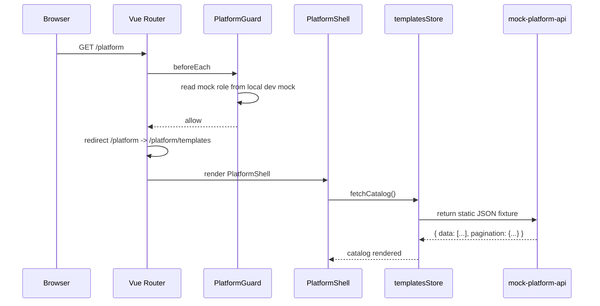

### Phase B (backend-integrated)

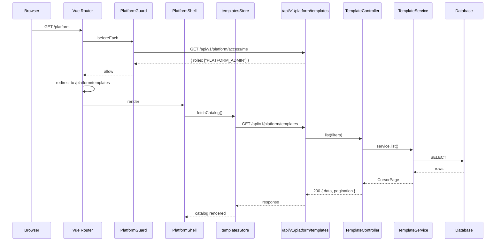

### Phase toggle

The switch between phases is a single flag in `frontend/src/features/platform/shared/api.ts`:

```
const USE_MOCK = import.meta.env.VITE_PLATFORM_USE_MOCK === "true";
```

Matches the existing pattern in `incident` and `dashboard` slices.

Response shape returned by either phase (illustrative for templates):

```json
{
  "data": [
    {
      "id": "tmpl-0001",
      "key": "project-default-v1",
      "name": "Project Default (V1)",
      "kind": "project",
      "status": "published",
      "version": 3,
      "ownerId": "u-001",
      "lastModifiedAt": "2026-04-18T02:15:00Z"
    }
  ],
  "pagination": {
    "nextCursor": null,
    "total": 1
  }
}
```

---

## 2. Sub-section Navigation and Lazy Fetch

```mermaid
sequenceDiagram
    participant User
    participant Rail as SubSectionRail
    participant Router as Vue Router
    participant Prev as PrevSubView
    participant Next as NextSubView
    participant NextStore as nextStore
    participant API

    User->>Rail: click "Audit"
    Rail->>Router: navigate /platform/audit
    Router->>Prev: onBeforeUnmount
    Prev->>Prev: close detail panel; preserve filters in URL
    Router->>Next: onMounted
    Next->>NextStore: read catalog?
    alt cache fresh (< 60s old)
        NextStore-->>Next: cached data
    else cache stale
        NextStore->>API: GET /api/v1/platform/audit
        API-->>NextStore: payload
        NextStore-->>Next: data
    end
```

Each sub-section store maintains a `lastFetchedAt` timestamp. Navigating back to a sub-section within 60 seconds reuses the cached catalog; otherwise it refetches.

---

## 3. Catalog Fetch with Filters + Cursor Pagination

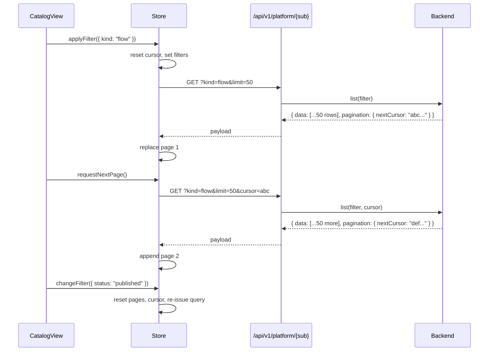

URL state is the source of truth for filters — filters are written to the URL query string so navigation, refresh, and sharing all preserve them. Store reads from URL on mount.

---

## 4. Detail View with Inheritance Resolution (Templates)

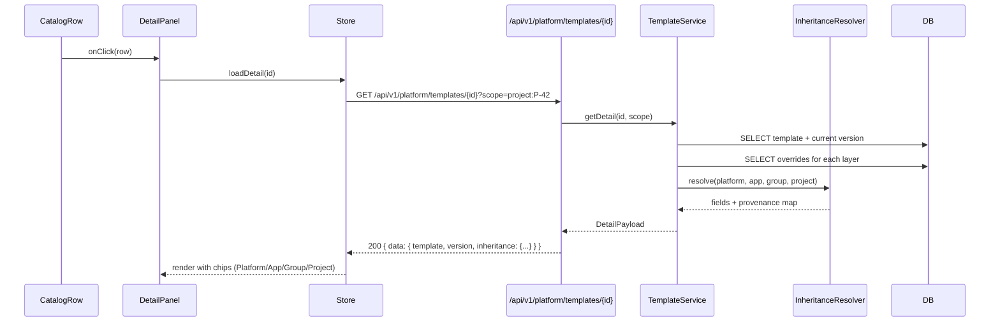

Response shape (illustrative):

```json
{
  "data": {
    "template": {
      "id": "tmpl-0001",
      "key": "project-default-v1",
      "kind": "project",
      "name": "Project Default (V1)",
      "status": "published",
      "version": 3,
      "ownerId": "u-001"
    },
    "version": {
      "id": "tver-0033",
      "version": 3,
      "createdAt": "2026-04-10T10:00:00Z",
      "body": { "defaultMilestones": ["Kickoff","Design","Build"] }
    },
    "inheritance": {
      "defaultMilestones": {
        "effectiveValue": ["Kickoff","Design","Build","Rollout"],
        "winningLayer": "project",
        "layers": {
          "platform":    ["Kickoff","Design","Build"],
          "application": null,
          "snowGroup":   null,
          "project":     ["Kickoff","Design","Build","Rollout"]
        }
      }
    }
  }
}
```

---

## 5. Mutation Flow with Atomic Audit Write

This flow applies to every mutating endpoint. Illustrated here with "publish template":

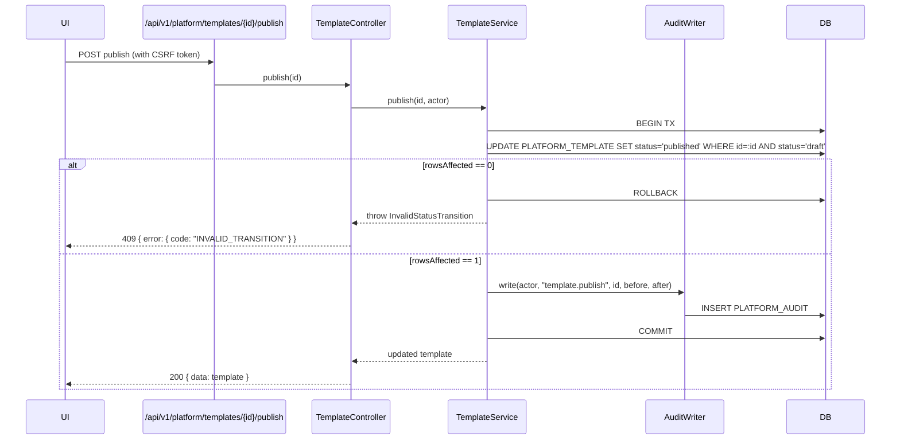

Key rules:

- Audit write is inside the same transaction. If `INSERT PLATFORM_AUDIT` fails, the template update is rolled back.
- Optimistic concurrency is enforced via the `WHERE status='draft'` predicate rather than a separate version check. Two concurrent publishes — one wins, the other receives 409 with `INVALID_TRANSITION`.

---

## 6. Connection Test Flow

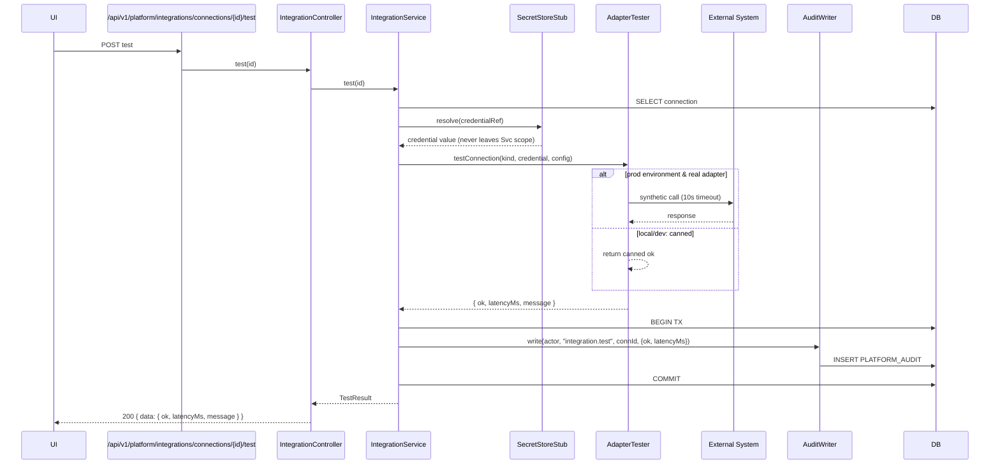

Timeout behavior: external adapter calls run on a bounded thread pool with a hard 10-second timeout. On timeout, `ok = false`, `message = "Timeout after 10s"`, and the result is still audited.

---

## 7. Error Isolation and Partial Failure

Each sub-section is responsible for its own error handling. A 500 from one sub-section does not affect other sub-sections or the shell.

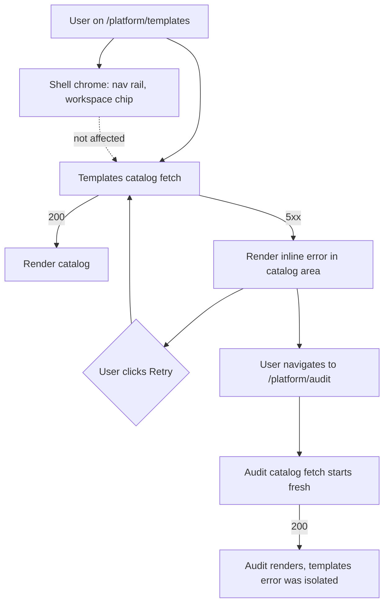

### Error cascade rules

| Failure | Blast radius | Recovery |
|---------|-------------|----------|
| Catalog fetch 5xx | Only that sub-section's catalog area | User clicks Retry on the inline error |
| Detail fetch 5xx | Only the detail panel; catalog still usable | Close panel and reopen, or Retry |
| Mutation 4xx (validation) | None; form shows inline validation errors | User fixes and resubmits |
| Mutation 409 (conflict) | None; destructive-confirm closes, toast shown | User refreshes catalog |
| Mutation 5xx | None; toast shown; catalog does not change | User retries |
| Audit write failure (server-side) | Entire mutation rolls back | Server returns 500; UI shows toast |
| Auth 403 on any request | Entire Platform Center routes to 403 state | Contact admin (per REQ-PC-03) |

---

## 8. Route-Guard 403 Flow

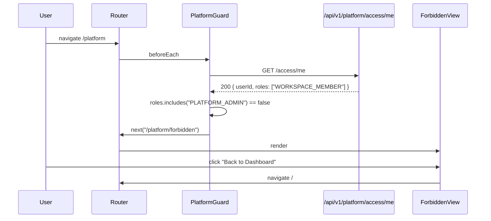

If `/access/me` itself fails, the guard treats it as "not admin" and renders 403 with a generic message. An authenticated session is assumed to exist (handled by a future auth slice); a 401 from `/access/me` still routes to 403 in this slice.

---

## 9. Refresh Strategy After Mutations

| Mutation | What refreshes automatically |
|----------|------------------------------|
| Template publish / deprecate / reactivate | Catalog row for the template; detail panel reload |
| Template delete (draft) | Catalog refetch page 1 |
| New template version | Detail panel Versions tab |
| Configuration create override | Catalog refetch page 1 |
| Configuration revert to parent | Catalog refetch page 1; any open detail closes |
| Role assign / revoke | Catalog refetch page 1 |
| Policy create / update | Catalog refetch page 1; detail panel reload |
| Policy add / remove exception | Detail panel Exceptions tab |
| Connection create / enable / disable / delete | Catalog refetch page 1 |
| Connection test | No data refresh needed; result shown as toast |
| Audit events (implicit) | Audit catalog does not auto-refresh; admin can click Refresh |

Audit log does **not** auto-subscribe to server-sent events in V1 (out of scope per REQ-PC). A manual Refresh button is shown on the Audit catalog header.

---

## State Machine: Template Status

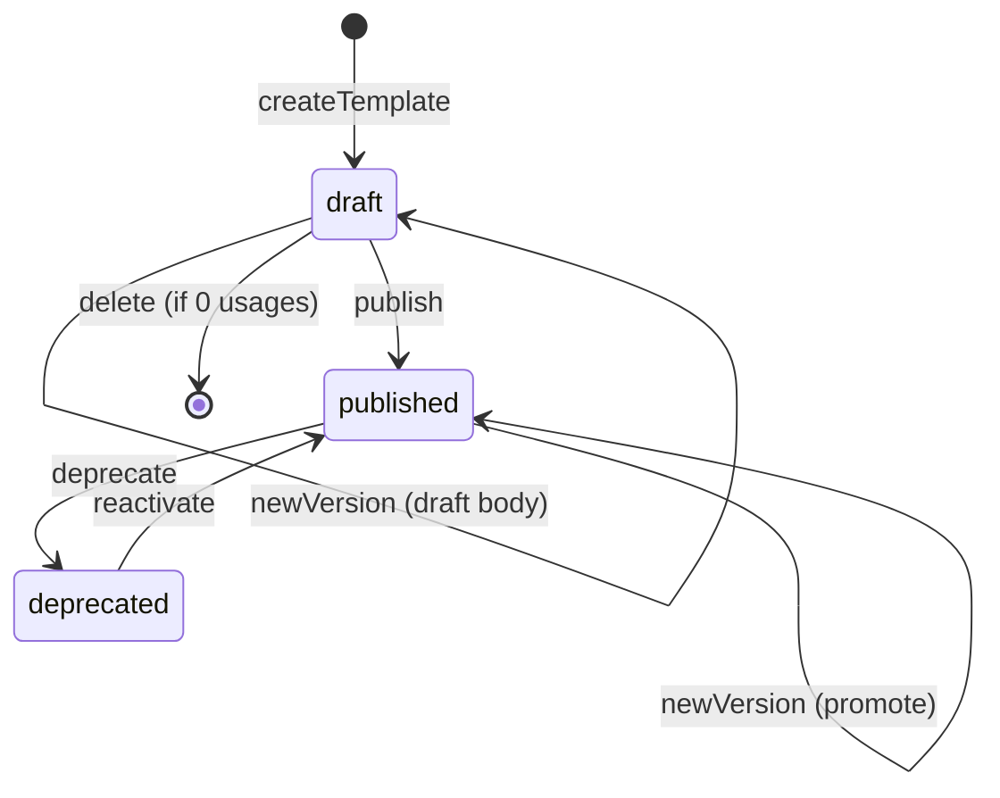

## State Machine: Policy Status

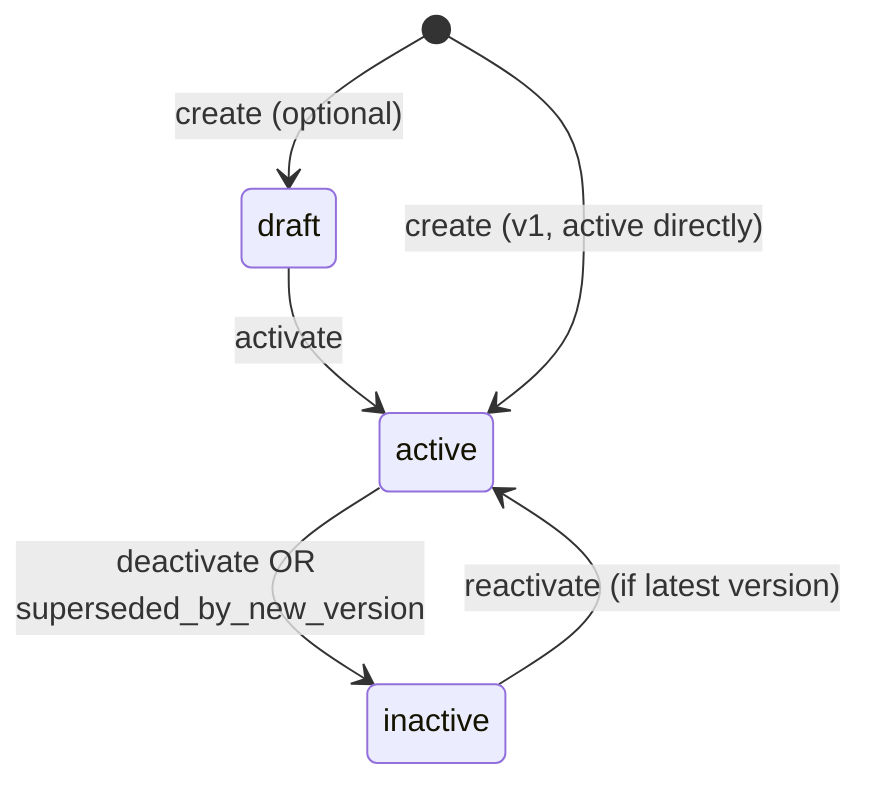

## State Machine: Connection Status

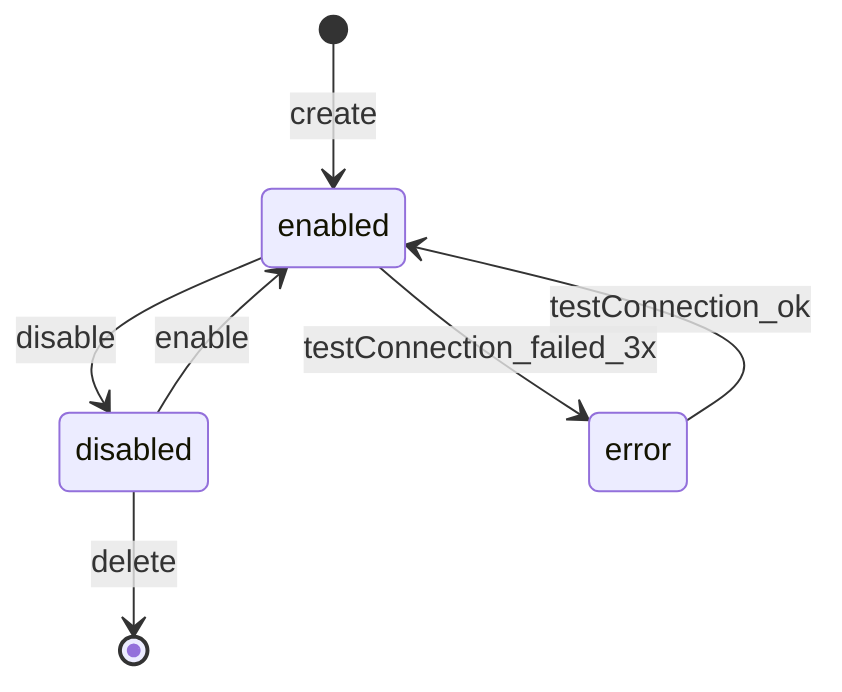

(`error` state is a future refinement; V1 treats test failures as informational — status stays `enabled` and the failure is audited.)

---

## FE ↔ BE Type Mapping (summary)

| Concept | TypeScript FE type | Java BE DTO / entity | DB table |
|---------|-------------------|----------------------|----------|
| Template row | `TemplateSummary` | `TemplateDto` / `Template` entity | `PLATFORM_TEMPLATE` |
| Template version | `TemplateVersion` | `TemplateVersionDto` / `TemplateVersion` entity | `PLATFORM_TEMPLATE_VERSION` |
| Config row | `ConfigurationSummary` | `ConfigurationDto` / `Configuration` entity | `PLATFORM_CONFIGURATION` |
| Audit row | `AuditRecord` | `AuditRecordDto` / `AuditRecord` entity | `PLATFORM_AUDIT` |
| Role assignment | `RoleAssignment` | `RoleAssignmentDto` / `RoleAssignment` entity | `PLATFORM_ROLE_ASSIGNMENT` |
| Policy | `Policy` | `PolicyDto` / `Policy` entity | `PLATFORM_POLICY` |
| Policy exception | `PolicyException` | `PolicyExceptionDto` / `PolicyException` entity | `PLATFORM_POLICY_EXCEPTION` |
| Connection | `Connection` | `ConnectionDto` / `Connection` entity | `PLATFORM_CONNECTION` |
| Credential ref | `CredentialRef` | `CredentialRefDto` / `CredentialRef` entity | `PLATFORM_CREDENTIAL_REF` |

Complete type and column definitions live in [platform-center-data-model.md](platform-center-data-model.md).

---

## API Client Chain

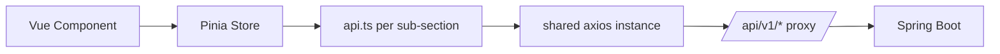

All six sub-section stores use a shared axios instance from `frontend/src/shared/http.ts` (already existing). Each sub-section ships its own `api.ts` with typed function wrappers.
