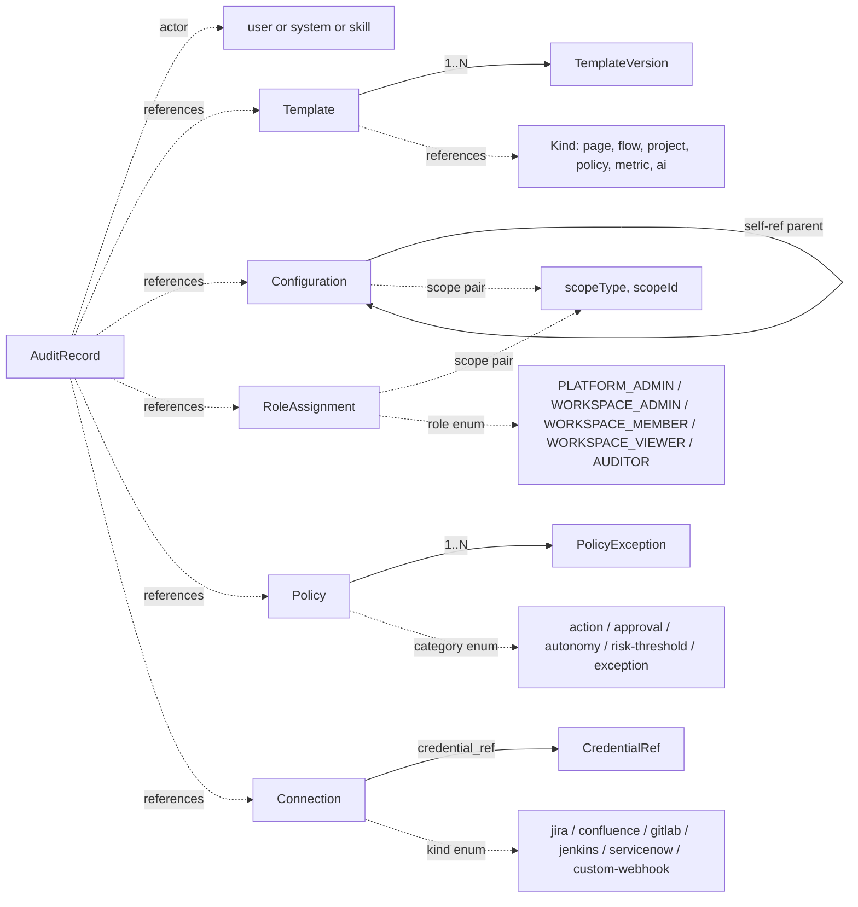

# Platform Center Data Model

## Purpose

This document defines the complete data model for the Platform Center slice: domain ER diagram, frontend TypeScript type catalog, backend DTOs and JPA entities, database schema DDL (Flyway migrations starting at V40), and frontend-to-backend type mapping.

## Source

- [platform-center-spec.md](../03-spec/platform-center-spec.md)
- [platform-center-architecture.md](platform-center-architecture.md)
- Existing Flyway conventions: `backend/src/main/resources/db/migration/V*.sql`

---

## 1. Domain Model ER Diagram



Nine primary entities:

1. `Template` + `TemplateVersion` (1:N)
2. `Configuration` (self-referential parent for overrides)
3. `RoleAssignment` (standalone, scope-bound)
4. `Policy` + `PolicyException` (1:N)
5. `Connection` + `CredentialRef` (1:1 via reference)
6. `AuditRecord` (append-only, cross-cutting, references by id/type)

---

## 2. Shared Value Types and Enums

### 2.1 Scope

```typescript
type ScopeType = "platform" | "application" | "workspace" | "project";

interface Scope {
  scopeType: ScopeType;
  scopeId: string;    // sentinel "*" when scopeType === "platform"
}
```

### 2.2 Role

```typescript
type Role =
  | "PLATFORM_ADMIN"
  | "WORKSPACE_ADMIN"
  | "WORKSPACE_MEMBER"
  | "WORKSPACE_VIEWER"
  | "AUDITOR";
```

### 2.3 Cursor Page envelope

```typescript
interface CursorPage<T> {
  data: T[];
  pagination: {
    nextCursor: string | null;
    total: number | null;
  };
}
```

### 2.4 API Error envelope

```typescript
interface ApiError {
  error: {
    code: string;        // e.g., INVALID_TRANSITION, LAST_PLATFORM_ADMIN
    message: string;
    details?: Record<string, unknown>;
  };
}
```

---

## 3. Frontend Type Catalog

### 3.1 Templates

```typescript
type TemplateKind = "page" | "flow" | "project" | "policy" | "metric" | "ai";
type TemplateStatus = "draft" | "published" | "deprecated";

interface TemplateSummary {
  id: string;
  key: string;
  name: string;
  kind: TemplateKind;
  status: TemplateStatus;
  version: number;          // current published or latest draft
  ownerId: string;
  lastModifiedAt: string;   // ISO-8601
}

interface TemplateDetail {
  template: TemplateSummary & { description: string | null };
  version: TemplateVersion;
  inheritance: Record<string, InheritanceField>;
}

interface TemplateVersion {
  id: string;
  templateId: string;
  version: number;
  body: Record<string, unknown>;    // kind-specific JSON
  createdAt: string;
  createdBy: string;
}

interface InheritanceField {
  effectiveValue: unknown;
  winningLayer: "platform" | "application" | "snowGroup" | "project";
  layers: {
    platform: unknown;
    application: unknown | null;
    snowGroup: unknown | null;
    project: unknown | null;
  };
}
```

### 3.2 Configurations

```typescript
type ConfigKind =
  | "page"
  | "field"
  | "component"
  | "flow-rule"
  | "view-rule"
  | "notification"
  | "ai-config";

type ConfigStatus = "active" | "inactive";

interface ConfigurationSummary {
  id: string;
  key: string;
  kind: ConfigKind;
  scopeType: ScopeType;
  scopeId: string;
  parentId: string | null;     // null == platform default
  status: ConfigStatus;
  hasDrift: boolean;
  lastModifiedAt: string;
}

interface ConfigurationDetail extends ConfigurationSummary {
  body: Record<string, unknown>;
  platformDefaultBody: Record<string, unknown> | null;
  driftFields: string[];
}
```

### 3.3 Audit

```typescript
type AuditCategory =
  | "config_change"
  | "permission_change"
  | "ai_suggestion"
  | "ai_execution"
  | "approval_decision"
  | "skill_execution"
  | "deployment_event"
  | "incident_event"
  | "policy_hit"
  | "integration.test";

type AuditOutcome = "success" | "failure" | "rejected" | "rolled_back";
type ActorType = "user" | "system" | "skill";

interface AuditRecord {
  id: string;
  timestamp: string;
  actor: string;
  actorType: ActorType;
  category: AuditCategory;
  action: string;            // free-form; e.g., "template.publish"
  objectType: string;
  objectId: string;
  scopeType: ScopeType;
  scopeId: string;
  outcome: AuditOutcome;
  evidenceRef: string | null;
  payload: Record<string, unknown>;   // before/after/diff
}
```

### 3.4 Access

```typescript
interface RoleAssignment {
  id: string;
  userId: string;
  userDisplayName: string;
  role: Role;
  scopeType: ScopeType;
  scopeId: string;
  grantedBy: string;
  grantedAt: string;
}
```

### 3.5 Policies

```typescript
type PolicyCategory =
  | "action"
  | "approval"
  | "autonomy"
  | "risk-threshold"
  | "exception";

type PolicyStatus = "draft" | "active" | "inactive";

interface Policy {
  id: string;
  key: string;
  name: string;
  category: PolicyCategory;
  scopeType: ScopeType;
  scopeId: string;
  boundTo: string | null;    // Skill key or action descriptor
  version: number;
  status: PolicyStatus;
  body: Record<string, unknown>;     // category-specific
  createdAt: string;
  createdBy: string;
}

interface PolicyException {
  id: string;
  policyId: string;
  reason: string;
  requesterId: string;
  approverId: string;
  createdAt: string;
  expiresAt: string;
  revokedAt: string | null;
}
```

### 3.6 Integrations

```typescript
type AdapterKind = "jira" | "confluence" | "gitlab" | "jenkins" | "servicenow" | "custom-webhook";
type SyncMode = "pull" | "push" | "both";
type ConnectionStatus = "enabled" | "disabled" | "error";

interface AdapterDescriptor {
  kind: AdapterKind;
  label: string;
  supportedModes: SyncMode[];
  capabilities: string[];    // e.g., ["requirement", "issue-status"]
}

interface Connection {
  id: string;
  kind: AdapterKind;
  scopeWorkspaceId: string;
  applicationId: string | null;
  applicationName: string | null;
  snowGroupId: string | null;
  snowGroupName: string | null;
  baseUrl: string | null;
  credentialRef: string;
  syncMode: SyncMode;
  pullSchedule: string | null;   // cron
  pushUrl: string | null;
  status: ConnectionStatus;
  lastSyncAt: string | null;
  lastTestAt: string | null;
  lastTestOk: boolean | null;
}

interface ConnectionTestResult {
  ok: boolean;
  latencyMs: number;
  message: string | null;
}
```

### 3.7 Current user (used by route guard)

```typescript
interface CurrentUser {
  userId: string;
  displayName: string;
  roles: Role[];
  scopes: Scope[];            // roles * scopes resolved
}
```

---

## 4. Backend DTOs (Spring Boot, Java 21)

All DTOs are Java 21 records. They live beside their controllers in `com.sdlctower.platform.{sub}`.

### 4.1 Template DTOs

```java
public record TemplateSummaryDto(
    String id,
    String key,
    String name,
    String kind,
    String status,
    Integer version,
    String ownerId,
    Instant lastModifiedAt
) {}

public record TemplateDetailDto(
    TemplateSummaryDto template,
    String description,
    TemplateVersionDto version,
    Map<String, InheritanceFieldDto> inheritance
) {}

public record TemplateVersionDto(
    String id,
    String templateId,
    Integer version,
    JsonNode body,
    Instant createdAt,
    String createdBy
) {}

public record InheritanceFieldDto(
    JsonNode effectiveValue,
    String winningLayer,
    Map<String, JsonNode> layers    // keys: platform, application, snowGroup, project
) {}
```

### 4.2 Configuration DTOs

```java
public record ConfigurationSummaryDto(
    String id,
    String key,
    String kind,
    String scopeType,
    String scopeId,
    String parentId,
    String status,
    Boolean hasDrift,
    Instant lastModifiedAt
) {}

public record ConfigurationDetailDto(
    ConfigurationSummaryDto summary,
    JsonNode body,
    JsonNode platformDefaultBody,
    List<String> driftFields
) {}

public record CreateConfigurationRequest(
    String parentId,
    String scopeType,
    String scopeId,
    JsonNode body
) {}
```

### 4.3 Audit DTOs

```java
public record AuditRecordDto(
    String id,
    Instant timestamp,
    String actor,
    String actorType,
    String category,
    String action,
    String objectType,
    String objectId,
    String scopeType,
    String scopeId,
    String outcome,
    String evidenceRef,
    JsonNode payload
) {}

public record AuditQuery(
    List<String> category,
    String actor,
    String objectType,
    String objectId,
    String outcome,
    String scopeType,
    String scopeId,
    String timeRange,    // "24h" | "7d" | "30d" | ISO-8601 range
    Integer limit,
    String cursor
) {}
```

### 4.4 Access DTOs

```java
public record RoleAssignmentDto(
    String id,
    String userId,
    String userDisplayName,
    String role,
    String scopeType,
    String scopeId,
    String grantedBy,
    Instant grantedAt
) {}

public record AssignRoleRequest(
    String userId,
    String role,
    String scopeType,
    String scopeId
) {}

public record CurrentUserDto(
    String userId,
    String displayName,
    List<String> roles,
    List<ScopeDto> scopes
) {}

public record ScopeDto(String scopeType, String scopeId) {}
```

### 4.5 Policy DTOs

```java
public record PolicyDto(
    String id,
    String key,
    String name,
    String category,
    String scopeType,
    String scopeId,
    String boundTo,
    Integer version,
    String status,
    JsonNode body,
    Instant createdAt,
    String createdBy
) {}

public record PolicyExceptionDto(
    String id,
    String policyId,
    String reason,
    String requesterId,
    String approverId,
    Instant createdAt,
    Instant expiresAt,
    Instant revokedAt
) {}

public record CreatePolicyRequest(
    String key,
    String name,
    String category,
    String scopeType,
    String scopeId,
    String boundTo,
    JsonNode body
) {}
```

### 4.6 Integration DTOs

```java
public record AdapterDescriptorDto(
    String kind,
    String label,
    List<String> supportedModes,
    List<String> capabilities
) {}

public record ConnectionDto(
    String id,
    String kind,
    String scopeWorkspaceId,
    String credentialRef,
    String syncMode,
    String pullSchedule,
    String pushUrl,
    String status,
    Instant lastSyncAt,
    Instant lastTestAt,
    Boolean lastTestOk
) {}

public record CreateConnectionRequest(
    String kind,
    String scopeWorkspaceId,
    String credentialRef,
    String syncMode,
    String pullSchedule,
    String pushUrl
) {}

public record ConnectionTestResultDto(
    Boolean ok,
    Long latencyMs,
    String message
) {}
```

---

## 5. JPA Entities (sketches)

Entities are regular Java classes with `@Entity` annotations (NOT records — JPA requires mutable classes). Signatures only; full bodies are generated by Codex per the backend prompt.

```java
@Entity @Table(name = "PLATFORM_TEMPLATE")
public class Template {
    @Id private String id;
    @Column(name = "template_key", nullable = false) private String key;
    @Column(nullable = false) private String name;
    @Column(nullable = false) private String kind;
    @Column(nullable = false) private String status;
    @Column(name = "current_version") private Integer currentVersion;
    @Column(name = "owner_id") private String ownerId;
    @Column private String description;
    @Column(name = "usage_count") private Integer usageCount;
    @Column(name = "created_at", nullable = false) private Instant createdAt;
    @Column(name = "last_modified_at", nullable = false) private Instant lastModifiedAt;
}

@Entity @Table(name = "PLATFORM_TEMPLATE_VERSION")
public class TemplateVersion {
    @Id private String id;
    @Column(name = "template_id", nullable = false) private String templateId;
    @Column(nullable = false) private Integer version;
    @Lob @Column(nullable = false) private String body;    // JSON as text
    @Column(name = "created_at", nullable = false) private Instant createdAt;
    @Column(name = "created_by", nullable = false) private String createdBy;
}

@Entity @Table(name = "PLATFORM_CONFIGURATION")
public class Configuration {
    @Id private String id;
    @Column(name = "config_key", nullable = false) private String key;
    @Column(nullable = false) private String kind;
    @Column(name = "scope_type", nullable = false) private String scopeType;
    @Column(name = "scope_id", nullable = false) private String scopeId;
    @Column(name = "parent_id") private String parentId;
    @Column(nullable = false) private String status;
    @Lob @Column(nullable = false) private String body;
    @Column(name = "has_drift") private Boolean hasDrift;
    @Column(name = "created_at", nullable = false) private Instant createdAt;
    @Column(name = "last_modified_at", nullable = false) private Instant lastModifiedAt;
}

@Entity @Table(name = "PLATFORM_AUDIT")
public class AuditRecord {
    @Id private String id;
    @Column(nullable = false) private Instant timestamp;
    @Column(nullable = false) private String actor;
    @Column(name = "actor_type", nullable = false) private String actorType;
    @Column(nullable = false) private String category;
    @Column(nullable = false) private String action;
    @Column(name = "object_type", nullable = false) private String objectType;
    @Column(name = "object_id", nullable = false) private String objectId;
    @Column(name = "scope_type", nullable = false) private String scopeType;
    @Column(name = "scope_id", nullable = false) private String scopeId;
    @Column(nullable = false) private String outcome;
    @Column(name = "evidence_ref") private String evidenceRef;
    @Lob @Column private String payload;    // JSON as text
}

@Entity @Table(name = "PLATFORM_ROLE_ASSIGNMENT")
public class RoleAssignment {
    @Id private String id;
    @Column(name = "user_id", nullable = false) private String userId;
    @Column(name = "user_display_name") private String userDisplayName;
    @Column(nullable = false) private String role;
    @Column(name = "scope_type", nullable = false) private String scopeType;
    @Column(name = "scope_id", nullable = false) private String scopeId;
    @Column(name = "granted_by", nullable = false) private String grantedBy;
    @Column(name = "granted_at", nullable = false) private Instant grantedAt;
    @Column(name = "attributes_json") private String attributesJson;    // reserved for V2 ABAC
}

@Entity @Table(name = "PLATFORM_POLICY")
public class Policy {
    @Id private String id;
    @Column(name = "policy_key", nullable = false) private String key;
    @Column(nullable = false) private String name;
    @Column(nullable = false) private String category;
    @Column(name = "scope_type", nullable = false) private String scopeType;
    @Column(name = "scope_id", nullable = false) private String scopeId;
    @Column(name = "bound_to") private String boundTo;
    @Column(nullable = false) private Integer version;
    @Column(nullable = false) private String status;
    @Lob @Column(nullable = false) private String body;
    @Column(name = "created_at", nullable = false) private Instant createdAt;
    @Column(name = "created_by", nullable = false) private String createdBy;
}

@Entity @Table(name = "PLATFORM_POLICY_EXCEPTION")
public class PolicyException {
    @Id private String id;
    @Column(name = "policy_id", nullable = false) private String policyId;
    @Column(nullable = false) private String reason;
    @Column(name = "requester_id", nullable = false) private String requesterId;
    @Column(name = "approver_id", nullable = false) private String approverId;
    @Column(name = "created_at", nullable = false) private Instant createdAt;
    @Column(name = "expires_at", nullable = false) private Instant expiresAt;
    @Column(name = "revoked_at") private Instant revokedAt;
}

@Entity @Table(name = "PLATFORM_CONNECTION")
public class Connection {
    @Id private String id;
    @Column(nullable = false) private String kind;
    @Column(name = "scope_workspace_id", nullable = false) private String scopeWorkspaceId;
    @Column(name = "credential_ref", nullable = false) private String credentialRef;
    @Column(name = "sync_mode", nullable = false) private String syncMode;
    @Column(name = "pull_schedule") private String pullSchedule;
    @Column(name = "push_url") private String pushUrl;
    @Column(nullable = false) private String status;
    @Column(name = "last_sync_at") private Instant lastSyncAt;
    @Column(name = "last_test_at") private Instant lastTestAt;
    @Column(name = "last_test_ok") private Boolean lastTestOk;
    @Column(name = "created_at", nullable = false) private Instant createdAt;
}

@Entity @Table(name = "PLATFORM_CREDENTIAL_REF")
public class CredentialRef {
    @Id private String ref;                        // the opaque reference used by Connection
    @Column(name = "storage_kind", nullable = false) private String storageKind;    // V1: "stub"
    @Column(name = "encrypted_value") private String encryptedValue;                // V1 stub: base64 placeholder
    @Column(name = "created_at", nullable = false) private Instant createdAt;
}
```

---

## 6. Database Schema — Flyway Migrations

The next available Flyway version in the repo is **V40** (existing top is V36 — see `backend/src/main/resources/db/migration/`). Platform Center uses a contiguous block V40–V47.

### V40: Templates

File: `V40__create_platform_template.sql`

```sql
CREATE TABLE PLATFORM_TEMPLATE (
    id                  VARCHAR(64)  PRIMARY KEY,
    template_key        VARCHAR(128) NOT NULL,
    name                VARCHAR(256) NOT NULL,
    kind                VARCHAR(32)  NOT NULL,      -- page/flow/project/policy/metric/ai
    status              VARCHAR(32)  NOT NULL,      -- draft/published/deprecated
    current_version     INTEGER               ,
    owner_id            VARCHAR(64)           ,
    description         VARCHAR(2000)         ,
    usage_count         INTEGER      DEFAULT 0 NOT NULL,
    created_at          TIMESTAMP    NOT NULL,
    last_modified_at    TIMESTAMP    NOT NULL,
    CONSTRAINT uq_platform_template_key UNIQUE (template_key)
);

CREATE INDEX ix_platform_template_kind ON PLATFORM_TEMPLATE (kind);
CREATE INDEX ix_platform_template_status ON PLATFORM_TEMPLATE (status);

CREATE TABLE PLATFORM_TEMPLATE_VERSION (
    id           VARCHAR(64) PRIMARY KEY,
    template_id  VARCHAR(64) NOT NULL,
    version      INTEGER     NOT NULL,
    body         CLOB        NOT NULL,    -- JSON as text (Oracle: CLOB; H2: CLOB)
    created_at   TIMESTAMP   NOT NULL,
    created_by   VARCHAR(64) NOT NULL,
    CONSTRAINT fk_ptv_template FOREIGN KEY (template_id) REFERENCES PLATFORM_TEMPLATE(id),
    CONSTRAINT uq_platform_template_version UNIQUE (template_id, version)
);
```

### V41: Configurations

File: `V41__create_platform_configuration.sql`

```sql
CREATE TABLE PLATFORM_CONFIGURATION (
    id                VARCHAR(64)  PRIMARY KEY,
    config_key        VARCHAR(128) NOT NULL,
    kind              VARCHAR(32)  NOT NULL,    -- page/field/component/flow-rule/view-rule/notification/ai-config
    scope_type        VARCHAR(32)  NOT NULL,    -- platform/application/workspace/project
    scope_id          VARCHAR(64)  NOT NULL,    -- "*" when platform
    parent_id         VARCHAR(64)           ,
    status            VARCHAR(32)  NOT NULL,    -- active/inactive
    body              CLOB         NOT NULL,
    has_drift         BOOLEAN      DEFAULT FALSE NOT NULL,
    created_at        TIMESTAMP    NOT NULL,
    last_modified_at  TIMESTAMP    NOT NULL,
    CONSTRAINT fk_pc_parent FOREIGN KEY (parent_id) REFERENCES PLATFORM_CONFIGURATION(id)
);

CREATE INDEX ix_platform_configuration_kind ON PLATFORM_CONFIGURATION (kind);
CREATE INDEX ix_platform_configuration_scope ON PLATFORM_CONFIGURATION (scope_type, scope_id);
CREATE UNIQUE INDEX uq_platform_configuration_scope_key
    ON PLATFORM_CONFIGURATION (config_key, kind, scope_type, scope_id);
```

### V42: Audit

File: `V42__create_platform_audit.sql`

```sql
CREATE TABLE PLATFORM_AUDIT (
    id            VARCHAR(64)  PRIMARY KEY,
    timestamp     TIMESTAMP    NOT NULL,
    actor         VARCHAR(128) NOT NULL,
    actor_type    VARCHAR(16)  NOT NULL,      -- user/system/skill
    category      VARCHAR(64)  NOT NULL,
    action        VARCHAR(128) NOT NULL,
    object_type   VARCHAR(64)  NOT NULL,
    object_id     VARCHAR(64)  NOT NULL,
    scope_type    VARCHAR(32)  NOT NULL,
    scope_id      VARCHAR(64)  NOT NULL,
    outcome       VARCHAR(32)  NOT NULL,      -- success/failure/rejected/rolled_back
    evidence_ref  VARCHAR(256)          ,
    payload       CLOB                  ,     -- JSON
    CONSTRAINT ck_platform_audit_outcome
        CHECK (outcome IN ('success','failure','rejected','rolled_back'))
);

CREATE INDEX ix_platform_audit_ts    ON PLATFORM_AUDIT (timestamp DESC);
CREATE INDEX ix_platform_audit_cat   ON PLATFORM_AUDIT (category);
CREATE INDEX ix_platform_audit_obj   ON PLATFORM_AUDIT (object_type, object_id);
CREATE INDEX ix_platform_audit_actor ON PLATFORM_AUDIT (actor);
CREATE INDEX ix_platform_audit_scope ON PLATFORM_AUDIT (scope_type, scope_id);
```

### V43: Role assignments

File: `V43__create_platform_role_assignment.sql`

```sql
CREATE TABLE PLATFORM_ROLE_ASSIGNMENT (
    id                 VARCHAR(64)  PRIMARY KEY,
    user_id            VARCHAR(128) NOT NULL,
    user_display_name  VARCHAR(256)          ,
    role               VARCHAR(32)  NOT NULL,
    scope_type         VARCHAR(32)  NOT NULL,
    scope_id           VARCHAR(64)  NOT NULL,
    granted_by         VARCHAR(128) NOT NULL,
    granted_at         TIMESTAMP    NOT NULL,
    attributes_json    CLOB                  ,    -- reserved for V2 ABAC
    CONSTRAINT uq_platform_role_assignment UNIQUE (user_id, role, scope_type, scope_id)
);

CREATE INDEX ix_platform_role_assignment_user  ON PLATFORM_ROLE_ASSIGNMENT (user_id);
CREATE INDEX ix_platform_role_assignment_scope ON PLATFORM_ROLE_ASSIGNMENT (scope_type, scope_id);
CREATE INDEX ix_platform_role_assignment_role  ON PLATFORM_ROLE_ASSIGNMENT (role);
```

### V44: Policies

File: `V44__create_platform_policy.sql`

```sql
CREATE TABLE PLATFORM_POLICY (
    id            VARCHAR(64)  PRIMARY KEY,
    policy_key    VARCHAR(128) NOT NULL,
    name          VARCHAR(256) NOT NULL,
    category      VARCHAR(32)  NOT NULL,     -- action/approval/autonomy/risk-threshold/exception
    scope_type    VARCHAR(32)  NOT NULL,
    scope_id      VARCHAR(64)  NOT NULL,
    bound_to      VARCHAR(128)          ,
    version       INTEGER      NOT NULL,
    status        VARCHAR(32)  NOT NULL,     -- draft/active/inactive
    body          CLOB         NOT NULL,
    created_at    TIMESTAMP    NOT NULL,
    created_by    VARCHAR(128) NOT NULL,
    CONSTRAINT uq_platform_policy_version
        UNIQUE (policy_key, scope_type, scope_id, version)
);

CREATE INDEX ix_platform_policy_key    ON PLATFORM_POLICY (policy_key);
CREATE INDEX ix_platform_policy_cat    ON PLATFORM_POLICY (category);
CREATE INDEX ix_platform_policy_status ON PLATFORM_POLICY (status);
CREATE INDEX ix_platform_policy_scope  ON PLATFORM_POLICY (scope_type, scope_id);

CREATE TABLE PLATFORM_POLICY_EXCEPTION (
    id            VARCHAR(64)  PRIMARY KEY,
    policy_id     VARCHAR(64)  NOT NULL,
    reason        VARCHAR(1024) NOT NULL,
    requester_id  VARCHAR(128) NOT NULL,
    approver_id   VARCHAR(128) NOT NULL,
    created_at    TIMESTAMP    NOT NULL,
    expires_at    TIMESTAMP    NOT NULL,
    revoked_at    TIMESTAMP             ,
    CONSTRAINT fk_ppe_policy FOREIGN KEY (policy_id) REFERENCES PLATFORM_POLICY(id)
);

CREATE INDEX ix_platform_policy_exception_policy  ON PLATFORM_POLICY_EXCEPTION (policy_id);
CREATE INDEX ix_platform_policy_exception_expiry ON PLATFORM_POLICY_EXCEPTION (expires_at);
```

### V45: Connections

File: `V45__create_platform_connection.sql`

```sql
CREATE TABLE PLATFORM_CREDENTIAL_REF (
    ref             VARCHAR(128) PRIMARY KEY,
    storage_kind    VARCHAR(32)  NOT NULL,    -- V1: "stub"
    encrypted_value CLOB                  ,    -- V1 stub: base64 placeholder; prod: pointer only
    created_at      TIMESTAMP    NOT NULL
);

CREATE TABLE PLATFORM_CONNECTION (
    id                  VARCHAR(64)  PRIMARY KEY,
    kind                VARCHAR(32)  NOT NULL,     -- jira/confluence/gitlab/jenkins/servicenow/custom-webhook
    scope_workspace_id  VARCHAR(64)  NOT NULL,
    application_id      VARCHAR(128)          ,
    application_name    VARCHAR(255)          ,
    snow_group_id       VARCHAR(128)          ,
    snow_group_name     VARCHAR(255)          ,
    base_url            VARCHAR(512)          ,
    credential_ref      VARCHAR(128) NOT NULL,
    sync_mode           VARCHAR(16)  NOT NULL,     -- pull/push/both
    pull_schedule       VARCHAR(128)          ,    -- cron
    push_url            VARCHAR(512)          ,
    status              VARCHAR(16)  NOT NULL,     -- enabled/disabled/error
    last_sync_at        TIMESTAMP             ,
    last_test_at        TIMESTAMP             ,
    last_test_ok        BOOLEAN               ,
    created_at          TIMESTAMP    NOT NULL,
    CONSTRAINT fk_pconn_cred FOREIGN KEY (credential_ref) REFERENCES PLATFORM_CREDENTIAL_REF(ref)
);

CREATE INDEX ix_platform_connection_kind   ON PLATFORM_CONNECTION (kind);
CREATE INDEX ix_platform_connection_scope  ON PLATFORM_CONNECTION (scope_workspace_id);
CREATE INDEX ix_platform_connection_status ON PLATFORM_CONNECTION (status);
```

### V46: Seed data (local profile baseline)

File: `V46__seed_platform_center_data.sql`

```sql
-- Default platform admin user (for local / dev only; real auth deferred)
INSERT INTO PLATFORM_ROLE_ASSIGNMENT
    (id, user_id, user_display_name, role, scope_type, scope_id, granted_by, granted_at, attributes_json)
VALUES
    ('ra-default-admin', 'admin@sdlctower.local', 'Platform Admin',
     'PLATFORM_ADMIN', 'platform', '*', 'system', CURRENT_TIMESTAMP, NULL);

-- One template of each kind at the platform default layer
INSERT INTO PLATFORM_TEMPLATE (id, template_key, name, kind, status, current_version, owner_id,
                               description, usage_count, created_at, last_modified_at) VALUES
  ('tmpl-page-001',   'dashboard-default-v1',      'Dashboard Default (V1)',       'page',    'published', 1, 'admin@sdlctower.local', 'Default dashboard layout', 0, CURRENT_TIMESTAMP, CURRENT_TIMESTAMP),
  ('tmpl-flow-001',   'requirement-flow-default',  'Requirement Flow Default',     'flow',    'published', 1, 'admin@sdlctower.local', 'Default requirement workflow', 0, CURRENT_TIMESTAMP, CURRENT_TIMESTAMP),
  ('tmpl-proj-001',   'project-default-v1',        'Project Default (V1)',         'project', 'published', 1, 'admin@sdlctower.local', 'Default project template', 0, CURRENT_TIMESTAMP, CURRENT_TIMESTAMP),
  ('tmpl-pol-001',    'change-risk-default',       'Change Risk Default',          'policy',  'published', 1, 'admin@sdlctower.local', 'Default change risk ruleset', 0, CURRENT_TIMESTAMP, CURRENT_TIMESTAMP),
  ('tmpl-met-001',    'delivery-lead-time',        'Delivery Lead Time Metric',    'metric',  'published', 1, 'admin@sdlctower.local', 'Lead time measurement definition', 0, CURRENT_TIMESTAMP, CURRENT_TIMESTAMP),
  ('tmpl-ai-001',     'req-to-user-story-default', 'req-to-user-story defaults',   'ai',      'published', 1, 'admin@sdlctower.local', 'Default prompt + params', 0, CURRENT_TIMESTAMP, CURRENT_TIMESTAMP);

INSERT INTO PLATFORM_TEMPLATE_VERSION (id, template_id, version, body, created_at, created_by) VALUES
  ('tver-page-001-v1', 'tmpl-page-001', 1, '{"widgets":["context","metrics","activity"]}',              CURRENT_TIMESTAMP, 'admin@sdlctower.local'),
  ('tver-flow-001-v1', 'tmpl-flow-001', 1, '{"states":["New","InReview","Approved","Rejected"]}',       CURRENT_TIMESTAMP, 'admin@sdlctower.local'),
  ('tver-proj-001-v1', 'tmpl-proj-001', 1, '{"defaultMilestones":["Kickoff","Design","Build"]}',        CURRENT_TIMESTAMP, 'admin@sdlctower.local'),
  ('tver-pol-001-v1',  'tmpl-pol-001',  1, '{"riskTiers":["low","medium","high"]}',                     CURRENT_TIMESTAMP, 'admin@sdlctower.local'),
  ('tver-met-001-v1',  'tmpl-met-001',  1, '{"unit":"hours","calc":"deployed_at - pr_opened_at"}',       CURRENT_TIMESTAMP, 'admin@sdlctower.local'),
  ('tver-ai-001-v1',   'tmpl-ai-001',   1, '{"autonomy":"L1-Assist","timeoutSec":60}',                  CURRENT_TIMESTAMP, 'admin@sdlctower.local');

-- One platform-default configuration per kind
INSERT INTO PLATFORM_CONFIGURATION (id, config_key, kind, scope_type, scope_id, parent_id, status, body,
                                    has_drift, created_at, last_modified_at) VALUES
  ('cfg-001', 'req.page.layout',    'page',         'platform', '*', NULL, 'active', '{"columns":2}', FALSE, CURRENT_TIMESTAMP, CURRENT_TIMESTAMP),
  ('cfg-002', 'req.field.priority', 'field',        'platform', '*', NULL, 'active', '{"required":true}', FALSE, CURRENT_TIMESTAMP, CURRENT_TIMESTAMP),
  ('cfg-003', 'req.form.order',     'component',    'platform', '*', NULL, 'active', '{"order":["summary","desc"]}', FALSE, CURRENT_TIMESTAMP, CURRENT_TIMESTAMP),
  ('cfg-004', 'req.flow.approval',  'flow-rule',    'platform', '*', NULL, 'active', '{"approvers":["TL"]}', FALSE, CURRENT_TIMESTAMP, CURRENT_TIMESTAMP),
  ('cfg-005', 'inc.view.default',   'view-rule',    'platform', '*', NULL, 'active', '{"sort":"-createdAt"}', FALSE, CURRENT_TIMESTAMP, CURRENT_TIMESTAMP),
  ('cfg-006', 'inc.notify.channel', 'notification', 'platform', '*', NULL, 'active', '{"channel":"email"}', FALSE, CURRENT_TIMESTAMP, CURRENT_TIMESTAMP),
  ('cfg-007', 'ai.autonomy.default','ai-config',    'platform', '*', NULL, 'active', '{"default":"L1-Assist"}', FALSE, CURRENT_TIMESTAMP, CURRENT_TIMESTAMP);

-- One active policy of each category (for read-only browsing)
INSERT INTO PLATFORM_POLICY (id, policy_key, name, category, scope_type, scope_id, bound_to, version, status, body, created_at, created_by) VALUES
  ('pol-act-001', 'deploy.prod.allow',           'Prod Deploy Allowed Roles',   'action',          'platform', '*', 'deployment.promote',   1, 'active', '{"allowedBy":["WORKSPACE_ADMIN"]}', CURRENT_TIMESTAMP, 'admin@sdlctower.local'),
  ('pol-app-001', 'deploy.prod.approval',        'Prod Deploy Approval',        'approval',        'platform', '*', 'deployment.promote',   1, 'active', '{"approvers":["WORKSPACE_ADMIN"],"timeoutSec":86400}', CURRENT_TIMESTAMP, 'admin@sdlctower.local'),
  ('pol-aut-001', 'skill.req-to-user-story.aut', 'req-to-user-story autonomy',  'autonomy',        'platform', '*', 'req-to-user-story',    1, 'active', '{"defaultLevel":"L1-Assist","escalation":"PLATFORM_ADMIN"}', CURRENT_TIMESTAMP, 'admin@sdlctower.local'),
  ('pol-rsk-001', 'incident.mttr.threshold',     'Incident MTTR Threshold',     'risk-threshold',  'platform', '*', NULL,                   1, 'active', '{"metric":"mttr","op":">","value":30}', CURRENT_TIMESTAMP, 'admin@sdlctower.local'),
  ('pol-exc-001', 'deploy.prod.weekend.exc',     'Weekend Deploy Exception',    'exception',       'platform', '*', 'deployment.promote',   1, 'inactive', '{"note":"reserved slot"}', CURRENT_TIMESTAMP, 'admin@sdlctower.local');

-- Credential references (stub storage only; no real secrets)
INSERT INTO PLATFORM_CREDENTIAL_REF (ref, storage_kind, encrypted_value, created_at) VALUES
  ('cred-jira-demo',       'stub', NULL, CURRENT_TIMESTAMP),
  ('cred-confluence-demo', 'stub', NULL, CURRENT_TIMESTAMP),
  ('cred-gitlab-demo',     'stub', NULL, CURRENT_TIMESTAMP),
  ('cred-jenkins-demo',    'stub', NULL, CURRENT_TIMESTAMP),
  ('cred-servicenow-demo', 'stub', NULL, CURRENT_TIMESTAMP);

-- Connections (disabled by default)
INSERT INTO PLATFORM_CONNECTION (id, kind, scope_workspace_id, application_id, application_name, snow_group_id, snow_group_name, base_url, credential_ref, sync_mode,
                                 pull_schedule, push_url, status, last_sync_at, last_test_at,
                                 last_test_ok, created_at) VALUES
  ('conn-jira-ws1',       'jira',       'ws-default', 'app-payment-gateway-pro', 'Payment-Gateway-Pro', 'snow-fin-tech-ops', 'FIN-TECH-OPS', 'https://jira.company.com',        'cred-jira-demo',       'both', '0 */15 * * * *', 'https://webhook.local/jira',    'disabled', NULL, NULL, NULL, CURRENT_TIMESTAMP),
  ('conn-confluence-ws1', 'confluence', 'ws-default', 'app-payment-gateway-pro', 'Payment-Gateway-Pro', 'snow-fin-tech-ops', 'FIN-TECH-OPS', 'https://confluence.company.com',  'cred-confluence-demo', 'pull', '0 */15 * * * *', NULL,                            'disabled', NULL, NULL, NULL, CURRENT_TIMESTAMP),
  ('conn-gitlab-ws1',     'gitlab',     'ws-default', 'app-payment-gateway-pro', 'Payment-Gateway-Pro', 'snow-fin-tech-ops', 'FIN-TECH-OPS', 'https://gitlab.company.com',      'cred-gitlab-demo',     'pull', '0 */10 * * * *', NULL,                            'disabled', NULL, NULL, NULL, CURRENT_TIMESTAMP),
  ('conn-jenkins-ws1',    'jenkins',    'ws-default', 'app-payment-gateway-pro', 'Payment-Gateway-Pro', 'snow-fin-tech-ops', 'FIN-TECH-OPS', 'https://jenkins.company.com',     'cred-jenkins-demo',    'push', NULL,             'https://webhook.local/jenkins', 'disabled', NULL, NULL, NULL, CURRENT_TIMESTAMP),
  ('conn-servicenow-ws1', 'servicenow', 'ws-default', NULL,                      NULL,                  'snow-fin-tech-ops', 'FIN-TECH-OPS', 'https://company.service-now.com', 'cred-servicenow-demo', 'both', '0 */30 * * * *', 'https://webhook.local/snow',    'disabled', NULL, NULL, NULL, CURRENT_TIMESTAMP);

-- One bootstrap audit record so the Audit catalog is not empty on first load
INSERT INTO PLATFORM_AUDIT (id, timestamp, actor, actor_type, category, action, object_type, object_id,
                            scope_type, scope_id, outcome, evidence_ref, payload) VALUES
  ('aud-0001', CURRENT_TIMESTAMP, 'system', 'system', 'permission_change', 'role.grant',
   'role_assignment', 'ra-default-admin', 'platform', '*', 'success', NULL,
   '{"note":"seed default platform admin"}');
```

### V47: Future-reservation columns

File: `V47__reserve_platform_future_columns.sql`

```sql
-- Reserve placeholder columns for V2 features so the V2 upgrade doesn't block on migrations.
ALTER TABLE PLATFORM_TEMPLATE       ADD COLUMN schema_ref VARCHAR(256);
ALTER TABLE PLATFORM_CONFIGURATION  ADD COLUMN schema_ref VARCHAR(256);
ALTER TABLE PLATFORM_POLICY         ADD COLUMN enforcement_mode VARCHAR(32);
```

These columns are nullable; V1 application code ignores them.

---

## 7. Frontend ↔ Backend ↔ DB Mapping

| Concept | FE TypeScript | BE DTO | Entity | Table | Notes |
|---------|---------------|--------|--------|-------|-------|
| Template row | `TemplateSummary` | `TemplateSummaryDto` | `Template` | `PLATFORM_TEMPLATE` | `version` ↔ `current_version` |
| Template detail | `TemplateDetail` | `TemplateDetailDto` | `Template` + `TemplateVersion` | two tables joined | Inheritance computed in service |
| Template version | `TemplateVersion` | `TemplateVersionDto` | `TemplateVersion` | `PLATFORM_TEMPLATE_VERSION` | body is JSON stored as CLOB |
| Inheritance field | `InheritanceField` | `InheritanceFieldDto` | (computed) | n/a | Composed from overrides across scopes |
| Configuration row | `ConfigurationSummary` | `ConfigurationSummaryDto` | `Configuration` | `PLATFORM_CONFIGURATION` | `hasDrift` computed and denormalized |
| Audit record | `AuditRecord` | `AuditRecordDto` | `AuditRecord` | `PLATFORM_AUDIT` | append-only |
| Role assignment | `RoleAssignment` | `RoleAssignmentDto` | `RoleAssignment` | `PLATFORM_ROLE_ASSIGNMENT` | `attributesJson` reserved for ABAC |
| Current user | `CurrentUser` | `CurrentUserDto` | (computed) | n/a | Aggregates role assignments |
| Policy | `Policy` | `PolicyDto` | `Policy` | `PLATFORM_POLICY` | body is category-shaped JSON |
| Policy exception | `PolicyException` | `PolicyExceptionDto` | `PolicyException` | `PLATFORM_POLICY_EXCEPTION` | can outlive parent policy |
| Adapter descriptor | `AdapterDescriptor` | `AdapterDescriptorDto` | (static) | n/a | Returned from hardcoded registry |
| Connection | `Connection` | `ConnectionDto` | `Connection` | `PLATFORM_CONNECTION` | `credentialRef` only; never credential value |
| Connection test | `ConnectionTestResult` | `ConnectionTestResultDto` | (computed) | n/a | Written to audit; not stored |
| Credential ref (internal) | n/a (not exposed) | `CredentialRefDto` (internal) | `CredentialRef` | `PLATFORM_CREDENTIAL_REF` | Server-only |

---

## 8. JSON Body Schemas (per kind, V1)

### 8.1 Template body by kind

- `page` — `{ "widgets": string[] }`
- `flow` — `{ "states": string[], "transitions": Array<{from, to, guard?}> }`
- `project` — `{ "defaultMilestones": string[], "defaultFields": Record<string, unknown> }`
- `policy` — free-form (kind-deferred)
- `metric` — `{ "unit": string, "calc": string }`
- `ai` — `{ "autonomy": "L0-Manual"|"L1-Assist"|"L2-Auto-with-approval"|"L3-Auto", "timeoutSec": number, "promptRef"?: string }`

### 8.2 Configuration body by kind

- `page` — `{ "columns"?: number, "widgets"?: string[] }`
- `field` — `{ "required"?: boolean, "default"?: unknown, "validate"?: string }`
- `component` — `{ "order": string[] }`
- `flow-rule` — `{ "approvers"?: string[], "guard"?: string }`
- `view-rule` — `{ "sort"?: string, "filter"?: Record<string, unknown> }`
- `notification` — `{ "channel": "email"|"slack"|"webhook", "targets"?: string[] }`
- `ai-config` — `{ "default": "L0-Manual"|"L1-Assist"|"L2-Auto-with-approval"|"L3-Auto" }`

### 8.3 Policy body by category

- `action` — `{ "allowedBy"?: Role[], "blockedBy"?: Role[], "auditOnly"?: boolean }`
- `approval` — `{ "approvers": Role[], "parallel"?: boolean, "timeoutSec"?: number }`
- `autonomy` — `{ "defaultLevel": "L0-Manual"|"L1-Assist"|"L2-Auto-with-approval"|"L3-Auto", "overrideAllowed"?: boolean, "escalation"?: Role }`
- `risk-threshold` — `{ "metric": string, "op": ">"|"<"|">="|"<="|"==", "value": number, "onBreach"?: string }`
- `exception` — `{ "note"?: string, "links"?: string[] }`

---

## 9. Indices and Performance Notes

- `PLATFORM_AUDIT` has five indices (timestamp DESC, category, object, actor, scope) — sufficient for V1 filter combinations without table scans
- `PLATFORM_CONFIGURATION` uses `(scope_type, scope_id)` index for scope queries and a composite unique index on `(config_key, kind, scope_type, scope_id)` to prevent duplicate overrides
- `PLATFORM_POLICY` uses unique index on `(policy_key, scope_type, scope_id, version)` so a given policy key at a given scope has exactly one row per version
- No view or materialized view is created in V1; the inheritance resolver queries are single-pass joins

---

## 10. Future Evolution

These are **not in V1** but shape the schema choices:

- V2 ABAC — `attributes_json` on `PLATFORM_ROLE_ASSIGNMENT`
- V2 template schema registry — `schema_ref` reserved on `PLATFORM_TEMPLATE` and `PLATFORM_CONFIGURATION`
- V2 policy enforcement mode — `enforcement_mode` reserved on `PLATFORM_POLICY`
- V2 real secret store — swap `PLATFORM_CREDENTIAL_REF.storage_kind` from `"stub"` to `"vault"` / `"aws-sm"` / etc.
- V2 connection error telemetry — add `last_error_message`, `last_error_at`, and state transition to `error`
- V3 audit retention partitioning — partition by `timestamp` monthly if volume requires
