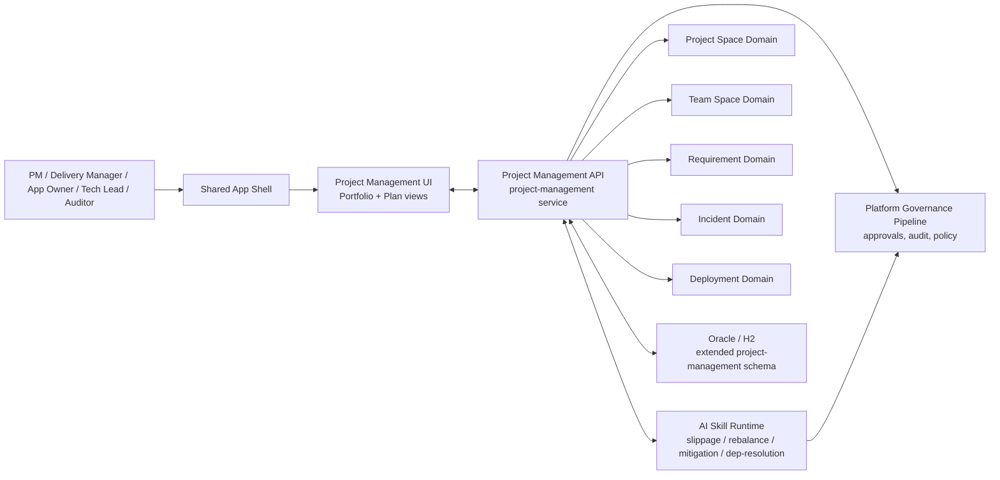
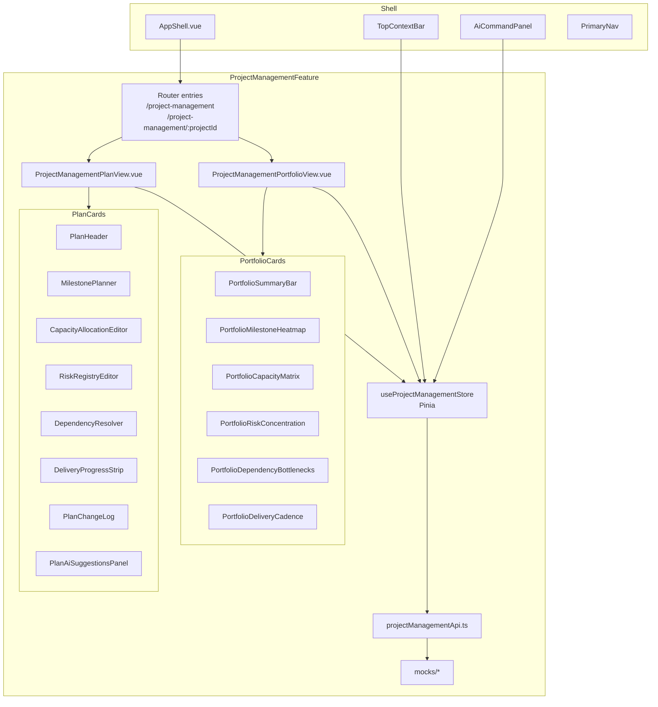
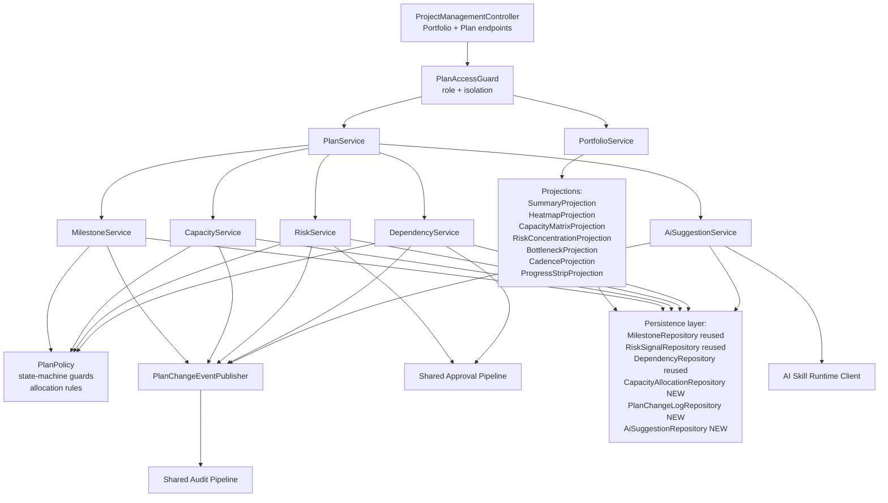
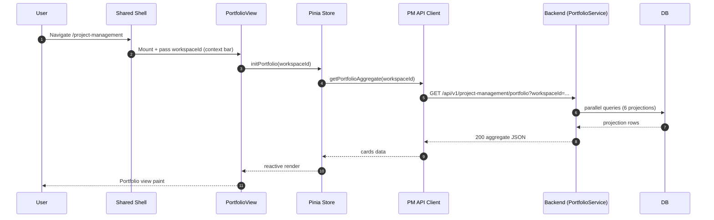
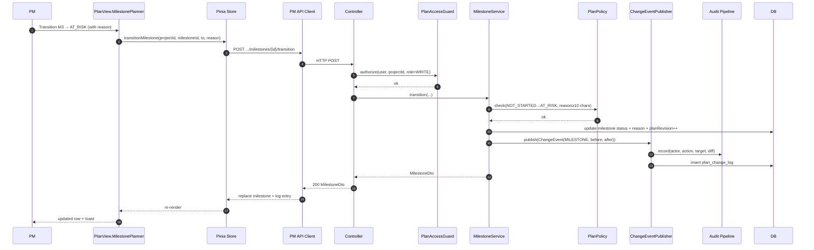
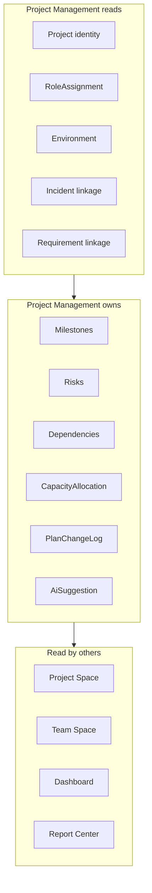
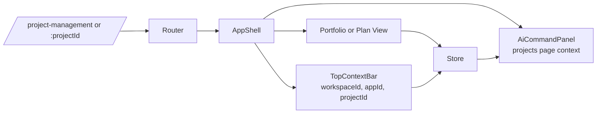
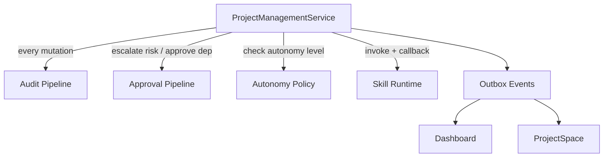
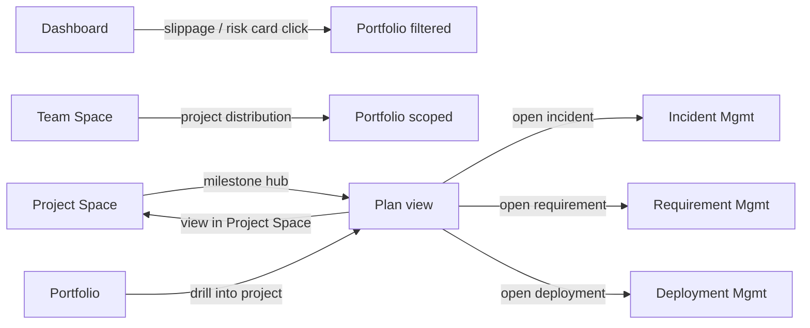

# Project Management Architecture

## Purpose

This document defines the architecture for the **Project Management** slice — the delivery operating plane that spans a Portfolio view (Workspace-scoped) and a Plan view (project-scoped) in the Agentic SDLC Control Tower.

It describes system context, component breakdown, data flow at a high level, state boundaries, integration with the shared app shell and cross-slice domains, non-functional constraints, and risks. Runtime sequences, state machines, and the ER/DTO/DDL catalog live in [project-management-data-flow.md](project-management-data-flow.md) and [project-management-data-model.md](project-management-data-model.md).

## Traceability

- Requirements: [../01-requirements/project-management-requirements.md](../01-requirements/project-management-requirements.md)
- Stories: [../02-user-stories/project-management-stories.md](../02-user-stories/project-management-stories.md)
- Spec: [../03-spec/project-management-spec.md](../03-spec/project-management-spec.md)
- PRD: [../01-requirements/agentic_sdlc_control_tower_prd_v0.9.md](../01-requirements/agentic_sdlc_control_tower_prd_v0.9.md) §11.5, §13, §15, §16

All Mermaid diagrams use Mermaid 8.x-compatible syntax per CLAUDE.md Lesson #7.

---

## 1. System Context

The Project Management page lives inside the shared app shell and interacts with the platform governance pipeline, AI skill runtime, and existing domain services (Project Space, Team Space, Requirement, Incident, Deployment). It neither owns Project identity (Platform Center) nor lifecycle artifacts (the lifecycle domain pages), but it actively mutates plan, capacity, risk, and dependency records.



### Actors

| Actor | Interface | Notes |
|-------|-----------|-------|
| PM / Delivery Manager / App Owner / Tech Lead / Auditor | HTTPS via Shell | Role-gated; audited |
| AI Skill Runtime | Async invocation + callback | Emits `AiSuggestion` records; outcome captured as Skill Execution |
| Platform Governance Pipeline | Synchronous RPC from `PMAPI` | Validates approvals, records audit, enforces autonomy policy |
| Cross-domain services (PS / TS / REQ / INC / DEPL) | HTTP (intra-process Spring) | Reuses entities for identity, members, incident linkage |

---

## 2. Component Breakdown

### 2.1 Frontend — `frontend/src/features/project-management/`

Two route-level views share a common feature module, stores, API client, and a majority of primitive components. The Portfolio view embeds six cards; the Plan view embeds nine cards (including the change log and AI panel projection). All cards reuse the shell's card / widget primitives.



### 2.2 Backend — `backend/src/main/java/com/sdlctower/domain/projectmanagement/`

Package-by-feature (CLAUDE.md Lesson #3) with sub-packages for controller / service / projection / persistence / dto / mapper / policy / event. Reuses existing `projectspace` persistence for Project, Milestone, Risk, Dependency; introduces own persistence for CapacityAllocation, PlanChangeLogEntry, AiSuggestion.



### 2.3 Responsibilities

| Component | Responsibility |
|-----------|----------------|
| `ProjectManagementController` | Thin HTTP adapter; input validation; delegates to service; maps DTOs |
| `PlanAccessGuard` | Resolves caller role; enforces Workspace / Project isolation; 403 on unauthorized |
| `PortfolioService` | Orchestrates read projections for the six Portfolio cards |
| `PlanService` | Orchestrates read projections for Plan cards; routes mutations |
| `MilestoneService` / `CapacityService` / `RiskService` / `DependencyService` | Domain logic + state-machine enforcement + event emission |
| `AiSuggestionService` | Consumes AI skill outputs, persists `AiSuggestion`, routes accept / dismiss |
| `PlanPolicy` | Pure validators: allowed transitions, required fields, over-allocation justification |
| `PlanChangeEventPublisher` | Writes change log + emits audit event via shared pipeline |
| Projections | Read-optimized queries for each card, strictly scoped |
| Persistence | JPA repositories; reused where possible, new where needed |

---

## 3. Data Flow (High Level)

### 3.1 Portfolio view initial load



### 3.2 Plan view milestone mutation (happy path)



### 3.3 AI suggestion lifecycle

```mermaid
sequenceDiagram
    autonumber
    participant Skill as AI Skill Runtime
    participant BE as AiSuggestionService
    participant DB as DB
    participant PV as PlanView
    participant Store as Pinia Store
    participant U as PM

    Skill->>BE: POST /internal/ai-suggestions (kind, target, payload, confidence)
    BE->>DB: upsert ai_suggestion (state=PENDING)
    PV->>Store: refreshAiSuggestions(projectId)
    Store->>BE: GET .../plan/{projectId}/ai-suggestions
    BE-->>Store: list of PENDING suggestions
    Store-->>PV: render chips / banners
    U->>PV: Accept suggestion
    PV->>Store: accept(suggestionId)
    Store->>BE: POST .../ai-suggestions/{id}/accept
    BE->>DB: ai_suggestion.state=ACCEPTED, log, audit
    BE-->>Store: 200 with applied-change summary
    Store-->>PV: mark accepted + show audit link
    Note over U,BE: V1 "accept" does NOT auto-apply entity changes (except cell-level edits already authored by PM); it records acceptance + emits a follow-up action record.
```

---

## 4. State Boundaries

The slice lives alongside existing slices and must not duplicate ownership. State ownership:

| Concern | Owner | Consumer |
|---------|-------|----------|
| Project identity (name, lifecycle stage, workspaceId) | Platform Center | Project Management reads |
| Project health aggregate | Project Space (derived) | Project Management consumes derivation |
| Milestone canonical record | **Project Management** (write) | Project Space reads |
| Risk canonical record | **Project Management** (write) | Project Space reads |
| Dependency canonical record | **Project Management** (write) | Project Space reads |
| Environment inventory | Project Space + Deployment Management | Project Management does not own |
| Member / Role assignments | Access Management | Project Management reads |
| Capacity Allocation | **Project Management** (own) | Portfolio view consumes; Dashboard may surface |
| Plan Change Log | **Project Management** (own) | Auditor reads; Report Center may export |
| AI Suggestion | **Project Management** (own) | AI Command Panel renders; audit pipeline records |



The rewrite of **Milestone / Risk / Dependency ownership to Project Management** is the main shift from Project Space ownership. Project Space was always read-only for these (REQ-PS-06); this slice makes the writer explicit.

---

## 5. Integration

### 5.1 Frontend Shell Integration



- Reuses shell primitives: `AppShell.vue`, `TopContextBar`, `AiCommandPanel`, `PrimaryNav`.
- Pinia store subscribes to context bar changes; Plan view may auto-resolve Workspace when `projectId.workspaceId ≠ context.workspaceId` (REQ-PM-172).
- AI Command Panel reads the store's `currentPageContext` to populate suggested-action chips.

### 5.2 Backend Platform Integration



- Every mutation emits an **audit event** via the shared platform pipeline.
- Risk escalations and dependency approvals route through the **shared Approval pipeline** (no PM-specific approval implementation).
- **Autonomy Policy** is read-only from PM; the indicator in the Plan Header reflects Platform Center's current setting.
- An **Outbox** pattern publishes change events so Dashboard and Project Space can eventually update their derived aggregates. V1 uses on-load + manual refresh; the outbox also feeds projection refreshes.

### 5.3 Cross-Slice Navigation



---

## 6. Non-Functional Constraints

- **Performance**: Portfolio first-paint ≤ 400ms, Plan first-paint ≤ 300ms, mutation ≤ 500ms p95 local / 1s p95 staging (REQ-PM-192, REQ-PM-193).
- **Isolation**: Workspace-strict for Portfolio, Project-strict for Plan; Parent-Workspace auto-resolve (REQ-PM-170–172).
- **Audit**: Every mutation + AI outcome recorded via shared pipeline (REQ-PM-160).
- **Authorization**: 403 on out-of-role writes with structured error (REQ-PM-161).
- **Flyway**: All schema changes via migrations; no `ddl-auto: update` (REQ-PM-195).
- **Stack**: Vue 3 / Vite / Pinia / TypeScript frontend; Spring Boot 3.x / Java 21 / JPA / H2-local / Oracle-prod backend (CLAUDE.md Lessons #2, #3).
- **Compatibility**: Reuses `ApiResponse<T>` envelope and `SectionResult<T>` per the shared conventions.

---

## 7. Risks & Mitigations

| Risk | Impact | Mitigation |
|------|--------|------------|
| Duplicate ownership between Project Space and Project Management | Conflicting data | Explicit state boundary (Section 4); Project Space is read-only for milestone / risk / dep |
| Capacity allocation growing quadratically (members × milestones) | Slow Plan load | Window-scoped storage (default current milestone horizon); pagination in V2 |
| AI suggestion spam on repeatedly-dismissed items | PM ignores panel | 24h suppression window per (target, kind) |
| Cross-project counter-signature deadlocks | Dependencies stuck | Counter-signature requires target-side write role; escalation path to Application Owner |
| Plan change log retention grows unbounded | DB bloat | 180-day hot window (REQ-PM-130); older entries to Report Center |
| Autonomy level changed mid-session | Inconsistent behavior | Plan header polls autonomy indicator; cache TTL ≤ 60s |
| Portfolio view displays stale data across projects | Misleading PMO decisions | Explicit "last refreshed" timestamp + manual refresh; auto-refresh on tab focus |
| Mutation without matching audit entry | Compliance gap | `PlanChangeEventPublisher` atomic with DB transaction (outbox); monitored by platform |
| Over-allocation silently saved | Coverage failure | Server rejects without `justification` string when row total > 100%; UI enforces same |
| Cross-slice naming drift (Risk state machine) | Developer confusion | This doc is the source of truth for PM-owned state machines; Project Space design doc links back |

---

## 8. Open Questions

1. Does Capacity Allocation need a rolling time window in V1, or is single current-milestone-horizon sufficient? (Current assumption: single window; extend in V2.)
2. Should the Plan Change Log retention be per-Workspace configurable? (Current assumption: platform-default 180 days; override via Platform Center later.)
3. Which AI skill pack owns slippage prediction? (Assumed: platform `PlanHealth` default; confirm with AI Center owner.)
4. Cross-Workspace rollup for multi-Workspace users — V2 or never? (V2 candidate; PMO interview needed.)
5. Should AI suggestions that are auto-applied in high-autonomy mode (V2) still require an explicit accept record, or is the auto-apply itself the acceptance? (V1 always requires accept, V2 pending design.)

---

## 9. Decisions Captured

- **D1** — Portfolio and Plan are **one slice**, not two. They share entities, ownership, governance, and most tests. (2026-04-17, user decision.)
- **D2** — Milestone / Risk / Dependency canonical write authority moves from "implicit" to **explicit Project Management** ownership. Project Space becomes read-only consumer (already aligned with REQ-PS-06).
- **D3** — Capacity Allocation is a **new entity** owned by this slice. It is not duplicated in Team Space (which only has member-level attributes).
- **D4** — AI suggestions are **first-class entities** with a persisted lifecycle, not ephemeral UI chips. (Needed for audit and suppression.)
- **D5** — V1 uses on-load + manual-refresh; no WebSocket push. Change propagation to Project Space / Dashboard goes through the outbox on a best-effort basis.
- **D6** — Acceptance of an AI suggestion **records acceptance** but does not auto-apply entity changes (beyond cell-level edits the PM has already authored). Auto-apply is V2 under Autonomy Policy.
- **D7** — Dependency internal approvals require **in-app counter-signature**; external targets require a logged contract commitment string.
- **D8** — Over-allocation (row total > 100%) is **soft-flagged** but requires a `justification` string to persist.
