# Project Management Data Flow

## Purpose

Runtime sequences, state machines, error cascade, and refresh strategy for the Project Management slice. This document operationalizes the architecture in [project-management-architecture.md](project-management-architecture.md) and the contracts in [../05-design/contracts/project-management-API_IMPLEMENTATION_GUIDE.md](../05-design/contracts/project-management-API_IMPLEMENTATION_GUIDE.md).

All Mermaid diagrams use Mermaid 8.x-compatible syntax.

---

## 1. Load Lifecycle

### 1.1 Portfolio view — Phase A (frontend-only, mocked)

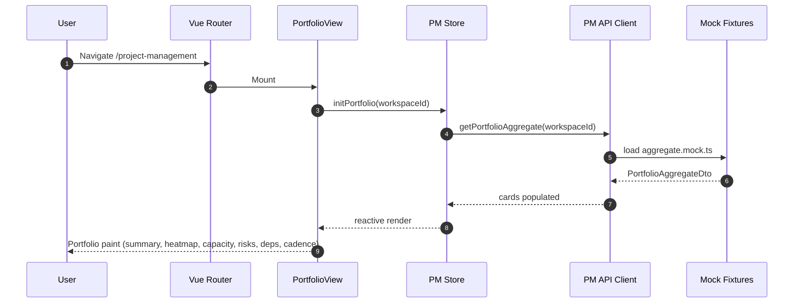

### 1.2 Portfolio view — Phase B (backend integration)

```mermaid
sequenceDiagram
    autonumber
    participant U as User
    participant View as PortfolioView
    participant Store as PM Store
    participant Api as PM API Client
    participant BE as ProjectManagementController
    participant Svc as PortfolioService
    participant Proj as 6x Projections
    participant DB as DB

    U->>View: /project-management?workspaceId=ws-42
    View->>Store: initPortfolio(ws-42)
    Store->>Api: getPortfolioAggregate(ws-42)
    Api->>BE: GET /api/v1/project-management/portfolio?workspaceId=ws-42
    BE->>Svc: aggregate(ws-42, caller)
    par 6 parallel projections
      Svc->>Proj: summaryProjection(ws-42)
      Proj->>DB: SELECT counters
      DB-->>Proj: rows
      Proj-->>Svc: Summary data
    and
      Svc->>Proj: heatmapProjection(ws-42, week)
      Proj->>DB: SELECT milestone snapshot
      DB-->>Proj: rows
      Proj-->>Svc: Heatmap data
    and
      Svc->>Proj: capacityMatrixProjection(ws-42)
      Proj->>DB: SELECT capacity_allocation JOIN member
      DB-->>Proj: rows
      Proj-->>Svc: Capacity data
    and
      Svc->>Proj: riskConcentrationProjection(ws-42)
      Proj->>DB: SELECT risk_signal
      DB-->>Proj: rows
      Proj-->>Svc: Risks data
    and
      Svc->>Proj: bottleneckProjection(ws-42)
      Proj->>DB: SELECT project_dependencies
      DB-->>Proj: rows
      Proj-->>Svc: Bottleneck data
    and
      Svc->>Proj: cadenceProjection(ws-42)
      Proj->>DB: SELECT milestone history
      DB-->>Proj: rows
      Proj-->>Svc: Cadence data
    end
    Svc-->>BE: PortfolioAggregateDto(SectionResult&lt;T&gt; x6)
    BE-->>Api: 200 JSON
    Api-->>Store: cards populated
    Store-->>View: reactive render
    View-->>U: Portfolio paint
```

### 1.3 Plan view — Phase B initial load

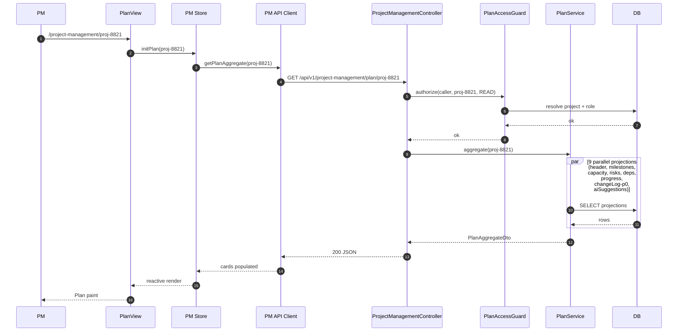

---

## 2. Error Cascade & Isolation

Every card hydrates independently. A failure in one projection must not block the rest.

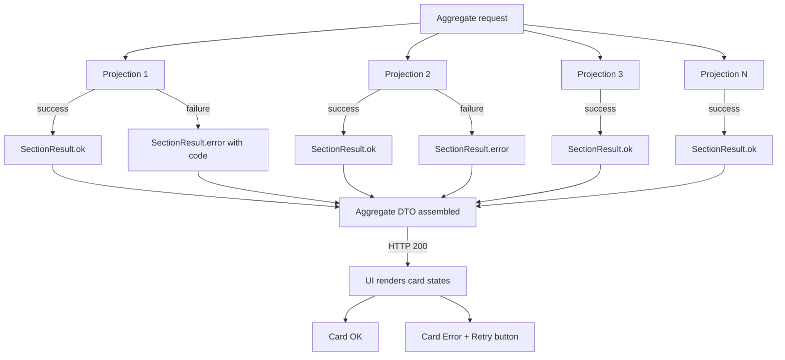

- Aggregate endpoint returns HTTP 200 even when some projections fail.
- Each projection result is wrapped in `SectionResult<T>` with `status: OK | ERROR | EMPTY` and, on error, a structured code + correlation id.
- UI renders per-card states; a "Retry" action calls the per-section endpoint rather than the aggregate.

---

## 3. Mutation Flows

### 3.1 Milestone transition (e.g., IN_PROGRESS → AT_RISK)

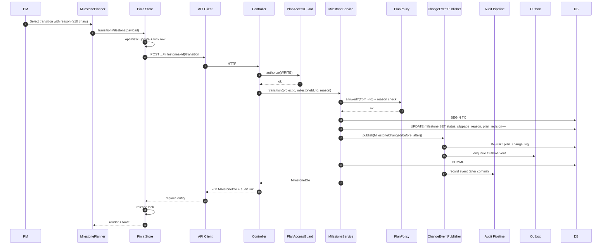

**Failure branches**:

- `PlanPolicy` rejects → Service raises `InvalidTransition` → Controller returns 409 with `{ code: "PM_INVALID_TRANSITION", from, to }` → Store rolls back optimistic update → UI toast "Transition not allowed".
- `Guard` denies → 403 `{ code: "PM_AUTH_FORBIDDEN" }` → UI toast "You do not have permission".
- `DB` constraint violation → 422 → UI toast with validation errors.
- Missing or too-short reason → 422 `{ code: "PM_SLIPPAGE_REASON_REQUIRED" }`.

### 3.2 Capacity cell batch update

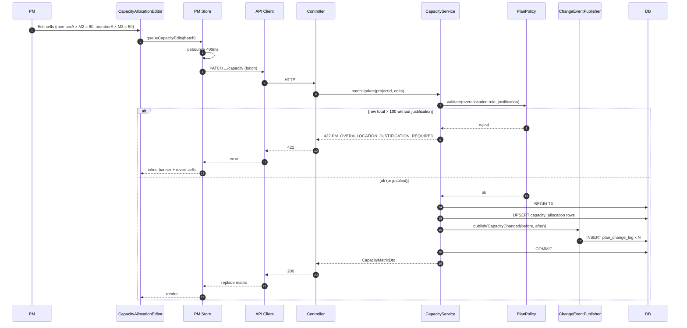

### 3.3 Risk escalation

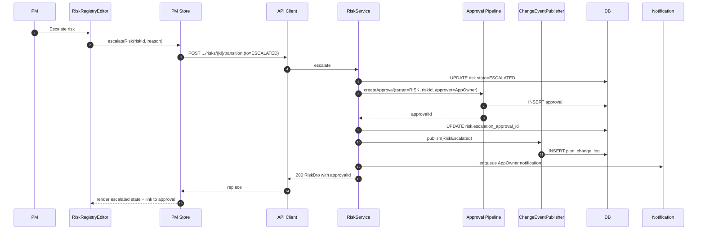

### 3.4 Dependency approval with counter-signature

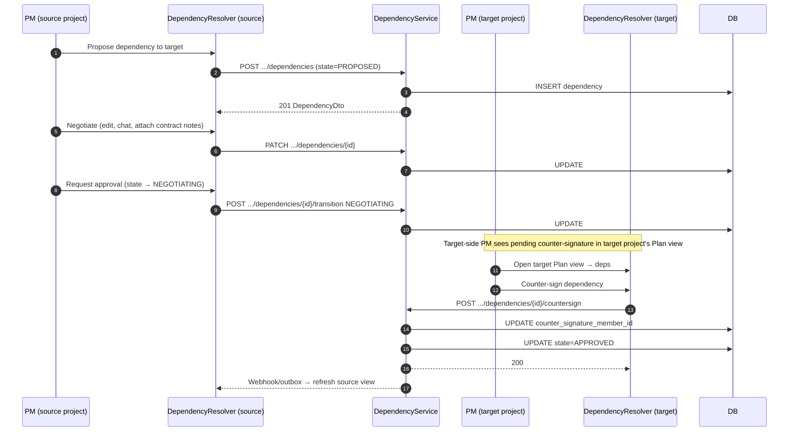

If the target is external (not a registered internal project), `countersign` is skipped and `APPROVED` instead requires a `contractCommitment` string ≥ 20 chars.

### 3.5 AI suggestion accept / dismiss

```mermaid
sequenceDiagram
    autonumber
    participant Skill as AI Skill Runtime
    participant BE as AiSuggestionService
    participant PV as Plan View
    participant Store as PM Store
    participant U as PM
    participant DB as DB
    participant Audit as Audit Pipeline

    Skill->>BE: POST /internal/ai-suggestions (kind, target, payload, confidence)
    BE->>DB: UPSERT ai_suggestion (PENDING, skill_execution_id)
    PV->>Store: periodic refresh (onFocus or refresh button)
    Store->>BE: GET .../plan/{projectId}/ai-suggestions
    BE-->>Store: list of PENDING
    U->>PV: Accept suggestion-X
    PV->>Store: accept(suggestionId)
    Store->>BE: POST .../ai-suggestions/{id}/accept
    BE->>DB: UPDATE ai_suggestion state=ACCEPTED
    BE->>DB: INSERT plan_change_log (AI actor)
    BE->>Audit: record skill-outcome ACCEPTED
    BE-->>Store: 200 with audit link
    Store-->>PV: mark accepted; hide chip
    U->>PV: Dismiss suggestion-Y
    PV->>Store: dismiss(suggestionId, reason)
    Store->>BE: POST .../ai-suggestions/{id}/dismiss
    BE->>DB: UPDATE state=DISMISSED; set suppression_until=now+24h
    BE->>DB: INSERT plan_change_log
    BE->>Audit: record skill-outcome DISMISSED
    BE-->>Store: 200
    Store-->>PV: hide chip; add to log
```

---

## 4. State Machines

### 4.1 Milestone

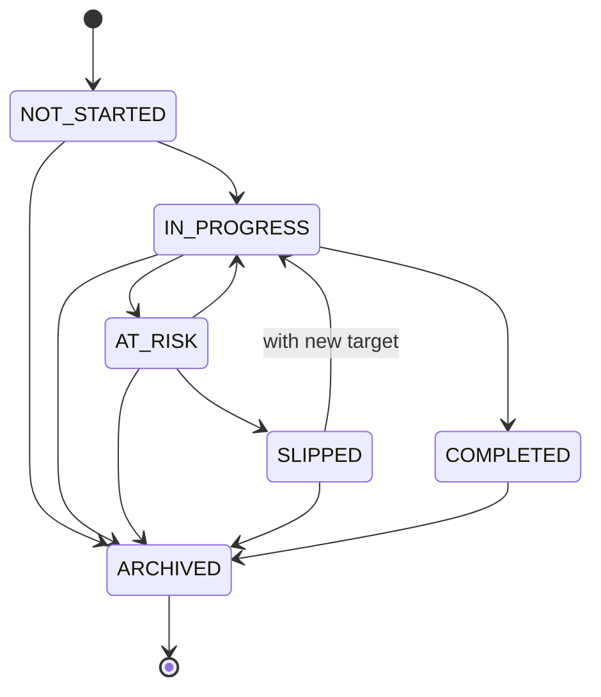

**Guards**:
- `IN_PROGRESS → AT_RISK`: `slippageReason` required, min 10 chars.
- `AT_RISK → SLIPPED`: `slippageReason` required (may be updated).
- `SLIPPED → IN_PROGRESS`: new `targetDate` required, ≥ today.
- `IN_PROGRESS → COMPLETED`: server stamps `completedAt`.
- Re-opening `COMPLETED` is **not allowed** in V1; archive and recreate instead.

### 4.2 Risk

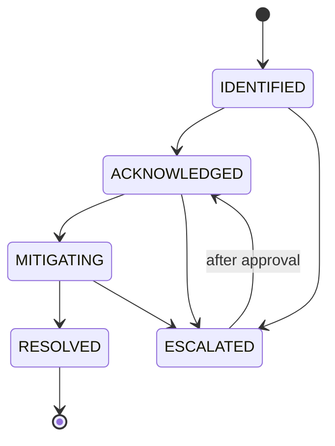

**Guards**:
- `ACKNOWLEDGED → MITIGATING`: `mitigationNote` required (≥ 20 chars).
- `MITIGATING → RESOLVED`: `resolutionNote` required.
- `→ ESCALATED`: creates a pending Approval; `escalationApprovalId` captured.

### 4.3 Dependency resolution

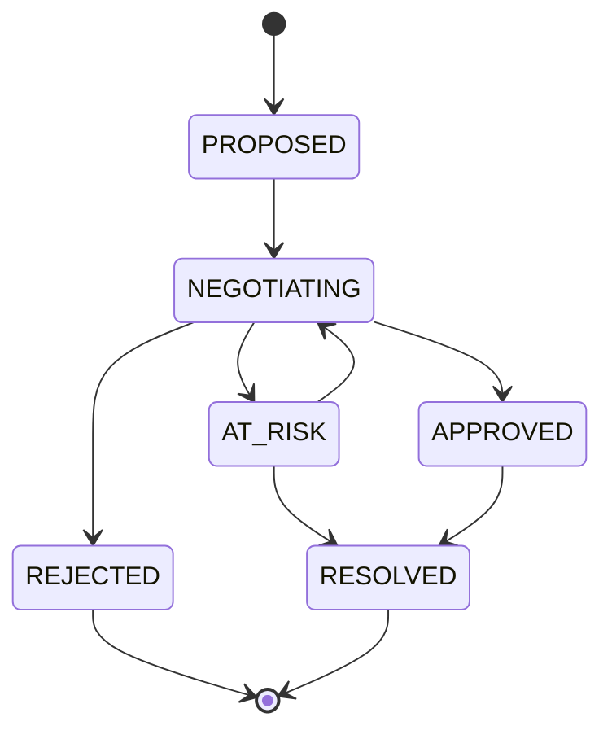

**Guards**:
- Internal `APPROVED`: requires counter-signature from a user with write role on the target project.
- External `APPROVED`: requires `contractCommitment` ≥ 20 chars.
- `REJECTED`: requires `rejectionReason` ≥ 10 chars.

### 4.4 AI suggestion

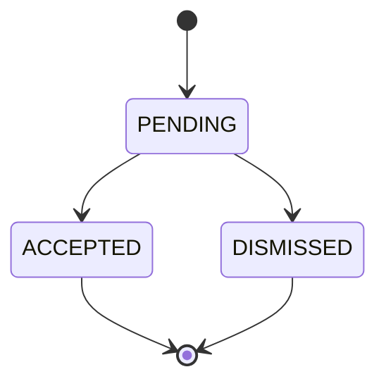

Dismissal sets `suppressionUntil = now + 24h`; the skill runtime must check this before emitting a new suggestion for the same `(targetType, targetId, kind)`.

---

## 5. Refresh Strategy

V1 is on-load + manual refresh, matching Project Space conventions.

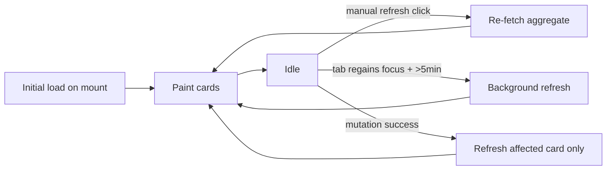

- A "last refreshed" timestamp is displayed on the Portfolio Summary Bar and the Plan Header.
- A "stale" banner appears when `now − lastRefreshed > 5 min` on the Portfolio view.
- Mutations refresh **only the affected card** and append to the Change Log card.
- No WebSocket push in V1. The backend emits outbox events for future consumers (Project Space projection refresh, Dashboard counters).

---

## 6. API Client Chain

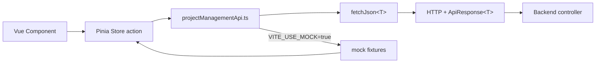

- `fetchJson<T>` unwraps the `ApiResponse<T>` envelope, returning either the payload or throwing a typed error.
- A Vite env flag (`VITE_USE_MOCK=true`) swaps the real HTTP client for mock fixtures — used through all of Phase A and during offline development.

---

## 7. Mutation Concurrency & Optimistic UI

- Every mutation takes a `planRevision` fencing token on the relevant entity (e.g., `milestone.plan_revision`).
- If the client sends a stale `planRevision`, the server returns 409 `PM_STALE_REVISION` with the latest revision; the client reloads the card and re-asks the user.
- Optimistic UI updates are applied locally before the server round-trips; rollback on non-2xx.
- Batch capacity edits are debounced 400ms on the client; the server treats the batch atomically (all or nothing).

---

## 8. Access Isolation at Runtime

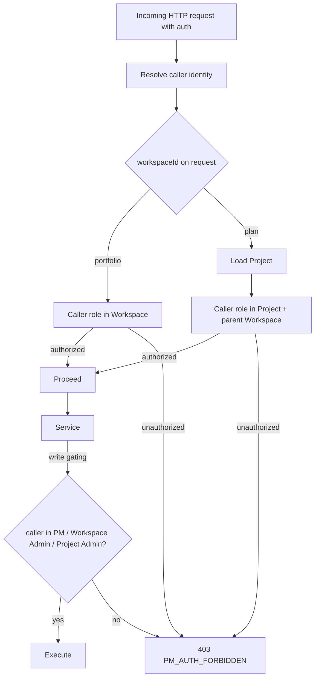

Read authority: Auditor, Project Contributor, PM, Tech Lead, Workspace Admin, Application Owner.
Write authority: Project Admin (includes PM), Workspace Admin, Application Owner (limited to approvals).

---

## 9. Plan Change Log Emission Rules

For every mutation:

1. Inside the database transaction, `PlanChangeEventPublisher` inserts a row into `plan_change_log` with:
   - `actorType` (`HUMAN` or `AI`), `actorId`, `skillExecutionId` (nullable)
   - `action` (`CREATE`, `UPDATE`, `TRANSITION`, `ARCHIVE`, `ACCEPT_AI_SUGGESTION`, `DISMISS_AI_SUGGESTION`, `ESCALATE`, `COUNTERSIGN`)
   - `targetType` (`MILESTONE`, `RISK`, `DEPENDENCY`, `CAPACITY_ALLOCATION`, `AI_SUGGESTION`)
   - `targetId`, `projectId`
   - `before` and `after` JSON (before is null for creates, after is null for archives)
   - `at`, `correlationId`, `auditLinkId`
2. After transaction commit, an outbox event is emitted to the shared platform audit pipeline.
3. The Plan Change Log card subscribes to `projectId` and reads paginated entries.

---

## 10. Caching & Invalidation

- Frontend: Pinia store caches aggregate responses per `projectId` or `workspaceId` with a soft TTL of 5 min; a successful mutation invalidates only the affected card cache.
- Backend: per-projection in-memory cache (Caffeine) with 30s TTL for the Portfolio aggregate under heavy read; Plan aggregate is not cached (edit-heavy).
- Outbox event consumers invalidate downstream caches (Project Space, Dashboard) on best-effort basis.

---

## 11. Telemetry

- Every aggregate endpoint logs: `workspaceId` or `projectId`, caller role, projection timings per section, total latency, section failure count.
- Every mutation logs: actor, target, before→after, correlation id, duration.
- Every AI suggestion logs: skill id, confidence, accept/dismiss outcome latency.
- Structured JSON logs for correlation with the platform audit.

---

## 12. Summary

| Flow | Endpoint(s) | State machine | Audit entry kind |
|------|-------------|---------------|------------------|
| Portfolio aggregate | `GET /portfolio`, `GET /portfolio/{section}` | — | — |
| Plan aggregate | `GET /plan/{projectId}`, `GET /plan/{projectId}/{section}` | — | — |
| Milestone CRUD + transition + archive | `POST/PATCH/POST/POST .../milestones*` | Milestone SM | `CREATE`, `UPDATE`, `TRANSITION`, `ARCHIVE` |
| Capacity batch update | `PATCH .../capacity` | — | `UPDATE` per cell |
| Risk CRUD + transition + escalate | `POST/PATCH/POST .../risks*` | Risk SM | `CREATE`, `UPDATE`, `TRANSITION`, `ESCALATE` |
| Dependency CRUD + transition + countersign | `POST/PATCH/POST/POST .../dependencies*` | Dependency SM | `CREATE`, `UPDATE`, `TRANSITION`, `COUNTERSIGN` |
| AI suggestion accept / dismiss | `POST .../ai-suggestions/{id}/{accept\|dismiss}` | AI SM | `ACCEPT_AI_SUGGESTION`, `DISMISS_AI_SUGGESTION` |
