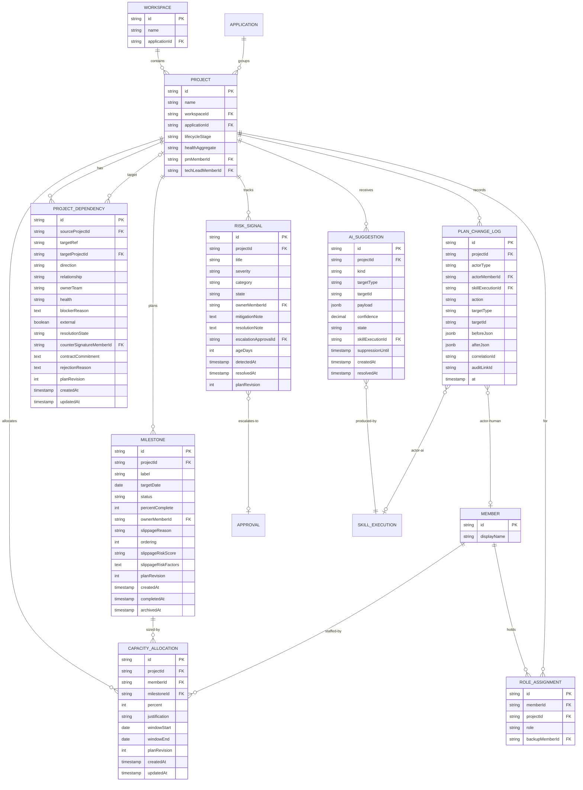

# Project Management Data Model

## Purpose

Defines the domain model, frontend types, backend DTOs / JPA entities, and database schema (DDL) for the Project Management slice. Reuses existing entities from [project-space-data-model.md](project-space-data-model.md) and [team-space-data-model.md](team-space-data-model.md) and extends them with PM-specific fields + introduces three new entities (CapacityAllocation, PlanChangeLogEntry, AiSuggestion).

## Traceability

- Requirements: [../01-requirements/project-management-requirements.md](../01-requirements/project-management-requirements.md)
- Spec: [../03-spec/project-management-spec.md](../03-spec/project-management-spec.md)
- Architecture: [project-management-architecture.md](project-management-architecture.md)
- Data flow: [project-management-data-flow.md](project-management-data-flow.md)

All Mermaid diagrams use 8.x-compatible syntax.

---

## 1. Domain Model (ER Diagram)



### Reused vs New

| Entity | Status | Notes |
|--------|--------|-------|
| `project` | Reused | Canonical in Platform Center |
| `milestone` | **Extended** | Adds `slippageRiskScore`, `slippageRiskFactors`, `planRevision`, `archivedAt` |
| `risk_signal` | **Extended** | Adds `state`, `ownerMemberId`, `mitigationNote`, `resolutionNote`, `escalationApprovalId`, `planRevision` |
| `project_dependency` | **Extended** | Adds `resolutionState`, `counterSignatureMemberId`, `contractCommitment`, `rejectionReason`, `planRevision` |
| `environment` | Reused read-only | Not owned by PM |
| `member`, `role_assignment` | Reused read-only | Owned by Access Management |
| `capacity_allocation` | **New** | PM-owned |
| `plan_change_log` | **New** | PM-owned (mirror of audit stream) |
| `ai_suggestion` | **New** | PM-owned |

---

## 2. Enumerations

```typescript
// frontend/src/features/project-management/types/enums.ts

export type MilestoneStatus =
  | 'NOT_STARTED'
  | 'IN_PROGRESS'
  | 'AT_RISK'
  | 'COMPLETED'
  | 'SLIPPED'
  | 'ARCHIVED';

export type SlippageRiskScore = 'LOW' | 'MEDIUM' | 'HIGH' | 'NONE';

export type RiskSeverity = 'CRITICAL' | 'HIGH' | 'MEDIUM' | 'LOW';

export type RiskCategory =
  | 'TECHNICAL'
  | 'SECURITY'
  | 'DELIVERY'
  | 'DEPENDENCY'
  | 'GOVERNANCE';

export type RiskState =
  | 'IDENTIFIED'
  | 'ACKNOWLEDGED'
  | 'MITIGATING'
  | 'RESOLVED'
  | 'ESCALATED';

export type DependencyRelationship = 'API' | 'DATA' | 'SCHEDULE' | 'SLA';
export type DependencyDirection = 'UPSTREAM' | 'DOWNSTREAM';
export type DependencyResolutionState =
  | 'PROPOSED'
  | 'NEGOTIATING'
  | 'APPROVED'
  | 'REJECTED'
  | 'AT_RISK'
  | 'RESOLVED';

export type HealthIndicator = 'GREEN' | 'YELLOW' | 'RED' | 'UNKNOWN';

export type AiSuggestionKind =
  | 'SLIPPAGE'
  | 'REBALANCE'
  | 'MITIGATION'
  | 'DEP_RESOLUTION';

export type AiSuggestionState = 'PENDING' | 'ACCEPTED' | 'DISMISSED';

export type PlanActorType = 'HUMAN' | 'AI';

export type PlanAction =
  | 'CREATE'
  | 'UPDATE'
  | 'TRANSITION'
  | 'ARCHIVE'
  | 'COUNTERSIGN'
  | 'ESCALATE'
  | 'ACCEPT_AI_SUGGESTION'
  | 'DISMISS_AI_SUGGESTION';

export type PlanTargetType =
  | 'MILESTONE'
  | 'RISK'
  | 'DEPENDENCY'
  | 'CAPACITY_ALLOCATION'
  | 'AI_SUGGESTION';

export type SectionStatus = 'OK' | 'EMPTY' | 'ERROR';
```

---

## 3. Frontend Types

### 3.1 Portfolio view types

```typescript
// frontend/src/features/project-management/types/portfolio.ts

import type { HealthIndicator, MilestoneStatus, RiskSeverity, RiskCategory } from './enums';
import type { SectionResult } from '@/shared/types/section';

export interface PortfolioSummary {
  workspaceId: string;
  activeProjects: number;
  redProjects: number;
  atRiskOrSlippedMilestones: number;
  criticalRisks: number;
  blockedDependencies: number;
  pendingApprovals: number;
  aiPendingReview: number;
  lastRefreshedAt: string; // ISO8601
}

export interface HeatmapCell {
  projectId: string;
  windowLabel: string; // e.g. "2026-W16"
  dominantStatus: MilestoneStatus | 'NONE';
}

export interface HeatmapRow {
  projectId: string;
  projectName: string;
  cells: HeatmapCell[];
}

export interface PortfolioHeatmap {
  window: 'WEEK' | 'MONTH' | 'MILESTONE';
  columns: string[];
  rows: HeatmapRow[];
}

export interface CapacityCell {
  projectId: string;
  percent: number;
}

export interface CapacityRow {
  memberId: string;
  displayName: string;
  totalPercent: number;
  flag: 'OK' | 'OVER' | 'UNDER';
  cells: CapacityCell[];
}

export interface PortfolioCapacity {
  projects: { projectId: string; projectName: string }[];
  rows: CapacityRow[];
  underThreshold: number; // from Workspace config
}

export interface PortfolioRiskItem {
  riskId: string;
  projectId: string;
  projectName: string;
  title: string;
  severity: RiskSeverity;
  category: RiskCategory;
  ownerMemberId: string | null;
  ageDays: number;
  mitigationNote: string | null;
  aiRecommendationId: string | null;
}

export interface RiskHeatmapCell {
  severity: RiskSeverity;
  category: RiskCategory;
  count: number;
}

export interface PortfolioRiskConcentration {
  topRisks: PortfolioRiskItem[];
  severityCategoryHeatmap: RiskHeatmapCell[];
}

export interface BottleneckItem {
  dependencyId: string;
  sourceProjectId: string;
  sourceProjectName: string;
  targetProjectId: string | null;
  targetDescriptor: string;
  external: boolean;
  relationship: 'API' | 'DATA' | 'SCHEDULE' | 'SLA';
  blockerReason: string;
  ownerTeam: string;
  daysBlocked: number;
  aiProposalId: string | null;
}

export interface CadenceMetric {
  key: 'THROUGHPUT' | 'CYCLE_TIME_MEDIAN' | 'CYCLE_TIME_P90' | 'HIT_RATE' | 'PLAN_STABILITY';
  window: '4W' | '12W';
  value: number | null;
  deltaAbs: number | null;
  trend: 'UP' | 'DOWN' | 'FLAT' | null;
}

export interface PortfolioAggregate {
  summary: SectionResult<PortfolioSummary>;
  heatmap: SectionResult<PortfolioHeatmap>;
  capacity: SectionResult<PortfolioCapacity>;
  risks: SectionResult<PortfolioRiskConcentration>;
  bottlenecks: SectionResult<BottleneckItem[]>;
  cadence: SectionResult<CadenceMetric[]>;
}
```

### 3.2 Plan view types

```typescript
// frontend/src/features/project-management/types/plan.ts

import type {
  MilestoneStatus,
  SlippageRiskScore,
  RiskSeverity,
  RiskCategory,
  RiskState,
  DependencyRelationship,
  DependencyDirection,
  DependencyResolutionState,
  HealthIndicator,
  AiSuggestionKind,
  AiSuggestionState,
  PlanActorType,
  PlanAction,
  PlanTargetType,
} from './enums';
import type { SectionResult } from '@/shared/types/section';

export interface PlanHeader {
  projectId: string;
  projectName: string;
  workspaceId: string;
  workspaceName: string;
  applicationId: string;
  applicationName: string;
  lifecycleStage: 'DISCOVERY' | 'DELIVERY' | 'STEADY_STATE' | 'RETIRING';
  planHealth: HealthIndicator;
  planHealthFactors: string[];
  nextMilestone: { id: string; label: string; targetDate: string } | null;
  pmMemberId: string;
  pmDisplayName: string;
  pmBackupMemberId: string | null;
  autonomyLevel: 'L1' | 'L2' | 'L3' | 'L4';
  lastUpdatedAt: string;
}

export interface SlippagePrediction {
  score: SlippageRiskScore;
  factors: { label: string; evidence: string | null }[];
  computedAt: string | null;
}

export interface Milestone {
  id: string;
  projectId: string;
  label: string;
  description: string | null;
  targetDate: string;
  status: MilestoneStatus;
  percentComplete: number;
  ownerMemberId: string;
  ownerDisplayName: string;
  slippageReason: string | null;
  ordering: number;
  slippage: SlippagePrediction | null;
  planRevision: number;
  createdAt: string;
  completedAt: string | null;
  archivedAt: string | null;
}

export interface CapacityAllocationCell {
  memberId: string;
  milestoneId: string;
  percent: number;
  justification: string | null;
  windowStart: string;
  windowEnd: string;
}

export interface PlanCapacityMatrix {
  milestones: { id: string; label: string; ordering: number }[];
  members: { id: string; displayName: string; hasBackup: boolean; onCall: boolean }[];
  cells: CapacityAllocationCell[];
  rowTotals: Record<string, number>;
  columnTotals: Record<string, number>;
  underThreshold: number;
}

export interface Risk {
  id: string;
  projectId: string;
  title: string;
  severity: RiskSeverity;
  category: RiskCategory;
  state: RiskState;
  ownerMemberId: string | null;
  ownerDisplayName: string | null;
  ageDays: number;
  mitigationNote: string | null;
  resolutionNote: string | null;
  linkedIncidentId: string | null;
  linkedApprovalId: string | null;
  linkedTaskId: string | null;
  escalationApprovalId: string | null;
  planRevision: number;
  detectedAt: string;
  resolvedAt: string | null;
}

export interface Dependency {
  id: string;
  sourceProjectId: string;
  targetRef: string;
  targetProjectId: string | null;
  targetProjectName: string | null;
  external: boolean;
  direction: DependencyDirection;
  relationship: DependencyRelationship;
  ownerTeam: string;
  health: HealthIndicator;
  blockerReason: string | null;
  resolutionState: DependencyResolutionState;
  counterSignatureMemberId: string | null;
  contractCommitment: string | null;
  rejectionReason: string | null;
  planRevision: number;
  createdAt: string;
  updatedAt: string;
}

export interface DeliveryProgressNode {
  node:
    | 'REQUIREMENT' | 'STORY' | 'SPEC' | 'ARCHITECTURE' | 'DESIGN'
    | 'TASKS' | 'CODE' | 'TEST' | 'DEPLOY' | 'INCIDENT' | 'LEARNING';
  throughput: number;
  priorThroughput: number;
  health: HealthIndicator;
  slipped: boolean;
  deepLink: string;
}

export interface PlanChangeLogEntry {
  id: string;
  projectId: string;
  actorType: PlanActorType;
  actorMemberId: string | null;
  actorDisplayName: string | null;
  skillExecutionId: string | null;
  action: PlanAction;
  targetType: PlanTargetType;
  targetId: string;
  beforeJson: unknown;
  afterJson: unknown;
  correlationId: string;
  auditLinkId: string;
  at: string;
}

export interface AiSuggestion {
  id: string;
  projectId: string;
  kind: AiSuggestionKind;
  targetType: PlanTargetType;
  targetId: string;
  payload: {
    summary: string;
    details?: string;
    evidence?: { label: string; href: string }[];
  };
  confidence: number; // 0.0 – 1.0
  state: AiSuggestionState;
  skillExecutionId: string;
  suppressionUntil: string | null;
  createdAt: string;
  resolvedAt: string | null;
}

export interface PlanAggregate {
  header: SectionResult<PlanHeader>;
  milestones: SectionResult<Milestone[]>;
  capacity: SectionResult<PlanCapacityMatrix>;
  risks: SectionResult<Risk[]>;
  dependencies: SectionResult<Dependency[]>;
  progress: SectionResult<DeliveryProgressNode[]>;
  changeLog: SectionResult<{ entries: PlanChangeLogEntry[]; page: number; total: number }>;
  aiSuggestions: SectionResult<AiSuggestion[]>;
}
```

---

## 4. Backend DTOs (Java 21 records)

```java
// backend/src/main/java/com/sdlctower/domain/projectmanagement/dto/PortfolioAggregateDto.java
package com.sdlctower.domain.projectmanagement.dto;

import com.sdlctower.shared.dto.SectionResultDto;

public record PortfolioAggregateDto(
    SectionResultDto<PortfolioSummaryDto> summary,
    SectionResultDto<PortfolioHeatmapDto> heatmap,
    SectionResultDto<PortfolioCapacityDto> capacity,
    SectionResultDto<PortfolioRiskConcentrationDto> risks,
    SectionResultDto<java.util.List<BottleneckDto>> bottlenecks,
    SectionResultDto<java.util.List<CadenceMetricDto>> cadence
) {}
```

```java
public record PortfolioSummaryDto(
    String workspaceId,
    int activeProjects,
    int redProjects,
    int atRiskOrSlippedMilestones,
    int criticalRisks,
    int blockedDependencies,
    int pendingApprovals,
    int aiPendingReview,
    java.time.Instant lastRefreshedAt
) {}

public record PortfolioHeatmapDto(
    String window,
    java.util.List<String> columns,
    java.util.List<HeatmapRowDto> rows
) {}

public record HeatmapRowDto(String projectId, String projectName, java.util.List<HeatmapCellDto> cells) {}
public record HeatmapCellDto(String windowLabel, String dominantStatus) {}

public record PortfolioCapacityDto(
    java.util.List<ProjectRefDto> projects,
    java.util.List<CapacityRowDto> rows,
    int underThreshold
) {}
public record ProjectRefDto(String projectId, String projectName) {}
public record CapacityRowDto(
    String memberId,
    String displayName,
    int totalPercent,
    String flag, // OK / OVER / UNDER
    java.util.List<CapacityCellDto> cells
) {}
public record CapacityCellDto(String projectId, int percent) {}

public record PortfolioRiskConcentrationDto(
    java.util.List<PortfolioRiskItemDto> topRisks,
    java.util.List<RiskHeatmapCellDto> severityCategoryHeatmap
) {}
public record PortfolioRiskItemDto(
    String riskId, String projectId, String projectName,
    String title, String severity, String category,
    String ownerMemberId, int ageDays, String mitigationNote,
    String aiRecommendationId
) {}
public record RiskHeatmapCellDto(String severity, String category, int count) {}

public record BottleneckDto(
    String dependencyId, String sourceProjectId, String sourceProjectName,
    String targetProjectId, String targetDescriptor, boolean external,
    String relationship, String blockerReason, String ownerTeam,
    int daysBlocked, String aiProposalId
) {}

public record CadenceMetricDto(
    String key, String window, Double value,
    Double deltaAbs, String trend
) {}
```

```java
// Plan-side DTOs
public record PlanAggregateDto(
    SectionResultDto<PlanHeaderDto> header,
    SectionResultDto<java.util.List<MilestoneDto>> milestones,
    SectionResultDto<PlanCapacityMatrixDto> capacity,
    SectionResultDto<java.util.List<RiskDto>> risks,
    SectionResultDto<java.util.List<DependencyDto>> dependencies,
    SectionResultDto<java.util.List<DeliveryProgressNodeDto>> progress,
    SectionResultDto<ChangeLogPageDto> changeLog,
    SectionResultDto<java.util.List<AiSuggestionDto>> aiSuggestions
) {}

public record PlanHeaderDto(
    String projectId, String projectName,
    String workspaceId, String workspaceName,
    String applicationId, String applicationName,
    String lifecycleStage, String planHealth,
    java.util.List<String> planHealthFactors,
    NextMilestoneRefDto nextMilestone,
    String pmMemberId, String pmDisplayName,
    String pmBackupMemberId, String autonomyLevel,
    java.time.Instant lastUpdatedAt
) {}
public record NextMilestoneRefDto(String id, String label, java.time.LocalDate targetDate) {}

public record MilestoneDto(
    String id, String projectId,
    String label, String description,
    java.time.LocalDate targetDate, String status,
    int percentComplete, String ownerMemberId, String ownerDisplayName,
    String slippageReason, int ordering,
    SlippagePredictionDto slippage, int planRevision,
    java.time.Instant createdAt, java.time.Instant completedAt, java.time.Instant archivedAt
) {}
public record SlippagePredictionDto(
    String score, java.util.List<SlippageFactorDto> factors, java.time.Instant computedAt
) {}
public record SlippageFactorDto(String label, String evidence) {}

public record PlanCapacityMatrixDto(
    java.util.List<MilestoneRefDto> milestones,
    java.util.List<MemberRefDto> members,
    java.util.List<CapacityCellRichDto> cells,
    java.util.Map<String, Integer> rowTotals,
    java.util.Map<String, Integer> columnTotals,
    int underThreshold
) {}
public record MilestoneRefDto(String id, String label, int ordering) {}
public record MemberRefDto(String id, String displayName, boolean hasBackup, boolean onCall) {}
public record CapacityCellRichDto(
    String memberId, String milestoneId, int percent, String justification,
    java.time.LocalDate windowStart, java.time.LocalDate windowEnd
) {}

public record RiskDto(
    String id, String projectId, String title,
    String severity, String category, String state,
    String ownerMemberId, String ownerDisplayName,
    int ageDays, String mitigationNote, String resolutionNote,
    String linkedIncidentId, String linkedApprovalId, String linkedTaskId,
    String escalationApprovalId, int planRevision,
    java.time.Instant detectedAt, java.time.Instant resolvedAt
) {}

public record DependencyDto(
    String id, String sourceProjectId,
    String targetRef, String targetProjectId, String targetProjectName,
    boolean external, String direction, String relationship,
    String ownerTeam, String health, String blockerReason,
    String resolutionState, String counterSignatureMemberId,
    String contractCommitment, String rejectionReason,
    int planRevision, java.time.Instant createdAt, java.time.Instant updatedAt
) {}

public record DeliveryProgressNodeDto(
    String node, int throughput, int priorThroughput,
    String health, boolean slipped, String deepLink
) {}

public record ChangeLogPageDto(
    java.util.List<PlanChangeLogEntryDto> entries, int page, int total
) {}
public record PlanChangeLogEntryDto(
    String id, String projectId,
    String actorType, String actorMemberId, String actorDisplayName,
    String skillExecutionId, String action, String targetType, String targetId,
    com.fasterxml.jackson.databind.JsonNode beforeJson,
    com.fasterxml.jackson.databind.JsonNode afterJson,
    String correlationId, String auditLinkId,
    java.time.Instant at
) {}

public record AiSuggestionDto(
    String id, String projectId,
    String kind, String targetType, String targetId,
    com.fasterxml.jackson.databind.JsonNode payload,
    double confidence, String state,
    String skillExecutionId, java.time.Instant suppressionUntil,
    java.time.Instant createdAt, java.time.Instant resolvedAt
) {}
```

### Mutation request DTOs

```java
public record CreateMilestoneRequest(
    String label,
    String description,
    java.time.LocalDate targetDate,
    String ownerMemberId,
    int ordering
) {}

public record UpdateMilestoneRequest(
    String label,
    String description,
    java.time.LocalDate targetDate,
    String ownerMemberId,
    int ordering,
    int planRevision // fencing token
) {}

public record TransitionMilestoneRequest(
    String to,
    String slippageReason,
    java.time.LocalDate newTargetDate, // required when SLIPPED → IN_PROGRESS
    int planRevision
) {}

public record CapacityBatchUpdateRequest(
    java.util.List<CapacityCellEditDto> edits
) {}
public record CapacityCellEditDto(
    String memberId, String milestoneId, int percent, String justification, int planRevision
) {}

public record CreateRiskRequest(
    String title, String severity, String category,
    String ownerMemberId,
    String linkedIncidentId, String linkedTaskId
) {}
public record UpdateRiskRequest(
    String title, String severity, String category,
    String ownerMemberId, int planRevision
) {}
public record TransitionRiskRequest(
    String to, String mitigationNote, String resolutionNote,
    String linkedIncidentId, int planRevision
) {}

public record CreateDependencyRequest(
    String targetRef, String targetProjectId,
    String direction, String relationship,
    String ownerTeam, String blockerReason
) {}
public record UpdateDependencyRequest(
    String ownerTeam, String blockerReason, int planRevision
) {}
public record TransitionDependencyRequest(
    String to, String rejectionReason,
    String contractCommitment, int planRevision
) {}
public record CounterSignRequest(int planRevision) {}

public record AcceptAiSuggestionRequest() {} // body empty; suggestion id in path
public record DismissAiSuggestionRequest(String reason) {}
```

---

## 5. JPA Entities (extensions + new)

```java
// backend/src/main/java/com/sdlctower/domain/projectmanagement/persistence/MilestoneEntity.java
// Extended: reuse existing MilestoneEntity from projectspace package; add new fields
@Entity @Table(name = "milestone")
public class MilestoneEntity {
  @Id private String id;
  private String projectId;
  private String label;
  @Column(length = 1000) private String description;
  private java.time.LocalDate targetDate;
  @Enumerated(EnumType.STRING) private MilestoneStatus status;
  private int percentComplete;
  private String ownerMemberId;
  @Column(length = 500) private String slippageReason;
  private int ordering;
  @Enumerated(EnumType.STRING) private SlippageRiskScore slippageRiskScore;
  @Column(columnDefinition = "CLOB") private String slippageRiskFactors; // JSON
  private int planRevision;
  private java.time.Instant createdAt;
  private java.time.Instant completedAt;
  private java.time.Instant archivedAt;
  // getters/setters
}
```

```java
@Entity @Table(name = "capacity_allocation",
        uniqueConstraints = @UniqueConstraint(columnNames = {"projectId","memberId","milestoneId","windowStart"}))
public class CapacityAllocationEntity {
  @Id private String id;
  private String projectId;
  private String memberId;
  private String milestoneId;
  private int percent;
  @Column(length = 500) private String justification;
  private java.time.LocalDate windowStart;
  private java.time.LocalDate windowEnd;
  private int planRevision;
  private java.time.Instant createdAt;
  private java.time.Instant updatedAt;
  // getters/setters
}
```

```java
@Entity @Table(name = "plan_change_log")
public class PlanChangeLogEntity {
  @Id private String id;
  private String projectId;
  @Enumerated(EnumType.STRING) private PlanActorType actorType;
  private String actorMemberId;
  private String skillExecutionId;
  @Enumerated(EnumType.STRING) private PlanAction action;
  @Enumerated(EnumType.STRING) private PlanTargetType targetType;
  private String targetId;
  @Column(columnDefinition = "CLOB") private String beforeJson;
  @Column(columnDefinition = "CLOB") private String afterJson;
  private String correlationId;
  private String auditLinkId;
  private java.time.Instant at;
}
```

```java
@Entity @Table(name = "ai_suggestion")
public class AiSuggestionEntity {
  @Id private String id;
  private String projectId;
  @Enumerated(EnumType.STRING) private AiSuggestionKind kind;
  @Enumerated(EnumType.STRING) private PlanTargetType targetType;
  private String targetId;
  @Column(columnDefinition = "CLOB") private String payloadJson;
  private double confidence;
  @Enumerated(EnumType.STRING) private AiSuggestionState state;
  private String skillExecutionId;
  private java.time.Instant suppressionUntil;
  private java.time.Instant createdAt;
  private java.time.Instant resolvedAt;
}
```

Existing `risk_signal` and `project_dependency` get column additions via Flyway migrations (see §6).

---

## 6. Database Schema (Flyway DDL)

All scripts follow CLAUDE.md rule #4. File naming: `V{n}__{description}.sql`, located under `backend/src/main/resources/db/migration/`.

### V20__extend_milestone_for_project_management.sql

```sql
ALTER TABLE milestone
  ADD COLUMN slippage_risk_score VARCHAR(16),
  ADD COLUMN slippage_risk_factors CLOB,
  ADD COLUMN plan_revision INT NOT NULL DEFAULT 0,
  ADD COLUMN archived_at TIMESTAMP,
  ADD COLUMN completed_at TIMESTAMP,
  ADD COLUMN description VARCHAR(1000);

CREATE INDEX idx_milestone_project_status ON milestone(project_id, status);
CREATE INDEX idx_milestone_project_ordering ON milestone(project_id, ordering);
```

### V21__extend_risk_signal_for_project_management.sql

```sql
ALTER TABLE risk_signal
  ADD COLUMN state VARCHAR(24) NOT NULL DEFAULT 'IDENTIFIED',
  ADD COLUMN owner_member_id VARCHAR(64),
  ADD COLUMN mitigation_note CLOB,
  ADD COLUMN resolution_note CLOB,
  ADD COLUMN escalation_approval_id VARCHAR(64),
  ADD COLUMN linked_incident_id VARCHAR(64),
  ADD COLUMN linked_task_id VARCHAR(64),
  ADD COLUMN plan_revision INT NOT NULL DEFAULT 0;

CREATE INDEX idx_risk_signal_project_state ON risk_signal(project_id, state);
CREATE INDEX idx_risk_signal_severity ON risk_signal(project_id, severity, detected_at DESC);
```

### V22__extend_project_dependency_for_project_management.sql

```sql
ALTER TABLE project_dependency
  ADD COLUMN resolution_state VARCHAR(24) NOT NULL DEFAULT 'PROPOSED',
  ADD COLUMN counter_signature_member_id VARCHAR(64),
  ADD COLUMN contract_commitment CLOB,
  ADD COLUMN rejection_reason VARCHAR(500),
  ADD COLUMN plan_revision INT NOT NULL DEFAULT 0;

CREATE INDEX idx_project_dep_source_state ON project_dependency(source_project_id, resolution_state);
```

### V23__create_capacity_allocation.sql

```sql
CREATE TABLE capacity_allocation (
  id VARCHAR(64) NOT NULL,
  project_id VARCHAR(64) NOT NULL,
  member_id VARCHAR(64) NOT NULL,
  milestone_id VARCHAR(64) NOT NULL,
  percent INT NOT NULL,
  justification VARCHAR(500),
  window_start DATE NOT NULL,
  window_end DATE NOT NULL,
  plan_revision INT NOT NULL DEFAULT 0,
  created_at TIMESTAMP NOT NULL,
  updated_at TIMESTAMP NOT NULL,
  PRIMARY KEY (id),
  CONSTRAINT uk_capacity_alloc UNIQUE (project_id, member_id, milestone_id, window_start),
  CONSTRAINT ck_capacity_percent CHECK (percent >= 0 AND percent <= 500)
);

CREATE INDEX idx_capacity_project_member ON capacity_allocation(project_id, member_id);
CREATE INDEX idx_capacity_project_milestone ON capacity_allocation(project_id, milestone_id);
```

### V24__create_plan_change_log.sql

```sql
CREATE TABLE plan_change_log (
  id VARCHAR(64) NOT NULL,
  project_id VARCHAR(64) NOT NULL,
  actor_type VARCHAR(16) NOT NULL,
  actor_member_id VARCHAR(64),
  skill_execution_id VARCHAR(64),
  action VARCHAR(32) NOT NULL,
  target_type VARCHAR(32) NOT NULL,
  target_id VARCHAR(64) NOT NULL,
  before_json CLOB,
  after_json CLOB,
  correlation_id VARCHAR(64),
  audit_link_id VARCHAR(64),
  at TIMESTAMP NOT NULL,
  PRIMARY KEY (id)
);

CREATE INDEX idx_plan_log_project_at ON plan_change_log(project_id, at DESC);
CREATE INDEX idx_plan_log_target ON plan_change_log(project_id, target_type, target_id);
CREATE INDEX idx_plan_log_actor_type ON plan_change_log(project_id, actor_type, at DESC);
```

### V25__create_ai_suggestion.sql

```sql
CREATE TABLE ai_suggestion (
  id VARCHAR(64) NOT NULL,
  project_id VARCHAR(64) NOT NULL,
  kind VARCHAR(24) NOT NULL,
  target_type VARCHAR(32) NOT NULL,
  target_id VARCHAR(64) NOT NULL,
  payload_json CLOB NOT NULL,
  confidence DECIMAL(4,3) NOT NULL,
  state VARCHAR(16) NOT NULL DEFAULT 'PENDING',
  skill_execution_id VARCHAR(64) NOT NULL,
  suppression_until TIMESTAMP,
  created_at TIMESTAMP NOT NULL,
  resolved_at TIMESTAMP,
  PRIMARY KEY (id)
);

CREATE INDEX idx_ai_sugg_project_state ON ai_suggestion(project_id, state);
CREATE INDEX idx_ai_sugg_target ON ai_suggestion(project_id, target_type, target_id);
CREATE INDEX idx_ai_sugg_suppression ON ai_suggestion(project_id, target_type, target_id, suppression_until);
```

### V26__seed_project_management_sample.sql (dev only, optional)

```sql
-- Seed one milestone slippage risk factor and one AI suggestion for local dev smoke tests.
-- Seed is gated behind spring.profiles.active=local via resource include rules.
INSERT INTO capacity_allocation (id, project_id, member_id, milestone_id, percent,
  justification, window_start, window_end, plan_revision, created_at, updated_at)
VALUES ('cap-seed-1', 'proj-8821', 'mem-42', 'ms-3', 60, NULL,
        '2026-04-20', '2026-05-18', 0, CURRENT_TIMESTAMP, CURRENT_TIMESTAMP);
```

---

## 7. Frontend ↔ Backend Type Mapping

| Frontend (TS) | Backend (Java) | Notes |
|---------------|----------------|-------|
| `PortfolioAggregate` | `PortfolioAggregateDto` | Six `SectionResult<T>` fields |
| `PortfolioSummary` | `PortfolioSummaryDto` | `lastRefreshedAt` Instant → ISO8601 string |
| `PortfolioHeatmap` | `PortfolioHeatmapDto` | Matrix flattened as rows+cells |
| `PortfolioCapacity` | `PortfolioCapacityDto` | `flag` enum: OK / OVER / UNDER |
| `PortfolioRiskConcentration` | `PortfolioRiskConcentrationDto` | Includes severity × category heatmap |
| `BottleneckItem[]` | `List<BottleneckDto>` | — |
| `CadenceMetric[]` | `List<CadenceMetricDto>` | Window enum 4W / 12W |
| `PlanAggregate` | `PlanAggregateDto` | Eight `SectionResult<T>` fields |
| `PlanHeader` | `PlanHeaderDto` | `autonomyLevel` L1–L4 |
| `Milestone` | `MilestoneDto` | LocalDate ↔ ISO date string |
| `SlippagePrediction` | `SlippagePredictionDto` | — |
| `PlanCapacityMatrix` | `PlanCapacityMatrixDto` | Totals sent pre-computed |
| `Risk` | `RiskDto` | RiskState enum |
| `Dependency` | `DependencyDto` | DependencyResolutionState enum |
| `DeliveryProgressNode` | `DeliveryProgressNodeDto` | Node enum matches 11-node chain |
| `PlanChangeLogEntry` | `PlanChangeLogEntryDto` | beforeJson / afterJson are JsonNode |
| `AiSuggestion` | `AiSuggestionDto` | payload is JsonNode |

All `SectionResult<T>` share the platform envelope:

```typescript
export interface SectionResult<T> {
  status: 'OK' | 'EMPTY' | 'ERROR';
  data: T | null;
  error: { code: string; message: string; correlationId: string } | null;
  fetchedAt: string;
}
```

```java
public record SectionResultDto<T>(
    String status,
    T data,
    ErrorInfo error,
    java.time.Instant fetchedAt
) {
    public record ErrorInfo(String code, String message, String correlationId) {}
}
```

---

## 8. Error Codes

| Code | HTTP | Meaning |
|------|------|---------|
| `PM_AUTH_FORBIDDEN` | 403 | Caller does not have the required role for this action |
| `PM_WORKSPACE_MISMATCH` | 409 | Plan-view project belongs to a Workspace different from the context bar |
| `PM_INVALID_TRANSITION` | 409 | Transition from.to not allowed by state machine |
| `PM_SLIPPAGE_REASON_REQUIRED` | 422 | `AT_RISK`/`SLIPPED` transition without reason ≥ 10 chars |
| `PM_OVERALLOCATION_JUSTIFICATION_REQUIRED` | 422 | Capacity row > 100 without justification |
| `PM_MITIGATION_NOTE_REQUIRED` | 422 | Risk `MITIGATING` requires mitigationNote ≥ 20 chars |
| `PM_RESOLUTION_NOTE_REQUIRED` | 422 | Risk `RESOLVED` requires resolutionNote |
| `PM_DEP_COUNTERSIGN_REQUIRED` | 422 | Internal `APPROVED` needs counter-signature |
| `PM_DEP_CONTRACT_REQUIRED` | 422 | External `APPROVED` needs contractCommitment ≥ 20 chars |
| `PM_DEP_REJECTION_REASON_REQUIRED` | 422 | `REJECTED` requires rejectionReason ≥ 10 chars |
| `PM_STALE_REVISION` | 409 | planRevision on request is stale |
| `PM_AI_SUGGESTION_SUPPRESSED` | 409 | Attempt to surface a suggestion still in 24h suppression window |
| `PM_NOT_FOUND` | 404 | Referenced entity not in project |
| `PM_VALIDATION_ERROR` | 422 | Field-level validation failure; see details |

---

## 9. Indexes & Performance Notes

- Portfolio Heatmap relies on `idx_milestone_project_status`.
- Portfolio Risk Concentration uses `idx_risk_signal_severity`.
- Portfolio Capacity uses `idx_capacity_project_member`.
- Change Log paging uses `idx_plan_log_project_at`.
- AI Suggestion suppression checks use `idx_ai_sugg_suppression`.
- Under heavy Portfolio read, a 30s Caffeine cache on the aggregate endpoint is applied; mutation invalidates on the affected project's `workspaceId` key.

---

## 10. Migration Plan

Migrations apply in order against the existing `projectspace` schema produced by prior `V*` scripts:

1. `V20` extends `milestone`.
2. `V21` extends `risk_signal`.
3. `V22` extends `project_dependency`.
4. `V23` creates `capacity_allocation`.
5. `V24` creates `plan_change_log`.
6. `V25` creates `ai_suggestion`.
7. `V26` (optional, local-only profile) seeds sample data.

Rollback strategy (for V20–V22): V1 does not support automated rollback; a manual corrective migration must drop the added columns. Do not attempt `ddl-auto: update`.

---

## 11. Validation Rules (server-side, not exhaustive)

- `milestone.label`: non-empty, ≤ 200 chars.
- `milestone.targetDate`: ≥ today for new milestones; historical for recovery-path only.
- `milestone.percentComplete`: 0–100.
- `milestone.ordering`: ≥ 0; unique within project.
- `capacity.percent`: 0–500; values > 100 trigger justification requirement but are not rejected unless missing justification.
- `risk.title`: ≤ 200 chars; `mitigationNote` ≥ 20 chars when entering MITIGATING.
- `dependency.targetRef`: required; one of `targetProjectId` or `external=true` must be set.
- `aiSuggestion.confidence`: 0.0–1.0.

---

## 12. Versioning

- DTOs are additive-friendly: optional fields default to null; removing fields is a breaking change gated behind `/api/v1 → /api/v2`.
- `planRevision` is a per-entity fencing token; a stale value returns `PM_STALE_REVISION`.
- Schema additions (columns, tables) are always via new Flyway migrations; renames are two-phase (add-new → backfill → flip → drop-old).

---

## 13. Open Model Questions

1. Should capacity allocations support partial-window rollover (e.g., member moves mid-milestone)? — V1 no; V2 adds window-slice.
2. Should `AI_SUGGESTION.payload_json` be schema-validated? — Provisional JSON schema per `kind`; stored as CLOB for now.
3. Should the change log store full before/after, or field-level delta? — Full before/after for V1; delta view computed client-side. Storage cost acceptable given 180-day hot window.
