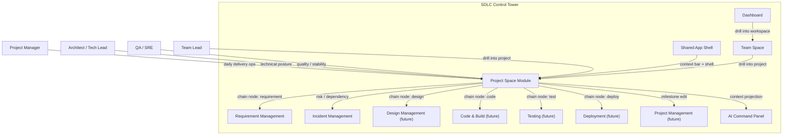
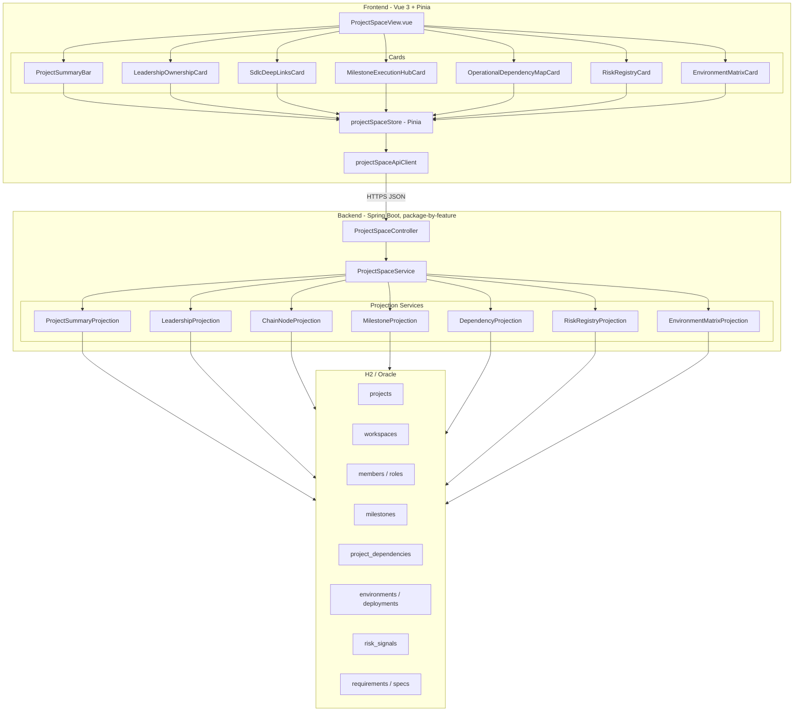
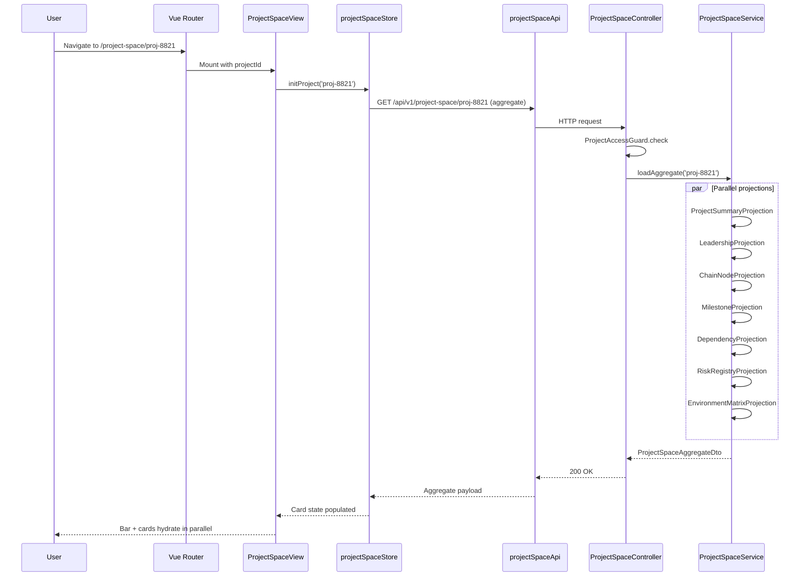
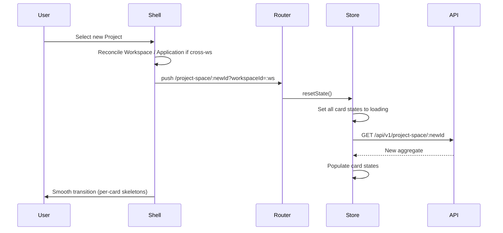
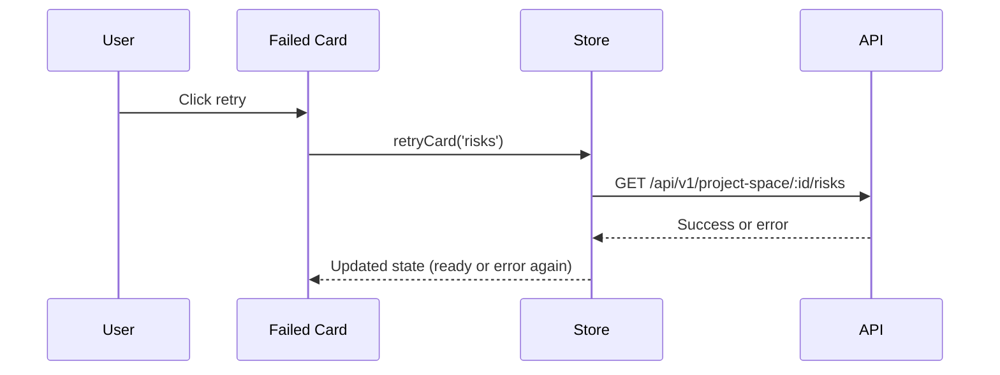
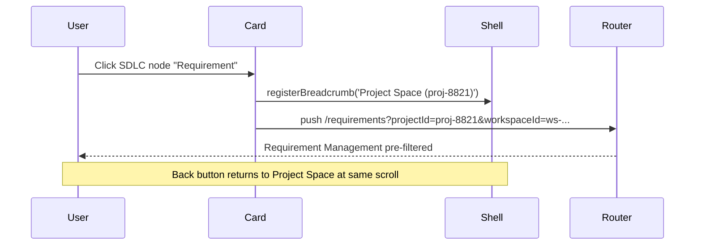
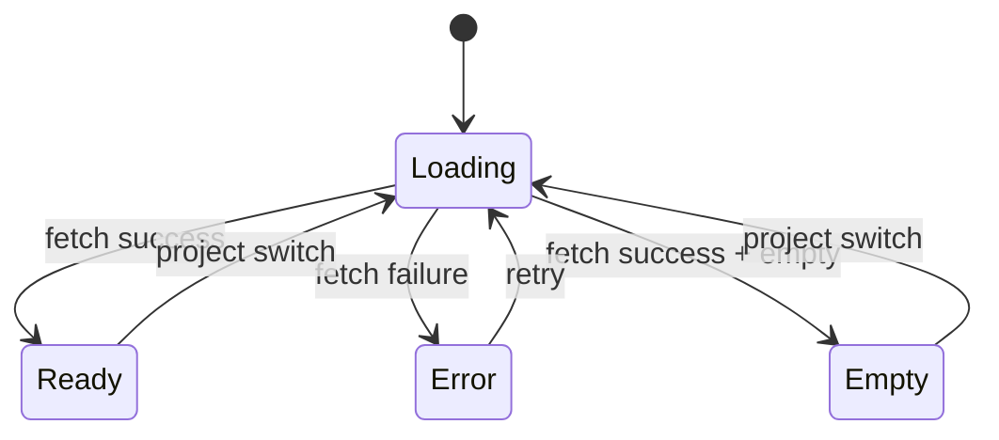

# System Architecture: Project Space

## Overview

Project Space is the single-project execution home, sitting between Team Space (Workspace-level operating home) and the lifecycle pages (Requirement / Design / Code / Test / Deploy / Incident) in the Agentic SDLC Control Tower. This document defines the system context, component breakdown, data flow, state boundaries, and integration model of the Project Space module.

## Source Specification

- [project-space-spec.md](../03-spec/project-space-spec.md)
- [project-space-requirements.md](../01-requirements/project-space-requirements.md)
- [project-space-stories.md](../02-user-stories/project-space-stories.md)

## Architectural Drivers

### Key Functional Drivers

| Driver | Implication |
|--------|-------------|
| Project-scoped single-tenant view | Every fetch / state node keys on `projectId` |
| Multi-card, parallel rendering | Per-card skeletons, per-card error isolation, parallel fetches |
| Read-only presentation of Project inventory | Reuse shared display primitives; no write paths |
| Navigation into 7 lifecycle pages + Project Management + Access Management | Stable deep-link vocabulary; context preserved via router state |
| AI Command Panel integration | Push page context to shell; record skill executions |
| Parent-Workspace consistency | Shell auto-reconciles Workspace / Application on Project switch |

### Key Non-Functional Drivers

| Driver | Implication |
|--------|-------------|
| < 300ms first paint | Aggregate endpoint reduces fan-out on cold load |
| < 500ms per-card hydration | Per-card endpoints for refresh granularity |
| Hard Project isolation | Backend enforces `projectId` on every endpoint via `ProjectAccessGuard` |
| Schema changes via Flyway | Any persistence artifacts land as `V{n}` migrations |

### Constraints and Assumptions

- The shared app shell, dashboard, requirement, incident, and team-space slices are already implemented (some still Phase A).
- Project Management is not yet a full slice — milestone edits link out to a stub page gated by feature flag.
- Design Management, Code & Build, Testing, Deployment Management are not yet full slices — SDLC deep-link nodes render as disabled "coming soon" when target is absent.
- V1 storage is H2 for local dev and Oracle for shared environments.
- The `projects` table already exists (consumed by Team Space's `ProjectDistributionProjection`). Project Space extends the schema with dependency edges, environment matrix cache, and milestone cache; most data is still projected from existing tables.

## System Context

### Primary Actors

| Actor | Role |
|-------|------|
| Project Manager / Delivery Lead | Primary user |
| Architect / Tech Lead | Technical user |
| QA Lead / SRE | Quality / stability user |
| Team Lead (drilling down) | Inbound from Team Space |
| AI Command Panel | Consumes page context |

### External Systems

| System | Relationship to Project Space |
|--------|------------------------------|
| Shared App Shell | Hosts the page, provides context bar, AI panel, breadcrumb |
| Team Space module | Inbound drill-down entry point |
| Dashboard module | Inbound drill-down entry point (via Team Space) |
| Requirement Management module | Outbound deep-link target |
| Incident Management module | Outbound deep-link target (dependency blockers, risks) |
| Design / Code / Test / Deploy (future) | Outbound deep-link targets, currently stubbed |
| Project Management (future) | Outbound milestone-edit target |
| Access Management (future) | Outbound role-assignment target |
| Report Center (future) | Historical drill-down |
| Backend Services | Projects project aggregate, milestone, dependency, environment views |

### System Context Diagram



### System Boundary

The Project Space module owns all Project-Space-specific UI components, state management, aggregate API endpoints, and projection services. It does **not** own:

- Project / Workspace / Application master data (read from `shared` platform tables)
- Member / role master data (read from Access Management tables via facade)
- Requirement / Spec / Incident detail (read via module facades)
- Design / Code / Test / Deploy detail (read via facades once those modules exist; stubbed until then)
- Milestone editing (delegated to Project Management)

Project Space is **projection-heavy**: it assembles views from other modules' data, adds version-drift and milestone-slippage computation, and exposes a cohesive single-Project operating view.

## High-Level Architecture

### Component Breakdown Diagram



### Layer Summary

| Layer | Responsibility |
|-------|---------------|
| ProjectSpaceView | Top-level route view, mounts summary bar + cards, subscribes to store |
| Project Summary Bar | Identity + counters + health disclosure |
| Card components | Each card owns its own skeleton / error / empty state |
| projectSpaceStore | Per-card state nodes keyed on shared `projectId` |
| projectSpaceApiClient | HTTP boundary, response envelope unwrap |
| ProjectSpaceController | REST endpoints, `projectId` authorization |
| ProjectSpaceService | Orchestrates projection services, enforces isolation |
| Projection services | One per card; each reads its upstream source |
| Data store | Existing domain tables + new Project-Space-owned tables (dependencies, environments cache, milestones cache) |

## Component Breakdown

### Frontend Components

| Component | Inputs | Outputs / Emits | Notes |
|-----------|--------|-----------------|-------|
| `ProjectSpaceView.vue` | `projectId` (route param) | n/a | Mounts bar + cards, manages breadcrumb registration |
| `ProjectSummaryBar.vue` | `summary: ProjectSummaryDto` | Navigate-to-Team-Space event | REQ-PS-10/11/12 |
| `LeadershipOwnershipCard.vue` | `leadership: LeadershipOwnershipDto` | Navigate-to-Access event | REQ-PS-20/21/22 |
| `SdlcDeepLinksCard.vue` | `chain: SdlcChainDto` | Navigate-to-lifecycle-page event | REQ-PS-30/31/32 |
| `MilestoneExecutionHubCard.vue` | `milestones: MilestoneHubDto` | Navigate-to-Project-Management event | REQ-PS-40/41/42 |
| `OperationalDependencyMapCard.vue` | `dependencies: DependencyMapDto` | Navigate-to-Project-Space / Incident event | REQ-PS-50/51/52 |
| `RiskRegistryCard.vue` | `risks: RiskRegistryDto` | Navigate-to-action event | REQ-PS-60/61/62 |
| `EnvironmentMatrixCard.vue` | `environments: EnvironmentMatrixDto` | Navigate-to-Deployment event | REQ-PS-70/71/72 |
| `ChainNodeTile.vue` | `node: ChainNodeHealthDto`, `emphasis: boolean` | — | Shared primitive, Spec emphasis |
| `MilestoneRow.vue` | `milestone: MilestoneDto` | — | Reused inside hub card |
| `DependencyRow.vue` | `dep: DependencyDto`, `direction: 'up'|'down'` | — | Reused up / down lists |
| `EnvironmentTile.vue` | `env: EnvironmentDto` | — | Reused per env |
| `DriftIndicator.vue` | `drift: VersionDriftDto` | — | Shown per env with drift |

### Backend Components

| Component | Responsibility |
|-----------|---------------|
| `ProjectSpaceController` | Exposes `/api/v1/project-space/*` endpoints; validates `projectId`; authorizes |
| `ProjectSpaceService` | Aggregates projections; parallel fan-out; assembles `ProjectSpaceAggregateDto` |
| `ProjectSummaryProjection` | Reads Project identity, Workspace, Application, counters, aggregate health |
| `LeadershipProjection` | Reads role assignments for the Project; resolves oncall + backup presence |
| `ChainNodeProjection` | Per-chain-node counts/health: Requirement / Story / Spec / Architecture / Design / Tasks / Code / Test / Deploy / Incident / Learning |
| `MilestoneProjection` | Reads milestones, computes slippage indicator |
| `DependencyProjection` | Reads `project_dependencies`, enriches with health from upstream health service |
| `RiskRegistryProjection` | Reads `risk_signals` filtered by `projectId`, orders by severity |
| `EnvironmentMatrixProjection` | Reads environment + deployment rows, computes version drift |
| `ProjectAccessGuard` | Filter enforcing `projectId` authorization on every request |

### Package Layout (Backend)

Per CLAUDE.md rule #3 — package-by-feature:

```
backend/src/main/java/com/sdlctower/
├── domain/
│   └── projectspace/
│       ├── ProjectSpaceController.java
│       ├── ProjectSpaceService.java
│       ├── ProjectSpaceConstants.java
│       ├── ProjectAccessGuard.java
│       ├── projection/
│       │   ├── ProjectSummaryProjection.java
│       │   ├── LeadershipProjection.java
│       │   ├── ChainNodeProjection.java
│       │   ├── MilestoneProjection.java
│       │   ├── DependencyProjection.java
│       │   ├── RiskRegistryProjection.java
│       │   └── EnvironmentMatrixProjection.java
│       ├── persistence/
│       │   ├── MilestoneEntity.java
│       │   ├── ProjectDependencyEntity.java
│       │   ├── EnvironmentEntity.java
│       │   ├── DeploymentEntity.java
│       │   ├── MilestoneRepository.java
│       │   ├── ProjectDependencyRepository.java
│       │   ├── EnvironmentRepository.java
│       │   └── DeploymentRepository.java
│       └── dto/
│           ├── ProjectSpaceAggregateDto.java
│           ├── ProjectSummaryDto.java
│           ├── LeadershipOwnershipDto.java
│           ├── RoleAssignmentDto.java
│           ├── SdlcChainDto.java
│           ├── ChainNodeHealthDto.java
│           ├── MilestoneHubDto.java
│           ├── MilestoneDto.java
│           ├── DependencyMapDto.java
│           ├── DependencyDto.java
│           ├── RiskRegistryDto.java
│           ├── RiskItemDto.java
│           ├── EnvironmentMatrixDto.java
│           ├── EnvironmentDto.java
│           ├── VersionDriftDto.java
│           └── LinkDto.java
└── shared/
    ├── dto/
    │   ├── ApiResponse.java
    │   └── SectionResultDto.java
    └── ApiConstants.java
```

Shared platform entities (Workspace, Application, Member, Role, Project, Requirement, Spec, Incident) live under `com.sdlctower.shared.*` and are consumed by Project Space via repository facades.

### Monitoring / Audit

- Each skill execution invoked from the AI Command Panel on Project Space is logged via the existing platform audit pipeline.
- Project-scope violations (cross-project access) emit an audit event with `projectId`, `userId`, `endpoint`, `reason`.

## Data Architecture

### Conceptual Entities

| Entity | Ownership | Notes |
|--------|-----------|-------|
| Project | Shared platform | Already exists |
| Workspace | Shared platform | Parent scope |
| Application | Shared platform | Nullable by compatibility mode |
| Member / Role | Access Management | Already exists |
| Milestone | Project Space (new) | Project-level milestones |
| Project Dependency | Project Space (new) | Upstream / downstream edges |
| Environment | Project Space (new) | Per-project env inventory |
| Deployment | Project Space (new) | Per-env latest deploy record |
| Risk Signal | Team Space (shared) | Filtered by `projectId` |
| Requirement / Spec / Design / Code / Test / Deploy / Incident | Respective modules | Read via facades |

### State / Status Models

- **Project Lifecycle Stage** enum: `DISCOVERY` / `DELIVERY` / `STEADY_STATE` / `RETIRING`.
- **Project Health** enum: `GREEN` / `YELLOW` / `RED` / `UNKNOWN`.
- **Milestone Status** enum: `NOT_STARTED` / `IN_PROGRESS` / `AT_RISK` / `COMPLETED` / `SLIPPED`.
- **Dependency Relationship** enum: `API` / `DATA` / `SCHEDULE` / `SLA`.
- **Dependency Direction** enum: `UPSTREAM` / `DOWNSTREAM`.
- **Environment Kind** enum: `DEV` / `STAGING` / `PROD` / `CUSTOM`.
- **Environment Gate Status** enum: `AUTO` / `APPROVAL_REQUIRED` / `BLOCKED`.
- **Version Drift Band** enum: `NONE` / `MINOR` / `MAJOR` (commit-count thresholds).
- **Risk Severity** enum: reuse `CRITICAL` / `HIGH` / `MEDIUM` / `LOW` from Team Space.
- **Oncall Status** enum: reuse `ON` / `OFF` / `UPCOMING`.

### Persistence Responsibilities

| Data | Storage | Refresh |
|------|---------|---------|
| Project identity, Workspace, Application | Existing tables | On-demand projection |
| Leadership / role assignments | Existing Access tables | On-demand projection |
| Chain node counts/health | Computed from lifecycle tables (Requirement / Spec / Incident) | On-demand projection |
| Milestones | `milestones` (new) | Managed by Project Management; read here |
| Dependencies | `project_dependencies` (new) | Managed by Platform / PM; read here |
| Environments / deployments | `environments`, `deployments` (new) | Managed by Deployment Management; read here |
| Risks | `risk_signals` (Team Space) | Shared table, filtered by `projectId` |
| Version drift | Computed on-demand | No storage |

## Integration Architecture

### Shared App Shell

- Resolves `projectId` from the active `/project-space/:projectId` route and keeps parent Workspace context aligned when `workspaceId` is present.
- Registers breadcrumb entries via the existing `shellUiStore`.
- Projects page-scoped AI content via the existing `shellUiStore.setAiPanelContent(...)` surface.
- Cross-workspace Project switches may trigger Workspace / Application reconciliation hooks when shared shell support is available.

### Team Space Module

- Project Space receives inbound deep-links from Team Space's Project Distribution card: `/project-space/:projectId` (optionally preserving `workspaceId` in query).

### Requirement / Incident Modules

- SDLC chain node for Requirement and Risk Registry actions deep-link into these existing modules scoped by `projectId`.

### Design / Code / Test / Deploy (future)

- Deep-links built now; enabled via feature flags as those modules land.

### Project Management (future)

- Milestone card "Manage in Project Management" link is feature-flagged off until Project Management lands; renders as disabled CTA in V1.

### AI Command Panel

- Project Space pushes `ProjectSpaceContext { projectId, workspaceId, activeMilestone, topRisks, envPosture }` on mount and switch.
- Panel displays Project-Space-appropriate suggested prompts.
- Skill invocations are recorded via existing skill-execution audit path.

## Workflow / Runtime Architecture

### Page Load Flow (First Paint)



### Project Switch Flow



### Per-Card Retry Flow



### Deep-Link Drill-Down Flow



### State Transitions

Per-card state machine (all cards share the same shape):



### Failure and Retry Handling

- Per-card retry does not affect other cards.
- Aggregate endpoint failure falls back to per-card endpoints (double-failure = page-level error).
- Auth failure / Project access denial = page-level error (redirect to Team Space with error banner).

## API / Interface Boundaries

### Major Inbound Interfaces

| Interface | Purpose |
|-----------|---------|
| `GET /api/v1/project-space/:projectId` | Aggregate first-paint load |
| `GET /api/v1/project-space/:projectId/{card}` | Per-card fetch |
| Active `/project-space/:projectId` route + optional `workspaceId` query | Provides current `projectId` and preserves upstream Team Space context when available |
| `shellUiStore.setAiPanelContent(...)` | Updates Project-scoped AI panel content |

### Internal Module Boundaries

Project Space consumes upstream modules only through repository facades:

- `ProjectRepositoryFacade` (shared platform)
- `WorkspaceRepositoryFacade` (shared platform)
- `MemberRepositoryFacade` (Access Management)
- `RequirementReadFacade` (Requirement Management)
- `IncidentReadFacade` (Incident Management)
- `DesignReadFacade` (future — stubbed until Design Management lands)
- `CodeBuildReadFacade` (future — stubbed)
- `TestingReadFacade` (future — stubbed)
- `DeploymentReadFacade` (future — stubbed; uses Project Space-owned env/deployment tables in V1 as the source of truth until Deployment Management lands)

Project Space writes only to its own tables (`milestones`, `project_dependencies`, `environments`, `deployments`) and only via scheduled or admin-driven paths — the HTTP-facing endpoints are read-only.

## Deployment / Environment Considerations

- Same Spring Boot application as other modules.
- No new environment variables required for V1.
- Feature flags: `project-space.enabled` (default true), `project-management-link.enabled`, `design-link.enabled`, `code-link.enabled`, `testing-link.enabled`, `deployment-link.enabled` — default off until respective slices land.

## Security / Reliability / Observability

### Access Control

- Every endpoint requires authentication + `projectId` scoping.
- `ProjectAccessGuard` filter enforces that the authenticated user has read access to the target Project.
- Users without access receive 403 (handled as page-level error).

### Auditability

- AI skill executions initiated on Project Space are audited via existing skill-execution audit pipeline.
- Access denial events are audited.
- No write paths on the HTTP surface, so no data-mutation audit needed.

### Resilience

- Aggregate endpoint uses parallel projection fan-out with 500ms per-projection timeout; late projections degrade to card-level errors without breaking first paint.
- Per-card retry supports recovery without page reload.

### Monitoring / Logging

- Structured logs include `projectId`, `workspaceId`, `userId`, `endpoint`, `durationMs`, `projections[]`.
- Metrics: `project_space.aggregate.latency`, `project_space.projection.latency{projection=}`, `project_space.error.count{card=}`.

## Risks / Tradeoffs

| Risk | Mitigation |
|------|-----------|
| Aggregate endpoint latency degrades under high-fan-out | Projection-level timeouts + per-card fallback |
| Milestone / dependency data not yet owned by Project Management / Platform Center | Seed tables via migration; designate Project Space as interim source of truth with read-only HTTP surface |
| Environment / version drift projection requires upstream deployment events | V1 reads last-deploy rows from Project Space's own tables; event stream integration deferred |
| Chain node counts drift from authoritative lifecycle modules | Reuse existing module facades; fall back to "n/a" when facade absent |
| Cross-workspace project switch surprises users | Shell auto-reconciles context; include a brief toast explaining the switch |
| Oracle DDL incompatibility for new tables | Use portable DDL; split per-dialect migration if needed; verify on Oracle-in-Docker |

## Open Questions

See [project-space-spec.md §Open Questions](../03-spec/project-space-spec.md).

- Milestone completion % source (derived vs manual).
- Dependency health probe strategy (static registry vs real-time).
- Version drift threshold default.
- AI Adoption owner as a first-class role vs derived.
- Team-Space vs Project-Space AI skill pack separation.
- Permission-gated link strategy (hide vs disable).
