# Project Space — Data Flow

## 1. Purpose and Traceability

This document defines the runtime data flows of the Project Space module: how Project-scoped data moves from storage, through projection services, across the API boundary, into the store, and onto the summary bar and cards. It complements the static architecture view in [project-space-architecture.md](project-space-architecture.md) and the data shape defined in [project-space-data-model.md](project-space-data-model.md).

### Traceability

- Spec: [project-space-spec.md](../03-spec/project-space-spec.md)
- Stories: [project-space-stories.md](../02-user-stories/project-space-stories.md) — S1 through S12
- Requirements: [project-space-requirements.md](../01-requirements/project-space-requirements.md)

---

## 2. Runtime Data Flows

### 2.1 Aggregate First-Paint Load (Phase A: mock, Phase B: API)

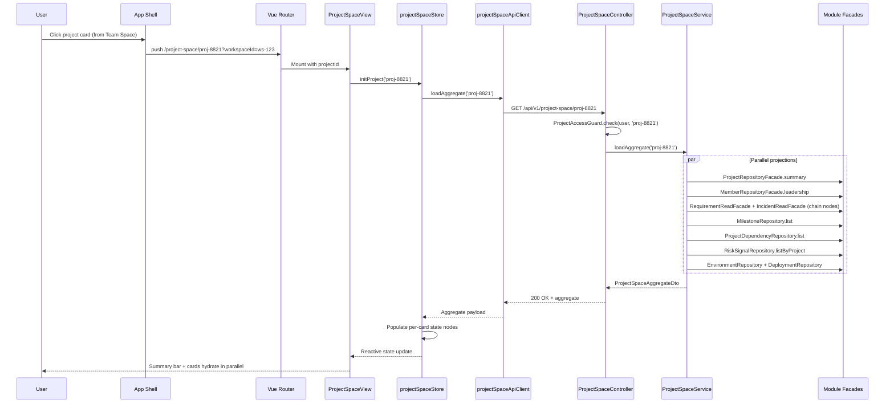

### 2.2 Project Switch Flow (with Workspace Reconciliation)

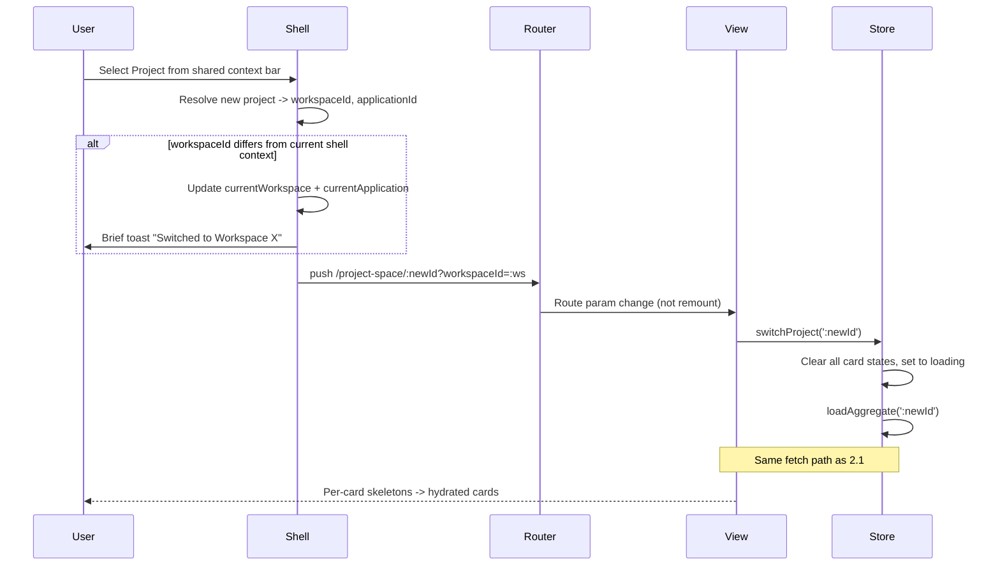

### 2.3 Per-Card Refresh / Retry Flow

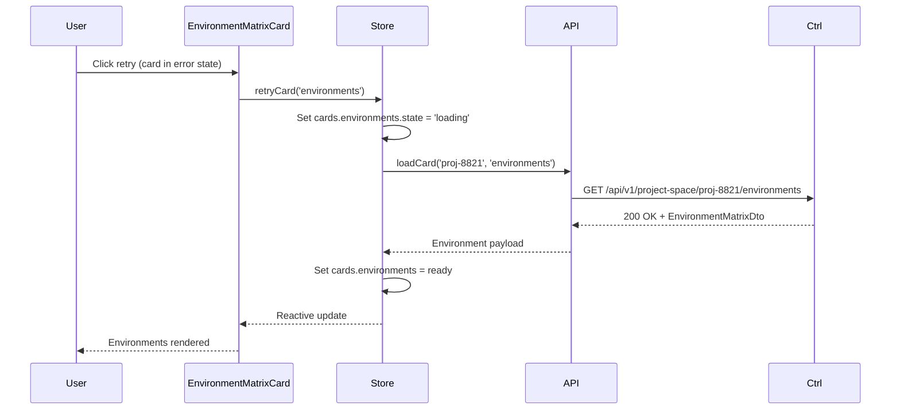

### 2.4 SDLC Chain Node -> Requirement Management Drill-Down

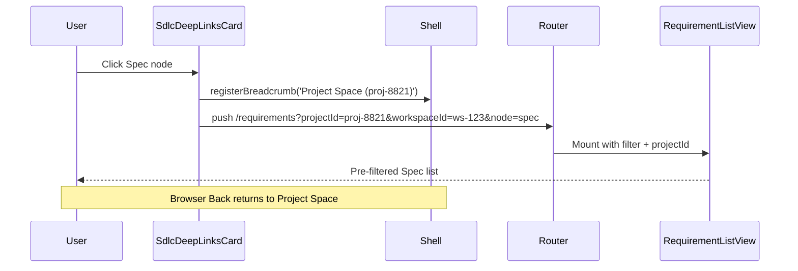

### 2.5 Risk Registry -> Incident Detail Drill-Down

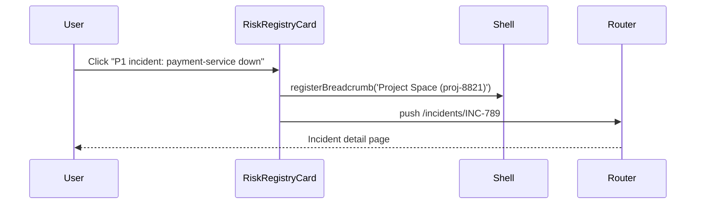

### 2.6 Dependency Row -> Adjacent Project Space (with Fallback)

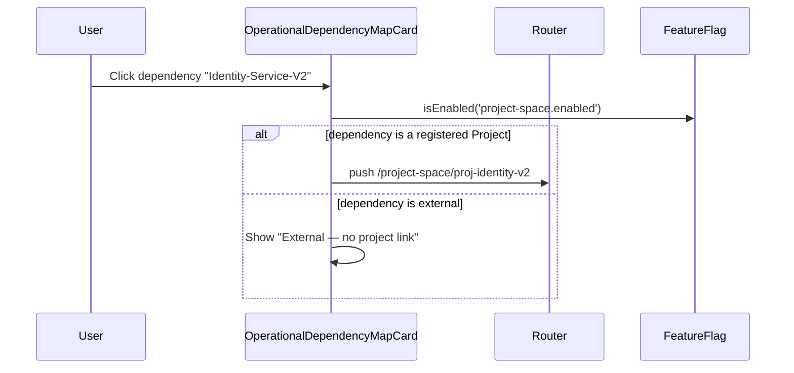

### 2.7 Milestone Card -> Project Management (with Feature Flag)

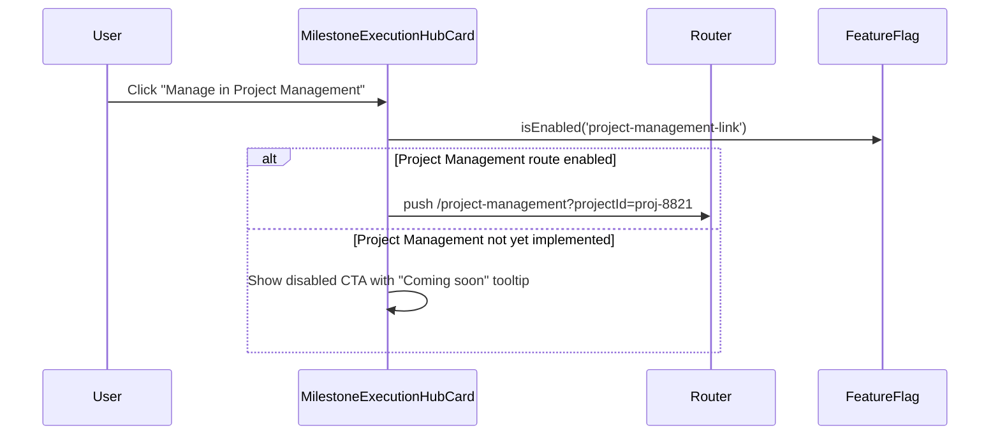

### 2.8 Environment Tile -> Deployment Management

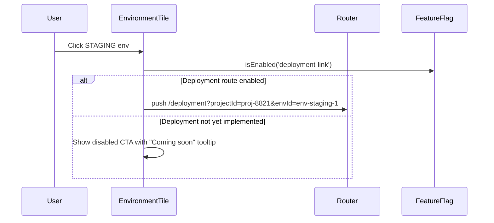

### 2.9 AI Command Panel Context Projection

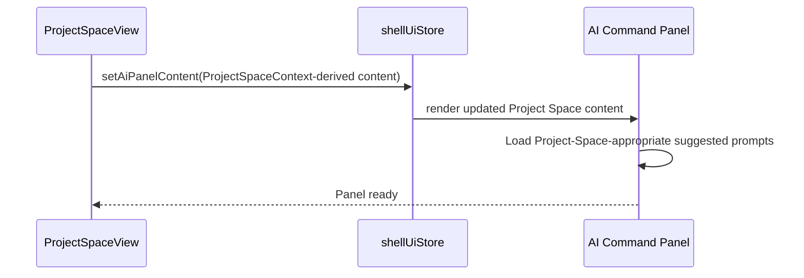

### 2.10 AI Skill Invocation Recorded as Skill Execution

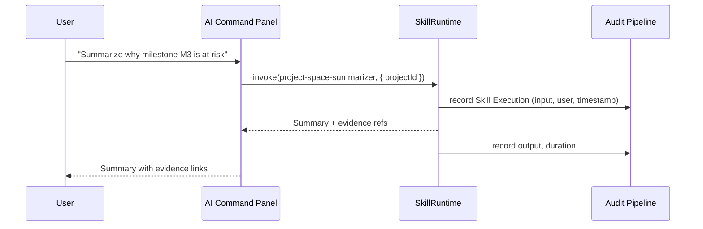

### 2.11 Aggregate Health Computation

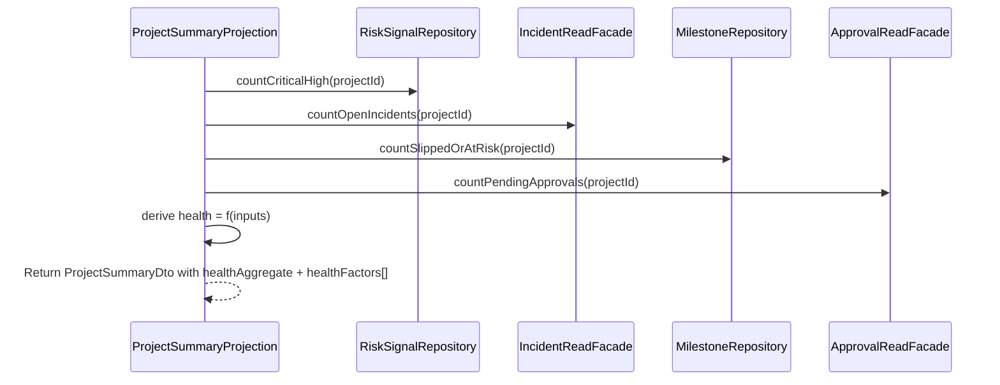

### 2.12 Version Drift Computation

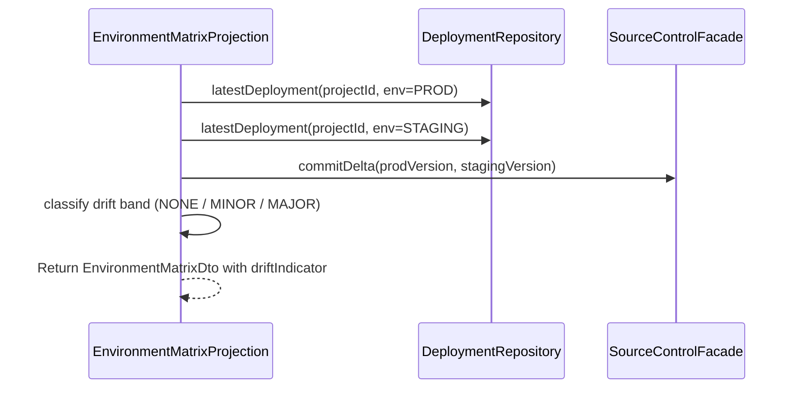

---

## 3. Error Isolation Strategy

### Aggregate Endpoint: Partial Degradation

When the aggregate endpoint is called, each projection runs in parallel with a 500ms budget. A projection that errors or times out returns a `SectionResult` with `data = null` and a non-null `error`; other projections still return their normal `data` with `error = null`.

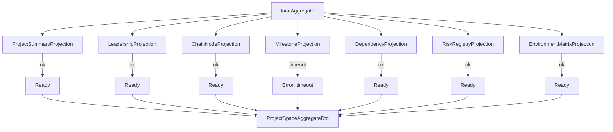

Each card in the DTO carries its own section envelope — the frontend combines that `data` / `error` payload with local loading flags to render skeleton / error / ready states independently.

### Section Envelope

```typescript
interface SectionResult<T> {
  readonly data: T | null;
  readonly error: string | null;
}
```

### Page-Level Errors

| Condition | Behavior |
|-----------|---------|
| Auth failure | Redirect to login |
| Project access denied | Redirect to Team Space + error banner |
| Invalid `projectId` format | 400 + inline page error |
| Project not found | 404 + inline page error with Team Space link |
| Both aggregate AND all per-card endpoints fail | Full-page error with reload button |

### Retry Strategy

- Per-card retry: manual, triggered by user click on error state.
- No automatic retry in V1.
- Aggregate endpoint timeout: 2s total; if exceeded, frontend falls back to per-card endpoints.

---

## 4. State Machine

### Per-Card State Transitions

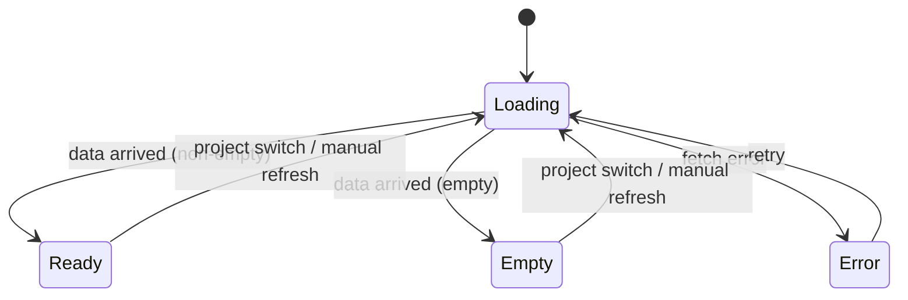

### Card-Level State Values

| Card | Empty example | Error example |
|------|---------------|---------------|
| ProjectSummary | N/A (always has identity) | "Failed to load project summary" |
| Leadership | "No roles assigned yet" | "Failed to load leadership" |
| SdlcDeepLinks | N/A (11 nodes always render) | "Failed to load chain health" |
| Milestones | "No milestones defined" | "Failed to load milestones" |
| Dependencies | "No dependencies configured" | "Failed to load dependency map" |
| Risks | "All green" | "Failed to load risk registry" |
| Environments | "No environments configured" | "Failed to load environment matrix" |

---

## 5. Refresh Strategy

### V1: On-Load + Manual Refresh

- Aggregate fetched on page mount and on Project switch.
- Per-card manual refresh via action button on each card.
- No automatic polling.

### Backing Data Refresh

- Risk signals: 15-minute cron refresh (inherited from Team Space `RiskRadarJob`).
- Deployment records: written on deploy completion by Deployment Management (when available); V1 uses migration-seeded rows + manual admin update.
- Chain node counts: computed on-demand from lifecycle facades.
- Milestones / dependencies / environments: managed by Project Management / Deployment Management when those slices land; V1 reads directly from Project Space-owned tables.

### Future (V2+)

- WebSocket push on milestone status change or deployment completion.
- Configurable polling per-card.
- Event stream integration with Deployment Management.

---

## 6. API Client Chain

### Full Request Path

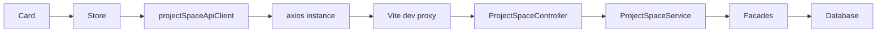

### Layer Responsibilities

| Layer | Responsibility |
|-------|---------------|
| Card | Dispatches store action; subscribes to state |
| Store (Pinia) | Owns per-card state nodes; dispatches API calls; unwraps envelopes |
| projectSpaceApiClient | Typed wrapper over axios; returns typed DTOs |
| axios | HTTP transport; response envelope interceptor |
| Vite dev proxy | `/api` -> backend origin in dev |
| Controller | Endpoint surface; authorization; validation |
| Service | Orchestration; parallel projection fan-out |
| Projections | Read domain data via facades or own repositories |
| Facades | Repository abstraction over shared tables |

### Vite Proxy Configuration

```ts
// vite.config.ts
server: {
  proxy: {
    '/api': {
      target: 'http://localhost:8080',
      changeOrigin: true,
    },
  },
}
```

### Mock Toggle Pattern

```ts
import { fetchJson } from '@/shared/api/client';

const USE_MOCK = import.meta.env.DEV && !import.meta.env.VITE_USE_BACKEND;

export async function loadAggregate(projectId: string): Promise<ProjectSpaceAggregateDto> {
  if (USE_MOCK) return mockAggregate(projectId);
  return fetchJson<ProjectSpaceAggregateDto>(`/project-space/${projectId}`);
}
```

---

## 7. Frontend Type to Backend DTO Mapping

| Frontend Type | Backend DTO | Source Projection |
|--------------|-------------|-------------------|
| `ProjectSummary` | `ProjectSummaryDto` | `ProjectSummaryProjection` |
| `LeadershipOwnership` | `LeadershipOwnershipDto` | `LeadershipProjection` |
| `SdlcChainState` | `SdlcChainDto` | `ChainNodeProjection` |
| `MilestoneHub` | `MilestoneHubDto` | `MilestoneProjection` |
| `DependencyMap` | `DependencyMapDto` | `DependencyProjection` |
| `RiskRegistry` | `RiskRegistryDto` | `RiskRegistryProjection` |
| `EnvironmentMatrix` | `EnvironmentMatrixDto` | `EnvironmentMatrixProjection` |
| `ProjectSpaceAggregate` | `ProjectSpaceAggregateDto` | `ProjectSpaceService` |
| `SectionResult<T>` | `SectionResultDto<T>` | shared envelope |

See [project-space-data-model.md](project-space-data-model.md) for full type definitions.

---

## 8. Phase A vs Phase B Data Sources

| Phase | Aggregate Source | Per-Card Source |
|-------|------------------|-----------------|
| Phase A (frontend-first) | `src/features/project-space/mock/aggregate.mock.ts` | same mock file |
| Phase B (full-stack) | `GET /api/v1/project-space/:id` | `GET /api/v1/project-space/:id/{card}` |

Mock structure mirrors the backend DTO shape exactly; swapping via `VITE_USE_BACKEND` does not require rerendering components.
