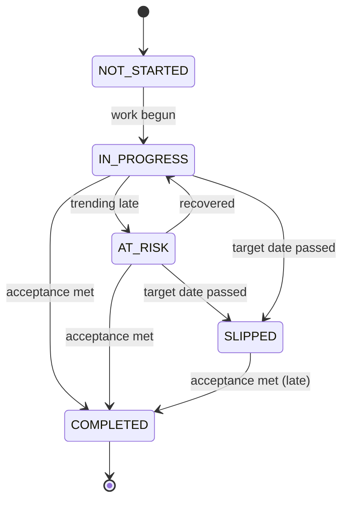

# Project Space Data Model

## Purpose

This document defines the domain data model for the Project Space slice: the conceptual entities, frontend type catalog, backend DTO definitions, database schema DDL, and the frontend-to-backend type mapping.

Project Space is projection-heavy — most data is assembled from upstream modules. This slice introduces four new persistent entities: `milestones`, `project_dependencies`, `environments`, and `deployments`. The `risk_signals` table from Team Space is reused (filtered by `project_id`), and existing `projects`, `workspaces`, `members`, `requirements`, `specs`, `incidents` tables are consumed via facades.

## Traceability

- Spec: [project-space-spec.md](../03-spec/project-space-spec.md)
- Data Flow: [project-space-data-flow.md](project-space-data-flow.md)
- API Guide: [project-space-API_IMPLEMENTATION_GUIDE.md](../05-design/contracts/project-space-API_IMPLEMENTATION_GUIDE.md)
- Requirements: [project-space-requirements.md](../01-requirements/project-space-requirements.md)

---

## 1. Domain Model Overview

```mermaid
erDiagram
    WORKSPACE ||--o{ PROJECT : contains
    APPLICATION ||--o{ PROJECT : owns
    PROJECT ||--o{ MILESTONE : has
    PROJECT ||--o{ ENVIRONMENT : has
    PROJECT ||--o{ DEPLOYMENT : records
    PROJECT ||--o{ PROJECT_DEPENDENCY : upstream_of
    PROJECT ||--o{ PROJECT_DEPENDENCY : downstream_of
    PROJECT ||--o{ ROLE_ASSIGNMENT : has
    PROJECT ||--o{ RISK_SIGNAL : accumulates
    PROJECT ||--o{ REQUIREMENT : scoped_to
    PROJECT ||--o{ SPEC : scoped_to
    PROJECT ||--o{ INCIDENT : scoped_to
    MEMBER ||--o{ ROLE_ASSIGNMENT : assigned
    ENVIRONMENT ||--o{ DEPLOYMENT : has_latest

    PROJECT {
        string id PK
        string workspaceId FK
        string name
        string lifecycleStage
        string healthAggregate
        string pmMemberId FK
        string techLeadMemberId FK
        timestamp createdAt
    }
    MILESTONE {
        string id PK
        string projectId FK
        string label
        date targetDate
        string status
        int percentComplete
        string ownerMemberId FK nullable
        string slippageReason nullable
        int ordering
    }
    PROJECT_DEPENDENCY {
        string id PK
        string sourceProjectId FK
        string targetRef
        string targetProjectId FK nullable
        string direction
        string relationship
        string ownerTeam
        string health
        string blockerReason nullable
        boolean external
    }
    ENVIRONMENT {
        string id PK
        string projectId FK
        string label
        string kind
        string gateStatus
        string approverMemberId FK nullable
    }
    DEPLOYMENT {
        string id PK
        string environmentId FK
        string versionRef
        string buildId
        string health
        timestamp deployedAt
        int commitDistanceFromProd
    }
    ROLE_ASSIGNMENT {
        string id PK
        string memberId FK
        string projectId FK
        string role
        string backupMemberId FK nullable
        timestamp lastActiveAt
    }
    RISK_SIGNAL {
        string id PK
        string workspaceId FK
        string projectId FK nullable
        string category
        string severity
        string sourceKind
        string sourceId
        string title
        string actionLink
        timestamp detectedAt
        timestamp resolvedAt nullable
    }
```

---

## 2. Frontend Type Model

### 2.1 Shared Envelope Types

```typescript
// src/shared/types/section.ts

export interface SectionResult<T> {
  readonly data: T | null;
  readonly error: string | null;
}
```

The top-level HTTP envelope remains the shared backend `ApiResponse<T>` shape (`data` + `error`) and is unwrapped in `frontend/src/shared/api/client.ts`.

### 2.2 Enums / Union Types

```typescript
// src/features/project-space/types/enums.ts

export type ProjectLifecycleStage =
  | 'DISCOVERY'
  | 'DELIVERY'
  | 'STEADY_STATE'
  | 'RETIRING';

export type HealthAggregate = 'GREEN' | 'YELLOW' | 'RED' | 'UNKNOWN';

export type MilestoneStatus =
  | 'NOT_STARTED'
  | 'IN_PROGRESS'
  | 'AT_RISK'
  | 'COMPLETED'
  | 'SLIPPED';

export type DependencyDirection = 'UPSTREAM' | 'DOWNSTREAM';

export type DependencyRelationship =
  | 'API'
  | 'DATA'
  | 'SCHEDULE'
  | 'SLA';

export type EnvironmentKind = 'DEV' | 'STAGING' | 'PROD' | 'CUSTOM';

export type EnvironmentGateStatus =
  | 'AUTO'
  | 'APPROVAL_REQUIRED'
  | 'BLOCKED';

export type VersionDriftBand = 'NONE' | 'MINOR' | 'MAJOR';

export type RiskSeverity = 'CRITICAL' | 'HIGH' | 'MEDIUM' | 'LOW';

export type RiskCategory =
  | 'TECHNICAL'
  | 'SECURITY'
  | 'DELIVERY'
  | 'DEPENDENCY'
  | 'GOVERNANCE';

export type AccountableRole =
  | 'PM'
  | 'ARCHITECT'
  | 'TECH_LEAD'
  | 'QA_LEAD'
  | 'SRE'
  | 'AI_ADOPTION';

export type OncallStatus = 'ON' | 'OFF' | 'UPCOMING' | 'NONE';

export type SdlcNodeKey =
  | 'REQUIREMENT'
  | 'USER_STORY'
  | 'SPEC'
  | 'ARCHITECTURE'
  | 'DESIGN'
  | 'TASKS'
  | 'CODE'
  | 'TEST'
  | 'DEPLOY'
  | 'INCIDENT'
  | 'LEARNING';
```

### 2.3 Project Summary

```typescript
// src/features/project-space/types/summary.ts

export interface ProjectCounters {
  activeSpecs: number;
  openIncidents: number;
  pendingApprovals: number;
  criticalHighRisks: number;
}

export interface HealthFactor {
  label: string;
  severity: 'INFO' | 'WARN' | 'CRIT';
}

export interface ProjectSummary {
  id: string;
  name: string;
  workspaceId: string;
  workspaceName: string;
  applicationId: string;
  applicationName: string;
  lifecycleStage: ProjectLifecycleStage;
  healthAggregate: HealthAggregate;
  healthFactors: HealthFactor[];
  pm: { memberId: string; displayName: string };
  techLead: { memberId: string; displayName: string };
  activeMilestone: {
    id: string;
    label: string;
    targetDate: string; // ISO date
  } | null;
  counters: ProjectCounters;
  lastUpdatedAt: string; // ISO-8601
  teamSpaceLink: string;
}
```

### 2.4 Leadership & Ownership

```typescript
// src/features/project-space/types/leadership.ts

export interface RoleAssignment {
  role: AccountableRole;
  memberId: string | null;         // null when not assigned
  displayName: string | null;
  oncallStatus: OncallStatus;
  backupPresent: boolean;
  backupMemberId: string | null;
  backupDisplayName: string | null;
}

export interface LeadershipOwnership {
  assignments: RoleAssignment[];   // always 6 entries, one per AccountableRole
  accessManagementLink: {
    url: string;
    enabled: boolean;              // feature-flagged + permission-gated
  };
}
```

### 2.5 SDLC Chain

```typescript
// src/features/project-space/types/chain.ts

export interface ChainNodeHealth {
  nodeKey: SdlcNodeKey;
  label: string;
  count: number | null;             // e.g., open requirements, open incidents
  health: HealthAggregate;
  isExecutionHub: boolean;          // true for SPEC
  deepLink: string;
  enabled: boolean;                 // false when target page is behind a feature flag
}

export interface SdlcChainState {
  nodes: ChainNodeHealth[];         // always 11, in canonical order
}
```

### 2.6 Milestone Execution Hub

```typescript
// src/features/project-space/types/milestones.ts

export interface Milestone {
  id: string;
  label: string;
  targetDate: string;               // ISO date
  status: MilestoneStatus;
  percentComplete: number | null;   // 0-100, null when not computable
  owner: {
    memberId: string;
    displayName: string;
  } | null;
  isCurrent: boolean;
  slippageReason: string | null;
}

export interface MilestoneHub {
  milestones: Milestone[];
  projectManagementLink: {
    url: string;
    enabled: boolean;
  };
}
```

### 2.7 Operational Dependency Map

```typescript
// src/features/project-space/types/dependencies.ts

export interface Dependency {
  id: string;
  targetName: string;
  targetRef: string;                // external name or project id reference
  targetProjectId: string | null;   // null when external
  external: boolean;
  direction: DependencyDirection;
  relationship: DependencyRelationship;
  ownerTeam: string;
  health: HealthAggregate;
  blockerReason: string | null;
  primaryAction: {
    label: string;
    url: string;
  } | null;
}

export interface DependencyMap {
  upstream: Dependency[];
  downstream: Dependency[];
}
```

### 2.8 Risk & Vulnerability Registry

```typescript
// src/features/project-space/types/risks.ts

export interface RiskItem {
  id: string;
  title: string;
  severity: RiskSeverity;
  category: RiskCategory;
  owner: {
    memberId: string;
    displayName: string;
  } | null;
  ageDays: number;
  latestNote: string | null;
  primaryAction: {
    label: string;
    url: string;
  };
  skillAttribution?: {
    skillName: string;
    executionId: string;
  };
}

export interface RiskRegistry {
  items: RiskItem[];       // pre-ordered: severity DESC, ageDays DESC
  total: number;
  lastRefreshed: string;
}
```

### 2.9 Environment & Version Matrix

```typescript
// src/features/project-space/types/environments.ts

export interface VersionDrift {
  band: VersionDriftBand;
  commitDelta: number;
  sinceVersion: string;
  description: string;
}

export interface Environment {
  id: string;
  label: string;
  kind: EnvironmentKind;
  versionRef: string;
  buildId: string;
  health: HealthAggregate;
  gateStatus: EnvironmentGateStatus;
  approver: {
    memberId: string;
    displayName: string;
  } | null;
  lastDeployedAt: string;
  drift: VersionDrift | null;
  deploymentLink: {
    url: string;
    enabled: boolean;
  };
}

export interface EnvironmentMatrix {
  environments: Environment[];
}
```

### 2.10 Top-Level Aggregate

```typescript
// src/features/project-space/types/aggregate.ts

export interface ProjectSpaceAggregate {
  projectId: string;
  workspaceId: string;
  summary:      SectionResult<ProjectSummary>;
  leadership:   SectionResult<LeadershipOwnership>;
  chain:        SectionResult<SdlcChainState>;
  milestones:   SectionResult<MilestoneHub>;
  dependencies: SectionResult<DependencyMap>;
  risks:        SectionResult<RiskRegistry>;
  environments: SectionResult<EnvironmentMatrix>;
}
```

---

## 3. State Models

### 3.1 Project Health Aggregate (Derived)

Derived server-side from:

- ≥ 1 open P1 incident → `RED`
- ≥ 1 critical risk → `RED`
- ≥ 1 high risk OR any milestone `SLIPPED` → `YELLOW`
- Pending approvals > 5 older than 3 days → `YELLOW`
- Otherwise → `GREEN`
- No computable data → `UNKNOWN`

### 3.2 Milestone Status Transitions



In V1, status is set externally (Project Management or seed data); Project Space only reads.

### 3.3 Version Drift Band

Computed server-side per environment relative to PROD:

| Commit delta | Band |
|--------------|------|
| 0 | `NONE` |
| 1–10 | `MINOR` |
| > 10 | `MAJOR` |

Threshold (`10`) is configurable.

---

## 4. Backend DTO Model

Java DTOs under `com.sdlctower.domain.projectspace.dto`:

### 4.1 Core DTOs

```java
public record ProjectSummaryDto(
    String id,
    String name,
    String workspaceId,
    String workspaceName,
    String applicationId,
    String applicationName,
    ProjectLifecycleStage lifecycleStage,
    HealthAggregate healthAggregate,
    List<HealthFactorDto> healthFactors,
    MemberRefDto pm,
    MemberRefDto techLead,
    MilestoneRefDto activeMilestone,  // nullable
    ProjectCountersDto counters,
    Instant lastUpdatedAt,
    String teamSpaceLink
) {}

public record ProjectCountersDto(
    int activeSpecs,
    int openIncidents,
    int pendingApprovals,
    int criticalHighRisks
) {}

public record HealthFactorDto(String label, String severity) {}

public record MemberRefDto(String memberId, String displayName) {}

public record MilestoneRefDto(String id, String label, LocalDate targetDate) {}

public record RoleAssignmentDto(
    AccountableRole role,
    String memberId,            // nullable when unassigned
    String displayName,         // nullable
    OncallStatus oncallStatus,
    boolean backupPresent,
    String backupMemberId,      // nullable
    String backupDisplayName    // nullable
) {}

public record LeadershipOwnershipDto(
    List<RoleAssignmentDto> assignments,
    LinkDto accessManagementLink
) {}

public record ChainNodeHealthDto(
    SdlcNodeKey nodeKey,
    String label,
    Integer count,              // nullable
    HealthAggregate health,
    boolean isExecutionHub,
    String deepLink,
    boolean enabled
) {}

public record SdlcChainDto(List<ChainNodeHealthDto> nodes) {}

public record MilestoneDto(
    String id,
    String label,
    LocalDate targetDate,
    MilestoneStatus status,
    Integer percentComplete,    // nullable
    MemberRefDto owner,         // nullable
    boolean isCurrent,
    String slippageReason       // nullable
) {}

public record MilestoneHubDto(
    List<MilestoneDto> milestones,
    LinkDto projectManagementLink
) {}

public record DependencyDto(
    String id,
    String targetName,
    String targetRef,
    String targetProjectId,     // nullable
    boolean external,
    DependencyDirection direction,
    DependencyRelationship relationship,
    String ownerTeam,
    HealthAggregate health,
    String blockerReason,       // nullable
    LinkDto primaryAction       // nullable
) {}

public record DependencyMapDto(
    List<DependencyDto> upstream,
    List<DependencyDto> downstream
) {}

public record RiskItemDto(
    String id,
    String title,
    RiskSeverity severity,
    RiskCategory category,
    MemberRefDto owner,         // nullable
    int ageDays,
    String latestNote,          // nullable
    LinkDto primaryAction,
    SkillAttributionDto skillAttribution  // nullable
) {}

public record RiskRegistryDto(
    List<RiskItemDto> items,
    int total,
    Instant lastRefreshed
) {}

public record VersionDriftDto(
    VersionDriftBand band,
    int commitDelta,
    String sinceVersion,
    String description
) {}

public record EnvironmentDto(
    String id,
    String label,
    EnvironmentKind kind,
    String versionRef,
    String buildId,
    HealthAggregate health,
    EnvironmentGateStatus gateStatus,
    MemberRefDto approver,      // nullable
    Instant lastDeployedAt,
    VersionDriftDto drift,      // nullable
    LinkDto deploymentLink
) {}

public record EnvironmentMatrixDto(List<EnvironmentDto> environments) {}

public record LinkDto(String url, boolean enabled) {}

public record SkillAttributionDto(String skillName, String executionId) {}

public record ProjectSpaceAggregateDto(
    String projectId,
    String workspaceId,
    SectionResultDto<ProjectSummaryDto> summary,
    SectionResultDto<LeadershipOwnershipDto> leadership,
    SectionResultDto<SdlcChainDto> chain,
    SectionResultDto<MilestoneHubDto> milestones,
    SectionResultDto<DependencyMapDto> dependencies,
    SectionResultDto<RiskRegistryDto> risks,
    SectionResultDto<EnvironmentMatrixDto> environments
) {}

public record SectionResultDto<T>(T data, String error) {}
```

Java enums (`ProjectLifecycleStage`, `HealthAggregate`, `MilestoneStatus`, `DependencyDirection`, `DependencyRelationship`, `EnvironmentKind`, `EnvironmentGateStatus`, `VersionDriftBand`, `RiskSeverity`, `RiskCategory`, `AccountableRole`, `OncallStatus`, `SdlcNodeKey`) mirror the frontend enums exactly by name.

---

## 5. Database Schema (Flyway Migration V9)

### 5.1 New Tables

Project Space introduces four new tables: `milestones`, `project_dependencies`, `environments`, and `deployments`. The `risk_signals` table (owned by Team Space) is extended with a nullable `project_id` column (V10) to support project-scoped filtering.

```sql
-- V9__create_project_space_tables.sql

CREATE TABLE milestones (
    id                  VARCHAR(64)  NOT NULL PRIMARY KEY,
    project_id          VARCHAR(64)  NOT NULL,
    label               VARCHAR(256) NOT NULL,
    target_date         DATE         NOT NULL,
    status              VARCHAR(16)  NOT NULL,   -- NOT_STARTED / IN_PROGRESS / AT_RISK / COMPLETED / SLIPPED
    percent_complete    INT          NULL,
    owner_member_id     VARCHAR(64)  NULL,
    slippage_reason     VARCHAR(512) NULL,
    is_current          BOOLEAN      NOT NULL DEFAULT FALSE,
    ordering            INT          NOT NULL,
    created_at          TIMESTAMP    NOT NULL,
    updated_at          TIMESTAMP    NOT NULL,
    CONSTRAINT fk_milestone_project FOREIGN KEY (project_id) REFERENCES projects (id)
);

CREATE INDEX idx_milestones_project_ordering
    ON milestones (project_id, ordering);

CREATE TABLE project_dependencies (
    id                  VARCHAR(64)  NOT NULL PRIMARY KEY,
    source_project_id   VARCHAR(64)  NOT NULL,
    target_ref          VARCHAR(256) NOT NULL,
    target_project_id   VARCHAR(64)  NULL,
    direction           VARCHAR(16)  NOT NULL,   -- UPSTREAM / DOWNSTREAM
    relationship        VARCHAR(16)  NOT NULL,   -- API / DATA / SCHEDULE / SLA
    owner_team          VARCHAR(128) NOT NULL,
    health              VARCHAR(16)  NOT NULL,   -- GREEN / YELLOW / RED / UNKNOWN
    blocker_reason      VARCHAR(512) NULL,
    external            BOOLEAN      NOT NULL DEFAULT FALSE,
    created_at          TIMESTAMP    NOT NULL,
    updated_at          TIMESTAMP    NOT NULL,
    CONSTRAINT fk_dep_source_project FOREIGN KEY (source_project_id) REFERENCES projects (id)
);

CREATE INDEX idx_project_deps_source_dir
    ON project_dependencies (source_project_id, direction);

CREATE TABLE environments (
    id                  VARCHAR(64)  NOT NULL PRIMARY KEY,
    project_id          VARCHAR(64)  NOT NULL,
    label               VARCHAR(128) NOT NULL,
    kind                VARCHAR(16)  NOT NULL,   -- DEV / STAGING / PROD / CUSTOM
    gate_status         VARCHAR(32)  NOT NULL,   -- AUTO / APPROVAL_REQUIRED / BLOCKED
    approver_member_id  VARCHAR(64)  NULL,
    created_at          TIMESTAMP    NOT NULL,
    updated_at          TIMESTAMP    NOT NULL,
    CONSTRAINT fk_env_project FOREIGN KEY (project_id) REFERENCES projects (id),
    CONSTRAINT uk_env_project_label UNIQUE (project_id, label)
);

CREATE INDEX idx_environments_project
    ON environments (project_id);

CREATE TABLE deployments (
    id                          VARCHAR(64)  NOT NULL PRIMARY KEY,
    environment_id              VARCHAR(64)  NOT NULL,
    version_ref                 VARCHAR(128) NOT NULL,
    build_id                    VARCHAR(128) NOT NULL,
    health                      VARCHAR(16)  NOT NULL,
    deployed_at                 TIMESTAMP    NOT NULL,
    commit_distance_from_prod   INT          NOT NULL DEFAULT 0,
    CONSTRAINT fk_deploy_env FOREIGN KEY (environment_id) REFERENCES environments (id)
);

CREATE INDEX idx_deployments_env_deployed
    ON deployments (environment_id, deployed_at DESC);
```

### 5.2 Risk Signal Extension

```sql
-- V10__add_project_id_to_risk_signals.sql

ALTER TABLE risk_signals
    ADD COLUMN project_id VARCHAR(64) NULL;

CREATE INDEX idx_risk_signals_project_severity
    ON risk_signals (project_id, severity, detected_at DESC)
    WHERE resolved_at IS NULL AND project_id IS NOT NULL;
```

Oracle-compatible variations (e.g., `VARCHAR2`, `NUMBER`, partial-index substitutes) are handled via a separate Oracle-specific migration if needed. For H2 local dev, the above DDL runs as-is.

### 5.3 Seed Data Migration

```sql
-- V11__seed_project_space_data.sql

-- Seed milestones for a sample project
INSERT INTO milestones (
    id, project_id, label, target_date, status, percent_complete,
    owner_member_id, slippage_reason, is_current, ordering, created_at, updated_at
) VALUES
    ('MS-PRJ8821-1', 'proj-8821', 'Discovery Complete',    DATE '2026-03-15', 'COMPLETED',   100, 'u-007', NULL, FALSE, 1, CURRENT_TIMESTAMP, CURRENT_TIMESTAMP),
    ('MS-PRJ8821-2', 'proj-8821', 'Alpha Release',         DATE '2026-05-01', 'IN_PROGRESS',  60, 'u-007', NULL, TRUE,  2, CURRENT_TIMESTAMP, CURRENT_TIMESTAMP),
    ('MS-PRJ8821-3', 'proj-8821', 'GA Launch',             DATE '2026-06-30', 'AT_RISK',      20, 'u-007', 'Upstream identity-service-v2 slipping', FALSE, 3, CURRENT_TIMESTAMP, CURRENT_TIMESTAMP),
    ('MS-PRJ8821-4', 'proj-8821', 'Steady-State Handover', DATE '2026-09-15', 'NOT_STARTED', NULL, NULL,    NULL, FALSE, 4, CURRENT_TIMESTAMP, CURRENT_TIMESTAMP);

INSERT INTO project_dependencies (
    id, source_project_id, target_ref, target_project_id, direction, relationship,
    owner_team, health, blocker_reason, external, created_at, updated_at
) VALUES
    ('DEP-1', 'proj-8821', 'Identity-Service-V2', 'proj-identity-v2', 'UPSTREAM',   'API', 'Identity Platform', 'YELLOW', 'Slipping on SSO contract', FALSE, CURRENT_TIMESTAMP, CURRENT_TIMESTAMP),
    ('DEP-2', 'proj-8821', 'Mobile-Gateway-Alpha', NULL,              'DOWNSTREAM', 'API', 'Mobile Platform',   'GREEN',  NULL,                        FALSE, CURRENT_TIMESTAMP, CURRENT_TIMESTAMP),
    ('DEP-3', 'proj-8821', 'Salesforce CPQ',       NULL,              'UPSTREAM',   'DATA','External',          'UNKNOWN', NULL,                       TRUE,  CURRENT_TIMESTAMP, CURRENT_TIMESTAMP);

INSERT INTO environments (
    id, project_id, label, kind, gate_status, approver_member_id, created_at, updated_at
) VALUES
    ('ENV-DEV-PRJ8821',     'proj-8821', 'DEV',     'DEV',     'AUTO',              NULL,    CURRENT_TIMESTAMP, CURRENT_TIMESTAMP),
    ('ENV-STAGING-PRJ8821', 'proj-8821', 'STAGING', 'STAGING', 'APPROVAL_REQUIRED', 'u-008', CURRENT_TIMESTAMP, CURRENT_TIMESTAMP),
    ('ENV-PROD-PRJ8821',    'proj-8821', 'PROD',    'PROD',    'APPROVAL_REQUIRED', 'u-007', CURRENT_TIMESTAMP, CURRENT_TIMESTAMP);

INSERT INTO deployments (
    id, environment_id, version_ref, build_id, health, deployed_at, commit_distance_from_prod
) VALUES
    ('DPY-DEV-1',     'ENV-DEV-PRJ8821',     'v2.4.0-SNAPSHOT', 'b-1921', 'GREEN',  CURRENT_TIMESTAMP, 24),
    ('DPY-STAGING-1', 'ENV-STAGING-PRJ8821', 'v2.3.7',          'b-1910', 'YELLOW', CURRENT_TIMESTAMP, 12),
    ('DPY-PROD-1',    'ENV-PROD-PRJ8821',    'v2.3.4',          'b-1889', 'GREEN',  CURRENT_TIMESTAMP, 0);

-- Back-populate project_id on seeded risk signals where applicable
UPDATE risk_signals SET project_id = 'proj-8821' WHERE source_id IN ('INC-0042');
INSERT INTO risk_signals (
    id, workspace_id, project_id, category, severity, source_kind, source_id,
    title, detail, action_label, action_url, detected_at
) VALUES
    ('RISK-PRJ8821-1', 'ws-default-001', 'proj-8821', 'TECHNICAL',  'HIGH',     'PERF',      'PERF-001', 'Latency spike in STAGING', 'p99 2.3x baseline after v2.3.7',                    'Investigate', '/incidents?projectId=proj-8821&kind=perf',           CURRENT_TIMESTAMP),
    ('RISK-PRJ8821-2', 'ws-default-001', 'proj-8821', 'DEPENDENCY', 'CRITICAL', 'DEP',       'DEP-1',    'Dependency circularity',    'identity-v2 <-> payments-core circular in build',  'Open Incident', '/incidents?projectId=proj-8821',                    CURRENT_TIMESTAMP),
    ('RISK-PRJ8821-3', 'ws-default-001', 'proj-8821', 'SECURITY',   'MEDIUM',   'POLICY',    'POL-AUTH', 'Auth token expiry policy',  'Refresh policy drifted from platform default',     'Review policy', '/platform?view=config&projectId=proj-8821',       CURRENT_TIMESTAMP);
```

> Per CLAUDE.md rule #4: all schema changes are expressed as Flyway migrations. `ddl-auto` remains `validate` (or `create-drop` only for local throwaway H2).

---

## 6. Frontend-to-Backend Type Mapping

| Frontend Type | Backend DTO | Notes |
|--------------|-------------|-------|
| `ProjectSummary` | `ProjectSummaryDto` | 1:1 field mapping |
| `LeadershipOwnership` | `LeadershipOwnershipDto` | `AccountableRole` enum mirrored |
| `SdlcChainState` | `SdlcChainDto` | `nodes` is always 11 items |
| `MilestoneHub` | `MilestoneHubDto` | `MilestoneStatus` enum mirrored |
| `DependencyMap` | `DependencyMapDto` | Upstream / Downstream separated |
| `RiskRegistry` | `RiskRegistryDto` | `items` pre-ordered server-side |
| `EnvironmentMatrix` | `EnvironmentMatrixDto` | `VersionDriftDto` embedded |
| `ProjectSpaceAggregate` | `ProjectSpaceAggregateDto` | Top-level wrapper |
| `SectionResult<T>` | `SectionResultDto<T>` | Same `data` / `error` shape |

### Key Mapping Notes

- Java `Instant` serializes to ISO-8601 strings; frontend types declare `string`.
- Java `LocalDate` serializes to ISO date (`YYYY-MM-DD`); frontend types declare `string`.
- Enum values transmit as uppercase identifiers, matching the types above exactly.
- `null` vs `undefined`: backend sends JSON `null`; frontend types use `string | null`, not `string | undefined`.
- `SectionResult.data` is nullable on both sides; successful empty cards use empty arrays/collections inside `data`, not wrapper state flags.
