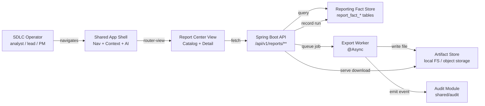
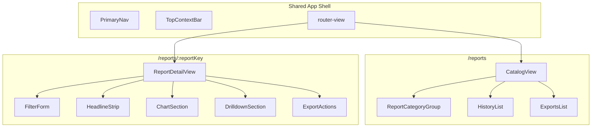
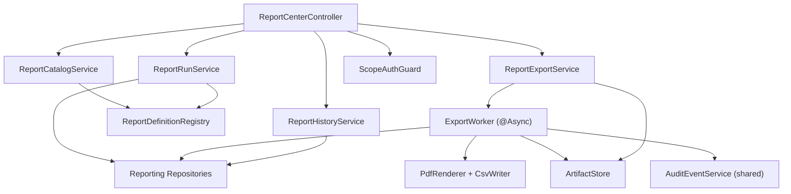
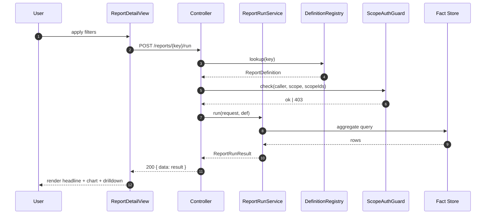
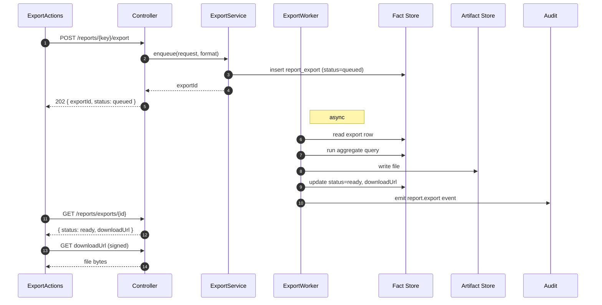
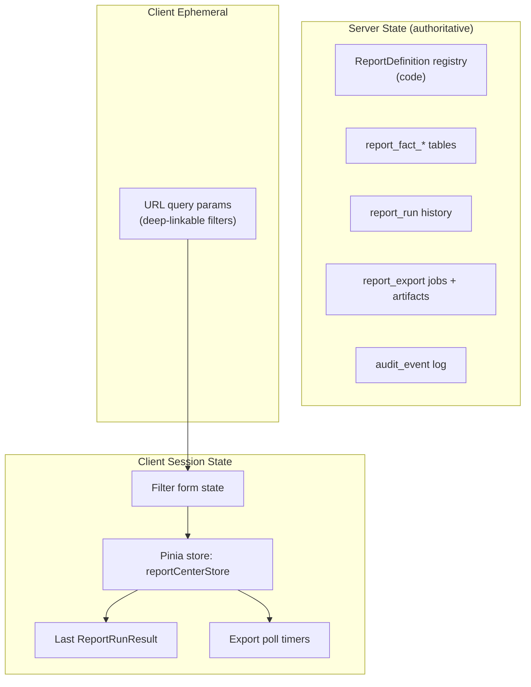

# Report Center Architecture

## Purpose

Defines the technical architecture for the **Report Center** slice — the
historical, filterable, exportable, reusable reporting surface of the
Agentic SDLC Control Tower.

## 1. Architecture Goal

Build a backend-driven, aggregate-store-backed reporting surface that:

- serves a curated catalog of canned reports (V1: Efficiency only)
- resolves caller-scoped queries safely against a reporting fact store
- renders responses in a section-isolated envelope (chart failure ≠ full failure)
- produces CSV and PDF exports asynchronously with 7-day artifact retention
- audits every export via the existing platform audit module

## 2. System Context

## 3. Technology Stack

Inherits from the shared app shell and existing backend:

| Layer | Technology |
|-------|-----------|
| Frontend framework | Vue 3 (Composition API, `<script setup>`) |
| Build tool | Vite |
| Routing | Vue Router |
| Client state | Pinia |
| Backend framework | Spring Boot 3.x (Java 21) |
| ORM | JPA / Hibernate |
| Database | H2 (local) / Oracle (prod) |
| Migrations | Flyway |
| Async jobs | Spring `@Async` with dedicated executor |
| PDF rendering | OpenHTMLtoPDF (server-side HTML → PDF) |
| CSV generation | Apache Commons CSV |

Report Center-specific additions:

| Layer | Technology | Rationale |
|-------|-----------|-----------|
| Charts (frontend) | ECharts 5.x via vue-echarts | First chart-heavy slice; reuse planned by design system |
| Virtual table | `@tanstack/vue-table` | Drilldown tables can be thousands of rows |
| Date handling | `date-fns` | Time-range presets |

## 4. Component Breakdown

### 4.1 Frontend component tree

### 4.2 Backend component tree

### 4.3 Component responsibilities (backend)

| Component | Responsibility |
|-----------|----------------|
| `ReportCenterController` | REST entry point; delegates to services |
| `ReportDefinitionRegistry` | In-memory catalog of compile-time `ReportDefinition` objects |
| `ReportCatalogService` | Returns catalog filtered by caller's accessible scopes |
| `ReportRunService` | Validates request, resolves scope, executes aggregate query, assembles `ReportRunResult` |
| `ReportExportService` | Accepts export requests, creates `ExportJob`, hands off to worker |
| `ExportWorker` | Async generation of CSV/PDF; writes artifact + emits audit event |
| `ReportHistoryService` | Queries `report_run` and `report_export` tables |
| `ScopeAuthGuard` | Checks caller vs. requested scope; throws 403 if mismatch |
| `PdfRenderer` | Takes a HTML template + data → PDF bytes (OpenHTMLtoPDF) |
| `CsvWriter` | Streams drilldown rows to file |
| `ArtifactStore` | File storage abstraction; local FS in dev, object storage in prod |

## 5. Data Flow (high level)

Full sequence diagrams in
[`report-center-data-flow.md`](./report-center-data-flow.md).

### 5.1 Report run

### 5.2 Export

## 6. State Boundaries

Key rules:

- **Client holds no authoritative data.** All facts live server-side.
- **Filters are URL-driven** where practical so reports are linkable.
- **History + exports are server state.** Local caches are a convenience.
- **No `localStorage` usage** — per artifacts restriction and because
  session-scoped persistence (REQ-RPT-24) is sufficient.

## 7. Integration Points

### 7.1 With Dashboard

Separate views; no shared state. The `SectionResult<T>` envelope pattern is
re-used so frontend section-isolation components can be shared.

### 7.2 With Workspace / Scope

`ScopeAuthGuard` calls into `platform/workspace/WorkspaceContextService` to
resolve "what workspaces/projects does this user have access to?" — same
source of truth used by the rest of the app.

### 7.3 With Audit

`ExportWorker` emits `report.export` events through
`shared/audit/AuditEventService`. No new audit infrastructure is introduced.

### 7.4 With Adapters (upstream data)

Report Center **reads only** from `report_fact_*` tables. Population of
these tables is the responsibility of adapter ingestion pipelines
(out of scope for this slice; tracked separately).

## 8. Non-Functional Concerns

### 8.1 Performance budget

| Endpoint | Budget (p95) |
|----------|--------------|
| GET catalog | 200 ms |
| POST run | 2.5 s |
| POST export (202 accept) | 200 ms |
| POST export CSV generation | 10 s |
| POST export PDF generation | 20 s |
| GET history | 300 ms |

### 8.2 Concurrency

- Per-user concurrent runs: cap at **5**; 6th returns 429.
- Per-user concurrent exports: cap at **3**.
- Export worker pool: 4 threads in V1.

### 8.3 Error isolation

- Controller maps known exceptions to 4xx via `GlobalExceptionHandler`.
- Section-level errors (chart-only, drilldown-only) are returned inside
  `SectionResult.error` with 200 status.

### 8.4 Observability

- Log per run: `reportKey`, scope, filter hash, duration, row count.
- Metric `report_run_duration_seconds{reportKey}` histogram.
- Metric `report_export_duration_seconds{format}` histogram.
- Metric `report_export_size_bytes{format}` gauge.

### 8.5 Security

- All endpoints under `/api/v1/reports/**` require authenticated caller.
- `ScopeAuthGuard` enforces scope access on every request.
- Export download URLs are short-lived signed URLs (TTL 15 minutes).
- CSV export rejects > 100k rows (413) — protects memory and egress.

## 9. Build and Deploy

Inherits the slice's existing Maven backend and Vite frontend pipelines.
Export worker runs **in-process** in V1 (Spring `@Async` with a dedicated
executor). Out-of-process worker (e.g. a job queue) is a V2 concern if
scale demands.

## 10. Risks and Mitigations

| Risk | Mitigation |
|------|------------|
| Aggregate query exceeds budget | Enforce mandatory indexes on `report_fact_*`; p95 alert; slow-warning header |
| Export memory blowup | CSV streams row-by-row; PDF bounded to drilldown ≤ 10k rows rendered as table |
| Audit module missing | Hard fail at startup if `AuditEventService` is not present — Report Center will not run without audit |
| Scope leakage via crafted request | Central `ScopeAuthGuard` that *always* narrows, never just filters |
| Fact tables empty (no adapter yet) | Seed data via Flyway `V{n+1}__report_center_seed.sql` for dev profile only |

## 11. Out-of-Scope (architecture)

- No dedicated reporting data warehouse — we query the same OLTP DB for V1
- No materialized views (evaluate in V2 if query p95 is at risk)
- No server-sent events / websocket — polling for export readiness
- No offline / exportable dashboards — PDF is a snapshot only
- No cross-cluster / cross-tenant federation

## 12. Traceability

| Arch section | Spec section | Requirement IDs |
|--------------|--------------|-----------------|
| §2 System context | §1, §9 | REQ-RPT-01..04 |
| §4 Components | §1, §2, §4 | REQ-RPT-10..15 |
| §5.1 Run flow | §4, §6.2 | REQ-RPT-20..32 |
| §5.2 Export flow | §6.3, §6.5 | REQ-RPT-40..43 |
| §6 State boundaries | §2 | REQ-RPT-24, REQ-RPT-60..62 |
| §7 Integration | §9 | REQ-RPT-42, REQ-RPT-70..72 |
| §8 NFRs | §7 | REQ-RPT-80..83 |
