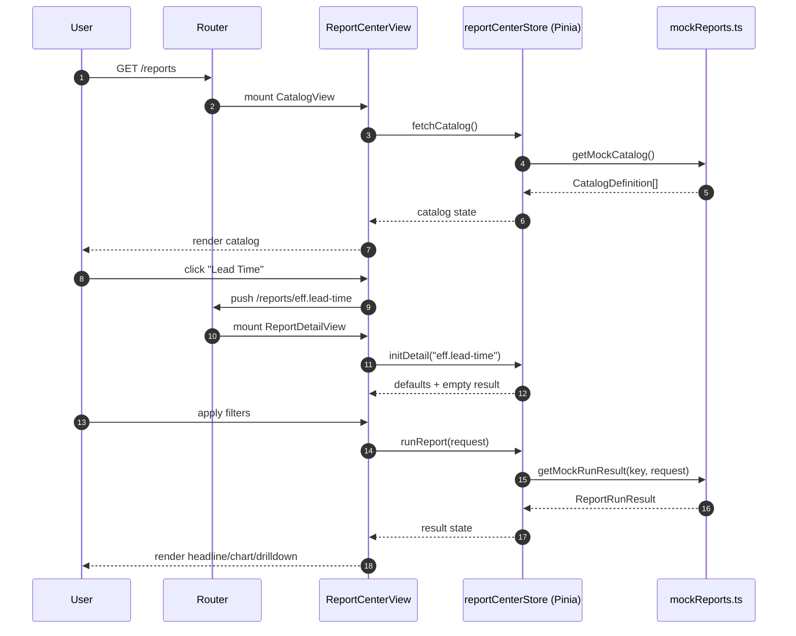
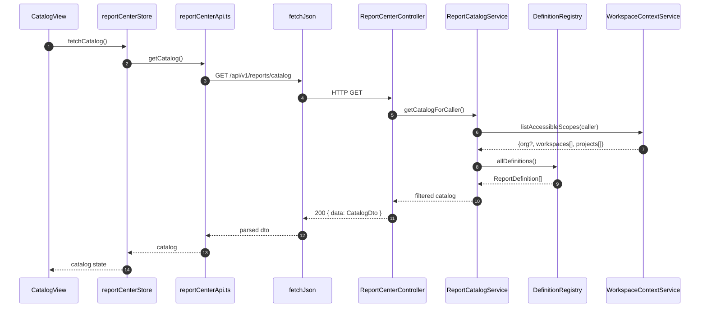
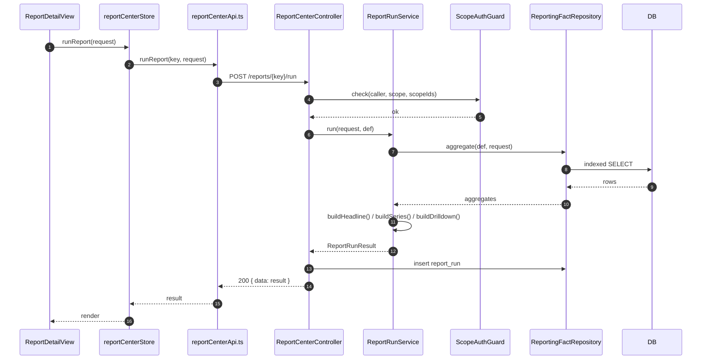
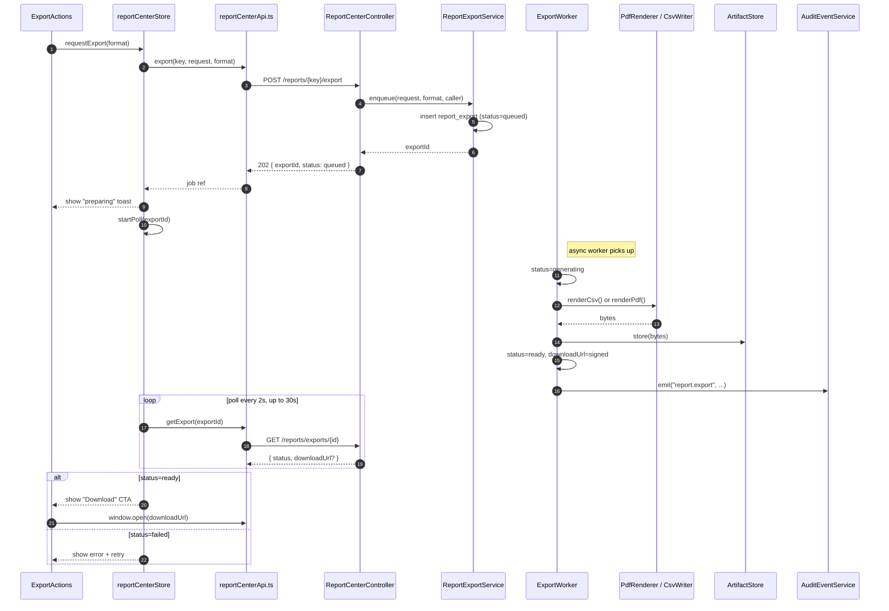
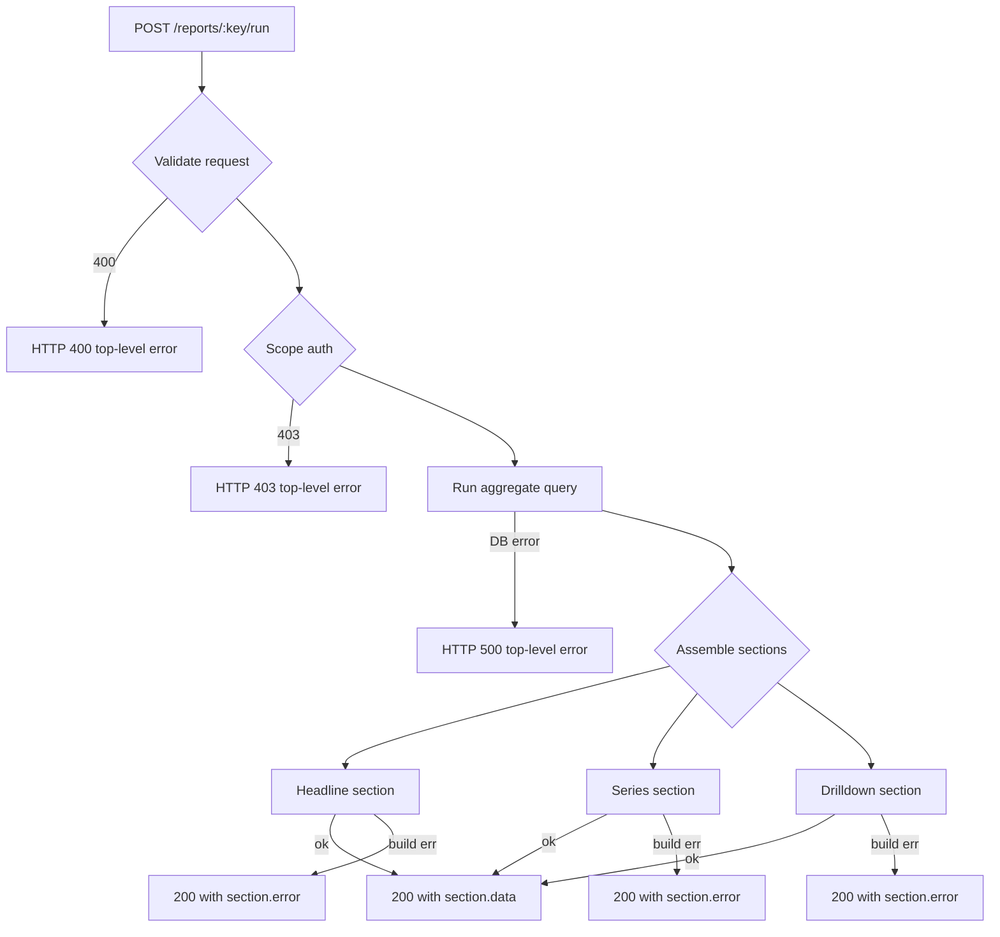
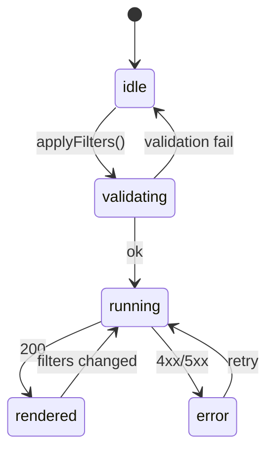
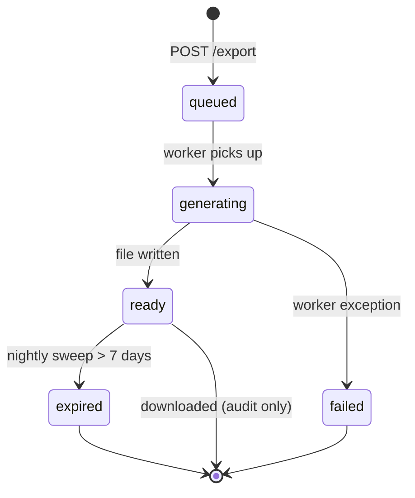
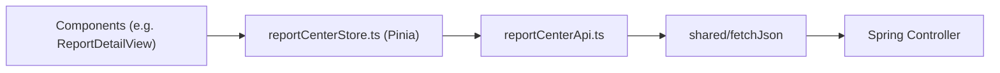

# Report Center — Data Flow

## Purpose

Runtime data flows for the **Report Center** slice. Sequence diagrams,
state machines, error cascades, and refresh strategy. This document
supplements [`report-center-architecture.md`](./report-center-architecture.md).

---

## 1. Phase A: Frontend with Mock Data



**Phase A contract:** All network effects replaced by `mockReports.ts`.
`useMockData` flag = `true` during FE development before backend is live.

---

## 2. Phase B: Frontend → Backend

### 2.1 Catalog load



### 2.2 Report run



### 2.3 Export (async)



---

## 3. Error Cascade

Report Center uses **section-isolated** responses so a failure in one
section does not fail the full page.



Rules:

- **Top-level failure** (validation, auth, DB connection, unhandled
  exception) → 4xx/5xx with `{ error: { code, message } }`.
- **Section-level failure** (chart builder threw, drilldown exceeded
  soft limit) → 200 with `SectionResult.error` set for that section and
  `SectionResult.data = null`.
- Frontend renders each section independently; one section's error cannot
  crash the view.

---

## 4. State Machines

### 4.1 Frontend report run state



### 4.2 Export job state



---

## 5. Refresh Strategy

- **Catalog** — fetched once per session; refreshed if user navigates away
  and back after > 5 minutes.
- **Report run** — on-demand only; no auto-refresh in V1 (reports are
  historical snapshots, not live).
- **History / Exports** — fetched on tab activation; soft refresh every
  30 seconds while the tab is visible, using the page-visibility API.
- **Export polling** — every 2 seconds for 30 seconds after POST; then
  stop and show "still generating — come back later" hint.

---

## 6. Deep-linking and URL State

Filter state is mirrored to the URL query string so reports are linkable:

```
/reports/eff.lead-time?scope=workspace&scopeIds=ws-1,ws-2&preset=last30d&grouping=team
```

On mount, `ReportDetailView` parses URL → populates filter form → kicks
off a run. On filter change, the URL is `replaceState`-d (no new history
entry for every keystroke).

---

## 7. Audit Flow

Every successful export emits:

```
AuditEvent {
  event:   "report.export",
  actor:   callerUserId,
  subject: reportKey,
  at:      now(),
  attrs: {
    scope: "workspace",
    scopeIds: ["ws-1"],
    timeRange: { preset: "last30d" },
    grouping: "team",
    format: "pdf",
    exportId: "exp-abc",
    rowCount: 812,
    bytes: 482113
  }
}
```

Routed through `shared/audit/AuditEventService.record(event)`. The call is
**synchronous from the worker's perspective** — if audit write fails, the
export is marked `failed`. "No audit, no export" is a hard invariant
(REQ-RPT-42 is load-bearing).

---

## 8. Frontend API Client Chain



- `useMockData=true` in dev → `API` returns mock instead of calling `HTTP`.
- `useMockData=false` → normal flow through `fetchJson` which applies the
  same envelope parsing as other slices.

---

## 9. Traceability

| Flow | Spec ref | Requirement IDs |
|------|----------|-----------------|
| §1 Phase A | §9.3 | (FE decoupling) |
| §2.1 Catalog | §6.1 | REQ-RPT-10, REQ-RPT-70 |
| §2.2 Run | §6.2 | REQ-RPT-20..32, REQ-RPT-60 |
| §2.3 Export | §6.3, §6.5 | REQ-RPT-40..43 |
| §3 Error cascade | §4.1, §4.2 | REQ-RPT-32, REQ-RPT-81 |
| §4 State machines | §5 | REQ-RPT-22 |
| §5 Refresh | §6 | REQ-RPT-61 |
| §7 Audit | §6.5 | REQ-RPT-42 |
