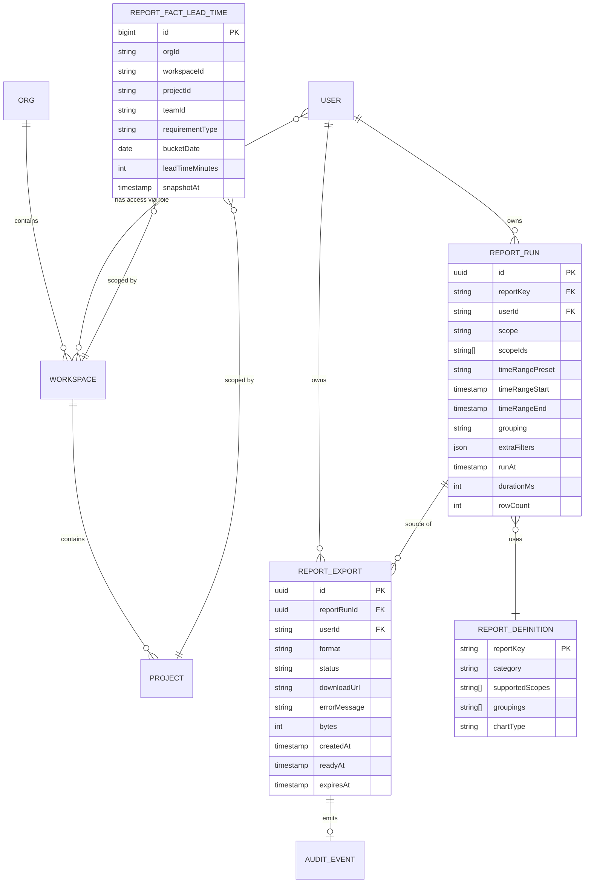

# Report Center — Data Model

## Purpose

Domain model, frontend types, backend DTOs/entities, DB schema DDL, and
frontend-to-backend type mapping for the **Report Center** slice.

Supplements
[`report-center-architecture.md`](./report-center-architecture.md) and
[`report-center-design.md`](../05-design/report-center-design.md).

---

## 1. Domain Model (ER overview)



Other fact tables (`report_fact_cycle_time`, `report_fact_throughput`,
`report_fact_wip`, `report_fact_flow_efficiency`) follow the same pattern.

---

## 2. Frontend Types

Location: `frontend/src/features/reportcenter/types.ts`

```typescript
// ---------- Catalog ----------
export type ReportCategory = "efficiency" | "quality" | "stability" | "governance" | "ai-contribution";
export type ReportScope = "org" | "workspace" | "project";
export type ChartType = "histogram" | "stacked-bar" | "grouped-bar" | "heatmap" | "horizontal-bar";

export interface ReportDefinitionDto {
  reportKey: string;
  category: ReportCategory;
  name: string;
  description: string;
  supportedScopes: ReportScope[];
  supportedGroupings: string[];
  defaultGrouping: string;
  chartType: ChartType;
  drilldownColumns: DrilldownColumnSpec[];
  status: "enabled" | "coming-soon";
}

export interface DrilldownColumnSpec {
  key: string;
  label: string;
  type: "string" | "number" | "date" | "duration";
  format?: string; // e.g. "iso8601", "minutes", "percent-1"
}

export interface CatalogDto {
  categories: Array<{
    category: ReportCategory;
    label: string;
    reports: ReportDefinitionDto[];
  }>;
}

// ---------- Run request ----------
export type TimeRangePreset =
  | "last7d" | "last30d" | "last90d"
  | "qtd" | "ytd" | "custom";

export interface TimeRange {
  preset: TimeRangePreset;
  startAt?: string; // ISO 8601 when preset = custom
  endAt?: string;
}

export interface ReportRunRequest {
  scope: ReportScope;
  scopeIds: string[];
  timeRange: TimeRange;
  grouping: string;
  extraFilters?: Record<string, unknown>;
}

// ---------- Run result (section-isolated) ----------
export interface SectionResult<T> {
  data: T | null;
  error: string | null;
}

export interface HeadlineMetric {
  key: string;
  label: string;
  value: string;       // pre-formatted
  numericValue: number;
  trend?: number;      // percent, signed
  trendIsPositive?: boolean;
}

export interface SeriesPoint {
  groupKey: string;    // e.g. "team-alpha"
  groupLabel: string;
  x: string | number;  // dimension (e.g. bucket week / stage name)
  y: number;
  secondary?: Record<string, number>;
}

export interface DrilldownRow {
  [key: string]: string | number | null;
}

export interface ReportRunResult {
  reportKey: string;
  snapshotAt: string;  // ISO 8601
  scope: ReportScope;
  scopeIds: string[];
  timeRange: TimeRange;
  grouping: string;
  headline: SectionResult<HeadlineMetric[]>;
  series:   SectionResult<SeriesPoint[]>;
  drilldown: SectionResult<{
    columns: DrilldownColumnSpec[];
    rows: DrilldownRow[];
    totalRows: number;
  }>;
  slow?: boolean;
}

// ---------- Export ----------
export type ExportFormat = "csv" | "pdf";
export type ExportStatus = "queued" | "generating" | "ready" | "failed" | "expired";

export interface ExportJobDto {
  id: string;
  reportKey: string;
  format: ExportFormat;
  status: ExportStatus;
  downloadUrl?: string;
  errorMessage?: string;
  bytes?: number;
  createdAt: string;
  readyAt?: string;
  expiresAt?: string;
}

// ---------- History ----------
export interface ReportRunHistoryEntry {
  runId: string;
  reportKey: string;
  reportName: string;
  scope: ReportScope;
  scopeSummary: string;   // e.g. "Workspace: 2"
  timeRangeLabel: string; // e.g. "Last 30 days"
  grouping: string;
  runAt: string;
  durationMs: number;
}

export interface ReportExportHistoryEntry {
  exportId: string;
  reportKey: string;
  reportName: string;
  format: ExportFormat;
  status: ExportStatus;
  createdAt: string;
  expiresAt?: string;
  downloadUrl?: string;
  bytes?: number;
}
```

---

## 3. Backend DTOs

Location: `backend/src/main/java/com/sdlctower/domain/reportcenter/dto/`

Java records matching the frontend types exactly (camelCase JSON):

```java
// SectionResultDto<T> — reused pattern from dashboard
public record SectionResultDto<T>(T data, String error) {
    public static <T> SectionResultDto<T> ok(T data) { return new SectionResultDto<>(data, null); }
    public static <T> SectionResultDto<T> fail(String error) { return new SectionResultDto<>(null, error); }
}

public record ReportDefinitionDto(
    String reportKey,
    String category,
    String name,
    String description,
    List<String> supportedScopes,
    List<String> supportedGroupings,
    String defaultGrouping,
    String chartType,
    List<DrilldownColumnSpec> drilldownColumns,
    String status
) {}

public record DrilldownColumnSpec(
    String key, String label, String type, String format
) {}

public record CatalogDto(
    List<CategoryGroup> categories
) {
    public record CategoryGroup(String category, String label, List<ReportDefinitionDto> reports) {}
}

public record TimeRangeDto(String preset, Instant startAt, Instant endAt) {}

public record ReportRunRequestDto(
    String scope,
    List<String> scopeIds,
    TimeRangeDto timeRange,
    String grouping,
    Map<String, Object> extraFilters
) {}

public record HeadlineMetricDto(
    String key, String label, String value, double numericValue,
    Double trend, Boolean trendIsPositive
) {}

public record SeriesPointDto(
    String groupKey, String groupLabel, Object x, double y, Map<String, Double> secondary
) {}

public record DrilldownDto(
    List<DrilldownColumnSpec> columns,
    List<Map<String, Object>> rows,
    int totalRows
) {}

public record ReportRunResultDto(
    String reportKey,
    Instant snapshotAt,
    String scope,
    List<String> scopeIds,
    TimeRangeDto timeRange,
    String grouping,
    SectionResultDto<List<HeadlineMetricDto>> headline,
    SectionResultDto<List<SeriesPointDto>> series,
    SectionResultDto<DrilldownDto> drilldown,
    Boolean slow
) {}

public record ExportJobDto(
    String id, String reportKey, String format, String status,
    String downloadUrl, String errorMessage, Long bytes,
    Instant createdAt, Instant readyAt, Instant expiresAt
) {}

public record ReportRunHistoryEntryDto(
    String runId, String reportKey, String reportName,
    String scope, String scopeSummary, String timeRangeLabel,
    String grouping, Instant runAt, long durationMs
) {}

public record ReportExportHistoryEntryDto(
    String exportId, String reportKey, String reportName,
    String format, String status,
    Instant createdAt, Instant expiresAt,
    String downloadUrl, Long bytes
) {}
```

---

## 4. Backend Entities

Location: `backend/src/main/java/com/sdlctower/domain/reportcenter/entity/`

```java
@Entity @Table(name = "report_run")
public class ReportRun {
    @Id @GeneratedValue(strategy = GenerationType.UUID)
    private UUID id;
    @Column(nullable = false) private String reportKey;
    @Column(nullable = false) private String userId;
    @Column(nullable = false) private String scope;
    @Column(nullable = false, columnDefinition = "text") private String scopeIdsJson;
    @Column(nullable = false) private String timeRangePreset;
    private Instant timeRangeStart;
    private Instant timeRangeEnd;
    @Column(nullable = false) private String grouping;
    @Column(columnDefinition = "text") private String extraFiltersJson;
    @Column(nullable = false) private Instant runAt;
    private int durationMs;
    private int rowCount;
    // ... getters/setters or @Data if Lombok allowed — current slice rule says no Lombok
}

@Entity @Table(name = "report_export")
public class ReportExport {
    @Id @GeneratedValue(strategy = GenerationType.UUID)
    private UUID id;
    @Column(nullable = false) private UUID reportRunId;
    @Column(nullable = false) private String userId;
    @Column(nullable = false) private String reportKey;
    @Column(nullable = false) private String format; // csv | pdf
    @Column(nullable = false) private String status; // queued | generating | ready | failed | expired
    @Column private String downloadUrl;
    @Column(columnDefinition = "text") private String errorMessage;
    @Column private Long bytes;
    @Column(nullable = false) private Instant createdAt;
    @Column private Instant readyAt;
    @Column private Instant expiresAt;
    // ...
}
```

Report definitions are **code** (enum-like registry), not a table.

Fact tables are read-only for Report Center; the entities are mapped
as `@Entity` with `@Immutable` for JPA but no write methods.

---

## 5. Database Schema (DDL)

Location: `backend/src/main/resources/db/migration/`

Per CLAUDE.md rule 4, all schema changes go through Flyway. File naming:
`V{nextVersion}__report_center_*.sql`. Use the next unclaimed version
number (check `src/main/resources/db/migration/` at implementation time).

### 5.1 `V{n}__report_center_run_export.sql`

```sql
CREATE TABLE report_run (
  id                  VARCHAR(36)  NOT NULL PRIMARY KEY,
  report_key          VARCHAR(64)  NOT NULL,
  user_id             VARCHAR(64)  NOT NULL,
  scope               VARCHAR(16)  NOT NULL,
  scope_ids_json      CLOB         NOT NULL,
  time_range_preset   VARCHAR(16)  NOT NULL,
  time_range_start    TIMESTAMP,
  time_range_end      TIMESTAMP,
  grouping            VARCHAR(64)  NOT NULL,
  extra_filters_json  CLOB,
  run_at              TIMESTAMP    NOT NULL,
  duration_ms         INTEGER      NOT NULL DEFAULT 0,
  row_count           INTEGER      NOT NULL DEFAULT 0
);
CREATE INDEX idx_report_run_user_runat ON report_run(user_id, run_at DESC);
CREATE INDEX idx_report_run_key         ON report_run(report_key);

CREATE TABLE report_export (
  id              VARCHAR(36)  NOT NULL PRIMARY KEY,
  report_run_id   VARCHAR(36)  NOT NULL,
  user_id         VARCHAR(64)  NOT NULL,
  report_key      VARCHAR(64)  NOT NULL,
  format          VARCHAR(8)   NOT NULL,
  status          VARCHAR(16)  NOT NULL,
  download_url    VARCHAR(512),
  error_message   CLOB,
  bytes           BIGINT,
  created_at      TIMESTAMP    NOT NULL,
  ready_at        TIMESTAMP,
  expires_at      TIMESTAMP
);
CREATE INDEX idx_report_export_user_created ON report_export(user_id, created_at DESC);
CREATE INDEX idx_report_export_status        ON report_export(status);
CREATE INDEX idx_report_export_expires       ON report_export(expires_at);
```

### 5.2 `V{n+1}__report_center_facts.sql`

```sql
CREATE TABLE report_fact_lead_time (
  id                  BIGINT       NOT NULL PRIMARY KEY,
  org_id              VARCHAR(64)  NOT NULL,
  workspace_id        VARCHAR(64)  NOT NULL,
  project_id          VARCHAR(64)  NOT NULL,
  team_id             VARCHAR(64),
  requirement_type    VARCHAR(64),
  bucket_date         DATE         NOT NULL,
  lead_time_minutes   INTEGER      NOT NULL,
  snapshot_at         TIMESTAMP    NOT NULL
);
CREATE INDEX idx_rf_lt_scope ON report_fact_lead_time(workspace_id, project_id, bucket_date);
CREATE INDEX idx_rf_lt_org   ON report_fact_lead_time(org_id, bucket_date);

CREATE TABLE report_fact_cycle_time (
  id                  BIGINT       NOT NULL PRIMARY KEY,
  org_id              VARCHAR(64)  NOT NULL,
  workspace_id        VARCHAR(64)  NOT NULL,
  project_id          VARCHAR(64)  NOT NULL,
  team_id             VARCHAR(64),
  stage               VARCHAR(32)  NOT NULL,
  bucket_date         DATE         NOT NULL,
  cycle_time_minutes  INTEGER      NOT NULL,
  snapshot_at         TIMESTAMP    NOT NULL
);
CREATE INDEX idx_rf_ct_scope ON report_fact_cycle_time(workspace_id, project_id, bucket_date);

CREATE TABLE report_fact_throughput (
  id              BIGINT       NOT NULL PRIMARY KEY,
  org_id          VARCHAR(64)  NOT NULL,
  workspace_id    VARCHAR(64)  NOT NULL,
  project_id      VARCHAR(64)  NOT NULL,
  team_id         VARCHAR(64),
  week_start      DATE         NOT NULL,
  items_completed INTEGER      NOT NULL,
  snapshot_at     TIMESTAMP    NOT NULL
);
CREATE INDEX idx_rf_tp_scope_week ON report_fact_throughput(workspace_id, project_id, week_start);

CREATE TABLE report_fact_wip (
  id           BIGINT       NOT NULL PRIMARY KEY,
  org_id       VARCHAR(64)  NOT NULL,
  workspace_id VARCHAR(64)  NOT NULL,
  project_id   VARCHAR(64)  NOT NULL,
  team_id      VARCHAR(64),
  owner_id     VARCHAR(64),
  stage        VARCHAR(32)  NOT NULL,
  age_bucket   VARCHAR(16)  NOT NULL,   -- "0-3d" | "3-7d" | "7-14d" | "14d+"
  item_count   INTEGER      NOT NULL,
  snapshot_at  TIMESTAMP    NOT NULL
);
CREATE INDEX idx_rf_wip_scope ON report_fact_wip(workspace_id, project_id, stage);

CREATE TABLE report_fact_flow_efficiency (
  id               BIGINT       NOT NULL PRIMARY KEY,
  org_id           VARCHAR(64)  NOT NULL,
  workspace_id     VARCHAR(64)  NOT NULL,
  project_id       VARCHAR(64)  NOT NULL,
  team_id          VARCHAR(64),
  stage            VARCHAR(32)  NOT NULL,
  bucket_date      DATE         NOT NULL,
  active_minutes   INTEGER      NOT NULL,
  total_minutes    INTEGER      NOT NULL,
  snapshot_at      TIMESTAMP    NOT NULL
);
CREATE INDEX idx_rf_fe_scope ON report_fact_flow_efficiency(workspace_id, project_id, stage, bucket_date);
```

### 5.3 `V{n+2}__report_center_seed.sql` (local profile only)

Seed minimal synthetic rows per fact table so dev environments can run
reports without a real adapter feed. Wrapped in Flyway profile-gated
migration (or simply left as baseline dev seed — adapt to existing
project convention).

---

## 6. Frontend ↔ Backend Type Mapping

| Frontend TS type | Backend DTO | Notes |
|------------------|-------------|-------|
| `ReportDefinitionDto` | `ReportDefinitionDto` record | camelCase JSON |
| `DrilldownColumnSpec` | `DrilldownColumnSpec` record | 1:1 |
| `CatalogDto` | `CatalogDto` record | 1:1 |
| `TimeRange` | `TimeRangeDto` record | `Instant` ↔ ISO-8601 string |
| `ReportRunRequest` | `ReportRunRequestDto` record | `Map<String, Object>` for `extraFilters` |
| `SectionResult<T>` | `SectionResultDto<T>` record | same shape as Dashboard |
| `HeadlineMetric` | `HeadlineMetricDto` record | numericValue is `double`; value is pre-formatted string |
| `SeriesPoint` | `SeriesPointDto` record | `Object x` — string or number |
| `DrilldownRow` | `Map<String, Object>` | dynamic keys per report definition |
| `ReportRunResult` | `ReportRunResultDto` record | all 3 sections wrapped |
| `ExportJobDto` | `ExportJobDto` record | 1:1 |
| `ReportRunHistoryEntry` | `ReportRunHistoryEntryDto` record | 1:1 |
| `ReportExportHistoryEntry` | `ReportExportHistoryEntryDto` record | 1:1 |

### 6.1 Timestamps

All timestamps are ISO-8601 `Instant` on the wire. Backend uses
`com.fasterxml.jackson.datatype.jsr310.JavaTimeModule` (should already be
registered from existing slices).

### 6.2 Enums

Enum-like strings are **strings on the wire**, not Java enums, so the
frontend does not break if a new value appears before frontend updates.
Backend validates against `ReportDefinition` lookup.

---

## 7. Database Schema Evolution

| Change | Migration strategy |
|--------|-------------------|
| Add new report (V2) | New fact table + new `ReportDefinition` + new Flyway migration |
| Add new grouping to existing report | Update `ReportDefinition.supportedGroupings` in code; no DB change |
| Add new category | Update code enum + catalog-grouping label; no DB change |
| Change export retention | Update sweep job config; no DB change |
| Partition fact tables (V2 scale) | Oracle partitioning migration; H2 unchanged |

---

## 8. Traceability

| Model section | Requirement IDs |
|---------------|-----------------|
| §1 Domain ER | REQ-RPT-10..15, REQ-RPT-50, REQ-RPT-40..42 |
| §2 FE types | REQ-RPT-20..32, REQ-RPT-40..51 |
| §3 BE DTOs | Spec §4, §8 |
| §4 Entities | REQ-RPT-50..51, REQ-RPT-42 |
| §5 DDL | REQ-RPT-70..72 (scope columns); CLAUDE.md rule 4 (Flyway) |
| §6 Type mapping | Spec §8 |
