# System Architecture: Requirement Management

## Overview
- **Architecture Summary**: The Requirement Management module is the entry point for the Spec Driven Development (SDD) chain — it manages requirements, enables User Story derivation, links to Specs as the execution hub, and provides AI-assisted analysis. Requirements flow downstream through the full SDLC chain: Requirement -> User Story -> Spec -> Architecture -> Design -> Tasks -> Code -> Test -> Deploy -> Incident -> Learning. The module follows the same layered architecture as the Dashboard and Incident modules: Vue 3 frontend with Pinia stores, Spring Boot REST API, and relational persistence.
- **Design Objective**: Provide a high-density requirement management surface where spec linkage, chain traceability, decomposition completeness, and AI analysis are first-class concerns — not secondary features hidden behind menus.
- **Architectural Style**: Layered service architecture within a modular monolith (package-by-feature), consistent with the existing Dashboard and Incident domains.

---

## Source Specification
- **Feature / System Name**: Requirement Management
- **Scope Summary**: Requirement list (with filtering, sorting, text search), kanban view (drag-and-drop status transitions), priority matrix (impact vs. effort 2x2 grid), requirement detail view (header, description, acceptance criteria, chain traceability, AI analysis), User Story derivation, Spec generation and linkage, chain completeness tracking, and AI-assisted analysis. Phase A delivers frontend with mocked data; Phase B adds backend API.

---

## Architectural Drivers

### Key Functional Drivers
- Requirement lifecycle management with explicit state machine (Draft -> In Review -> Approved -> In Progress -> Delivered -> Archived)
- Spec-centric workflow: Spec as the execution hub, prominently surfaced with status tracking and generation entry points
- User Story derivation with parent-child relationships and decomposition completeness indicators
- Full forward and reverse chain traceability (Requirement -> ... -> Incident -> Learning)
- AI-assisted analysis (quality assessment, ambiguity detection, impact analysis, gap detection)
- Three view modes: list/table, kanban board, priority matrix
- Independent card-level loading and error isolation (SectionResult pattern)
- Multi-source requirement intake (text, Excel, PDF, email, meeting transcript) with AI-powered normalization into structured requirements
- Pluggable pipeline profiles that define chain shape, skill bindings, spec tiering, entry paths, and traceability model per workspace/project
- Profile-adaptive UI rendering — chain visualization, skill actions, and spec tiering adapt to the active profile

### Key Non-Functional Drivers
- Workspace isolation: all requirement data scoped to current workspace context
- Audit trail: all status transitions, governance actions, and field-level changes recorded with actor, timestamp, and reason
- Consistency: follows the same API envelope, design tokens, and frontend patterns established by Dashboard and Incident
- Performance: requirement list must render within 200ms for up to 500 requirements

### Constraints and Assumptions
- Frontend framework: Vue 3 / Vite / Vue Router / Pinia / TypeScript (project standard)
- Backend framework: Spring Boot 3.x / Java 21 / JPA (project standard)
- Database: H2 (local dev), Oracle (production) via Flyway migrations
- API envelope: `ApiResponse<T>` with `data` and `error` fields (verified: `shared/dto/ApiResponse.java`)
- Per-card error isolation: `SectionResult<T>` pattern (verified: `dashboard/types/dashboard.ts` and `shared/dto/SectionResultDto.java`)
- [ASSUMPTION] V1 uses on-load fetch for data; no WebSocket or server-sent events
- [ASSUMPTION] Requirement count per workspace is manageable (<500 active); pagination is supported in V1
- [ASSUMPTION] Configuration-driven behavior (status values, categories, priority levels) uses static config in V1; admin UI configuration deferred to V2

---

## System Context

### Primary Actors
| Actor | Role |
|---|---|
| PM / Business Analyst | Captures requirements, defines acceptance criteria, prioritizes, initiates story derivation and spec generation |
| Architect / Tech Lead | Reviews requirements for technical feasibility, initiates spec generation, validates chain completeness |
| Team Lead / Delivery Manager | Monitors requirement pipeline health, reviews decomposition progress, tracks chain coverage |

### External Systems
| System | Integration Purpose |
|---|---|
| Shared App Shell | Navigation, context bar, AI Command Panel -- hosts the requirement page |
| Dashboard | Requirement health card links to `/requirements` for drill-down |
| Incident Management | Reverse traceability: incidents link back to originating requirements |
| Design Management (future) | Forward chain: design artifacts link to requirement-originated specs |
| AI Center (future) | Skill registry for `req-to-user-story` and `user-story-to-spec` skills |
| Jira / Azure DevOps (future) | Bi-directional requirement and story sync -- out of scope for V1 |
| Pipeline Profile Registry | Provides active profile configuration per workspace/project (Platform Center in future; hardcoded in V1) |
| build-agent-skill (IBM i) | IBM i-specific skills accessed via `ibm-i-workflow-orchestrator` (external skill family; orchestrator routes to appropriate sub-skills internally) |

### System Context Diagram

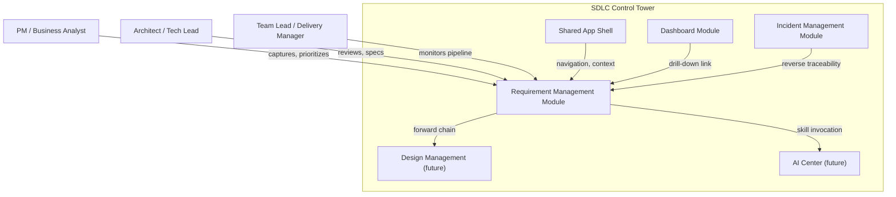

### System Boundary
The Requirement Management module owns all requirement-specific UI components, state management, API endpoints, domain services, and persistence. It depends on the shared app shell for navigation and workspace context. It stores forward chain links (to User Stories, Specs, and downstream artifacts) and receives reverse chain links from Incident Management. External tool integrations (Jira, Azure DevOps) are outside V1 scope.

### Pipeline Profile Architecture

The Requirement Management module supports pluggable pipeline profiles that customize the SDD chain per workspace/project. This is the key extensibility mechanism enabling both standard Java/open-source SDD and enterprise legacy system workflows (e.g., IBM i / iSeries).

#### Profile Selection Model

How the active profile is resolved for a workspace/project:

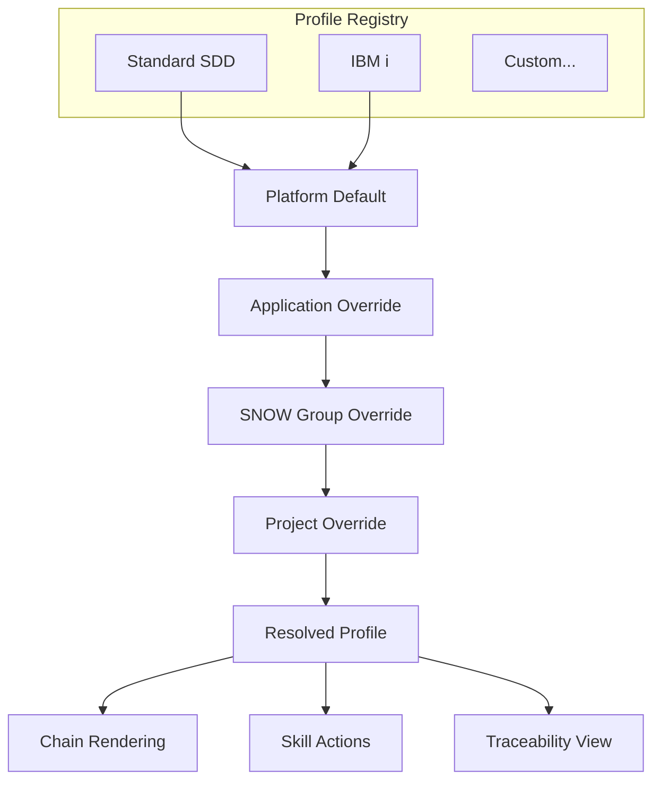

#### Runtime Skill Invocation Model

What happens when the user triggers a skill action — depends on the resolved profile:

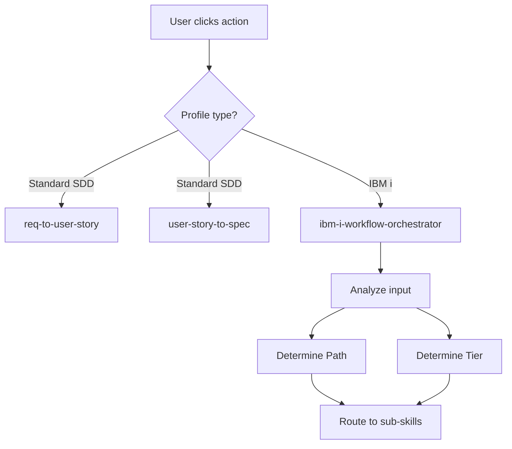

#### Profile Contract

Each profile defines:

| Property | Standard SDD | IBM i |
|----------|-------------|-------|
| chainNodes | Req → Story → Spec → Arch → Design → Tasks → Code → Test → Deploy → Incident → Learning (11) | Requirement Normalizer → Functional Spec → Technical Design → Program Spec → File Spec → UT Plan → Test Scaffold → Spec Review → DDS Review → Code Review (10) |
| executionHub | Spec | Program Spec |
| skills | req-to-user-story, user-story-to-spec | ibm-i-workflow-orchestrator (single entry point) |
| specTiering | null (none) | L1 Lite, L2 Standard, L3 Full (orchestrator-determined) |
| entryPaths | [Standard] | [Full Chain, Enhancement, Fast-Path] (orchestrator-determined, not user-selected) |
| traceabilityModel | per-layer (REQ-xx) | shared-br (BR-xx) |

**IBM i Orchestrator Routing:** The `ibm-i-workflow-orchestrator` is the single skill entry point for the IBM i profile. When invoked, it analyzes the input (requirement text, change scope, affected programs) and automatically determines: (1) the workflow path (Full Chain for new programs, Enhancement for existing source modifications, Fast-Path for small well-understood changes), and (2) the spec tier (L1/L2/L3). The UI displays these decisions as read-only indicators after orchestrator invocation.

#### V1 Implementation Strategy

In V1, profiles are hardcoded as TypeScript constants (no backend API). The two built-in profiles ("Standard SDD" and "IBM i") are defined in `features/requirement/profiles/`. The IBM i profile binds a single skill (`ibm-i-workflow-orchestrator`); the orchestrator handles all path and tier routing internally. Future versions will load profiles from the Platform Center API.

### Intake Architecture

The requirement intake flow is the primary entry point for creating new requirements. It processes unstructured business input through AI normalization to produce structured requirement drafts.

#### Intake Flow

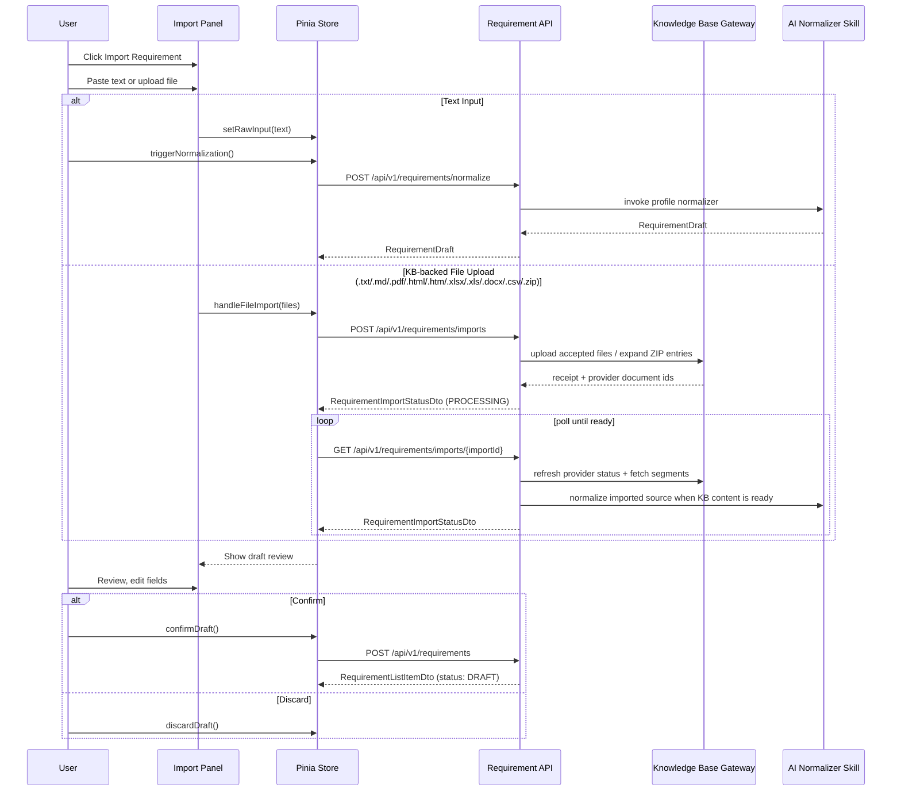

#### File Intake Strategy

| Input | Current Path | Extraction Behavior |
|-------|--------------|--------------------|
| Plain text / pasted email / meeting notes | `POST /requirements/normalize` | Sent directly to the requirement normalizer; synchronous draft response |
| `.txt`, `.md`, `.pdf`, `.html`, `.htm`, `.xlsx`, `.xls`, `.docx`, `.csv` | `POST /requirements/imports` | Uploaded to the configured KB provider, then normalized after KB indexing completes |
| `.zip` | `POST /requirements/imports` | Expanded server-side; supported entries uploaded individually to the KB provider |
| Unsupported ZIP entries | `POST /requirements/imports` | Preserved in the import inspection as `MANUAL_REVIEW`; not parsed into text |
| Standalone image upload | Not enabled in current UI | Deferred until the KB/provider contract supports image ingestion for this page |

The active implementation uses a **provider-backed server-side intake path** for uploaded files. Local development defaults to a stub KB provider; production is expected to use the Dify-backed KB adapter via the internal KB API contract.

#### Batch Processing Architecture

The current implemented upload path treats spreadsheet files as KB-backed document imports, not row-by-row browser parsing. The `BatchPreviewTable` and related components remain in the codebase for a future structured row import mode.

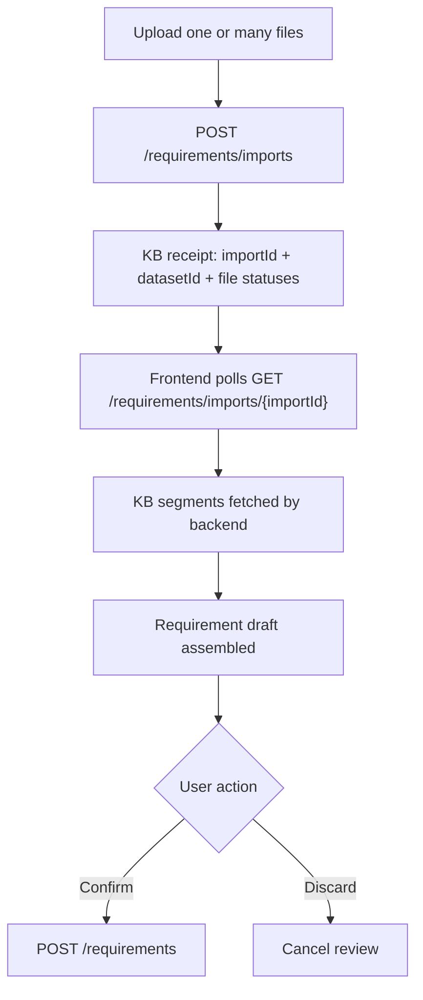

---

## High-Level Architecture

```
+-----------------------------------------------------------------+
|  Users                                                           |
|  PM / BA  .  Architect / Tech Lead  .  Team Lead                 |
+-----------------------------+-----------------------------------+
                              | HTTPS
                              v
+-----------------------------------------------------------------+
|  Vue 3 Frontend (within Shared App Shell)                        |
|  +----------------+  +----------------+  +-------------------+   |
|  | Requirement    |  | Requirement    |  | Requirement       |   |
|  | List View      |  | Kanban View    |  | Detail View       |   |
|  +----------------+  +----------------+  | (6 cards)         |   |
|  +----------------+                      +-------------------+   |
|  | Priority       |  +---------------------------------------+  |
|  | Matrix View    |  | Pinia Store + API Client               |  |
|  +----------------+  +---------------------------------------+  |
+-----------------------------+-----------------------------------+
                              | REST / JSON
                              v
+-----------------------------------------------------------------+
|  Spring Boot API Layer                                           |
|  +------------------------------------------------------------+  |
|  |  Requirement Controller (REST endpoints)                    |  |
|  +------------------------------------------------------------+  |
+------------------------------------------------------------------+
|  Domain Layer                                                    |
|  +------------------+  +------------------+  +----------------+  |
|  | Requirement      |  | Story Derivation |  | Spec Linkage   |  |
|  | Domain           |  | (parent-child,   |  | (generation,   |  |
|  | (lifecycle,      |  |  AI generation,  |  |  status, chain |  |
|  |  state machine,  |  |  decomposition)  |  |  traceability) |  |
|  |  analysis)       |  |                  |  |                |  |
|  +------------------+  +------------------+  +----------------+  |
+------------------------------------------------------------------+
|  Shared Infrastructure                                           |
|  ApiResponse<T> . SectionResultDto<T> . ApiConstants             |
+-----------------------------+-----------------------------------+
|  Persistence (JPA / H2 / Oracle)                                 |
+-----------------------------------------------------------------+
```

### Layer Summary

The module is organized into four primary layers:

- **Presentation Layer** -- Vue 3 components split into four view modes: requirement list (table with filters), kanban board (drag-and-drop columns), priority matrix (2x2 grid), and detail view with 6 independent cards (header, description, acceptance criteria, stories, specs, chain traceability). Pinia store manages state; API client handles REST communication.
- **API Layer** -- Spring Boot REST controller exposing requirement CRUD, story derivation, spec linkage, and chain query endpoints. Uses the shared `ApiResponse<T>` envelope.
- **Domain Layer** -- Three capability groups: Requirement Domain (lifecycle state machine, filtering, search), Story Derivation (parent-child relationships, AI-assisted generation, decomposition tracking), and Spec Linkage (spec generation entry points, status tracking, chain traceability). All state is represented as immutable Java records (DTOs).
- **Persistence Layer** -- JPA entities with Flyway-managed schema. H2 for local dev, Oracle for production. Phase A seeds mock data via Flyway migration; Phase B adds real data access.

---

## Component Breakdown

### Frontend Components

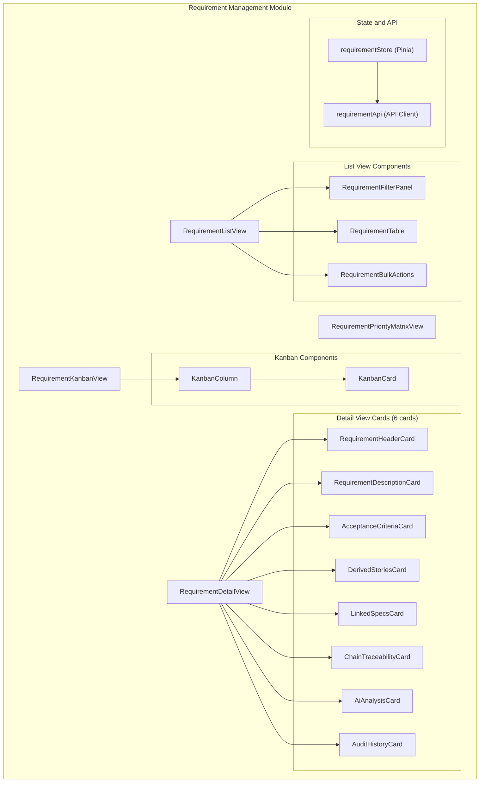

- **Requirement List View**: Table of requirements with filtering (priority, status, category, assignee, date range), sorting (priority, status, recency, title), text search, active/completed tabs, severity/priority distribution summary, and row-click navigation to detail
- **Requirement Kanban View**: Board with columns per lifecycle status (Draft, In Review, Approved, In Progress, Delivered, Archived), drag-and-drop status transitions, priority-based ordering within columns, visual priority indicators, column counts
- **Requirement Priority Matrix View**: 2x2 grid (impact vs. effort) with requirements plotted as interactive nodes, enabling prioritization decisions
- **Requirement Detail View**: Composite view hosting 6 independent cards, each using `SectionResult<T>` for error isolation
- **Requirement Header Card**: ID, title, priority badge, status with state machine transitions, category, assignee, source indicator, timestamps
- **Requirement Description Card**: Full description (rich text), business context, business value, stakeholder references, external references
- **Acceptance Criteria Card**: Structured list of testable criteria with pass/fail status indicators
- **Derived Stories Card**: Parent-child relationship display showing all derived User Stories with ID, title, status, linked spec status, and navigation links. Includes decomposition completeness indicator.
- **Linked Specs Card**: All linked Specs with ID, title, status, version, coverage indicator, and navigation links. Includes prominent "Generate Spec" action button.
- **Chain Traceability Card**: Compressed chain visualization (Requirement -> Story -> Spec -> ... -> Incident) with Spec always visible, expand/collapse control, navigation links, chain health indicator (green/yellow/red)
- **AI Analysis Card**: AI-powered analysis results including quality assessment, ambiguity detection, impact analysis, gap detection. Shows skill execution records with timestamps.
- **Audit History Card**: Chronological log of all changes, governance actions (approve, reject, cancel, re-open), and status transitions with actor, timestamp, field-level diff, and reason
- **Requirement Store (Pinia)**: Manages requirement list, kanban state, priority matrix state, selected requirement detail, section-level loading/error states, filter state, view mode toggle
- **Requirement API Client**: REST client for requirement endpoints using shared `fetchJson<T>`

### Backend Components

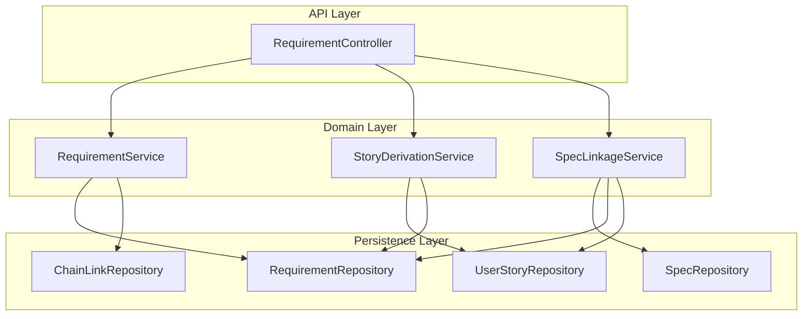

- **Requirement Controller**: REST endpoints for requirement CRUD, list with filters, detail with sections, story derivation trigger, spec generation trigger, chain query. Returns `ApiResponse<T>`.
- **Requirement Service**: Assembles full requirement detail from domain sub-services. Handles lifecycle state machine transitions. Workspace-scoped.
- **Story Derivation Service**: Manages User Story creation from requirements, parent-child linking, decomposition tracking, AI-assisted generation invocation.
- **Spec Linkage Service**: Manages Spec generation entry points, requirement-to-spec and story-to-spec linking, status tracking, coverage calculations.
- **Requirement DTOs**: Immutable Java records matching frontend TypeScript interfaces. Includes per-section `SectionResultDto<T>` wrappers.

### Monitoring / Audit

- **Change tracking entries**: Every field-level change recorded with actor, timestamp, old value, new value, and change reason. Feeds into platform audit system.
- **Governance entries**: Every status transition crossing governance boundaries (e.g., Draft -> Approved) recorded with approval actor, timestamp, reason.
- **AI skill execution records**: Each AI skill invocation (story generation, spec generation, analysis) recorded with skill name, input/output summary, timestamps, and status.

---

## Data Architecture

### Conceptual Entities
| Entity | Description | Key Attributes |
|---|---|---|
| Requirement | A business or technical requirement in a workspace | id, reqCode, title, description, priority, status, category, assignee, source, businessContext, businessValue, workspaceId, timestamps |
| AcceptanceCriterion | A testable criterion on a requirement | id, requirementId, description, status (pass/fail/pending) |
| UserStory | A user story derived from a requirement | id, storyCode, title, description, status, requirementId, linkedSpecId |
| Spec | A specification generated from a story or requirement | id, specCode, title, status, version, sourceRequirementId, sourceStoryId |
| ChainLink | A link to an upstream or downstream SDLC artifact | id, requirementId, artifactType, artifactId, artifactTitle, routePath, direction (forward/reverse) |
| AiAnalysisResult | Result of an AI analysis on a requirement | id, requirementId, analysisType, findings, confidence, timestamp, skillExecutionId |
| ChangeEntry | A field-level change record | id, requirementId, fieldName, oldValue, newValue, actor, timestamp, reason |
| GovernanceEntry | A governance decision record | id, requirementId, action, actor, timestamp, reason, policyRef |

### State / Status Models

**Requirement Status State Machine:**

```
DRAFT --> IN_REVIEW --> APPROVED --> IN_PROGRESS --> DELIVERED --> ARCHIVED

Reverse transitions:
    IN_REVIEW --> DRAFT (reviewer requests revision)
    Any active state --> ARCHIVED (authorized user archives)
```

**User Story Status:**
`Draft --> Ready --> In Progress --> Done`

**Spec Status:**
`Draft --> Review --> Approved --> Implemented`

**Acceptance Criterion Status:**
`PENDING --> PASS | FAIL`

**AI Analysis Status:**
`RUNNING --> COMPLETED | FAILED`

### Persistence Responsibilities
- Phase A: All data mocked via frontend mock data files and/or Flyway seed migration
- Phase B: Requirement domain entities persisted via JPA. Change entries and governance entries are append-only (immutable audit trail). Specs and User Stories are managed as child entities with referential integrity.

---

## Integration Architecture

### Shared App Shell
- **Interaction Pattern**: Requirement page renders inside the shell via Vue Router lazy-load
- **Data exchanged**: Workspace context (from shell store), navigation events
- **Route**: `/requirements` for list/kanban/matrix views, `/requirements/:requirementId` for detail view

### Dashboard Module
- **Interaction Pattern**: Dashboard requirement health card links to `/requirements`
- **Data exchanged**: Navigation link only; no data coupling

### Incident Management Module
- **Interaction Pattern**: Incident SDLC chain card links back to originating requirements; requirement chain traceability card shows linked incidents
- **Data exchanged**: Route path + artifact ID via Vue Router; chain link references stored in both modules
- **Constraint**: Chain links are stored as references (IDs + types), not live joins

### Design Management (future)
- **Interaction Pattern**: Forward chain from requirement -> story -> spec -> architecture -> design
- **Data exchanged**: Chain link references

### AI Center (future)
- **Interaction Pattern**: AI skills (`req-to-user-story`, `user-story-to-spec`, analysis skills) registered in AI Center and invoked from the requirement page
- **Data exchanged**: Skill invocation request/response, execution records

### AI Command Panel
- **Interaction Pattern**: Right-side panel projects requirement-specific context, available skills, and suggested actions
- **Data exchanged**: Current requirement context, skill availability, action suggestions

---

## Workflow / Runtime Architecture

### Request Flow (List View Page Load)

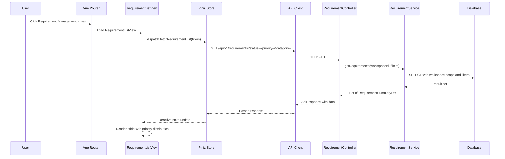

### Navigation to Detail View

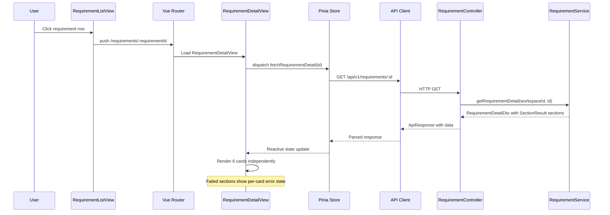

### User Story Derivation Flow

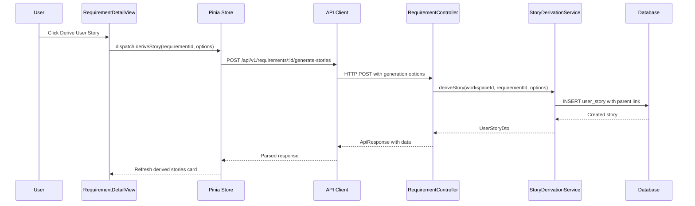

### Spec Generation Flow

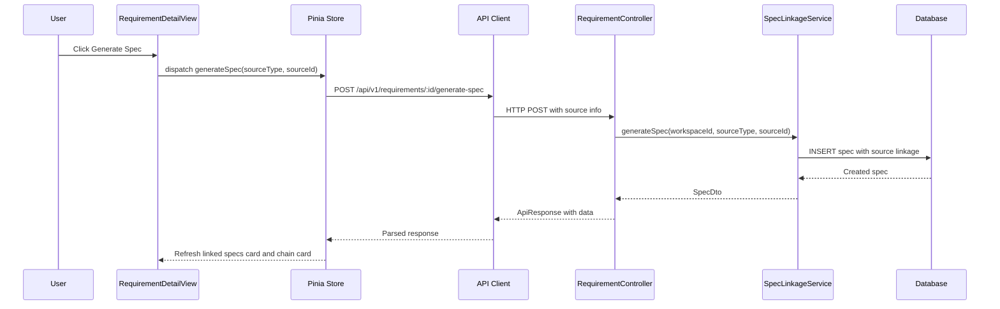

### AI Analysis Request Flow

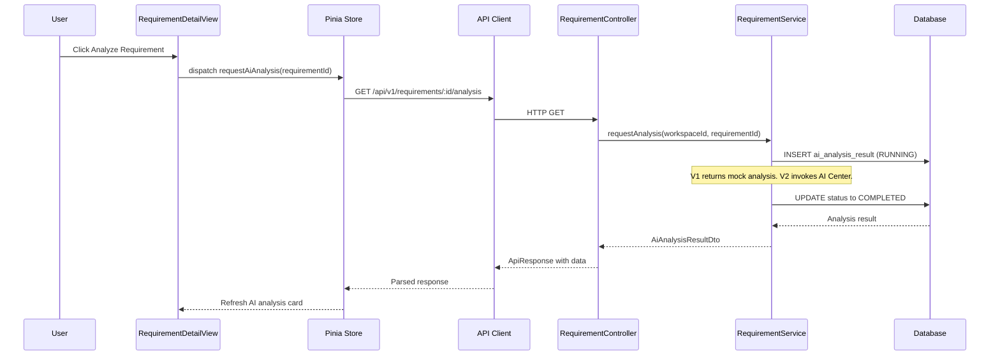

### State Transitions
- `DRAFT -> IN_REVIEW` -- triggered when assignee submits for review
- `IN_REVIEW -> APPROVED` -- triggered by reviewer approval (governance entry created)
- `IN_REVIEW -> DRAFT` -- triggered by reviewer requesting revision (governance entry created)
- `APPROVED -> IN_PROGRESS` -- triggered when first story or spec work begins
- `IN_PROGRESS -> DELIVERED` -- triggered when all acceptance criteria pass and chain is complete
- `DELIVERED -> ARCHIVED` -- triggered when requirement lifecycle is complete
- `Any active -> ARCHIVED` -- triggered by authorized archival (governance entry created)

### Failure and Retry Handling
- V1 does not implement automated retry for failed AI analysis
- Failed AI skills are recorded with `FAILED` status in the analysis card
- Frontend retry: manual refresh via user action or page reload
- Per-card error isolation: one card failure does not break other cards on the detail view

---

## API / Interface Boundaries

### Major Inbound Interfaces
| Interface | Consumer | Purpose |
|---|---|---|
| `GET /api/v1/requirements` | Frontend requirement list | List requirements with optional filters (priority, status, category, assignee, search, page, size) |
| `GET /api/v1/requirements/:id` | Frontend requirement detail | Full requirement detail with all 6 sections wrapped in SectionResult |
| `POST /api/v1/requirements` | Frontend create form | Create a new requirement |
| `PUT /api/v1/requirements/:id` | Frontend edit form | Update requirement fields (creates change entry) |
| `PATCH /api/v1/requirements/:id/status` | Frontend status transition | Transition requirement status (validates state machine, creates governance entry) |
| `POST /api/v1/requirements/:id/generate-stories` | Frontend story derivation | Derive a User Story from a requirement |
| `POST /api/v1/requirements/:id/generate-spec` | Frontend spec generation | Generate a Spec from a requirement or story |
| `GET /api/v1/requirements/:id/chain` | Frontend chain card | Get forward and reverse chain links for a requirement |
| `GET /api/v1/requirements/:id/analysis` | Frontend AI analysis | AI analysis (quality, impact, gap detection) |

### Internal Module Boundaries
- Requirement domain consumes workspace context from the shared platform module
- Requirement domain does not call other domain modules directly -- chain links are stored as references (IDs + types), not live joins
- Story derivation and spec generation are internal sub-services within the requirement domain boundary in V1; they may migrate to separate domain modules if the product grows

---

## Deployment / Environment Considerations

- **Supported Environments**: Local dev (H2 + Vite dev server), production (Oracle + deployed frontend)
- **Configuration Separation**: Flyway migrations handle schema; `application.yml` profiles handle env-specific config
- **Secrets Handling**: No requirement-specific secrets in V1; workspace context inherited from shell
- **Operational Concerns**: Change entries and governance entries must be append-only and durable

---

## Security / Reliability / Observability

### Access Control
- All requirement data workspace-scoped (enforced at service layer)
- Status transitions crossing governance boundaries (Draft -> Approved) require authenticated user identity
- V1 does not implement per-field role-based access control; all workspace members can view all requirements
- Bulk operations require authorized user identity

### Auditability
- All field-level changes recorded with actor, timestamp, old/new values, and reason
- All governance actions (approve, reject, cancel, re-open) recorded with actor, timestamp, reason, and policy reference
- AI skill execution records provide a complete audit trail of AI activity
- Change entries and governance entries are append-only -- no updates or deletes

### Resilience
- Per-card error isolation via `SectionResult<T>` -- one card failure does not break the page
- List/detail/skill endpoints use synchronous request/response; KB-backed file intake uses async receipt + polling
- List view supports pagination to handle large requirement sets without memory pressure

### Monitoring / Logging
- Standard Spring Boot logging for API requests
- Frontend console logging for development diagnostics

---

## Risks / Tradeoffs

| # | Risk / Tradeoff | Notes |
|---|---|---|
| 1 | Story and Spec entities managed within requirement domain boundary may cause coupling | V1 keeps them co-located for simplicity. If Story Management or Spec Management become full modules, these entities migrate out. Service boundaries are designed for this split. |
| 2 | Chain links stored as references may become stale if upstream/downstream artifacts are deleted | V1 accepts this risk. Future versions may add link validation or soft-delete cascading. |
| 3 | AI analysis is synchronous in V1, which may cause slow responses for complex analysis | V1 returns mock/simple results. V2 may use async processing with polling or WebSocket updates. |
| 4 | Kanban drag-and-drop bypasses approval workflow for non-governed transitions | State machine enforces governance boundaries regardless of UI interaction method. Governed transitions show confirmation dialog even when initiated via drag-and-drop. |
| 5 | Priority matrix axes (impact vs. effort) are not user-configurable in V1 | Fixed 2x2 grid with predefined axes. V2 may add configurable axis selection. |
| 6 | Configuration-driven behavior uses static config in V1 | Status values, categories, and priority levels are defined in code constants. Admin UI configuration deferred to V2. |
| 7 | Three view modes (list, kanban, matrix) share filter state but have different rendering | Pinia store maintains shared filter state; each view mode reads and applies filters independently. View mode toggle does not reset filters. |
| 8 | Profile proliferation: custom profiles per project could fragment the organization's SDD practices | Mitigation: Platform Center provides curated profile templates with inheritance; custom profiles require admin approval. |
| 9 | Skill compatibility: IBM i skills run in a different execution environment (Claude Code with build-agent-skill). The Requirement Management page triggers skills but does not execute them directly. | Mitigation: Skill execution is delegated to the AI Center / Skill Engine. |
| 10 | Knowledge-base indexing quality varies by provider and format; unsupported ZIP entries still require manual review | Mitigation: import inspection exposes per-file status, previews, and manual-review flags before confirmation. |
| 11 | Large file handling is capped at 100 MB per request and further constrained by the downstream KB provider / gateway configuration | Mitigation: frontend validates the 100 MB request limit early; provider-specific limits must be aligned in deployment config. |

---

## Open Questions

1. Should User Story and Spec entities live in the requirement domain or have their own domain packages from the start?
2. What are the concrete governance boundaries for status transitions -- which transitions require approval and from which roles?
3. Should the priority matrix axes be configurable per workspace, or are impact/effort fixed for V1?
4. How should bulk operations interact with the state machine -- are all selected requirements transitioned individually, or is there a batch approval flow?
5. Will V2 require real-time updates for collaborative requirement editing (multiple users editing simultaneously)?
6. Should AI analysis results be persisted permanently or treated as ephemeral (regenerated on demand)?
7. What is the maximum requirement description size, and should rich text be stored as HTML or Markdown?
