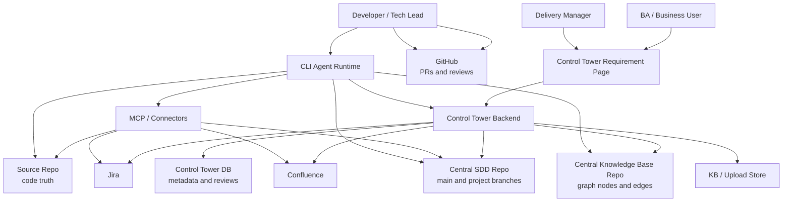
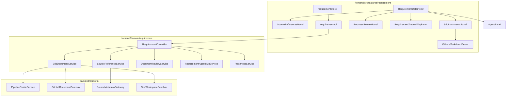
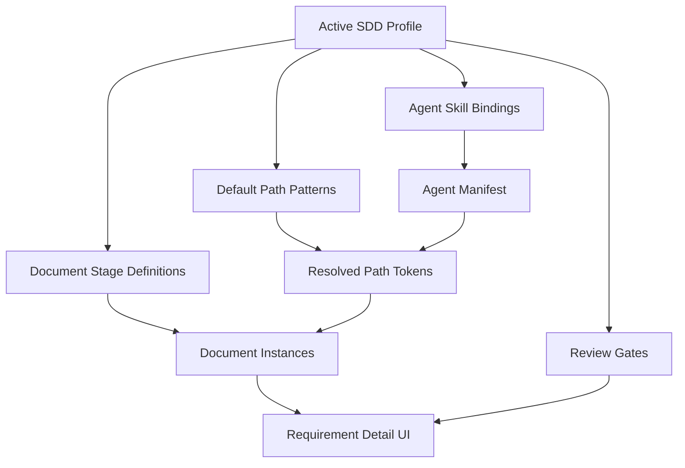
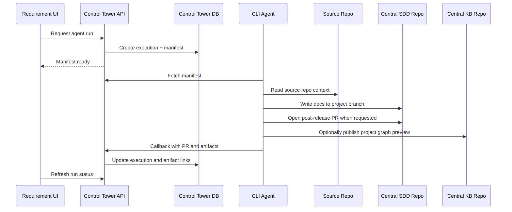

# Requirement Control Plane Architecture

## Overview

Requirement Control Plane extends the Requirement Management slice with a
platform-oriented architecture:

- External BAU systems provide business source references
- Central SDD repositories provide SDD document content and version history
- Project branches provide in-flight SDD review workspaces
- Central Knowledge Base repositories publish generated knowledge graph outputs
- Control Tower indexes metadata, renders documents, records reviews, creates
  agent manifests, and reports freshness
- CLI agents perform repo-aware and long-running work

## System Context



## Component Architecture



## Backend Package Boundaries

Requirement-specific services own requirement-linked source references,
document indexes, reviews, manifests, and freshness projections. Provider-specific
logic should live behind platform gateways or agent runtime connectors.

Suggested packages:

```text
com.sdlctower.domain.requirement.source
com.sdlctower.domain.requirement.document
com.sdlctower.domain.requirement.review
com.sdlctower.domain.requirement.agent
com.sdlctower.domain.requirement.freshness
com.sdlctower.platform.github
com.sdlctower.platform.source
```

## Data Ownership

| Data | Owner | Notes |
|---|---|---|
| Jira / Confluence body | Source system | Referenced and optionally summarized, not copied as source of truth |
| Source code | Source repository | Read by CLI agents, not copied into Control Tower |
| SDD Markdown body | Central SDD repo project branch or main | Fetched on open |
| Released SDD baseline | Central SDD repo `main` | Post-release PR merge target |
| In-flight SDD workspace | Central SDD repo project branch | Business review and CLI output during project |
| Knowledge graph nodes and edges | Central Knowledge Base repo | Generated from released SDD main or project preview branch |
| Source reference metadata | Control Tower DB | URL, external ID, source updated time, fetched time |
| SDD workspace metadata | Control Tower DB | application, SNOW Group, source repo, SDD repo, branches, KB repo |
| Document index metadata | Control Tower DB | repo/path/ref/SHA/status/profile/workspace/document instance key |
| Business comments and approvals | Control Tower DB | version-bound |
| Engineering review | GitHub | PR review and diff |
| Agent execution manifest | Control Tower DB | Context handoff |
| Agent outputs | GitHub plus Control Tower artifact links | PRs, docs, reports |

## Profile-Driven Rendering



Profiles define stage templates; runtime context resolves them into document
instances. The same stage can produce multiple instances, such as IBM i Program
Specs for several programs. Missing document rows should use resolved expected
paths whenever token values are known.

## Agent Boundary

Control Tower creates the manifest and records status. Agents execute outside
the web app.



## Branch and Knowledge Strategy

Central SDD repositories use `main` as the released baseline. Each in-flight
project creates a working branch from `main`, for example
`project/PAY-2026-sso-upgrade`. Business users review that project branch in
Control Tower. After release, engineering opens a GitHub PR from the project
branch back to `main`; once merged, `main` becomes the new SDD baseline.

Document identity is branch-aware: `central SDD repo + project branch + path +
commit/blob`. File names are generated for readability and traceability, but do
not define the project boundary.

Central Knowledge Base repositories are generated from SDD content. The released
knowledge graph is generated from central SDD `main`. Project preview graphs may
be generated from the SDD project branch into a matching Knowledge Base preview
branch. The Knowledge Base repo is not a second manual document source.

## Freshness Strategy

Freshness is computed as a projection, not as a replacement for external
systems. The first implementation can compare timestamps and Git blob versions:

- `sourceUpdatedAt > documentCommitTime` means Source Changed
- `documentBlobSha != reviewedBlobSha` means Document Changed After Review
- Missing indexed document for expected profile stage means Missing Document
- Missing source for requirement means Missing Source

## Integration Risks

| Risk | Mitigation |
|---|---|
| Provider metadata differs across Jira/Confluence | Store generic metadata plus provider payload summary |
| GitHub fetch latency | Lazy fetch document content; keep metadata list fast |
| Business comments drift after doc change | Bind comments to commit/blob |
| IBM i stages do not match Java SDD | Use profile-defined stages |
| Agent executes against wrong context | Manifest pinning and stale-context callback |
