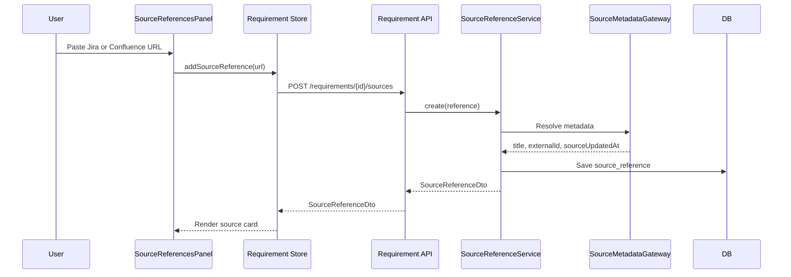
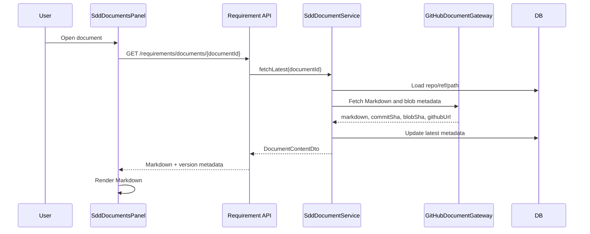
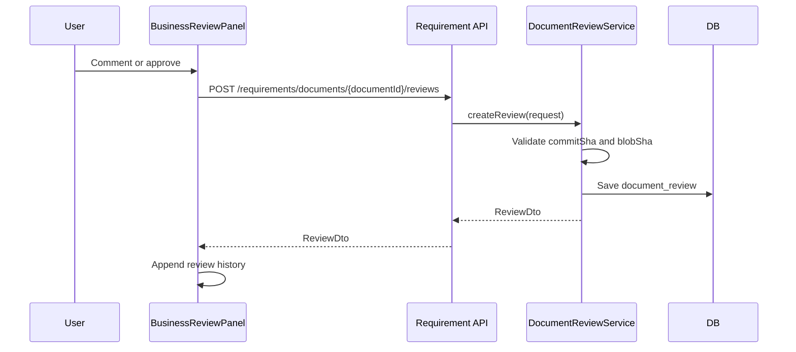
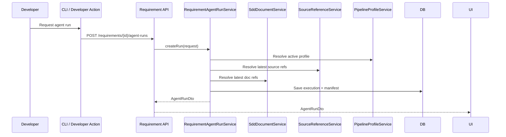
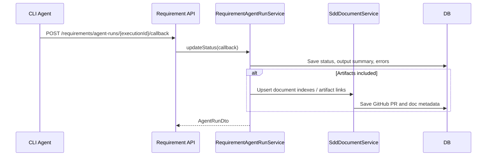
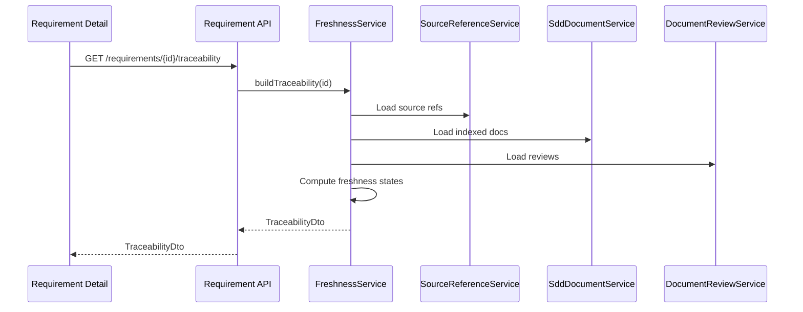
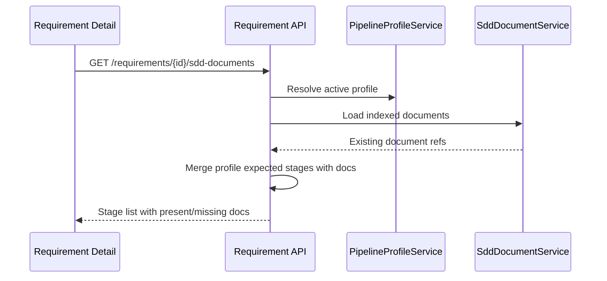

# Requirement Control Plane Data Flow

## Purpose

This document describes runtime data flows for Requirement Control Plane:
source intake, GitHub document rendering, business review, agent manifest
creation, agent callback, and freshness refresh.

## 1. Source Reference Intake

Error behavior:

- If metadata cannot be fetched, store the URL with `status=ERROR`.
- UI shows retry action.
- Requirement detail continues rendering.

## 2. Open Latest GitHub SDD Document

Rules:

- Markdown body is fetched from GitHub.
- Control Tower may update index metadata after fetch.
- The fetched content is not canonical storage in Control Tower.

## 3. Business Review

Rules:

- Review requests must include commit SHA and blob SHA.
- Approval becomes stale if the document blob changes later.

## 4. Agent Run Request

The manifest pins resolved versions at creation time.

## 5. CLI Agent Callback

Supported callback statuses:

- RUNNING
- COMPLETED
- FAILED
- STALE_CONTEXT
- CANCELED

## 6. Freshness Refresh

Freshness states:

- FRESH
- SOURCE_CHANGED
- DOCUMENT_CHANGED_AFTER_REVIEW
- MISSING_DOCUMENT
- MISSING_SOURCE
- UNKNOWN
- ERROR

## 7. Profile-Driven Document Rendering

The UI renders missing expected documents rather than hiding gaps.
