# Requirement Management — Data Flow

## 1. Purpose and Traceability

This document describes how data moves through the Requirement Management module
at runtime. It covers the major data flows: list/kanban view load, detail view
load with per-section error isolation, AI-assisted operations (story generation,
spec generation, analysis), navigation, state transitions, and the API client
chain from browser to database.

### Traceability

| Artifact | Path |
|---|---|
| Architecture | `04-architecture/requirement-architecture.md` |
| Data Model | `04-architecture/requirement-data-model.md` |
| Design | `05-design/requirement-design.md` |
| Spec | `03-spec/requirement-spec.md` |
| API Guide | `05-design/contracts/requirement-API_IMPLEMENTATION_GUIDE.md` |
| Tasks | `06-tasks/requirement-tasks.md` |

---

## 2. Runtime Data Flows

### 2.1 List View Load (Phase A: mock, Phase B: API)

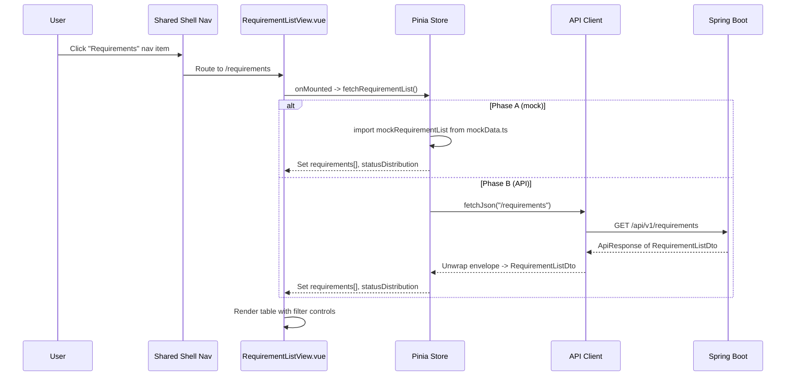

#### Filter Flow

```
User selects filter --> Store updates filterState --> Re-fetch with query params
                                                     GET /api/v1/requirements?status=APPROVED&priority=HIGH&category=FUNCTIONAL&search=auth
```

Filters are applied as query parameters in Phase B. In Phase A, filters are
applied client-side against the mock data array.

#### Response Shape

```
ApiResponse<RequirementListDto>
+-- data
|   +-- statusDistribution: { draft: 5, inReview: 3, approved: 8, inProgress: 4, delivered: 2, archived: 1 }
|   +-- requirements[]
|       +-- id: "REQ-0101"
|       +-- title: "User Authentication via SSO"
|       +-- priority: "HIGH"
|       +-- status: "APPROVED"
|       +-- category: "FUNCTIONAL"
|       +-- source: "PRD-Security"
|       +-- storyCount: 3
|       +-- specCount: 1
|       +-- createdAt: "2026-04-10T14:00:00Z"
|       +-- updatedAt: "2026-04-15T09:30:00Z"
+-- error: null
```

---

### 2.2 Kanban View Load (reuses same data as list)

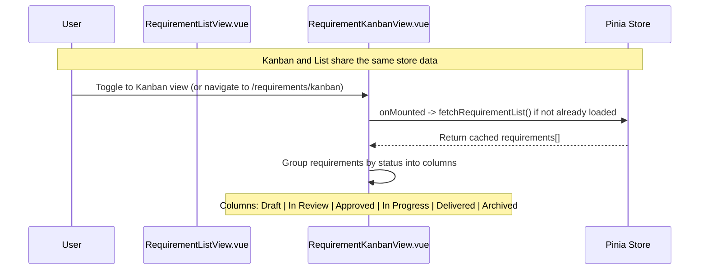

The Kanban view does not make a separate API call. It reads the same
`requirements[]` array from the Pinia store and groups cards by `status`.
If the store already has data (e.g., user toggled from list view), no
re-fetch occurs.

---

### 2.3 Detail View Load (parallel section fetches via single aggregate endpoint)

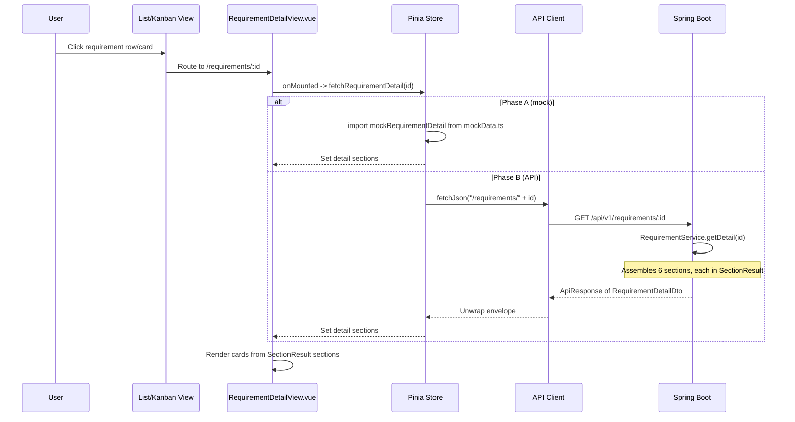

#### Detail Response Shape

```
ApiResponse<RequirementDetailDto>
+-- data
|   +-- header: SectionResult<RequirementHeaderDto>
|   |   +-- data: { id, title, priority, status, category, source,
|   |               assignee, completenessScore, storyCount, specCount,
|   |               createdAt, updatedAt }
|   +-- description: SectionResult<RequirementDescriptionDto>
|   |   +-- data: { summary, businessJustification,
|   |               acceptanceCriteria[]: { id, text, isMet },
|   |               assumptions[], constraints[] }
|   +-- linkedStories: SectionResult<LinkedStoriesSectionDto>
|   |   +-- data: { stories[]: { id, title, status, specId, specStatus },
|   |               totalCount }
|   +-- linkedSpecs: SectionResult<LinkedSpecsSectionDto>
|   |   +-- data: { specs[]: { id, title, status, version }, totalCount }
|   +-- sdlcChain: SectionResult<SdlcChainDto>
|   |   +-- data: { links[]: { artifactType, artifactId,
|   |                           artifactTitle, routePath } }
|   +-- aiAnalysis: SectionResult<AiAnalysisDto>
|   |   +-- data: { completenessScore, missingElements[],
|   |               similarRequirements[]: { id, similarity },
|   |               impactAssessment, suggestions[] } | null
+-- error: null
```

---

### 2.4 AI Story Generation Flow

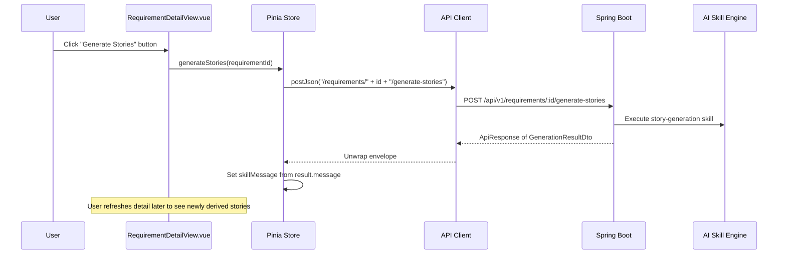

#### Request / Response

```
POST /api/v1/requirements/:id/generate-stories
Request body: (none — requirement context is read from DB)

Response:
ApiResponse<GenerationResultDto>
+-- data
|   +-- executionId: "exec-..."
|   +-- skillName: "req-to-user-story"
|   +-- status: "QUEUED" | "RUNNING"
|   +-- requirementId: "REQ-..."
|   +-- startedAt: "2026-04-17T..."
|   +-- estimatedCompletionSeconds: 15
|   +-- message: "Story generation queued"
+-- error: null
```

---

### 2.5 AI Spec Generation Flow


#### Request / Response

```
POST /api/v1/requirements/:id/generate-spec
Request body: (none — requirement + stories context read from DB)

Response:
ApiResponse<GenerationResultDto>
+-- data
|   +-- executionId: "exec-..."
|   +-- skillName: "user-story-to-spec"
|   +-- status: "QUEUED" | "RUNNING"
|   +-- requirementId: "REQ-..."
|   +-- inputStoryIds[]: ["US-001"]
|   +-- startedAt: "2026-04-17T..."
|   +-- estimatedCompletionSeconds: 20
|   +-- message: "Spec generation queued"
+-- error: null
```

---

### 2.6 AI Analysis Request Flow

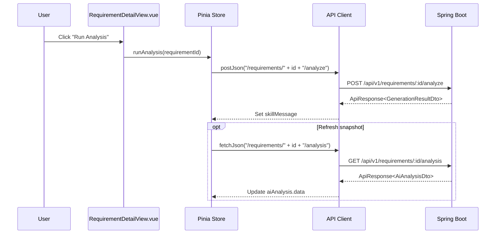

#### Response Shapes

```
POST /api/v1/requirements/:id/analyze
ApiResponse<GenerationResultDto>
+-- data
|   +-- executionId: "exec-..."
|   +-- skillName: "requirement-analysis"
|   +-- status: "QUEUED" | "RUNNING"
|   +-- message: "Analysis queued"
+-- error: null

GET /api/v1/requirements/:id/analysis
ApiResponse<AiAnalysisDto>
+-- data
|   +-- completenessScore: 85
|   +-- missingElements[]: ["Stakeholder not identified"]
|   +-- similarRequirements[]: { id: "REQ-0045", similarity: 72 }
|   +-- impactAssessment: "High impact ..."
|   +-- suggestions[]: ["Clarify timeout requirements"]
+-- error: null
```

---

### 2.7 Navigation Flow

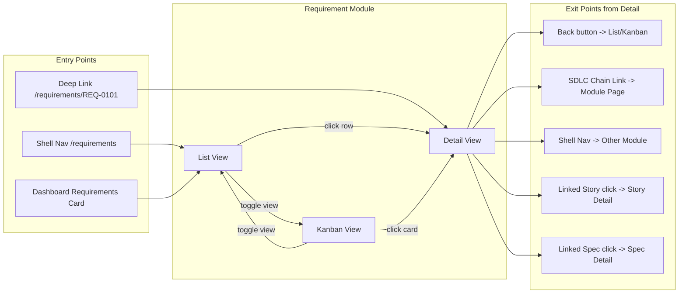

#### SDLC Chain Link Navigation

```
SdlcChainLink { artifactType: "story", artifactId: "US-0201", routePath: "/stories/US-0201" }
    -> router.push(routePath)
    -> If module is implemented: renders module page
    -> If module is not implemented: renders PlaceholderView with "Coming Soon"
```

#### View Toggle Behavior

The list and kanban views share a single route with a view-mode toggle, or use
sibling routes (`/requirements` and `/requirements/kanban`). Either way, the
store data is preserved when toggling — no re-fetch is triggered.

---

### 2.8 Pipeline Profile Resolution Flow

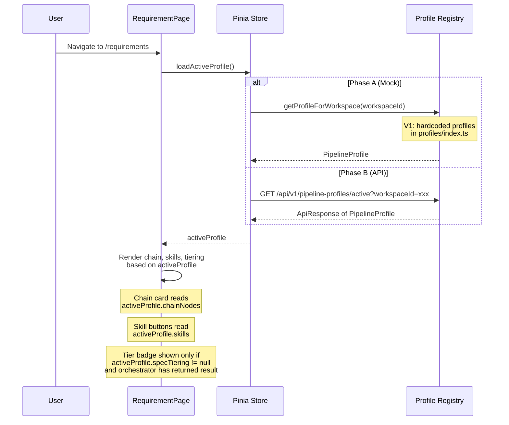

---

### 2.9 Profile-Specific Skill Invocation Flow

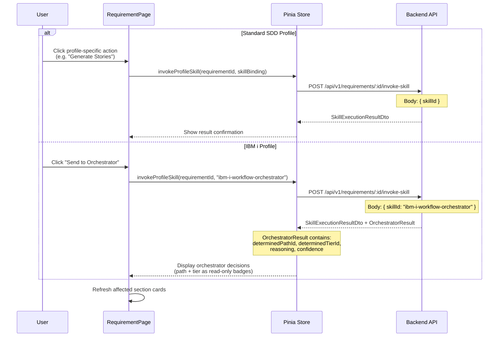

---

### 2.10 Single Requirement Import Flow

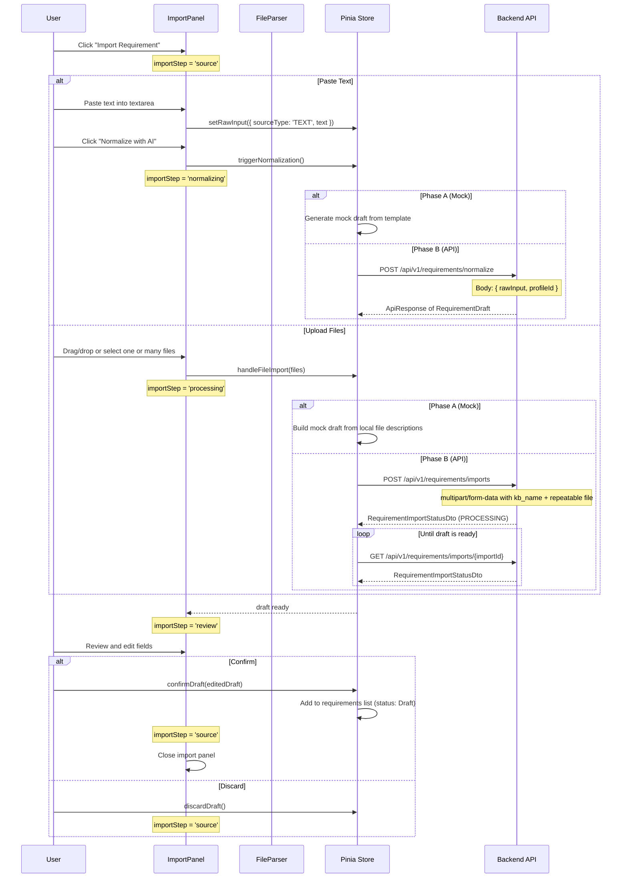

---

### 2.11 Multi-File / Archive Import Flow

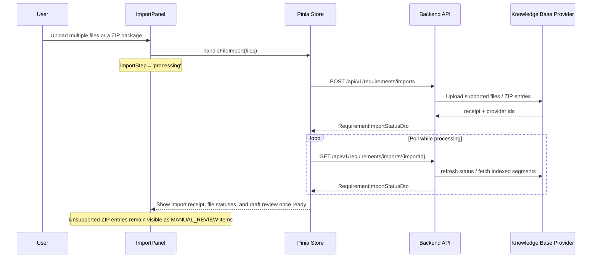

`BatchPreviewTable` / `BatchProgressBar` remain in the frontend codebase for a future row-based spreadsheet import mode, but they are not on the active backend-integrated path today.

---

## 3. Error Isolation Strategy

### Detail View: Per-Card SectionResult

Each detail card reads its own `SectionResult<T>`:

```
RequirementDetailDto.header.data          -> Header Card
RequirementDetailDto.header.error         -> Header Card shows inline error

RequirementDetailDto.acceptanceCriteria.data  -> Acceptance Criteria Card
RequirementDetailDto.acceptanceCriteria.error -> Card shows inline error

RequirementDetailDto.linkedStories.data   -> Linked Stories Card
RequirementDetailDto.linkedStories.error  -> Card shows inline error

RequirementDetailDto.linkedSpecs.data     -> Linked Specs Card
RequirementDetailDto.linkedSpecs.error    -> Card shows inline error

RequirementDetailDto.sdlcChain.data       -> SDLC Chain Card
RequirementDetailDto.sdlcChain.error      -> Card shows inline error

RequirementDetailDto.aiAnalysis.data      -> AI Analysis Card
RequirementDetailDto.aiAnalysis.error     -> Card shows inline error
```

If one section fails on the backend (e.g., AI analysis service is down), only
that card shows an error state. The rest of the detail view remains functional.

### List/Kanban View: Top-Level Error

The list and kanban views use a single top-level error state:

```
Store state:
  requirements: RequirementListItem[]   -> Populated on success
  error: string | null                  -> Set on failure, shows full-page error
  loading: boolean                      -> Shows skeleton/spinner while fetching
```

### AI Operation Errors

AI-triggered operations (story generation, spec generation, analysis) handle
errors independently:

```
Try:   POST /api/v1/requirements/:id/generate-stories
Catch: ApiError
  -> Store sets linkedStories.error = "Story generation failed: {message}"
  -> Linked Stories card shows error with Retry button
  -> Other cards remain unaffected
```

### Retry Strategy

| Context | Retry Mechanism |
|---|---|
| List/Kanban load failure | User clicks "Retry" button in error banner |
| Detail section failure | Per-card "Retry" button re-fetches the full detail |
| AI operation failure | Per-card "Retry" button re-triggers the AI operation |
| Network timeout | Standard fetch timeout (30s); user retries manually |

---

## 4. State Machine

### Requirement Status Transitions

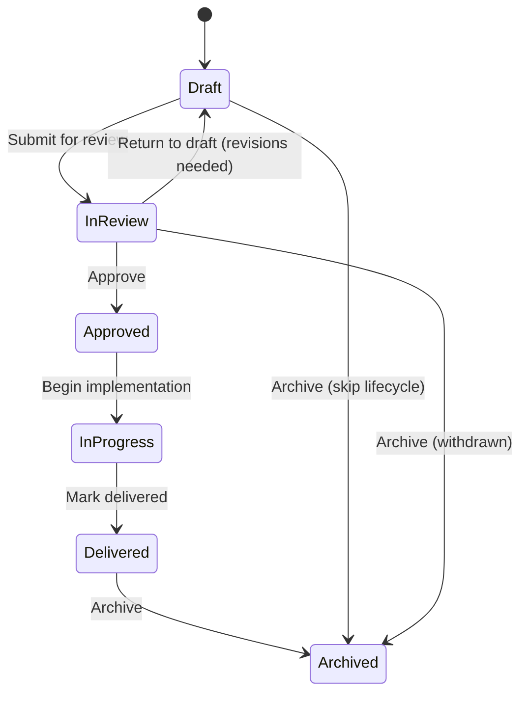

### Status Transition Table

```
Status Transition                   Cards Affected
----------------------------        ----------------------------
Draft -> In Review                  Header (status badge), List (row status)
In Review -> Draft                  Header (status badge), List (row status)
In Review -> Approved               Header (status badge), List (row status), Kanban (card moves column)
Approved -> In Progress             Header (status badge), AI Analysis (may re-run)
In Progress -> Delivered            Header (status badge), SDLC Chain (delivery link appears)
Delivered -> Archived               Header (status badge), List (row may hide based on filter)
Any -> Archived                     Header (status badge), List (row moves/hides)
```

### Allowed Transitions by Current Status

| Current Status | Allowed Next States |
|---|---|
| Draft | In Review, Archived |
| In Review | Draft, Approved, Archived |
| Approved | In Progress |
| In Progress | Delivered |
| Delivered | Archived |
| Archived | (terminal) |

---

## 5. Refresh Strategy

### V1: On-Load Fetch (No Polling)

| Trigger | Action |
|---|---|
| Navigate to list/kanban view | Fetch requirement list from API (or mock) |
| Navigate to detail view | Fetch requirement detail from API (or mock) |
| Return from AI operation | Refresh affected section in detail view |
| Toggle list/kanban view | No re-fetch; reuse cached store data |
| Browser refresh | Full re-fetch on mount |

### Post-AI-Operation Refresh

After an AI operation completes (story generation, spec generation, analysis),
the store updates only the affected section:

```
generateStories() completes:
  -> Store updates linkedStories section with new data
  -> linkedStories card re-renders
  -> Other cards remain unchanged

generateSpec() completes:
  -> Store updates linkedSpecs section with new data
  -> linkedSpecs card re-renders

fetchAnalysis() completes:
  -> Store updates aiAnalysis section with new data
  -> aiAnalysis card re-renders
```

### Future Considerations (V2+)

- WebSocket push for real-time status updates when AI operations complete
- Optimistic UI updates for status transitions
- Background polling for long-running AI skill executions
- Cache invalidation when navigating between list and detail

---

## 6. API Client Chain

### Full Request Path

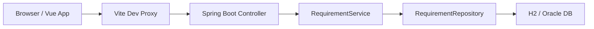

### Layer Responsibilities

| Layer | Responsibility |
|---|---|
| Browser / Vue App | User interaction, Pinia store dispatch, render cycle |
| Vite Dev Proxy | Forwards `/api/v1/**` to `localhost:8080` in dev mode |
| Spring Boot Controller | `RequirementController` — route handling, input validation, response envelope |
| RequirementService | Business logic, section assembly, SectionResult wrapping, AI skill orchestration |
| RequirementRepository | JPA queries, filter criteria building, entity-to-DTO mapping |
| H2 / Oracle DB | Persistent storage; H2 for local dev, Oracle for production |

### Vite Proxy Configuration

```
// vite.config.ts
server: {
  proxy: {
    '/api': {
      target: 'http://localhost:8080',
      changeOrigin: true
    }
  }
}
```

### Mock Toggle Pattern

The store determines the data source at runtime:

```typescript
const useMock = import.meta.env.DEV && !import.meta.env.VITE_USE_BACKEND;

async function fetchRequirementList(filters: RequirementFilters): Promise<void> {
  if (useMock) {
    // Phase A: load from mockData.ts
    state.requirements = applyFilters(mockRequirementList, filters);
    return;
  }
  // Phase B: call API
  const params = buildQueryString(filters);
  const data = await fetchJson<RequirementListDto>(`/requirements${params}`);
  state.requirements = data.requirements;
  state.statusDistribution = data.statusDistribution;
}
```

---

## 7. Frontend Type to Backend DTO Mapping

| Frontend Type (TypeScript) | Backend DTO (Java Record) | API Section |
|---|---|---|
| `RequirementListItem` | `RequirementListItemDto` | requirements[] |
| `StatusDistribution` | `StatusDistributionDto` | statusDistribution |
| `RequirementHeader` | `RequirementHeaderDto` | header |
| `AcceptanceCriterion` | `AcceptanceCriterionDto` | description.acceptanceCriteria[] |
| `LinkedStory` | `LinkedStoryDto` | linkedStories.stories[] |
| `LinkedSpec` | `LinkedSpecDto` | linkedSpecs.specs[] |
| `SdlcChainLink` | `SdlcChainLinkDto` | sdlcChain.links[] |
| `AiAnalysis` | `AiAnalysisDto` | aiAnalysis |
| `RequirementDraft` | `RequirementDraftDto` | normalize response / import polling draft |
| `ImportInspection` | `ImportInspectionDto` | requirementDraft.importInspection |
| `RequirementImportStatus` | `RequirementImportStatusDto` | POST/GET imports response |
| `GenerationResult` | `GenerationResultDto` | POST generate-stories / generate-spec / analyze response |
| `SectionResult<T>` | `SectionResultDto<T>` | all detail sections |

All field names use camelCase in both TypeScript and JSON serialization to
maintain a 1:1 mapping between frontend and backend.

---

## 8. Phase A vs Phase B Data Sources

| Phase | Data Source | Store Behavior |
|---|---|---|
| Phase A | `mockData.ts` in frontend | Store imports mock data directly; filters applied client-side; no API call |
| Phase B | `GET /api/v1/requirements[/:id]` | Store calls API via `fetchJson<T>`; filters passed as query params; mock data retained as fallback |

| Store Action | Phase A Source | Phase B Source |
|---|---|---|
| loadActiveProfile | profiles/index.ts (hardcoded) | GET /api/v1/pipeline-profiles/active |
| invokeProfileSkill | Stubbed (show confirmation) | POST /api/v1/requirements/:id/invoke-skill |
| triggerNormalization | Mock draft from template | POST /api/v1/requirements/normalize |
| handleFileImport | Mock local file summary -> mock draft | POST /api/v1/requirements/imports + GET /api/v1/requirements/imports/{importId} |
| confirmDraft | Add to local mock list | POST /api/v1/requirements (create) |

The store's `fetchRequirementList()`, `fetchRequirementDetail(id)`,
`generateStories(id)`, `generateSpec(id)`, and `fetchAnalysis(id)` functions
check the mock toggle (`import.meta.env.DEV && !import.meta.env.VITE_USE_BACKEND`)
to decide between mock and live data, following the same pattern established in
the Dashboard and Incident stores.
