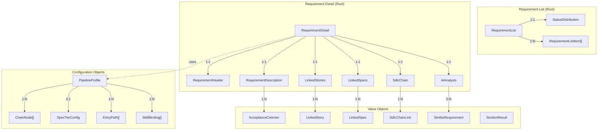
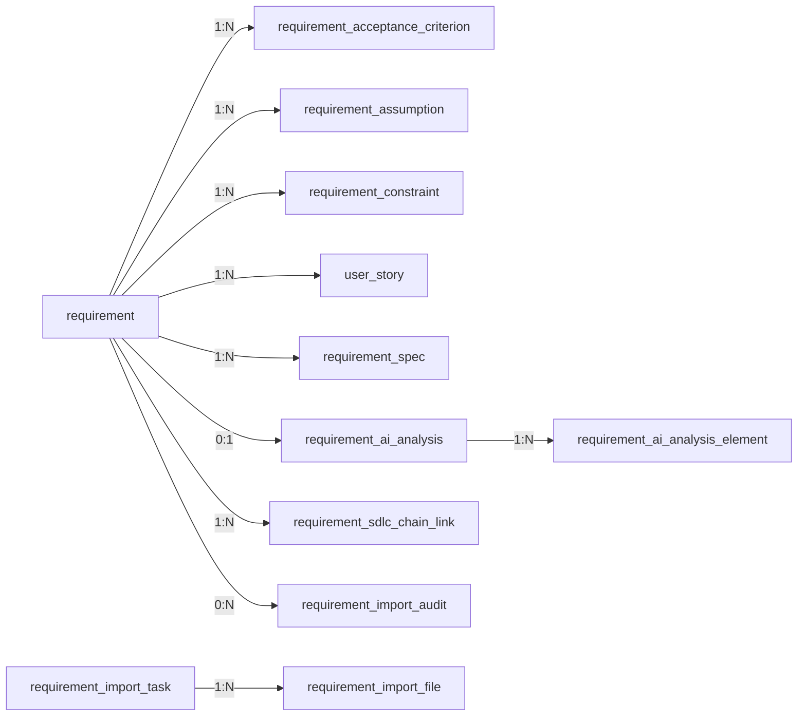

# Requirement Data Model

## Purpose

This document defines the domain and persistent data model for the Requirement Management
page -- covering frontend types, backend DTOs, and the database schema. The Requirement
Management page is the entry point of the Spec Driven Development (SDD) chain and manages
three core domain objects: **Requirement**, **User Story**, and **Spec**, plus supporting
objects for AI analysis and SDLC chain traceability.

## Traceability

- Requirements: [requirement-requirements.md](../01-requirements/requirement-requirements.md)
- Architecture: [requirement-architecture.md](requirement-architecture.md)
- Design: [requirement-design.md](../05-design/requirement-design.md)
- Spec: [requirement-spec.md](../03-spec/requirement-spec.md)
- Types source: `frontend/src/features/requirement/types/requirement.ts`

---

## 1. Domain Model Overview

---

## 2. Frontend Type Model

All types are defined in `frontend/src/features/requirement/types/requirement.ts`.
All interfaces use `readonly` properties for immutability.

### 2.1 Envelope Types

| Type | Purpose | Fields |
|------|---------|--------|
| `SectionResult<T>` | Per-section error isolation (shared) | `data: T \| null`, `error: string \| null` |

> Re-exported from `@/shared/types/section`.

### 2.2 Enums / Union Types

The frontend now uses display-ready title case strings rather than legacy uppercase enums.

| Type | Values |
|------|--------|
| `RequirementPriority` | `'Critical' \| 'High' \| 'Medium' \| 'Low'` |
| `RequirementStatus` | `'Draft' \| 'In Review' \| 'Approved' \| 'In Progress' \| 'Delivered' \| 'Archived'` |
| `RequirementCategory` | `'Functional' \| 'Non-Functional' \| 'Technical' \| 'Business'` |
| `RequirementSource` | `'Manual' \| 'Imported' \| 'AI-Generated'` |
| `StoryStatus` | `'Draft' \| 'Ready' \| 'In Progress' \| 'Done'` |
| `SpecStatus` | `'Draft' \| 'Review' \| 'Approved' \| 'Implemented'` |
| `AnalysisConfidence` | `'High' \| 'Medium' \| 'Low'` |
| `SortField` | `'priority' \| 'status' \| 'recency' \| 'title'` |
| `ViewMode` | `'list' \| 'kanban' \| 'matrix'` |
| `ImportStep` | `'source' \| 'normalizing' \| 'processing' \| 'review' \| 'batch-preview' \| 'batch-normalizing' \| 'batch-review'` |
| `ImportSourceType` | `'paste' \| 'file' \| 'email' \| 'meeting'` |
| `ImportInspectionStatus` | `'PARSED' \| 'MANUAL_REVIEW' \| 'SKIPPED'` |

### 2.3 List Types

| Type | Purpose | Key Fields |
|------|---------|------------|
| `StatusDistribution` | Summary bar counts | `draft`, `inReview`, `approved`, `inProgress`, `delivered`, `archived` |
| `RequirementListItem` | Single row in list/kanban/matrix | `id`, `title`, `priority`, `status`, `category`, `storyCount`, `specCount`, `completeness`, `updatedAt`, optional `completenessScore`, `assignee`, `createdAt` |
| `RequirementFilters` | List and cross-view filter state | optional `priority`, `status`, `category`, `search`, `showCompleted` |
| `RequirementList` | List API payload | `statusDistribution`, `requirements`, optional `items`, optional `totalCount` |

Notes:
- The backend serializes both `items` and the compatibility alias `requirements`.
- `StatusDistributionDto` also emits uppercase compatibility keys (`DRAFT`, `IN_REVIEW`, etc.) in addition to the lower camel keys used by the current frontend.

### 2.4 Detail Types

| Type | Purpose | Key Fields |
|------|---------|------------|
| `RequirementHeader` | Top summary card | `id`, `title`, `priority`, `status`, `category`, `source`, `assignee`, `completenessScore`, `storyCount`, `specCount`, `createdAt`, `updatedAt` |
| `AcceptanceCriterion` | Single acceptance criterion | `id`, `text`, `isMet` |
| `RequirementDescription` | Main narrative body | `summary`, `businessJustification`, `acceptanceCriteria`, `assumptions`, `constraints` |
| `LinkedStory` | Story reference in detail card | `id`, `title`, `status`, optional `specId`, optional `specStatus` |
| `LinkedSpec` | Spec reference in detail card | `id`, `title`, `status`, `version` |
| `LinkedStoriesSection` | Stories card payload | `stories`, `totalCount` |
| `LinkedSpecsSection` | Specs card payload | `specs`, `totalCount` |
| `AiAnalysis` | AI analysis card payload | `completenessScore`, `missingElements`, `similarRequirements`, `impactAssessment`, `suggestions` |
| `RequirementDetail` | Full detail aggregate | `header`, `description`, `linkedStories`, `linkedSpecs`, `aiAnalysis`, `sdlcChain` |

`SdlcChain` and `SectionResult<T>` are shared types re-exported into the requirement module.

### 2.5 Pipeline Profile and Skill Types

| Type | Purpose | Key Fields |
|------|---------|------------|
| `ChainNode` | Node shown in profile-adapted chain | `id`, `label`, `artifactType`, `isExecutionHub` |
| `EntryPath` | Human-readable path descriptor | `id`, `label`, `description` |
| `SkillBinding` | Skill action button binding | `skillId`, `label`, `triggerPoint` |
| `SpecTiering` | Optional tier list for profile | `tiers`, `defaultTier` |
| `PipelineProfile` | Active profile metadata | `id`, `name`, `description`, `chainNodes`, `skills`, `entryPaths`, `specTiering`, `usesOrchestrator`, `traceabilityMode` |
| `OrchestratorResult` | IBM i routing decision | `determinedPathId`, `determinedTier`, `confidence`, `reasoning` |
| `SkillExecutionResult` | Async skill trigger response | `executionId`, `skillName`, `status`, `requirementId`, `startedAt`, `estimatedCompletionSeconds`, `message`, optional `orchestratorResult` |

### 2.6 Intake and Import Types

| Type | Purpose | Key Fields |
|------|---------|------------|
| `RequirementSourceInput` | Source attachment metadata persisted with a created requirement | `sourceType`, `text`, `fileName`, `fileSize`, optional `fileNames`, optional `fileCount`, optional `kbName` |
| `ImportInspectionFile` | Per-file inspection result inside a normalized draft | `fileName`, `fileType`, `processingStatus`, `summary`, optional `extractedCharacters`, optional `preview` |
| `ImportInspection` | Aggregate inspection report for a file bundle or ZIP | `sourceFileName`, `sourceKind`, `totalFiles`, `parsedFiles`, `manualReviewFiles`, `skippedFiles`, `files` |
| `RequirementDraft` | Reviewable normalization output | `title`, `priority`, `category`, `summary`, `businessJustification`, `acceptanceCriteria`, `assumptions`, `constraints`, `missingInfo`, `openQuestions`, `aiSuggestedFields`, optional `normalizedBy`, optional `normalizedAt`, optional `importInspection`, optional `sourceAttachment` |
| `RequirementImportFileStatus` | Per-file status returned by async KB import | `displayName`, `sourceFileName`, `sourceKind`, optional `fileExtension`, `fileSize`, `supported`, `providerStatus`, optional `errorMessage`, optional `preview`, optional `providerDocumentId` |
| `RequirementImportStatus` | Receipt / polling payload for KB-backed imports | `importId`, `taskId`, `status`, `message`, `knowledgeBaseName`, optional `datasetId`, `totalNumberOfFiles`, `numberOfSuccesses`, `numberOfFailures`, `totalSize`, `unsupportedFileTypes`, `supportedFileTypes`, `files`, optional `draft`, `createdAt`, `updatedAt` |
| `ImportState` | Pinia store state for the import modal | `isOpen`, `step`, `sourceType`, `rawInput`, `kbName`, `fileName`, `fileSize`, `fileNames`, `fileCount`, `error`, `draft`, async import tracking fields, and reserved batch preview state |

Current live file intake behavior:
- Text, email, and meeting summary inputs normalize synchronously via JSON `POST /api/v1/requirements/normalize`.
- File uploads use KB-backed async import via `POST /api/v1/requirements/imports` followed by polling `GET /api/v1/requirements/imports/{importId}`.
- Supported upload formats in the current UI are `.txt`, `.md`, `.pdf`, `.html`, `.htm`, `.xlsx`, `.xls`, `.docx`, `.csv`, and `.zip`.
- ZIP packages are expanded server-side. Unsupported or low-confidence inner files surface as `MANUAL_REVIEW` items in the returned inspection report.
- Standalone image upload is not enabled in the current UI, so image OCR is not part of the active data model.

---

## 3. State Models

### 3.1 Requirement Status State Machine

| From | To | Trigger |
|------|----|---------|
| `Draft` | `In Review` | Author submits for review |
| `In Review` | `Approved` | Reviewer approves |
| `In Review` | `Draft` | Reviewer requests revision |
| `Approved` | `In Progress` | Story/spec delivery begins |
| `In Progress` | `Delivered` | Delivery work completes |
| `Delivered` | `Archived` | Archived after completion / retention |
| `Draft` | `Archived` | Cancelled before review |
| `In Review` | `Archived` | Cancelled during review |

### 3.2 Story Status State Machine

| From | To | Trigger |
|------|----|---------|
| `Draft` | `Ready` | Story refined and ready for execution |
| `Ready` | `In Progress` | Work starts |
| `In Progress` | `Done` | Story completes |

### 3.3 Spec Status State Machine

| From | To | Trigger |
|------|----|---------|
| `Draft` | `Review` | Generated or submitted for review |
| `Review` | `Approved` | Reviewer approves |
| `Review` | `Draft` | Reviewer requests revision |
| `Approved` | `Implemented` | Spec is implemented in delivery flow |

---

## 4. Backend DTO Model

DTOs live in `backend/src/main/java/com/sdlctower/domain/requirement/dto` and are implemented as Java records. Persistence entities live under `com.sdlctower.domain.requirement.persistence`.

### 4.1 Read and Detail DTOs

| DTO | Key Fields / Notes |
|-----|--------------------|
| `RequirementListDto` | `statusDistribution`, `items`, `totalCount`; exposes `requirements` as a compatibility alias |
| `RequirementListItemDto` | `id`, `title`, `priority`, `status`, `category`, `storyCount`, `specCount`, `completeness`, optional `completenessScore`, optional `assignee`, optional `createdAt`, `updatedAt` |
| `StatusDistributionDto` | lower camel fields plus uppercase compatibility aliases via `@JsonProperty` |
| `RequirementDetailDto` | `header`, `description`, `linkedStories`, `linkedSpecs`, `aiAnalysis`, `sdlcChain` |
| `RequirementHeaderDto` | `id`, `title`, `priority`, `status`, `category`, `source`, `assignee`, `completenessScore`, `storyCount`, `specCount`, `createdAt`, `updatedAt` |
| `RequirementDescriptionDto` | `summary`, `businessJustification`, `acceptanceCriteria`, `assumptions`, `constraints` |
| `AcceptanceCriterionDto` | `id`, `text`, `isMet` |
| `LinkedStoryDto` | `id`, `title`, `status`, optional `specId`, optional `specStatus` |
| `LinkedStoriesSectionDto` | `stories`, `totalCount` |
| `LinkedSpecDto` | `id`, `title`, `status`, `version` |
| `LinkedSpecsSectionDto` | `specs`, `totalCount` |
| `AiAnalysisDto` | `completenessScore`, `missingElements`, `similarRequirements`, `impactAssessment`, `suggestions` |
| `SdlcChainDto` | `links: List<SdlcChainLinkDto>` |
| `SdlcChainLinkDto` | `artifactType`, `artifactId`, `artifactTitle`, `routePath` |

`SectionResultDto<T>` remains the shared per-card isolation envelope from `com.sdlctower.shared.dto`.

### 4.2 Action, Intake, and Import DTOs

| DTO | Purpose | Key Fields / Notes |
|-----|---------|--------------------|
| `RequirementNormalizeRequestDto` | JSON normalization request | `rawInput`, optional `profileId` |
| `RawRequirementInputDto` | Source attachment metadata | `sourceType`, `text`, `fileName`, `fileSize`, optional `fileNames`, optional `fileCount`, optional `kbName` |
| `RequirementDraftDto` | Reviewable normalization result | `title`, `priority`, `category`, `summary`, `businessJustification`, `acceptanceCriteria`, `assumptions`, `constraints`, `missingInfo`, `openQuestions`, `aiSuggestedFields`, optional `normalizedBy`, optional `normalizedAt`, optional `importInspection` |
| `ImportInspectionDto` | ZIP / bundle inspection result | `sourceFileName`, `sourceKind`, `totalFiles`, `parsedFiles`, `manualReviewFiles`, `skippedFiles`, `files` |
| `RequirementImportStatusDto` | Async KB import receipt and polling response | `importId`, `taskId`, `status`, `message`, `knowledgeBaseName`, optional `datasetId`, file counters, supported/unsupported file types, `files`, optional `draft`, timestamps |
| `RequirementImportFileStatusDto` | Per-file KB status | `displayName`, `sourceFileName`, `sourceKind`, optional `fileExtension`, `fileSize`, `supported`, `providerStatus`, optional `errorMessage`, optional `preview`, optional `providerDocumentId` |
| `CreateRequirementRequestDto` | Create confirmed draft | `title`, `priority`, `category`, `summary`, `businessJustification`, `acceptanceCriteria`, `assumptions`, `constraints`, optional `sourceAttachment` |
| `GenerationResultDto` | Story/spec/analyze async trigger | execution metadata |
| `SkillExecutionResultDto` | Profile-bound skill invocation response | execution metadata plus optional `OrchestratorResultDto` |

Compatibility notes:
- `RequirementDraftDto` also exposes `prioritySuggestion`, `categorySuggestion`, and `description` aliases for older clients.
- `normalize` currently exists in two variants: JSON input and multipart upload. The preferred file flow is the async `/requirements/imports` contract.

---

## 5. Database Schema (Flyway Migrations V5 and V6)

Phase B now persists requirement data and async import orchestration state through Flyway migrations:
- `V5__create_requirement_tables.sql`
- `V6__create_requirement_import_task_tables.sql`

### 5.1 Core Requirement Tables

| Table | Purpose | Key Columns |
|-------|---------|-------------|
| `requirement` | Primary requirement record | `id`, `title`, `summary`, `business_justification`, `priority`, `status`, `category`, `source`, `assignee`, `completeness_score`, `created_at`, `updated_at`, `workspace_id` |
| `requirement_acceptance_criterion` | Ordered AC rows | `requirement_id`, `criterion_key`, `criterion_text`, `is_met`, `display_order` |
| `requirement_assumption` | Ordered assumptions | `requirement_id`, `assumption_text`, `display_order` |
| `requirement_constraint` | Ordered constraints | `requirement_id`, `constraint_text`, `display_order` |
| `user_story` | Derived stories | `id`, `requirement_id`, `title`, `status`, optional `spec_id`, optional `spec_status`, `display_order` |
| `requirement_spec` | Specs linked to a requirement | `id`, `requirement_id`, `title`, `status`, `version`, `display_order` |
| `requirement_ai_analysis` | Aggregate AI analysis metadata | `requirement_id`, `completeness_score`, `impact_assessment`, `analyzed_at` |
| `requirement_ai_analysis_element` | Missing/similar/suggestion rows | `analysis_id`, `element_type`, `element_text`, optional `related_requirement_id`, optional `numeric_value`, `display_order` |
| `requirement_sdlc_chain_link` | Traceability links | `requirement_id`, `artifact_type`, `artifact_id`, `artifact_title`, `route_path`, `link_order` |
| `requirement_import_audit` | Audit trail for confirmed imports | optional `requirement_id`, `source_format`, `file_name`, `file_size`, `skill_id`, `username`, `created_at`, `outcome` |

### 5.2 Import Orchestration Tables

| Table | Purpose | Key Columns |
|-------|---------|-------------|
| `requirement_import_task` | Async KB import receipt, progress, and final draft payload | `id`, `kb_name`, optional `dataset_id`, `provider_name`, `profile_id`, `status`, `message`, file counters, `supported_file_types`, `unsupported_file_types`, optional `draft_payload_json`, timestamps |
| `requirement_import_file` | Per-file import status and KB reference | `import_id`, `display_name`, `source_file_name`, `source_kind`, optional `file_extension`, optional `content_type`, `file_size`, `supported`, optional `provider_document_id`, optional `provider_batch_id`, `provider_status`, optional `error_message`, optional `extracted_preview`, timestamps |

### 5.3 Entity Relationships

### 5.4 Storage Boundaries

- The requirement service database stores requirement records, import task state, previews, and source metadata.
- Raw uploaded binaries are not stored in the requirement tables. File bodies are expected to live in the configured KB/provider system, with this service retaining task ids, dataset ids, and provider document references.
- Current local development still uses H2, but the schema is shaped to stay compatible with the Phase B production target database profile.

---

## 6. Frontend-to-Backend Type Mapping

| Frontend Type | Backend Type | Notes |
|---|---|---|
| `RequirementList` | `RequirementListDto` | Backend emits both `items` and `requirements` |
| `StatusDistribution` | `StatusDistributionDto` | Lower camel keys plus uppercase aliases |
| `RequirementListItem` | `RequirementListItemDto` | `completeness` is primary; `completenessScore` remains optional compatibility field |
| `RequirementDetail` | `RequirementDetailDto` | Section envelopes are preserved end-to-end |
| `RequirementHeader` | `RequirementHeaderDto` | Header now includes `source`, coverage, story/spec counts |
| `RequirementDescription` | `RequirementDescriptionDto` | Acceptance criteria use `text` + `isMet` |
| `LinkedStoriesSection` | `LinkedStoriesSectionDto` | Stories are nested under `linkedStories.data` |
| `LinkedSpecsSection` | `LinkedSpecsSectionDto` | Specs are nested under `linkedSpecs.data` |
| `AiAnalysis` | `AiAnalysisDto` | Simplified, summary-oriented analysis payload |
| `SdlcChain` | `SdlcChainDto` | Shared chain structure |
| `PipelineProfile` | profile DTOs from platform/profile package | Consumed by both frontend store and requirement actions |
| `RequirementSourceInput` | `RawRequirementInputDto` | Stored with create request / draft source metadata |
| `RequirementDraft` | `RequirementDraftDto` | Compatibility aliases keep older field names working |
| `ImportInspection` | `ImportInspectionDto` | Embedded inside `RequirementDraftDto` for file imports |
| `RequirementImportStatus` | `RequirementImportStatusDto` | Used for async receipt + polling |
| `RequirementImportFileStatus` | `RequirementImportFileStatusDto` | Represents per-file KB processing state |

### 6.1 Key Mapping Notes

1. **Enums are serialized as display strings**: The current payloads use title case values (`High`, `In Review`, `AI-Generated`) rather than legacy uppercase enums.
2. **Compatibility aliases are deliberate**: `RequirementListDto`, `StatusDistributionDto`, and `RequirementDraftDto` emit old field shapes alongside the new canonical fields so the transitioned frontend and older mocks keep working.
3. **ReadonlyArray maps to List**: Frontend immutable arrays map directly to Java `List<?>` fields on records and to ordered child tables in persistence.
4. **Section-level isolation remains canonical**: Detail cards still rely on the shared `SectionResult<T>` / `SectionResultDto<T>` envelope so partial failures stay localized.
5. **Async file import is now first-class**: File uploads no longer map to a purely frontend batch preview model. They map to persisted `requirement_import_task` / `requirement_import_file` rows and only produce a `RequirementDraft` once KB processing completes.
