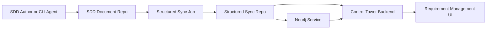
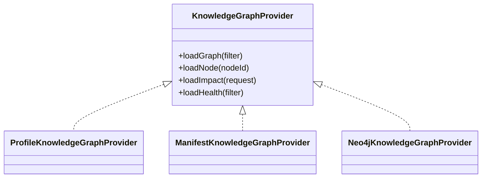
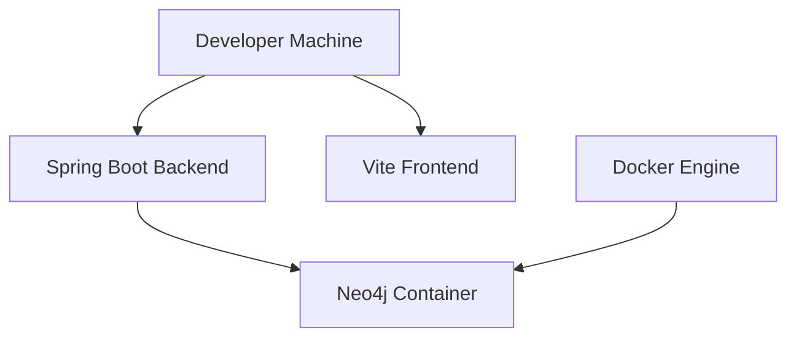
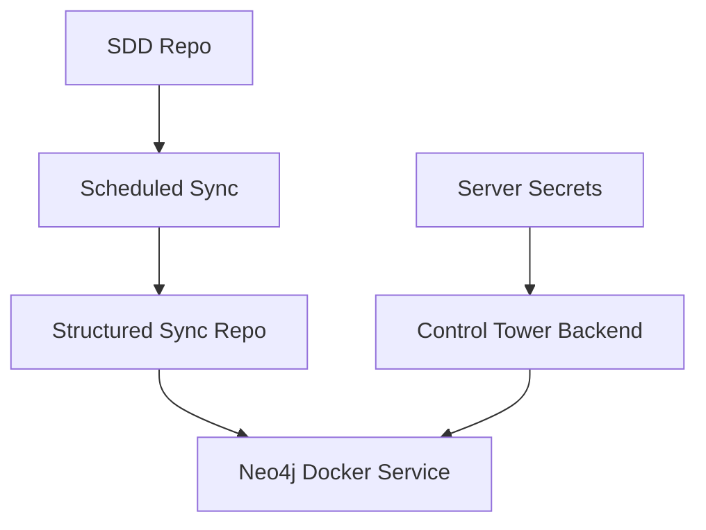

# SDD Knowledge Graph Architecture

## Purpose

This architecture describes how SDD Markdown documents become a validated
knowledge graph that can be queried by Control Tower. It introduces a
structured sync repository and optional Neo4j projection while preserving the
existing SDD document repository as the canonical document source.

## Traceability

- Requirements: [sdd-knowledge-graph-requirements.md](../01-requirements/sdd-knowledge-graph-requirements.md)
- Stories: [sdd-knowledge-graph-stories.md](../02-user-stories/sdd-knowledge-graph-stories.md)
- Spec: [sdd-knowledge-graph-spec.md](../03-spec/sdd-knowledge-graph-spec.md)

---

## 1. System Context

Key boundaries:

- SDD repo contains authored Markdown and front matter.
- Structured sync repo contains generated graph artifacts.
- Neo4j contains a rebuildable query projection.
- Backend owns graph access and security.
- UI is a consumer of backend graph DTOs.

---

## 2. Component Responsibilities

### SDD Document Repo

- Stores Markdown SDD documents.
- Owns human-readable content and review history.
- Carries graph front matter and structured sections.
- Uses Git branch model: `main` baseline and project preview branches.

### Structured Sync Job

- Reads SDD repo branch.
- Parses Markdown front matter.
- Extracts structured sections where needed.
- Validates document identity and dependencies.
- Emits graph artifacts.
- Optionally commits artifacts to structured sync repo.
- Optionally triggers Neo4j import.

### Structured Sync Repo

- Stores generated artifacts under `_graph/`.
- Enables code review of graph changes.
- Provides rebuild input for Neo4j.
- Stores sync manifests and validation issues.

### Neo4j Service

- Stores graph projection using stable IDs.
- Supports graph traversal, impact analysis, and ownership-filtered queries.
- Can be cleared and rebuilt from structured sync repo.
- Is deployed separately through Docker locally and on company servers.

### Control Tower Backend

- Provides graph API.
- Selects graph provider: profile, manifest, or Neo4j.
- Enforces API contracts and workspace filters.
- Keeps graph failures isolated from normal Requirement Management.

### Requirement Management UI

- Renders graph view.
- Shows graph metrics and node details.
- Does not connect to Neo4j directly.
- Shows unavailable/stale graph states.

---

## 3. Provider Architecture

Provider selection:

- `profile`: fallback from pipeline profile document stages and dependencies.
- `manifest`: reads structured repo graph artifacts.
- `neo4j`: queries Neo4j and maps results into stable DTOs.

The UI contract does not change when the provider changes.

---

## 4. Runtime Deployment

### Local Development

Local Neo4j:

- Browser: `http://localhost:7474`
- Bolt: `bolt://localhost:7687`
- Compose file: `docker-compose.neo4j.yml`

### Company Server

Shared environment guidance:

- Only backend needs Bolt access.
- Neo4j Browser should be admin-only.
- Credentials come from server environment or secret store.
- Volumes must be persistent.

---

## 5. Data Ownership

| Data | Owner | Persistence | Rebuildable |
|------|-------|-------------|-------------|
| Markdown content | SDD repo | Git | No, canonical |
| Graph artifacts | Structured repo | Git | Yes, from SDD repo |
| Graph projection | Neo4j | Docker volume | Yes, from structured repo |
| Requirement metadata | Control Tower DB | H2/Oracle | No, system state |
| Reviews and agent runs | Control Tower DB | H2/Oracle | No, system state |

---

## 6. Graph Scoping

Graph scope is defined by:

- workspace ID
- application ID
- SNOW Group
- project ID
- profile ID
- source repo and branch
- structured repo and branch
- baseline or preview mode

The same document can appear in baseline and preview branch projections. The
graph must carry branch metadata so users can distinguish released and in-flight
work.

---

## 7. Reliability Strategy

- Sync job writes issues into graph artifacts instead of relying only on logs.
- Neo4j import is idempotent.
- Backend falls back to manifest/profile graph when Neo4j is disabled.
- UI graph errors are section-scoped.
- Normal requirement list/detail behavior does not depend on Neo4j.

---

## 8. Security Strategy

- Neo4j credentials are environment-managed.
- Frontend never receives Neo4j credentials.
- Backend applies workspace/Application/SNOW Group authorization before graph
  query results are returned.
- Local Docker binds to `127.0.0.1`.
- Company deployment restricts Bolt and Browser access by network policy.

---

## 9. Architecture Decisions

### ADR-01: Structured repo before Neo4j

Decision: Generate structured graph artifacts before importing to Neo4j.

Reason: Graph accuracy must be reviewable and deterministic. Neo4j should not
parse Markdown or infer relationships directly.

### ADR-02: Neo4j as projection

Decision: Treat Neo4j as rebuildable query projection.

Reason: Git-backed SDD and structured artifacts remain auditable source layers.
Neo4j can be rebuilt if container data is lost.

### ADR-03: Backend-owned graph API

Decision: Frontend accesses graph only through backend API.

Reason: Centralizes security, provider switching, DTO normalization, and failure
isolation.

### ADR-04: Confirmed vs suggested relationship split

Decision: AI and heuristics can produce suggestions but not confirmed edges.

Reason: Decision support requires reliable graph evidence.
