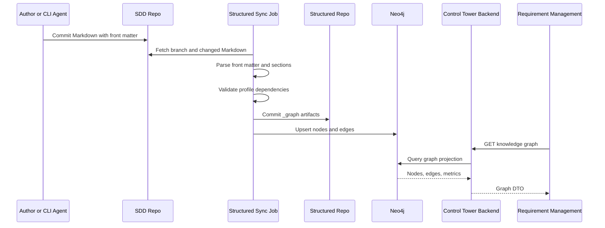
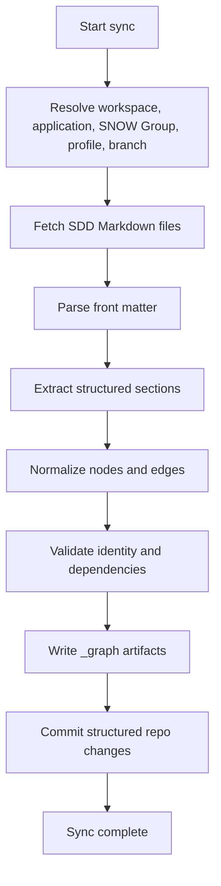
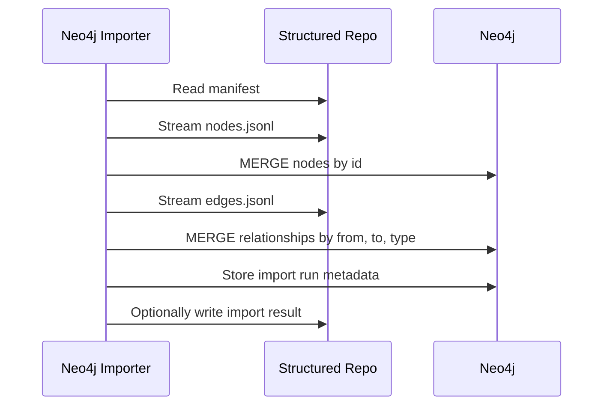
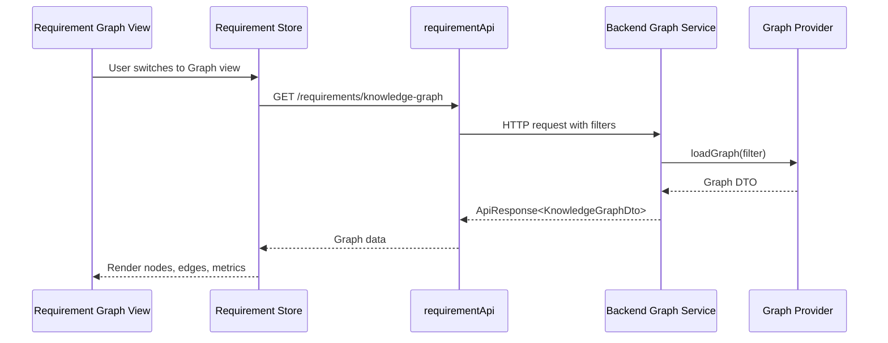
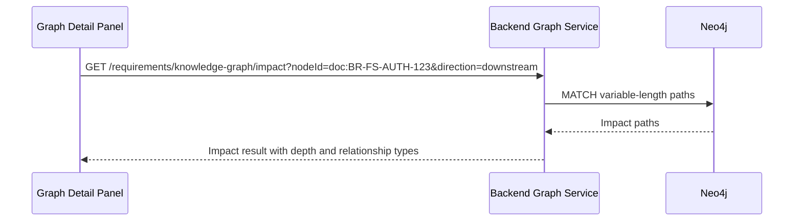
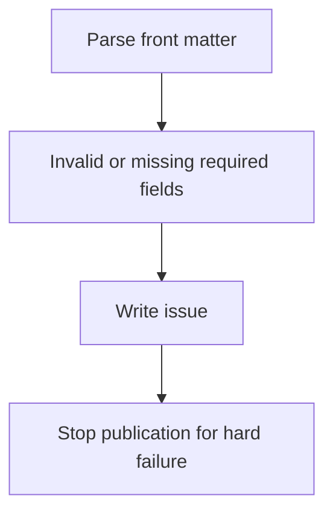
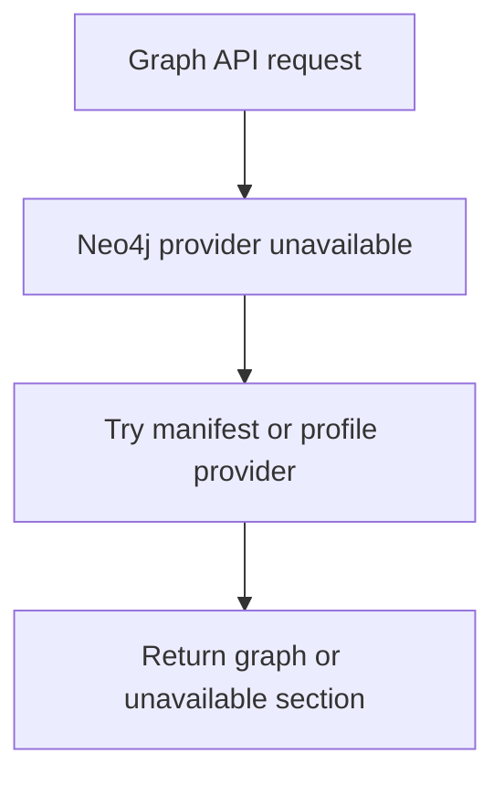

# SDD Knowledge Graph Data Flow

## Purpose

This document defines runtime flows for generating, validating, importing, and
querying the SDD Knowledge Graph.

## Traceability

- Requirements: [sdd-knowledge-graph-requirements.md](../01-requirements/sdd-knowledge-graph-requirements.md)
- Spec: [sdd-knowledge-graph-spec.md](../03-spec/sdd-knowledge-graph-spec.md)
- Architecture: [sdd-knowledge-graph-architecture.md](sdd-knowledge-graph-architecture.md)

---

## 1. End-to-End Flow

---

## 2. Structured Sync Flow

Validation output is always written to `_graph/issues.jsonl` when possible.
Hard failures prevent artifact publication if identity or format integrity is
compromised.

---

## 3. Neo4j Import Flow

Import must be idempotent:

- Node key: `id`
- Relationship identity: `from`, `to`, `type`, `scope`, `branch`
- Properties are updated on re-import.

---

## 4. Requirement Management Graph Query Flow

Provider behavior:

- `profile`: return profile document stages/dependencies.
- `manifest`: read graph artifacts.
- `neo4j`: query Neo4j.

---

## 5. Impact Query Flow

Impact query modes:

- `upstream`: what the selected node depends on.
- `downstream`: what can be affected by selected node changes.
- `bidirectional`: both directions for investigation.

---

## 6. Failure Flows

### Invalid front matter

### Neo4j unavailable

### Stale graph

Stale graph is not a hard failure. The response includes:

- last sync timestamp
- source commit
- structured repo commit
- stale flag
- issue count

The UI renders stale state in the graph toolbar.

---

## 7. Refresh Strategy

Trigger options:

- Scheduled sync job.
- Manual backend trigger.
- GitHub webhook for SDD repo changes.
- CLI command after SDD generation.

Initial recommended sequence:

1. Manual CLI sync against local SDD branch.
2. Manual import into local Docker Neo4j.
3. Backend reads local Neo4j.
4. Later add scheduled or webhook-based automation.

---

## 8. Data Retention

- Structured repo keeps graph artifacts by commit history.
- Neo4j keeps latest imported graph by scope and branch.
- Import run metadata keeps recent import status.
- Old branch graph data may be pruned when project branches close.

---

## 9. Observability

Every sync/import run should emit:

- run ID
- start and end timestamp
- source repo and branch
- source commit
- structured repo commit
- graph provider
- node count
- edge count
- issue count by severity
- import duration
- failure message when present
