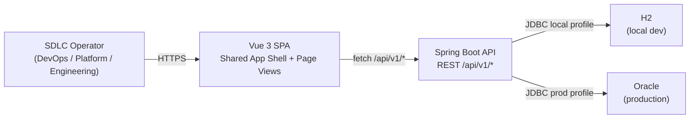
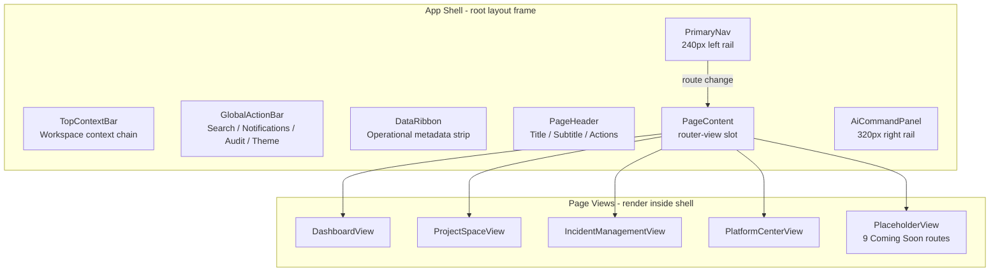
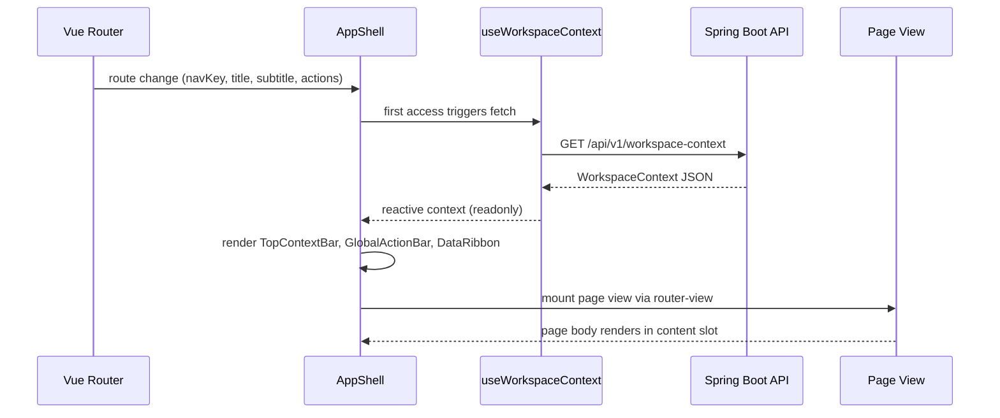
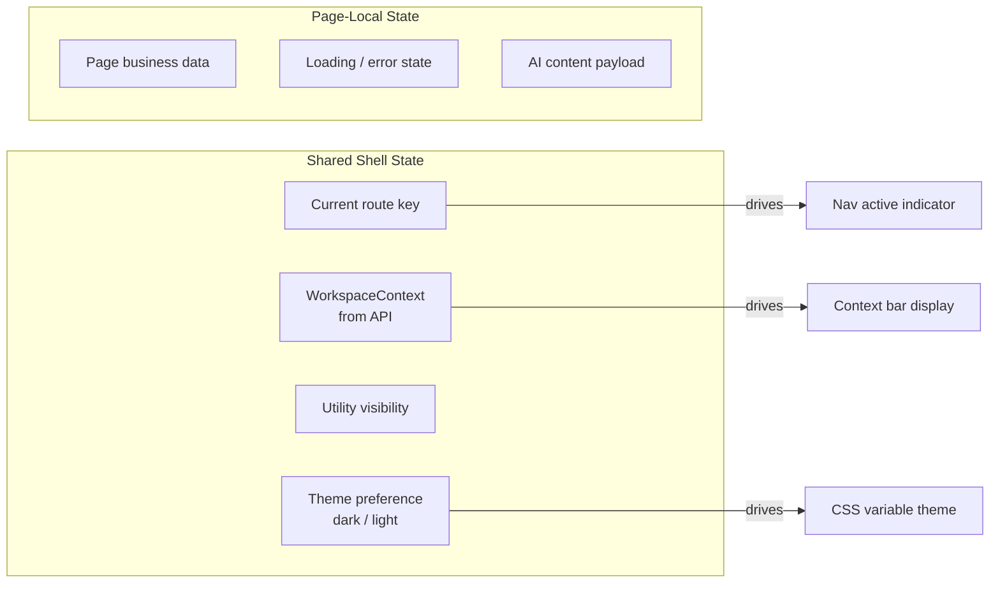
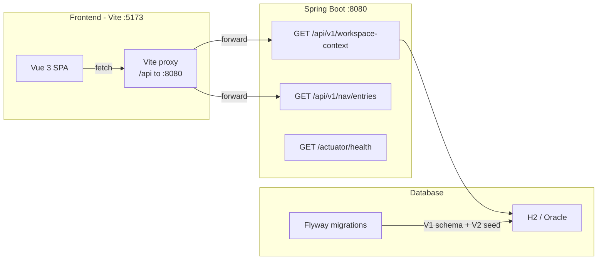

# Shared App Shell Architecture

## Purpose

This document defines the technical boundary for implementing the shared shell
as the first foundation slice.

## 1. Architecture Goal

Create one reusable shell that all Round 1 pages can mount into, instead of
copying layout structure per page.

## 2. System Context

The shared app shell is the outermost UI frame of the Agentic SDLC Control Tower
web application. It runs in the browser and is served by a Vue 3 SPA. In the full
system, the SPA communicates with a Spring Boot backend that persists data in
Oracle (production) or H2 (local development and testing).

## 3. Technology Stack

| Layer | Technology | Rationale |
|-------|-----------|-----------|
| Frontend framework | Vue 3 (Composition API, `<script setup>`) | PRD specifies Vue 3; Composition API enables composable-based state sharing |
| Build tool | Vite | Standard Vue 3 toolchain; fast HMR for development |
| Routing | Vue Router | Standard SPA routing for Vue; supports route metadata for nav mapping |
| Client state | Pinia | Official Vue state management; supports module-scoped stores |
| Backend framework | Spring Boot (Java 21) | Enterprise-grade, team familiarity, ecosystem maturity |
| ORM | JPA / Hibernate | Standard Spring Boot data access layer |
| Database (production) | Oracle | Enterprise requirement |
| Database (local/test) | H2 (in-memory) | Zero-setup local testing via Spring profiles |

## 4. Component Breakdown

Shell components:

- App Shell (root layout frame)
- Primary Navigation
- Top Context Bar
- Global Action Bar
- Data Ribbon
- AI Command Panel

Page view components consume the shell:

- Dashboard View
- Project Space View
- Incident Detail View
- Platform Center View

Concrete file names and component APIs are defined in the
[shared app shell design document](../05-design/shared-app-shell-design.md).

## 5. Responsibility Boundaries

### App Shell

Owns:

- page frame composition
- layout slot structure
- placement of nav, top bar, data ribbon, content, and AI panel

Does not own:

- business content for a specific page
- page-specific metrics, tables, or workflows

### Primary Navigation

Owns:

- rendering of navigation entries
- active item visualization
- route-to-nav-key mapping input

Does not own:

- permission policy logic in V1 foundation

### Top Context Bar

Owns:

- display of normalized workspace context
- layout-safe fallback rendering for missing fields
- loading and error states for context fetching

Does not own:

- source-of-truth fetching logic beyond receiving prepared context state

### Global Action Bar

Owns:

- global search, notification, and audit entry points
- theme toggle control

Does not own:

- page-specific actions

### AI Command Panel

Owns:

- persistent panel container
- structural sections for summary, reasoning, evidence, and actions

Does not own:

- page-specific AI logic
- global AI administration behavior

## 6. Data Flow

Baseline flow:

1. Route selects current page view.
2. Route metadata provides `ShellPageConfig` (navKey, title, subtitle, actions).
3. `useWorkspaceContext()` fetches `WorkspaceContext` from the backend API.
4. Shell renders shared frame (nav, context bar, action bar, data ribbon, AI panel).
5. Page body renders inside shell content region.
6. Page-scoped AI content renders inside AI panel container.

## 7. State Boundaries

Shared shell state:

- current route key
- normalized workspace context (fetched from API)
- utility visibility state
- theme preference (persisted in localStorage)
- AI panel open content state if needed in later slices

Page-local state:

- page business data
- page module loading/error state
- page-specific AI content payload

## 8. Backend Integration

- Frontend uses Vite proxy (`/api` to `http://localhost:8080`) during development
- Backend serves workspace context and navigation entries via versioned REST APIs
- Schema is managed by Flyway migrations, not JPA auto-DDL
- CORS is configured for `localhost:5173` during development

## 9. Security Considerations

- The shell itself does not enforce authentication or authorization in V1
- Authentication and session management will be handled by the Spring Boot backend in later slices
- The shell must not expose workspace-scoped data without backend-enforced context validation
- Navigation entries render the full set in V1; permission-based filtering is deferred but the architecture must not make it structurally difficult to add

## 10. Risks

- If shell components fetch their own business data, boundaries will blur
- If pages own shell structure, layout duplication will return quickly
- If AI panel behavior is coupled too early to one page, reuse will weaken
- If the technology stack is changed after the shell is built, the shell abstraction should remain portable (avoid deep coupling to a specific UI library beyond Vue 3 core)

## 11. Architecture Exit Criteria

This slice is ready to implement when:

- component ownership is accepted
- route-to-nav mapping is accepted
- shared context shape is accepted
- page views are confirmed to render through one shell abstraction
