# Shared App Shell Data Flow

## Purpose

This document details the runtime data flows for the Shared App Shell,
covering workspace context loading, navigation rendering, theme switching,
route transitions, and frontend-backend integration.

## Traceability

- Architecture: [shared-app-shell-architecture.md](shared-app-shell-architecture.md)
- Design: [shared-app-shell-design.md](../05-design/shared-app-shell-design.md)
- Spec: [shared-app-shell-spec.md](../03-spec/shared-app-shell-spec.md)

---

## 1. Application Bootstrap Flow

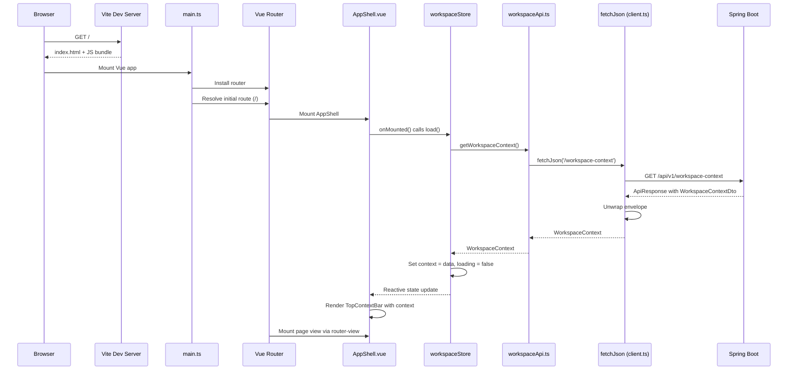

---

## 2. Workspace Context Loading

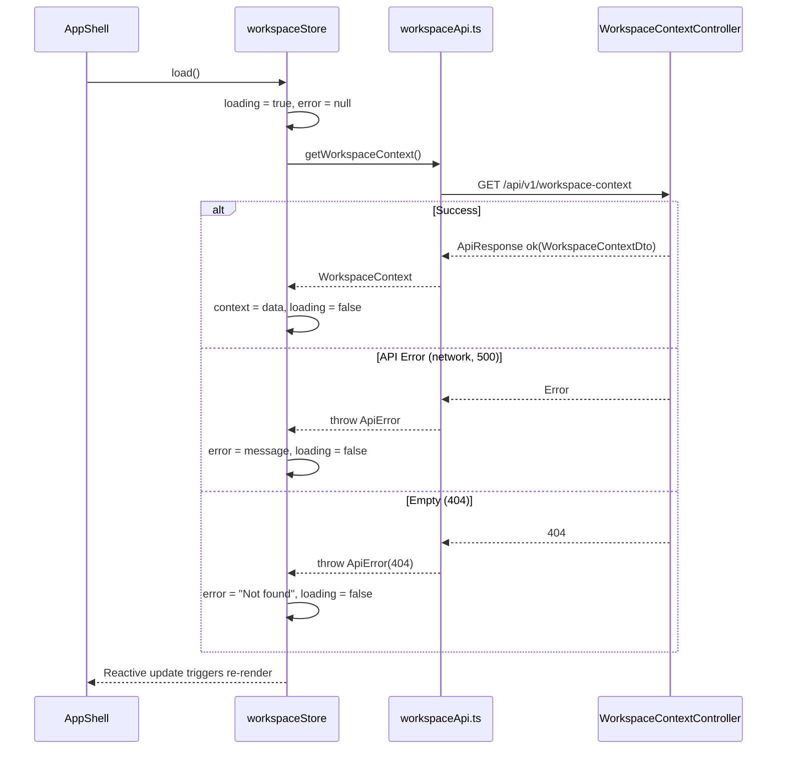

### Context Display States

| Store State | TopContextBar Renders |
|-------------|----------------------|
| `loading = true` | "Loading workspace context..." |
| `error != null` | "Context unavailable" + retry button |
| `context` loaded, optional field null | Field shows `---` placeholder |
| `context` loaded, all fields present | Full 5-field context chain |

---

## 3. Navigation Rendering Flow

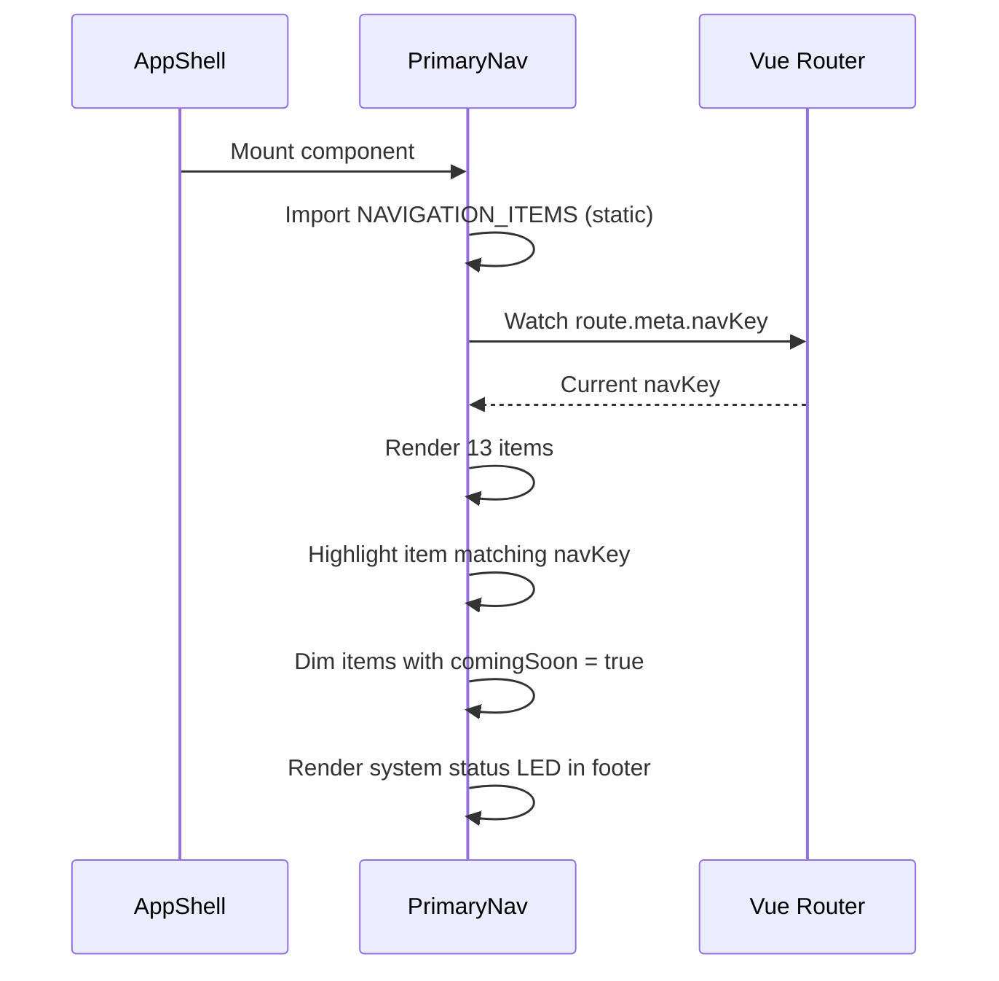

### Navigation Item Sources

V1 uses a static `NAVIGATION_ITEMS` array imported from `router/index.ts`.
The backend `GET /api/v1/nav/entries` endpoint exists for future dynamic navigation.

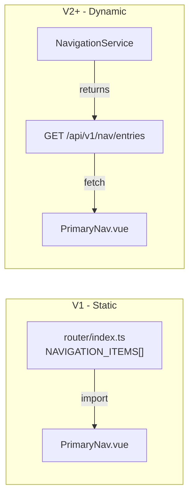

---

## 4. Route Transition Flow

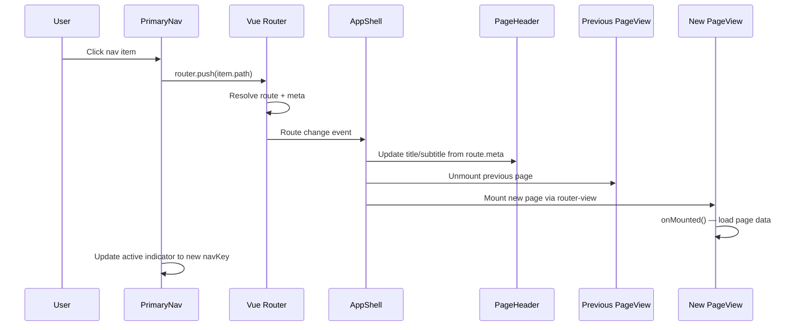

### Route Metadata Delivery

Each route defines a `ShellPageConfig` in its `meta` field:

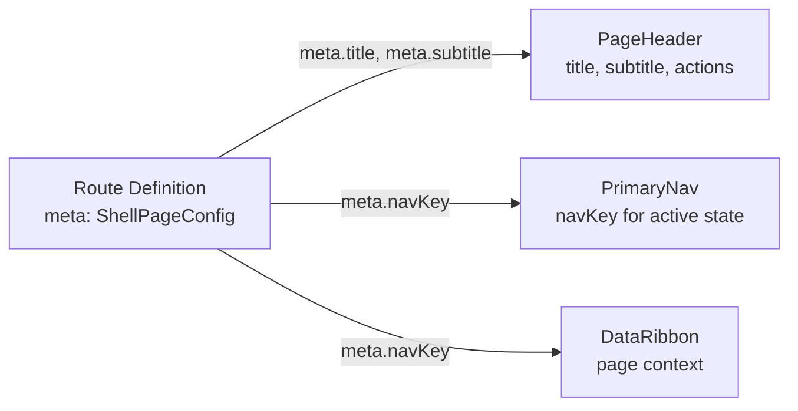

---

## 5. Theme Toggle Flow

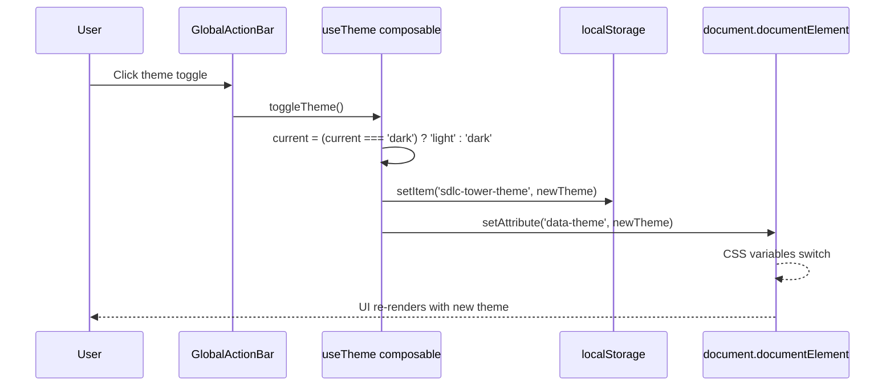

### Theme State Machine

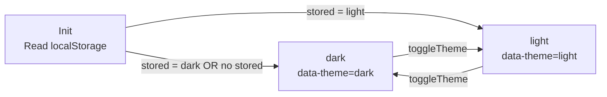

Default is `dark` ("Tactical Command" mode). Theme preference persists
in `localStorage` under key `sdlc-tower-theme`.

---

## 6. Page-Shell Communication

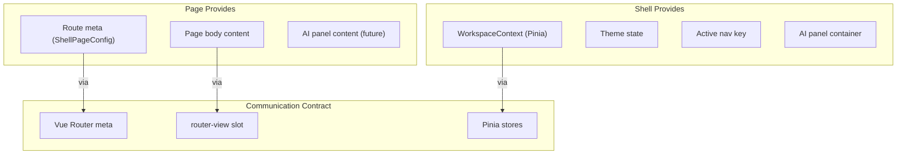

### Communication Channels

| Direction | Channel | Data |
|-----------|---------|------|
| Shell to Page | Pinia store (`workspaceStore`) | WorkspaceContext, loading, error |
| Shell to Page | `useTheme()` composable | Current theme, toggle function |
| Page to Shell | Route `meta` field | navKey, title, subtitle, actions |
| Page to Shell | `router-view` slot | Page body content |
| Page to Shell (future) | TBD | AI panel content for current page |

---

## 7. Error Cascade Boundaries

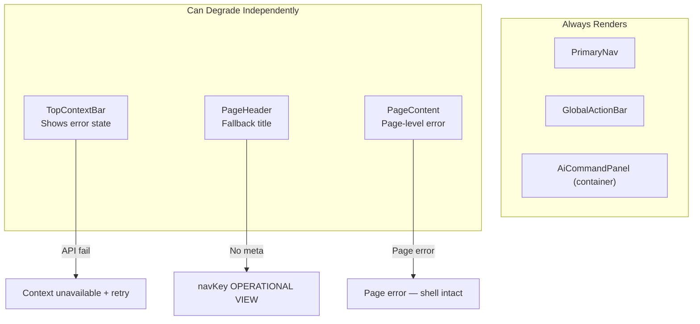

### Error Isolation Rules

| Failure | Impact | Shell Behavior |
|---------|--------|----------------|
| Workspace API fails | TopContextBar only | Shows error + retry; rest of shell normal |
| Page view throws | Page content only | Shell frame remains; only router-view affected |
| Navigation API fails (future) | Nav items | Falls back to static NAVIGATION_ITEMS |
| Theme fails to persist | Theme toggle | Defaults to dark; no visible error |

---

## 8. Backend Processing Chain

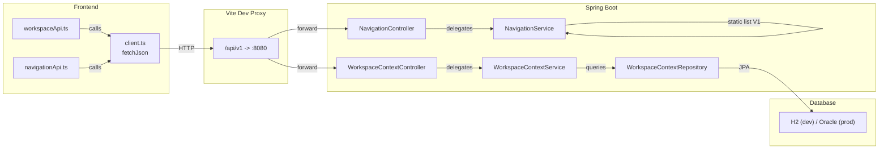

### Backend Call Chain — Workspace Context

1. `WorkspaceContextController.getWorkspaceContext()` receives GET
2. Delegates to `WorkspaceContextService.getCurrentWorkspaceContext()`
3. Service queries `WorkspaceContextRepository` (JPA)
4. Entity converted to `WorkspaceContextDto.fromEntity(entity)`
5. Wrapped in `ApiResponse.ok(dto)`, returned as JSON

### Backend Call Chain — Navigation Entries

1. `NavigationController.getEntries()` receives GET
2. Delegates to `NavigationService.getEntries()`
3. Service returns hardcoded `List<NavItem>` (V1 — no DB)
4. Wrapped in `ApiResponse.ok(list)`, returned as JSON
