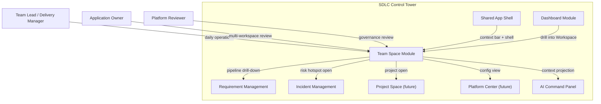
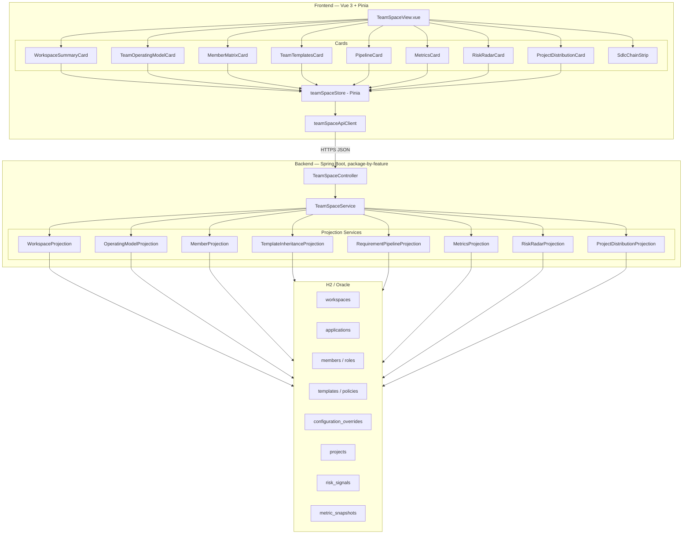
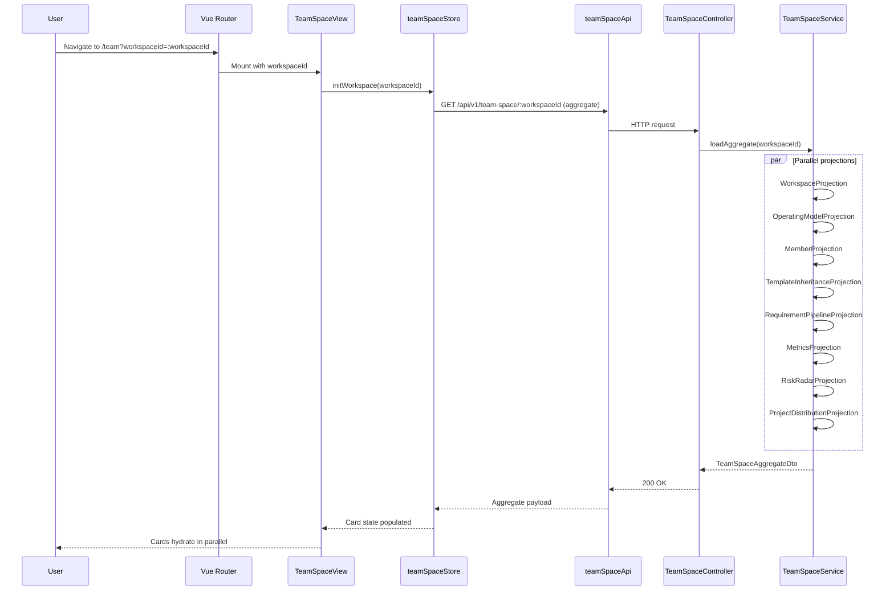
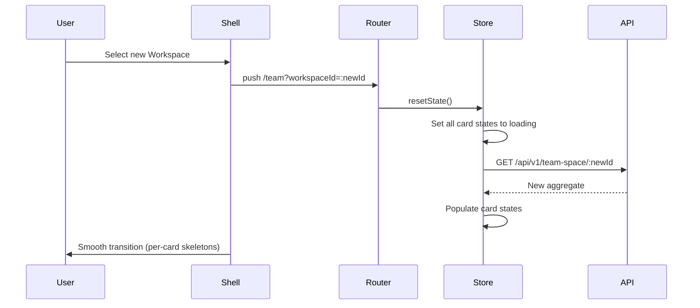
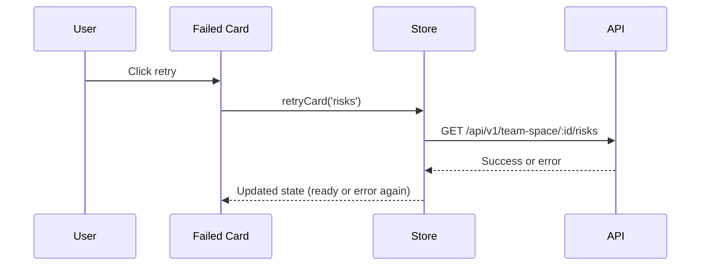
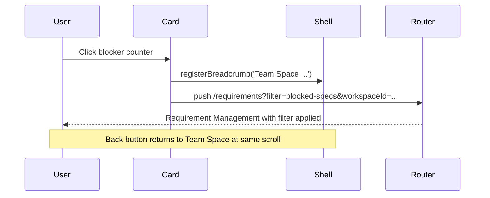
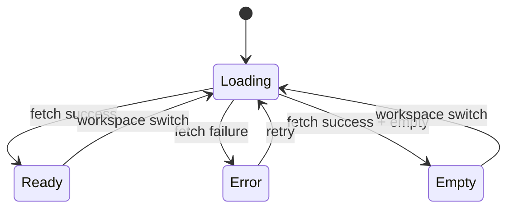

# System Architecture: Team Space

## Overview

Team Space is the Workspace-level operating home, sitting between Dashboard (cross-team aggregate) and Project Space (single-project execution) in the Agentic SDLC Control Tower. This document defines the system context, component breakdown, data flow, state boundaries, and integration model of the Team Space module.

## Source Specification

- [team-space-spec.md](../03-spec/team-space-spec.md)
- [team-space-requirements.md](../01-requirements/team-space-requirements.md)
- [team-space-stories.md](../02-user-stories/team-space-stories.md)

## Architectural Drivers

### Key Functional Drivers

| Driver | Implication |
|--------|-------------|
| Workspace-scoped single-tenant view | Every fetch / state node keys on `workspaceId` |
| Multi-card, parallel rendering | Per-card skeletons, per-card error isolation, parallel fetches |
| Read-only presentation of platform config inheritance | Reuse a shared `lineage` primitive; no write paths |
| Navigation to Requirement / Incident / Project Space / Platform Center | Stable deep-link vocabulary; context preserved via router state |
| AI Command Panel integration | Push page context to shell; record skill executions |

### Key Non-Functional Drivers

| Driver | Implication |
|--------|-------------|
| < 300ms first paint | Aggregate endpoint reduces fan-out on cold load |
| < 500ms per-card hydration | Per-card endpoints for refresh granularity |
| Hard Workspace isolation | Backend enforces `workspaceId` on every endpoint |
| Schema changes via Flyway | Any persistence artifacts land as V{n} migrations |

### Constraints and Assumptions

- The shared app shell, dashboard, requirement, and incident slices are already implemented.
- Project Space is not yet a full slice — Team Space navigation resolves to a stub fallback when Project Space is missing.
- Platform Center is not yet a full slice — "View in Platform Center" links resolve to stub pages gated by a feature flag.
- V1 storage is H2 for local dev and Oracle for shared environments. Schema additions are few; most Team Space data is projected from existing domain tables.

## System Context

### Primary Actors

| Actor | Role |
|-------|------|
| Team Lead / Delivery Manager | Primary user |
| Application Owner | Multi-Workspace user |
| Platform Reviewer | Read-only compliance user |
| PM / Dev / QA / SRE | Context-orienting user |
| AI Command Panel | Consumes page context |

### External Systems

| System | Relationship to Team Space |
|--------|---------------------------|
| Shared App Shell | Hosts the page, provides context bar, AI panel, breadcrumb |
| Dashboard module | Inbound drill-in entry point |
| Requirement Management module | Outbound deep-link target (pipeline counters, blockers) |
| Incident Management module | Outbound deep-link target (risk radar hotspots) |
| Project Space module (future) | Outbound drill-down target |
| Platform Center module (future) | Outbound read-only config detail |
| Access Management module (future) | Outbound member/permission detail |
| Report Center module (future) | Metric history deep-link |
| Backend Services | Projects workspace aggregates, configuration inheritance, risk computation |

### System Context Diagram



### System Boundary

The Team Space module owns all Team-Space-specific UI components, state management, aggregate API endpoints, and projection services. It does **not** own:

- Workspace / Application / SNOW Group master data (read from `shared` platform tables)
- Member / role master data (read from Access Management tables)
- Template / policy master data (read from Platform Center tables)
- Requirement / Spec / Incident data (read via module facades)
- Project lifecycle data (read via Project Management facade; in V1, read from a stub projection)

Team Space is **projection-heavy**: it assembles views from other modules' data, adds risk-radar and metric computation, and exposes a cohesive Workspace operating view.

## High-Level Architecture

### Component Breakdown Diagram



### Layer Summary

| Layer | Responsibility |
|-------|---------------|
| TeamSpaceView | Top-level route view, mounts cards, subscribes to store |
| Card components | Each card owns its own skeleton / error / empty state |
| SdlcChainStrip | Renders compressed 11-node chain with Spec highlight |
| teamSpaceStore | Per-card state nodes + shared workspaceId key |
| teamSpaceApiClient | HTTP boundary, response envelope unwrap |
| TeamSpaceController | REST endpoints, `workspaceId` authorization |
| TeamSpaceService | Orchestrates projection services, enforces isolation |
| Projection services | One per card; each reads its upstream source |
| Data store | Existing domain tables + new projection tables |

## Component Breakdown

### Frontend Components

| Component | Inputs | Outputs / Emits | Notes |
|-----------|--------|-----------------|-------|
| `TeamSpaceView.vue` | `workspaceId` (route param) | n/a | Mounts cards, manages breadcrumb registration |
| `WorkspaceSummaryCard.vue` | `summary: WorkspaceSummaryDto` | — | REQ-TS-10/11/12 |
| `TeamOperatingModelCard.vue` | `operatingModel: TeamOperatingModelDto` | Navigate-to-Platform event | REQ-TS-20/21/22 |
| `MemberMatrixCard.vue` | `members: MemberMatrixDto` | Navigate-to-Access event | REQ-TS-30/31/32 |
| `TeamTemplatesCard.vue` | `templates: TeamDefaultTemplatesDto` | Navigate-to-Platform event | REQ-TS-40/41/42 |
| `PipelineCard.vue` | `pipeline: RequirementPipelineDto` | Navigate-to-Requirement-Management event with filter | REQ-TS-50/51/52/53 |
| `MetricsCard.vue` | `metrics: TeamMetricsDto` | Navigate-to-Report-Center event | REQ-TS-60/61/62 |
| `RiskRadarCard.vue` | `risks: TeamRiskRadarDto` | Navigate-to-action event | REQ-TS-70/71/72 |
| `ProjectDistributionCard.vue` | `projects: ProjectDistributionDto` | Navigate-to-Project-Space event | REQ-TS-80/81/82 |
| `SdlcChainStrip.vue` | `chainHealth: ChainHealthDto` | — | REQ-TS-134 |
| `LineageBadge.vue` | `lineage: Lineage` | — | Shared primitive reused across cards |
| `CoverageGapBanner.vue` | `gaps: CoverageGap[]` | — | Used in MemberMatrixCard |

### Backend Components

| Component | Responsibility |
|-----------|---------------|
| `TeamSpaceController` | Exposes `/api/v1/team-space/*` endpoints; validates `workspaceId`; authorizes |
| `TeamSpaceService` | Aggregates projections; enforces fan-out parallelism; assembles `TeamSpaceAggregateDto` |
| `WorkspaceProjection` | Reads Workspace, Application, SNOW Group, counts active projects/environments |
| `OperatingModelProjection` | Resolves inheritance chain (Platform → Application → SNOW Group → Workspace → Project) |
| `MemberProjection` | Aggregates member list, roles, oncall, coverage gaps |
| `TemplateInheritanceProjection` | Groups templates/policies/workflows/skill packs/AI defaults with lineage |
| `RequirementPipelineProjection` | Queries Requirement / Story / Spec counters + blockers |
| `MetricsProjection` | Reads metric snapshots scoped to Workspace |
| `RiskRadarProjection` | Assembles risks from multiple sources (projects, dependencies, approvals, config drift, incidents) |
| `ProjectDistributionProjection` | Lists projects stratified by health |
| `WorkspaceAccessGuard` | Filter enforcing `workspaceId` authorization on every request |

### Package Layout (Backend)

Per CLAUDE.md rule #3 — package-by-feature:

```
backend/src/main/java/com/sdlctower/
├── domain/
│   └── teamspace/
│       ├── TeamSpaceController.java
│       ├── TeamSpaceService.java
│       ├── WorkspaceAccessGuard.java
│       ├── projection/
│       │   ├── WorkspaceProjection.java
│       │   ├── OperatingModelProjection.java
│       │   ├── MemberProjection.java
│       │   ├── TemplateInheritanceProjection.java
│       │   ├── RequirementPipelineProjection.java
│       │   ├── MetricsProjection.java
│       │   ├── RiskRadarProjection.java
│       │   └── ProjectDistributionProjection.java
│       ├── persistence/
│       │   ├── RiskSignalEntity.java
│       │   ├── MetricSnapshotEntity.java
│       │   ├── RiskSignalRepository.java
│       │   └── MetricSnapshotRepository.java
│       └── dto/
│           ├── TeamSpaceAggregateDto.java
│           ├── WorkspaceSummaryDto.java
│           ├── TeamOperatingModelDto.java
│           ├── MemberMatrixDto.java
│           ├── TeamDefaultTemplatesDto.java
│           ├── RequirementPipelineDto.java
│           ├── TeamMetricsDto.java
│           ├── TeamRiskRadarDto.java
│           ├── ProjectDistributionDto.java
│           └── LineageDto.java
└── shared/
    ├── dto/
    │   ├── ApiResponse.java
    │   └── SectionResultDto.java
    └── ApiConstants.java
```

Shared platform entities (Workspace, Application, Member, Template, Policy, ConfigurationOverride, Project) live under `com.sdlctower.shared.*` and are consumed by Team Space via repository facades.

### Monitoring / Audit

- Each skill execution invoked from the AI Command Panel on Team Space is logged via the existing platform audit pipeline.
- Workspace-scope violations (e.g., authorization failures) emit an audit event with `workspaceId`, `userId`, `endpoint`, `reason`.

## Data Architecture

### Conceptual Entities

| Entity | Ownership | Notes |
|--------|-----------|-------|
| Workspace | Shared platform | Already exists |
| Application | Shared platform | Already exists |
| SNOW Group | Shared platform | Nullable |
| Member / Role | Access Management | Already exists |
| Template / Policy / Workflow | Platform Center | Already exists |
| Configuration Override | Platform Center | Already exists; read by inheritance resolver |
| Project | Project Management | Already exists in stub form |
| Risk Signal | Team Space (new) | Aggregated risk rows |
| Metric Snapshot | Team Space (new) | Periodic computed metrics |
| Coverage Gap | Team Space (new) | Derived from member oncall schedule |

### State / Status Models

- **Workspace Health** enum: `GREEN` / `YELLOW` / `RED` / `UNKNOWN` — derived server-side.
- **Risk Severity** enum: `CRITICAL` / `HIGH` / `MEDIUM` / `LOW`.
- **Project Health Stratum** enum: `HEALTHY` / `AT_RISK` / `CRITICAL` / `ARCHIVED`.
- **Trend Direction** enum: `UP` / `DOWN` / `FLAT`.
- **Lineage Origin** enum: `PLATFORM` / `APPLICATION` / `SNOW_GROUP` / `WORKSPACE` / `PROJECT`.
- **Coverage Gap Kind** enum: `ONCALL_GAP` / `ROLE_UNFILLED` / `BACKUP_MISSING`.

### Persistence Responsibilities

| Data | Storage | Refresh |
|------|---------|---------|
| Workspace summary fields | Existing tables | On-demand projection |
| Operating model lineage | Computed from `configuration_overrides` | On-demand projection |
| Members / roles / oncall | Existing Access tables | On-demand projection |
| Templates / lineage | Existing Platform tables | On-demand projection |
| Pipeline counters | Computed from Requirement / Story / Spec tables | On-demand projection |
| Metrics | `metric_snapshots` table | Nightly batch; on-demand read |
| Risk signals | `risk_signals` table | Scheduled refresh (cron); on-demand read |
| Coverage gaps | Computed on-demand | No storage |

## Integration Architecture

### Shared App Shell

- Consumes `currentWorkspace` from shell context bar.
- Registers breadcrumb entries via shell API: `Dashboard / Team Space (Workspace X)`.
- Pushes page context to AI Command Panel via shell event bus.

### Dashboard Module

- Dashboard's "drill into Workspace" action navigates to `/team?workspaceId=:workspaceId`.
- Metric definitions shared between Team Space and Dashboard (same projection service used, different scoping).

### Requirement Management Module

- Pipeline card navigates to `/requirements?filter=...&workspaceId=...`.
- Filter vocabulary: `blocked-specs`, `no-stories`, `no-spec`, etc. — aligned with Requirement slice query params.

### Incident Management Module

- Risk Radar's incident hotspots navigate to `/incidents?workspaceId=...` or a specific incident.

### Project Space Module (future)

- Project Distribution cards navigate to `/project-space/:projectId`.
- Fallback: if Project Space route does not exist, navigate to `/project-stub/:projectId` rendering a placeholder.

### Platform Center Module (future)

- "View in Platform Center" links resolve to `/platform?view=config&workspaceId=:workspaceId&section=operating-model` (or similar), gated by feature flag.

### AI Command Panel

- Team Space pushes `TeamSpaceContext { workspaceId, topRisks[], pipelineCounters }` to the panel on mount and on Workspace switch.
- Panel displays Team-Space-appropriate suggested prompts.
- Skill invocations are recorded via existing skill-execution audit path.

## Workflow / Runtime Architecture

### Page Load Flow (First Paint)



### Workspace Switch Flow



### Per-Card Retry Flow



### Deep-Link Drill-Down Flow



### State Transitions

Per-card state machine (all cards share the same shape):



### Failure and Retry Handling

- Per-card retry does not affect other cards.
- Aggregate endpoint failure falls back to per-card endpoints (double-failure = page-level error).
- Auth failure / Workspace access denial = page-level error (redirect to Dashboard with error banner).

## API / Interface Boundaries

### Major Inbound Interfaces

| Interface | Purpose |
|-----------|---------|
| `GET /api/v1/team-space/:workspaceId` | Aggregate first-paint load |
| `GET /api/v1/team-space/:workspaceId/{card}` | Per-card fetch |
| Shell context bar | Provides current `workspaceId` |
| AI Command Panel event bus | Consumes page context |

### Internal Module Boundaries

Team Space consumes upstream modules only through repository facades:

- `WorkspaceRepositoryFacade` (shared platform)
- `MemberRepositoryFacade` (Access Management)
- `TemplateInheritanceFacade` (Platform Center)
- `RequirementReadFacade` (Requirement Management)
- `IncidentReadFacade` (Incident Management)
- `ProjectReadFacade` (Project Management)

Team Space never writes to upstream tables.

## Deployment / Environment Considerations

- Same Spring Boot application as other modules.
- No new environment variables required for V1.
- V1 metric snapshot refresh uses existing `@Scheduled` infrastructure.
- Feature flags: `team-space.enabled` (default true), `platform-center-link.enabled` (default false until Platform Center lands), `project-space-link.enabled` (default false until Project Space lands).

## Security / Reliability / Observability

### Access Control

- Every endpoint requires authentication + `workspaceId` scoping.
- `WorkspaceAccessGuard` filter enforces that the authenticated user has read access to the target Workspace.
- Users without access receive 403 (handled as page-level error).

### Auditability

- AI skill executions initiated on Team Space are audited via existing skill-execution audit pipeline.
- Access denial events are audited.
- No write paths on Team Space, so no data-mutation audit needed.

### Resilience

- Aggregate endpoint uses parallel projection fan-out with 500ms per-projection timeout; late projections degrade to card-level errors without breaking first paint.
- Per-card retry supports recovery without page reload.

### Monitoring / Logging

- Structured logs include `workspaceId`, `userId`, `endpoint`, `durationMs`, `projections[]` (which projections hit).
- Metrics: `team_space.aggregate.latency`, `team_space.projection.latency{projection=}`, `team_space.error.count{card=}`.

## Risks / Tradeoffs

| Risk | Mitigation |
|------|-----------|
| Aggregate endpoint latency degrades under high-fan-out | Projection-level timeouts + per-card fallback |
| Stale metric snapshots (nightly refresh) may mislead | "Last refreshed" timestamp on card; manual refresh trigger |
| Inheritance lineage resolution is expensive for deep chains | Cache per-Workspace lineage for a short TTL |
| Team Space drifts from Dashboard definitions of metrics | Single projection service shared by both modules |
| Project Space stub navigation feels broken | Feature flag + placeholder page, clearly labeled "coming soon" |

## Open Questions

See [team-space-spec.md §Open Questions](../03-spec/team-space-spec.md).

- Metric definitions for Governance Maturity / AI Participation.
- Project lifecycle stage enum source.
- Pipeline blocker thresholds default vs per-Workspace.
- Whether AI Command Panel needs a Team-Space-specific skill.
- Permission-gated link strategy (hide vs disable).
