# Team Space — Data Flow

## 1. Purpose and Traceability

This document defines the runtime data flows of the Team Space module: how Workspace-scoped data moves from storage, through projection services, across the API boundary, into the store, and onto the cards. It complements the static architecture view in [team-space-architecture.md](team-space-architecture.md) and the data shape defined in [team-space-data-model.md](team-space-data-model.md).

### Traceability

- Spec: [team-space-spec.md](../03-spec/team-space-spec.md)
- Stories: [team-space-stories.md](../02-user-stories/team-space-stories.md) — S1 through S12
- Requirements: [team-space-requirements.md](../01-requirements/team-space-requirements.md)

---

## 2. Runtime Data Flows

### 2.1 Aggregate First-Paint Load (Phase A: mock, Phase B: API)

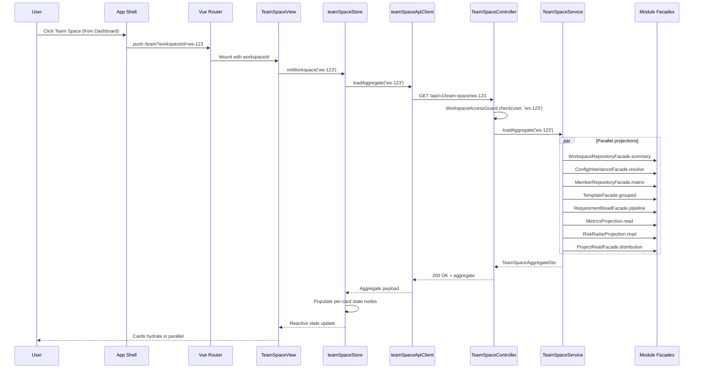

### 2.2 Workspace Switch Flow

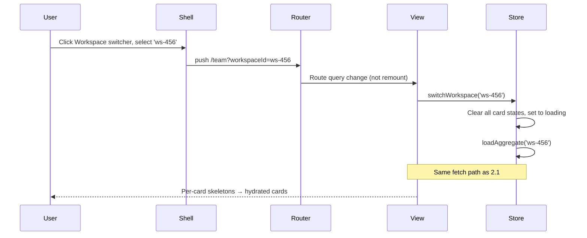

### 2.3 Per-Card Refresh / Retry Flow

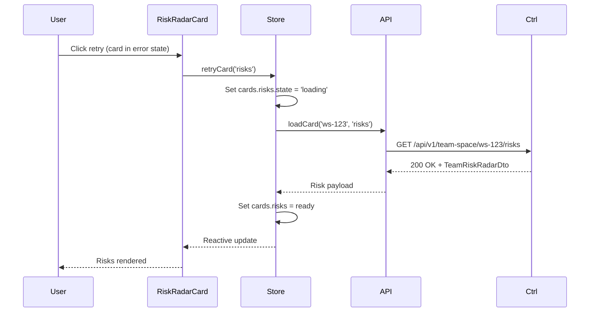

### 2.4 Pipeline Counter → Requirement Management Drill-Down

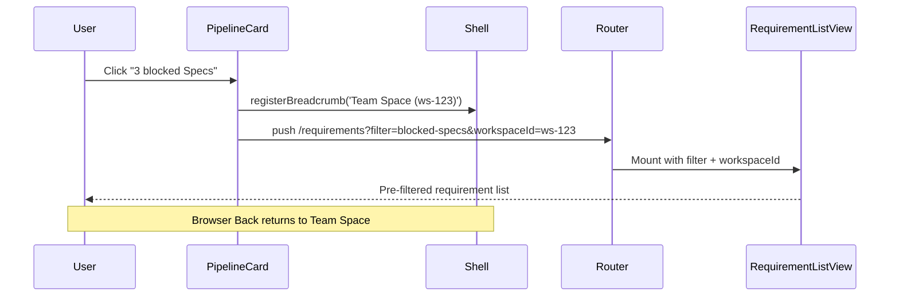

### 2.5 Risk Radar Item → Incident Detail Drill-Down

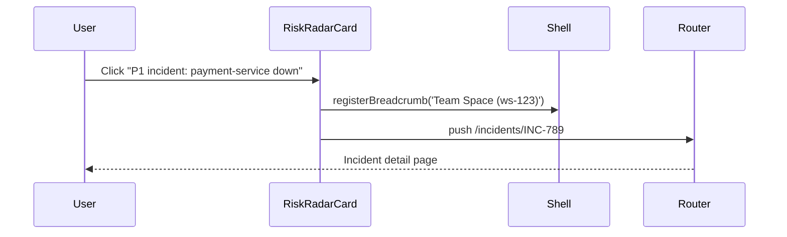

### 2.6 Project Distribution → Project Space (with Fallback)

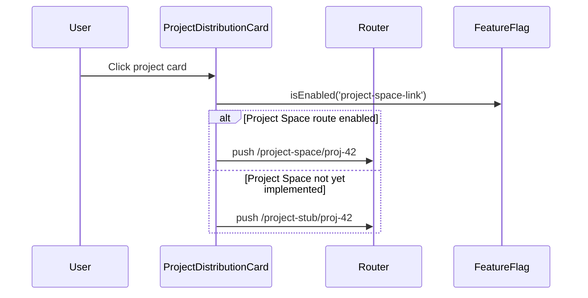

### 2.7 AI Command Panel Context Projection

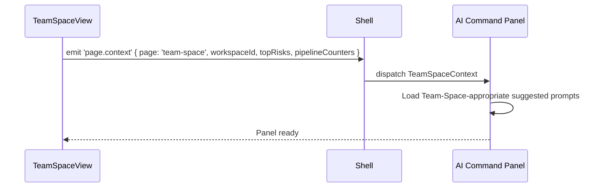

### 2.8 AI Skill Invocation Recorded as Skill Execution

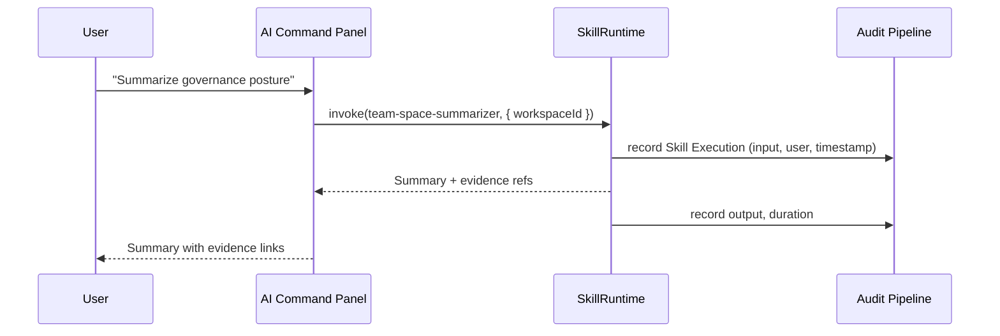

### 2.9 Coverage Gap Computation

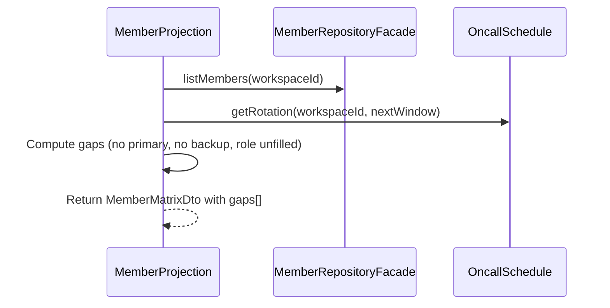

### 2.10 Metric Snapshot Refresh (Scheduled)

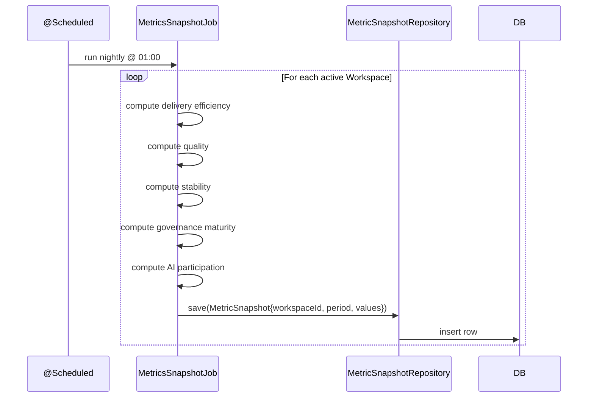

### 2.11 Risk Signal Refresh (Scheduled)

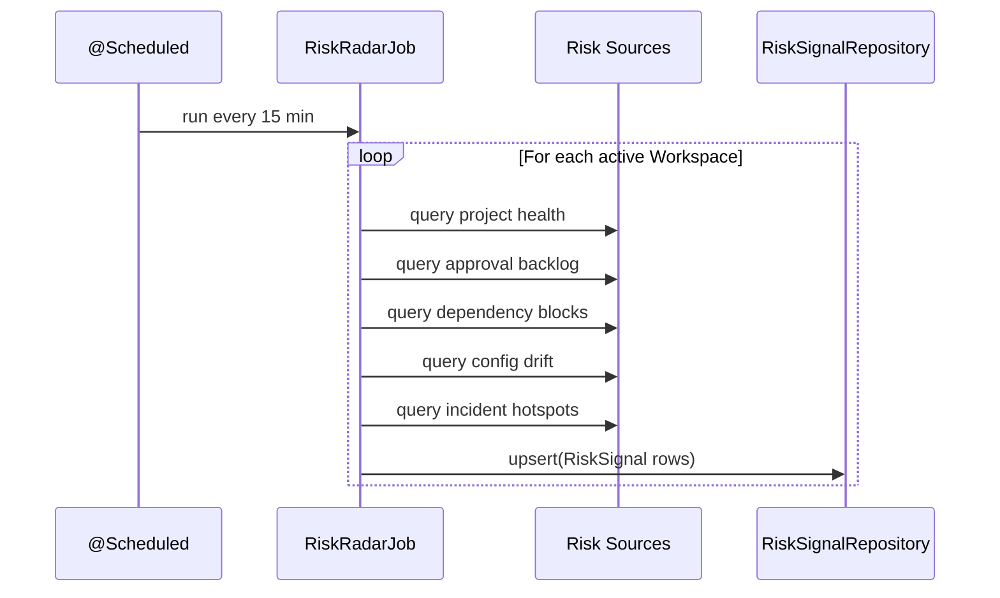

---

## 3. Error Isolation Strategy

### Aggregate Endpoint: Partial Degradation

When the aggregate endpoint is called, each projection runs in parallel with a 500ms budget. A projection that errors or times out returns a `SectionResult` with `data = null` and a non-null `error`; other projections still return their normal `data` with `error = null`.

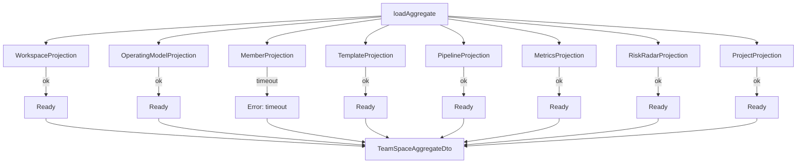

Each card in the DTO carries its own section envelope — the frontend combines that `data` / `error` payload with local loading flags to render skeleton / error / ready states independently.

### Section Envelope

```typescript
interface SectionResult<T> {
  readonly data: T | null;
  readonly error: string | null;
}
```

### Page-Level Errors

| Condition | Behavior |
|-----------|---------|
| Auth failure | Redirect to login |
| Workspace access denied | Redirect to Dashboard + error banner |
| Invalid `workspaceId` format | 400 + inline page error |
| Both aggregate AND all per-card endpoints fail | Full-page error with reload button |

### Retry Strategy

- Per-card retry: manual, triggered by user click on error state.
- No automatic retry in V1.
- Aggregate endpoint timeout: 2s total; if exceeded, frontend falls back to per-card endpoints.

---

## 4. State Machine

### Per-Card State Transitions

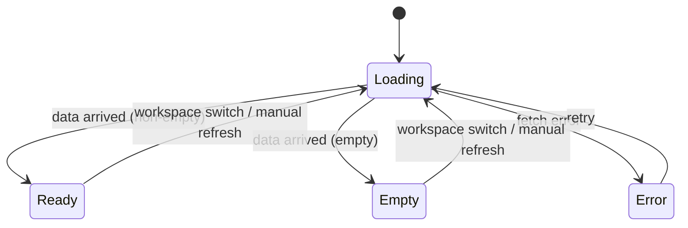

### Card-Level State Values

| Card | Empty example | Error example |
|------|---------------|---------------|
| WorkspaceSummary | N/A (always has identity) | "Failed to load workspace summary" |
| OperatingModel | N/A (always has lineage resolution) | "Failed to resolve configuration" |
| Members | "No members yet" | "Failed to load members" |
| Templates | "No overrides" (partial empty) | "Failed to load templates" |
| Pipeline | "No requirements yet" | "Failed to load pipeline" |
| Metrics | "No snapshots yet" | "Failed to load metrics" |
| Risks | "All green" | "Failed to load risk radar" |
| Projects | "No projects yet" | "Failed to load projects" |

---

## 5. Refresh Strategy

### V1: On-Load + Manual Refresh

- Aggregate fetched on page mount and on Workspace switch.
- Per-card manual refresh via action button on each card.
- No automatic polling.

### Metric / Risk Backing Data

- Metrics: nightly snapshot refresh; displayed with `lastRefreshed` timestamp.
- Risks: 15-minute cron refresh; displayed with `lastRefreshed` timestamp.

### Future (V2+)

- WebSocket push when risk signal changes.
- Configurable polling per-card.
- Optimistic update when Platform Center changes a template that would affect Team Space.

---

## 6. API Client Chain

### Full Request Path

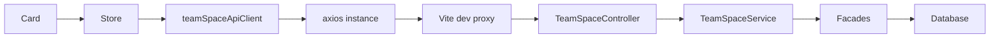

### Layer Responsibilities

| Layer | Responsibility |
|-------|---------------|
| Card | Dispatches store action; subscribes to state |
| Store (Pinia) | Owns per-card state nodes; dispatches API calls; unwraps envelopes |
| teamSpaceApiClient | Typed wrapper over axios; returns typed DTOs |
| axios | HTTP transport; response envelope interceptor |
| Vite dev proxy | `/api` → backend origin in dev |
| Controller | Endpoint surface; authorization; validation |
| Service | Orchestration; parallel projection fan-out |
| Projections | Read domain data via facades |
| Facades | Repository abstraction over shared tables |

### Vite Proxy Configuration

```ts
// vite.config.ts
server: {
  proxy: {
    '/api': {
      target: 'http://localhost:8080',
      changeOrigin: true,
    },
  },
}
```

### Mock Toggle Pattern

```ts
import { fetchJson } from '@/shared/api/client';

const USE_MOCK = import.meta.env.DEV && !import.meta.env.VITE_USE_BACKEND;

export async function loadAggregate(workspaceId: string): Promise<TeamSpaceAggregateDto> {
  if (USE_MOCK) return mockAggregate(workspaceId);
  return fetchJson<TeamSpaceAggregateDto>(`/team-space/${workspaceId}`);
}
```

---

## 7. Frontend Type to Backend DTO Mapping

| Frontend Type | Backend DTO | Source Projection |
|--------------|-------------|-------------------|
| `WorkspaceSummary` | `WorkspaceSummaryDto` | `WorkspaceProjection` |
| `TeamOperatingModel` | `TeamOperatingModelDto` | `OperatingModelProjection` |
| `MemberMatrix` | `MemberMatrixDto` | `MemberProjection` |
| `TeamDefaultTemplates` | `TeamDefaultTemplatesDto` | `TemplateInheritanceProjection` |
| `RequirementPipeline` | `RequirementPipelineDto` | `RequirementPipelineProjection` |
| `TeamMetrics` | `TeamMetricsDto` | `MetricsProjection` |
| `TeamRiskRadar` | `TeamRiskRadarDto` | `RiskRadarProjection` |
| `ProjectDistribution` | `ProjectDistributionDto` | `ProjectDistributionProjection` |
| `TeamSpaceAggregate` | `TeamSpaceAggregateDto` | `TeamSpaceService` |
| `Lineage` | `LineageDto` | shared primitive |
| `SectionResult<T>` | `SectionResultDto<T>` | shared envelope |

See [team-space-data-model.md](team-space-data-model.md) for full type definitions.

---

## 8. Phase A vs Phase B Data Sources

| Phase | Aggregate Source | Per-Card Source |
|-------|------------------|-----------------|
| Phase A (frontend-first) | `src/features/team-space/mock/aggregate.mock.ts` | same mock file |
| Phase B (full-stack) | `GET /api/v1/team-space/:id` | `GET /api/v1/team-space/:id/{card}` |

Mock structure mirrors the backend DTO shape exactly; swapping via `VITE_USE_BACKEND` does not require rerendering components.
