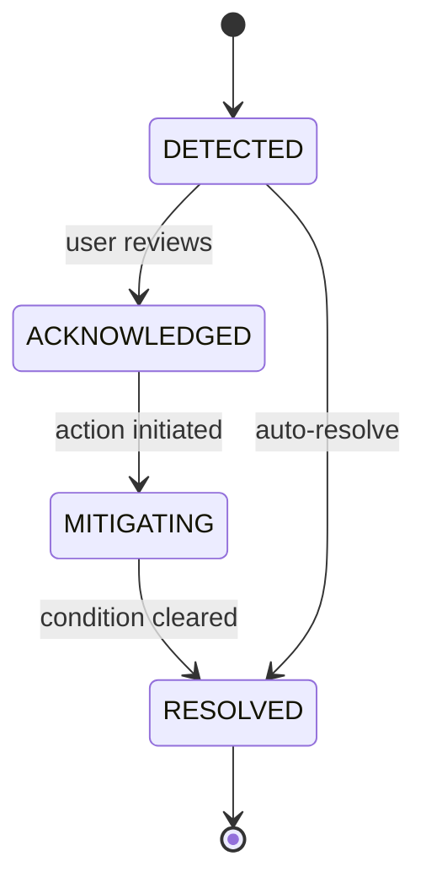

# Team Space Data Model

## Purpose

This document defines the domain data model for the Team Space slice: the conceptual entities, frontend type catalog, backend DTO definitions, database schema DDL, and the frontend-to-backend type mapping.

Team Space is projection-heavy — most data is assembled from upstream modules. This slice introduces two new persistent entities: `risk_signals` and `metric_snapshots`. Everything else is read via facades.

## Traceability

- Spec: [team-space-spec.md](../03-spec/team-space-spec.md)
- Data Flow: [team-space-data-flow.md](team-space-data-flow.md)
- API Guide: [team-space-API_IMPLEMENTATION_GUIDE.md](../05-design/contracts/team-space-API_IMPLEMENTATION_GUIDE.md)
- Requirements: [team-space-requirements.md](../01-requirements/team-space-requirements.md)

---

## 1. Domain Model Overview

```mermaid
erDiagram
    WORKSPACE ||--o{ PROJECT : contains
    WORKSPACE ||--o{ ENVIRONMENT : contains
    WORKSPACE ||--|| APPLICATION : belongs_to
    WORKSPACE }o--o| SNOW_GROUP : primary
    WORKSPACE ||--o{ MEMBER : has
    MEMBER ||--o{ ROLE_ASSIGNMENT : has
    WORKSPACE ||--o{ CONFIG_OVERRIDE : has
    PLATFORM_DEFAULT ||--o{ CONFIG_OVERRIDE : inherited_by
    APPLICATION ||--o{ CONFIG_OVERRIDE : overrides
    SNOW_GROUP ||--o{ CONFIG_OVERRIDE : overrides
    WORKSPACE ||--o{ TEMPLATE_BINDING : uses
    TEMPLATE ||--o{ TEMPLATE_BINDING : binds
    WORKSPACE ||--o{ RISK_SIGNAL : accumulates
    WORKSPACE ||--o{ METRIC_SNAPSHOT : has
    PROJECT ||--o{ RISK_SIGNAL : produces
    INCIDENT ||--o{ RISK_SIGNAL : produces

    WORKSPACE {
        string id PK
        string name
        string applicationId FK
        string snowGroupId FK nullable
        string ownerId FK
        string healthAggregate
        timestamp createdAt
    }
    PROJECT {
        string id PK
        string workspaceId FK
        string name
        string lifecycleStage
        string healthStratum
        string primaryRisk nullable
    }
    MEMBER {
        string id PK
        string displayName
        string userRef
    }
    ROLE_ASSIGNMENT {
        string id PK
        string memberId FK
        string workspaceId FK
        string role
        timestamp lastActiveAt
    }
    CONFIG_OVERRIDE {
        string id PK
        string scope
        string scopeId
        string configKey
        string configValue
        timestamp updatedAt
    }
    TEMPLATE {
        string id PK
        string kind
        string name
        string version
    }
    TEMPLATE_BINDING {
        string id PK
        string workspaceId FK
        string templateId FK
        string lineageOrigin
        boolean overridden
    }
    RISK_SIGNAL {
        string id PK
        string workspaceId FK
        string category
        string severity
        string sourceKind
        string sourceId
        string title
        string actionLink
        timestamp detectedAt
        timestamp resolvedAt nullable
    }
    METRIC_SNAPSHOT {
        string id PK
        string workspaceId FK
        string period
        string metricKey
        double value
        double previousValue
        string trendDirection
        timestamp snapshotAt
    }
```

---

## 2. Frontend Type Model

### 2.1 Shared Envelope Types

```typescript
// src/shared/types/section.ts

export interface SectionResult<T> {
  readonly data: T | null;
  readonly error: string | null;
}
```

The top-level HTTP envelope remains the shared backend `ApiResponse<T>` shape (`data` + `error`) and is unwrapped in `frontend/src/shared/api/client.ts`, so feature code usually consumes typed payloads directly rather than a second frontend envelope type.

### 2.2 Lineage Primitive

```typescript
// src/shared/types/lineage.ts

export type LineageOrigin =
  | 'PLATFORM'
  | 'APPLICATION'
  | 'SNOW_GROUP'
  | 'WORKSPACE'
  | 'PROJECT';

export interface Lineage {
  origin: LineageOrigin;
  overridden: boolean;
  chain: LineageHop[];
}

export interface LineageHop {
  origin: LineageOrigin;
  value: string;
  setAt?: string;
  setBy?: string;
}
```

### 2.3 Enums / Union Types

```typescript
// src/features/team-space/types/enums.ts

export type HealthAggregate = 'GREEN' | 'YELLOW' | 'RED' | 'UNKNOWN';

export type RiskSeverity = 'CRITICAL' | 'HIGH' | 'MEDIUM' | 'LOW';

export type RiskCategory =
  | 'PROJECT'
  | 'DEPENDENCY'
  | 'APPROVAL'
  | 'CONFIG_DRIFT'
  | 'INCIDENT';

export type ProjectHealthStratum =
  | 'HEALTHY'
  | 'AT_RISK'
  | 'CRITICAL'
  | 'ARCHIVED';

export type TrendDirection = 'UP' | 'DOWN' | 'FLAT';

export type CoverageGapKind =
  | 'ONCALL_GAP'
  | 'ROLE_UNFILLED'
  | 'BACKUP_MISSING';

export type AiAutonomyLevel =
  | 'SUGGEST_ONLY'
  | 'HUMAN_IN_LOOP'
  | 'AUTONOMOUS_AUDITED';

export type OperatingMode =
  | 'STANDARD'
  | 'HIGH_GOVERNANCE'
  | 'FAST_PATH';

export type ApprovalMode =
  | 'AUTO'
  | 'REVIEWER_REQUIRED'
  | 'MULTI_APPROVER';

export type TemplateKind =
  | 'PAGE'
  | 'POLICY'
  | 'WORKFLOW'
  | 'SKILL_PACK'
  | 'AI_DEFAULT';

export type MetricKey =
  | 'delivery.cycleTime'
  | 'delivery.throughput'
  | 'quality.defectRate'
  | 'quality.testPassRate'
  | 'stability.mttr'
  | 'stability.incidentFrequency'
  | 'governance.approvalCoverage'
  | 'governance.auditCompleteness'
  | 'ai.participationRate'
  | 'ai.acceptanceRate';
```

### 2.4 Workspace Summary

```typescript
export interface WorkspaceSummary {
  id: string;
  name: string;
  applicationId: string;
  applicationName: string;
  snowGroupId: string | null;
  snowGroupName: string | null;
  activeProjectCount: number;
  activeEnvironmentCount: number;
  healthAggregate: HealthAggregate;
  ownerId: string;
  ownerDisplayName: string;
  compatibilityMode: boolean; // true when snowGroupId is null
  responsibilityBoundary: {
    applications: string[];
    snowGroups: string[];
    projectCount: number;
  };
}
```

### 2.5 Team Operating Model

```typescript
export interface TeamOperatingModelField<T> {
  value: T;
  lineage: Lineage;
}

export interface TeamOperatingModel {
  operatingMode: TeamOperatingModelField<OperatingMode>;
  approvalMode: TeamOperatingModelField<ApprovalMode>;
  aiAutonomyLevel: TeamOperatingModelField<AiAutonomyLevel>;
  oncallOwner: TeamOperatingModelField<{
    memberId: string;
    displayName: string;
    rotationRef: string;
  }>;
  accountableOwners: Array<{
    area: 'DELIVERY' | 'APPROVAL' | 'INCIDENT' | 'GOVERNANCE';
    memberId: string;
    displayName: string;
  }>;
  platformCenterLink: {
    url: string;
    enabled: boolean; // feature-flagged + permission-gated
  };
}
```

### 2.6 Member & Role Matrix

```typescript
export interface MemberMatrixRow {
  memberId: string;
  displayName: string;
  roles: string[];
  oncallStatus: 'ON' | 'OFF' | 'UPCOMING' | 'NONE';
  keyPermissions: string[]; // e.g., ['APPROVE', 'DEPLOY']
  lastActiveAt: string | null; // ISO-8601
}

export interface CoverageGap {
  kind: CoverageGapKind;
  description: string;
  window?: string; // e.g., "2026-04-19 – 2026-04-21"
}

export interface MemberMatrix {
  members: MemberMatrixRow[];
  coverageGaps: CoverageGap[];
  accessManagementLink: {
    url: string;
    enabled: boolean;
  };
}
```

### 2.7 Team Default Templates

```typescript
export interface TemplateEntry {
  id: string;
  name: string;
  version: string;
  kind: TemplateKind;
  lineage: Lineage;
  detailLink?: string;
}

export interface ExceptionOverride {
  templateId: string;
  templateName: string;
  overrideScope: 'PROJECT';
  overrideScopeId: string;
  overrideScopeName: string;
  overriddenAt: string;
  overriddenBy: string;
}

export interface TeamDefaultTemplates {
  groups: Record<TemplateKind, TemplateEntry[]>;
  exceptionOverrides: ExceptionOverride[];
}
```

### 2.8 Requirement & Spec Pipeline

```typescript
export interface PipelineCounters {
  requirementsInflow7d: number;
  storiesDecomposing: number;
  specsGenerating: number;
  specsInReview: number;
  specsBlocked: number;
  specsApprovedAwaitingDownstream: number;
}

export interface PipelineBlocker {
  kind: 'SPEC_BLOCKED' | 'REQ_NO_STORY' | 'STORY_NO_SPEC';
  targetId: string;
  targetTitle: string;
  ageDays: number;
  filterDeeplink: string;
}

export interface ChainNodeHealth {
  nodeKey:
    | 'REQUIREMENT'
    | 'USER_STORY'
    | 'SPEC'
    | 'ARCHITECTURE'
    | 'DESIGN'
    | 'TASKS'
    | 'CODE'
    | 'TEST'
    | 'DEPLOY'
    | 'INCIDENT'
    | 'LEARNING';
  health: HealthAggregate;
  isExecutionHub: boolean; // true for SPEC
}

export interface RequirementPipeline {
  counters: PipelineCounters;
  blockers: PipelineBlocker[];
  chain: ChainNodeHealth[]; // always 11 nodes
  blockerThresholdDays: number;
}
```

### 2.9 Team Metrics

```typescript
export interface TeamMetricItem {
  key: MetricKey;
  label: string;
  currentValue: number;
  previousValue: number;
  unit: 'DAYS' | 'PERCENT' | 'COUNT' | 'HOURS';
  trend: TrendDirection;
  historyLink: string;
  tooltip: string;
}

export interface TeamMetrics {
  deliveryEfficiency: TeamMetricItem[];
  quality: TeamMetricItem[];
  stability: TeamMetricItem[];
  governanceMaturity: TeamMetricItem[];
  aiParticipation: TeamMetricItem[];
  lastRefreshed: string;
}
```

### 2.10 Team Risk Radar

```typescript
export interface RiskItem {
  id: string;
  category: RiskCategory;
  severity: RiskSeverity;
  title: string;
  detail: string;
  ageDays: number;
  primaryAction: {
    label: string;
    url: string;
  };
  skillAttribution?: {
    skillName: string;
    executionId: string;
  };
}

export interface TeamRiskRadar {
  groups: Record<RiskCategory, RiskItem[]>;
  lastRefreshed: string;
  total: number;
}
```

### 2.11 Project Distribution

```typescript
export interface ProjectCardDto {
  id: string;
  name: string;
  lifecycleStage: 'DISCOVERY' | 'DELIVERY' | 'STEADY_STATE' | 'RETIRING';
  healthStratum: ProjectHealthStratum;
  primaryRisk: string | null;
  activeSpecCount: number;
  openIncidentCount: number;
  projectSpaceUrl: string;
}

export interface ProjectDistribution {
  groups: Record<ProjectHealthStratum, ProjectCardDto[]>;
  totals: Record<ProjectHealthStratum, number>;
}
```

### 2.12 Top-Level Aggregate

```typescript
export interface TeamSpaceAggregate {
  workspaceId: string;
  summary: SectionResult<WorkspaceSummary>;
  operatingModel: SectionResult<TeamOperatingModel>;
  members: SectionResult<MemberMatrix>;
  templates: SectionResult<TeamDefaultTemplates>;
  pipeline: SectionResult<RequirementPipeline>;
  metrics: SectionResult<TeamMetrics>;
  risks: SectionResult<TeamRiskRadar>;
  projects: SectionResult<ProjectDistribution>;
}
```

---

## 3. State Models

### 3.1 Workspace Health Aggregate (Derived)

Derived server-side from:

- Critical risks count (> 0 → RED)
- High risks count (> 3 → YELLOW)
- Open incidents count (> 0 P1 → RED)
- Approval backlog > 5 items → YELLOW
- Default → GREEN
- No computable data → UNKNOWN

### 3.2 Risk Signal State Machine



In V1 the radar only reads `DETECTED` and `RESOLVED` (auto). Acknowledge / mitigate states are V2.

### 3.3 Project Health Stratum Transitions

Computed server-side at snapshot time; not user-mutable.

| Condition | Stratum |
|-----------|---------|
| No open high/critical risks | `HEALTHY` |
| ≥ 1 high risk | `AT_RISK` |
| ≥ 1 critical risk OR P1 incident open | `CRITICAL` |
| `project.status = ARCHIVED` | `ARCHIVED` |

---

## 4. Backend DTO Model

Java DTOs under `com.sdlctower.domain.teamspace.dto`:

### 4.1 Core DTOs

```java
public record WorkspaceSummaryDto(
    String id,
    String name,
    String applicationId,
    String applicationName,
    String snowGroupId,        // nullable
    String snowGroupName,      // nullable
    int activeProjectCount,
    int activeEnvironmentCount,
    HealthAggregate healthAggregate,
    String ownerId,
    String ownerDisplayName,
    boolean compatibilityMode,
    ResponsibilityBoundaryDto responsibilityBoundary
) {}

public record LineageDto(
    LineageOrigin origin,
    boolean overridden,
    List<LineageHopDto> chain
) {}

public record LineageHopDto(
    LineageOrigin origin,
    String value,
    Instant setAt,
    String setBy
) {}

public record TeamOperatingModelDto(
    FieldDto<OperatingMode> operatingMode,
    FieldDto<ApprovalMode> approvalMode,
    FieldDto<AiAutonomyLevel> aiAutonomyLevel,
    FieldDto<OncallOwnerDto> oncallOwner,
    List<AccountableOwnerDto> accountableOwners,
    LinkDto platformCenterLink
) {}

public record FieldDto<T>(T value, LineageDto lineage) {}

public record MemberMatrixRowDto(
    String memberId,
    String displayName,
    List<String> roles,
    OncallStatus oncallStatus,
    List<String> keyPermissions,
    Instant lastActiveAt
) {}

public record MemberMatrixDto(
    List<MemberMatrixRowDto> members,
    List<CoverageGapDto> coverageGaps,
    LinkDto accessManagementLink
) {}

public record TeamDefaultTemplatesDto(
    Map<TemplateKind, List<TemplateEntryDto>> groups,
    List<ExceptionOverrideDto> exceptionOverrides
) {}

public record RequirementPipelineDto(
    PipelineCountersDto counters,
    List<PipelineBlockerDto> blockers,
    List<ChainNodeHealthDto> chain,
    int blockerThresholdDays
) {}

public record TeamMetricsDto(
    List<TeamMetricItemDto> deliveryEfficiency,
    List<TeamMetricItemDto> quality,
    List<TeamMetricItemDto> stability,
    List<TeamMetricItemDto> governanceMaturity,
    List<TeamMetricItemDto> aiParticipation,
    Instant lastRefreshed
) {}

public record TeamRiskRadarDto(
    Map<RiskCategory, List<RiskItemDto>> groups,
    Instant lastRefreshed,
    int total
) {}

public record ProjectDistributionDto(
    Map<ProjectHealthStratum, List<ProjectCardDto>> groups,
    Map<ProjectHealthStratum, Integer> totals
) {}

public record TeamSpaceAggregateDto(
    String workspaceId,
    SectionResultDto<WorkspaceSummaryDto> summary,
    SectionResultDto<TeamOperatingModelDto> operatingModel,
    SectionResultDto<MemberMatrixDto> members,
    SectionResultDto<TeamDefaultTemplatesDto> templates,
    SectionResultDto<RequirementPipelineDto> pipeline,
    SectionResultDto<TeamMetricsDto> metrics,
    SectionResultDto<TeamRiskRadarDto> risks,
    SectionResultDto<ProjectDistributionDto> projects
) {}

public record SectionResultDto<T>(
    T data,
    String error
) {}
```

---

## 5. Database Schema (Flyway Migration V7)

### 5.1 New Tables

Team Space introduces two new tables: `risk_signals` and `metric_snapshots`. All other data is read via facades over existing tables.

```sql
-- V7__create_team_space_tables.sql

CREATE TABLE risk_signals (
    id               VARCHAR(64)  NOT NULL PRIMARY KEY,
    workspace_id     VARCHAR(64)  NOT NULL,
    category         VARCHAR(32)  NOT NULL,   -- PROJECT / DEPENDENCY / APPROVAL / CONFIG_DRIFT / INCIDENT
    severity         VARCHAR(16)  NOT NULL,   -- CRITICAL / HIGH / MEDIUM / LOW
    source_kind      VARCHAR(32)  NOT NULL,   -- PROJECT_HEALTH / APPROVAL_QUEUE / INCIDENT / CONFIG / DEPENDENCY
    source_id        VARCHAR(64)  NOT NULL,
    title            VARCHAR(256) NOT NULL,
    detail           VARCHAR(2048),
    action_label     VARCHAR(128),
    action_url       VARCHAR(512),
    skill_name       VARCHAR(128),
    skill_execution_id VARCHAR(64),
    detected_at      TIMESTAMP    NOT NULL,
    resolved_at      TIMESTAMP    NULL,
    CONSTRAINT fk_risk_workspace FOREIGN KEY (workspace_id)
        REFERENCES workspaces (id)
);

CREATE INDEX idx_risk_signals_ws_severity
    ON risk_signals (workspace_id, severity, detected_at DESC)
    WHERE resolved_at IS NULL;

CREATE INDEX idx_risk_signals_ws_category
    ON risk_signals (workspace_id, category)
    WHERE resolved_at IS NULL;

CREATE TABLE metric_snapshots (
    id               VARCHAR(64)  NOT NULL PRIMARY KEY,
    workspace_id     VARCHAR(64)  NOT NULL,
    period           VARCHAR(16)  NOT NULL,   -- e.g., '2026-04-17' for daily snapshots
    metric_key       VARCHAR(64)  NOT NULL,
    value            DOUBLE       NOT NULL,
    previous_value   DOUBLE       NOT NULL,
    trend_direction  VARCHAR(8)   NOT NULL,   -- UP / DOWN / FLAT
    unit             VARCHAR(16)  NOT NULL,
    snapshot_at      TIMESTAMP    NOT NULL,
    CONSTRAINT fk_metric_workspace FOREIGN KEY (workspace_id)
        REFERENCES workspaces (id),
    CONSTRAINT uk_metric_ws_period_key UNIQUE (workspace_id, period, metric_key)
);

CREATE INDEX idx_metric_snapshots_ws_period
    ON metric_snapshots (workspace_id, period DESC);
```

Oracle-compatible variations (e.g., `VARCHAR2` vs `VARCHAR`, `NUMBER` vs `DOUBLE`, `CLOB` vs `VARCHAR(2048)`) will be handled via a separate Oracle-specific migration if needed. For H2 local dev, the above DDL runs as-is.

### 5.2 Entity Relationships

Both new tables are strictly Workspace-scoped via `workspace_id` foreign key. No cross-workspace rows are permitted; the `WorkspaceAccessGuard` filter enforces this at the API tier.

### 5.3 Seed Data Migration

```sql
-- V8__seed_team_space_data.sql

-- Seed a few risk signals for the default workspace
INSERT INTO risk_signals (
    id, workspace_id, category, severity, source_kind, source_id,
    title, detail, action_label, action_url, detected_at
) VALUES
    ('RISK-1001', 'ws-default-001', 'INCIDENT', 'CRITICAL', 'INCIDENT', 'INC-0042',
     'P1: payment-service outage', 'Payment throughput 0 rps for 12m',
     'Open Incident', '/incidents/INC-0042', CURRENT_TIMESTAMP),
    ('RISK-1002', 'ws-default-001', 'APPROVAL', 'HIGH', 'APPROVAL_QUEUE', 'APPR-7788',
     '4 Spec approvals pending > 3d', NULL,
     'Review approvals', '/platform?view=approvals&workspaceId=ws-default-001', CURRENT_TIMESTAMP),
    ('RISK-1003', 'ws-default-001', 'CONFIG_DRIFT', 'MEDIUM', 'CONFIG', 'CFG-approval-mode',
     'Approval mode overridden at project level for 3 projects', NULL,
     'View in Platform Center', '/platform?view=config&workspaceId=ws-default-001&section=approval', CURRENT_TIMESTAMP);

-- Seed metric snapshots for the past 7 days (abbreviated)
INSERT INTO metric_snapshots (
    id, workspace_id, period, metric_key, value, previous_value, trend_direction, unit, snapshot_at
) VALUES
    ('MS-0001', 'ws-default-001', '2026-04-17', 'delivery.cycleTime', 4.2, 5.1, 'DOWN', 'DAYS', CURRENT_TIMESTAMP),
    ('MS-0002', 'ws-default-001', '2026-04-17', 'delivery.throughput', 18.0, 15.0, 'UP', 'COUNT', CURRENT_TIMESTAMP),
    ('MS-0003', 'ws-default-001', '2026-04-17', 'quality.defectRate', 2.1, 2.8, 'DOWN', 'PERCENT', CURRENT_TIMESTAMP),
    ('MS-0004', 'ws-default-001', '2026-04-17', 'stability.mttr', 45.0, 52.0, 'DOWN', 'HOURS', CURRENT_TIMESTAMP),
    ('MS-0005', 'ws-default-001', '2026-04-17', 'governance.approvalCoverage', 92.0, 90.0, 'UP', 'PERCENT', CURRENT_TIMESTAMP),
    ('MS-0006', 'ws-default-001', '2026-04-17', 'ai.participationRate', 34.0, 28.0, 'UP', 'PERCENT', CURRENT_TIMESTAMP);
```

> Per CLAUDE.md rule #4: all schema changes are expressed as Flyway migrations. `ddl-auto` remains `validate` (or `create-drop` only for local throwaway H2).

---

## 6. Frontend-to-Backend Type Mapping

| Frontend Type | Backend DTO | Notes |
|--------------|-------------|-------|
| `WorkspaceSummary` | `WorkspaceSummaryDto` | 1:1 field mapping |
| `Lineage` | `LineageDto` | Same shape |
| `TeamOperatingModel` | `TeamOperatingModelDto` | Frontend `field<T>` maps to Java `FieldDto<T>` |
| `MemberMatrix` | `MemberMatrixDto` | `oncallStatus` enum mirrored |
| `TeamDefaultTemplates` | `TeamDefaultTemplatesDto` | `Record<K, V>` maps to Java `Map<K, V>` |
| `RequirementPipeline` | `RequirementPipelineDto` | `chain` is always 11 items |
| `TeamMetrics` | `TeamMetricsDto` | Instant ↔ ISO-8601 string |
| `TeamRiskRadar` | `TeamRiskRadarDto` | Severity enum mirrored |
| `ProjectDistribution` | `ProjectDistributionDto` | Stratum enum mirrored |
| `TeamSpaceAggregate` | `TeamSpaceAggregateDto` | Top-level wrapper |
| `SectionResult<T>` | `SectionResultDto<T>` | Same `data` / `error` shape |

### Key Mapping Notes

- Java `Instant` serializes to ISO-8601 strings on the wire; frontend types declare `string`.
- Enum values transmit as uppercase identifiers, matching the types above exactly.
- `null` vs `undefined`: backend sends JSON `null`; frontend types use `string | null`, not `string | undefined`.
- `SectionResult.data` is nullable on both sides; successful empty cards use empty arrays/collections inside `data`, not wrapper state flags.
