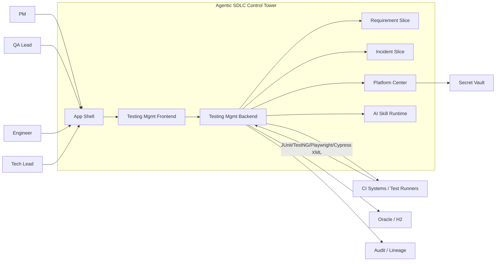
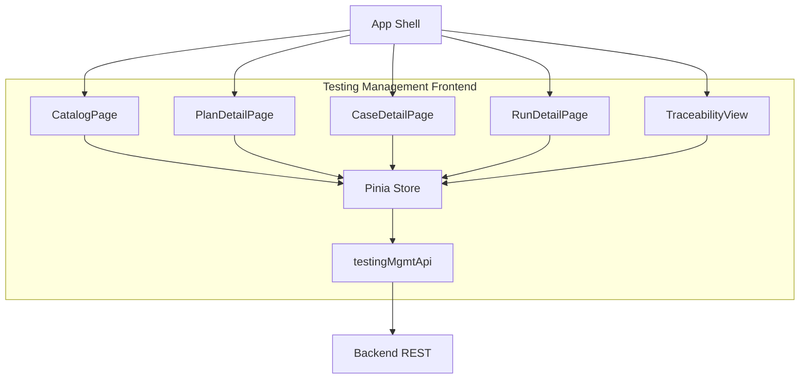
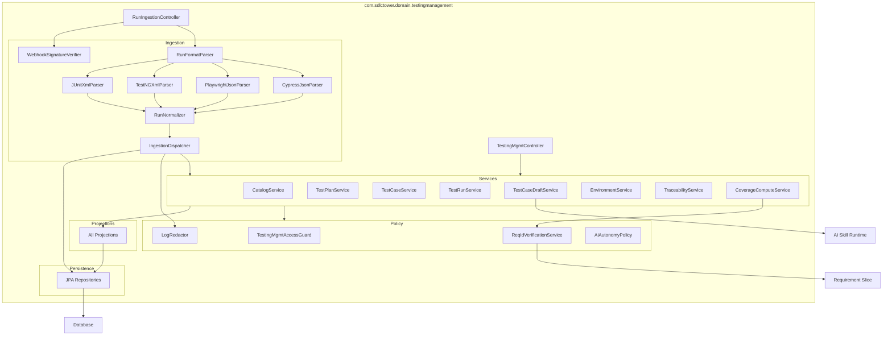
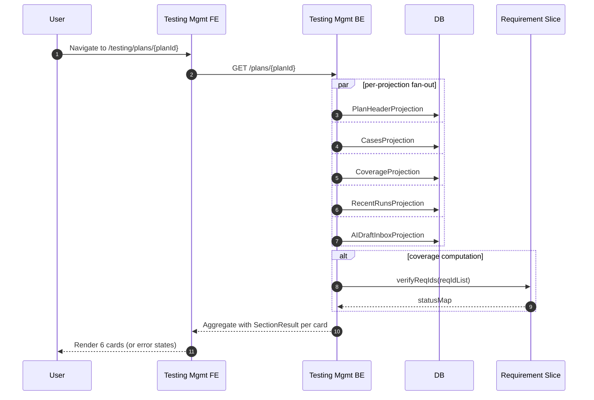
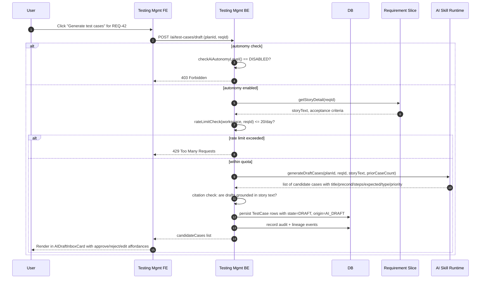
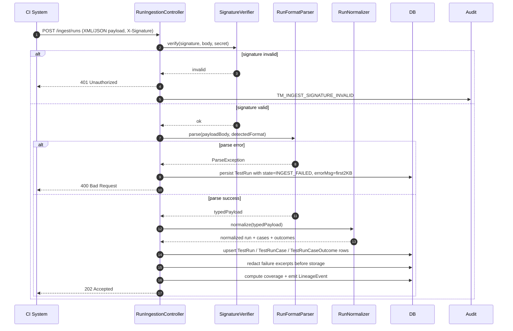
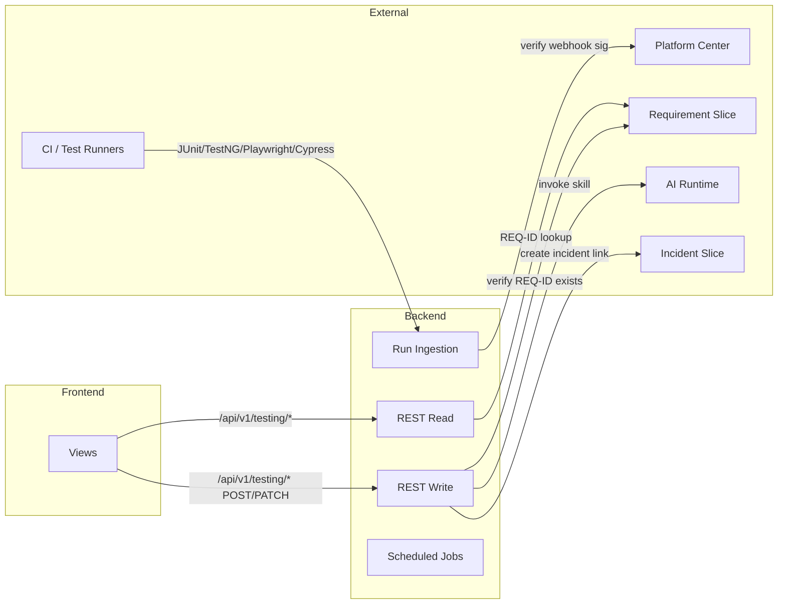

# Testing Management — Architecture

## 1. Purpose

This document describes the architecture of the **Testing Management** slice. V1 is a QA observability viewer for test plans, test cases, and test runs with coverage traceability to Requirements and human-approval-gated AI test-case generation from requirement text. The slice reads test results from external CI/test runners (JUnit, TestNG, Playwright, Cypress), links them back to requirements and incidents, and provides AI-assisted case generation and run analysis.

### Upstream references

- Requirements: [../01-requirements/testing-management-requirements.md](../01-requirements/testing-management-requirements.md)
- Stories: [../02-user-stories/testing-management-stories.md](../02-user-stories/testing-management-stories.md)
- Spec: [../03-spec/testing-management-spec.md](../03-spec/testing-management-spec.md)

## 2. System Context

Actors, systems, and stores relevant to the slice:



## 3. Component Breakdown — Frontend



Catalog Page mounts: `CatalogSummaryBarCard`, `CatalogGridCard`, `CatalogFilterBar`.

Plan Detail Page mounts: `PlanHeaderCard`, `CasesCard`, `CoverageCard`, `RecentRunsCard`, `AIDraftInboxCard`, `AIInsightsCard`.

Case Detail Page mounts: `CaseHeaderCard`, `CaseBodyCard`, `LinkedReqsCard`, `LinkedDefectsCard`, `RunOutcomesSparklineCard`.

Run Detail Page mounts: `RunHeaderCard`, `RunEnvironmentCard`, `RunOutcomeTableCard`, `StoriesCoveredCard`.

Traceability View mounts: `TraceabilityInputCard`, `TraceabilityResultsCard`.

## 4. Component Breakdown — Backend



## 5. Data Flow (High-level)

### 5a. User navigates to Plan Detail



### 5b. User invokes AI test-case generation from a REQ-ID



### 5c. QA Lead approves an AI-drafted case

```mermaid
sequenceDiagram
  autonumber
  participant QALead
  participant FE as Testing Mgmt FE
  participant BE as Testing Mgmt BE
  participant DB

  QALead->>FE: Click approve on draft case
  FE->>BE: POST /cases/{caseId}/approve-draft
  alt access control
    BE->>BE: isQALeadOrTechLead(user, plan.projectId)?
    alt not authorized
      BE-->>FE: 403 Forbidden
    else authorized
      BE->>DB: update TestCase.state = ACTIVE
      BE->>DB: insert AuditLog(actor=user, action=DRAFT_APPROVED, caseId, timestamp)
      BE->>DB: emit LineageEvent
      BE-->>FE: 200 OK
      FE-->>QALead: Toast "Case activated"; refresh draft inbox
    end
  end
```

### 5d. CI webhook sends test run results



## 6. State Boundaries

- **Frontend state (Pinia):** derived view aggregates per page, per-card status, active filters, pending AI draft operations. No raw test outputs, no credentials.
- **Backend state (DB):** canonical record of test plans, test cases, test runs, test outcomes, AI-drafted cases, environment registry, coverage projections, REQ-ID link status, audit trail, redacted failure excerpts (4 KB per case max).
- **Secret Vault (Platform Center):** Webhook signatures for external CI systems. Backend holds short-lived webhook-validation tokens; never persisted.
- **Requirement Slice (external):** source of truth for REQ-ID / Story-Id text and metadata. Testing slice reads and caches within request scope only (REQ-TM-91 P95 budget compliance).
- **Incident Slice (external):** target for deep-links when creating incidents from failed cases; inverse-linked via Incident's `testRunCaseId` foreign key.
- **Audit / Lineage stores:** cross-slice shared, append-only; Testing Management emits events for all writes.

## 7. Integration Boundary



## 8. Data Flow Highlights

### 8a. Run Ingestion Pipeline

Test runs arrive as XML (JUnit, TestNG) or JSON (Playwright, Cypress Mochawesome) from external CI systems. The `RunFormatParser` dispatches to the appropriate typed parser, which emits a normalized `TestRunPayload`. The `RunNormalizer` reconciles case outcomes against the plan's existing cases and computes coverage. Failure excerpts are redacted for secrets (REQ-TM-80) before storage. The `IngestionDispatcher` persists to DB and emits audit + lineage events (REQ-TM-82).

### 8b. Coverage Computation

Coverage is computed at three time-scales:
1. **Run-time:** when a run is ingested, the `CoverageComputeService` walks each case's linked REQ-IDs and updates the coverage projection.
2. **Plan Detail load:** the `CoverageCard` aggregates recent coverage status per REQ across all ACTIVE cases in the plan (REQ-TM-13).
3. **Requirement Slice inverse view:** an hourly job calls the Testing Management aggregate endpoint (`GET /aggregate/req/{reqId}/cases`) to feed back into Requirement's "Tests" tab (REQ-TM-42).

Coverage color is: `GREEN` (≥1 ACTIVE case passed in last 7d) → `AMBER` (mixed or stale >7d) → `RED` (failed or error) → `GREY` (no runs).

### 8c. AI Draft Lifecycle

When a QA Lead or Tech Lead invokes `POST /ai/test-cases/draft` for a REQ-ID:
1. Autonomy level is checked; if DISABLED, return 403 (REQ-TM-56).
2. Daily rate limit (20 drafts per REQ per workspace) is checked.
3. The REQ text is fetched from Requirement Slice.
4. The AI skill is invoked with the REQ text + prior case count for context.
5. Candidate cases are returned and persisted as `state=DRAFT, origin=AI_DRAFT`.
6. The user reviews in the AI Draft Inbox card: approve (→ ACTIVE), reject (→ DEPRECATED), or edit-then-approve.
7. Approval is gated to QA Lead / Tech Lead only (REQ-TM-53, REQ-TM-56).

Drafts are keyed by `(reqId, skillVersion, planId)` so skill version upgrades surface stale drafts with a STALE badge (REQ-TM-55).

### 8d. Deep-link Formation

- **Case → Incident:** from Run Detail, a failed case includes a "Open Incident" button that deep-links to Incident slice with query params: `?testRunCaseId={caseId}&runId={runId}&environment={env}&failureExcerpt={excerpt}` (REQ-TM-31).
- **Case → Requirement:** from Case Detail, linked REQ chips deep-link to Requirement slice Story Detail.
- **Run → Plan:** Run Detail shows the plan name as a linked breadcrumb.
- **Coverage → Requirement:** from Plan Detail Coverage card, each REQ-ID chip links to the Requirement Slice inverse view scoped to that story (REQ-TM-42).

## 9. Non-functional Constraints

- P95 aggregate latency: Catalog ≤1200ms (REQ-TM-92); Plan Detail ≤1500ms; Case Detail ≤1500ms; Run Detail ≤1500ms.
- Per-card timeout: 500ms with `SectionResult` fallback for individual card failure (REQ-TM-70, REQ-TM-18).
- Run ingestion SLO: webhook result visible in UI within 30s at P95.
- Failure excerpt cap: 4 KB per case after redaction (REQ-TM-30, REQ-TM-80).
- AI draft rate limit: 20 drafts per REQ per workspace per day (REQ-TM-58).
- Coverage update latency: within 30s at P95 when a case's linked REQs change (REQ-TM-26).
- No single webhook can block the request path; heavy work is handed off to `IngestionDispatcher` via in-process queue (Spring `@Async`).
- JavaScript bundle size: no card shall ship >300 KB gzipped on critical path (REQ-TM-93).

## 10. Security Posture

- **Webhook signature:** HMAC-SHA256 verified on every run ingestion request; invalid → 401 + audit (REQ-TM-85).
- **Credential redaction:** CI logs, environment variables, and common secret patterns (AWS keys, GitHub tokens, Bearer tokens) are redacted before storage and before AI prompt construction (REQ-TM-80, REQ-TM-81).
- **REQ-ID verification:** AI draft invocation validates that the REQ-ID exists in Requirement Slice and is visible to the workspace before invoking the AI skill (REQ-TM-43).
- **Access control:** plan creation / approval / editing is gated to QA Lead, Tech Lead, and PM roles per workspace membership (REQ-TM-83).
- **AI autonomy:** AI never transitions a DRAFT case to ACTIVE directly; human approval is always required, regardless of autonomy level (REQ-TM-56).
- **Audit trail:** every run ingestion, AI invocation, and case state transition is logged with actor + timestamp (REQ-TM-82, REQ-TM-84).
- **Workspace isolation:** plans attached to a project the user does not belong to are filtered out (REQ-TM-06).

## 11. Risks and Mitigations

| Risk | Mitigation |
|------|-----------|
| Ingestion storm from CI pushes in large monorepo | Async `IngestionDispatcher` queue with bounded concurrency + per-workspace backpressure; UI banner if queue is backing up |
| Large failure excerpts bloat DB | Cap per-case excerpt at 4 KB; virtualize rendering on Run Detail; redaction runs first to shrink payload |
| AI draft endpoint abused by user | Rate limit 20 per REQ per workspace per day; UI surfaces remaining quota |
| REQ-ID lookup cascades latency | Batch verify calls to Requirement Slice; cache within request scope only; fallback to `UNVERIFIED` chip if lookup times out (REQ-TM-73) |
| Secret leaks in failure excerpts | Redactor runs on ingestion AND before AI prompt construction; deny-list covers AWS, GitHub, generic Bearer patterns |
| Webhook signature secret rotated, old runs leak | Secrets managed in Platform Center vault; incoming signature verified against current secret only; old-signed payloads from CI are rejected with 401 and audited |
| Run re-ingestion with same `externalRunId` | Duplicate detected; 409 returned unless `force=true` (admin-only); prior run is superseded and audit trail preserved (REQ-TM-33) |
| AI draft skill hallucination | Drafts are audited and have to be manually approved; human QA Lead / Tech Lead reviews the generated content before activation |
| Coverage computation is stale | Projections are recomputed on every run ingestion and on a 1h refresh schedule; Plan Detail always shows computed coverage as of last load |
| Unreachable REQ-IDs (story deleted in Requirement Slice) | Links persist with `status=UNKNOWN_REQ`; hourly resolver job retries them (REQ-TM-43); UI shows AMBER/UNVERIFIED chips for unresolved links (REQ-TM-73) |

## 12. Decisions

Mirrors the spec's decision list (D1–D9) plus architecture-specific choices:

- **D10** — Run ingestion is synchronous for signature verification + format detection only; parsing, normalizing, and persistence are handed off to `IngestionDispatcher` via in-process queue (Spring `@Async` + bounded thread pool) backed by a persistent outbox table for durability across restarts.
- **D11** — Parsers are pluggable: abstract `RunFormatParser` with implementations for JUnit, TestNG, Playwright, and Cypress. New formats can be added without modifying controller logic.
- **D12** — Coverage projections are precomputed at run-ingestion time, not at query time. Rationale: avoids re-aggregating case outcomes on every Catalog / Plan Detail load; maintains P95 budget.
- **D13** — AI drafts are persisted as TestCase rows with `state=DRAFT` and `origin=AI_DRAFT`. Rationale: preserves audit trail and allows case operations (revisions, edits) to apply before approval.
- **D14** — REQ-ID link verification is deferred to request time (on Plan Detail load, Coverage card, and Run Detail Stories card). Rationale: allows Requirement Slice to evolve stories without requiring retroactive REQ-link updates; fallback to UNVERIFIED is graceful.
- **D15** — Failure excerpts are stored after redaction in TestRunCaseOutcome rows; full run logs are not persisted. Rationale: reduces DB footprint and surfaces secrets early; CI systems retain full logs.
- **D16** — AI drafts are immutable once created; edits capture revisions (actor, timestamp, field diff) but do not mutate the original draft row. Rationale: maintains audit trail and allows comparison of original vs. edited versions.

## 13. Future Extension Points

These capabilities are **out of scope for V1** but are flagged as natural extensions for V1.1+:

- **CI build linkage:** link test runs to the triggering Code & Build run for full SDLC traceability. Requires integration with Code & Build slice's Run entities.
- **Auto-triage and incident clustering:** use AI to analyze failure clusters and auto-open incidents or suggest grouping by root cause. Requires AI risk-prioritization skill and Incident slice mutation APIs.
- **Coverage-gap AI:** recommend new test cases based on covered vs. uncovered REQ-IDs; suggest priorities based on change frequency and risk. Deferred pending AI planning-skill maturity.
- **AI test-case auto-healing:** detect broken steps and auto-generate repair suggestions. Requires AI step-repair skill and careful human-in-the-loop gating.
- **Flaky-case detection:** track case pass rate over recent runs; flag cases that pass/fail inconsistently. Requires statistical aggregation and a flakiness classifier skill.
- **Cross-workspace analytics:** dashboard aggregating plan health, coverage, and run trends across multiple workspaces. Requires performance optimization and multi-tenant policy refinement.

## 14. Glossary

See the spec's glossary (§10). Architecture adds:

- **Run Normalizer** — component that reconciles parsed test outcomes against a plan's existing cases and computes coverage.
- **Coverage Projection** — precomputed view of REQ-ID coverage status per plan, updated on every run ingestion.
- **Ingestion Dispatcher** — in-process async component that persists parsed runs to DB and emits audit/lineage events.
- **Outbox** — DB-backed persistent queue used by the async dispatcher to survive restarts.
- **Draft Lifecycle** — sequence of states (DRAFT → ACTIVE or DEPRECATED) for AI-generated test cases with approval gate.
- **Failure Excerpt** — the first 4 KB of a failed assertion / error message, redacted before storage.
- **REQ-ID Link Status** — one of: `VERIFIED` (REQ exists and is visible), `UNKNOWN_REQ` (REQ not found or not visible), `UNVERIFIED` (lookup timed out or failed).
