# Testing Management — Data Flow

Runtime sequences, state machines, error cascade, and refresh strategy for the Testing Management slice. Operationalizes [testing-management-architecture.md](testing-management-architecture.md) and the contracts in [../05-design/contracts/testing-management-API_IMPLEMENTATION_GUIDE.md](../05-design/contracts/testing-management-API_IMPLEMENTATION_GUIDE.md).

## 1. Catalog Page Load (Phase A — mocks)

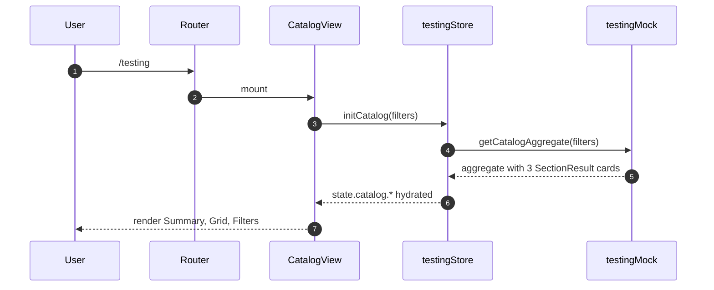

## 2. Catalog Page Load (Phase B — backend)

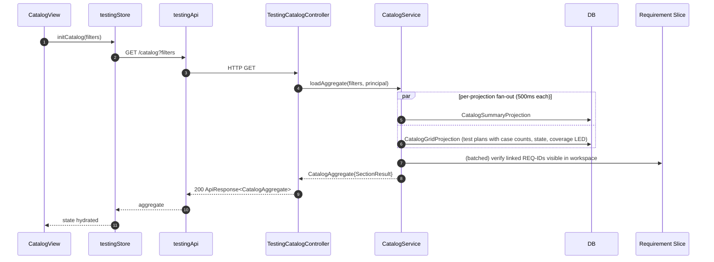

## 3. Plan Detail Page Load

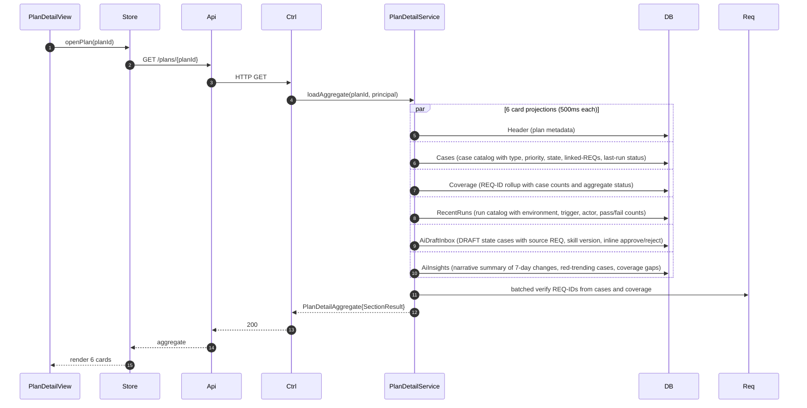

## 4. Run Detail Page Load

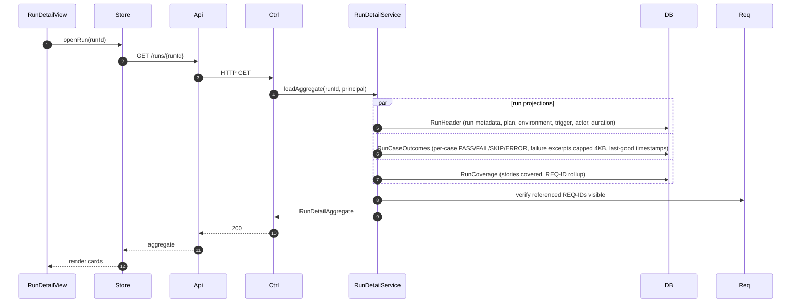

## 5. Run Ingestion via Webhook

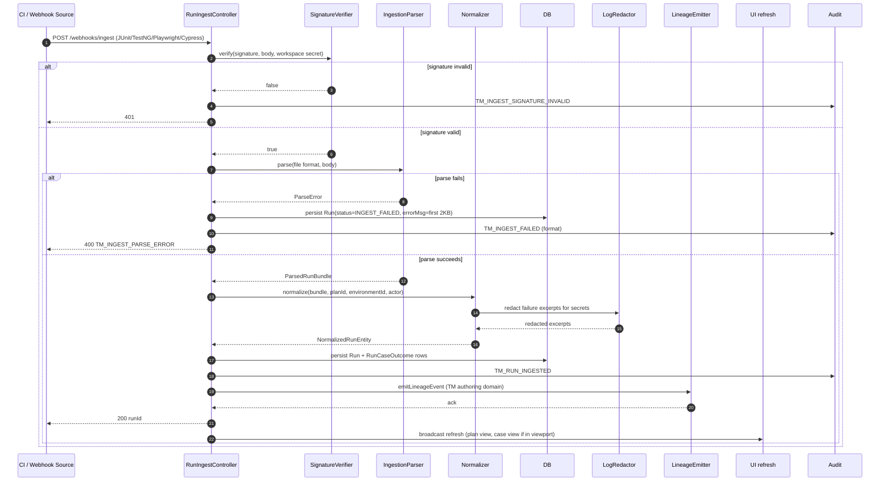

## 6. AI Draft Generation + Approval Workflow

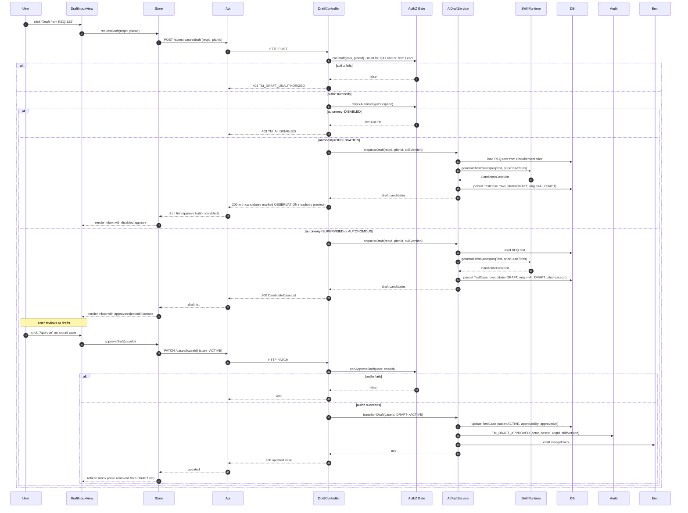

## 7. REQ Linkage Verification

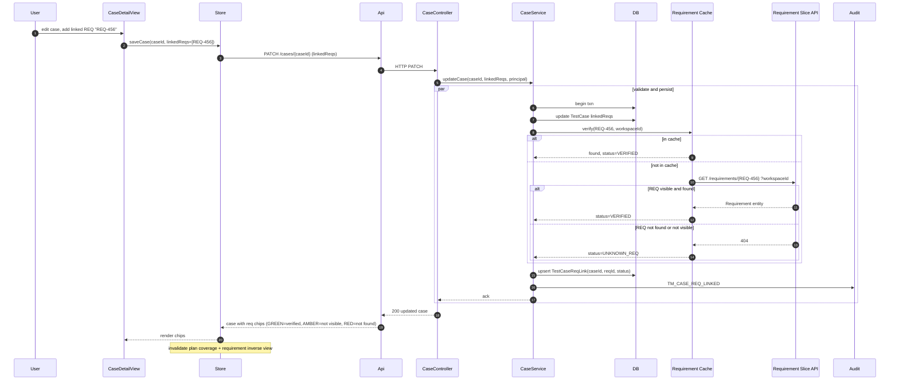

## 8. Case Detail Deep-Link with REQ Traceability

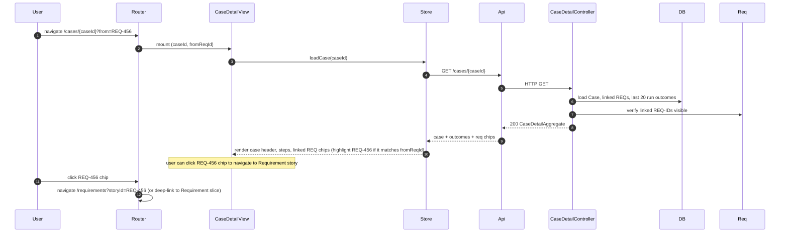

## 9. Requirement Slice Tests Tab Callback

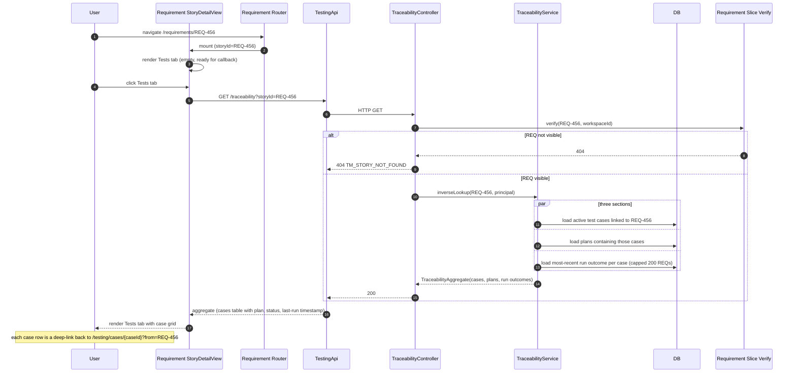

## 10. State Machines

### 10.1 TestPlan

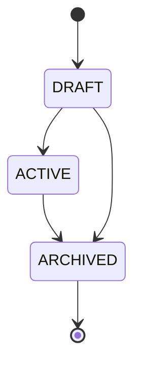

DRAFT plans do not accept run ingestion. ARCHIVED plans are read-only and do not accept new runs or case edits.

### 10.2 TestCase

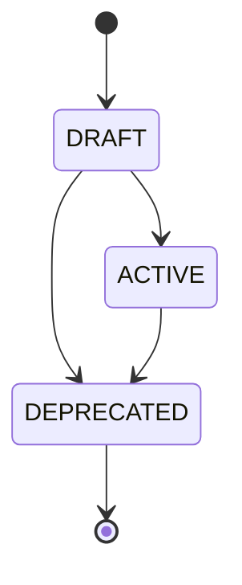

DRAFT = AI-drafted, pending approval. ACTIVE = executable and counted in coverage. DEPRECATED = hidden from active views but retained for audit. State transitions are gated by role (QA Lead / Tech Lead for approval).

### 10.3 TestRun

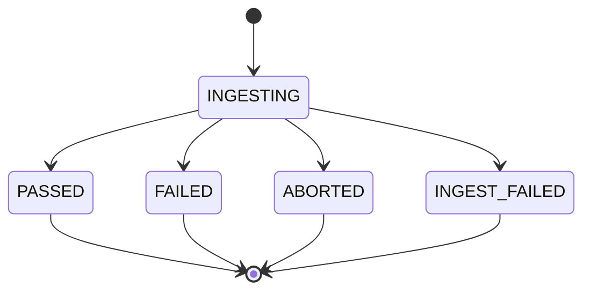

INGESTING = webhook/upload in progress. PASSED = all cases passed. FAILED = at least one case failed. ABORTED = run was cancelled. INGEST_FAILED = parse/validation failure (immutable; operator must re-upload). Runs are immutable once terminal; re-ingestion with same `externalRunId` is a 409 conflict unless `force=true` (admin override).

### 10.4 AI Draft Lifecycle

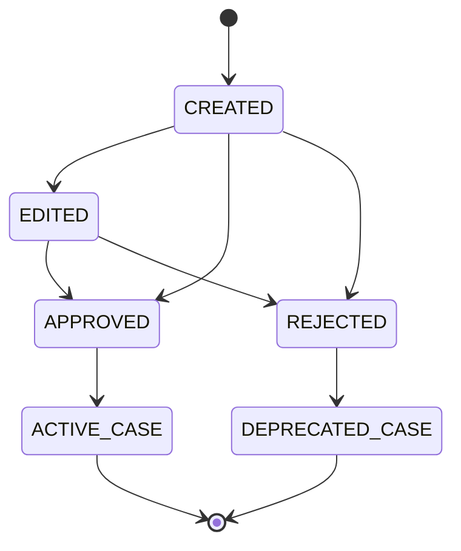

CREATED = AI skill generated candidates. EDITED = human reviewer made changes before approval. APPROVED = reviewer approved; transitions TestCase.state to ACTIVE. REJECTED = reviewer rejected; transitions TestCase.state to DEPRECATED with reason=REJECTED_AT_INBOX. STALE drafts (skill version bump) retain their state but render with STALE badge.

## 11. Error Cascade and Per-Card Isolation

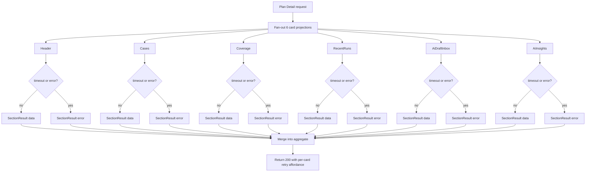

Page-level errors are reserved for `TM_PLAN_NOT_FOUND`, `TM_RUN_NOT_FOUND`, `TM_CASE_NOT_FOUND`. Everything else (projection timeout, requirement slice unavailable, AI unavailable) degrades per card with per-section retry button. Each card independently re-requests only its projection.

### 11.1 Per-Section Retry Flow

When a card error occurs (e.g., Coverage card timeout), the user clicks "Retry" on that card. The frontend re-requests only that card's endpoint, passing the card identifier. The backend re-executes only that projection (e.g., `CoverageProjection`) without re-executing Header, Cases, etc. This minimizes latency and avoids thundering herd on Requirement slice lookup.

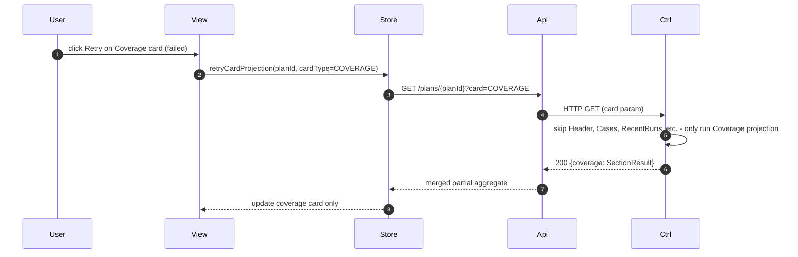

## 12. Refresh Strategy

- **Page focus regain** — refresh "stale" cards (AI Insights, Recent Runs) if last load >60s ago (REQ-TM-92 P95 budget).
- **Run ingestion webhook** — emits LineageEvent that propagates to open Plan Detail / Run Detail views via Websocket (V1.1 candidate). V1 relies on manual refresh or navigation.
- **Manual refresh** — each card exposes a refresh icon that re-requests only that card (per-section retry flow in §11.1).
- **Case state change** — when a case transitions DRAFT→ACTIVE (approval) or ACTIVE→DEPRECATED (rejection), invalidate Plan Coverage and Requirement inverse views; refresh within 30s at P95 (REQ-TM-26).
- **REQ linkage change** — when TestCaseReqLink rows are added/removed, invalidate Plan Coverage and Requirement inverse views.
- **AI skill version bump** — when a skill version advances, mark prior drafts with `skillVersion < current` as STALE; render STALE badge and "re-draft" action.

## 13. API Client Chain

The frontend API client for Testing Management (`testingApi`) applies:

1. **Authorization token** — bearer token from auth store (via shared auth interceptor)
2. **Workspace header** — `X-Workspace-Id` from shared context
3. **Projection timeout** — per-projection 500ms timeout with `SectionResult` fallback; if a projection exceeds 500ms, the section returns `{status: TIMEOUT, data: null, error: "Projection timed out"}` and the UI renders the timeout state with retry
4. **Error codec** — errors are wrapped in `ApiResponse<T>` with error code (e.g., `TM_PLAN_NOT_FOUND`, `TM_INGEST_PARSE_ERROR`) and user-facing message
5. **Correlation id** — every request propagates `X-Correlation-Id` from frontend (or generated by backend) for end-to-end traceability
6. **Retry policy** — non-idempotent writes (POST, PATCH) do not auto-retry; read operations (GET) retry once on network error with exponential backoff; per-card retries are user-driven (Retry button)

## 14. Observability

Every backend call is traced with a correlation id. Run ingestion and AI draft generation generate their own correlation ids and tag them with:
- Run ingestion: workspace id, external run id, format type (JUnit/Playwright/etc.), ingestion trigger (webhook vs. manual upload), parse success/failure
- AI draft generation: workspace id, req id, skill version, autonomy level, draft success/failure, candidate count
- Case state transitions: workspace id, plan id, case id, actor, from/to state, audit trail

Metrics exported: P95 load latency by page and card, error rate by error code (per-card vs. page-level), REQ lookup cache hit rate, AI draft generation rate and success rate, run ingestion parse failure rate.

## 15. Open Questions (tracked, not blocking)

- Should REQ linkage verification cache be distributed (Redis) or local (Caffeine)? Default: Caffeine with 15-min TTL per workspace + 5-min lazy refresh (V1.1 refinement).
- Should per-section retry auto-trigger on specific transient errors (e.g., Requirement slice 503)? Default: no in V1; user-driven retry button. V1.1 candidate: auto-retry with exponential backoff, capped at 2 retries.
- Should run ingestion webhook support async/eventual consistency (enqueue → process later) vs. sync processing? Default: sync within 30s (REQ-TM-92 budget); V1.1 candidate: async with polling for long-running formats.
