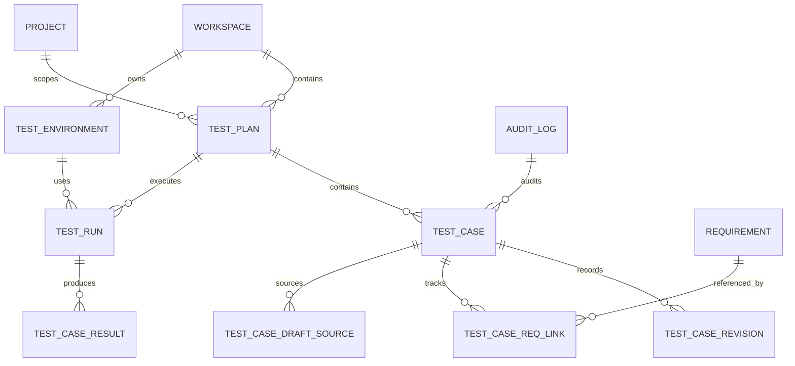

# Testing Management — Data Model

## 1. Scope

This document defines the canonical data model of the Testing Management slice: the domain-level ER diagram, frontend TypeScript types, backend Java DTOs and JPA entities, Flyway schema DDL (migrations `V37__…V39__`), and the frontend↔backend type mapping. Net-new tables only — upstream Workspace, Project, Member, and Story (Requirement) come from their respective slices via facades.

### Upstream references

- Requirements: [../01-requirements/testing-management-requirements.md](../01-requirements/testing-management-requirements.md)
- Spec: [../03-spec/testing-management-spec.md](../03-spec/testing-management-spec.md)
- Architecture: [testing-management-architecture.md](testing-management-architecture.md)
- Data flow: [testing-management-data-flow.md](testing-management-data-flow.md)

## 2. Domain Model

### 2.1 ER diagram



### 2.2 Enumerations

- **TestCaseType:** `FUNCTIONAL` | `REGRESSION` | `SMOKE` | `PERF` | `SECURITY`
- **TestCasePriority:** `P0` | `P1` | `P2` | `P3`
- **TestCaseState:** `ACTIVE` | `DRAFT` | `DEPRECATED`
- **TestRunState:** `RUNNING` | `PASSED` | `FAILED` | `ABORTED` | `INGEST_FAILED`
- **TestResultOutcome:** `PASS` | `FAIL` | `SKIP` | `ERROR`
- **TestEnvironmentKind:** `DEV` | `STAGING` | `PROD` | `EPHEMERAL` | `OTHER`
- **TestPlanState:** `DRAFT` | `ACTIVE` | `ARCHIVED`
- **AiDraftOrigin:** `AI_DRAFT` | `MANUAL` | `IMPORTED`
- **TestCaseReqLinkStatus:** `VERIFIED` | `UNKNOWN_REQ` | `UNVERIFIED`

## 3. Frontend Types (TypeScript)

Organized under `frontend/src/features/testing-management/types/`.

### `enums.ts`

```ts
export type TestCaseType = 'FUNCTIONAL' | 'REGRESSION' | 'SMOKE' | 'PERF' | 'SECURITY';
export type TestCasePriority = 'P0' | 'P1' | 'P2' | 'P3';
export type TestCaseState = 'ACTIVE' | 'DRAFT' | 'DEPRECATED';
export type TestRunState = 'RUNNING' | 'PASSED' | 'FAILED' | 'ABORTED' | 'INGEST_FAILED';
export type TestResultOutcome = 'PASS' | 'FAIL' | 'SKIP' | 'ERROR';
export type TestEnvironmentKind = 'DEV' | 'STAGING' | 'PROD' | 'EPHEMERAL' | 'OTHER';
export type TestPlanState = 'DRAFT' | 'ACTIVE' | 'ARCHIVED';
export type AiDraftOrigin = 'AI_DRAFT' | 'MANUAL' | 'IMPORTED';
export type CoverageLed = 'GREEN' | 'AMBER' | 'RED' | 'GREY';
```

### `catalog.ts`

```ts
export interface CatalogSummary {
  totalPlans: number;
  totalActiveCases: number;
  runsLast7d: number;
  passRate7d: number;            // 0..1
  meanRunDurationSec: number;
  byLed: Record<CoverageLed, number>;
}

export interface CatalogPlanTile {
  planId: string;
  name: string;
  projectId: string;
  workspaceId: string;
  releaseTarget?: string;
  owner: string;
  state: TestPlanState;
  linkedCaseCount: number;
  coverageLed: CoverageLed;
  description?: string;
  createdAt: string;
}

export interface CatalogSection {
  projectId: string;
  projectName: string;
  plans: CatalogPlanTile[];
}

export interface CatalogAggregate {
  summary: SectionResult<CatalogSummary>;
  grid: SectionResult<CatalogSection[]>;
  filtersEcho: CatalogFilters;
}
```

### `plan.ts`

```ts
export interface TestPlanHeader {
  planId: string;
  name: string;
  description?: string;
  projectId: string;
  workspaceId: string;
  owner: string;
  state: TestPlanState;
  releaseTarget?: string;
  createdAt: string;
  updatedAt: string;
}

export interface TestCaseRow {
  caseId: string;
  title: string;
  type: TestCaseType;
  priority: TestCasePriority;
  state: TestCaseState;
  linkedReqs: StoryChip[];
  lastRunStatus?: TestResultOutcome;
  lastRunAt?: string;
}

export interface CoverageRow {
  reqId: string;
  caseCount: number;
  aggregateStatus: 'PASS' | 'FAIL' | 'MIXED' | 'NOT_RUN';
}

export interface RecentRunRow {
  runId: string;
  environment: string;
  triggerSource: 'MANUAL_UPLOAD' | 'CI_WEBHOOK';
  state: TestRunState;
  durationSec?: number;
  passCount: number;
  failCount: number;
  skipCount: number;
  actor: string;
  createdAt: string;
}

export interface AiDraftRow {
  caseId: string;
  title: string;
  sourceReqId: string;
  skillVersion: string;
  draftedAt: string;
  isDraft: boolean;
}

export interface PlanDetailAggregate {
  header: SectionResult<TestPlanHeader>;
  cases: SectionResult<TestCaseRow[]>;
  coverage: SectionResult<CoverageRow[]>;
  recentRuns: SectionResult<RecentRunRow[]>;
  aiDrafts: SectionResult<AiDraftRow[]>;
}
```

### `case.ts`

```ts
export interface TestCaseDetail {
  caseId: string;
  planId: string;
  title: string;
  type: TestCaseType;
  priority: TestCasePriority;
  state: TestCaseState;
  owner: string;
  preconditions: string;        // markdown
  steps: string;                 // ordered markdown list
  expectedResult: string;        // markdown
  linkedReqs: StoryChip[];
  linkedIncidents: IncidentChip[];
  draftOrigin?: AiDraftOrigin;
  createdAt: string;
  updatedAt: string;
}

export interface CaseResultRow {
  resultId: string;
  runId: string;
  outcome: TestResultOutcome;
  failureExcerpt?: string;       // max 4 KB
  lastPassedAt?: string;
  environment: string;
  createdAt: string;
}

export interface CaseRevisionRow {
  revisionId: string;
  actor: string;
  timestamp: string;
  fieldDiff: Record<string, { before: string; after: string }>;
}

export interface CaseDetailAggregate {
  detail: SectionResult<TestCaseDetail>;
  recentResults: SectionResult<CaseResultRow[]>;
  revisions: SectionResult<CaseRevisionRow[]>;
}
```

### `run.ts`

```ts
export interface TestRunHeader {
  runId: string;
  planId: string;
  environment: string;
  triggerSource: 'MANUAL_UPLOAD' | 'CI_WEBHOOK';
  actor: string;
  state: TestRunState;
  externalRunId?: string;
  durationSec?: number;
  startedAt: string;
  completedAt?: string;
}

export interface CaseOutcomeRow {
  caseId: string;
  title: string;
  outcome: TestResultOutcome;
  failureExcerpt?: string;
  lastPassedAt?: string;
}

export interface RunDetailAggregate {
  header: SectionResult<TestRunHeader>;
  outcomes: SectionResult<CaseOutcomeRow[]>;
  storiesCovered: SectionResult<StoryChip[]>;
}
```

### `traceability.ts`

```ts
export interface StoryChip {
  reqId: string;
  status: 'VERIFIED' | 'UNVERIFIED' | 'UNKNOWN_REQ';
  title?: string;                // only when VERIFIED
  projectId?: string;
}

export interface TraceabilityCaseRow {
  caseId: string;
  title: string;
  planId: string;
  planName: string;
  lastRunStatus?: TestResultOutcome;
  lastRunAt?: string;
}

export interface TraceabilityAggregate {
  reqChip: StoryChip;
  cases: SectionResult<TraceabilityCaseRow[]>;
}
```

### `aggregate.ts`

```ts
export interface TestingManagementState {
  catalog: CatalogAggregate | null;
  activePlanId: string | null;
  planDetail: PlanDetailAggregate | null;
  activeCaseId: string | null;
  caseDetail: CaseDetailAggregate | null;
  activeRunId: string | null;
  runDetail: RunDetailAggregate | null;
  activeReqId: string | null;
  traceability: TraceabilityAggregate | null;
  loading: Record<string, boolean>;
  errors: Record<string, { code: string; message: string } | null>;
}
```

## 4. Backend DTOs (Java records)

Package `com.sdlctower.domain.testingmanagement.dto`.

```java
public record CatalogSummaryDto(
    long totalPlans, long totalActiveCases, long runsLast7d,
    double passRate7d, long meanRunDurationSec,
    Map<CoverageLed, Long> byLed) {}

public record CatalogPlanTileDto(
    String planId, String name, String projectId, String workspaceId,
    String releaseTarget, String owner, TestPlanState state,
    long linkedCaseCount, CoverageLed coverageLed, String description,
    Instant createdAt) {}

public record CatalogSectionDto(String projectId, String projectName, List<CatalogPlanTileDto> plans) {}

public record CatalogAggregateDto(
    SectionResultDto<CatalogSummaryDto> summary,
    SectionResultDto<List<CatalogSectionDto>> grid,
    CatalogFiltersDto filtersEcho) {}

public record TestPlanHeaderDto(
    String planId, String name, String description, String projectId,
    String workspaceId, String owner, TestPlanState state,
    String releaseTarget, Instant createdAt, Instant updatedAt) {}

public record TestCaseRowDto(
    String caseId, String title, TestCaseType type,
    TestCasePriority priority, TestCaseState state,
    List<StoryChipDto> linkedReqs, TestResultOutcome lastRunStatus,
    Instant lastRunAt) {}

public record CoverageRowDto(
    String reqId, long caseCount, String aggregateStatus) {}

public record RecentRunRowDto(
    String runId, String environment, String triggerSource,
    TestRunState state, Long durationSec,
    long passCount, long failCount, long skipCount,
    String actor, Instant createdAt) {}

public record AiDraftRowDto(
    String caseId, String title, String sourceReqId,
    String skillVersion, Instant draftedAt) {}

public record PlanDetailAggregateDto(
    SectionResultDto<TestPlanHeaderDto> header,
    SectionResultDto<List<TestCaseRowDto>> cases,
    SectionResultDto<List<CoverageRowDto>> coverage,
    SectionResultDto<List<RecentRunRowDto>> recentRuns,
    SectionResultDto<List<AiDraftRowDto>> aiDrafts) {}

public record TestCaseDetailDto(
    String caseId, String planId, String title, TestCaseType type,
    TestCasePriority priority, TestCaseState state, String owner,
    String preconditions, String steps, String expectedResult,
    List<StoryChipDto> linkedReqs, List<IncidentChipDto> linkedIncidents,
    AiDraftOrigin draftOrigin, Instant createdAt, Instant updatedAt) {}

public record CaseResultRowDto(
    String resultId, String runId, TestResultOutcome outcome,
    String failureExcerpt, Instant lastPassedAt,
    String environment, Instant createdAt) {}

public record CaseRevisionRowDto(
    String revisionId, String actor, Instant timestamp,
    Map<String, FieldDiffDto> fieldDiff) {}

public record CaseDetailAggregateDto(
    SectionResultDto<TestCaseDetailDto> detail,
    SectionResultDto<List<CaseResultRowDto>> recentResults,
    SectionResultDto<List<CaseRevisionRowDto>> revisions) {}

public record TestRunHeaderDto(
    String runId, String planId, String environment, String triggerSource,
    String actor, TestRunState state, String externalRunId,
    Long durationSec, Instant startedAt, Instant completedAt) {}

public record CaseOutcomeRowDto(
    String caseId, String title, TestResultOutcome outcome,
    String failureExcerpt, Instant lastPassedAt) {}

public record RunDetailAggregateDto(
    SectionResultDto<TestRunHeaderDto> header,
    SectionResultDto<List<CaseOutcomeRowDto>> outcomes,
    SectionResultDto<List<StoryChipDto>> storiesCovered) {}

public record StoryChipDto(String reqId, String status, String title, String projectId) {}

public record TraceabilityCaseRowDto(
    String caseId, String title, String planId, String planName,
    TestResultOutcome lastRunStatus, Instant lastRunAt) {}

public record TraceabilityAggregateDto(
    StoryChipDto reqChip,
    SectionResultDto<List<TraceabilityCaseRowDto>> cases) {}
```

## 5. JPA Entities

Package `com.sdlctower.domain.testingmanagement.persistence`. Representative fields only — each entity carries `createdAt`, `updatedAt`, and `@Version` where optimistic locking applies (TestPlan, TestCase, TestRun).

```java
@Entity @Table(name = "test_plan", indexes = {
    @Index(name="idx_plan_project", columnList="project_id"),
    @Index(name="idx_plan_workspace", columnList="workspace_id"),
    @Index(name="idx_plan_state", columnList="state")
})
public class TestPlanEntity {
  @Id String id;
  String name; @Column(length = 2000) String description;
  String projectId; String workspaceId; String owner;
  @Enumerated(EnumType.STRING) TestPlanState state;
  String releaseTarget; Instant createdAt; Instant updatedAt; Long version;
}

@Entity @Table(name = "test_case", indexes = {
    @Index(name="idx_case_plan_state", columnList="plan_id,state"),
    @Index(name="idx_case_state", columnList="state")
}, uniqueConstraints = @UniqueConstraint(columnNames = {"plan_id","title"}))
public class TestCaseEntity {
  @Id String id; String planId;
  String title; @Enumerated(EnumType.STRING) TestCaseType type;
  @Enumerated(EnumType.STRING) TestCasePriority priority;
  @Enumerated(EnumType.STRING) TestCaseState state;
  String owner; @Column(columnDefinition="CLOB") String preconditions;
  @Column(columnDefinition="CLOB") String steps;
  @Column(columnDefinition="CLOB") String expectedResult;
  @Enumerated(EnumType.STRING) AiDraftOrigin origin;
  String deprecationReason; Instant createdAt; Instant updatedAt; Long version;
}

@Entity @Table(name = "test_case_revision", indexes = {
    @Index(name="idx_revision_case", columnList="case_id"),
    @Index(name="idx_revision_created", columnList="created_at DESC")
})
public class TestCaseRevisionEntity {
  @Id String id; String caseId; String actor;
  @Column(columnDefinition="CLOB") String fieldDiffJson;
  Instant createdAt;
}

@Entity @Table(name = "test_case_req_link", indexes = {
    @Index(name="idx_link_req_id", columnList="req_id"),
    @Index(name="idx_link_case", columnList="case_id")
}, uniqueConstraints = @UniqueConstraint(columnNames = {"case_id","req_id"}))
public class TestCaseReqLinkEntity {
  @Id String id; String caseId; String reqId;
  @Enumerated(EnumType.STRING) TestCaseReqLinkStatus status;
  Instant createdAt; Instant resolvedAt;
}

@Entity @Table(name = "test_environment", indexes = {
    @Index(name="idx_env_workspace", columnList="workspace_id")
}, uniqueConstraints = @UniqueConstraint(columnNames = {"workspace_id","name"}))
public class TestEnvironmentEntity {
  @Id String id; String workspaceId; String name;
  @Column(length = 1000) String description;
  @Enumerated(EnumType.STRING) TestEnvironmentKind kind;
  String url; boolean archived; Instant createdAt; Instant updatedAt;
}

@Entity @Table(name = "test_run", indexes = {
    @Index(name="idx_run_plan_started", columnList="plan_id, started_at DESC"),
    @Index(name="idx_run_state", columnList="state")
}, uniqueConstraints = @UniqueConstraint(columnNames = {"plan_id","external_run_id"}))
public class TestRunEntity {
  @Id String id; String planId; String environmentId; String actor;
  @Enumerated(EnumType.STRING) TestRunState state;
  String triggerSource; String externalRunId;
  long passCount; long failCount; long skipCount;
  Long durationSec; Instant startedAt; Instant completedAt;
  String ingestErrorExcerpt; Instant createdAt; Instant updatedAt; Long version;
}

@Entity @Table(name = "test_case_result", indexes = {
    @Index(name="idx_result_run_outcome", columnList="run_id,outcome"),
    @Index(name="idx_result_case", columnList="case_id")
}, uniqueConstraints = @UniqueConstraint(columnNames = {"run_id","case_id"}))
public class TestCaseResultEntity {
  @Id String id; String runId; String caseId;
  @Enumerated(EnumType.STRING) TestResultOutcome outcome;
  @Column(columnDefinition="CLOB") String failureExcerpt;  // max 4 KB redacted
  Instant lastPassedAt; Instant createdAt;
}

@Entity @Table(name = "test_case_draft_source", indexes = {
    @Index(name="idx_draft_case", columnList="case_id")
}, uniqueConstraints = @UniqueConstraint(columnNames = {"case_id"}))
public class TestCaseDraftSourceEntity {
  @Id String id; String caseId; String sourceReqId;
  String skillVersion; @Column(columnDefinition="CLOB") String sourceExcerpt;
  Instant createdAt;
}
```

## 6. Flyway DDL

Authoritative migrations for V1. Authored for Oracle SQL (locally H2 in Oracle-mode); H2 DDL is drop-in compatible.

### `V37__create_test_plan_and_case.sql`

```sql
CREATE TABLE test_plan (
  id                VARCHAR2(64) PRIMARY KEY,
  name              VARCHAR2(255) NOT NULL,
  description       CLOB,
  project_id        VARCHAR2(64) NOT NULL,
  workspace_id      VARCHAR2(64) NOT NULL,
  owner             VARCHAR2(255) NOT NULL,
  state             VARCHAR2(16) NOT NULL,
  release_target    VARCHAR2(255),
  created_at        TIMESTAMP WITH TIME ZONE NOT NULL,
  updated_at        TIMESTAMP WITH TIME ZONE NOT NULL,
  version           NUMBER(19) DEFAULT 1
);
CREATE INDEX idx_plan_project ON test_plan(project_id);
CREATE INDEX idx_plan_workspace ON test_plan(workspace_id);
CREATE INDEX idx_plan_state ON test_plan(state);

CREATE TABLE test_case (
  id                VARCHAR2(64) PRIMARY KEY,
  plan_id           VARCHAR2(64) NOT NULL REFERENCES test_plan(id),
  title             VARCHAR2(512) NOT NULL,
  type              VARCHAR2(16) NOT NULL,
  priority          VARCHAR2(2) NOT NULL,
  state             VARCHAR2(16) NOT NULL,
  owner             VARCHAR2(255),
  preconditions     CLOB,
  steps             CLOB,
  expected_result   CLOB,
  origin            VARCHAR2(16) NOT NULL,
  deprecation_reason VARCHAR2(255),
  created_at        TIMESTAMP WITH TIME ZONE NOT NULL,
  updated_at        TIMESTAMP WITH TIME ZONE NOT NULL,
  version           NUMBER(19) DEFAULT 1,
  CONSTRAINT uq_case_plan_title UNIQUE (plan_id, title)
);
CREATE INDEX idx_case_plan_state ON test_case(plan_id, state);
CREATE INDEX idx_case_state ON test_case(state);
```

### `V38__create_test_run_and_results.sql`

```sql
CREATE TABLE test_environment (
  id                VARCHAR2(64) PRIMARY KEY,
  workspace_id      VARCHAR2(64) NOT NULL,
  name              VARCHAR2(255) NOT NULL,
  description       VARCHAR2(1000),
  kind              VARCHAR2(16) NOT NULL,
  url               VARCHAR2(512),
  archived          NUMBER(1) DEFAULT 0,
  created_at        TIMESTAMP WITH TIME ZONE NOT NULL,
  updated_at        TIMESTAMP WITH TIME ZONE NOT NULL,
  CONSTRAINT uq_env_ws_name UNIQUE (workspace_id, name)
);
CREATE INDEX idx_env_workspace ON test_environment(workspace_id);

CREATE TABLE test_run (
  id                VARCHAR2(64) PRIMARY KEY,
  plan_id           VARCHAR2(64) NOT NULL REFERENCES test_plan(id),
  environment_id    VARCHAR2(64) NOT NULL REFERENCES test_environment(id),
  actor             VARCHAR2(255) NOT NULL,
  state             VARCHAR2(16) NOT NULL,
  trigger_source    VARCHAR2(16) NOT NULL,
  external_run_id   VARCHAR2(255),
  pass_count        NUMBER(19) DEFAULT 0,
  fail_count        NUMBER(19) DEFAULT 0,
  skip_count        NUMBER(19) DEFAULT 0,
  duration_sec      NUMBER(19),
  started_at        TIMESTAMP WITH TIME ZONE NOT NULL,
  completed_at      TIMESTAMP WITH TIME ZONE,
  ingest_error_excerpt CLOB,
  created_at        TIMESTAMP WITH TIME ZONE NOT NULL,
  updated_at        TIMESTAMP WITH TIME ZONE NOT NULL,
  version           NUMBER(19) DEFAULT 1,
  CONSTRAINT uq_run_plan_external UNIQUE (plan_id, external_run_id)
);
CREATE INDEX idx_run_plan_started ON test_run(plan_id, started_at DESC);
CREATE INDEX idx_run_state ON test_run(state);

CREATE TABLE test_case_result (
  id                VARCHAR2(64) PRIMARY KEY,
  run_id            VARCHAR2(64) NOT NULL REFERENCES test_run(id),
  case_id           VARCHAR2(64) NOT NULL REFERENCES test_case(id),
  outcome           VARCHAR2(16) NOT NULL,
  failure_excerpt   CLOB,
  last_passed_at    TIMESTAMP WITH TIME ZONE,
  created_at        TIMESTAMP WITH TIME ZONE NOT NULL,
  CONSTRAINT uq_result_run_case UNIQUE (run_id, case_id)
);
CREATE INDEX idx_result_run_outcome ON test_case_result(run_id, outcome);
CREATE INDEX idx_result_case ON test_case_result(case_id);
```

### `V39__create_case_revision_and_links.sql`

```sql
CREATE TABLE test_case_revision (
  id                VARCHAR2(64) PRIMARY KEY,
  case_id           VARCHAR2(64) NOT NULL REFERENCES test_case(id),
  actor             VARCHAR2(255) NOT NULL,
  field_diff_json   CLOB NOT NULL,
  created_at        TIMESTAMP WITH TIME ZONE NOT NULL
);
CREATE INDEX idx_revision_case ON test_case_revision(case_id);
CREATE INDEX idx_revision_created ON test_case_revision(created_at DESC);

CREATE TABLE test_case_req_link (
  id                VARCHAR2(64) PRIMARY KEY,
  case_id           VARCHAR2(64) NOT NULL REFERENCES test_case(id),
  req_id            VARCHAR2(64) NOT NULL,
  status            VARCHAR2(16) NOT NULL,
  created_at        TIMESTAMP WITH TIME ZONE NOT NULL,
  resolved_at       TIMESTAMP WITH TIME ZONE,
  CONSTRAINT uq_link_case_req UNIQUE (case_id, req_id)
);
CREATE INDEX idx_link_req_id ON test_case_req_link(req_id);
CREATE INDEX idx_link_case ON test_case_req_link(case_id);

CREATE TABLE test_case_draft_source (
  id                VARCHAR2(64) PRIMARY KEY,
  case_id           VARCHAR2(64) NOT NULL UNIQUE REFERENCES test_case(id),
  source_req_id     VARCHAR2(64) NOT NULL,
  skill_version     VARCHAR2(32) NOT NULL,
  source_excerpt    CLOB,
  created_at        TIMESTAMP WITH TIME ZONE NOT NULL
);
CREATE INDEX idx_draft_case ON test_case_draft_source(case_id);
```

### Future DDL (V1.1+)

Placeholder migrations for deferred capabilities:

```sql
-- V40__create_flaky_case_detection.sql (deferred)
-- CREATE TABLE flaky_case_metric (
--   id VARCHAR2(64) PRIMARY KEY,
--   case_id VARCHAR2(64) NOT NULL,
--   window_start TIMESTAMP WITH TIME ZONE NOT NULL,
--   pass_rate FLOAT NOT NULL,
--   flakiness_score FLOAT NOT NULL,
--   created_at TIMESTAMP WITH TIME ZONE NOT NULL
-- );
-- CREATE INDEX idx_flaky_case ON flaky_case_metric(case_id, window_start DESC);

-- V41__create_build_run_link.sql (deferred)
-- CREATE TABLE test_run_build_link (
--   test_run_id VARCHAR2(64) NOT NULL REFERENCES test_run(id),
--   build_run_id VARCHAR2(64) NOT NULL,
--   PRIMARY KEY (test_run_id, build_run_id)
-- );
```

## 7. Type Mapping (Frontend ↔ Backend)

| Frontend type | Backend DTO | Persisted entity | Notes |
|---|---|---|---|
| `TestPlanHeader` | `TestPlanHeaderDto` | `TestPlanEntity` | Plan ownership & state tracked directly |
| `TestCaseRow` | `TestCaseRowDto` | `TestCaseEntity` + `TestCaseResultEntity` | `lastRunStatus` computed from most-recent result |
| `TestCaseDetail` | `TestCaseDetailDto` | `TestCaseEntity` + `TestCaseReqLinkEntity` + `TestCaseDraftSourceEntity` | Preconditions/steps/expected are sanitized markdown |
| `CoverageRow` | `CoverageRowDto` | `TestCaseReqLinkEntity` + `TestCaseResultEntity` | Coverage status = aggregate of linked case outcomes |
| `RecentRunRow` | `RecentRunRowDto` | `TestRunEntity` | Pass/fail/skip counts persisted; duration = completed_at - started_at |
| `AiDraftRow` | `AiDraftRowDto` | `TestCaseEntity` (state=DRAFT) + `TestCaseDraftSourceEntity` | Draft source & skill version tracked for re-draft |
| `CaseResultRow` | `CaseResultRowDto` | `TestCaseResultEntity` | Failure excerpt redacted (secrets stripped) before store |
| `CaseRevisionRow` | `CaseRevisionRowDto` | `TestCaseRevisionEntity` | Field diffs persisted as JSON for explainability |
| `TestRunHeader` | `TestRunHeaderDto` | `TestRunEntity` + `TestEnvironmentEntity` | externalRunId used for idempotency on re-upload |
| `TestEnvironment` | `TestEnvironmentDto` | `TestEnvironmentEntity` | Kind & URL metadata support deep-link & categorization |
| `StoryChip` | `StoryChipDto` | `TestCaseReqLinkEntity` + Requirement facade | Title/projectId filled by facade on VERIFIED only |
| `TraceabilityAggregate` | `TraceabilityAggregateDto` | Composed from TestCaseReqLinkEntity + TestCaseResultEntity | Inverse REQ → CASE → RUN view |

## 8. Indexes and Performance

Primary query paths:

- **Catalog grid:** `test_plan(workspace_id)` + join case counts and run aggregates. Backed by `idx_plan_workspace`, `idx_case_plan_state`, `idx_run_plan_started`.
- **Plan detail cases:** `idx_case_plan_state` + join most-recent result from `test_case_result`.
- **Plan detail coverage:** `idx_link_req_id` to find all linked cases, then aggregate outcomes.
- **Recent runs for plan:** `idx_run_plan_started` DESC with limit 20.
- **Case detail results:** `idx_result_case` DESC with limit 20.
- **Traceability (req → cases → runs):** `idx_link_req_id` then `idx_case_plan_state`, then `idx_result_run_outcome`.

Failure excerpt redaction enforced at application layer; DB storage is redacted text only (max 4 KB per result, enforced in entity).

## 9. Privacy and Retention

- **Secret redaction:** Failure excerpts, stack traces, and logs are automatically redacted for AWS keys, GitHub tokens, generic bearer tokens, and database credentials before storage (REQ-TM-80). Redaction is one-way — original text is not retained.
- **AI draft citations:** Source REQ excerpts retained in `test_case_draft_source` for human review accountability; not surfaced in runtime APIs.
- **Audit trail:** All case approvals, rejections, and state transitions logged via shared `AuditLogEmitter` entity.
- **Retention:** Test results retained indefinitely (required for historical trending); AI draft rows retained for 90d after rejection/deprecation for compliance, then pruned.
- **Workspace isolation:** Plans scoped to workspace; cross-workspace queries forbidden at data layer via membership check.

## 10. Migration and Rollback

- Migrations V37–V39 are purely additive; no upstream tables mutated. Rolling back by dropping in reverse order is safe if slice remains behind feature flag in production.
- Local H2 (`ddl-auto=create-drop` for tests only); shared/prod use Flyway exclusively.
- Oracle deployments use the same DDL above; H2 Oracle-mode handles `TIMESTAMP WITH TIME ZONE` and `CLOB` identically.
- Seed data (test plans, cases, environments) is non-existent in V1 core — populated via API and manual uploads; optional developer seed can be added in a separate migration if needed.
