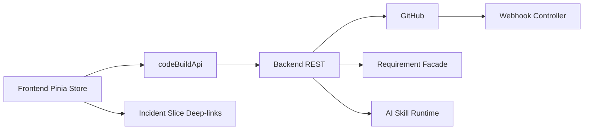

# Code & Build Management — Design

## 1. Purpose

This is the concrete implementation-facing design for the Code & Build Management slice. It pins down file structure, component API contracts, Pinia store shape, visual decisions, empty/error states, routing wiring, testing strategy, and the Phase A/B toggle. It operationalizes the upstream 8 docs.

### Upstream references

- Requirements: [../01-requirements/code-build-management-requirements.md](../01-requirements/code-build-management-requirements.md)
- Stories: [../02-user-stories/code-build-management-stories.md](../02-user-stories/code-build-management-stories.md)
- Spec: [../03-spec/code-build-management-spec.md](../03-spec/code-build-management-spec.md)
- Architecture: [../04-architecture/code-build-management-architecture.md](../04-architecture/code-build-management-architecture.md)
- Data flow: [../04-architecture/code-build-management-data-flow.md](../04-architecture/code-build-management-data-flow.md)
- Data model: [../04-architecture/code-build-management-data-model.md](../04-architecture/code-build-management-data-model.md)
- API guide: [contracts/code-build-management-API_IMPLEMENTATION_GUIDE.md](contracts/code-build-management-API_IMPLEMENTATION_GUIDE.md)

## 2. File Structure

### Frontend

```
frontend/src/features/code-build-management/
├── api/
│   └── codeBuildApi.ts
├── stores/
│   └── codeBuildStore.ts
├── types/
│   ├── enums.ts
│   ├── catalog.ts
│   ├── repo.ts
│   ├── pr.ts
│   ├── run.ts
│   ├── traceability.ts
│   └── aggregate.ts
├── mock/
│   ├── catalog.mock.ts
│   ├── repoDetail.mock.ts
│   ├── prDetail.mock.ts
│   ├── runDetail.mock.ts
│   ├── traceability.mock.ts
│   └── commandLoop.ts
├── components/
│   ├── primitives/
│   │   ├── HealthLed.vue
│   │   ├── StoryChip.vue
│   │   ├── PrStateBadge.vue
│   │   ├── RunStatusBadge.vue
│   │   ├── SeverityChip.vue
│   │   ├── StepConclusionChip.vue
│   │   ├── DurationPill.vue
│   │   ├── ShortShaPill.vue
│   │   ├── ExternalLinkOut.vue
│   │   ├── AiRowStatusBanner.vue
│   │   ├── RedactedLogExcerpt.vue
│   │   └── RateLimitBanner.vue
│   ├── catalog/
│   │   ├── CatalogSummaryBarCard.vue
│   │   ├── CatalogGridCard.vue
│   │   ├── CatalogFilterBar.vue
│   │   └── CatalogAiSummaryCard.vue
│   ├── repo/
│   │   ├── RepoHeaderCard.vue
│   │   ├── RepoBranchesCard.vue
│   │   ├── RepoOpenPrsCard.vue
│   │   ├── RepoRecentCommitsCard.vue
│   │   ├── RepoRecentRunsCard.vue
│   │   └── RepoAiInsightsCard.vue
│   ├── pr/
│   │   ├── PrHeaderCard.vue
│   │   ├── PrLinkedStoriesCard.vue
│   │   ├── PrCiStatusCard.vue
│   │   └── PrAiReviewCard.vue
│   ├── run/
│   │   ├── RunHeaderCard.vue
│   │   ├── RunTimelineCard.vue
│   │   ├── RunArtifactsCard.vue
│   │   ├── RunAiTriageCard.vue
│   │   └── OpenIncidentAction.vue
│   └── traceability/
│       ├── TraceabilityInputCard.vue
│       ├── TraceabilityCommitsCard.vue
│       ├── TraceabilityPrsCard.vue
│       └── TraceabilityRunsCard.vue
└── views/
    ├── CatalogView.vue
    ├── RepoDetailView.vue
    ├── PrDetailView.vue
    ├── RunDetailView.vue
    └── TraceabilityView.vue
```

### Backend

```
backend/src/main/java/com/sdlctower/domain/codebuildmanagement/
├── controller/
│   ├── CodeBuildController.java
│   └── GithubWebhookController.java
├── service/
│   ├── CatalogService.java
│   ├── RepoDetailService.java
│   ├── PrDetailService.java
│   ├── RunDetailService.java
│   ├── TraceabilityService.java
│   ├── AiSummaryService.java
│   ├── AiPrReviewService.java
│   └── AiTriageService.java
├── ingestion/
│   ├── WebhookSignatureVerifier.java
│   ├── WebhookPayloadParser.java
│   ├── IngestionDispatcher.java
│   ├── ResyncScheduler.java
│   ├── InstallBackfillService.java
│   └── OutboxWorker.java
├── projection/
│   ├── CatalogSummaryProjection.java
│   ├── CatalogGridProjection.java
│   ├── RepoHeaderProjection.java
│   ├── RepoBranchesProjection.java
│   ├── RepoOpenPrsProjection.java
│   ├── RepoRecentCommitsProjection.java
│   ├── RepoRecentRunsProjection.java
│   ├── RepoAiInsightsProjection.java
│   ├── PrHeaderProjection.java
│   ├── PrLinkedStoriesProjection.java
│   ├── PrCiStatusProjection.java
│   ├── PrAiReviewProjection.java
│   ├── RunHeaderProjection.java
│   ├── RunTimelineProjection.java
│   ├── RunArtifactsProjection.java
│   ├── RunAiTriageProjection.java
│   └── TraceabilityProjection.java
├── policy/
│   ├── CodeBuildAccessGuard.java
│   ├── AiAutonomyPolicy.java
│   ├── StoryIdExtractor.java
│   └── LogRedactor.java
├── integration/
│   ├── GitHubRestClient.java
│   ├── GitHubAppAuth.java
│   ├── RequirementFacade.java
│   └── AiSkillClient.java
├── persistence/
│   ├── entity/ ... (V40–V47 entities)
│   ├── repository/ ...
│   └── converter/ ...
├── dto/
│   └── ... (all records from data model §4)
└── events/
    └── CodeBuildChangeLogPublisher.java

backend/src/main/resources/db/migration/
├── V40__create_git_repository.sql
├── V41__create_git_branch_and_commit.sql
├── V42__create_pull_request.sql
├── V43__create_pipeline_run_and_jobs.sql
├── V44__create_story_commit_link.sql
├── V45__create_ai_outputs.sql
├── V46__create_change_log_and_outbox.sql
└── V47__seed_code_build_local.sql
```

## 3. Visual Layout

### 3.1 Catalog (`/code-build`)

12-column grid:

- Row 1 (cols 1–12): `CatalogSummaryBarCard`
- Row 2 (cols 1–12): `CatalogFilterBar`
- Row 3 (cols 1–8): `CatalogGridCard`
- Row 3 (cols 9–12): `CatalogAiSummaryCard` (sticky on scroll)

Breakpoints:

- ≥1280: as above
- 1024–1279: Summary full-width, Filter full-width, Grid above AiSummary (stacked)
- <1024: everything stacks vertically

### 3.2 Repo Detail (`/code-build/repos/:repoId`)

- Row 1 (cols 1–12): `RepoHeaderCard`
- Row 2 (cols 1–6): `RepoBranchesCard`, (cols 7–12): `RepoOpenPrsCard`
- Row 3 (cols 1–6): `RepoRecentCommitsCard`, (cols 7–12): `RepoRecentRunsCard`
- Row 4 (cols 1–12): `RepoAiInsightsCard`

### 3.3 PR Detail (`/code-build/repos/:repoId/prs/:prNumber`)

- Row 1 (cols 1–12): `PrHeaderCard`
- Row 2 (cols 1–6): `PrLinkedStoriesCard`, (cols 7–12): `PrCiStatusCard`
- Row 3 (cols 1–12): `PrAiReviewCard`

### 3.4 Run Detail (`/code-build/runs/:runId`)

- Row 1 (cols 1–12): `RunHeaderCard` + embedded `OpenIncidentAction` (right-aligned)
- Row 2 (cols 1–12): `RunTimelineCard`
- Row 3 (cols 1–6): `RunArtifactsCard`, (cols 7–12): `RunAiTriageCard`

### 3.5 Traceability (`/code-build/traceability`)

- Row 1: `TraceabilityInputCard`
- Row 2: `TraceabilityCommitsCard`
- Row 3: `TraceabilityPrsCard`
- Row 4: `TraceabilityRunsCard`

## 4. Visual Tokens

Reuses shared Tactical Command tokens. New tokens added only if absent:

- `--cb-led-green`, `--cb-led-amber`, `--cb-led-red`, `--cb-led-unknown`
- `--cb-severity-blocker`, `--cb-severity-major`, `--cb-severity-minor`, `--cb-severity-nit`
- `--cb-stale-badge-bg`, `--cb-superseded-badge-bg`
- Monospace: `JetBrains Mono` for SHA, run numbers, file paths
- Sans: `Inter` for everything else

Build LEDs use shape + text redundancy, not color-only (REQ-CB-90). SHA chips monospace, 12 chars, hover shows full 40-char.

## 5. Component API Contracts

### 5.1 Primitives

| Component | Props | Emits | Notes |
| --------- | ----- | ----- | ----- |
| `HealthLed` | `led: HealthLed`, `size?: 'sm'\|'md'\|'lg'`, `withLabel?: boolean` | — | Shape + color + optional text label |
| `StoryChip` | `chip: StoryChip`, `clickable?: boolean` | `click(storyId)` | VERIFIED=green, UNVERIFIED=amber, UNKNOWN_STORY=grey |
| `PrStateBadge` | `state: PrState` | — | OPEN/DRAFT/MERGED/CLOSED |
| `RunStatusBadge` | `status: RunStatus`, `compact?: boolean` | — | Mirrors state machine |
| `SeverityChip` | `severity: AiNoteSeverity`, `redacted?: boolean` | — | Grey count-pill when redacted |
| `StepConclusionChip` | `conclusion: StepConclusion` | — | |
| `DurationPill` | `seconds?: number` | — | Renders `—` when null |
| `ShortShaPill` | `sha: string`, `full?: string`, `externalUrl?: string` | — | Monospace, hover full SHA, click opens GH |
| `ExternalLinkOut` | `href: string`, `label: string` | — | `target=_blank`, `rel="noopener noreferrer"` |
| `AiRowStatusBanner` | `status: AiRowStatus`, `generatedAt?: string`, `skillVersion?: string`, `onRetry?: () => void`, `canRetry: boolean` | `retry` | PENDING/FAILED/STALE/SUPERSEDED/EVIDENCE_MISMATCH variants |
| `RedactedLogExcerpt` | `text: string`, `bytes: number` | — | Monospace block, "redacted" watermark |
| `RateLimitBanner` | `workspaceId: string`, `nextAttemptAt?: string` | `dismiss` | Sticky top-of-card |

### 5.2 Catalog Cards

| Card | Input | Source | Notes |
| ---- | ----- | ------ | ----- |
| `CatalogSummaryBarCard` | — | `codeBuildStore.catalog.summary` | Skeleton on PENDING; per-card error |
| `CatalogGridCard` | — | `codeBuildStore.catalog.grid` | Tiles group by project; sticky project header |
| `CatalogFilterBar` | `v-model:filters` | local state bound to store | Emits `change` debounced 250ms |
| `CatalogAiSummaryCard` | — | `codeBuildStore.catalog.aiSummary` | Sticky on desktop; Regenerate button admin-only + rate-limited |

### 5.3 Repo Cards

| Card | Input | Source |
| ---- | ----- | ------ |
| `RepoHeaderCard` | `repoId` | `repoDetail.header` |
| `RepoBranchesCard` | — | `repoDetail.branches` |
| `RepoOpenPrsCard` | — | `repoDetail.openPrs` |
| `RepoRecentCommitsCard` | — | `repoDetail.recentCommits` |
| `RepoRecentRunsCard` | — | `repoDetail.recentRuns` |
| `RepoAiInsightsCard` | — | `repoDetail.aiInsights` |

### 5.4 PR Cards

| Card | Input | Source |
| ---- | ----- | ------ |
| `PrHeaderCard` | `prId` | `prDetail.header` |
| `PrLinkedStoriesCard` | — | `prDetail.linkedStories` |
| `PrCiStatusCard` | — | `prDetail.ciStatus` |
| `PrAiReviewCard` | — | `prDetail.aiReview` |

`PrAiReviewCard` groups notes by severity and secondarily by `filePath`. BLOCKER branch checks `canViewBlockers` from the store (derived from principal's role on the repo's project).

### 5.5 Run Cards

| Card | Input | Source |
| ---- | ----- | ------ |
| `RunHeaderCard` | `runId` | `runDetail.header` |
| `RunTimelineCard` | — | `runDetail.timeline` |
| `RunArtifactsCard` | — | `runDetail.artifacts` |
| `RunAiTriageCard` | — | `runDetail.triage` |
| `OpenIncidentAction` | `context: OpenIncidentContext` | `runDetail.openIncidentContext` | Renders disabled with tooltip when principal lacks incident-create |

### 5.6 Traceability Cards

| Card | Input | Source |
| ---- | ----- | ------ |
| `TraceabilityInputCard` | `v-model:storyId` | route query | Typeahead against recent verified story ids |
| `TraceabilityCommitsCard` | — | `traceability.commits` |
| `TraceabilityPrsCard` | — | `traceability.prs` |
| `TraceabilityRunsCard` | — | `traceability.runs` + `capNotice` |

## 6. Pinia Store Shape

```ts
interface CodeBuildManagementState {
  catalog: CatalogAggregate | null;
  repoDetail: RepoDetailAggregate | null;
  prDetail: PrDetailAggregate | null;
  runDetail: RunDetailAggregate | null;
  traceability: TraceabilityAggregate | null;
  filters: CatalogFilters;
  activeIds: {
    repoId: string | null;
    prId: string | null;
    runId: string | null;
    storyId: string | null;
  };
  loading: Record<CardKey, boolean>;
  errors: Record<CardKey, { code: string; message: string } | null>;
  pollHandles: Record<string, number>; // for PENDING AI rows
  principal: {
    canViewBlockers: boolean;       // resolved from shell store on init
    canCreateIncident: boolean;
    workspaceAutonomy: 'DISABLED' | 'OBSERVATION' | 'SUPERVISED' | 'AUTONOMOUS';
    isAdmin: boolean;
  };
}
```

Actions:

- `initCatalog(filters?)`, `refreshCatalogCard(cardKey)`
- `openRepo(repoId)`, `refreshRepoCard(cardKey)`, `closeRepo()`
- `openPr(repoId, prNumber)`, `refreshPrCard(cardKey)`, `closePr()`
- `openRun(runId)`, `refreshRunCard(cardKey)`, `closeRun()`
- `lookupStory(storyId)`, `refreshTraceabilityCard(cardKey)`
- `regenerateWorkspaceSummary()` — admin only, rate-limited 1/min
- `startAiPolling(kind, id)`, `stopAiPolling(kind, id)` — 3s → 10s backoff
- `reset()` on unmount of root views

## 7. Routing and Navigation

`router.ts` entries (order matters — traceability before wildcard repos):

```ts
{ path: '/code-build', component: CatalogView, meta: { breadcrumb: 'Code & Build' } },
{ path: '/code-build/traceability', component: TraceabilityView, meta: { breadcrumb: 'Code & Build / Traceability' } },
{ path: '/code-build/repos/:repoId', component: RepoDetailView, props: true },
{ path: '/code-build/repos/:repoId/prs/:prNumber', component: PrDetailView, props: true },
{ path: '/code-build/runs/:runId', component: RunDetailView, props: true },
```

All routes guarded by `requireWorkspaceMember(resolveWorkspaceId(to))`. Deep-link contract: every identity addressable by URL alone.

Shell nav config: remove `comingSoon` for Code & Build.

## 8. Empty / Error / Loading States (canonical copies)

- "No repos installed for this workspace yet — install the GitHub App via Platform Center." (deep-link to PC)
- "No open PRs on this repo."
- "No pipeline runs yet — waiting for the first push."
- "No commits on default branch yet."
- "AI summary disabled for this workspace." (when autonomy=DISABLED)
- "AI summary pending — this usually takes under a minute."
- "AI summary failed — an admin can retry."
- "AI triage unavailable — evidence mismatch. This run's logs did not match the triage output."
- "AI PR review skipped (bot author)."
- "AI PR review STALE — new head commit pushed; a fresh review is running."
- "Story not found or not visible in this workspace."
- "Some data may be stale due to GitHub rate limits — next sync attempt at {time}."
- "Build range too large (>100 commits); showing the first 100."

Loading = skeleton rows, one per expected card. Error = message + Retry button. Per-card isolation strictly enforced.

## 9. Phase A / Phase B Toggle

```ts
const USE_BACKEND = import.meta.env.VITE_USE_BACKEND === 'true';
export const codeBuildApi = USE_BACKEND ? liveClient : mockClient;
```

Mock `commandLoop.ts` simulates all documented error codes and AI row states. Phase A latencies are within per-projection budgets to match Phase B UX.

## 10. Testing Strategy

### Frontend

- Unit (Vitest): primitives, store actions, mock command loop, story-chip status derivation, AI-row polling.
- Component (@vue/test-utils): each card's states (loading/success/error/empty/stale), BLOCKER redaction for non-Lead, AI PENDING polling, rate-limit banner.
- E2E (Playwright, Phase B only): Catalog → Repo → PR / Run drill, Traceability inverse lookup, failed-run → Open Incident deep-link pre-fill.

### Backend

- Controller (MockMvc): every endpoint happy + 403/404, per-projection timeout isolation, webhook signature rejection + accept paths.
- Service: each projection with H2; each AI service with fake skill client; evidence-integrity rejection path.
- Policy: access guard (workspace, project role), AI autonomy gating, story-id extractor (positive/negative/multi), log redactor (AWS/GH/Bearer patterns).
- Integration: GitHubRestClient with recorded fixtures; backfill idempotency; outbox worker retry.
- Flyway: V40–V47 apply cleanly on H2; check constraints enforced.
- Golden-file: API envelopes match API guide examples byte-for-byte.

## 11. Non-Goals (Design)

- No streaming log viewer, no live tail.
- No AI diff annotations posted to GitHub.
- No webhook re-delivery UI (admins use GitHub's own UI).
- No branch-protection or workflow-yaml editing.
- No merging / closing / opening PRs from the Control Tower.

## 12. Accessibility

- All LEDs carry a shape/text alternative.
- All interactive chips have ARIA labels and keyboard focus states.
- Timelines expose a linear tab order job → step.
- Modals (e.g., Open Incident deep-link confirmation if added) trap focus.
- Color contrast ≥ WCAG AA on all text.

## 13. Integration Boundary



The Control Tower never writes to GitHub. The `BE --> GH` arrow is strictly for reads (backfill / resync). The `FE --> Inc` arrow is a navigation, not a write: it carries pre-filled context.
