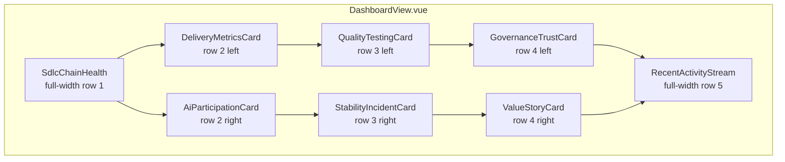
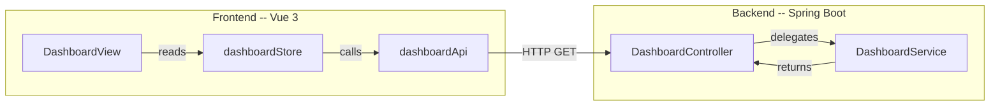

# Dashboard / Control Tower Design

## Purpose

This document defines the concrete component APIs, file structure, data model,
visual design decisions, and API contracts for the Dashboard / Control Tower page.
It bridges the [architecture](../04-architecture/dashboard-architecture.md) and the
[implementation tasks](../06-tasks/dashboard-tasks.md).

## Traceability

- Requirements: [dashboard-requirements.md](../01-requirements/dashboard-requirements.md)
- Stories: [dashboard-stories.md](../02-user-stories/dashboard-stories.md)
- Spec: [dashboard-spec.md](../03-spec/dashboard-spec.md)
- Architecture: [dashboard-architecture.md](../04-architecture/dashboard-architecture.md)
- Visual prototype: [Control Tower.html](Control%20Tower.html)
- Product design: [design.md](design.md) (§Dashboard / Control Tower)

## 1. File Structure

### Frontend

```
frontend/src/
├── features/
│   └── dashboard/
│       ├── DashboardView.vue              # page view — layout grid + data orchestration
│       ├── components/
│       │   ├── SdlcChainHealth.vue        # 11-node horizontal pipeline
│       │   ├── SdlcStageNode.vue          # single stage node (reusable)
│       │   ├── MetricCard.vue             # reusable metric display (value + trend)
│       │   ├── DeliveryMetricsCard.vue    # delivery rhythm card
│       │   ├── AiParticipationCard.vue    # AI involvement summary card
│       │   ├── QualityTestingCard.vue     # quality & testing card
│       │   ├── StabilityIncidentCard.vue  # stability & incident card
│       │   ├── GovernanceTrustCard.vue    # governance trust card
│       │   ├── ValueStoryCard.vue         # value proof narrative card
│       │   ├── RecentActivityStream.vue   # activity list
│       │   └── ActivityEntry.vue          # single activity row
│       ├── stores/
│       │   └── dashboardStore.ts          # Pinia store — fetch + state
│       ├── api/
│       │   └── dashboardApi.ts            # API client for /dashboard/*
│       ├── types/
│       │   └── dashboard.ts               # TypeScript interfaces
│       └── mockData.ts                    # Phase A mocked data
```

### Backend

```
backend/src/main/java/com/sdlctower/
├── domain/
│   └── dashboard/
│       ├── DashboardController.java       # GET /api/v1/dashboard/summary
│       ├── DashboardService.java          # aggregation logic (seed data in V1)
│       └── dto/
│           ├── DashboardSummaryDto.java
│           ├── SdlcStageHealthDto.java
│           ├── MetricValueDto.java
│           ├── AiParticipationDto.java
│           ├── QualityMetricsDto.java
│           ├── StabilityMetricsDto.java
│           ├── GovernanceMetricsDto.java
│           ├── ActivityEntryDto.java
│           └── ValueStoryDto.java
├── src/main/resources/
│   └── db/migration/
│       └── V3__seed_dashboard_data.sql    # seed data for dashboard
├── src/test/java/com/sdlctower/domain/dashboard/
│   └── DashboardControllerTest.java
```

## 2. Layout Composition



### CSS Grid

```css
.dashboard-grid {
  display: grid;
  grid-template-columns: 1fr 1fr;
  gap: 20px;
  padding: 0 24px 24px;
}

.dashboard-grid .full-width {
  grid-column: 1 / -1;
}
```

## 3. Component API Contracts

### 3.1 SdlcChainHealth

```ts
// Props
interface SdlcChainHealthProps {
  stages: ReadonlyArray<SdlcStageHealth>;
}

// Events
// @navigate(stageKey: string) — emitted when user clicks a stage node
```

Renders 11 nodes in a horizontal row connected by arrows. Spec node has
distinct styling (highlighted border, "HUB" micro-badge).

### 3.2 SdlcStageNode

```ts
interface SdlcStageNodeProps {
  stage: SdlcStageHealth;
}

// Events
// @click() — bubble up for navigation
```

Single node in the SDLC chain. Shows label, status LED, item count.

### 3.3 MetricCard (Reusable)

```ts
interface MetricCardProps {
  label: string;
  value: string;
  trend: 'up' | 'down' | 'stable';
  trendIsPositive: boolean;
  size?: 'sm' | 'md';         // default 'md'
}
```

Renders a single metric with label, value, and trend indicator arrow.

### 3.4 DeliveryMetricsCard

```ts
interface DeliveryMetricsCardProps {
  metrics: DeliveryMetrics;
}
```

Grid of 3-4 `MetricCard` instances plus bottleneck stage callout.

### 3.5 AiParticipationCard

```ts
interface AiParticipationCardProps {
  participation: AiParticipation;
}
```

Headline metrics plus stage involvement indicator strip.

### 3.6 QualityTestingCard

```ts
interface QualityTestingCardProps {
  metrics: QualityMetrics;
}
```

### 3.7 StabilityIncidentCard

```ts
interface StabilityIncidentCardProps {
  metrics: StabilityMetrics;
}

// Events
// @navigate-incidents() — navigate to incident management
```

### 3.8 GovernanceTrustCard

```ts
interface GovernanceTrustCardProps {
  metrics: GovernanceMetrics;
}

// Events
// @navigate-governance() — navigate to platform center
```

### 3.9 ValueStoryCard

```ts
interface ValueStoryCardProps {
  story: ValueStory;
}
```

### 3.10 RecentActivityStream

```ts
interface RecentActivityStreamProps {
  activity: RecentActivity;
}

// Events
// @view-all() — navigate to full audit stream
```

### 3.11 ActivityEntry

```ts
interface ActivityEntryProps {
  entry: ActivityEntry;
}
```

## 4. Data Model (Frontend Types)

```ts
// frontend/src/features/dashboard/types/dashboard.ts

/**
 * Per-section envelope — allows individual sections to fail independently.
 */
export interface SectionResult<T> {
  readonly data: T | null;
  readonly error: string | null;
}

export interface DashboardSummary {
  readonly sdlcHealth: SectionResult<ReadonlyArray<SdlcStageHealth>>;
  readonly deliveryMetrics: SectionResult<DeliveryMetrics>;
  readonly aiParticipation: SectionResult<AiParticipation>;
  readonly qualityMetrics: SectionResult<QualityMetrics>;
  readonly stabilityMetrics: SectionResult<StabilityMetrics>;
  readonly governanceMetrics: SectionResult<GovernanceMetrics>;
  readonly recentActivity: SectionResult<RecentActivity>;
  readonly valueStory: SectionResult<ValueStory>;
}

export interface SdlcStageHealth {
  readonly key: string;
  readonly label: string;
  readonly status: 'healthy' | 'warning' | 'critical' | 'inactive';
  readonly itemCount: number;
  readonly isHub: boolean;
  readonly routePath: string;
}

export interface MetricValue {
  readonly label: string;
  readonly value: string;
  readonly trend: 'up' | 'down' | 'stable';
  readonly trendIsPositive: boolean;
}

export interface DeliveryMetrics {
  readonly leadTime: MetricValue;
  readonly deployFrequency: MetricValue;
  readonly iterationCompletion: MetricValue;
  readonly bottleneckStage: string | null;
}

export interface AiParticipation {
  readonly usageRate: MetricValue;
  readonly adoptionRate: MetricValue;
  readonly autoExecSuccess: MetricValue;
  readonly timeSaved: MetricValue;
  readonly stageInvolvement: ReadonlyArray<{
    readonly stageKey: string;
    readonly involved: boolean;
    readonly actionsCount: number;
  }>;
}

export interface QualityMetrics {
  readonly buildSuccessRate: MetricValue;
  readonly testPassRate: MetricValue;
  readonly defectDensity: MetricValue;
  readonly specCoverage: MetricValue;
}

export interface StabilityMetrics {
  readonly activeIncidents: number;
  readonly criticalIncidents: number;
  readonly changeFailureRate: MetricValue;
  readonly mttr: MetricValue;
  readonly rollbackRate: MetricValue;
}

export interface GovernanceMetrics {
  readonly templateReuse: MetricValue;
  readonly configDrift: MetricValue;
  readonly auditCoverage: MetricValue;
  readonly policyHitRate: MetricValue;
}

export interface ActivityEntry {
  readonly id: string;
  readonly actor: string;
  readonly actorType: 'ai' | 'human';
  readonly action: string;
  readonly stageKey: string;
  readonly timestamp: string;
}

export interface RecentActivity {
  readonly entries: ReadonlyArray<ActivityEntry>;
  readonly total: number;
}

export interface ValueStory {
  readonly headline: string;
  readonly metrics: ReadonlyArray<{
    readonly label: string;
    readonly value: string;
    readonly description: string;
  }>;
}
```

## 5. Backend Data Model (Phase B)

### 5.1 DTOs

Backend DTOs mirror the frontend types. Java records are used for immutability:

```java
// SectionResultDto.java — per-section envelope for independent failure
public record SectionResultDto<T>(T data, String error) {
    public static <T> SectionResultDto<T> ok(T data) {
        return new SectionResultDto<>(data, null);
    }
    public static <T> SectionResultDto<T> fail(String error) {
        return new SectionResultDto<>(null, error);
    }
}

// DashboardSummaryDto.java
public record DashboardSummaryDto(
    SectionResultDto<List<SdlcStageHealthDto>> sdlcHealth,
    SectionResultDto<DeliveryMetricsDto> deliveryMetrics,
    SectionResultDto<AiParticipationDto> aiParticipation,
    SectionResultDto<QualityMetricsDto> qualityMetrics,
    SectionResultDto<StabilityMetricsDto> stabilityMetrics,
    SectionResultDto<GovernanceMetricsDto> governanceMetrics,
    SectionResultDto<RecentActivityDto> recentActivity,
    SectionResultDto<ValueStoryDto> valueStory
) {}

// MetricValueDto.java
public record MetricValueDto(
    String label,
    String value,
    String trend,           // "up" | "down" | "stable"
    boolean trendIsPositive
) {}

// SdlcStageHealthDto.java
public record SdlcStageHealthDto(
    String key,
    String label,
    String status,          // "healthy" | "warning" | "critical" | "inactive"
    int itemCount,
    boolean isHub,
    String routePath
) {}
```

### 5.2 Database (V1 — Seed Only)

V1 does not store dashboard data in tables. The `DashboardService` returns
hardcoded seed data matching the mock data contract. Future versions will
aggregate from domain tables.

### 5.3 Seed Data Migration

```sql
-- V3__seed_dashboard_data.sql
-- No tables created; seed data is in-code for V1.
-- This migration is a placeholder for future dashboard-specific tables.
```

## 6. API Contracts

### 6.1 Dashboard Summary

```
GET /api/v1/dashboard/summary

Response: 200 OK
Content-Type: application/json

{
  "data": {
    "sdlcHealth": { "data": [
      { "key": "requirement", "label": "Requirement", "status": "healthy", "itemCount": 24, "isHub": false, "routePath": "/requirements" },
      { "key": "user-story", "label": "User Story", "status": "healthy", "itemCount": 67, "isHub": false, "routePath": "/requirements" },
      { "key": "spec", "label": "Spec", "status": "warning", "itemCount": 12, "isHub": true, "routePath": "/requirements" },
      { "key": "architecture", "label": "Architecture", "status": "healthy", "itemCount": 8, "isHub": false, "routePath": "/design" },
      { "key": "design", "label": "Design", "status": "healthy", "itemCount": 15, "isHub": false, "routePath": "/design" },
      { "key": "tasks", "label": "Tasks", "status": "healthy", "itemCount": 143, "isHub": false, "routePath": "/project-management" },
      { "key": "code", "label": "Code", "status": "healthy", "itemCount": 89, "isHub": false, "routePath": "/code" },
      { "key": "test", "label": "Test", "status": "warning", "itemCount": 34, "isHub": false, "routePath": "/testing" },
      { "key": "deploy", "label": "Deploy", "status": "healthy", "itemCount": 7, "isHub": false, "routePath": "/deployment" },
      { "key": "incident", "label": "Incident", "status": "critical", "itemCount": 3, "isHub": false, "routePath": "/incidents" },
      { "key": "learning", "label": "Learning", "status": "inactive", "itemCount": 0, "isHub": false, "routePath": "/ai-center" }
    ], "error": null },
    "deliveryMetrics": { "data": {
      "leadTime": { "label": "Lead Time", "value": "4.2d", "trend": "down", "trendIsPositive": true },
      "deployFrequency": { "label": "Deploy Frequency", "value": "3.1/wk", "trend": "up", "trendIsPositive": true },
      "iterationCompletion": { "label": "Iteration Completion", "value": "87%", "trend": "up", "trendIsPositive": true },
      "bottleneckStage": "spec"
    }, "error": null },
    "aiParticipation":   { "data": { "..." }, "error": null },
    "qualityMetrics":    { "data": { "..." }, "error": null },
    "stabilityMetrics":  { "data": { "..." }, "error": null },
    "governanceMetrics": { "data": { "..." }, "error": null },
    "recentActivity":    { "data": { "..." }, "error": null },
    "valueStory":        { "data": { "..." }, "error": null }

    // Complete JSON for all 8 sections: see contracts/dashboard-API_IMPLEMENTATION_GUIDE.md §2.2
  },
  "error": null
}
```

Each section uses a `SectionResult<T>` envelope (`{ data, error }`) so that
individual sections can fail independently. See spec §11.2 for details.
```

Error response follows the shared `ApiResponse` envelope:

```json
{
  "data": null,
  "error": "Failed to load dashboard summary"
}
```

## 7. Visual Design Decisions

### 7.1 Color Tokens

Inherits from the shared shell design tokens. Dashboard-specific semantics:

| Semantic | Token Reference | Usage |
|----------|----------------|-------|
| Healthy | `--color-tertiary` (green) | Status LEDs, positive trends |
| Warning | `--color-warning` (amber) | Warning status, flagged metrics |
| Critical | `--color-error` (red) | Critical incidents, negative trends |
| Inactive | `--color-on-surface-variant` (muted) | Inactive stages |
| AI accent | `--color-secondary` (cyan/blue) | AI-related metrics and badges |
| Hub highlight | `--color-secondary-container` | Spec node border |

### 7.2 Typography

| Element | Style |
|---------|-------|
| Card title | `text-label` (0.625rem, uppercase, letter-spacing) |
| Metric value | `text-tech` (1.5rem, `--color-secondary`, JetBrains Mono) |
| Metric label | `text-label` (0.625rem, `--color-on-surface-variant`) |
| Trend indicator | 0.75rem, green/red based on `trendIsPositive` |
| SDLC stage label | 0.625rem, uppercase |
| Activity timestamp | 0.625rem, `--color-on-surface-variant` |

### 7.3 Card Style

```css
.dashboard-card {
  background: var(--color-surface-container);
  border: 1px solid var(--color-outline-variant);
  border-radius: var(--radius-sm);
  padding: 16px;
  display: flex;
  flex-direction: column;
  gap: 12px;
}

.dashboard-card header {
  display: flex;
  align-items: center;
  gap: 8px;
  color: var(--color-on-surface-variant);
  font-size: 0.625rem;
  text-transform: uppercase;
  letter-spacing: 0.08em;
}
```

### 7.4 SDLC Chain Visual

- Horizontal pipeline with nodes connected by arrows/lines
- Each node: rounded rectangle with status LED (top-left), label, count
- Spec node: larger, `--color-secondary-container` border, "HUB" micro-badge
- Arrow connectors: thin lines in `--color-outline-variant`
- Responsive: scrollable horizontally if viewport is too narrow

### 7.5 Status LED

```css
.status-led {
  width: 6px;
  height: 6px;
  border-radius: 50%;
  box-shadow: 0 0 6px currentColor;
}

.status-led--healthy { color: var(--color-tertiary); }
.status-led--warning { color: #f59e0b; }
.status-led--critical { color: var(--color-error); }
.status-led--inactive { color: var(--color-on-surface-variant); }
```

### 7.6 Activity Stream

- Each row: avatar/icon (AI or human), actor name, action text, stage badge, relative time
- AI entries use AI icon with cyan accent
- Human entries use person icon
- Alternating subtle background for readability

## 8. Error and Empty State Design

| Card State | Visual |
|-----------|--------|
| Loading | Skeleton placeholder with pulse animation matching card dimensions |
| Empty | Card shell with centered "No data available" text, muted icon |
| Error | Card shell with centered error icon, "Failed to load" text, muted |
| Normal | Full data render |

The SDLC chain loading state shows 11 skeleton node placeholders.

## 9. Integration Boundary



Frontend depends on backend only through the `/api/v1/dashboard/summary` endpoint.
Phase A replaces the API call with mock data. Phase B wires the real API.

## 10. Interaction Patterns

### 10.1 SDLC Chain Click

1. User clicks a stage node
2. `SdlcStageNode` emits `@click` with stage key
3. `SdlcChainHealth` emits `@navigate` with stage key
4. `DashboardView` calls `router.push(stage.routePath)`
5. Shell preserves workspace context during navigation

### 10.2 Incident Badge Click

1. User clicks incident count in `StabilityIncidentCard`
2. Card emits `@navigate-incidents`
3. `DashboardView` calls `router.push('/incidents')`

### 10.3 Governance Click

1. User clicks governance indicator
2. Card emits `@navigate-governance`
3. `DashboardView` calls `router.push('/platform')`
