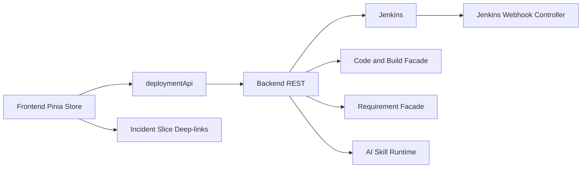

# Deployment Management — Design

## 1. Purpose

This is the concrete implementation-facing design for the **Deployment Management** slice. It pins down the file structure, component API contracts, Pinia store shape, visual decisions, empty/error states, routing wiring, testing strategy, and the Phase A/B toggle. It operationalizes the upstream 8 docs.

This slice is a **read-only observability viewer** over deployments executed by **Jenkins**. The Control Tower never runs, approves, promotes, cancels, or rolls back deployments; it reads from Jenkins (webhooks + polling) and from the Code & Build slice (for the Story → Commit → Build chain), composes read-side aggregates, and presents them.

### Upstream references

- Requirements: [../01-requirements/deployment-management-requirements.md](../01-requirements/deployment-management-requirements.md)
- Stories: [../02-user-stories/deployment-management-stories.md](../02-user-stories/deployment-management-stories.md)
- Spec: [../03-spec/deployment-management-spec.md](../03-spec/deployment-management-spec.md)
- Architecture: [../04-architecture/deployment-management-architecture.md](../04-architecture/deployment-management-architecture.md)
- Data flow: [../04-architecture/deployment-management-data-flow.md](../04-architecture/deployment-management-data-flow.md)
- Data model: [../04-architecture/deployment-management-data-model.md](../04-architecture/deployment-management-data-model.md)
- API guide: [contracts/deployment-management-API_IMPLEMENTATION_GUIDE.md](contracts/deployment-management-API_IMPLEMENTATION_GUIDE.md)

## 2. File Structure

### Frontend

```
frontend/src/features/deployment-management/
├── api/
│   └── deploymentApi.ts
├── stores/
│   └── deploymentStore.ts
├── types/
│   ├── enums.ts
│   ├── catalog.ts
│   ├── application.ts
│   ├── release.ts
│   ├── deploy.ts
│   ├── environment.ts
│   ├── traceability.ts
│   └── aggregate.ts
├── mock/
│   ├── catalog.mock.ts
│   ├── applicationDetail.mock.ts
│   ├── releaseDetail.mock.ts
│   ├── deployDetail.mock.ts
│   ├── environmentDetail.mock.ts
│   ├── traceability.mock.ts
│   └── commandLoop.ts
├── components/
│   ├── primitives/
│   │   ├── DeployStateBadge.vue
│   │   ├── DeployTriggerChip.vue
│   │   ├── EnvironmentChip.vue
│   │   ├── ReleaseStateBadge.vue
│   │   ├── StageConclusionChip.vue
│   │   ├── StoryChip.vue
│   │   ├── DurationPill.vue
│   │   ├── FreshnessIndicator.vue
│   │   ├── JenkinsLinkOut.vue
│   │   ├── ReleaseVersionPill.vue
│   │   ├── HealthLed.vue
│   │   ├── AiRowStatusBanner.vue
│   │   ├── RedactedLogExcerpt.vue
│   │   └── RateLimitBanner.vue
│   ├── catalog/
│   │   ├── CatalogSummaryBarCard.vue
│   │   ├── CatalogGridCard.vue
│   │   ├── CatalogFilterBar.vue
│   │   └── CatalogAiSummaryCard.vue
│   ├── application/
│   │   ├── ApplicationHeaderCard.vue
│   │   ├── ApplicationEnvironmentsCard.vue
│   │   ├── ApplicationRecentReleasesCard.vue
│   │   ├── ApplicationRecentDeploysCard.vue
│   │   ├── ApplicationMetricsCard.vue
│   │   └── ApplicationAiInsightsCard.vue
│   ├── release/
│   │   ├── ReleaseHeaderCard.vue
│   │   ├── ReleaseCompositionCard.vue
│   │   ├── ReleaseDeploysCard.vue
│   │   ├── ReleaseLinkedStoriesCard.vue
│   │   └── ReleaseAiNotesCard.vue
│   ├── deploy/
│   │   ├── DeployHeaderCard.vue
│   │   ├── DeployStagesCard.vue
│   │   ├── DeployApprovalsCard.vue
│   │   ├── DeployChangeSummaryCard.vue
│   │   └── DeployAiSummaryCard.vue
│   ├── environment/
│   │   ├── EnvironmentHeaderCard.vue
│   │   ├── EnvironmentCurrentCard.vue
│   │   ├── EnvironmentTimelineCard.vue
│   │   └── EnvironmentStabilityCard.vue
│   └── traceability/
│       ├── TraceabilityInputCard.vue
│       ├── TraceabilityReleasesCard.vue
│       └── TraceabilityDeploysCard.vue
└── views/
    ├── CatalogView.vue
    ├── ApplicationDetailView.vue
    ├── ReleaseDetailView.vue
    ├── DeployDetailView.vue
    ├── EnvironmentDetailView.vue
    └── TraceabilityView.vue
```

### Backend

```
backend/src/main/java/com/sdlctower/domain/deploymentmanagement/
├── controller/
│   ├── DeploymentController.java
│   └── JenkinsWebhookController.java
├── service/
│   ├── CatalogService.java
│   ├── ApplicationDetailService.java
│   ├── ReleaseDetailService.java
│   ├── DeployDetailService.java
│   ├── EnvironmentDetailService.java
│   ├── TraceabilityService.java
│   ├── AiReleaseNotesService.java
│   └── AiDeploymentSummaryService.java
├── ingestion/
│   ├── JenkinsSignatureVerifier.java
│   ├── JenkinsPayloadParser.java
│   ├── IngestionDispatcher.java
│   ├── ResyncScheduler.java
│   ├── JenkinsBackfillService.java
│   ├── OutboxWorker.java
│   ├── ReleaseVersionResolver.java
│   └── RollbackDetector.java
├── projection/
│   ├── CatalogSummaryProjection.java
│   ├── CatalogGridProjection.java
│   ├── ApplicationHeaderProjection.java
│   ├── ApplicationEnvironmentsProjection.java
│   ├── ApplicationRecentReleasesProjection.java
│   ├── ApplicationRecentDeploysProjection.java
│   ├── ApplicationMetricsProjection.java
│   ├── ApplicationAiInsightsProjection.java
│   ├── ReleaseHeaderProjection.java
│   ├── ReleaseCompositionProjection.java
│   ├── ReleaseDeploysProjection.java
│   ├── ReleaseLinkedStoriesProjection.java
│   ├── ReleaseAiNotesProjection.java
│   ├── DeployHeaderProjection.java
│   ├── DeployStagesProjection.java
│   ├── DeployApprovalsProjection.java
│   ├── DeployChangeSummaryProjection.java
│   ├── DeployAiSummaryProjection.java
│   ├── EnvironmentHeaderProjection.java
│   ├── EnvironmentCurrentProjection.java
│   ├── EnvironmentTimelineProjection.java
│   ├── EnvironmentStabilityProjection.java
│   └── TraceabilityProjection.java
├── policy/
│   ├── DeploymentAccessGuard.java
│   ├── AiAutonomyPolicy.java
│   ├── ReleaseNotesEvidenceValidator.java
│   └── LogRedactor.java
├── integration/
│   ├── JenkinsRestClient.java
│   ├── JenkinsAuth.java
│   ├── CodeBuildFacade.java
│   ├── RequirementFacade.java
│   └── AiSkillClient.java
├── persistence/
│   ├── entity/ ... (V60–V67 entities)
│   ├── repository/ ...
│   └── converter/ ...
├── dto/
│   └── ... (all records from data model §4)
└── events/
    └── DeploymentChangeLogPublisher.java

backend/src/main/resources/db/migration/
├── V60__create_jenkins_instance_and_application.sql
├── V61__create_application_environment.sql
├── V62__create_release.sql
├── V63__create_deploy_and_deploy_stage.sql
├── V64__create_approval_event.sql
├── V65__create_ai_release_notes_and_summary.sql
├── V66__create_deployment_change_log_and_outbox.sql
└── V67__seed_deployment_local.sql
```

## 3. Visual Layout

All pages use the shell's Tactical Command 12-column grid. Card failure is strictly isolated: one card errors, neighbors keep rendering.

### 3.1 Catalog (`/deployment`)

- Row 1 (cols 1–12): `CatalogSummaryBarCard`
- Row 2 (cols 1–12): `CatalogFilterBar`
- Row 3 (cols 1–8): `CatalogGridCard`
- Row 3 (cols 9–12): `CatalogAiSummaryCard` (sticky on scroll)

Breakpoints:

- ≥1280: as above
- 1024–1279: Summary full-width, Filter full-width, Grid above AiSummary (stacked)
- <1024: everything stacks vertically

### 3.2 Application Detail (`/deployment/applications/:applicationId`)

- Row 1 (cols 1–12): `ApplicationHeaderCard`
- Row 2 (cols 1–12): `ApplicationEnvironmentsCard` (environment strip)
- Row 3 (cols 1–6): `ApplicationRecentReleasesCard`, (cols 7–12): `ApplicationRecentDeploysCard`
- Row 4 (cols 1–6): `ApplicationMetricsCard`, (cols 7–12): `ApplicationAiInsightsCard`

### 3.3 Release Detail (`/deployment/releases/:releaseId`)

- Row 1 (cols 1–12): `ReleaseHeaderCard`
- Row 2 (cols 1–6): `ReleaseCompositionCard`, (cols 7–12): `ReleaseDeploysCard`
- Row 3 (cols 1–6): `ReleaseLinkedStoriesCard`, (cols 7–12): `ReleaseAiNotesCard`

### 3.4 Deploy Detail (`/deployment/deploys/:deployId`)

- Row 1 (cols 1–12): `DeployHeaderCard`
- Row 2 (cols 1–12): `DeployStagesCard` (timeline)
- Row 3 (cols 1–6): `DeployApprovalsCard`, (cols 7–12): `DeployChangeSummaryCard`
- Row 4 (cols 1–12): `DeployAiSummaryCard`

### 3.5 Environment Detail (`/deployment/applications/:applicationId/environments/:name`)

- Row 1 (cols 1–12): `EnvironmentHeaderCard`
- Row 2 (cols 1–6): `EnvironmentCurrentCard`, (cols 7–12): `EnvironmentStabilityCard`
- Row 3 (cols 1–12): `EnvironmentTimelineCard`

### 3.6 Traceability (`/deployment/traceability`)

- Row 1 (cols 1–12): `TraceabilityInputCard`
- Row 2 (cols 1–12): `TraceabilityReleasesCard`
- Row 3 (cols 1–12): `TraceabilityDeploysCard`

## 4. Visual Tokens

Reuses shared Tactical Command tokens. New tokens added only if absent:

- `--dp-state-pending`, `--dp-state-in-progress`, `--dp-state-succeeded`, `--dp-state-failed`, `--dp-state-cancelled`, `--dp-state-rolled-back`
- `--dp-env-dev`, `--dp-env-qa`, `--dp-env-staging`, `--dp-env-prod`, `--dp-env-canary`
- `--dp-trigger-manual`, `--dp-trigger-scheduled`, `--dp-trigger-webhook`, `--dp-trigger-rollback`
- `--dp-freshness-fresh`, `--dp-freshness-degraded`, `--dp-freshness-stale`
- `--dp-release-prepared`, `--dp-release-deployed`, `--dp-release-superseded`, `--dp-release-abandoned`
- Monospace: `JetBrains Mono` for release versions, build numbers, SHAs, Jenkins job names
- Sans: `Inter` for everything else

Deploy state badges carry **shape + color + text** (REQ-DP-90). `ReleaseVersionPill` is monospace, hover reveals the full Jenkins build URL and upstream build artifact id.

## 5. Component API Contracts

### 5.1 Primitives

| Component | Props | Emits | Notes |
| --------- | ----- | ----- | ----- |
| `DeployStateBadge` | `state: DeployState`, `rolledBack?: boolean`, `compact?: boolean` | — | ROLLED_BACK overlays a ↺ mark; state machine enforced |
| `DeployTriggerChip` | `trigger: DeployTrigger`, `actorDisplay?: string` | — | MANUAL/SCHEDULED/WEBHOOK/ROLLBACK; actor redacted when principal lacks role |
| `EnvironmentChip` | `kind: EnvironmentKind`, `name: string`, `clickable?: boolean` | `click(environmentName)` | PROD gets a solid border |
| `ReleaseStateBadge` | `state: ReleaseState` | — | PREPARED/DEPLOYED/SUPERSEDED/ABANDONED |
| `StageConclusionChip` | `conclusion: DeployStageState` | — | Mirrors Jenkins stage conclusion (SUCCESS/UNSTABLE/FAILURE/ABORTED/SKIPPED/IN_PROGRESS) |
| `StoryChip` | `chip: StoryChip`, `clickable?: boolean` | `click(storyId)` | VERIFIED/UNVERIFIED/UNKNOWN_STORY — reuses shared style from Code & Build |
| `DurationPill` | `seconds?: number` | — | Renders `—` when null |
| `FreshnessIndicator` | `lastIngestedAt?: string`, `threshold: '45s' \| '5m'` | — | Three tiers: Fresh ≤45s, Degraded ≤5m, Stale >5m |
| `JenkinsLinkOut` | `href: string`, `label: string` | — | `target=_blank`, `rel="noopener noreferrer"`, Jenkins crown icon |
| `ReleaseVersionPill` | `version: string`, `buildArtifactId?: string`, `externalUrl?: string` | — | Monospace; hover shows build artifact + Jenkins job name |
| `HealthLed` | `led: HealthLed`, `size?: 'sm'\|'md'\|'lg'` | — | Reused |
| `AiRowStatusBanner` | `status: AiRowStatus`, `generatedAt?: string`, `skillVersion?: string`, `onRetry?: () => void`, `canRetry: boolean` | `retry` | PENDING/FAILED/STALE/SUPERSEDED/EVIDENCE_MISMATCH variants |
| `RedactedLogExcerpt` | `text: string`, `bytes: number` | — | Monospace block, "redacted" watermark |
| `RateLimitBanner` | `workspaceId: string`, `nextAttemptAt?: string` | `dismiss` | Sticky top-of-card |

### 5.2 Catalog Cards

| Card | Input | Source | Notes |
| ---- | ----- | ------ | ----- |
| `CatalogSummaryBarCard` | — | `deploymentStore.catalog.summary` | Skeleton on PENDING; per-card error |
| `CatalogGridCard` | — | `deploymentStore.catalog.grid` | Tiles group by project; sticky project header; shows per-app env pills (DEV/QA/STAGING/PROD) |
| `CatalogFilterBar` | `v-model:filters` | local state bound to store | Emits `change` debounced 250ms; filters: project, environment, state, trigger |
| `CatalogAiSummaryCard` | — | `deploymentStore.catalog.aiSummary` | Sticky on desktop; Regenerate button admin-only + rate-limited 1/min |

### 5.3 Application Cards

| Card | Input | Source | Notes |
| ---- | ----- | ------ | ----- |
| `ApplicationHeaderCard` | `applicationId` | `applicationDetail.header` | Shows Jenkins job full name + instance + current version per env |
| `ApplicationEnvironmentsCard` | — | `applicationDetail.environments` | Strip of env chips with current release + deploy state |
| `ApplicationRecentReleasesCard` | — | `applicationDetail.recentReleases` | Paged 20; click → Release Detail |
| `ApplicationRecentDeploysCard` | — | `applicationDetail.recentDeploys` | Paged 20; click → Deploy Detail |
| `ApplicationMetricsCard` | — | `applicationDetail.metrics` | DORA: Deployment Frequency, CFR, MTTR; windowed last 30d |
| `ApplicationAiInsightsCard` | — | `applicationDetail.aiInsights` | Top risks and recent notable deploys; autonomy-gated |

### 5.4 Release Cards

| Card | Input | Source | Notes |
| ---- | ----- | ------ | ----- |
| `ReleaseHeaderCard` | `releaseId` | `releaseDetail.header` | Release version, state, created-at, owning application |
| `ReleaseCompositionCard` | — | `releaseDetail.composition` | Resolved build artifact → commits range (from Code & Build) |
| `ReleaseDeploysCard` | — | `releaseDetail.deploys` | All deploys of this release across envs |
| `ReleaseLinkedStoriesCard` | — | `releaseDetail.linkedStories` | Derived read-side: Release → Commits → Stories; `capNotice` when >100 |
| `ReleaseAiNotesCard` | — | `releaseDetail.aiNotes` | Release notes markdown; evidence mismatch → banner + locked content |

### 5.5 Deploy Cards

| Card | Input | Source | Notes |
| ---- | ----- | ------ | ----- |
| `DeployHeaderCard` | `deployId` | `deployDetail.header` | Application, environment, release, state, trigger, Jenkins link |
| `DeployStagesCard` | — | `deployDetail.stages` | Jenkins pipeline stages with durations and conclusions |
| `DeployApprovalsCard` | — | `deployDetail.approvals` | `input` step events: prompted/approved/rejected/timed-out with redacted rationale |
| `DeployChangeSummaryCard` | — | `deployDetail.changeSummary` | Commits delta vs prior successful deploy on same env |
| `DeployAiSummaryCard` | — | `deployDetail.aiSummary` | Per-deploy summary; autonomy-gated; evidence check |

`DeployApprovalsCard` redacts `rationale` to `"(redacted)"` when principal lacks `deployment:view-approvals`. Role visibility is resolved once per page load from the shell principal store.

### 5.6 Environment Cards

| Card | Input | Source | Notes |
| ---- | ----- | ------ | ----- |
| `EnvironmentHeaderCard` | `applicationId, environmentName` | `environmentDetail.header` | Env name, kind, current live release |
| `EnvironmentCurrentCard` | — | `environmentDetail.current` | Currently-serving deploy summary |
| `EnvironmentTimelineCard` | — | `environmentDetail.timeline` | Chronological deploys on this env (paged 50) |
| `EnvironmentStabilityCard` | — | `environmentDetail.stability` | CFR, MTTR, last failure, last rollback |

### 5.7 Traceability Cards

| Card | Input | Source | Notes |
| ---- | ----- | ------ | ----- |
| `TraceabilityInputCard` | `v-model:storyId` | route query | Typeahead against recent verified story ids (served by Code & Build facade) |
| `TraceabilityReleasesCard` | — | `traceability.releases` | Releases that include any commit linked to the story |
| `TraceabilityDeploysCard` | — | `traceability.deploys` + `capNotice` | All deploys of those releases, grouped by env |

## 6. Pinia Store Shape

```ts
interface DeploymentManagementState {
  catalog: CatalogAggregate | null;
  applicationDetail: ApplicationDetailAggregate | null;
  releaseDetail: ReleaseDetailAggregate | null;
  deployDetail: DeployDetailAggregate | null;
  environmentDetail: EnvironmentDetailAggregate | null;
  traceability: TraceabilityAggregate | null;
  filters: CatalogFilters;
  activeIds: {
    applicationId: string | null;
    releaseId: string | null;
    deployId: string | null;
    environmentName: string | null;
    storyId: string | null;
  };
  loading: Record<CardKey, boolean>;
  errors: Record<CardKey, { code: string; message: string } | null>;
  pollHandles: Record<string, number>; // for PENDING AI rows + IN_PROGRESS deploys
  principal: {
    canViewApprovals: boolean;
    canRegenerateAi: boolean;
    workspaceAutonomy: 'DISABLED' | 'OBSERVATION' | 'SUPERVISED' | 'AUTONOMOUS';
    isAdmin: boolean;
  };
}
```

Actions:

- `initCatalog(filters?)`, `refreshCatalogCard(cardKey)`
- `openApplication(applicationId)`, `refreshApplicationCard(cardKey)`, `closeApplication()`
- `openRelease(releaseId)`, `refreshReleaseCard(cardKey)`, `closeRelease()`
- `openDeploy(deployId)`, `refreshDeployCard(cardKey)`, `closeDeploy()`
- `openEnvironment(applicationId, name)`, `refreshEnvironmentCard(cardKey)`, `closeEnvironment()`
- `lookupStory(storyId)`, `refreshTraceabilityCard(cardKey)`
- `regenerateWorkspaceSummary()` — admin only, rate-limited 1/min
- `regenerateReleaseNotes(releaseId)` — admin only, rate-limited 1/min per release
- `startAiPolling(kind, id)`, `stopAiPolling(kind, id)` — 3s → 10s backoff; caps at 5m
- `startDeployPolling(deployId)`, `stopDeployPolling(deployId)` — for IN_PROGRESS deploys, 5s tick while view is open
- `reset()` on unmount of root views

## 7. Routing and Navigation

`router.ts` entries (order matters — traceability before any wildcard):

```ts
{ path: '/deployment', component: CatalogView, meta: { breadcrumb: 'Deployment' } },
{ path: '/deployment/traceability', component: TraceabilityView, meta: { breadcrumb: 'Deployment / Traceability' } },
{ path: '/deployment/applications/:applicationId', component: ApplicationDetailView, props: true },
{ path: '/deployment/applications/:applicationId/environments/:name', component: EnvironmentDetailView, props: true },
{ path: '/deployment/releases/:releaseId', component: ReleaseDetailView, props: true },
{ path: '/deployment/deploys/:deployId', component: DeployDetailView, props: true },
```

All routes guarded by `requireWorkspaceMember(resolveWorkspaceId(to))`. Deep-link contract: every identity (application, release, deploy, environment, traceability-by-story) is reachable by URL alone.

Shell nav config: remove `comingSoon` for **Deployment**.

## 8. Empty / Error / Loading States (canonical copies)

- "No applications registered for this workspace yet — connect a Jenkins instance via Platform Center." (deep-link to PC)
- "No releases for this application yet — waiting for the first successful build."
- "No deploys on this environment yet."
- "No approvals recorded for this deploy."
- "No stories linked to this release — commits may be missing a Story-Id trailer."
- "AI release notes disabled for this workspace." (when autonomy=DISABLED)
- "AI release notes pending — this usually takes under a minute."
- "AI release notes failed — an admin can retry."
- "AI release notes unavailable — evidence mismatch. The source commits/builds did not match the generated notes."
- "AI deploy summary skipped (no meaningful change detected)."
- "Story not found or not visible in this workspace."
- "Some data may be stale — last Jenkins sync at {time}; next resync attempt at {time}."
- "Release range too large (>100 commits); showing the first 100."
- "Deploy is IN_PROGRESS — stages update every 5 seconds."

Loading = skeleton rows, one per expected card. Error = per-card banner with error code and **Retry** button. Per-card isolation strictly enforced.

## 9. Phase A / Phase B Toggle

```ts
const USE_BACKEND = import.meta.env.VITE_USE_BACKEND === 'true';
export const deploymentApi = USE_BACKEND ? liveClient : mockClient;
```

Mock `commandLoop.ts` simulates all documented error codes, all AI row states, rollback detection, evidence-mismatch, rate limiting, and the IN_PROGRESS → SUCCEEDED / FAILED transitions so the UI can exercise polling without a backend. Phase A latencies are within per-projection budgets to match Phase B UX.

## 10. Database Schema (summary — authoritative in data model doc)

Flyway migrations under `src/main/resources/db/migration/`:

| Migration | Creates |
| --------- | ------- |
| `V60__create_jenkins_instance_and_application.sql` | `jenkins_instance`, `application` (FK workspace, project, jenkins_instance; unique `(workspace_id, slug)`) |
| `V61__create_application_environment.sql` | `application_environment` (unique `(application_id, name)`; kind enum) |
| `V62__create_release.sql` | `release` (unique `(application_id, release_version)`; idx on `build_artifact_slice_id + build_artifact_id`) |
| `V63__create_deploy_and_deploy_stage.sql` | `deploy`, `deploy_stage` (unique `(jenkins_instance_id, jenkins_job_full_name, jenkins_build_number)` as idempotency key) |
| `V64__create_approval_event.sql` | `approval_event` (`rationale_cipher CLOB`, encrypted at rest) |
| `V65__create_ai_release_notes_and_summary.sql` | `ai_release_notes`, `ai_deployment_summary` (evidence hash columns) |
| `V66__create_deployment_change_log_and_outbox.sql` | `deployment_change_log`, `deployment_ingestion_outbox`, `jenkins_backfill_checkpoint` |
| `V67__seed_deployment_local.sql` | Local H2 seed: 1 Jenkins instance, 3 applications across 2 projects, 4 envs each, 10 releases, 30 deploys, mix of states |

All DDL lives in [../04-architecture/deployment-management-data-model.md](../04-architecture/deployment-management-data-model.md) §5.

## 11. Testing Strategy

### Frontend

- Unit (Vitest): primitives; store actions; mock command loop; story-chip status derivation; AI-row polling; deploy polling lifecycle; rollback flag rendering; autonomy gating branches.
- Component (@vue/test-utils): each card's states (loading/success/error/empty/stale), approvals rationale redaction for non-privileged role, AI PENDING polling, evidence-mismatch banner, rate-limit banner, IN_PROGRESS stage streaming.
- E2E (Playwright, Phase B only): Catalog → Application → Release / Deploy / Environment drill; Traceability inverse lookup by story; rollback sequence rendering; release notes retry.

### Backend

- Controller (MockMvc): every endpoint happy + 403/404, per-projection timeout isolation; webhook signature reject + accept; ingestion idempotency.
- Service: each projection with H2; each AI service with fake skill client; evidence-integrity rejection path; release-version resolver; rollback detector dual-signal.
- Policy: access guard (workspace, project role); AI autonomy gating; release-notes evidence validator; approvals rationale redaction; log redactor (Jenkins/Bearer/AWS/GH patterns).
- Integration: JenkinsRestClient with recorded fixtures; backfill idempotency; outbox worker retry; Code & Build facade contract.
- Flyway: V60–V67 apply cleanly on H2; check constraints enforced; unique idempotency constraint rejects duplicates.
- Golden-file: API envelopes match API guide examples byte-for-byte.

## 12. Non-Goals (Design)

- No triggering, approving, promoting, cancelling, or rolling back Jenkins builds from the Control Tower.
- No Jenkinsfile editing, no credentials management, no plugin management.
- No streaming log viewer or live-tail of Jenkins console output (we show stages only).
- No pre-deploy AI risk assessment, no AI failure triage, no AI auto-rollback suggestions.
- No editing of approval rationale or approver assignment.
- No SLO/alerting dashboards (Incident slice owns those).
- No environment lifecycle management (creation/decommission) — envs are discovered from Jenkins deploy events.

## 13. Accessibility

- All state badges carry shape + text alternatives (REQ-DP-90).
- All interactive chips have ARIA labels and keyboard focus states.
- Stage timelines expose a linear tab order (stage → sub-step).
- `FreshnessIndicator` exposes its tier as `aria-label` (e.g., "Data freshness: stale; last sync 7 minutes ago").
- Redacted content reads as "redacted" to assistive tech, never the underlying value.
- Color contrast ≥ WCAG AA on all text.

## 14. Integration Boundary



The Control Tower never writes to Jenkins. The `BE --> J` arrow is strictly reads (backfill / resync / stage poll). The `FE --> Inc` arrow is a navigation with pre-filled context (deploy id, release version, env, failing stage), not a write. `BE --> CB` is an in-process facade call into the Code & Build slice to resolve the Release → Commits → Stories chain — Code & Build remains the single source of truth for Story↔Commit.
